# API Integration

<cite>
**Referenced Files in This Document**
- [frontend/src/lib/api-client.ts](file://frontend/src/lib/api-client.ts)
- [frontend/src/hooks/useAuth.ts](file://frontend/src/hooks/useAuth.ts)
- [frontend/src/features/auth/services/authService.ts](file://frontend/src/features/auth/services/authService.ts)
- [frontend/src/features/dashboard/services/dashboardService.ts](file://frontend/src/features/dashboard/services/dashboardService.ts)
- [frontend/src/features/notifications/services/notificationService.ts](file://frontend/src/features/notifications/services/notificationService.ts)
- [frontend/src/features/messagerie/services/messagingService.ts](file://frontend/src/features/messagerie/services/messagingService.ts)
- [frontend/src/features/files/services/fileService.ts](file://frontend/src/features/files/services/fileService.ts)
- [frontend/src/stores/authStore.ts](file://frontend/src/stores/authStore.ts)
- [frontend/src/config/env.config.ts](file://frontend/src/config/env.config.ts)
- [backend/src/modules/auth/controllers/auth.controller.ts](file://backend/src/modules/auth/controllers/auth.controller.ts)
- [backend/src/modules/auth/dto/login.dto.ts](file://backend/src/modules/auth/dto/login.dto.ts)
- [backend/src/modules/auth/dto/register.dto.ts](file://backend/src/modules/auth/dto/register.dto.ts)
- [backend/src/common/interceptors/error.interceptor.ts](file://backend/src/common/interceptors/error.interceptor.ts)
- [backend/src/common/interceptors/logging.interceptor.ts](file://backend/src/common/interceptors/logging.interceptor.ts)
- [backend/src/common/filters/global-exception.filter.ts](file://backend/src/common/filters/global-exception.filter.ts)
- [backend/src/routes/route-registry.ts](file://backend/src/routes/route-registry.ts)
- [backend/src/app.ts](file://backend/src/app.ts)
- [backend/package.json](file://backend/package.json)
- [frontend/package.json](file://frontend/package.json)
</cite>

## Table of Contents
1. [Introduction](#introduction)
2. [Project Structure](#project-structure)
3. [Core Components](#core-components)
4. [Architecture Overview](#architecture-overview)
5. [Detailed Component Analysis](#detailed-component-analysis)
6. [Dependency Analysis](#dependency-analysis)
7. [Performance Considerations](#performance-considerations)
8. [Troubleshooting Guide](#troubleshooting-guide)
9. [Conclusion](#conclusion)
10. [Appendices](#appendices)

## Introduction
This document explains the API client integration layer used by the frontend to communicate with the backend. It covers centralized Axios configuration, authentication via interceptors, error handling and transformation, typed API methods generation from backend controllers and DTOs, retry mechanisms, offline support patterns, WebSocket integration for real-time features, file upload handling, API versioning strategies, and testing approaches including mock data management.

The goal is to provide a clear, progressive understanding for both technical and non-technical readers, with diagrams and references to specific source files.

## Project Structure
The API integration spans two main areas:
- Frontend: Centralized HTTP client, services per feature, hooks for auth state, stores for session persistence, and environment configuration.
- Backend: Controllers, DTOs, global filters and interceptors, route registry, and application bootstrap.

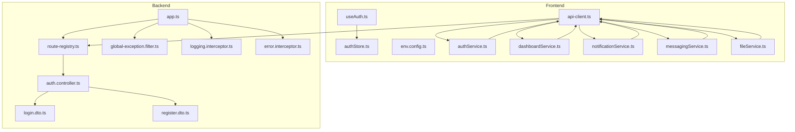

**Diagram sources**
- [frontend/src/lib/api-client.ts](file://frontend/src/lib/api-client.ts)
- [frontend/src/hooks/useAuth.ts](file://frontend/src/hooks/useAuth.ts)
- [frontend/src/stores/authStore.ts](file://frontend/src/stores/authStore.ts)
- [frontend/src/config/env.config.ts](file://frontend/src/config/env.config.ts)
- [frontend/src/features/auth/services/authService.ts](file://frontend/src/features/auth/services/authService.ts)
- [frontend/src/features/dashboard/services/dashboardService.ts](file://frontend/src/features/dashboard/services/dashboardService.ts)
- [frontend/src/features/notifications/services/notificationService.ts](file://frontend/src/features/notifications/services/notificationService.ts)
- [frontend/src/features/messagerie/services/messagingService.ts](file://frontend/src/features/messagerie/services/messagingService.ts)
- [frontend/src/features/files/services/fileService.ts](file://frontend/src/features/files/services/fileService.ts)
- [backend/src/app.ts](file://backend/src/app.ts)
- [backend/src/routes/route-registry.ts](file://backend/src/routes/route-registry.ts)
- [backend/src/modules/auth/controllers/auth.controller.ts](file://backend/src/modules/auth/controllers/auth.controller.ts)
- [backend/src/modules/auth/dto/login.dto.ts](file://backend/src/modules/auth/dto/login.dto.ts)
- [backend/src/modules/auth/dto/dto/register.dto.ts](file://backend/src/modules/auth/dto/register.dto.ts)
- [backend/src/common/filters/global-exception.filter.ts](file://backend/src/common/filters/global-exception.filter.ts)
- [backend/src/common/interceptors/logging.interceptor.ts](file://backend/src/common/interceptors/logging.interceptor.ts)
- [backend/src/common/interceptors/error.interceptor.ts](file://backend/src/common/interceptors/error.interceptor.ts)

**Section sources**
- [frontend/src/lib/api-client.ts](file://frontend/src/lib/api-client.ts)
- [backend/src/app.ts](file://backend/src/app.ts)
- [backend/src/routes/route-registry.ts](file://backend/src/routes/route-registry.ts)

## Core Components
- Centralized HTTP client (Axios instance): Base URL, headers, timeouts, and interceptor chain for auth, logging, errors, and response normalization.
- Authentication flow: Login/logout endpoints, token storage, and automatic header injection via interceptors.
- Feature services: Typed methods that encapsulate domain-specific API calls (auth, dashboard, notifications, messaging, files).
- Global error handling: Consistent error shapes and user-facing messages.
- Real-time communication: WebSocket service for live updates.
- File uploads: Multipart/form-data handling with progress tracking.
- Versioning strategy: URL-based or header-based versioning applied at the client level.

Key responsibilities and interactions are illustrated below.

**Section sources**
- [frontend/src/lib/api-client.ts](file://frontend/src/lib/api-client.ts)
- [frontend/src/features/auth/services/authService.ts](file://frontend/src/features/auth/services/authService.ts)
- [frontend/src/features/dashboard/services/dashboardService.ts](file://frontend/src/features/dashboard/services/dashboardService.ts)
- [frontend/src/features/notifications/services/notificationService.ts](file://frontend/src/features/notifications/services/notificationService.ts)
- [frontend/src/features/messagerie/services/messagingService.ts](file://frontend/src/features/messagerie/services/messagingService.ts)
- [frontend/src/features/files/services/fileService.ts](file://frontend/src/features/files/services/fileService.ts)

## Architecture Overview
The integration follows a layered approach:
- Services call the centralized HTTP client.
- The HTTP client applies interceptors for auth, logging, and error handling.
- Backend routes map to controllers; controllers validate DTOs and return standardized responses.
- Global filters and interceptors normalize errors and logs.

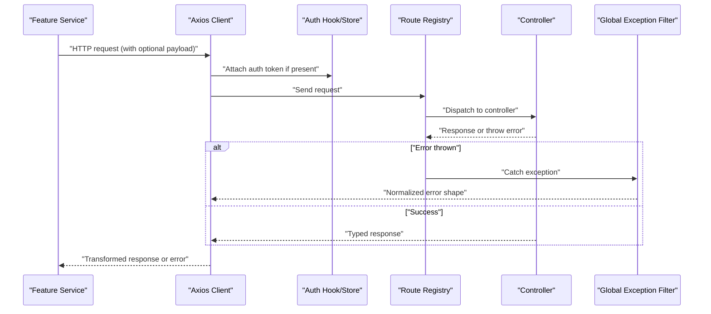

**Diagram sources**
- [frontend/src/lib/api-client.ts](file://frontend/src/lib/api-client.ts)
- [frontend/src/hooks/useAuth.ts](file://frontend/src/hooks/useAuth.ts)
- [frontend/src/stores/authStore.ts](file://frontend/src/stores/authStore.ts)
- [backend/src/routes/route-registry.ts](file://backend/src/routes/route-registry.ts)
- [backend/src/modules/auth/controllers/auth.controller.ts](file://backend/src/modules/auth/controllers/auth.controller.ts)
- [backend/src/common/filters/global-exception.filter.ts](file://backend/src/common/filters/global-exception.filter.ts)

## Detailed Component Analysis

### Centralized HTTP Client Configuration
Responsibilities:
- Base URL and default headers.
- Interceptors for:
  - Authentication: attach tokens, refresh on 401 where applicable.
  - Logging: request/response metadata.
  - Error handling: transform backend errors into consistent shapes.
  - Response transformation: normalize payloads and unwrap data envelopes.
- Timeouts and retries for idempotent requests.

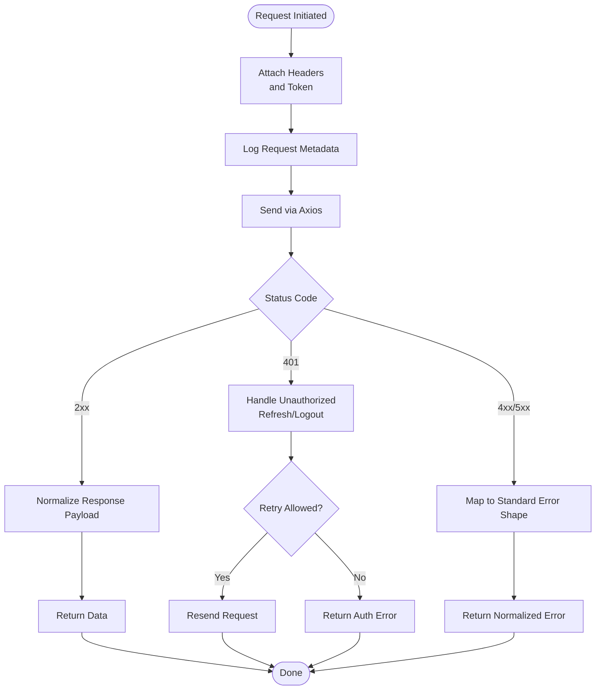

**Diagram sources**
- [frontend/src/lib/api-client.ts](file://frontend/src/lib/api-client.ts)

**Section sources**
- [frontend/src/lib/api-client.ts](file://frontend/src/lib/api-client.ts)

### Authentication Flow and Token Management
Responsibilities:
- Login endpoint returns tokens stored securely.
- Interceptors inject Authorization headers automatically.
- On 401, attempt token refresh or force logout depending on policy.
- Auth state persisted in store and consumed by hooks.

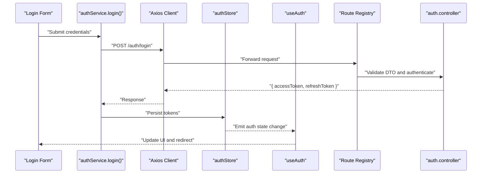

**Diagram sources**
- [frontend/src/features/auth/services/authService.ts](file://frontend/src/features/auth/services/authService.ts)
- [frontend/src/stores/authStore.ts](file://frontend/src/stores/authStore.ts)
- [frontend/src/hooks/useAuth.ts](file://frontend/src/hooks/useAuth.ts)
- [backend/src/routes/route-registry.ts](file://backend/src/routes/route-registry.ts)
- [backend/src/modules/auth/controllers/auth.controller.ts](file://backend/src/modules/auth/controllers/auth.controller.ts)

**Section sources**
- [frontend/src/features/auth/services/authService.ts](file://frontend/src/features/auth/services/authService.ts)
- [frontend/src/stores/authStore.ts](file://frontend/src/stores/authStore.ts)
- [frontend/src/hooks/useAuth.ts](file://frontend/src/hooks/useAuth.ts)
- [backend/src/modules/auth/controllers/auth.controller.ts](file://backend/src/modules/auth/controllers/auth.controller.ts)

### Typed API Methods Generation from Backend DTOs
Approach:
- Backend defines DTOs for input validation and documentation.
- Frontend mirrors types/interfaces based on these DTOs to ensure type safety across the stack.
- Services expose strongly-typed methods that accept DTO-like inputs and return typed responses.

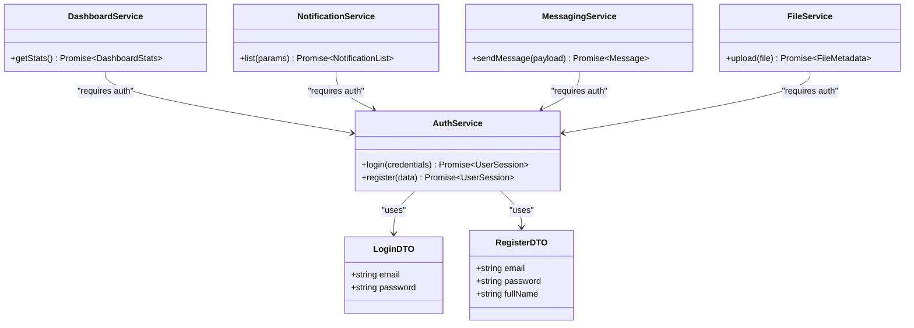

**Diagram sources**
- [backend/src/modules/auth/dto/login.dto.ts](file://backend/src/modules/auth/dto/login.dto.ts)
- [backend/src/modules/auth/dto/register.dto.ts](file://backend/src/modules/auth/dto/register.dto.ts)
- [frontend/src/features/auth/services/authService.ts](file://frontend/src/features/auth/services/authService.ts)
- [frontend/src/features/dashboard/services/dashboardService.ts](file://frontend/src/features/dashboard/services/dashboardService.ts)
- [frontend/src/features/notifications/services/notificationService.ts](file://frontend/src/features/notifications/services/notificationService.ts)
- [frontend/src/features/messagerie/services/messagingService.ts](file://frontend/src/features/messagerie/services/messagingService.ts)
- [frontend/src/features/files/services/fileService.ts](file://frontend/src/features/files/services/fileService.ts)

**Section sources**
- [backend/src/modules/auth/dto/login.dto.ts](file://backend/src/modules/auth/dto/login.dto.ts)
- [backend/src/modules/auth/dto/register.dto.ts](file://backend/src/modules/auth/dto/register.dto.ts)
- [frontend/src/features/auth/services/authService.ts](file://frontend/src/features/auth/services/authService.ts)
- [frontend/src/features/dashboard/services/dashboardService.ts](file://frontend/src/features/dashboard/services/dashboardService.ts)
- [frontend/src/features/notifications/services/notificationService.ts](file://frontend/src/features/notifications/services/notificationService.ts)
- [frontend/src/features/messagerie/services/messagingService.ts](file://frontend/src/features/messagerie/services/messagingService.ts)
- [frontend/src/features/files/services/fileService.ts](file://frontend/src/features/files/services/fileService.ts)

### Error Handling Strategies
- Backend:
  - Global exception filter normalizes exceptions into consistent JSON structures.
  - Interceptors log errors and enrich context.
- Frontend:
  - Axios interceptors map HTTP status codes and server messages to unified error objects.
  - User-friendly messages and actionable feedback are provided.

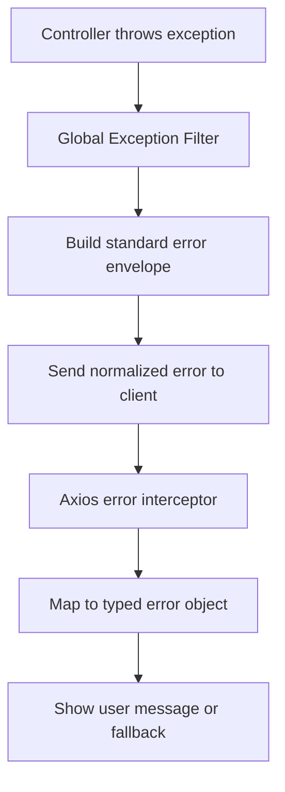

**Diagram sources**
- [backend/src/common/filters/global-exception.filter.ts](file://backend/src/common/filters/global-exception.filter.ts)
- [backend/src/common/interceptors/error.interceptor.ts](file://backend/src/common/interceptors/error.interceptor.ts)
- [frontend/src/lib/api-client.ts](file://frontend/src/lib/api-client.ts)

**Section sources**
- [backend/src/common/filters/global-exception.filter.ts](file://backend/src/common/filters/global-exception.filter.ts)
- [backend/src/common/interceptors/error.interceptor.ts](file://backend/src/common/interceptors/error.interceptor.ts)
- [frontend/src/lib/api-client.ts](file://frontend/src/lib/api-client.ts)

### Retry Mechanisms
- Idempotent GET requests can be retried with exponential backoff.
- Non-idempotent mutations should not auto-retry unless explicitly requested.
- Retries respect circuit breaker thresholds to avoid cascading failures.

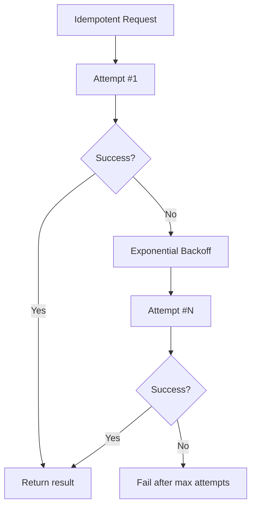

[No diagram sources needed since this diagram shows conceptual workflow]

**Section sources**
- [frontend/src/lib/api-client.ts](file://frontend/src/lib/api-client.ts)

### Offline Support Patterns
- Cache successful GET responses using a lightweight cache layer.
- Queue failed mutations when offline and replay when connectivity resumes.
- Provide optimistic UI updates with rollback on failure.

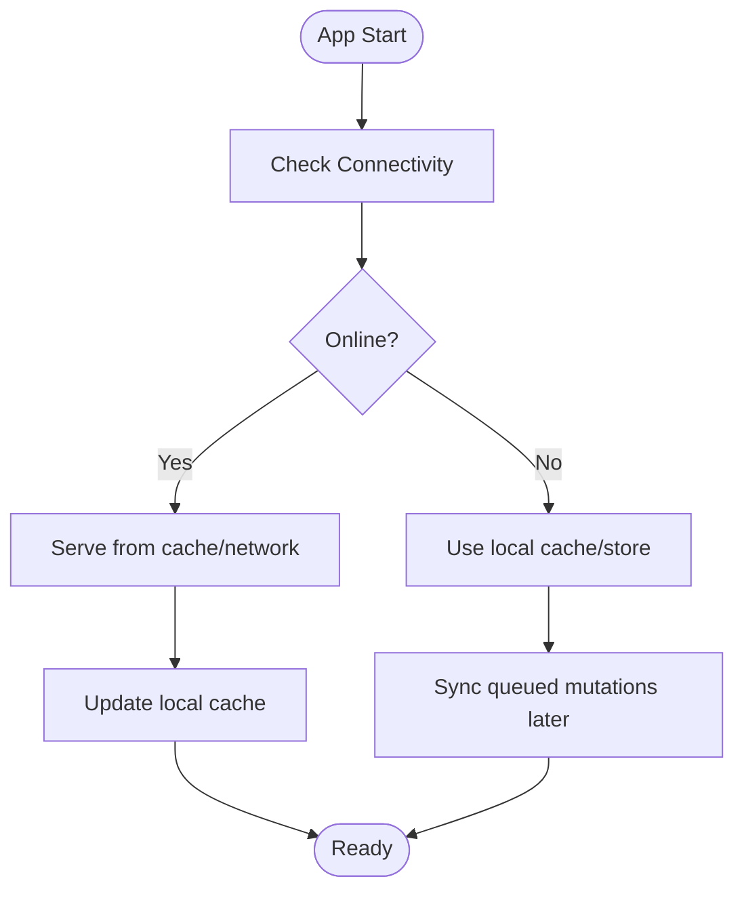

[No diagram sources needed since this diagram shows conceptual workflow]

**Section sources**
- [frontend/src/lib/api-client.ts](file://frontend/src/lib/api-client.ts)

### WebSocket Integration for Real-Time Features
- Dedicated WebSocket service manages connection lifecycle, reconnection, and event routing.
- Integrates with auth to send tokens during handshake.
- Provides typed event handlers for features like notifications and messaging.

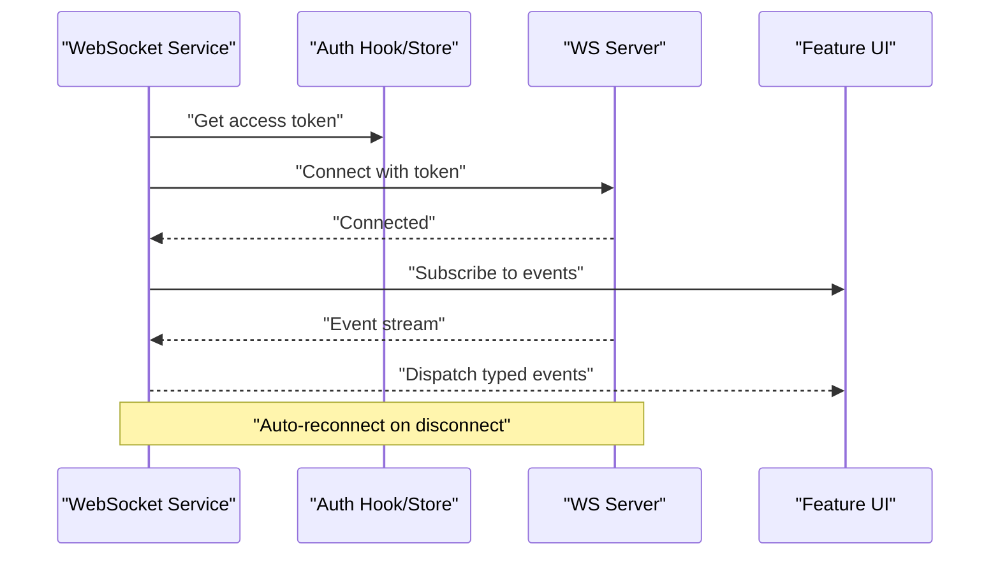

**Diagram sources**
- [frontend/src/features/messagerie/services/messagingService.ts](file://frontend/src/features/messagerie/services/messagingService.ts)
- [frontend/src/features/notifications/services/notificationService.ts](file://frontend/src/features/notifications/services/notificationService.ts)
- [frontend/src/hooks/useAuth.ts](file://frontend/src/hooks/useAuth.ts)
- [frontend/src/stores/authStore.ts](file://frontend/src/stores/authStore.ts)

**Section sources**
- [frontend/src/features/messagerie/services/messagingService.ts](file://frontend/src/features/messagerie/services/messagingService.ts)
- [frontend/src/features/notifications/services/notificationService.ts](file://frontend/src/features/notifications/services/notificationService.ts)
- [frontend/src/hooks/useAuth.ts](file://frontend/src/hooks/useAuth.ts)
- [frontend/src/stores/authStore.ts](file://frontend/src/stores/authStore.ts)

### File Upload Handling
- Uses multipart/form-data for uploads.
- Progress tracking via upload events.
- Handles large files with chunking options and cancellation.

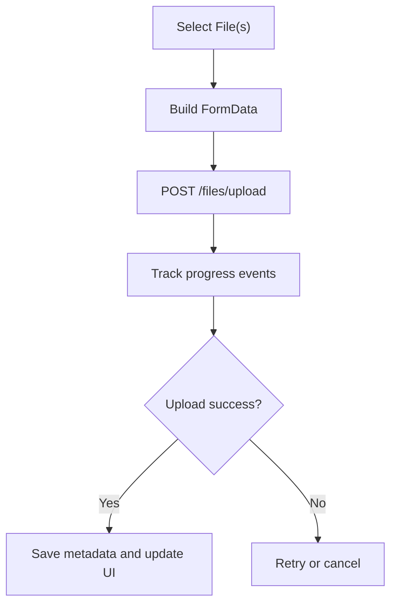

**Diagram sources**
- [frontend/src/features/files/services/fileService.ts](file://frontend/src/features/files/services/fileService.ts)
- [frontend/src/lib/api-client.ts](file://frontend/src/lib/api-client.ts)

**Section sources**
- [frontend/src/features/files/services/fileService.ts](file://frontend/src/features/files/services/fileService.ts)
- [frontend/src/lib/api-client.ts](file://frontend/src/lib/api-client.ts)

### API Versioning Strategies
- Prefer URL path versioning (e.g., /api/v1/...) for clarity and caching benefits.
- Alternatively, use Accept headers for content negotiation.
- Maintain backward compatibility by deprecating old versions gradually.

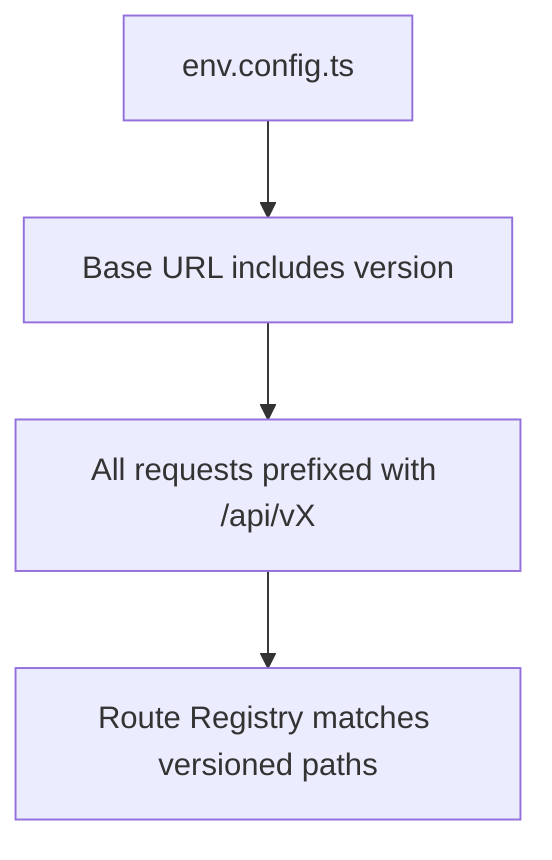

**Diagram sources**
- [frontend/src/config/env.config.ts](file://frontend/src/config/env.config.ts)
- [backend/src/routes/route-registry.ts](file://backend/src/routes/route-registry.ts)

**Section sources**
- [frontend/src/config/env.config.ts](file://frontend/src/config/env.config.ts)
- [backend/src/routes/route-registry.ts](file://backend/src/routes/route-registry.ts)

### Testing Strategies and Mock Data Management
- Unit tests for services: mock Axios and verify method contracts.
- Integration tests: spin up test containers for backend and run end-to-end flows.
- Mock data: define fixtures aligned with backend DTOs to keep tests deterministic.
- E2E tests: use Playwright/Cypress to exercise full flows including auth and uploads.

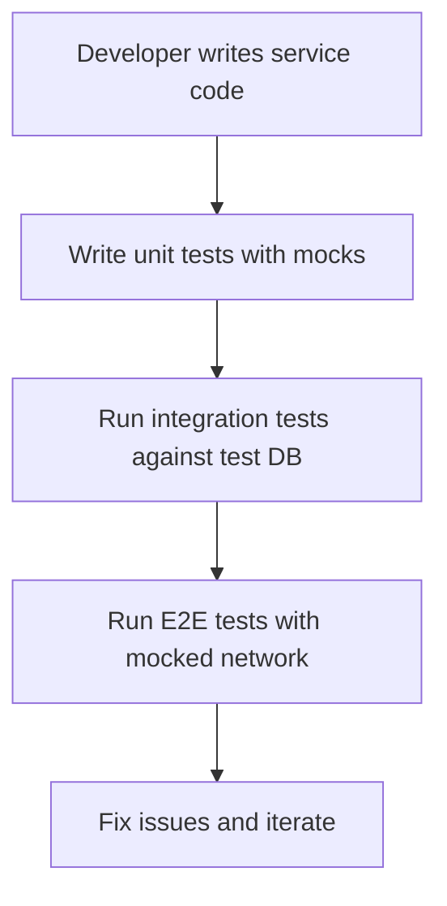

[No diagram sources needed since this diagram shows conceptual workflow]

**Section sources**
- [frontend/src/features/auth/services/authService.ts](file://frontend/src/features/auth/services/authService.ts)
- [frontend/src/features/dashboard/services/dashboardService.ts](file://frontend/src/features/dashboard/services/dashboardService.ts)
- [frontend/src/features/notifications/services/notificationService.ts](file://frontend/src/features/notifications/services/notificationService.ts)
- [frontend/src/features/messagerie/services/messagingService.ts](file://frontend/src/features/messagerie/services/messagingService.ts)
- [frontend/src/features/files/services/fileService.ts](file://frontend/src/features/files/services/fileService.ts)

## Dependency Analysis
Frontend dependencies include Axios for HTTP, WebSocket libraries for real-time, and state management for auth. Backend dependencies include NestJS framework components for controllers, DTOs, filters, and interceptors.

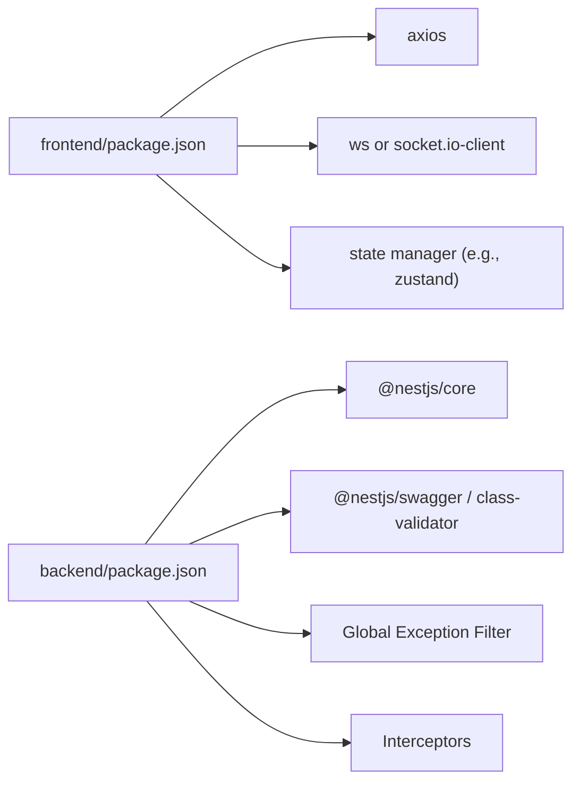

**Diagram sources**
- [frontend/package.json](file://frontend/package.json)
- [backend/package.json](file://backend/package.json)

**Section sources**
- [frontend/package.json](file://frontend/package.json)
- [backend/package.json](file://backend/package.json)

## Performance Considerations
- Minimize payload sizes by selecting fields and pagination.
- Enable compression and caching headers where appropriate.
- Debounce search queries and paginate lists.
- Use WebSocket for high-frequency updates instead of polling.
- Implement request deduplication to avoid redundant calls.

[No sources needed since this section provides general guidance]

## Troubleshooting Guide
Common issues and resolutions:
- 401 Unauthorized: Ensure token presence and refresh logic; check CORS and cookie settings.
- Network errors: Verify base URL, proxy config, and connectivity; inspect interceptor logs.
- Validation errors: Align frontend DTOs with backend DTOs; review error shapes.
- WebSocket drops: Implement reconnection with exponential backoff; monitor heartbeat.

**Section sources**
- [frontend/src/lib/api-client.ts](file://frontend/src/lib/api-client.ts)
- [backend/src/common/filters/global-exception.filter.ts](file://backend/src/common/filters/global-exception.filter.ts)
- [backend/src/common/interceptors/logging.interceptor.ts](file://backend/src/common/interceptors/logging.interceptor.ts)

## Conclusion
The API integration layer centralizes HTTP concerns, enforces consistent error handling, and provides typed, maintainable services aligned with backend DTOs. With robust authentication, real-time capabilities, file uploads, and thoughtful versioning and testing strategies, the system remains scalable and developer-friendly.

[No sources needed since this section summarizes without analyzing specific files]

## Appendices

### Environment Configuration
- Base URL and API version are configured centrally.
- Feature flags and timeouts are defined here.

**Section sources**
- [frontend/src/config/env.config.ts](file://frontend/src/config/env.config.ts)

### Application Bootstrap and Routing
- Backend app bootstraps middleware, filters, and interceptors.
- Route registry maps URLs to controllers.

**Section sources**
- [backend/src/app.ts](file://backend/src/app.ts)
- [backend/src/routes/route-registry.ts](file://backend/src/routes/route-registry.ts)