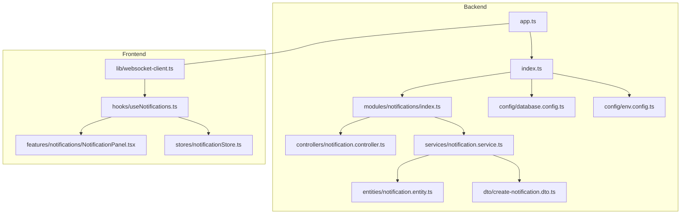
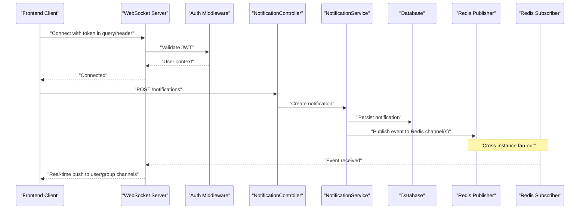
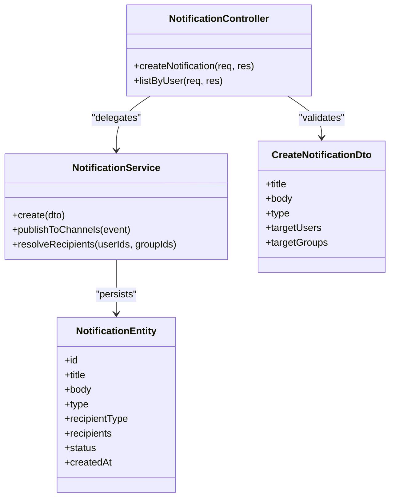
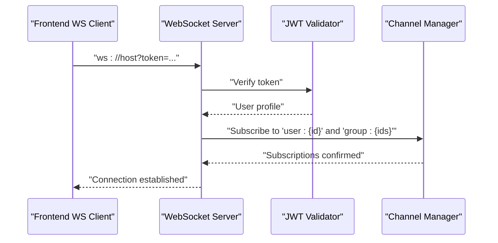
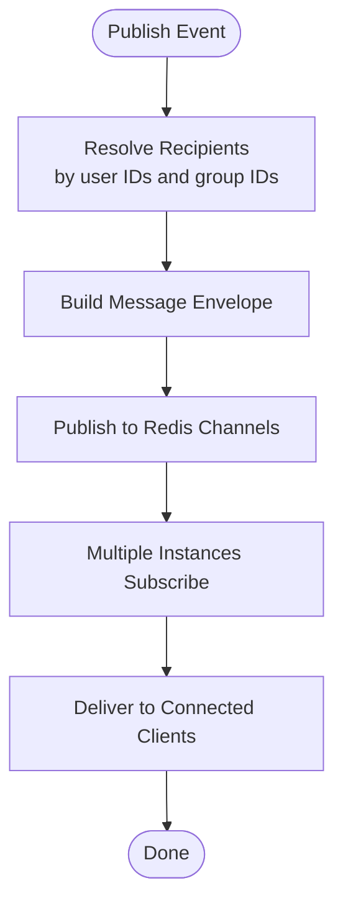
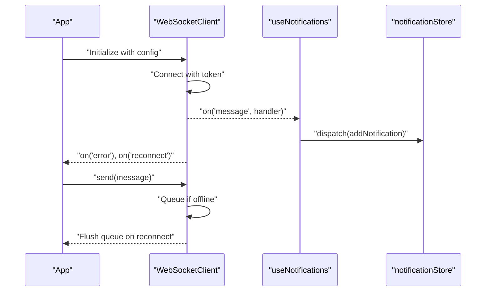
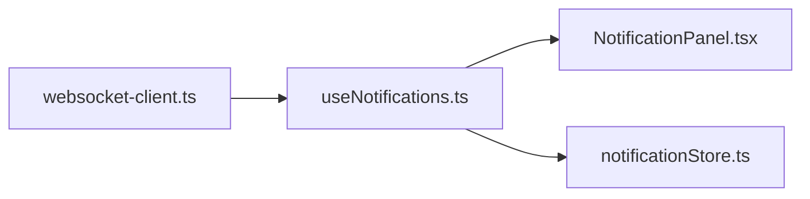
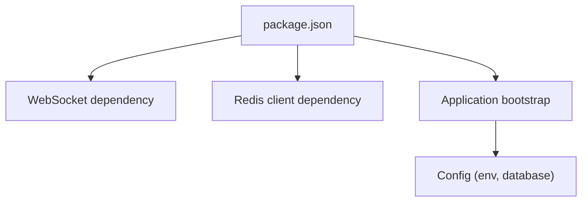

# Real-time Integration

<cite>
**Referenced Files in This Document**
- [backend/src/modules/notifications/index.ts](file://backend/src/modules/notifications/index.ts)
- [backend/src/modules/notifications/services/notification.service.ts](file://backend/src/modules/notifications/services/notification.service.ts)
- [backend/src/modules/notifications/controllers/notification.controller.ts](file://backend/src/modules/notifications/controllers/notification.controller.ts)
- [backend/src/modules/notifications/dto/create-notification.dto.ts](file://backend/src/modules/notifications/dto/create-notification.dto.ts)
- [backend/src/modules/notifications/entities/notification.entity.ts](file://backend/src/modules/notifications/entities/notification.entity.ts)
- [backend/src/config/database.config.ts](file://backend/src/config/database.config.ts)
- [backend/src/config/env.config.ts](file://backend/src/config/env.config.ts)
- [backend/src/app.ts](file://backend/src/app.ts)
- [backend/src/index.ts](file://backend/src/index.ts)
- [backend/package.json](file://backend/package.json)
- [frontend/src/lib/websocket-client.ts](file://frontend/src/lib/websocket-client.ts)
- [frontend/src/hooks/useNotifications.ts](file://frontend/src/hooks/useNotifications.ts)
- [frontend/src/features/notifications/NotificationPanel.tsx](file://frontend/src/features/notifications/NotificationPanel.tsx)
- [frontend/src/stores/notificationStore.ts](file://frontend/src/stores/notificationStore.ts)
</cite>

## Table of Contents
1. [Introduction](#introduction)
2. [Project Structure](#project-structure)
3. [Core Components](#core-components)
4. [Architecture Overview](#architecture-overview)
5. [Detailed Component Analysis](#detailed-component-analysis)
6. [Dependency Analysis](#dependency-analysis)
7. [Performance Considerations](#performance-considerations)
8. [Troubleshooting Guide](#troubleshooting-guide)
9. [Conclusion](#conclusion)
10. [Appendices](#appendices)

## Introduction
This document explains the real-time communication features implemented with WebSockets and Redis, focusing on connection establishment, authentication handshake, channel-based messaging, and the notification system architecture. It also covers frontend client behavior (reconnection, error handling, offline queue), broadcasting patterns for users and groups, large-scale delivery strategies, performance considerations, scaling approaches, and debugging techniques.

## Project Structure
The real-time integration spans backend modules for notifications and configuration, and frontend components for WebSocket client management and UI rendering.

**Diagram sources**
- [backend/src/app.ts](file://backend/src/app.ts)
- [backend/src/index.ts](file://backend/src/index.ts)
- [backend/src/modules/notifications/index.ts](file://backend/src/modules/notifications/index.ts)
- [backend/src/modules/notifications/controllers/notification.controller.ts](file://backend/src/modules/notifications/controllers/notification.controller.ts)
- [backend/src/modules/notifications/services/notification.service.ts](file://backend/src/modules/notifications/services/notification.service.ts)
- [backend/src/modules/notifications/entities/notification.entity.ts](file://backend/src/modules/notifications/entities/notification.entity.ts)
- [backend/src/modules/notifications/dto/create-notification.dto.ts](file://backend/src/modules/notifications/dto/create-notification.dto.ts)
- [backend/src/config/database.config.ts](file://backend/src/config/database.config.ts)
- [backend/src/config/env.config.ts](file://backend/src/config/env.config.ts)
- [frontend/src/lib/websocket-client.ts](file://frontend/src/lib/websocket-client.ts)
- [frontend/src/hooks/useNotifications.ts](file://frontend/src/hooks/useNotifications.ts)
- [frontend/src/features/notifications/NotificationPanel.tsx](file://frontend/src/features/notifications/NotificationPanel.tsx)
- [frontend/src/stores/notificationStore.ts](file://frontend/src/stores/notificationStore.ts)

**Section sources**
- [backend/src/app.ts](file://backend/src/app.ts)
- [backend/src/index.ts](file://backend/src/index.ts)
- [backend/src/modules/notifications/index.ts](file://backend/src/modules/notifications/index.ts)
- [backend/src/config/database.config.ts](file://backend/src/config/database.config.ts)
- [backend/src/config/env.config.ts](file://backend/src/config/env.config.ts)
- [frontend/src/lib/websocket-client.ts](file://frontend/src/lib/websocket-client.ts)
- [frontend/src/hooks/useNotifications.ts](file://frontend/src/hooks/useNotifications.ts)
- [frontend/src/features/notifications/NotificationPanel.tsx](file://frontend/src/features/notifications/NotificationPanel.tsx)
- [frontend/src/stores/notificationStore.ts](file://frontend/src/stores/notificationStore.ts)

## Core Components
- Notification module entrypoint: registers routes and wires controllers to services.
- Controller: exposes REST endpoints to create notifications and triggers real-time distribution.
- Service: orchestrates persistence, Redis pub/sub publishing, and user/group targeting.
- Entity and DTO: define data contracts and validation rules.
- Frontend WebSocket client: manages connection lifecycle, reconnection, and message routing.
- Hooks and stores: integrate WebSocket events into React state and UI.

Key responsibilities:
- Connection establishment and authentication handshake via query parameters or headers.
- Channel-based messaging using Redis channels per user or group.
- Event types and message formats standardized across backend and frontend.
- Offline queueing on the frontend when disconnected; replay upon reconnect.

**Section sources**
- [backend/src/modules/notifications/index.ts](file://backend/src/modules/notifications/index.ts)
- [backend/src/modules/notifications/controllers/notification.controller.ts](file://backend/src/modules/notifications/controllers/notification.controller.ts)
- [backend/src/modules/notifications/services/notification.service.ts](file://backend/src/modules/notifications/services/notification.service.ts)
- [backend/src/modules/notifications/entities/notification.entity.ts](file://backend/src/modules/notifications/entities/notification.entity.ts)
- [backend/src/modules/notifications/dto/create-notification.dto.ts](file://backend/src/modules/notifications/dto/create-notification.dto.ts)
- [frontend/src/lib/websocket-client.ts](file://frontend/src/lib/websocket-client.ts)
- [frontend/src/hooks/useNotifications.ts](file://frontend/src/hooks/useNotifications.ts)
- [frontend/src/stores/notificationStore.ts](file://frontend/src/stores/notificationStore.ts)

## Architecture Overview
The system uses a hybrid approach:
- HTTP endpoints for creating notifications and managing preferences.
- WebSockets for low-latency delivery to connected clients.
- Redis pub/sub for scalable fan-out to multiple backend instances and horizontal scaling.

**Diagram sources**
- [backend/src/modules/notifications/controllers/notification.controller.ts](file://backend/src/modules/notifications/controllers/notification.controller.ts)
- [backend/src/modules/notifications/services/notification.service.ts](file://backend/src/modules/notifications/services/notification.service.ts)
- [backend/src/modules/notifications/index.ts](file://backend/src/modules/notifications/index.ts)
- [backend/src/config/env.config.ts](file://backend/src/config/env.config.ts)
- [frontend/src/lib/websocket-client.ts](file://frontend/src/lib/websocket-client.ts)

## Detailed Component Analysis

### Backend Notification Module
Responsibilities:
- Register routes and middleware.
- Validate payloads via DTOs.
- Persist notifications and publish events to Redis.
- Target recipients by user ID or group membership.

**Diagram sources**
- [backend/src/modules/notifications/controllers/notification.controller.ts](file://backend/src/modules/notifications/controllers/notification.controller.ts)
- [backend/src/modules/notifications/services/notification.service.ts](file://backend/src/modules/notifications/services/notification.service.ts)
- [backend/src/modules/notifications/entities/notification.entity.ts](file://backend/src/modules/notifications/entities/notification.entity.ts)
- [backend/src/modules/notifications/dto/create-notification.dto.ts](file://backend/src/modules/notifications/dto/create-notification.dto.ts)

**Section sources**
- [backend/src/modules/notifications/index.ts](file://backend/src/modules/notifications/index.ts)
- [backend/src/modules/notifications/controllers/notification.controller.ts](file://backend/src/modules/notifications/controllers/notification.controller.ts)
- [backend/src/modules/notifications/services/notification.service.ts](file://backend/src/modules/notifications/services/notification.service.ts)
- [backend/src/modules/notifications/entities/notification.entity.ts](file://backend/src/modules/notifications/entities/notification.entity.ts)
- [backend/src/modules/notifications/dto/create-notification.dto.ts](file://backend/src/modules/notifications/dto/create-notification.dto.ts)

### WebSocket Connection and Authentication Handshake
Flow:
- Client connects with a valid JWT provided in query parameters or headers.
- Server validates the token and binds the socket to the authenticated user context.
- Server subscribes the client to personal and group channels based on roles and memberships.

**Diagram sources**
- [backend/src/app.ts](file://backend/src/app.ts)
- [backend/src/index.ts](file://backend/src/index.ts)
- [backend/src/config/env.config.ts](file://backend/src/config/env.config.ts)

**Section sources**
- [backend/src/app.ts](file://backend/src/app.ts)
- [backend/src/index.ts](file://backend/src/index.ts)
- [backend/src/config/env.config.ts](file://backend/src/config/env.config.ts)

### Channel-Based Messaging Patterns
Patterns:
- Personal channel: one-to-one delivery to a specific user.
- Group channel: broadcast to all members of a group.
- Topic channel: optional cross-cutting topics (e.g., announcements).

Message format:
- Envelope includes type, payload, timestamp, and metadata such as sender and target identifiers.

Delivery mechanism:
- Backend publishes messages to Redis channels; subscribers forward them to connected sockets.

**Diagram sources**
- [backend/src/modules/notifications/services/notification.service.ts](file://backend/src/modules/notifications/services/notification.service.ts)
- [backend/src/config/env.config.ts](file://backend/src/config/env.config.ts)

**Section sources**
- [backend/src/modules/notifications/services/notification.service.ts](file://backend/src/modules/notifications/services/notification.service.ts)
- [backend/src/config/env.config.ts](file://backend/src/config/env.config.ts)

### Frontend WebSocket Client
Features:
- Automatic reconnection with exponential backoff.
- Error handling and retry logic.
- Offline queue management to buffer outgoing messages while disconnected.
- Event routing to hooks and stores for UI updates.

**Diagram sources**
- [frontend/src/lib/websocket-client.ts](file://frontend/src/lib/websocket-client.ts)
- [frontend/src/hooks/useNotifications.ts](file://frontend/src/hooks/useNotifications.ts)
- [frontend/src/stores/notificationStore.ts](file://frontend/src/stores/notificationStore.ts)

**Section sources**
- [frontend/src/lib/websocket-client.ts](file://frontend/src/lib/websocket-client.ts)
- [frontend/src/hooks/useNotifications.ts](file://frontend/src/hooks/useNotifications.ts)
- [frontend/src/stores/notificationStore.ts](file://frontend/src/stores/notificationStore.ts)

### Notification UI Integration
- The hook subscribes to WebSocket events and updates local state.
- The panel renders notifications and supports actions like mark-as-read.
- The store persists unread counts and provides selectors for UI.

**Diagram sources**
- [frontend/src/lib/websocket-client.ts](file://frontend/src/lib/websocket-client.ts)
- [frontend/src/hooks/useNotifications.ts](file://frontend/src/hooks/useNotifications.ts)
- [frontend/src/features/notifications/NotificationPanel.tsx](file://frontend/src/features/notifications/NotificationPanel.tsx)
- [frontend/src/stores/notificationStore.ts](file://frontend/src/stores/notificationStore.ts)

**Section sources**
- [frontend/src/features/notifications/NotificationPanel.tsx](file://frontend/src/features/notifications/NotificationPanel.tsx)
- [frontend/src/hooks/useNotifications.ts](file://frontend/src/hooks/useNotifications.ts)
- [frontend/src/stores/notificationStore.ts](file://frontend/src/stores/notificationStore.ts)

## Dependency Analysis
External dependencies relevant to real-time features include WebSocket libraries and Redis client packages. These are declared in the backend package manifest.

**Diagram sources**
- [backend/package.json](file://backend/package.json)
- [backend/src/config/env.config.ts](file://backend/src/config/env.config.ts)
- [backend/src/config/database.config.ts](file://backend/src/config/database.config.ts)

**Section sources**
- [backend/package.json](file://backend/package.json)
- [backend/src/config/env.config.ts](file://backend/src/config/env.config.ts)
- [backend/src/config/database.config.ts](file://backend/src/config/database.config.ts)

## Performance Considerations
- Use Redis pub/sub for fan-out to avoid N+1 socket writes.
- Batch small notifications when possible to reduce overhead.
- Apply rate limiting at the controller level for high-volume producers.
- Prefer lightweight message envelopes; move heavy payloads to references.
- Monitor memory and CPU on both Node.js and Redis; scale horizontally with more instances behind a load balancer.
- Tune WebSocket heartbeat intervals and timeouts to balance responsiveness and resource usage.

[No sources needed since this section provides general guidance]

## Troubleshooting Guide
Common issues and diagnostics:
- Connection failures: verify token validity and CORS/proxy settings.
- Missing messages: check Redis connectivity and channel subscriptions.
- Duplicate notifications: ensure idempotency keys and deduplication logic.
- High latency: inspect Redis throughput and network hops; consider dedicated Redis instance.
- Frontend disconnects: review reconnection backoff and queue flush behavior.

Operational checks:
- Confirm environment variables for Redis host/port and WebSocket port.
- Validate database connectivity and schema migrations.
- Inspect logs around auth middleware and WebSocket handlers.

**Section sources**
- [backend/src/config/env.config.ts](file://backend/src/config/env.config.ts)
- [backend/src/config/database.config.ts](file://backend/src/config/database.config.ts)
- [backend/src/app.ts](file://backend/src/app.ts)
- [backend/src/index.ts](file://backend/src/index.ts)

## Conclusion
The real-time integration leverages WebSockets for immediate delivery and Redis for scalable fan-out. The notification module encapsulates creation, persistence, and distribution, while the frontend client ensures resilient connections and smooth UX through reconnection and offline queuing. With proper batching, rate limiting, and monitoring, the system can efficiently handle large-scale notifications across multiple instances.

[No sources needed since this section summarizes without analyzing specific files]

## Appendices

### Implementing Custom Real-time Features
- Define new event types and message envelopes following existing conventions.
- Extend the service to publish to additional Redis channels for custom topics.
- Update the frontend client to route new event types to appropriate hooks and stores.
- Add tests for both producer and consumer paths.

[No sources needed since this section doesn't analyze specific files]

### Broadcasting Examples
- Broadcast to a specific user: publish to the user’s personal channel.
- Broadcast to a group: publish to the group channel after resolving member IDs.
- Handle large audiences: use Redis pub/sub and consider topic sharding to distribute load.

[No sources needed since this section doesn't analyze specific files]