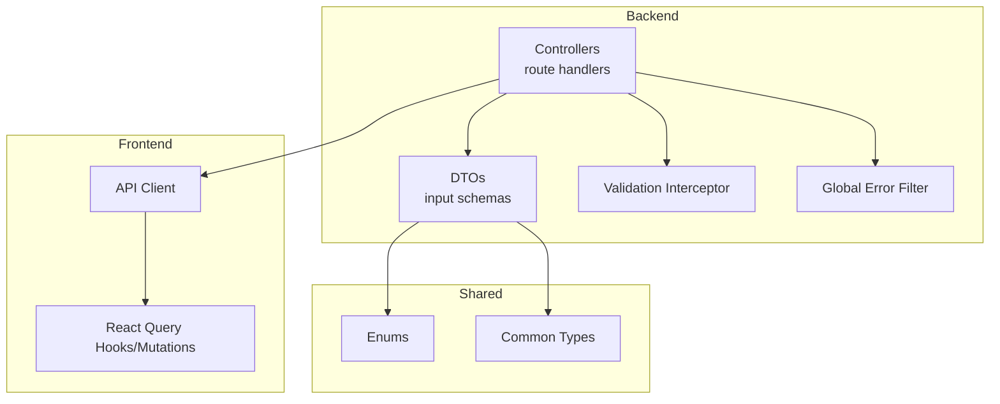
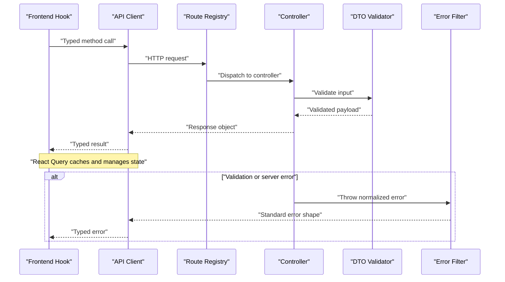
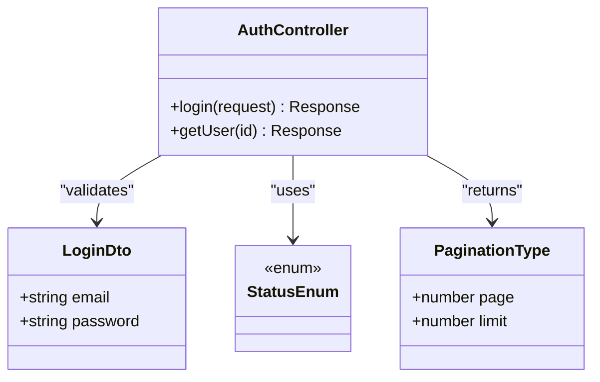
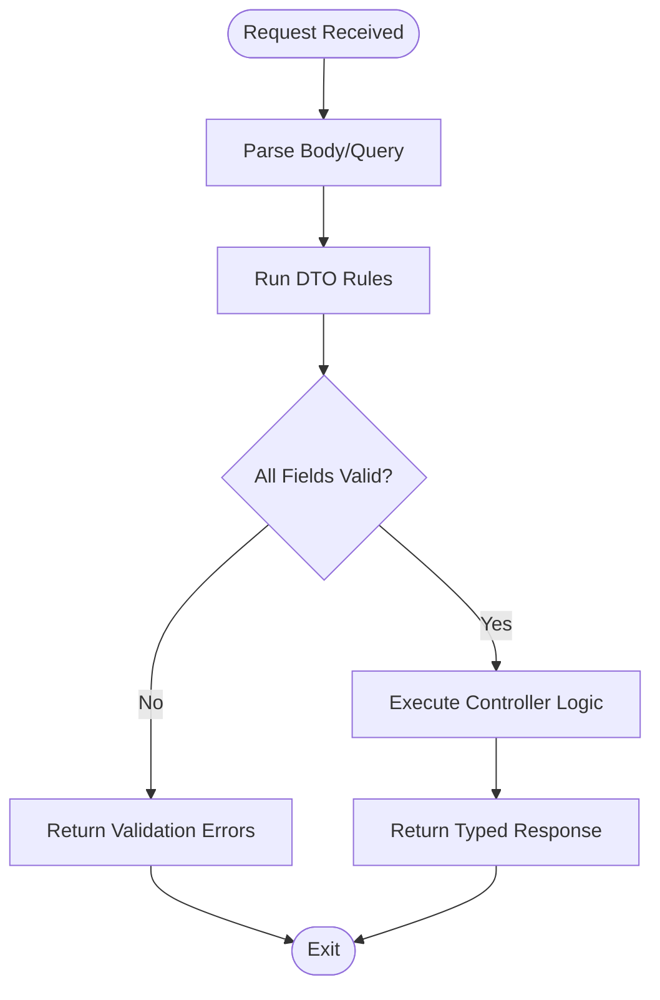
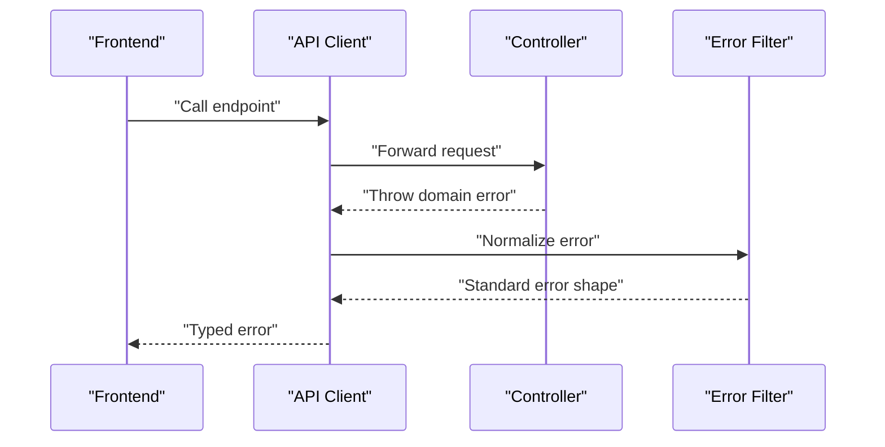
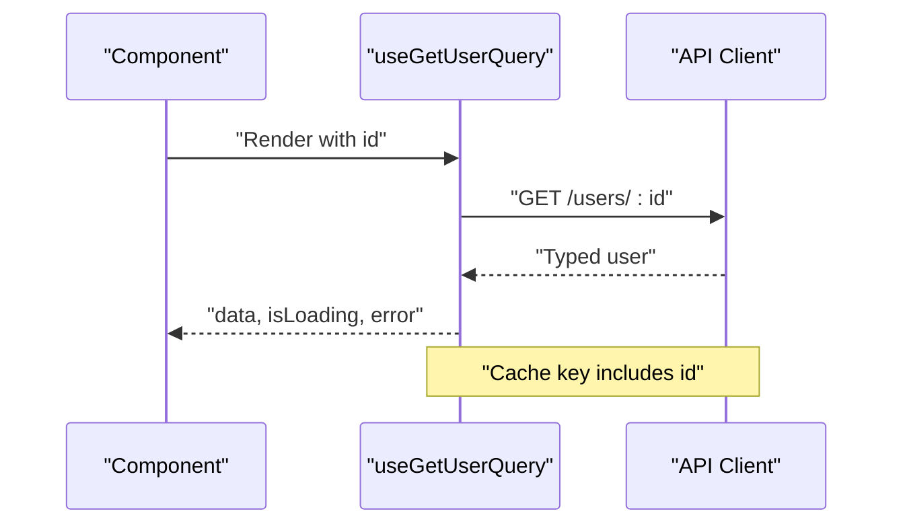
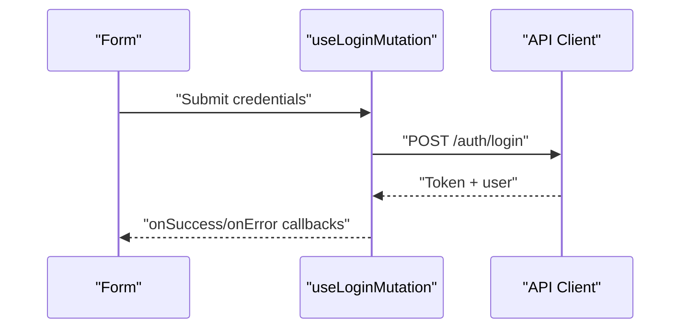
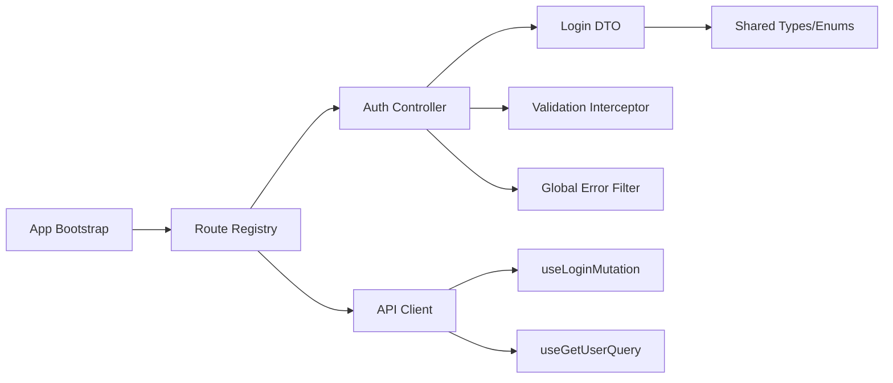

# Typed API Methods

<cite>
**Referenced Files in This Document**
- [backend/src/app.ts](file://backend/src/app.ts)
- [backend/src/routes/route-registry.ts](file://backend/src/routes/route-registry.ts)
- [backend/src/modules/auth/controllers/auth.controller.ts](file://backend/src/modules/auth/controllers/auth.controller.ts)
- [backend/src/modules/auth/dto/login.dto.ts](file://backend/src/modules/auth/dto/login.dto.ts)
- [backend/src/common/interceptors/validation.interceptor.ts](file://backend/src/common/interceptors/validation.interceptor.ts)
- [backend/src/common/filters/global-error.filter.ts](file://backend/src/common/filters/global-error.filter.ts)
- [frontend/src/lib/api-client.ts](file://frontend/src/lib/api-client.ts)
- [frontend/src/features/auth/hooks/useLoginMutation.ts](file://frontend/src/features/auth/hooks/useLoginMutation.ts)
- [frontend/src/features/auth/hooks/useGetUserQuery.ts](file://frontend/src/features/auth/hooks/useGetUserQuery.ts)
- [frontend/src/features/auth/types/auth.types.ts](file://frontend/src/features/auth/types/auth.types.ts)
- [shared/src/enums/status.enum.ts](file://shared/src/enums/status.enum.ts)
- [shared/src/types/pagination.type.ts](file://shared/src/types/pagination.type.ts)
</cite>

## Table of Contents
1. [Introduction](#introduction)
2. [Project Structure](#project-structure)
3. [Core Components](#core-components)
4. [Architecture Overview](#architecture-overview)
5. [Detailed Component Analysis](#detailed-component-analysis)
6. [Dependency Analysis](#dependency-analysis)
7. [Performance Considerations](#performance-considerations)
8. [Troubleshooting Guide](#troubleshooting-guide)
9. [Conclusion](#conclusion)
10. [Appendices](#appendices)

## Introduction
This document explains the typed API methods generation system that bridges backend controllers and DTOs to frontend TypeScript API methods with full type safety. It covers:
- How backend endpoints are defined using controllers and validated via DTOs
- How types flow from backend to frontend for request/response inference
- Method naming conventions, parameter validation, and response typing
- Integration with React Query for data fetching, caching, and state management
- Examples for creating new endpoints, handling file uploads, and managing API versioning
- Error mapping between backend and frontend
- Guidelines for maintaining type safety across the application

## Project Structure
The typed API pipeline spans three layers:
- Backend: Controllers define routes; DTOs define input schemas; interceptors validate requests; filters normalize errors
- Shared: Reusable types and enums used by both backend and frontend
- Frontend: A typed API client generates hooks and mutations integrated with React Query

**Diagram sources**
- [backend/src/app.ts](file://backend/src/app.ts)
- [backend/src/routes/route-registry.ts](file://backend/src/routes/route-registry.ts)
- [backend/src/modules/auth/controllers/auth.controller.ts](file://backend/src/modules/auth/controllers/auth.controller.ts)
- [backend/src/modules/auth/dto/login.dto.ts](file://backend/src/modules/auth/dto/login.dto.ts)
- [backend/src/common/interceptors/validation.interceptor.ts](file://backend/src/common/interceptors/validation.interceptor.ts)
- [backend/src/common/filters/global-error.filter.ts](file://backend/src/common/filters/global-error.filter.ts)
- [frontend/src/lib/api-client.ts](file://frontend/src/lib/api-client.ts)
- [frontend/src/features/auth/hooks/useLoginMutation.ts](file://frontend/src/features/auth/hooks/useLoginMutation.ts)
- [frontend/src/features/auth/hooks/useGetUserQuery.ts](file://frontend/src/features/auth/hooks/useGetUserQuery.ts)
- [shared/src/enums/status.enum.ts](file://shared/src/enums/status.enum.ts)
- [shared/src/types/pagination.type.ts](file://shared/src/types/pagination.type.ts)

**Section sources**
- [backend/src/app.ts](file://backend/src/app.ts)
- [backend/src/routes/route-registry.ts](file://backend/src/routes/route-registry.ts)
- [frontend/src/lib/api-client.ts](file://frontend/src/lib/api-client.ts)

## Core Components
- Controllers: Define HTTP endpoints and orchestrate business logic. They accept validated inputs and return structured responses.
- DTOs: Declare request payloads with field-level constraints (required fields, formats, ranges). These drive runtime validation and compile-time types.
- Validation Interceptor: Enforces DTO rules before controller execution and returns standardized validation errors.
- Global Error Filter: Normalizes all errors into a consistent shape for the frontend.
- Shared Types: Enums and common types shared between backend and frontend to ensure consistency.
- API Client: Centralized HTTP client with typed methods derived from backend contracts.
- React Query Hooks: Generated or hand-written hooks wrapping API client calls for fetching, caching, and mutations.

Key responsibilities:
- Type safety: Single source of truth for types via shared modules and DTOs
- Validation: Consistent input checks at the edge
- Error mapping: Predictable error shapes consumed by the frontend
- State management: React Query provides caching, background updates, and optimistic updates

**Section sources**
- [backend/src/modules/auth/controllers/auth.controller.ts](file://backend/src/modules/auth/controllers/auth.controller.ts)
- [backend/src/modules/auth/dto/login.dto.ts](file://backend/src/modules/auth/dto/login.dto.ts)
- [backend/src/common/interceptors/validation.interceptor.ts](file://backend/src/common/interceptors/validation.interceptor.ts)
- [backend/src/common/filters/global-error.filter.ts](file://backend/src/common/filters/global-error.filter.ts)
- [shared/src/enums/status.enum.ts](file://shared/src/enums/status.enum.ts)
- [shared/src/types/pagination.type.ts](file://shared/src/types/pagination.type.ts)
- [frontend/src/lib/api-client.ts](file://frontend/src/lib/api-client.ts)
- [frontend/src/features/auth/hooks/useLoginMutation.ts](file://frontend/src/features/auth/hooks/useLoginMutation.ts)
- [frontend/src/features/auth/hooks/useGetUserQuery.ts](file://frontend/src/features/auth/hooks/useGetUserQuery.ts)

## Architecture Overview
End-to-end flow from controller to React Query:

**Diagram sources**
- [backend/src/routes/route-registry.ts](file://backend/src/routes/route-registry.ts)
- [backend/src/modules/auth/controllers/auth.controller.ts](file://backend/src/modules/auth/controllers/auth.controller.ts)
- [backend/src/modules/auth/dto/login.dto.ts](file://backend/src/modules/auth/dto/login.dto.ts)
- [backend/src/common/interceptors/validation.interceptor.ts](file://backend/src/common/interceptors/validation.interceptor.ts)
- [backend/src/common/filters/global-error.filter.ts](file://backend/src/common/filters/global-error.filter.ts)
- [frontend/src/lib/api-client.ts](file://frontend/src/lib/api-client.ts)
- [frontend/src/features/auth/hooks/useLoginMutation.ts](file://frontend/src/features/auth/hooks/useLoginMutation.ts)

## Detailed Component Analysis

### Controller and DTO Contract
- Controllers declare endpoints and map DTOs to request bodies/query parameters.
- DTOs enforce required fields, formats, and value ranges.
- The combination ensures that the frontend receives accurate types for both input and output.

**Diagram sources**
- [backend/src/modules/auth/controllers/auth.controller.ts](file://backend/src/modules/auth/controllers/auth.controller.ts)
- [backend/src/modules/auth/dto/login.dto.ts](file://backend/src/modules/auth/dto/login.dto.ts)
- [shared/src/enums/status.enum.ts](file://shared/src/enums/status.enum.ts)
- [shared/src/types/pagination.type.ts](file://shared/src/types/pagination.type.ts)

**Section sources**
- [backend/src/modules/auth/controllers/auth.controller.ts](file://backend/src/modules/auth/controllers/auth.controller.ts)
- [backend/src/modules/auth/dto/login.dto.ts](file://backend/src/modules/auth/dto/login.dto.ts)
- [shared/src/enums/status.enum.ts](file://shared/src/enums/status.enum.ts)
- [shared/src/types/pagination.type.ts](file://shared/src/types/pagination.type.ts)

### Request Validation Flow
Input validation is enforced early in the pipeline. If validation fails, a standardized error is returned.

**Diagram sources**
- [backend/src/common/interceptors/validation.interceptor.ts](file://backend/src/common/interceptors/validation.interceptor.ts)
- [backend/src/modules/auth/dto/login.dto.ts](file://backend/src/modules/auth/dto/login.dto.ts)

**Section sources**
- [backend/src/common/interceptors/validation.interceptor.ts](file://backend/src/common/interceptors/validation.interceptor.ts)
- [backend/src/modules/auth/dto/login.dto.ts](file://backend/src/modules/auth/dto/login.dto.ts)

### Error Mapping Between Backend and Frontend
Errors are normalized to a consistent structure so the frontend can handle them uniformly.

**Diagram sources**
- [backend/src/common/filters/global-error.filter.ts](file://backend/src/common/filters/global-error.filter.ts)
- [frontend/src/lib/api-client.ts](file://frontend/src/lib/api-client.ts)

**Section sources**
- [backend/src/common/filters/global-error.filter.ts](file://backend/src/common/filters/global-error.filter.ts)
- [frontend/src/lib/api-client.ts](file://frontend/src/lib/api-client.ts)

### React Query Integration
Hooks wrap the typed API client to provide:
- Automatic caching and background refetching
- Optimistic updates for mutations
- Strongly typed query keys and results

**Diagram sources**
- [frontend/src/features/auth/hooks/useGetUserQuery.ts](file://frontend/src/features/auth/hooks/useGetUserQuery.ts)
- [frontend/src/lib/api-client.ts](file://frontend/src/lib/api-client.ts)

**Section sources**
- [frontend/src/features/auth/hooks/useGetUserQuery.ts](file://frontend/src/features/auth/hooks/useGetUserQuery.ts)
- [frontend/src/lib/api-client.ts](file://frontend/src/lib/api-client.ts)

### Mutation Example: Login
Mutations use the same typed client and integrate with React Query for side effects and cache invalidation.

**Diagram sources**
- [frontend/src/features/auth/hooks/useLoginMutation.ts](file://frontend/src/features/auth/hooks/useLoginMutation.ts)
- [frontend/src/lib/api-client.ts](file://frontend/src/lib/api-client.ts)
- [backend/src/modules/auth/controllers/auth.controller.ts](file://backend/src/modules/auth/controllers/auth.controller.ts)
- [backend/src/modules/auth/dto/login.dto.ts](file://backend/src/modules/auth/dto/login.dto.ts)

**Section sources**
- [frontend/src/features/auth/hooks/useLoginMutation.ts](file://frontend/src/features/auth/hooks/useLoginMutation.ts)
- [backend/src/modules/auth/controllers/auth.controller.ts](file://backend/src/modules/auth/controllers/auth.controller.ts)
- [backend/src/modules/auth/dto/login.dto.ts](file://backend/src/modules/auth/dto/login.dto.ts)

## Dependency Analysis
High-level dependencies among core components:

**Diagram sources**
- [backend/src/app.ts](file://backend/src/app.ts)
- [backend/src/routes/route-registry.ts](file://backend/src/routes/route-registry.ts)
- [backend/src/modules/auth/controllers/auth.controller.ts](file://backend/src/modules/auth/controllers/auth.controller.ts)
- [backend/src/modules/auth/dto/login.dto.ts](file://backend/src/modules/auth/dto/login.dto.ts)
- [backend/src/common/interceptors/validation.interceptor.ts](file://backend/src/common/interceptors/validation.interceptor.ts)
- [backend/src/common/filters/global-error.filter.ts](file://backend/src/common/filters/global-error.filter.ts)
- [frontend/src/lib/api-client.ts](file://frontend/src/lib/api-client.ts)
- [frontend/src/features/auth/hooks/useLoginMutation.ts](file://frontend/src/features/auth/hooks/useLoginMutation.ts)
- [frontend/src/features/auth/hooks/useGetUserQuery.ts](file://frontend/src/features/auth/hooks/useGetUserQuery.ts)

**Section sources**
- [backend/src/app.ts](file://backend/src/app.ts)
- [backend/src/routes/route-registry.ts](file://backend/src/routes/route-registry.ts)
- [frontend/src/lib/api-client.ts](file://frontend/src/lib/api-client.ts)

## Performance Considerations
- Prefer GET endpoints for list/detail queries to leverage React Query caching and deduplication.
- Use pagination types consistently to avoid large payloads.
- Apply selective refetch strategies and stale times tuned to data volatility.
- For mutations, consider optimistic updates to improve perceived performance.
- Avoid unnecessary re-renders by memoizing query keys and stable references.

[No sources needed since this section provides general guidance]

## Troubleshooting Guide
Common issues and resolutions:
- Validation failures: Check DTO constraints and ensure frontend sends correct field names and formats.
- 401/403 errors: Verify authentication headers and permissions on the route.
- Cache inconsistencies: Invalidate affected query keys after successful mutations.
- Error shape mismatches: Ensure the global error filter normalizes errors and the API client maps them to a consistent type.

**Section sources**
- [backend/src/common/interceptors/validation.interceptor.ts](file://backend/src/common/interceptors/validation.interceptor.ts)
- [backend/src/common/filters/global-error.filter.ts](file://backend/src/common/filters/global-error.filter.ts)
- [frontend/src/lib/api-client.ts](file://frontend/src/lib/api-client.ts)

## Conclusion
By defining clear contracts with controllers and DTOs, sharing types, and integrating a typed API client with React Query, the system delivers strong end-to-end type safety, predictable validation, and robust state management. Following the conventions and guidelines here will keep the codebase maintainable and reliable as it evolves.

[No sources needed since this section summarizes without analyzing specific files]

## Appendices

### Method Naming Conventions
- Use verb-noun patterns for endpoints (e.g., login, getUser, updateUser).
- Keep query parameters singular and descriptive (e.g., userId, page, limit).
- Align frontend hook names with actions (e.g., useLoginMutation, useGetUserQuery).

[No sources needed since this section doesn't analyze specific files]

### Parameter Validation and Response Type Inference
- Define all required fields in DTOs; mark optional fields explicitly.
- Return consistent envelope types for lists (pagination) and single resources.
- Share enum values and common types in the shared module to prevent drift.

**Section sources**
- [backend/src/modules/auth/dto/login.dto.ts](file://backend/src/modules/auth/dto/login.dto.ts)
- [shared/src/enums/status.enum.ts](file://shared/src/enums/status.enum.ts)
- [shared/src/types/pagination.type.ts](file://shared/src/types/pagination.type.ts)

### Creating New API Endpoints
Steps:
1. Add a new DTO describing the request body/query params.
2. Implement a controller method with typed parameters and response.
3. Register the route in the route registry.
4. Create a typed API client method.
5. Build a React Query hook/mutation around the client method.
6. Wire up error handling and cache invalidation.

**Section sources**
- [backend/src/modules/auth/dto/login.dto.ts](file://backend/src/modules/auth/dto/login.dto.ts)
- [backend/src/modules/auth/controllers/auth.controller.ts](file://backend/src/modules/auth/controllers/auth.controller.ts)
- [backend/src/routes/route-registry.ts](file://backend/src/routes/route-registry.ts)
- [frontend/src/lib/api-client.ts](file://frontend/src/lib/api-client.ts)
- [frontend/src/features/auth/hooks/useLoginMutation.ts](file://frontend/src/features/auth/hooks/useLoginMutation.ts)

### Handling Complex Requests with File Uploads
- Use multipart/form-data for file uploads.
- Define a DTO that includes file fields and metadata.
- On the frontend, construct FormData and pass it through the typed client.
- Handle progress events if supported by the client.

**Section sources**
- [backend/src/modules/auth/dto/login.dto.ts](file://backend/src/modules/auth/dto/login.dto.ts)
- [frontend/src/lib/api-client.ts](file://frontend/src/lib/api-client.ts)

### Managing API Versioning
- Prefix routes with a version segment (e.g., v1).
- Maintain backward compatibility when evolving DTOs.
- Deprecate old versions gradually and communicate changes to frontend teams.

**Section sources**
- [backend/src/routes/route-registry.ts](file://backend/src/routes/route-registry.ts)

### Maintaining Type Safety Across the Application
- Centralize shared types and enums in the shared module.
- Derive frontend types directly from backend contracts.
- Run type checks in CI to catch drift early.
- Prefer explicit types over any/unknown.

**Section sources**
- [shared/src/enums/status.enum.ts](file://shared/src/enums/status.enum.ts)
- [shared/src/types/pagination.type.ts](file://shared/src/types/pagination.type.ts)
- [frontend/src/features/auth/types/auth.types.ts](file://frontend/src/features/auth/types/auth.types.ts)