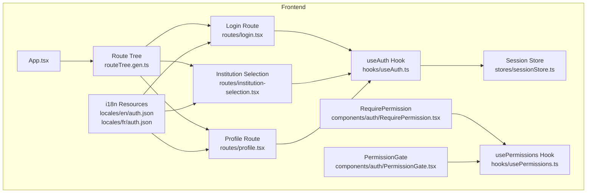
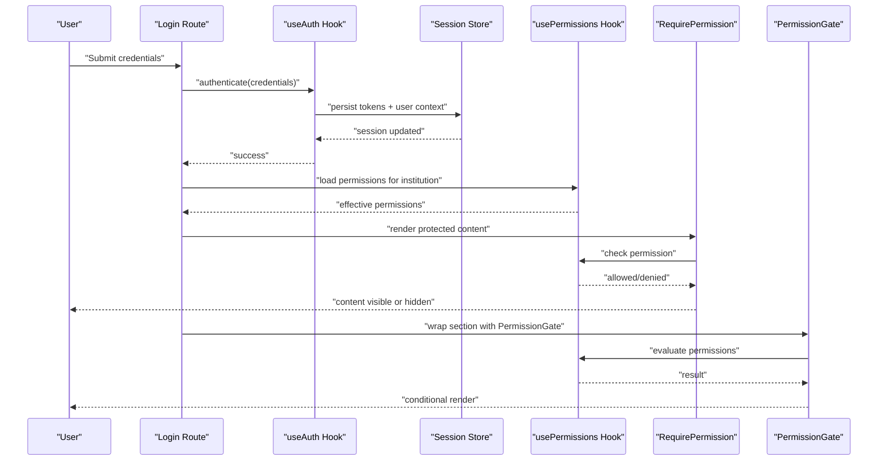
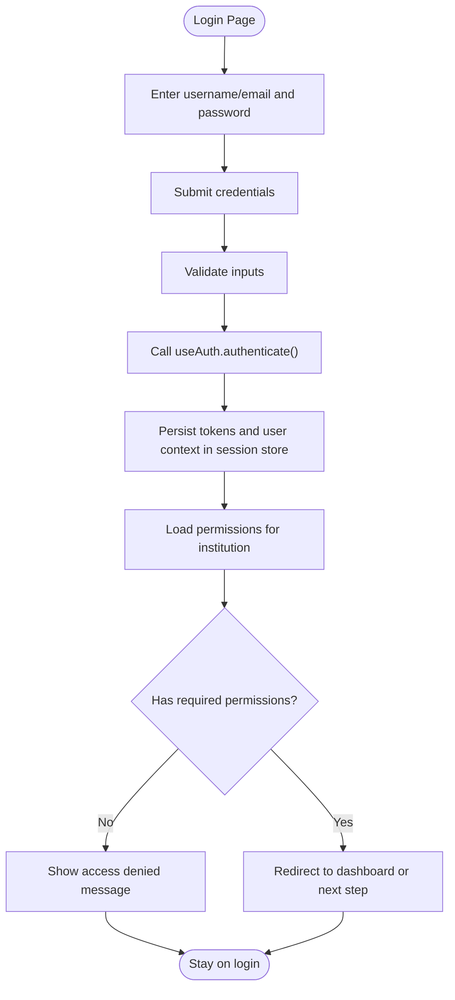
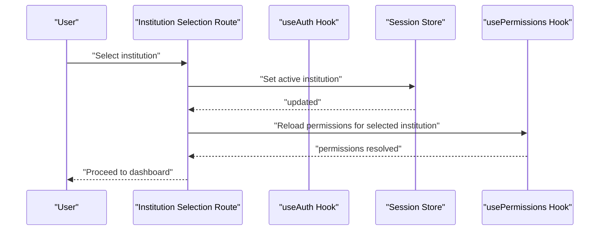
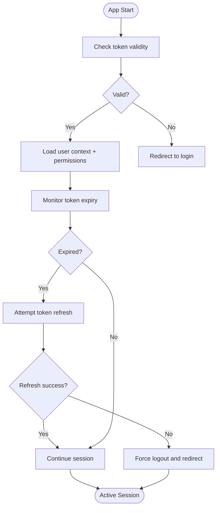
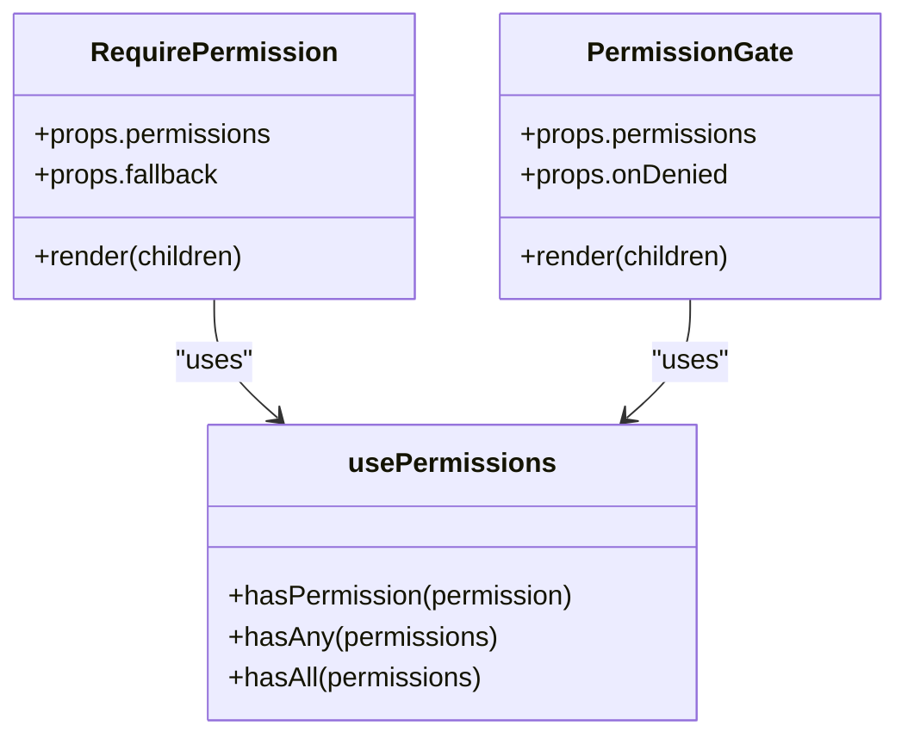
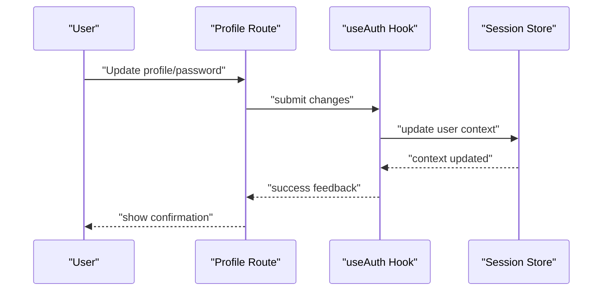
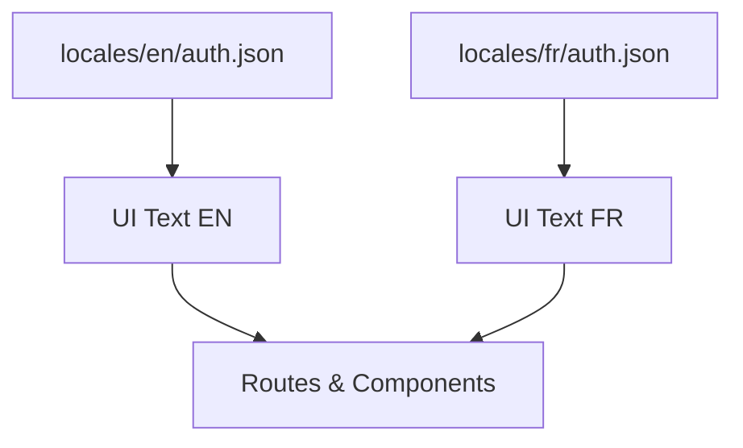
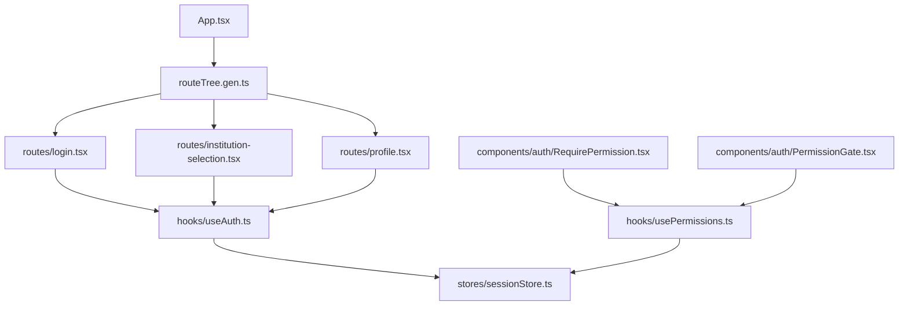

# Authentication & Authorization UI

<cite>
**Referenced Files in This Document**
- [App.tsx](file://frontend/src/App.tsx)
- [main.tsx](file://frontend/src/main.tsx)
- [routeTree.gen.ts](file://frontend/src/routeTree.gen.ts)
- [routes/login.tsx](file://frontend/src/routes/login.tsx)
- [routes/institution-selection.tsx](file://frontend/src/routes/institution-selection.tsx)
- [routes/profile.tsx](file://frontend/src/routes/profile.tsx)
- [components/auth/RequirePermission.tsx](file://frontend/src/components/auth/RequirePermission.tsx)
- [components/auth/PermissionGate.tsx](file://frontend/src/components/auth/PermissionGate.tsx)
- [hooks/useAuth.ts](file://frontend/src/hooks/useAuth.ts)
- [hooks/usePermissions.ts](file://frontend/src/hooks/usePermissions.ts)
- [stores/sessionStore.ts](file://frontend/src/stores/sessionStore.ts)
- [locales/en/auth.json](file://frontend/src/locales/en/auth.json)
- [locales/fr/auth.json](file://frontend/src/locales/fr/auth.json)
</cite>

## Table of Contents
1. [Introduction](#introduction)
2. [Project Structure](#project-structure)
3. [Core Components](#core-components)
4. [Architecture Overview](#architecture-overview)
5. [Detailed Component Analysis](#detailed-component-analysis)
6. [Dependency Analysis](#dependency-analysis)
7. [Performance Considerations](#performance-considerations)
8. [Troubleshooting Guide](#troubleshooting-guide)
9. [Conclusion](#conclusion)
10. [Appendices](#appendices)

## Introduction
This document explains the authentication and authorization user interface components, focusing on:
- Login flow and multi-tenant institution selection
- Session management UI patterns
- Permission-based UI rendering with RequirePermission and PermissionGate
- Role-based access control visualization and permission matrix
- User profile management, password change workflows, and security settings interfaces
- Accessibility considerations and internationalization support for authentication flows

The goal is to provide a clear, code-mapped understanding of how users authenticate, select their active tenant (institution), manage sessions, and interact with permission-driven UI elements.

## Project Structure
Authentication and authorization UI spans routes, shared auth components, hooks, stores, and localization resources. The following diagram shows the high-level structure relevant to this documentation.

**Diagram sources**
- [App.tsx](file://frontend/src/App.tsx)
- [routeTree.gen.ts](file://frontend/src/routeTree.gen.ts)
- [routes/login.tsx](file://frontend/src/routes/login.tsx)
- [routes/institution-selection.tsx](file://frontend/src/routes/institution-selection.tsx)
- [routes/profile.tsx](file://frontend/src/routes/profile.tsx)
- [hooks/useAuth.ts](file://frontend/src/hooks/useAuth.ts)
- [hooks/usePermissions.ts](file://frontend/src/hooks/usePermissions.ts)
- [stores/sessionStore.ts](file://frontend/src/stores/sessionStore.ts)
- [locales/en/auth.json](file://frontend/src/locales/en/auth.json)
- [locales/fr/auth.json](file://frontend/src/locales/fr/auth.json)

**Section sources**
- [App.tsx](file://frontend/src/App.tsx)
- [main.tsx](file://frontend/src/main.tsx)
- [routeTree.gen.ts](file://frontend/src/routeTree.gen.ts)

## Core Components
- RequirePermission: Renders children only when the current user has the specified permission(s). It integrates with usePermissions and can short-circuit rendering to improve performance.
- PermissionGate: A higher-order or wrapper component that conditionally renders content based on permissions, often used to gate entire sections or pages.
- useAuth: Central hook providing login state, session context, logout actions, and tenant switching helpers.
- usePermissions: Hook that resolves effective permissions for the current user and selected institution, including role-derived permissions.
- Session Store: Persistent store managing token lifecycle, active institution, and user context across the app.

These components work together to enforce RBAC at the UI layer, ensuring consistent behavior between backend authorization and frontend visibility.

**Section sources**
- [components/auth/RequirePermission.tsx](file://frontend/src/components/auth/RequirePermission.tsx)
- [components/auth/PermissionGate.tsx](file://frontend/src/components/auth/PermissionGate.tsx)
- [hooks/useAuth.ts](file://frontend/src/hooks/useAuth.ts)
- [hooks/usePermissions.ts](file://frontend/src/hooks/usePermissions.ts)
- [stores/sessionStore.ts](file://frontend/src/stores/sessionStore.ts)

## Architecture Overview
The authentication and authorization UI architecture follows a layered approach:
- Routes orchestrate user flows (login, institution selection, profile).
- Hooks encapsulate business logic (auth state, permissions).
- Stores persist session data and active tenant.
- Permission components enforce UI-level access control.
- i18n resources ensure localized messages for all flows.

**Diagram sources**
- [routes/login.tsx](file://frontend/src/routes/login.tsx)
- [hooks/useAuth.ts](file://frontend/src/hooks/useAuth.ts)
- [stores/sessionStore.ts](file://frontend/src/stores/sessionStore.ts)
- [hooks/usePermissions.ts](file://frontend/src/hooks/usePermissions.ts)
- [components/auth/RequirePermission.tsx](file://frontend/src/components/auth/RequirePermission.tsx)
- [components/auth/PermissionGate.tsx](file://frontend/src/components/auth/PermissionGate.tsx)

## Detailed Component Analysis

### Login Flow
- Entry point: Login route handles credential submission, error display, and redirection.
- Auth hook: useAuth performs authentication, updates session store, and exposes logout/reset methods.
- Permissions: After successful login, permissions are loaded for the default or previously selected institution.
- Redirection: Based on permissions and institutional context, the user is directed to the appropriate dashboard or institution selection.

**Diagram sources**
- [routes/login.tsx](file://frontend/src/routes/login.tsx)
- [hooks/useAuth.ts](file://frontend/src/hooks/useAuth.ts)
- [stores/sessionStore.ts](file://frontend/src/stores/sessionStore.ts)
- [hooks/usePermissions.ts](file://frontend/src/hooks/usePermissions.ts)

**Section sources**
- [routes/login.tsx](file://frontend/src/routes/login.tsx)
- [hooks/useAuth.ts](file://frontend/src/hooks/useAuth.ts)
- [stores/sessionStore.ts](file://frontend/src/stores/sessionStore.ts)
- [hooks/usePermissions.ts](file://frontend/src/hooks/usePermissions.ts)

### Multi-Tenant Institution Selection
- Purpose: Allow users with access to multiple institutions to choose the active tenant.
- Flow: After login, if multiple institutions are available, the institution selection route prompts the user.
- State: Active institution ID is stored in the session store and influences permission resolution.
- UX: Clear labels, keyboard navigation, and accessible form controls.

**Diagram sources**
- [routes/institution-selection.tsx](file://frontend/src/routes/institution-selection.tsx)
- [hooks/useAuth.ts](file://frontend/src/hooks/useAuth.ts)
- [stores/sessionStore.ts](file://frontend/src/stores/sessionStore.ts)
- [hooks/usePermissions.ts](file://frontend/src/hooks/usePermissions.ts)

**Section sources**
- [routes/institution-selection.tsx](file://frontend/src/routes/institution-selection.tsx)
- [stores/sessionStore.ts](file://frontend/src/stores/sessionStore.ts)
- [hooks/usePermissions.ts](file://frontend/src/hooks/usePermissions.ts)

### Session Management UI Patterns
- Token persistence: Secure storage of tokens via session store.
- Auto-refresh: Refresh tokens before expiration; handle refresh failures gracefully.
- Logout: Clear tokens, reset user context, and redirect to login.
- Idle detection: Optional idle timeout prompting re-authentication.
- Tenant-aware sessions: Ensure active institution persists across sessions.

**Diagram sources**
- [stores/sessionStore.ts](file://frontend/src/stores/sessionStore.ts)
- [hooks/useAuth.ts](file://frontend/src/hooks/useAuth.ts)

**Section sources**
- [stores/sessionStore.ts](file://frontend/src/stores/sessionStore.ts)
- [hooks/useAuth.ts](file://frontend/src/hooks/useAuth.ts)

### Permission-Based UI Rendering: RequirePermission and PermissionGate
- RequirePermission:
  - Evaluates one or more permissions.
  - Renders children if allowed; otherwise, renders fallback or nothing.
  - Integrates with usePermissions for efficient checks.
- PermissionGate:
  - Wraps larger sections or pages.
  - Can show loading states while permissions resolve.
  - Supports custom deny handlers and redirects.

**Diagram sources**
- [components/auth/RequirePermission.tsx](file://frontend/src/components/auth/RequirePermission.tsx)
- [components/auth/PermissionGate.tsx](file://frontend/src/components/auth/PermissionGate.tsx)
- [hooks/usePermissions.ts](file://frontend/src/hooks/usePermissions.ts)

**Section sources**
- [components/auth/RequirePermission.tsx](file://frontend/src/components/auth/RequirePermission.tsx)
- [components/auth/PermissionGate.tsx](file://frontend/src/components/auth/PermissionGate.tsx)
- [hooks/usePermissions.ts](file://frontend/src/hooks/usePermissions.ts)

### Role-Based Access Control Visualization and Permission Matrix
- Role overview: Display roles assigned to the current user within the active institution.
- Permission matrix: Tabular view mapping features/actions to granted permissions.
- Filtering: Filter by module, feature, or action type.
- Export: Optionally export permission matrix for auditing.

[No sources needed since this diagram shows conceptual workflow, not actual code structure]

### User Profile Management, Password Change, and Security Settings
- Profile route: Displays and edits user details, preferences, and notifications.
- Password change: Validates old password, enforces complexity rules, confirms new password, and updates securely.
- Security settings: Manage two-factor authentication, trusted devices, and session timeouts.
- Feedback: Provide clear success/error messages and accessibility hints.

**Diagram sources**
- [routes/profile.tsx](file://frontend/src/routes/profile.tsx)
- [hooks/useAuth.ts](file://frontend/src/hooks/useAuth.ts)
- [stores/sessionStore.ts](file://frontend/src/stores/sessionStore.ts)

**Section sources**
- [routes/profile.tsx](file://frontend/src/routes/profile.tsx)
- [hooks/useAuth.ts](file://frontend/src/hooks/useAuth.ts)
- [stores/sessionStore.ts](file://frontend/src/stores/sessionStore.ts)

### Accessibility Considerations
- Keyboard navigation: All interactive elements must be reachable via keyboard.
- Focus management: Move focus appropriately after login, errors, and redirects.
- ARIA attributes: Use aria-live regions for dynamic messages (errors, success).
- Color contrast: Ensure sufficient contrast for text and indicators.
- Screen readers: Provide descriptive labels and instructions for forms and modals.

[No sources needed since this section provides general guidance]

### Internationalization Support
- Localization files: English and French resources for authentication-related strings.
- Dynamic language switching: Update UI text without reloading the page.
- Pluralization and formatting: Handle plural forms and date/time formats per locale.
- Error messages: Localize validation and system errors consistently.

**Diagram sources**
- [locales/en/auth.json](file://frontend/src/locales/en/auth.json)
- [locales/fr/auth.json](file://frontend/src/locales/fr/auth.json)

**Section sources**
- [locales/en/auth.json](file://frontend/src/locales/en/auth.json)
- [locales/fr/auth.json](file://frontend/src/locales/fr/auth.json)

## Dependency Analysis
The following diagram maps key dependencies among authentication and authorization UI components.

**Diagram sources**
- [App.tsx](file://frontend/src/App.tsx)
- [routeTree.gen.ts](file://frontend/src/routeTree.gen.ts)
- [routes/login.tsx](file://frontend/src/routes/login.tsx)
- [routes/institution-selection.tsx](file://frontend/src/routes/institution-selection.tsx)
- [routes/profile.tsx](file://frontend/src/routes/profile.tsx)
- [hooks/useAuth.ts](file://frontend/src/hooks/useAuth.ts)
- [hooks/usePermissions.ts](file://frontend/src/hooks/usePermissions.ts)
- [stores/sessionStore.ts](file://frontend/src/stores/sessionStore.ts)
- [components/auth/RequirePermission.tsx](file://frontend/src/components/auth/RequirePermission.tsx)
- [components/auth/PermissionGate.tsx](file://frontend/src/components/auth/PermissionGate.tsx)

**Section sources**
- [App.tsx](file://frontend/src/App.tsx)
- [routeTree.gen.ts](file://frontend/src/routeTree.gen.ts)
- [hooks/useAuth.ts](file://frontend/src/hooks/useAuth.ts)
- [hooks/usePermissions.ts](file://frontend/src/hooks/usePermissions.ts)
- [stores/sessionStore.ts](file://frontend/src/stores/sessionStore.ts)
- [components/auth/RequirePermission.tsx](file://frontend/src/components/auth/RequirePermission.tsx)
- [components/auth/PermissionGate.tsx](file://frontend/src/components/auth/PermissionGate.tsx)

## Performance Considerations
- Minimize re-renders: Memoize permission checks and avoid unnecessary recalculations.
- Lazy load protected routes: Defer heavy components until permissions are resolved.
- Batch permission requests: Consolidate API calls where possible.
- Debounce input: For search/filter in permission matrices, debounce to reduce processing.
- Cache results: Cache resolved permissions per institution to avoid repeated computations.

[No sources needed since this section provides general guidance]

## Troubleshooting Guide
Common issues and resolutions:
- Login fails due to invalid credentials: Verify inputs, check network connectivity, and inspect error messages.
- Permission denied after login: Confirm active institution and role assignments; reload permissions.
- Session expired unexpectedly: Check token refresh logic and server time synchronization.
- Locale not applied: Ensure correct locale file exists and is imported; verify language switcher state.

**Section sources**
- [hooks/useAuth.ts](file://frontend/src/hooks/useAuth.ts)
- [hooks/usePermissions.ts](file://frontend/src/hooks/usePermissions.ts)
- [stores/sessionStore.ts](file://frontend/src/stores/sessionStore.ts)

## Conclusion
The authentication and authorization UI is built around robust hooks and components that enforce RBAC consistently. The login and institution selection flows integrate seamlessly with session management and permission resolution. RequirePermission and PermissionGate provide flexible mechanisms for conditional rendering, while profile and security settings offer comprehensive user control. Accessibility and internationalization ensure inclusive and globally usable experiences.

[No sources needed since this section summarizes without analyzing specific files]

## Appendices
- Best practices:
  - Always wrap sensitive UI with RequirePermission or PermissionGate.
  - Keep session store minimal and focused on auth state.
  - Localize all user-facing strings and error messages.
  - Test multi-tenant scenarios thoroughly.

[No sources needed since this section provides general guidance]