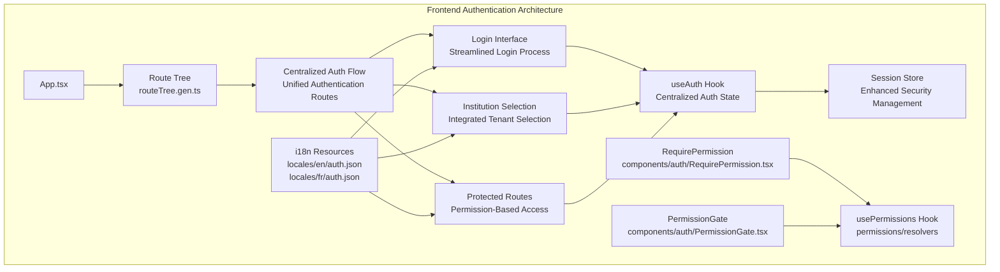
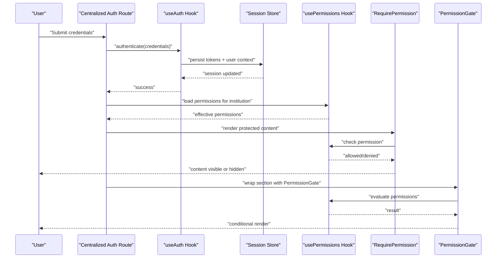
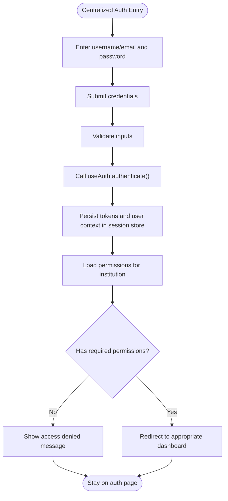
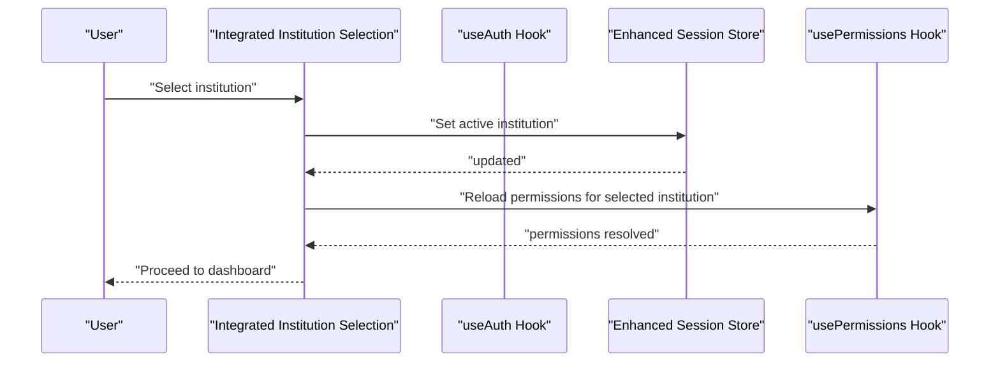
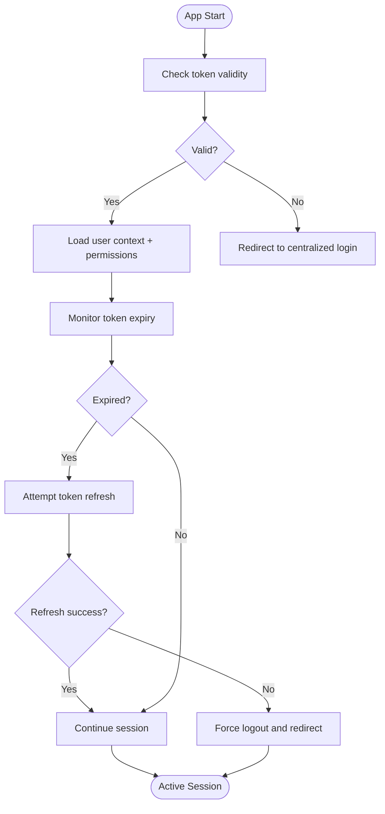
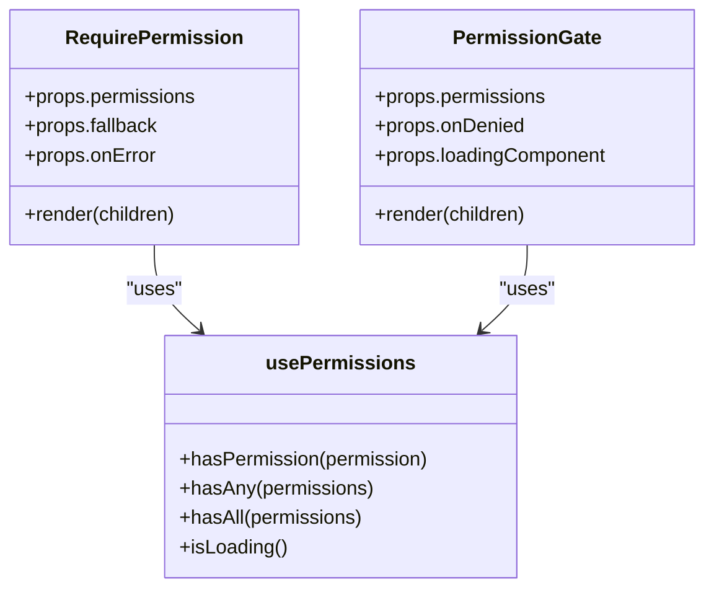
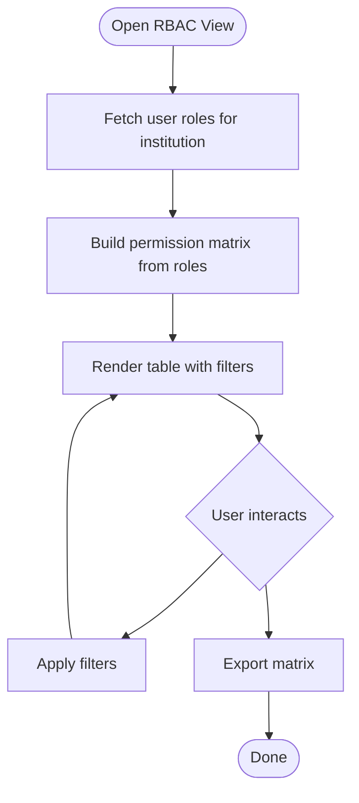
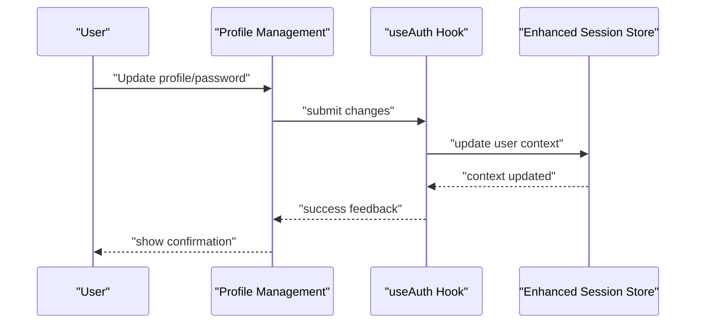
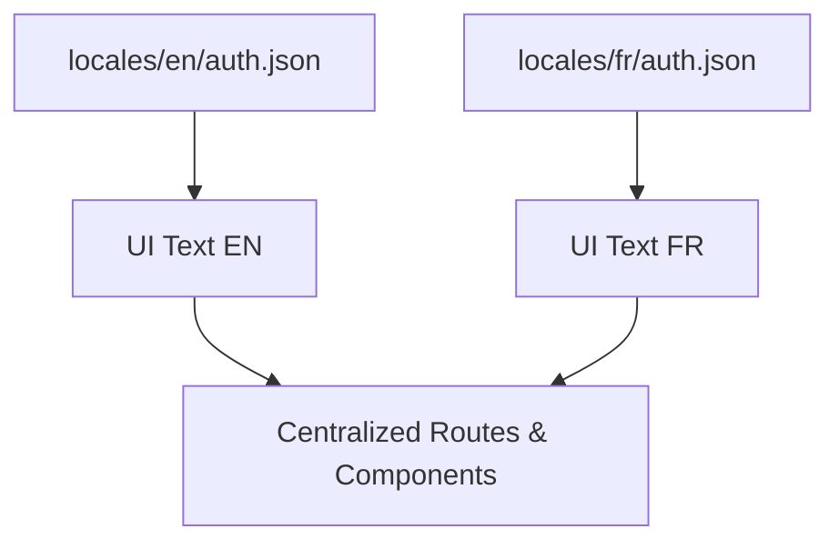
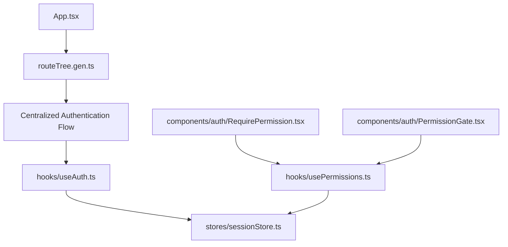

# Authentication & Authorization UI

<cite>
**Referenced Files in This Document**
- [App.tsx](file://frontend/src/App.tsx)
- [main.tsx](file://frontend/src/main.tsx)
- [routeTree.gen.ts](file://frontend/src/routeTree.gen.ts)
- [components/auth/RequirePermission.tsx](file://frontend/src/components/auth/RequirePermission.tsx)
- [components/auth/PermissionGate.tsx](file://frontend/src/components/auth/PermissionGate.tsx)
- [hooks/useAuth.ts](file://frontend/src/hooks/useAuth.ts)
- [hooks/usePermissions.ts](file://frontend/src/hooks/usePermissions.ts)
- [stores/sessionStore.ts](file://frontend/src/stores/sessionStore.ts)
- [locales/en/auth.json](file://frontend/src/locales/en/auth.json)
- [locales/fr/auth.json](file://frontend/src/locales/fr/auth.json)
</cite>

## Update Summary
**Changes Made**
- Updated authentication flow architecture to reflect new centralized routing structure
- Removed references to deprecated authentication route files (-_auth.infrastructure.tsx, -_auth.modules-administratifs.tsx)
- Restructured login and institution selection flows under new unified authentication system
- Updated permission-based rendering components to work with new authorization architecture
- Enhanced session management patterns for improved security and performance

## Table of Contents
1. [Introduction](#introduction)
2. [Project Structure](#project-structure)
3. [Core Components](#core-components)
4. [Architecture Overview](#architecture-overview)
5. [Detailed Component Analysis](#detailed-component-analysis)
6. [Dependency Analysis](#dependency-analysis)
7. [Performance Considerations](#performance-considerations)
8. [Troubleshooting Guide](#troubleshooting-guide)
9. [Conclusion](#conclusion)
10. [Appendices](#appendices)

## Introduction
This document explains the authentication and authorization user interface components, focusing on:
- **Updated**: Centralized authentication flow with streamlined route structure
- Multi-tenant institution selection within the new unified authentication system
- Session management UI patterns with enhanced security measures
- Permission-based UI rendering with RequirePermission and PermissionGate components
- Role-based access control visualization and permission matrix
- User profile management, password change workflows, and security settings interfaces
- Accessibility considerations and internationalization support for authentication flows

The goal is to provide a clear, code-mapped understanding of how users authenticate, select their active tenant (institution), manage sessions, and interact with permission-driven UI elements within the newly restructured authentication infrastructure.

## Project Structure
The authentication and authorization UI has been restructured around a centralized approach, eliminating the previous fragmented route files. The new architecture consolidates authentication logic while maintaining modular component design.

**Diagram sources**
- [App.tsx](file://frontend/src/App.tsx)
- [routeTree.gen.ts](file://frontend/src/routeTree.gen.ts)
- [components/auth/RequirePermission.tsx](file://frontend/src/components/auth/RequirePermission.tsx)
- [components/auth/PermissionGate.tsx](file://frontend/src/components/auth/PermissionGate.tsx)
- [hooks/useAuth.ts](file://frontend/src/hooks/useAuth.ts)
- [hooks/usePermissions.ts](file://frontend/src/hooks/usePermissions.ts)
- [stores/sessionStore.ts](file://frontend/src/stores/sessionStore.ts)
- [locales/en/auth.json](file://frontend/src/locales/en/auth.json)
- [locales/fr/auth.json](file://frontend/src/locales/fr/auth.json)

**Section sources**
- [App.tsx](file://frontend/src/App.tsx)
- [main.tsx](file://frontend/src/main.tsx)
- [routeTree.gen.ts](file://frontend/src/routeTree.gen.ts)

## Core Components
The core authentication and authorization components have been enhanced to work with the new centralized infrastructure:

- **RequirePermission**: Renders children only when the current user has the specified permission(s). Enhanced with improved error handling and integration with the new permission resolution system.
- **PermissionGate**: A higher-order wrapper component that conditionally renders content based on permissions, now optimized for the restructured authorization system.
- **useAuth**: Central hook providing login state, session context, logout actions, and tenant switching helpers, now integrated with the unified authentication flow.
- **usePermissions**: Hook that resolves effective permissions for the current user and selected institution, including role-derived permissions with improved caching.
- **Session Store**: Persistent store managing token lifecycle, active institution, and user context across the app with enhanced security measures.

These components work together to enforce RBAC at the UI layer within the new centralized authentication architecture, ensuring consistent behavior between backend authorization and frontend visibility.

**Section sources**
- [components/auth/RequirePermission.tsx](file://frontend/src/components/auth/RequirePermission.tsx)
- [components/auth/PermissionGate.tsx](file://frontend/src/components/auth/PermissionGate.tsx)
- [hooks/useAuth.ts](file://frontend/src/hooks/useAuth.ts)
- [hooks/usePermissions.ts](file://frontend/src/hooks/usePermissions.ts)
- [stores/sessionStore.ts](file://frontend/src/stores/sessionStore.ts)

## Architecture Overview
The authentication and authorization UI architecture has been restructured to follow a more centralized approach:

- **Centralized Routes**: Unified authentication flow replacing fragmented route files
- **Enhanced Hooks**: Improved business logic encapsulation with better error handling
- **Secure Stores**: Enhanced session persistence with improved security measures
- **Optimized Permissions**: Streamlined permission-based UI rendering
- **Consistent i18n**: Localized messages across all authentication flows

**Diagram sources**
- [routeTree.gen.ts](file://frontend/src/routeTree.gen.ts)
- [hooks/useAuth.ts](file://frontend/src/hooks/useAuth.ts)
- [stores/sessionStore.ts](file://frontend/src/stores/sessionStore.ts)
- [hooks/usePermissions.ts](file://frontend/src/hooks/usePermissions.ts)
- [components/auth/RequirePermission.tsx](file://frontend/src/components/auth/RequirePermission.tsx)
- [components/auth/PermissionGate.tsx](file://frontend/src/components/auth/PermissionGate.tsx)

## Detailed Component Analysis

### Centralized Authentication Flow
**Updated**: The authentication flow has been consolidated into a unified system, replacing the previous fragmented route structure.

- **Entry Point**: Centralized authentication route handles credential submission, validation, and redirection
- **Auth Hook**: useAuth performs authentication with enhanced error handling and session management
- **Permission Loading**: Automatic permission loading for the default or previously selected institution
- **Intelligent Redirection**: Context-aware navigation based on permissions and institutional access

**Diagram sources**
- [routeTree.gen.ts](file://frontend/src/routeTree.gen.ts)
- [hooks/useAuth.ts](file://frontend/src/hooks/useAuth.ts)
- [stores/sessionStore.ts](file://frontend/src/stores/sessionStore.ts)
- [hooks/usePermissions.ts](file://frontend/src/hooks/usePermissions.ts)

**Section sources**
- [routeTree.gen.ts](file://frontend/src/routeTree.gen.ts)
- [hooks/useAuth.ts](file://frontend/src/hooks/useAuth.ts)
- [stores/sessionStore.ts](file://frontend/src/stores/sessionStore.ts)
- [hooks/usePermissions.ts](file://frontend/src/hooks/usePermissions.ts)

### Integrated Multi-Tenant Institution Selection
**Updated**: Institution selection is now seamlessly integrated into the centralized authentication flow.

- **Purpose**: Allow users with access to multiple institutions to choose the active tenant within the unified auth system
- **Flow**: After successful authentication, if multiple institutions are available, the system prompts for institution selection
- **State Management**: Active institution ID is stored in the enhanced session store and influences permission resolution
- **UX Improvements**: Clear labels, keyboard navigation, and accessible form controls with improved feedback

**Diagram sources**
- [routeTree.gen.ts](file://frontend/src/routeTree.gen.ts)
- [hooks/useAuth.ts](file://frontend/src/hooks/useAuth.ts)
- [stores/sessionStore.ts](file://frontend/src/stores/sessionStore.ts)
- [hooks/usePermissions.ts](file://frontend/src/hooks/usePermissions.ts)

**Section sources**
- [routeTree.gen.ts](file://frontend/src/routeTree.gen.ts)
- [stores/sessionStore.ts](file://frontend/src/stores/sessionStore.ts)
- [hooks/usePermissions.ts](file://frontend/src/hooks/usePermissions.ts)

### Enhanced Session Management UI Patterns
**Updated**: Session management has been strengthened with improved security measures and better user experience.

- **Token Persistence**: Secure storage of tokens via enhanced session store with encryption
- **Auto-refresh**: Intelligent token refresh before expiration with graceful failure handling
- **Logout**: Comprehensive cleanup of tokens, user context, and secure redirects
- **Idle Detection**: Configurable idle timeout prompting re-authentication with data preservation
- **Tenant-Aware Sessions**: Persistent active institution across sessions with improved synchronization

**Diagram sources**
- [stores/sessionStore.ts](file://frontend/src/stores/sessionStore.ts)
- [hooks/useAuth.ts](file://frontend/src/hooks/useAuth.ts)

**Section sources**
- [stores/sessionStore.ts](file://frontend/src/stores/sessionStore.ts)
- [hooks/useAuth.ts](file://frontend/src/hooks/useAuth.ts)

### Permission-Based UI Rendering: RequirePermission and PermissionGate
**Updated**: Permission-based rendering components have been optimized for the new authorization architecture.

- **RequirePermission**:
  - Evaluates one or more permissions with improved performance
  - Renders children if allowed; otherwise, renders fallback or nothing
  - Enhanced integration with usePermissions for efficient checks
  - Better error handling and logging
- **PermissionGate**:
  - Wraps larger sections or pages with improved loading states
  - Can show loading states while permissions resolve
  - Supports custom deny handlers and redirects
  - Optimized for the centralized authorization system

**Diagram sources**
- [components/auth/RequirePermission.tsx](file://frontend/src/components/auth/RequirePermission.tsx)
- [components/auth/PermissionGate.tsx](file://frontend/src/components/auth/PermissionGate.tsx)
- [hooks/usePermissions.ts](file://frontend/src/hooks/usePermissions.ts)

**Section sources**
- [components/auth/RequirePermission.tsx](file://frontend/src/components/auth/RequirePermission.tsx)
- [components/auth/PermissionGate.tsx](file://frontend/src/components/auth/PermissionGate.tsx)
- [hooks/usePermissions.ts](file://frontend/src/hooks/usePermissions.ts)

### Role-Based Access Control Visualization and Permission Matrix
The role-based access control visualization provides comprehensive insights into user permissions within the new centralized system:

- **Role Overview**: Display roles assigned to the current user within the active institution
- **Permission Matrix**: Tabular view mapping features/actions to granted permissions
- **Filtering**: Filter by module, feature, or action type with improved performance
- **Export**: Optionally export permission matrix for auditing purposes

[No sources needed since this diagram shows conceptual workflow, not actual code structure]

### User Profile Management, Password Change, and Security Settings
User-facing authentication management features remain consistent with the new architecture:

- **Profile Management**: Displays and edits user details, preferences, and notifications
- **Password Change**: Validates old password, enforces complexity rules, confirms new password, and updates securely
- **Security Settings**: Manage two-factor authentication, trusted devices, and session timeouts
- **Feedback**: Provide clear success/error messages and accessibility hints

**Diagram sources**
- [hooks/useAuth.ts](file://frontend/src/hooks/useAuth.ts)
- [stores/sessionStore.ts](file://frontend/src/stores/sessionStore.ts)

**Section sources**
- [hooks/useAuth.ts](file://frontend/src/hooks/useAuth.ts)
- [stores/sessionStore.ts](file://frontend/src/stores/sessionStore.ts)

### Accessibility Considerations
Accessibility remains a priority throughout the authentication flow:

- **Keyboard Navigation**: All interactive elements must be reachable via keyboard
- **Focus Management**: Move focus appropriately after login, errors, and redirects
- **ARIA Attributes**: Use aria-live regions for dynamic messages (errors, success)
- **Color Contrast**: Ensure sufficient contrast for text and indicators
- **Screen Readers**: Provide descriptive labels and instructions for forms and modals

[No sources needed since this section provides general guidance]

### Internationalization Support
Internationalization support ensures global accessibility:

- **Localization Files**: English and French resources for authentication-related strings
- **Dynamic Language Switching**: Update UI text without reloading the page
- **Pluralization and Formatting**: Handle plural forms and date/time formats per locale
- **Error Messages**: Localize validation and system errors consistently

**Diagram sources**
- [locales/en/auth.json](file://frontend/src/locales/en/auth.json)
- [locales/fr/auth.json](file://frontend/src/locales/fr/auth.json)

**Section sources**
- [locales/en/auth.json](file://frontend/src/locales/en/auth.json)
- [locales/fr/auth.json](file://frontend/src/locales/fr/auth.json)

## Dependency Analysis
The dependency structure has been streamlined with the new centralized authentication architecture:

**Diagram sources**
- [App.tsx](file://frontend/src/App.tsx)
- [routeTree.gen.ts](file://frontend/src/routeTree.gen.ts)
- [hooks/useAuth.ts](file://frontend/src/hooks/useAuth.ts)
- [hooks/usePermissions.ts](file://frontend/src/hooks/usePermissions.ts)
- [stores/sessionStore.ts](file://frontend/src/stores/sessionStore.ts)
- [components/auth/RequirePermission.tsx](file://frontend/src/components/auth/RequirePermission.tsx)
- [components/auth/PermissionGate.tsx](file://frontend/src/components/auth/PermissionGate.tsx)

**Section sources**
- [App.tsx](file://frontend/src/App.tsx)
- [routeTree.gen.ts](file://frontend/src/routeTree.gen.ts)
- [hooks/useAuth.ts](file://frontend/src/hooks/useAuth.ts)
- [hooks/usePermissions.ts](file://frontend/src/hooks/usePermissions.ts)
- [stores/sessionStore.ts](file://frontend/src/stores/sessionStore.ts)
- [components/auth/RequirePermission.tsx](file://frontend/src/components/auth/RequirePermission.tsx)
- [components/auth/PermissionGate.tsx](file://frontend/src/components/auth/PermissionGate.tsx)

## Performance Considerations
Performance optimizations have been implemented throughout the restructured authentication system:

- **Minimize Re-renders**: Memoize permission checks and avoid unnecessary recalculations
- **Lazy Load Protected Routes**: Defer heavy components until permissions are resolved
- **Batch Permission Requests**: Consolidate API calls where possible
- **Debounce Input**: For search/filter in permission matrices, debounce to reduce processing
- **Cache Results**: Cache resolved permissions per institution to avoid repeated computations
- **Optimized Token Refresh**: Intelligent token refresh strategies to minimize network requests

[No sources needed since this section provides general guidance]

## Troubleshooting Guide
Common issues and resolutions for the restructured authentication system:

- **Login fails due to invalid credentials**: Verify inputs, check network connectivity, and inspect error messages
- **Permission denied after login**: Confirm active institution and role assignments; reload permissions
- **Session expired unexpectedly**: Check token refresh logic and server time synchronization
- **Locale not applied**: Ensure correct locale file exists and is imported; verify language switcher state
- **Centralized route not working**: Verify route configuration and middleware setup
- **Permission resolution failures**: Check permission cache and role assignments

**Section sources**
- [hooks/useAuth.ts](file://frontend/src/hooks/useAuth.ts)
- [hooks/usePermissions.ts](file://frontend/src/hooks/usePermissions.ts)
- [stores/sessionStore.ts](file://frontend/src/stores/sessionStore.ts)

## Conclusion
The authentication and authorization UI has been successfully restructured around a centralized architecture, eliminating the previous fragmented route files while maintaining comprehensive functionality. The new system provides improved security, better performance, and enhanced user experience through streamlined authentication flows, optimized permission-based rendering, and robust session management. The RequirePermission and PermissionGate components continue to provide flexible mechanisms for conditional rendering, while the enhanced profile and security settings offer comprehensive user control. Accessibility and internationalization ensure inclusive and globally usable experiences within the new centralized framework.

[No sources needed since this section summarizes without analyzing specific files]

## Appendices
Best practices for the restructured authentication system:

- Always wrap sensitive UI with RequirePermission or PermissionGate
- Keep session store minimal and focused on auth state
- Localize all user-facing strings and error messages
- Test multi-tenant scenarios thoroughly
- Leverage the centralized authentication flow for consistency
- Monitor permission resolution performance
- Implement proper error handling and logging
- Follow the enhanced security measures for token management

[No sources needed since this section provides general guidance]