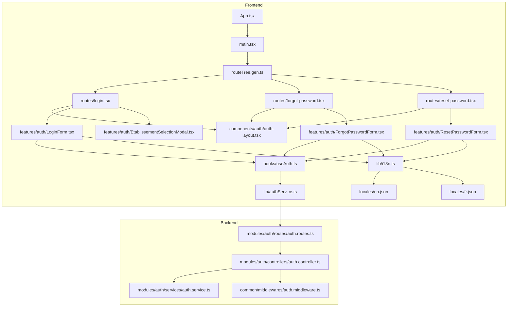
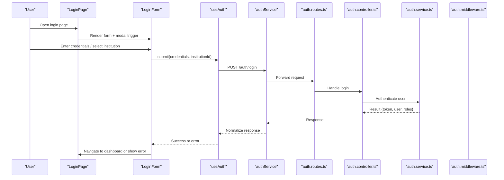
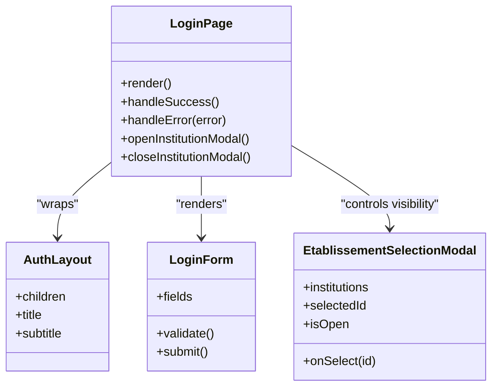
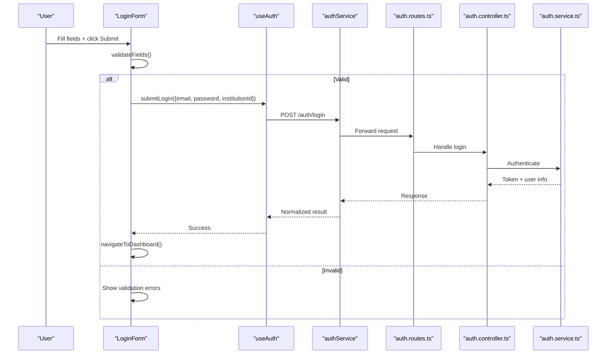
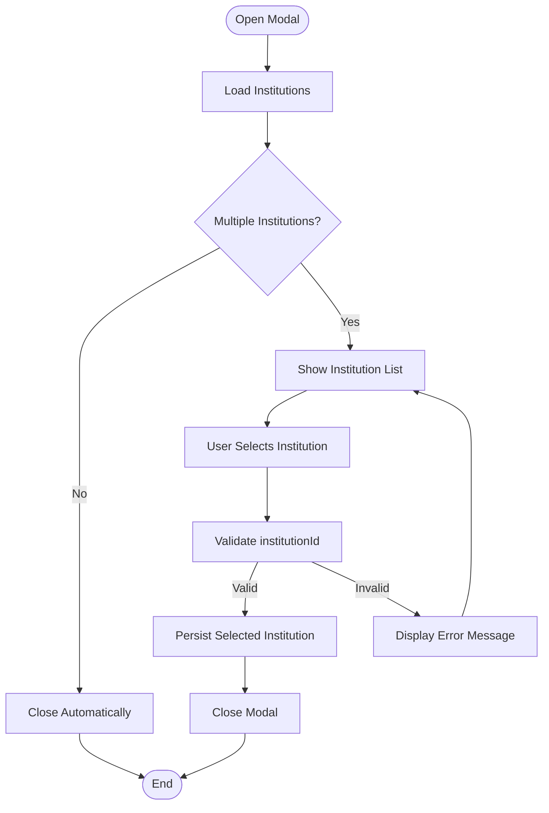
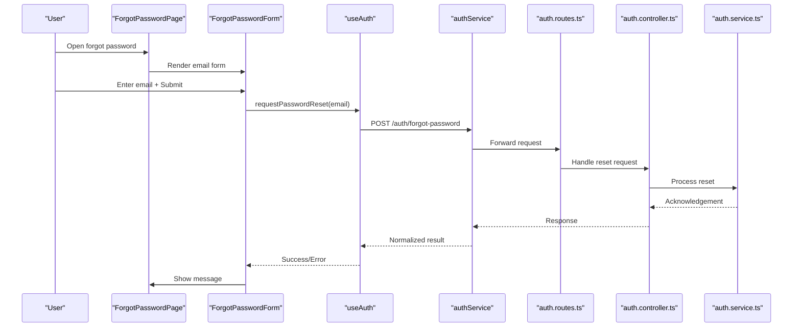
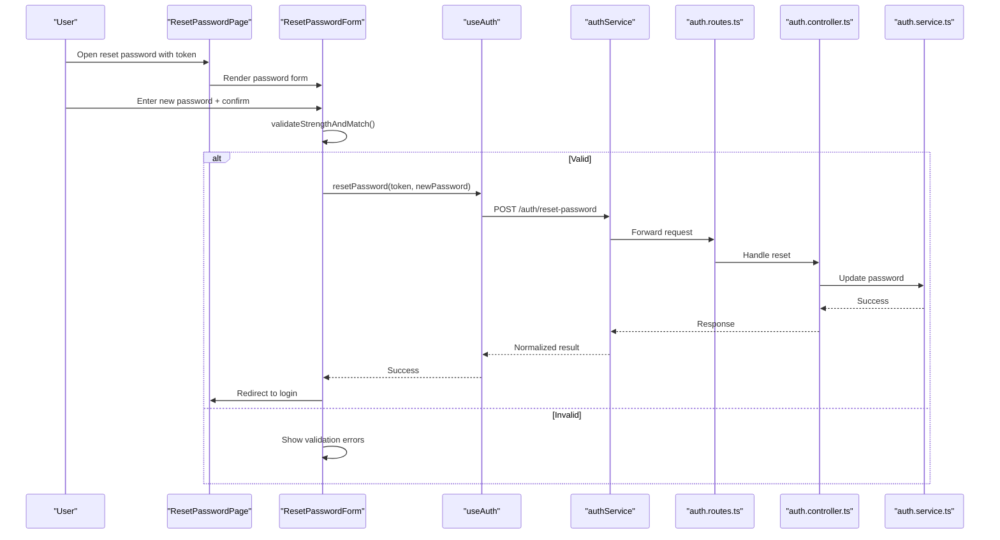
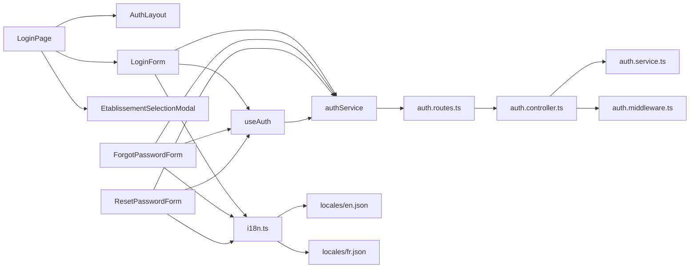

# Login & Authentication Forms

<cite>
**Referenced Files in This Document**
- [App.tsx](file://frontend/src/App.tsx)
- [main.tsx](file://frontend/src/main.tsx)
- [routeTree.gen.ts](file://frontend/src/routeTree.gen.ts)
- [login.tsx](file://frontend/src/routes/login.tsx)
- [forgot-password.tsx](file://frontend/src/routes/forgot-password.tsx)
- [reset-password.tsx](file://frontend/src/routes/reset-password.tsx)
- [auth-layout.tsx](file://frontend/src/components/auth/auth-layout.tsx)
- [LoginForm.tsx](file://frontend/src/features/auth/LoginForm.tsx)
- [ForgotPasswordForm.tsx](file://frontend/src/features/auth/ForgotPasswordForm.tsx)
- [ResetPasswordForm.tsx](file://frontend/src/features/auth/ResetPasswordForm.tsx)
- [EtablissementSelectionModal.tsx](file://frontend/src/features/auth/EtablissementSelectionModal.tsx)
- [useAuth.ts](file://frontend/src/hooks/useAuth.ts)
- [authService.ts](file://frontend/src/lib/authService.ts)
- [i18n.ts](file://frontend/src/lib/i18n.ts)
- [locales/en.json](file://frontend/src/locales/en.json)
- [locales/fr.json](file://frontend/src/locales/fr.json)
- [auth.middleware.ts](file://backend/src/common/middlewares/auth.middleware.ts)
- [auth.controller.ts](file://backend/src/modules/auth/controllers/auth.controller.ts)
- [auth.service.ts](file://backend/src/modules/auth/services/auth.service.ts)
- [auth.routes.ts](file://backend/src/modules/auth/routes/auth.routes.ts)
</cite>

## Table of Contents
1. [Introduction](#introduction)
2. [Project Structure](#project-structure)
3. [Core Components](#core-components)
4. [Architecture Overview](#architecture-overview)
5. [Detailed Component Analysis](#detailed-component-analysis)
6. [Dependency Analysis](#dependency-analysis)
7. [Performance Considerations](#performance-considerations)
8. [Troubleshooting Guide](#troubleshooting-guide)
9. [Conclusion](#conclusion)

## Introduction
This document explains the login and authentication form components, focusing on:
- LoginPage implementation with multi-tenant institution selection, credential validation, and error handling
- ForgotPassword and ResetPassword workflows including form validation and API integration patterns
- EtablissementSelectionModal for switching institutions during authentication
- Accessibility, internationalization (i18n), and security considerations such as password masking and input sanitization

The goal is to provide a clear understanding of how these components work together across frontend and backend layers.

## Project Structure
Authentication-related UI is organized under routes and features:
- Routes define page-level entry points for login, forgot password, and reset password
- Feature components encapsulate form logic, validation, and user interactions
- Shared hooks and services manage authentication state and API calls
- Backend modules expose endpoints for login, password reset, and session management

**Diagram sources**
- [App.tsx](file://frontend/src/App.tsx)
- [main.tsx](file://frontend/src/main.tsx)
- [routeTree.gen.ts](file://frontend/src/routeTree.gen.ts)
- [login.tsx](file://frontend/src/routes/login.tsx)
- [forgot-password.tsx](file://frontend/src/routes/forgot-password.tsx)
- [reset-password.tsx](file://frontend/src/routes/reset-password.tsx)
- [auth-layout.tsx](file://frontend/src/components/auth/auth-layout.tsx)
- [LoginForm.tsx](file://frontend/src/features/auth/LoginForm.tsx)
- [ForgotPasswordForm.tsx](file://frontend/src/features/auth/ForgotPasswordForm.tsx)
- [ResetPasswordForm.tsx](file://frontend/src/features/auth/ResetPasswordForm.tsx)
- [EtablissementSelectionModal.tsx](file://frontend/src/features/auth/EtablissementSelectionModal.tsx)
- [useAuth.ts](file://frontend/src/hooks/useAuth.ts)
- [authService.ts](file://frontend/src/lib/authService.ts)
- [i18n.ts](file://frontend/src/lib/i18n.ts)
- [locales/en.json](file://frontend/src/locales/en.json)
- [locales/fr.json](file://frontend/src/locales/fr.json)
- [auth.routes.ts](file://backend/src/modules/auth/routes/auth.routes.ts)
- [auth.controller.ts](file://backend/src/modules/auth/controllers/auth.controller.ts)
- [auth.service.ts](file://backend/src/modules/auth/services/auth.service.ts)
- [auth.middleware.ts](file://backend/src/common/middlewares/auth.middleware.ts)

**Section sources**
- [App.tsx](file://frontend/src/App.tsx)
- [main.tsx](file://frontend/src/main.tsx)
- [routeTree.gen.ts](file://frontend/src/routeTree.gen.ts)

## Core Components
- LoginPage: Entry point for authentication; orchestrates institution selection, credentials submission, and navigation after success or failure.
- LoginForm: Encapsulates login form fields, validation rules, and submission flow. Integrates with useAuth and authService for API calls.
- EtablissementSelectionModal: Modal for selecting an institution when users belong to multiple tenants; updates context before login attempts.
- ForgotPasswordForm: Handles email-based password reset requests with validation and feedback.
- ResetPasswordForm: Manages token-based password reset with strong password validation and confirmation checks.
- useAuth: Centralized hook providing login/logout state, error handling, and tenant-aware operations.
- authService: HTTP client wrapper for auth endpoints, token storage, and request/response normalization.
- i18n and locales: Provide localized labels, errors, and messages across forms.

Key responsibilities:
- Multi-tenant awareness via institution selection
- Robust client-side validation and user-friendly error messages
- Secure handling of sensitive inputs (password masking)
- Consistent API integration patterns with centralized error mapping

**Section sources**
- [login.tsx](file://frontend/src/routes/login.tsx)
- [LoginForm.tsx](file://frontend/src/features/auth/LoginForm.tsx)
- [EtablissementSelectionModal.tsx](file://frontend/src/features/auth/EtablissementSelectionModal.tsx)
- [ForgotPasswordForm.tsx](file://frontend/src/features/auth/ForgotPasswordForm.tsx)
- [ResetPasswordForm.tsx](file://frontend/src/features/auth/ResetPasswordForm.tsx)
- [useAuth.ts](file://frontend/src/hooks/useAuth.ts)
- [authService.ts](file://frontend/src/lib/authService.ts)
- [i18n.ts](file://frontend/src/lib/i18n.ts)
- [locales/en.json](file://frontend/src/locales/en.json)
- [locales/fr.json](file://frontend/src/locales/fr.json)

## Architecture Overview
The authentication flow spans frontend components, hooks, services, and backend controllers:

**Diagram sources**
- [login.tsx](file://frontend/src/routes/login.tsx)
- [LoginForm.tsx](file://frontend/src/features/auth/LoginForm.tsx)
- [useAuth.ts](file://frontend/src/hooks/useAuth.ts)
- [authService.ts](file://frontend/src/lib/authService.ts)
- [auth.routes.ts](file://backend/src/modules/auth/routes/auth.routes.ts)
- [auth.controller.ts](file://backend/src/modules/auth/controllers/auth.controller.ts)
- [auth.service.ts](file://backend/src/modules/auth/services/auth.service.ts)
- [auth.middleware.ts](file://backend/src/common/middlewares/auth.middleware.ts)

## Detailed Component Analysis

### LoginPage
Responsibilities:
- Renders AuthLayout and LoginForm
- Manages route transitions and redirects based on authentication state
- Integrates EtablissementSelectionModal for multi-tenant scenarios
- Displays global errors and loading states

Validation and error handling:
- Delegates field validation to LoginForm
- Uses centralized error mapping from authService
- Presents user-friendly messages via i18n

Accessibility:
- Provides descriptive aria-labels and role attributes
- Ensures focus management on modal open/close
- Supports keyboard navigation for institution selection

Internationalization:
- Loads localized strings for labels, placeholders, and errors
- Switches language dynamically using i18n configuration

Security:
- Avoids logging sensitive data
- Enforces HTTPS-only tokens and secure storage patterns through authService

**Section sources**
- [login.tsx](file://frontend/src/routes/login.tsx)
- [auth-layout.tsx](file://frontend/src/components/auth/auth-layout.tsx)
- [EtablissementSelectionModal.tsx](file://frontend/src/features/auth/EtablissementSelectionModal.tsx)
- [i18n.ts](file://frontend/src/lib/i18n.ts)
- [locales/en.json](file://frontend/src/locales/en.json)
- [locales/fr.json](file://frontend/src/locales/fr.json)

#### LoginPage Class Diagram

**Diagram sources**
- [login.tsx](file://frontend/src/routes/login.tsx)
- [auth-layout.tsx](file://frontend/src/components/auth/auth-layout.tsx)
- [LoginForm.tsx](file://frontend/src/features/auth/LoginForm.tsx)
- [EtablissementSelectionModal.tsx](file://frontend/src/features/auth/EtablissementSelectionModal.tsx)

### LoginForm
Responsibilities:
- Manages username/email and password fields
- Validates inputs locally before submission
- Submits credentials via useAuth and authService
- Updates UI state (loading, errors, success)

Validation rules:
- Required fields and format checks
- Password length constraints
- Institution selection requirement when applicable

API integration pattern:
- useAuth.submitLogin(payload) triggers authService.post('/auth/login')
- Normalizes responses and stores tokens securely
- Maps backend errors to user-facing messages

Error handling:
- Distinguishes between network errors, invalid credentials, and account lockouts
- Displays contextual messages and guidance

Accessibility:
- Associates labels with inputs
- Announces errors via aria-live regions
- Supports tab order and focus indicators

Internationalization:
- Uses i18n keys for labels, placeholders, and validation messages

Security:
- Masks password input
- Sanitizes inputs to prevent XSS
- Avoids storing passwords in memory longer than necessary

**Section sources**
- [LoginForm.tsx](file://frontend/src/features/auth/LoginForm.tsx)
- [useAuth.ts](file://frontend/src/hooks/useAuth.ts)
- [authService.ts](file://frontend/src/lib/authService.ts)
- [i18n.ts](file://frontend/src/lib/i18n.ts)
- [locales/en.json](file://frontend/src/locales/en.json)
- [locales/fr.json](file://frontend/src/locales/fr.json)

#### LoginForm Sequence Diagram

**Diagram sources**
- [LoginForm.tsx](file://frontend/src/features/auth/LoginForm.tsx)
- [useAuth.ts](file://frontend/src/hooks/useAuth.ts)
- [authService.ts](file://frontend/src/lib/authService.ts)
- [auth.routes.ts](file://backend/src/modules/auth/routes/auth.routes.ts)
- [auth.controller.ts](file://backend/src/modules/auth/controllers/auth.controller.ts)
- [auth.service.ts](file://backend/src/modules/auth/services/auth.service.ts)

### EtablissementSelectionModal
Responsibilities:
- Lists available institutions for the authenticated user
- Allows selection of a target tenant before login
- Persists selected institution in local context or store

Behavior:
- Opens automatically if multiple institutions are detected
- Closes upon selection or explicit dismissal
- Updates LoginForm payload with selected institutionId

Accessibility:
- Focus trap while modal is open
- Escape key closes modal
- Descriptive aria-modal and role attributes

Internationalization:
- Displays institution names and instructions in current locale

Security:
- Validates institutionId against allowed list
- Prevents unauthorized tenant switching

**Section sources**
- [EtablissementSelectionModal.tsx](file://frontend/src/features/auth/EtablissementSelectionModal.tsx)
- [i18n.ts](file://frontend/src/lib/i18n.ts)
- [locales/en.json](file://frontend/src/locales/en.json)
- [locales/fr.json](file://frontend/src/locales/fr.json)

#### EtablissementSelectionModal Flowchart

**Diagram sources**
- [EtablissementSelectionModal.tsx](file://frontend/src/features/auth/EtablissementSelectionModal.tsx)

### ForgotPassword Workflow
Responsibilities:
- Accepts user email
- Validates email format
- Sends reset request via authService
- Displays success or error feedback

Validation:
- Required email field
- Email format check
- Optional rate-limiting UI hints

API integration:
- POST /auth/forgot-password with normalized payload
- Centralized error mapping for user-friendly messages

Accessibility:
- Clear label and placeholder
- Announces success/error via aria-live

Internationalization:
- Localized messages for success and errors

Security:
- Does not reveal whether email exists
- Rate-limits on backend enforced by middleware

**Section sources**
- [forgot-password.tsx](file://frontend/src/routes/forgot-password.tsx)
- [ForgotPasswordForm.tsx](file://frontend/src/features/auth/ForgotPasswordForm.tsx)
- [useAuth.ts](file://frontend/src/hooks/useAuth.ts)
- [authService.ts](file://frontend/src/lib/authService.ts)
- [i18n.ts](file://frontend/src/lib/i18n.ts)
- [locales/en.json](file://frontend/src/locales/en.json)
- [locales/fr.json](file://frontend/src/locales/fr.json)

#### ForgotPassword Sequence Diagram

**Diagram sources**
- [forgot-password.tsx](file://frontend/src/routes/forgot-password.tsx)
- [ForgotPasswordForm.tsx](file://frontend/src/features/auth/ForgotPasswordForm.tsx)
- [useAuth.ts](file://frontend/src/hooks/useAuth.ts)
- [authService.ts](file://frontend/src/lib/authService.ts)
- [auth.routes.ts](file://backend/src/modules/auth/routes/auth.routes.ts)
- [auth.controller.ts](file://backend/src/modules/auth/controllers/auth.controller.ts)
- [auth.service.ts](file://backend/src/modules/auth/services/auth.service.ts)

### ResetPassword Workflow
Responsibilities:
- Accepts token, new password, and confirmation
- Validates password strength and match
- Submits reset via authService
- Navigates to login on success

Validation:
- Required token, password, confirm password
- Password complexity rules
- Confirmation equality check

API integration:
- POST /auth/reset-password with normalized payload
- Centralized error mapping

Accessibility:
- Clear instructions and error announcements
- Keyboard support

Internationalization:
- Localized labels and messages

Security:
- Strong password requirements
- Masked input for password fields
- Input sanitization

**Section sources**
- [reset-password.tsx](file://frontend/src/routes/reset-password.tsx)
- [ResetPasswordForm.tsx](file://frontend/src/features/auth/ResetPasswordForm.tsx)
- [useAuth.ts](file://frontend/src/hooks/useAuth.ts)
- [authService.ts](file://frontend/src/lib/authService.ts)
- [i18n.ts](file://frontend/src/lib/i18n.ts)
- [locales/en.json](file://frontend/src/locales/en.json)
- [locales/fr.json](file://frontend/src/locales/fr.json)

#### ResetPassword Sequence Diagram

**Diagram sources**
- [reset-password.tsx](file://frontend/src/routes/reset-password.tsx)
- [ResetPasswordForm.tsx](file://frontend/src/features/auth/ResetPasswordForm.tsx)
- [useAuth.ts](file://frontend/src/hooks/useAuth.ts)
- [authService.ts](file://frontend/src/lib/authService.ts)
- [auth.routes.ts](file://backend/src/modules/auth/routes/auth.routes.ts)
- [auth.controller.ts](file://backend/src/modules/auth/controllers/auth.controller.ts)
- [auth.service.ts](file://backend/src/modules/auth/services/auth.service.ts)

## Dependency Analysis
Component relationships and dependencies:

**Diagram sources**
- [login.tsx](file://frontend/src/routes/login.tsx)
- [auth-layout.tsx](file://frontend/src/components/auth/auth-layout.tsx)
- [LoginForm.tsx](file://frontend/src/features/auth/LoginForm.tsx)
- [EtablissementSelectionModal.tsx](file://frontend/src/features/auth/EtablissementSelectionModal.tsx)
- [ForgotPasswordForm.tsx](file://frontend/src/features/auth/ForgotPasswordForm.tsx)
- [ResetPasswordForm.tsx](file://frontend/src/features/auth/ResetPasswordForm.tsx)
- [useAuth.ts](file://frontend/src/hooks/useAuth.ts)
- [authService.ts](file://frontend/src/lib/authService.ts)
- [auth.routes.ts](file://backend/src/modules/auth/routes/auth.routes.ts)
- [auth.controller.ts](file://backend/src/modules/auth/controllers/auth.controller.ts)
- [auth.service.ts](file://backend/src/modules/auth/services/auth.service.ts)
- [auth.middleware.ts](file://backend/src/common/middlewares/auth.middleware.ts)
- [i18n.ts](file://frontend/src/lib/i18n.ts)
- [locales/en.json](file://frontend/src/locales/en.json)
- [locales/fr.json](file://frontend/src/locales/fr.json)

**Section sources**
- [login.tsx](file://frontend/src/routes/login.tsx)
- [auth-layout.tsx](file://frontend/src/components/auth/auth-layout.tsx)
- [LoginForm.tsx](file://frontend/src/features/auth/LoginForm.tsx)
- [EtablissementSelectionModal.tsx](file://frontend/src/features/auth/EtablissementSelectionModal.tsx)
- [ForgotPasswordForm.tsx](file://frontend/src/features/auth/ForgotPasswordForm.tsx)
- [ResetPasswordForm.tsx](file://frontend/src/features/auth/ResetPasswordForm.tsx)
- [useAuth.ts](file://frontend/src/hooks/useAuth.ts)
- [authService.ts](file://frontend/src/lib/authService.ts)
- [auth.routes.ts](file://backend/src/modules/auth/routes/auth.routes.ts)
- [auth.controller.ts](file://backend/src/modules/auth/controllers/auth.controller.ts)
- [auth.service.ts](file://backend/src/modules/auth/services/auth.service.ts)
- [auth.middleware.ts](file://backend/src/common/middlewares/auth.middleware.ts)
- [i18n.ts](file://frontend/src/lib/i18n.ts)
- [locales/en.json](file://frontend/src/locales/en.json)
- [locales/fr.json](file://frontend/src/locales/fr.json)

## Performance Considerations
- Debounce or throttle repeated submissions to avoid redundant API calls
- Cache institution lists where appropriate to reduce network overhead
- Minimize re-renders by memoizing validation results and derived state
- Use progressive loading for large institution lists
- Ensure efficient error mapping without heavy computations

[No sources needed since this section provides general guidance]

## Troubleshooting Guide
Common issues and resolutions:
- Network errors: Check connectivity and CORS settings; verify authService base URL and headers
- Invalid credentials: Confirm username/email and password; ensure correct institution selection
- Account lockout: Follow backend policies; display guidance and retry intervals
- Token expiration: Refresh or re-authenticate; handle 401 responses gracefully
- Validation failures: Inspect field-specific error messages and ensure proper i18n keys
- Modal focus issues: Verify focus trap and escape behavior in EtablissementSelectionModal

**Section sources**
- [authService.ts](file://frontend/src/lib/authService.ts)
- [useAuth.ts](file://frontend/src/hooks/useAuth.ts)
- [EtablissementSelectionModal.tsx](file://frontend/src/features/auth/EtablissementSelectionModal.tsx)
- [auth.middleware.ts](file://backend/src/common/middlewares/auth.middleware.ts)

## Conclusion
The login and authentication forms implement a robust, accessible, and internationalized user experience with strong security practices. Multi-tenant support is handled via EtablissementSelectionModal, ensuring users can switch institutions safely. The separation of concerns across routes, features, hooks, and services promotes maintainability and testability. Following the recommended performance and troubleshooting guidelines will help keep the system reliable and user-friendly.

[No sources needed since this section summarizes without analyzing specific files]