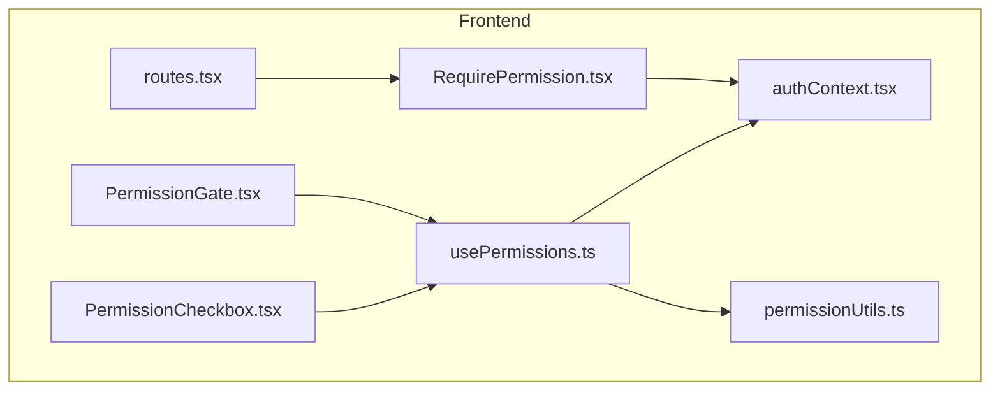
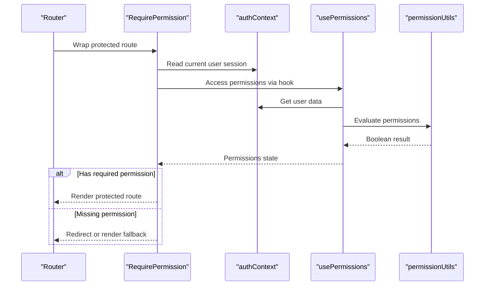
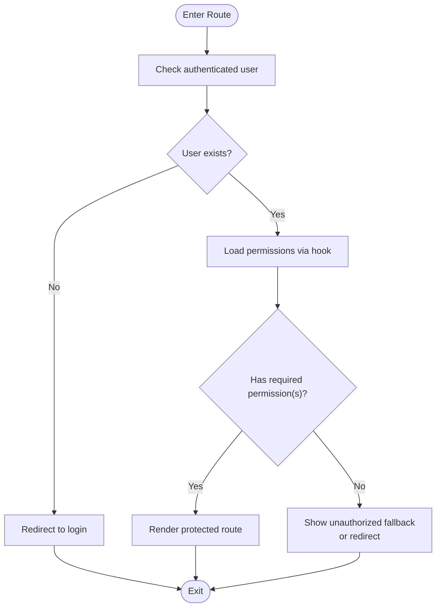
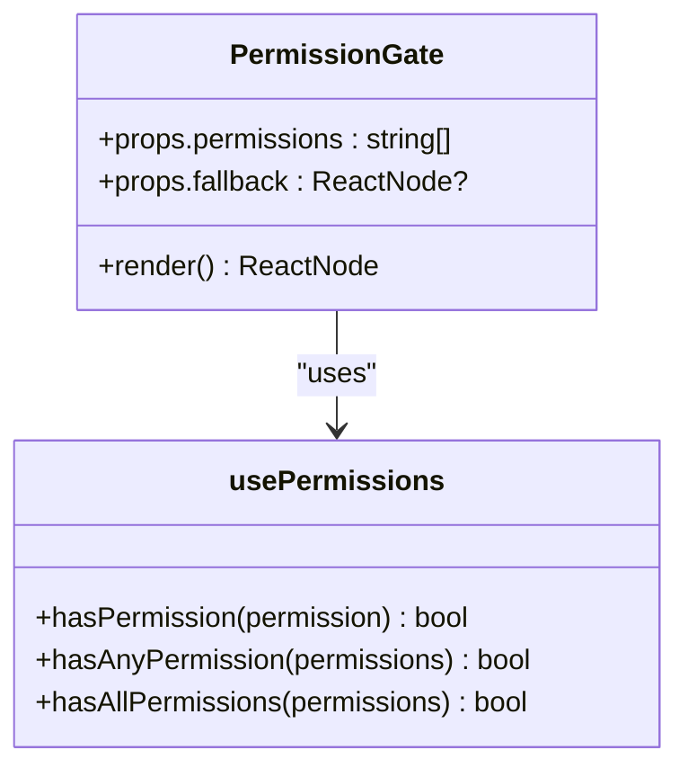
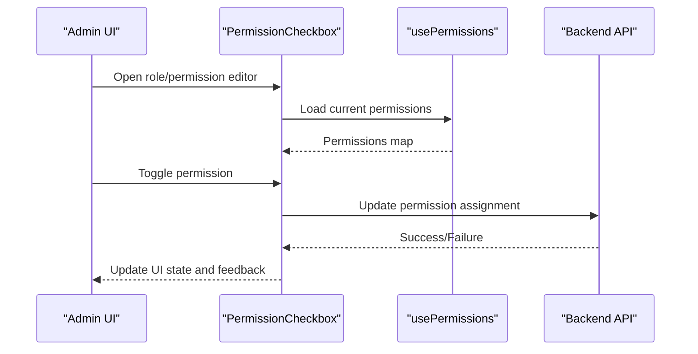
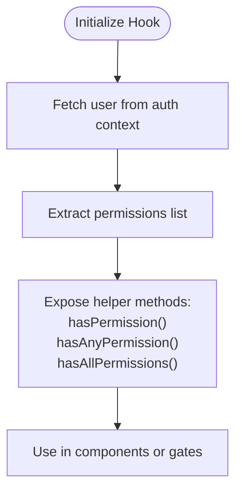
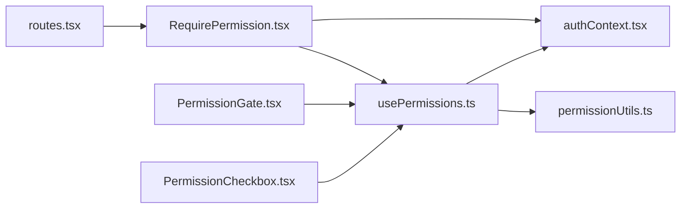

# Permission-Based UI Components

<cite>
**Referenced Files in This Document**
- [RequirePermission.tsx](file://frontend/src/components/auth/RequirePermission.tsx)
- [PermissionGate.tsx](file://frontend/src/components/auth/PermissionGate.tsx)
- [PermissionCheckbox.tsx](file://frontend/src/components/auth/PermissionCheckbox.tsx)
- [usePermissions.ts](file://frontend/src/hooks/usePermissions.ts)
- [authContext.tsx](file://frontend/src/lib/authContext.tsx)
- [permissionUtils.ts](file://frontend/src/lib/permissionUtils.ts)
- [routes.tsx](file://frontend/src/routes.tsx)
</cite>

## Table of Contents
1. [Introduction](#introduction)
2. [Project Structure](#project-structure)
3. [Core Components](#core-components)
4. [Architecture Overview](#architecture-overview)
5. [Detailed Component Analysis](#detailed-component-analysis)
6. [Dependency Analysis](#dependency-analysis)
7. [Performance Considerations](#performance-considerations)
8. [Troubleshooting Guide](#troubleshooting-guide)
9. [Conclusion](#conclusion)

## Introduction
This document explains the permission-based UI rendering system used to control access and visibility across the application. It covers:
- RequirePermission higher-order component for route-level access control
- PermissionGate component for conditional UI rendering
- PermissionCheckbox component for role and permission management interfaces
- usePermissions hook for accessing user permissions in React components

It also provides examples of implementing permission checks, handling unauthorized access scenarios, and creating dynamic UI based on user roles and permissions.

## Project Structure
The permission-related UI logic is implemented as reusable React components and hooks under the frontend source tree. The key files are organized by feature area (components and hooks) and integrated with routing and authentication context.

**Diagram sources**
- [RequirePermission.tsx](file://frontend/src/components/auth/RequirePermission.tsx)
- [PermissionGate.tsx](file://frontend/src/components/auth/PermissionGate.tsx)
- [PermissionCheckbox.tsx](file://frontend/src/components/auth/PermissionCheckbox.tsx)
- [usePermissions.ts](file://frontend/src/hooks/usePermissions.ts)
- [authContext.tsx](file://frontend/src/lib/authContext.tsx)
- [permissionUtils.ts](file://frontend/src/lib/permissionUtils.ts)
- [routes.tsx](file://frontend/src/routes.tsx)

**Section sources**
- [RequirePermission.tsx](file://frontend/src/components/auth/RequirePermission.tsx)
- [PermissionGate.tsx](file://frontend/src/components/auth/PermissionGate.tsx)
- [PermissionCheckbox.tsx](file://frontend/src/components/auth/PermissionCheckbox.tsx)
- [usePermissions.ts](file://frontend/src/hooks/usePermissions.ts)
- [authContext.tsx](file://frontend/src/lib/authContext.tsx)
- [permissionUtils.ts](file://frontend/src/lib/permissionUtils.ts)
- [routes.tsx](file://frontend/src/routes.tsx)

## Core Components
- RequirePermission: Higher-order component that enforces permission checks at the route level. It prevents navigation or renders a fallback when the current user lacks required permissions.
- PermissionGate: Component wrapper that conditionally renders its children only if the current user has the specified permissions. Useful for hiding/showing UI elements like buttons or sections.
- PermissionCheckbox: Interactive component for managing roles and permissions in admin interfaces. It allows toggling permissions per role or user and reflects authorization state.
- usePermissions: Hook that exposes the current user’s permissions and helper methods to check them within any React component.

These pieces work together to provide consistent, centralized authorization behavior across routes and UI elements.

**Section sources**
- [RequirePermission.tsx](file://frontend/src/components/auth/RequirePermission.tsx)
- [PermissionGate.tsx](file://frontend/src/components/auth/PermissionGate.tsx)
- [PermissionCheckbox.tsx](file://frontend/src/components/auth/PermissionCheckbox.tsx)
- [usePermissions.ts](file://frontend/src/hooks/usePermissions.ts)

## Architecture Overview
The permission system integrates with the authentication context and utility functions to evaluate permissions consistently.

**Diagram sources**
- [RequirePermission.tsx](file://frontend/src/components/auth/RequirePermission.tsx)
- [usePermissions.ts](file://frontend/src/hooks/usePermissions.ts)
- [authContext.tsx](file://frontend/src/lib/authContext.tsx)
- [permissionUtils.ts](file://frontend/src/lib/permissionUtils.ts)
- [routes.tsx](file://frontend/src/routes.tsx)

## Detailed Component Analysis

### RequirePermission (Route-Level Access Control)
Purpose:
- Enforce permissions before rendering a route.
- Redirect or show an unauthorized fallback when access is denied.

Key behaviors:
- Reads the current user from the authentication context.
- Uses the permissions hook to determine allowed actions.
- Applies permission rules against required permissions passed as props.
- Renders the wrapped route if authorized; otherwise, redirects or shows a fallback.

Integration points:
- Used to wrap protected routes in the router configuration.
- Depends on auth context and permission utilities.

**Diagram sources**
- [RequirePermission.tsx](file://frontend/src/components/auth/RequirePermission.tsx)
- [usePermissions.ts](file://frontend/src/hooks/usePermissions.ts)
- [authContext.tsx](file://frontend/src/lib/authContext.tsx)
- [permissionUtils.ts](file://frontend/src/lib/permissionUtils.ts)
- [routes.tsx](file://frontend/src/routes.tsx)

**Section sources**
- [RequirePermission.tsx](file://frontend/src/components/auth/RequirePermission.tsx)
- [routes.tsx](file://frontend/src/routes.tsx)

### PermissionGate (Conditional UI Rendering)
Purpose:
- Conditionally render UI elements based on the current user’s permissions.

Key behaviors:
- Accepts required permissions as props.
- Uses the permissions hook to evaluate access.
- Renders children if authorized; otherwise, renders nothing or a fallback node.

Usage patterns:
- Wrap action buttons, links, or entire sections.
- Combine multiple permission checks using logical combinations provided by the hook.

**Diagram sources**
- [PermissionGate.tsx](file://frontend/src/components/auth/PermissionGate.tsx)
- [usePermissions.ts](file://frontend/src/hooks/usePermissions.ts)

**Section sources**
- [PermissionGate.tsx](file://frontend/src/components/auth/PermissionGate.tsx)
- [usePermissions.ts](file://frontend/src/hooks/usePermissions.ts)

### PermissionCheckbox (Role and Permission Management Interface)
Purpose:
- Provide an interactive interface for administrators to manage roles and permissions.

Key behaviors:
- Displays checkboxes for each permission associated with a role or user.
- Reflects current permission state and supports toggling.
- Integrates with backend APIs to persist changes (via service calls).

Integration points:
- Consumes the permissions hook to reflect real-time permission states.
- May trigger notifications or audit logs upon updates.

**Diagram sources**
- [PermissionCheckbox.tsx](file://frontend/src/components/auth/PermissionCheckbox.tsx)
- [usePermissions.ts](file://frontend/src/hooks/usePermissions.ts)

**Section sources**
- [PermissionCheckbox.tsx](file://frontend/src/components/auth/PermissionCheckbox.tsx)
- [usePermissions.ts](file://frontend/src/hooks/usePermissions.ts)

### usePermissions Hook (Accessing User Permissions)
Purpose:
- Centralize permission evaluation logic and expose helpers to components.

Key behaviors:
- Retrieves the current user’s permissions from the authentication context.
- Provides helper methods such as checking a single permission, any permission, or all permissions.
- Memoizes results to avoid unnecessary re-renders.

Common usage:
- Inside components to decide whether to render specific UI.
- Combined with PermissionGate for declarative permission checks.

**Diagram sources**
- [usePermissions.ts](file://frontend/src/hooks/usePermissions.ts)
- [authContext.tsx](file://frontend/src/lib/authContext.tsx)
- [permissionUtils.ts](file://frontend/src/lib/permissionUtils.ts)

**Section sources**
- [usePermissions.ts](file://frontend/src/hooks/usePermissions.ts)
- [authContext.tsx](file://frontend/src/lib/authContext.tsx)
- [permissionUtils.ts](file://frontend/src/lib/permissionUtils.ts)

## Dependency Analysis
The permission system exhibits clear separation of concerns:
- RequirePermission depends on the permissions hook and auth context for route protection.
- PermissionGate and PermissionCheckbox depend on the permissions hook for UI decisions.
- The permissions hook depends on the auth context and permission utilities for evaluation.

**Diagram sources**
- [routes.tsx](file://frontend/src/routes.tsx)
- [RequirePermission.tsx](file://frontend/src/components/auth/RequirePermission.tsx)
- [PermissionGate.tsx](file://frontend/src/components/auth/PermissionGate.tsx)
- [PermissionCheckbox.tsx](file://frontend/src/components/auth/PermissionCheckbox.tsx)
- [usePermissions.ts](file://frontend/src/hooks/usePermissions.ts)
- [authContext.tsx](file://frontend/src/lib/authContext.tsx)
- [permissionUtils.ts](file://frontend/src/lib/permissionUtils.ts)

**Section sources**
- [routes.tsx](file://frontend/src/routes.tsx)
- [RequirePermission.tsx](file://frontend/src/components/auth/RequirePermission.tsx)
- [PermissionGate.tsx](file://frontend/src/components/auth/PermissionGate.tsx)
- [PermissionCheckbox.tsx](file://frontend/src/components/auth/PermissionCheckbox.tsx)
- [usePermissions.ts](file://frontend/src/hooks/usePermissions.ts)
- [authContext.tsx](file://frontend/src/lib/authContext.tsx)
- [permissionUtils.ts](file://frontend/src/lib/permissionUtils.ts)

## Performance Considerations
- Memoization: Ensure the permissions hook memoizes computed results to prevent excessive re-renders.
- Minimal re-evaluation: Gate components should only re-render when relevant permissions change.
- Avoid heavy computations inside render paths; delegate complex checks to utility functions.
- Batch updates: When updating permissions via PermissionCheckbox, batch API calls where possible to reduce network overhead.

[No sources needed since this section provides general guidance]

## Troubleshooting Guide
Common issues and resolutions:
- Unauthorized fallback appears unexpectedly:
  - Verify that the required permissions match those assigned to the user’s role.
  - Confirm that the authentication context contains valid user data.
- PermissionCheckbox does not reflect changes:
  - Ensure the backend update succeeded and the permissions cache is refreshed.
  - Check that the hook reads the latest permissions from the context.
- Route redirection loops:
  - Validate that RequirePermission handles missing users correctly and redirects to login without infinite loops.
- Conditional UI not showing:
  - Double-check the permission names and case sensitivity.
  - Ensure PermissionGate receives the correct permissions array.

**Section sources**
- [RequirePermission.tsx](file://frontend/src/components/auth/RequirePermission.tsx)
- [PermissionGate.tsx](file://frontend/src/components/auth/PermissionGate.tsx)
- [PermissionCheckbox.tsx](file://frontend/src/components/auth/PermissionCheckbox.tsx)
- [usePermissions.ts](file://frontend/src/hooks/usePermissions.ts)
- [authContext.tsx](file://frontend/src/lib/authContext.tsx)
- [permissionUtils.ts](file://frontend/src/lib/permissionUtils.ts)

## Conclusion
The permission-based UI system provides a robust, composable approach to controlling access and visibility across the application. By centralizing permission evaluation in a hook and exposing declarative components, developers can implement secure and maintainable interfaces. RequirePermission ensures route-level security, PermissionGate enables fine-grained UI control, PermissionCheckbox simplifies administration, and usePermissions offers a consistent API for permission checks throughout the codebase.

[No sources needed since this section summarizes without analyzing specific files]