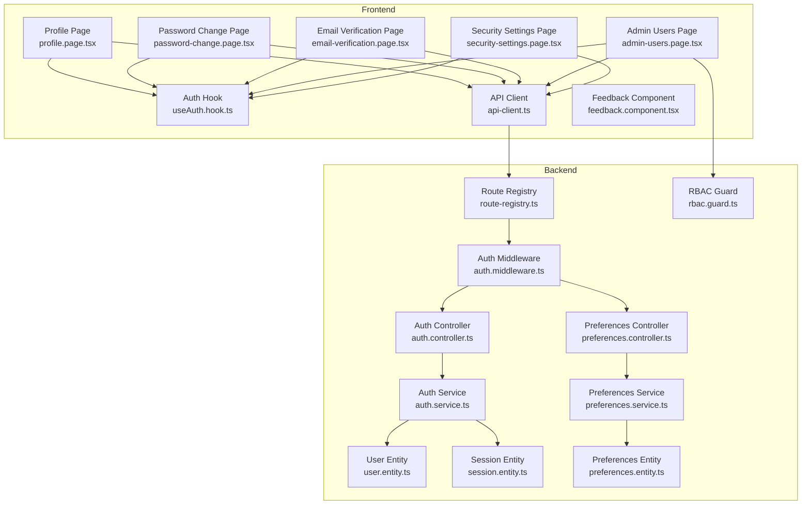
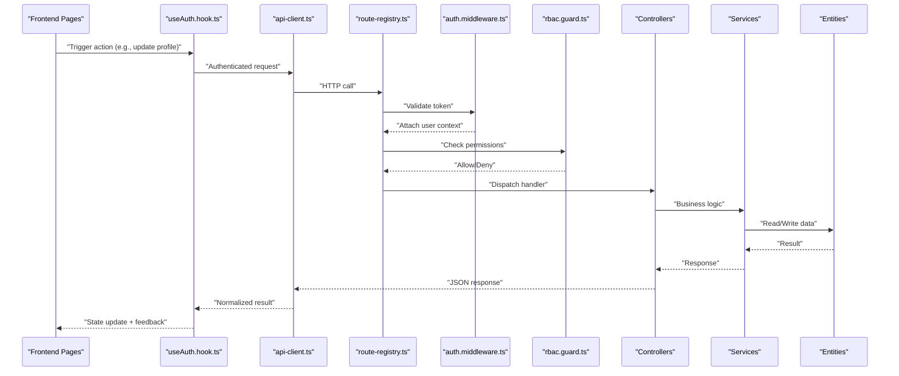
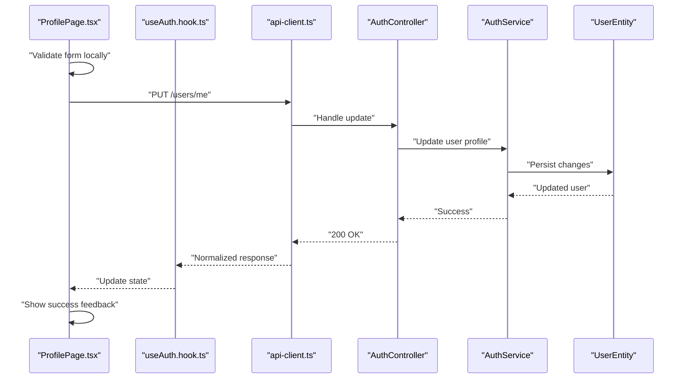
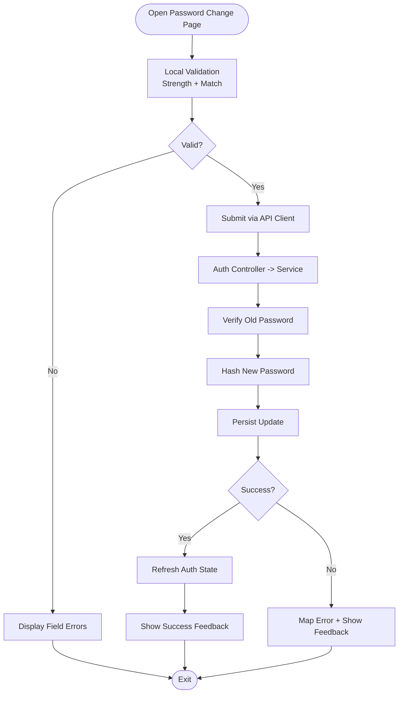
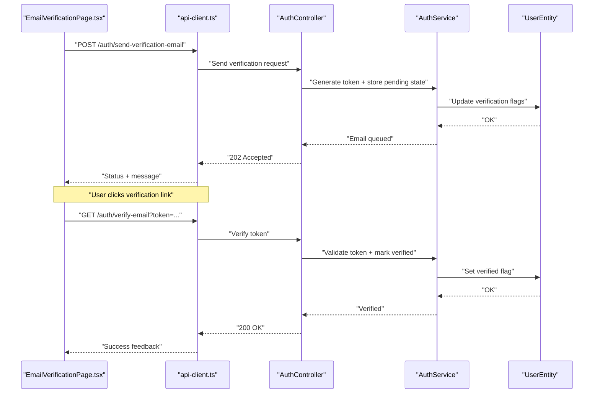
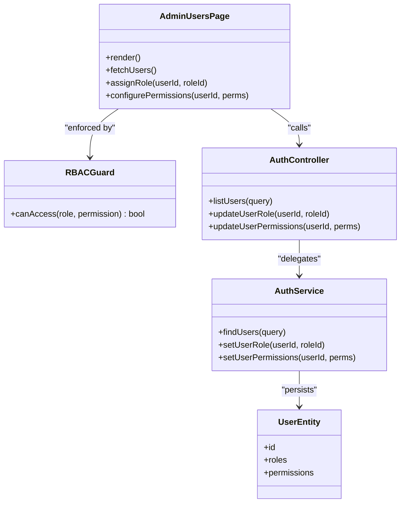
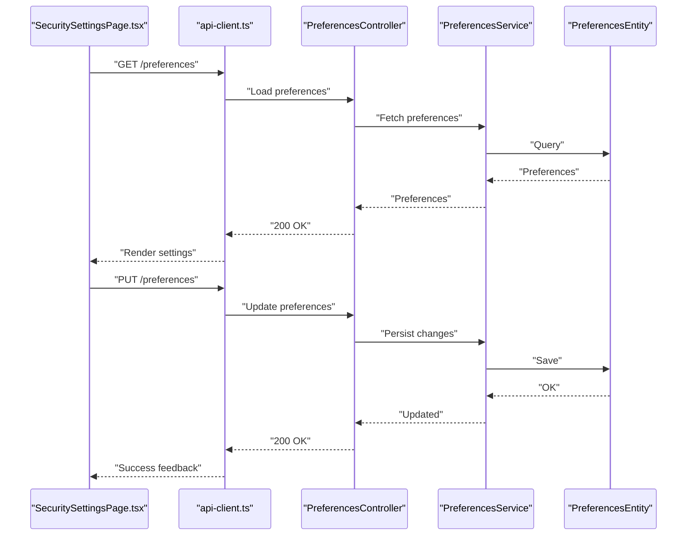
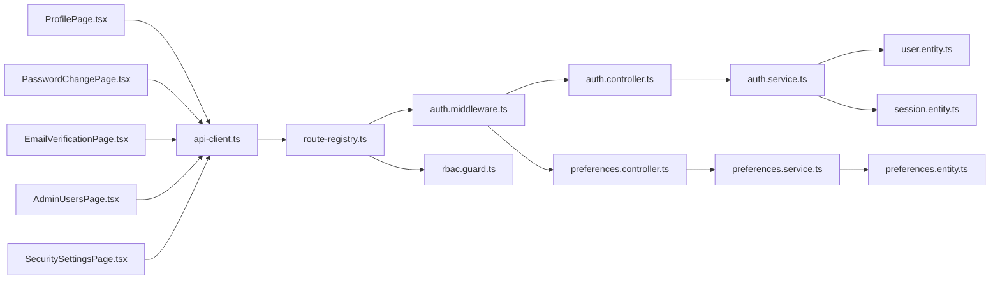

# User Profile & Security Settings

<cite>
**Referenced Files in This Document**
- [auth.controller.ts](file://backend/src/modules/auth/controllers/auth.controller.ts)
- [auth.service.ts](file://backend/src/modules/auth/services/auth.service.ts)
- [user.entity.ts](file://backend/src/modules/auth/entities/user.entity.ts)
- [session.entity.ts](file://backend/src/modules/auth/entities/session.entity.ts)
- [preferences.entity.ts](file://backend/src/modules/configuration/entities/preferences.entity.ts)
- [preferences.service.ts](file://backend/src/modules/configuration/services/preferences.service.ts)
- [preferences.controller.ts](file://backend/src/modules/configuration/controllers/preferences.controller.ts)
- [rbac.guard.ts](file://backend/src/common/guards/rbac.guard.ts)
- [auth.middleware.ts](file://backend/src/common/middlewares/auth.middleware.ts)
- [route-registry.ts](file://backend/src/routes/route-registry.ts)
- [profile.page.tsx](file://frontend/src/features/profile/ProfilePage.tsx)
- [password-change.page.tsx](file://frontend/src/features/security/PasswordChangePage.tsx)
- [email-verification.page.tsx](file://frontend/src/features/security/EmailVerificationPage.tsx)
- [admin-users.page.tsx](file://frontend/src/features/admin/AdminUsersPage.tsx)
- [security-settings.page.tsx](file://frontend/src/features/security/SecuritySettingsPage.tsx)
- [useAuth.hook.ts](file://frontend/src/hooks/useAuth.hook.ts)
- [api-client.ts](file://frontend/src/lib/api-client.ts)
- [feedback.component.tsx](file://frontend/src/components/ui/FeedbackComponent.tsx)
</cite>

## Table of Contents
1. [Introduction](#introduction)
2. [Project Structure](#project-structure)
3. [Core Components](#core-components)
4. [Architecture Overview](#architecture-overview)
5. [Detailed Component Analysis](#detailed-component-analysis)
6. [Dependency Analysis](#dependency-analysis)
7. [Performance Considerations](#performance-considerations)
8. [Troubleshooting Guide](#troubleshooting-guide)
9. [Conclusion](#conclusion)

## Introduction
This document explains the user profile management and security settings features across frontend and backend layers. It covers:
- User profile editing components and data synchronization with backend APIs
- Password change workflows and validation
- Email verification processes
- Administrator user management interface including role assignment and permission configuration
- Security settings pages for session management, two-factor authentication setup, and account preferences
- Form validation strategies, error handling, and user feedback mechanisms

The goal is to provide both a high-level understanding and detailed implementation references for developers and administrators.

## Project Structure
The relevant functionality spans:
- Backend modules for authentication, sessions, preferences, RBAC guards, middleware, and route registration
- Frontend features for profile editing, password changes, email verification, admin user management, and security settings
- Shared hooks and API client utilities for state and HTTP interactions
- UI feedback components for consistent user messaging

**Diagram sources**
- [route-registry.ts](file://backend/src/routes/route-registry.ts)
- [auth.middleware.ts](file://backend/src/common/middlewares/auth.middleware.ts)
- [rbac.guard.ts](file://backend/src/common/guards/rbac.guard.ts)
- [auth.controller.ts](file://backend/src/modules/auth/controllers/auth.controller.ts)
- [auth.service.ts](file://backend/src/modules/auth/services/auth.service.ts)
- [user.entity.ts](file://backend/src/modules/auth/entities/user.entity.ts)
- [session.entity.ts](file://backend/src/modules/auth/entities/session.entity.ts)
- [preferences.controller.ts](file://backend/src/modules/configuration/controllers/preferences.controller.ts)
- [preferences.service.ts](file://backend/src/modules/configuration/services/preferences.service.ts)
- [preferences.entity.ts](file://backend/src/modules/configuration/entities/preferences.entity.ts)
- [profile.page.tsx](file://frontend/src/features/profile/ProfilePage.tsx)
- [password-change.page.tsx](file://frontend/src/features/security/PasswordChangePage.tsx)
- [email-verification.page.tsx](file://frontend/src/features/security/EmailVerificationPage.tsx)
- [admin-users.page.tsx](file://frontend/src/features/admin/AdminUsersPage.tsx)
- [security-settings.page.tsx](file://frontend/src/features/security/SecuritySettingsPage.tsx)
- [useAuth.hook.ts](file://frontend/src/hooks/useAuth.hook.ts)
- [api-client.ts](file://frontend/src/lib/api-client.ts)
- [feedback.component.tsx](file://frontend/src/components/ui/FeedbackComponent.tsx)

**Section sources**
- [route-registry.ts](file://backend/src/routes/route-registry.ts)
- [auth.middleware.ts](file://backend/src/common/middlewares/auth.middleware.ts)
- [rbac.guard.ts](file://backend/src/common/guards/rbac.guard.ts)
- [auth.controller.ts](file://backend/src/modules/auth/controllers/auth.controller.ts)
- [auth.service.ts](file://backend/src/modules/auth/services/auth.service.ts)
- [user.entity.ts](file://backend/src/modules/auth/entities/user.entity.ts)
- [session.entity.ts](file://backend/src/modules/auth/entities/session.entity.ts)
- [preferences.controller.ts](file://backend/src/modules/configuration/controllers/preferences.controller.ts)
- [preferences.service.ts](file://backend/src/modules/configuration/services/preferences.service.ts)
- [preferences.entity.ts](file://backend/src/modules/configuration/entities/preferences.entity.ts)
- [profile.page.tsx](file://frontend/src/features/profile/ProfilePage.tsx)
- [password-change.page.tsx](file://frontend/src/features/security/PasswordChangePage.tsx)
- [email-verification.page.tsx](file://frontend/src/features/security/EmailVerificationPage.tsx)
- [admin-users.page.tsx](file://frontend/src/features/admin/AdminUsersPage.tsx)
- [security-settings.page.tsx](file://frontend/src/features/security/SecuritySettingsPage.tsx)
- [useAuth.hook.ts](file://frontend/src/hooks/useAuth.hook.ts)
- [api-client.ts](file://frontend/src/lib/api-client.ts)
- [feedback.component.tsx](file://frontend/src/components/ui/FeedbackComponent.tsx)

## Core Components
- Authentication controller and service handle login, logout, token refresh, password updates, and email verification requests. They interact with user and session entities.
- Preferences controller and service manage user account preferences (e.g., language, theme), persisted via the preferences entity.
- RBAC guard enforces role-based access control on protected routes and endpoints.
- Auth middleware validates tokens and attaches user context to requests.
- Frontend pages implement profile editing, password change, email verification, admin user management, and security settings.
- The auth hook centralizes authentication state and actions.
- The API client abstracts HTTP calls and error mapping.
- Feedback component provides consistent success/error notifications.

**Section sources**
- [auth.controller.ts](file://backend/src/modules/auth/controllers/auth.controller.ts)
- [auth.service.ts](file://backend/src/modules/auth/services/auth.service.ts)
- [user.entity.ts](file://backend/src/modules/auth/entities/user.entity.ts)
- [session.entity.ts](file://backend/src/modules/auth/entities/session.entity.ts)
- [preferences.controller.ts](file://backend/src/modules/configuration/controllers/preferences.controller.ts)
- [preferences.service.ts](file://backend/src/modules/configuration/services/preferences.service.ts)
- [preferences.entity.ts](file://backend/src/modules/configuration/entities/preferences.entity.ts)
- [rbac.guard.ts](file://backend/src/common/guards/rbac.guard.ts)
- [auth.middleware.ts](file://backend/src/common/middlewares/auth.middleware.ts)
- [profile.page.tsx](file://frontend/src/features/profile/ProfilePage.tsx)
- [password-change.page.tsx](file://frontend/src/features/security/PasswordChangePage.tsx)
- [email-verification.page.tsx](file://frontend/src/features/security/EmailVerificationPage.tsx)
- [admin-users.page.tsx](file://frontend/src/features/admin/AdminUsersPage.tsx)
- [security-settings.page.tsx](file://frontend/src/features/security/SecuritySettingsPage.tsx)
- [useAuth.hook.ts](file://frontend/src/hooks/useAuth.hook.ts)
- [api-client.ts](file://frontend/src/lib/api-client.ts)
- [feedback.component.tsx](file://frontend/src/components/ui/FeedbackComponent.tsx)

## Architecture Overview
The system follows a layered architecture:
- Frontend pages call the API client, which sends authenticated requests through the auth hook.
- Backend routes are registered centrally and protected by middleware and guards.
- Controllers delegate business logic to services, which operate on entities.
- Preferences are managed independently from authentication but share common middleware and guards.

**Diagram sources**
- [route-registry.ts](file://backend/src/routes/route-registry.ts)
- [auth.middleware.ts](file://backend/src/common/middlewares/auth.middleware.ts)
- [rbac.guard.ts](file://backend/src/common/guards/rbac.guard.ts)
- [auth.controller.ts](file://backend/src/modules/auth/controllers/auth.controller.ts)
- [auth.service.ts](file://backend/src/modules/auth/services/auth.service.ts)
- [user.entity.ts](file://backend/src/modules/auth/entities/user.entity.ts)
- [session.entity.ts](file://backend/src/modules/auth/entities/session.entity.ts)
- [preferences.controller.ts](file://backend/src/modules/configuration/controllers/preferences.controller.ts)
- [preferences.service.ts](file://backend/src/modules/configuration/services/preferences.service.ts)
- [preferences.entity.ts](file://backend/src/modules/configuration/entities/preferences.entity.ts)
- [useAuth.hook.ts](file://frontend/src/hooks/useAuth.hook.ts)
- [api-client.ts](file://frontend/src/lib/api-client.ts)

## Detailed Component Analysis

### User Profile Editing
- Frontend page collects user fields, performs local validation, and submits via the API client.
- The auth hook manages current user state; upon successful update, it refreshes local state.
- Backend controller receives the update, service validates and persists changes to the user entity.
- Feedback component displays success or error messages.

**Diagram sources**
- [profile.page.tsx](file://frontend/src/features/profile/ProfilePage.tsx)
- [useAuth.hook.ts](file://frontend/src/hooks/useAuth.hook.ts)
- [api-client.ts](file://frontend/src/lib/api-client.ts)
- [auth.controller.ts](file://backend/src/modules/auth/controllers/auth.controller.ts)
- [auth.service.ts](file://backend/src/modules/auth/services/auth.service.ts)
- [user.entity.ts](file://backend/src/modules/auth/entities/user.entity.ts)

**Section sources**
- [profile.page.tsx](file://frontend/src/features/profile/ProfilePage.tsx)
- [useAuth.hook.ts](file://frontend/src/hooks/useAuth.hook.ts)
- [api-client.ts](file://frontend/src/lib/api-client.ts)
- [auth.controller.ts](file://backend/src/modules/auth/controllers/auth.controller.ts)
- [auth.service.ts](file://backend/src/modules/auth/services/auth.service.ts)
- [user.entity.ts](file://backend/src/modules/auth/entities/user.entity.ts)
- [feedback.component.tsx](file://frontend/src/components/ui/FeedbackComponent.tsx)

### Password Change Workflow
- Frontend validates new password strength and confirmation match.
- Submit triggers an endpoint that verifies old password and applies the new one.
- On success, the auth hook may refresh session metadata and show feedback.

**Diagram sources**
- [password-change.page.tsx](file://frontend/src/features/security/PasswordChangePage.tsx)
- [api-client.ts](file://frontend/src/lib/api-client.ts)
- [auth.controller.ts](file://backend/src/modules/auth/controllers/auth.controller.ts)
- [auth.service.ts](file://backend/src/modules/auth/services/auth.service.ts)
- [user.entity.ts](file://backend/src/modules/auth/entities/user.entity.ts)
- [feedback.component.tsx](file://frontend/src/components/ui/FeedbackComponent.tsx)

**Section sources**
- [password-change.page.tsx](file://frontend/src/features/security/PasswordChangePage.tsx)
- [api-client.ts](file://frontend/src/lib/api-client.ts)
- [auth.controller.ts](file://backend/src/modules/auth/controllers/auth.controller.ts)
- [auth.service.ts](file://backend/src/modules/auth/services/auth.service.ts)
- [user.entity.ts](file://backend/src/modules/auth/entities/user.entity.ts)
- [feedback.component.tsx](file://frontend/src/components/ui/FeedbackComponent.tsx)

### Email Verification Process
- Frontend initiates sending a verification email and handles status responses.
- Backend generates a secure token and stores verification state in the user entity.
- User clicks verification link; backend validates token and marks email as verified.

**Diagram sources**
- [email-verification.page.tsx](file://frontend/src/features/security/EmailVerificationPage.tsx)
- [api-client.ts](file://frontend/src/lib/api-client.ts)
- [auth.controller.ts](file://backend/src/modules/auth/controllers/auth.controller.ts)
- [auth.service.ts](file://backend/src/modules/auth/services/auth.service.ts)
- [user.entity.ts](file://backend/src/modules/auth/entities/user.entity.ts)

**Section sources**
- [email-verification.page.tsx](file://frontend/src/features/security/EmailVerificationPage.tsx)
- [api-client.ts](file://frontend/src/lib/api-client.ts)
- [auth.controller.ts](file://backend/src/modules/auth/controllers/auth.controller.ts)
- [auth.service.ts](file://backend/src/modules/auth/services/auth.service.ts)
- [user.entity.ts](file://backend/src/modules/auth/entities/user.entity.ts)

### Administrator User Management Interface
- Admin users page lists users, supports filtering and pagination.
- Role assignment and permission configuration are performed via dedicated endpoints guarded by RBAC.
- Changes are persisted and reflected immediately in the UI.

**Diagram sources**
- [admin-users.page.tsx](file://frontend/src/features/admin/AdminUsersPage.tsx)
- [rbac.guard.ts](file://backend/src/common/guards/rbac.guard.ts)
- [auth.controller.ts](file://backend/src/modules/auth/controllers/auth.controller.ts)
- [auth.service.ts](file://backend/src/modules/auth/services/auth.service.ts)
- [user.entity.ts](file://backend/src/modules/auth/entities/user.entity.ts)

**Section sources**
- [admin-users.page.tsx](file://frontend/src/features/admin/AdminUsersPage.tsx)
- [rbac.guard.ts](file://backend/src/common/guards/rbac.guard.ts)
- [auth.controller.ts](file://backend/src/modules/auth/controllers/auth.controller.ts)
- [auth.service.ts](file://backend/src/modules/auth/services/auth.service.ts)
- [user.entity.ts](file://backend/src/modules/auth/entities/user.entity.ts)

### Security Settings: Sessions, Two-Factor Authentication, Account Preferences
- Session management: list active sessions, revoke sessions, and view last login details.
- Two-factor authentication: enable/disable TOTP, scan QR code, verify setup code.
- Account preferences: update language, theme, notification toggles via preferences endpoints.

**Diagram sources**
- [security-settings.page.tsx](file://frontend/src/features/security/SecuritySettingsPage.tsx)
- [api-client.ts](file://frontend/src/lib/api-client.ts)
- [preferences.controller.ts](file://backend/src/modules/configuration/controllers/preferences.controller.ts)
- [preferences.service.ts](file://backend/src/modules/configuration/services/preferences.service.ts)
- [preferences.entity.ts](file://backend/src/modules/configuration/entities/preferences.entity.ts)

**Section sources**
- [security-settings.page.tsx](file://frontend/src/features/security/SecuritySettingsPage.tsx)
- [api-client.ts](file://frontend/src/lib/api-client.ts)
- [preferences.controller.ts](file://backend/src/modules/configuration/controllers/preferences.controller.ts)
- [preferences.service.ts](file://backend/src/modules/configuration/services/preferences.service.ts)
- [preferences.entity.ts](file://backend/src/modules/configuration/entities/preferences.entity.ts)

## Dependency Analysis
- Frontend pages depend on the API client and auth hook for state and HTTP operations.
- Backend routes are centralized and protected by middleware and guards before reaching controllers.
- Controllers rely on services for business logic and persistence via entities.
- RBAC guard ensures only authorized roles can perform sensitive operations like role assignment and permission configuration.

**Diagram sources**
- [profile.page.tsx](file://frontend/src/features/profile/ProfilePage.tsx)
- [password-change.page.tsx](file://frontend/src/features/security/PasswordChangePage.tsx)
- [email-verification.page.tsx](file://frontend/src/features/security/EmailVerificationPage.tsx)
- [admin-users.page.tsx](file://frontend/src/features/admin/AdminUsersPage.tsx)
- [security-settings.page.tsx](file://frontend/src/features/security/SecuritySettingsPage.tsx)
- [api-client.ts](file://frontend/src/lib/api-client.ts)
- [route-registry.ts](file://backend/src/routes/route-registry.ts)
- [auth.middleware.ts](file://backend/src/common/middlewares/auth.middleware.ts)
- [rbac.guard.ts](file://backend/src/common/guards/rbac.guard.ts)
- [auth.controller.ts](file://backend/src/modules/auth/controllers/auth.controller.ts)
- [auth.service.ts](file://backend/src/modules/auth/services/auth.service.ts)
- [user.entity.ts](file://backend/src/modules/auth/entities/user.entity.ts)
- [session.entity.ts](file://backend/src/modules/auth/entities/session.entity.ts)
- [preferences.controller.ts](file://backend/src/modules/configuration/controllers/preferences.controller.ts)
- [preferences.service.ts](file://backend/src/modules/configuration/services/preferences.service.ts)
- [preferences.entity.ts](file://backend/src/modules/configuration/entities/preferences.entity.ts)

**Section sources**
- [route-registry.ts](file://backend/src/routes/route-registry.ts)
- [auth.middleware.ts](file://backend/src/common/middlewares/auth.middleware.ts)
- [rbac.guard.ts](file://backend/src/common/guards/rbac.guard.ts)
- [auth.controller.ts](file://backend/src/modules/auth/controllers/auth.controller.ts)
- [auth.service.ts](file://backend/src/modules/auth/services/auth.service.ts)
- [user.entity.ts](file://backend/src/modules/auth/entities/user.entity.ts)
- [session.entity.ts](file://backend/src/modules/auth/entities/session.entity.ts)
- [preferences.controller.ts](file://backend/src/modules/configuration/controllers/preferences.controller.ts)
- [preferences.service.ts](file://backend/src/modules/configuration/services/preferences.service.ts)
- [preferences.entity.ts](file://backend/src/modules/configuration/entities/preferences.entity.ts)
- [profile.page.tsx](file://frontend/src/features/profile/ProfilePage.tsx)
- [password-change.page.tsx](file://frontend/src/features/security/PasswordChangePage.tsx)
- [email-verification.page.tsx](file://frontend/src/features/security/EmailVerificationPage.tsx)
- [admin-users.page.tsx](file://frontend/src/features/admin/AdminUsersPage.tsx)
- [security-settings.page.tsx](file://frontend/src/features/security/SecuritySettingsPage.tsx)
- [api-client.ts](file://frontend/src/lib/api-client.ts)

## Performance Considerations
- Minimize re-renders by batching updates in the auth hook and using optimistic UI where safe.
- Implement server-side pagination and field selection for large user lists in admin interfaces.
- Cache frequently read preferences on the client with invalidation on updates.
- Use idempotent endpoints for critical operations (e.g., password change, email verification).
- Avoid unnecessary network calls by debouncing search inputs and leveraging query parameters efficiently.

## Troubleshooting Guide
Common issues and resolutions:
- Token expiration or invalid token errors: ensure middleware correctly attaches tokens and refresh flows are implemented.
- Permission denied when assigning roles: verify RBAC guard policies and that the admin has required permissions.
- Email verification not completing: check token generation, storage, and link validity; confirm backend marks email as verified.
- Preferences not saving: validate payload structure and ensure preferences service persists changes to the entity.
- Feedback not displayed: confirm the feedback component is integrated into each page’s success/error handlers.

**Section sources**
- [auth.middleware.ts](file://backend/src/common/middlewares/auth.middleware.ts)
- [rbac.guard.ts](file://backend/src/common/guards/rbac.guard.ts)
- [auth.controller.ts](file://backend/src/modules/auth/controllers/auth.controller.ts)
- [auth.service.ts](file://backend/src/modules/auth/services/auth.service.ts)
- [preferences.controller.ts](file://backend/src/modules/configuration/controllers/preferences.controller.ts)
- [preferences.service.ts](file://backend/src/modules/configuration/services/preferences.service.ts)
- [feedback.component.tsx](file://frontend/src/components/ui/FeedbackComponent.tsx)

## Conclusion
The user profile and security settings features are implemented with clear separation of concerns:
- Frontend pages focus on UX, validation, and feedback.
- Backend routes, middleware, and guards enforce security and authorization.
- Services encapsulate business logic and persistence via entities.
This structure supports maintainability, scalability, and robust user experiences for profile editing, password changes, email verification, admin user management, and security settings.