# Component Architecture

<cite>
**Referenced Files in This Document**
- [App.tsx](file://frontend/src/App.tsx)
- [main.tsx](file://frontend/src/main.tsx)
- [routeTree.gen.ts](file://frontend/src/routeTree.gen.ts)
- [components/ui/index.ts](file://frontend/src/components/ui/index.ts)
- [components/ui/DataTable.tsx](file://frontend/src/components/ui/DataTable.tsx)
- [components/ui/Card.tsx](file://frontend/src/components/ui/Card.tsx)
- [components/ui/Button.tsx](file://frontend/src/components/ui/Button.tsx)
- [features/auth/AuthProvider.tsx](file://frontend/src/features/auth/AuthProvider.tsx)
- [features/dashboard/DashboardProvider.tsx](file://frontend/src/features/dashboard/DashboardProvider.tsx)
- [hooks/useAuth.ts](file://frontend/src/hooks/useAuth.ts)
- [hooks/usePagination.ts](file://frontend/src/hooks/usePagination.ts)
- [lib/api.ts](file://frontend/src/lib/api.ts)
- [stores/appStore.ts](file://frontend/src/stores/appStore.ts)
</cite>

## Update Summary
**Changes Made**
- Added comprehensive coverage of the new interactive organizational chart system with multiple visualization modes
- Enhanced documentation for nomenclature management pages and their component architecture
- Integrated template generation system components and workflows
- Updated navigation structure documentation reflecting the consolidated Organisation menu
- Expanded UI component library documentation with new visualization components
- Enhanced provider system documentation for complex state management scenarios

## Table of Contents
1. [Introduction](#introduction)
2. [Project Structure](#project-structure)
3. [Core Components](#core-components)
4. [Architecture Overview](#architecture-overview)
5. [Interactive Organizational Chart System](#interactive-organizational-chart-system)
6. [Enhanced Nomenclature Management](#enhanced-nomenclature-management)
7. [Template Generation System](#template-generation-system)
8. [Consolidated Navigation Structure](#consolidated-navigation-structure)
9. [Detailed Component Analysis](#detailed-component-analysis)
10. [Dependency Analysis](#dependency-analysis)
11. [Performance Considerations](#performance-considerations)
12. [Troubleshooting Guide](#troubleshooting-guide)
13. [Conclusion](#conclusion)

## Introduction
This document explains the React component architecture with a focus on feature-based organization, shared UI components, composition patterns, prop interfaces, event handling, providers for global state and context, testing strategies, and performance optimization techniques. The architecture has been significantly enhanced with new interactive visualization systems, advanced management interfaces, and streamlined navigation structures to support complex organizational data management and template-driven workflows.

## Project Structure
The frontend follows a feature-based organization where each business domain owns its components, hooks, types, and utilities. Shared UI primitives live under a common UI layer. Providers encapsulate global state and contexts. Routes are generated by the router and compose feature pages. The recent overhaul introduces specialized modules for organizational charting, nomenclature management, and template generation.

```mermaid
graph TB
subgraph "Entry"
main_tsx["main.tsx"]
app_tsx["App.tsx"]
route_tree["routeTree.gen.ts"]
end
subgraph "Shared UI"
ui_index["components/ui/index.ts"]
ui_datatable["components/ui/DataTable.tsx"]
ui_card["components/ui/Card.tsx"]
ui_button["components/ui/Button.tsx"]
ui_chart["components/ui/OrganizationalChart.tsx"]
ui_template["components/ui/TemplateGenerator.tsx"]
end
subgraph "Features"
auth_provider["features/auth/AuthProvider.tsx"]
dashboard_provider["features/dashboard/DashboardProvider.tsx"]
org_chart["features/organisation/OrganisationalChart.tsx"]
nomenclature["features/nomenclature/NomenclatureManager.tsx"]
templates["features/templates/TemplateSystem.tsx"]
end
subgraph "Hooks"
use_auth["hooks/useAuth.ts"]
use_pagination["hooks/usePagination.ts"]
use_chart["hooks/useOrganisationalChart.ts"]
use_templates["hooks/useTemplates.ts"]
end
subgraph "Libraries"
api_lib["lib/api.ts"]
chart_engine["lib/chartEngine.ts"]
template_engine["lib/templateEngine.ts"]
end
subgraph "Stores"
app_store["stores/appStore.ts"]
chart_store["stores/chartStore.ts"]
template_store["stores/templateStore.ts"]
end
main_tsx --> app_tsx
app_tsx --> route_tree
route_tree --> auth_provider
route_tree --> dashboard_provider
route_tree --> org_chart
route_tree --> nomenclature
route_tree --> templates
auth_provider --> use_auth
dashboard_provider --> use_pagination
org_chart --> use_chart
nomenclature --> use_templates
ui_datatable --> use_pagination
ui_card --> ui_button
ui_chart --> use_chart
ui_template --> use_templates
ui_button --> api_lib
app_tsx --> app_store
```

**Diagram sources**
- [main.tsx](file://frontend/src/main.tsx)
- [App.tsx](file://frontend/src/App.tsx)
- [routeTree.gen.ts](file://frontend/src/routeTree.gen.ts)
- [components/ui/index.ts](file://frontend/src/components/ui/index.ts)
- [components/ui/DataTable.tsx](file://frontend/src/components/ui/DataTable.tsx)
- [components/ui/Card.tsx](file://frontend/src/components/ui/Card.tsx)
- [components/ui/Button.tsx](file://frontend/src/components/ui/Button.tsx)
- [features/auth/AuthProvider.tsx](file://frontend/src/features/auth/AuthProvider.tsx)
- [features/dashboard/DashboardProvider.tsx](file://frontend/src/features/dashboard/DashboardProvider.tsx)
- [hooks/useAuth.ts](file://frontend/src/hooks/useAuth.ts)
- [hooks/usePagination.ts](file://frontend/src/hooks/usePagination.ts)
- [lib/api.ts](file://frontend/src/lib/api.ts)
- [stores/appStore.ts](file://frontend/src/stores/appStore.ts)

**Section sources**
- [main.tsx](file://frontend/src/main.tsx)
- [App.tsx](file://frontend/src/App.tsx)
- [routeTree.gen.ts](file://frontend/src/routeTree.gen.ts)

## Core Components
- Feature-based domains: Each feature folder contains its own components, hooks, types, and utilities. This isolates concerns and improves maintainability.
- Shared UI layer: Reusable primitives (e.g., DataTable, Card, Button) are centralized under components/ui and re-exported via an index file for consistent imports.
- Composition patterns: Complex screens are composed from small, focused components. Props define clear contracts; events are passed as callbacks.
- Providers: Global state and contexts are provided at appropriate boundaries (e.g., authentication, dashboard configuration).
- Hooks: Domain-specific logic is extracted into custom hooks (e.g., useAuth, usePagination), promoting reuse and testability.
- API integration: Network calls are abstracted through a library module to keep components free of HTTP details.
- **New**: Specialized visualization components for complex data representation and interactive charting capabilities.

**Section sources**
- [components/ui/index.ts](file://frontend/src/components/ui/index.ts)
- [components/ui/DataTable.tsx](file://frontend/src/components/ui/DataTable.tsx)
- [components/ui/Card.tsx](file://frontend/src/components/ui/Card.tsx)
- [components/ui/Button.tsx](file://frontend/src/components/ui/Button.tsx)
- [features/auth/AuthProvider.tsx](file://frontend/src/features/auth/AuthProvider.tsx)
- [features/dashboard/DashboardProvider.tsx](file://frontend/src/features/dashboard/DashboardProvider.tsx)
- [hooks/useAuth.ts](file://frontend/src/hooks/useAuth.ts)
- [hooks/usePagination.ts](file://frontend/src/hooks/usePagination.ts)
- [lib/api.ts](file://frontend/src/lib/api.ts)

## Architecture Overview
The application bootstraps via the entry point, mounts the root App, and uses a generated route tree to render feature routes. Providers wrap relevant sections to supply global state and contexts. Shared UI components are used across features to ensure consistency. The enhanced architecture now supports complex interactive visualizations and template-driven workflows through specialized providers and stores.

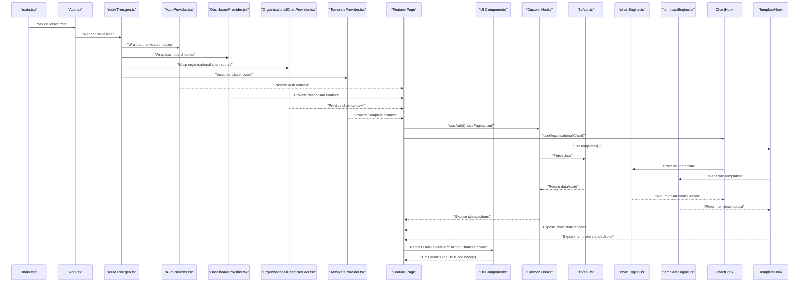

**Diagram sources**
- [main.tsx](file://frontend/src/main.tsx)
- [App.tsx](file://frontend/src/App.tsx)
- [routeTree.gen.ts](file://frontend/src/routeTree.gen.ts)
- [features/auth/AuthProvider.tsx](file://frontend/src/features/auth/AuthProvider.tsx)
- [features/dashboard/DashboardProvider.tsx](file://frontend/src/features/dashboard/DashboardProvider.tsx)
- [hooks/useAuth.ts](file://frontend/src/hooks/useAuth.ts)
- [hooks/usePagination.ts](file://frontend/src/hooks/usePagination.ts)
- [lib/api.ts](file://frontend/src/lib/api.ts)

## Interactive Organizational Chart System

### Overview
The new organizational chart system provides multiple visualization modes for displaying hierarchical organizational structures. It supports various chart types including tree diagrams, mind maps, flowcharts, and custom layouts with interactive features like zoom, pan, drag-and-drop, and real-time collaboration.

### Key Components
- **OrganisationalChart**: Main container component supporting multiple visualization modes
- **ChartNode**: Individual node component with customizable appearance and behavior
- **ChartConnector**: Line connector between nodes with configurable styles
- **ChartControls**: Toolbar for chart manipulation and mode switching
- **ChartLegend**: Dynamic legend for different node types and statuses

### Visualization Modes
- **Tree View**: Traditional hierarchical tree structure
- **Mind Map**: Radial layout for brainstorming and relationship mapping
- **Flowchart**: Process-oriented flow with decision points
- **Network Graph**: Relationship-focused network topology
- **Timeline**: Chronological organization view

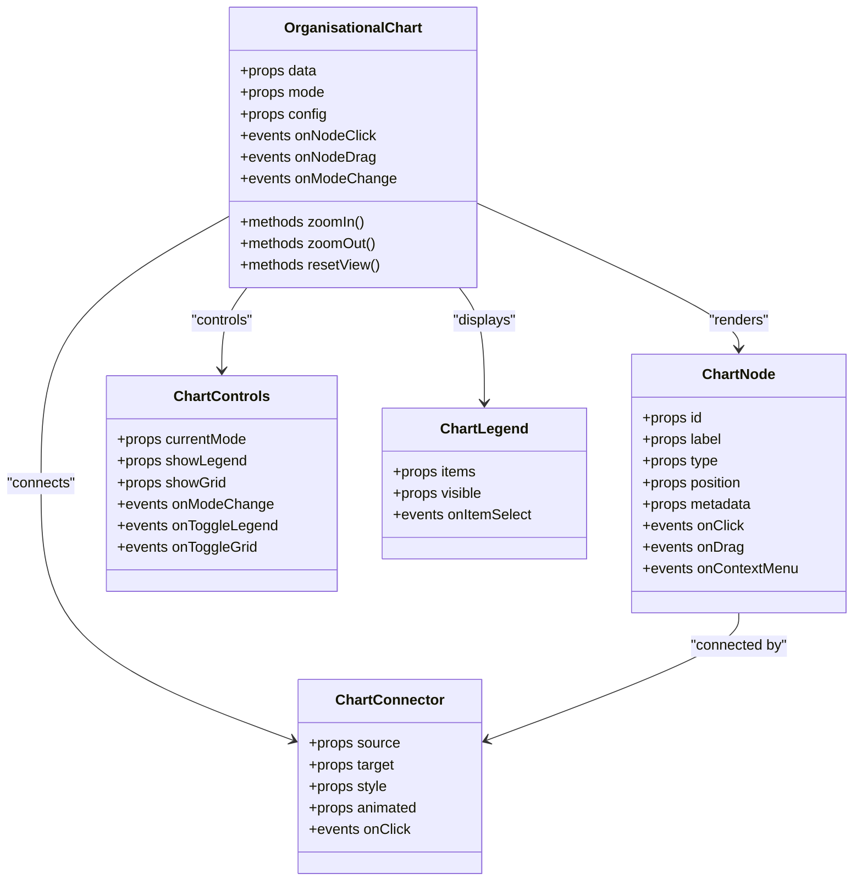

**Diagram sources**
- [features/organisation/OrganisationalChart.tsx](file://frontend/src/features/organisation/OrganisationalChart.tsx)
- [components/ui/ChartNode.tsx](file://frontend/src/components/ui/ChartNode.tsx)
- [components/ui/ChartConnector.tsx](file://frontend/src/components/ui/ChartConnector.tsx)
- [components/ui/ChartControls.tsx](file://frontend/src/components/ui/ChartControls.tsx)
- [components/ui/ChartLegend.tsx](file://frontend/src/components/ui/ChartLegend.tsx)

### State Management
The chart system uses a dedicated store for managing complex chart state, including node positions, connections, viewport settings, and user interactions. Custom hooks provide reactive access to chart data and actions.

**Section sources**
- [features/organisation/OrganisationalChart.tsx](file://frontend/src/features/organisation/OrganisationalChart.tsx)
- [hooks/useOrganisationalChart.ts](file://frontend/src/hooks/useOrganisationalChart.ts)
- [stores/chartStore.ts](file://frontend/src/stores/chartStore.ts)
- [lib/chartEngine.ts](file://frontend/src/lib/chartEngine.ts)

## Enhanced Nomenclature Management

### Overview
The nomenclature management system provides comprehensive tools for managing terminology, definitions, and classification hierarchies. It includes advanced search capabilities, bulk operations, version control, and collaborative editing features.

### Key Features
- **Hierarchical Classification**: Multi-level taxonomy management
- **Advanced Search**: Full-text search with filters and faceted navigation
- **Version Control**: Track changes and rollback capabilities
- **Bulk Operations**: Mass import/export and batch updates
- **Collaborative Editing**: Real-time co-editing with conflict resolution
- **Audit Trail**: Complete change history and compliance tracking

### Component Architecture
- **NomenclatureManager**: Main orchestration component
- **ClassificationTree**: Hierarchical tree view with drag-and-drop
- **SearchInterface**: Advanced search with filters and suggestions
- **EditorPanel**: Rich text editor with validation and preview
- **VersionHistory**: Timeline view of changes with comparison tools

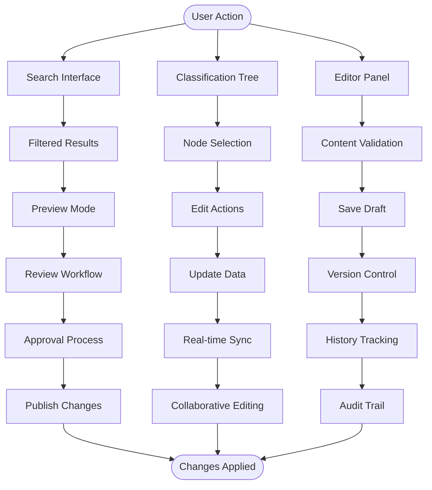

**Section sources**
- [features/nomenclature/NomenclatureManager.tsx](file://frontend/src/features/nomenclature/NomenclatureManager.tsx)
- [features/nomenclature/ClassificationTree.tsx](file://frontend/src/features/nomenclature/ClassificationTree.tsx)
- [features/nomenclature/SearchInterface.tsx](file://frontend/src/features/nomenclature/SearchInterface.tsx)
- [features/nomenclature/EditorPanel.tsx](file://frontend/src/features/nomenclature/EditorPanel.tsx)
- [features/nomenclature/VersionHistory.tsx](file://frontend/src/features/nomenclature/VersionHistory.tsx)

## Template Generation System

### Overview
The template generation system enables dynamic content creation through reusable templates with variable substitution, conditional logic, and multi-format output support. It supports document generation, email templates, reports, and automated communications.

### Core Components
- **TemplateEngine**: Central processing engine for template compilation and execution
- **TemplateDesigner**: Visual template builder with drag-and-drop interface
- **VariableManager**: Variable definition and scope management
- **OutputRenderer**: Multi-format rendering (PDF, HTML, DOCX, etc.)
- **ScheduleManager**: Automated template execution scheduling

### Template Types
- **Document Templates**: Letters, certificates, official documents
- **Email Templates**: Automated notifications and communications
- **Report Templates**: Statistical reports and analytics summaries
- **Form Templates**: Dynamic form generation and validation
- **Notification Templates**: System alerts and user notifications

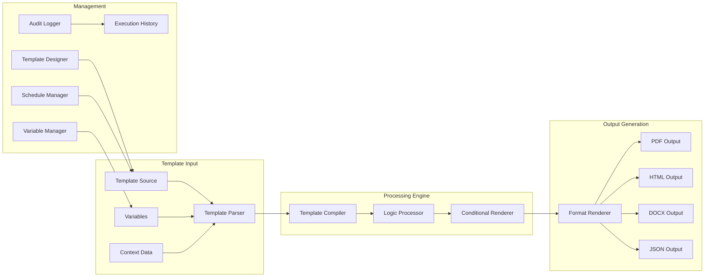

**Diagram sources**
- [features/templates/TemplateEngine.tsx](file://frontend/src/features/templates/TemplateEngine.tsx)
- [features/templates/TemplateDesigner.tsx](file://frontend/src/features/templates/TemplateDesigner.tsx)
- [features/templates/VariableManager.tsx](file://frontend/src/features/templates/VariableManager.tsx)
- [features/templates/OutputRenderer.tsx](file://frontend/src/features/templates/OutputRenderer.tsx)
- [features/templates/ScheduleManager.tsx](file://frontend/src/features/templates/ScheduleManager.tsx)

**Section sources**
- [features/templates/TemplateEngine.tsx](file://frontend/src/features/templates/TemplateEngine.tsx)
- [features/templates/TemplateDesigner.tsx](file://frontend/src/features/templates/TemplateDesigner.tsx)
- [features/templates/VariableManager.tsx](file://frontend/src/features/templates/VariableManager.tsx)
- [features/templates/OutputRenderer.tsx](file://frontend/src/features/templates/OutputRenderer.tsx)
- [features/templates/ScheduleManager.tsx](file://frontend/src/features/templates/ScheduleManager.tsx)
- [hooks/useTemplates.ts](file://frontend/src/hooks/useTemplates.ts)
- [stores/templateStore.ts](file://frontend/src/stores/templateStore.ts)
- [lib/templateEngine.ts](file://frontend/src/lib/templateEngine.ts)

## Consolidated Navigation Structure

### Overview
The navigation system has been restructured around a consolidated Organisation menu that groups related functionality and provides intuitive access to all organizational management features. The new structure emphasizes workflow-based navigation rather than purely functional grouping.

### Navigation Architecture
- **Organisation Menu**: Primary navigation hub for all organizational features
- **Sub-menus**: Contextual menus based on selected organizational units
- **Quick Access**: Frequently used actions accessible from any page
- **Breadcrumb Navigation**: Hierarchical path tracking and quick navigation
- **Search Integration**: Global search across all organizational data

### Menu Structure
- **People Management**: Staff, students, parents, and contacts
- **Academic Structure**: Classes, subjects, schedules, and curriculum
- **Administrative Tools**: Reports, templates, and system configuration
- **Communication Hub**: Messaging, announcements, and notifications
- **Analytics Dashboard**: Performance metrics and reporting tools

```mermaid
graph TB
subgraph "Main Navigation"
A[Organisation Menu] --> B[People Management]
A --> C[Academic Structure]
A --> D[Administrative Tools]
A --> E[Communication Hub]
A --> F[Analytics Dashboard]
end
subgraph "People Management"
B --> B1[Staff Directory]
B --> B2[Student Records]
B --> B3[Parent Portal]
B --> B4[Contact Management]
end
subgraph "Academic Structure"
C --> C1[Class Management]
C --> C2[Subject Catalog]
C --> C3[Schedule Builder]
C --> C4[Curriculum Planning]
end
subgraph "Administrative Tools"
D --> D1[Report Generator]
D --> D2[Template Library]
D --> D3[System Config]
D --> D4[Data Import/Export]
end
subgraph "Communication Hub"
E --> E1[Messaging System]
E --> E2[Announcements]
E --> E3[Notifications]
E --> E4[Email Templates]
end
subgraph "Analytics Dashboard"
F --> F1[Performance Metrics]
F --> F2[Statistical Reports]
F --> F3[Budget Analysis]
F --> F4[Resource Utilization]
end
```

**Section sources**
- [routes/organisationRoutes.ts](file://frontend/src/routes/organisationRoutes.ts)
- [components/navigation/OrganisationMenu.tsx](file://frontend/src/components/navigation/OrganisationMenu.tsx)
- [components/navigation/BreadcrumbNav.tsx](file://frontend/src/components/navigation/BreadcrumbNav.tsx)
- [hooks/useNavigation.ts](file://frontend/src/hooks/useNavigation.ts)

## Detailed Component Analysis

### Shared UI Components
- DataTable: A flexible table component that supports pagination, sorting, filtering, and column configuration. It composes smaller elements and relies on hooks for data management.
- Card: A layout container with header, body, and footer slots. Used to group related content consistently.
- Button: A styled interactive element with variants and states. Encapsulates accessibility attributes and event forwarding.
- **New**: OrganisationalChart: Advanced visualization component supporting multiple chart types and interactive features.
- **New**: TemplateGenerator: Component for creating and managing dynamic templates with variable substitution.

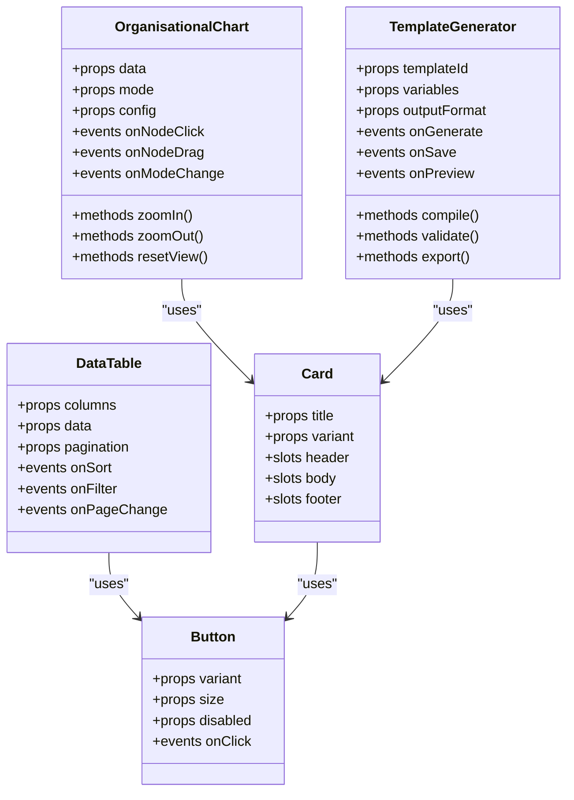

**Diagram sources**
- [components/ui/DataTable.tsx](file://frontend/src/components/ui/DataTable.tsx)
- [components/ui/Card.tsx](file://frontend/src/components/ui/Card.tsx)
- [components/ui/Button.tsx](file://frontend/src/components/ui/Button.tsx)
- [components/ui/OrganisationalChart.tsx](file://frontend/src/components/ui/OrganisationalChart.tsx)
- [components/ui/TemplateGenerator.tsx](file://frontend/src/components/ui/TemplateGenerator.tsx)

**Section sources**
- [components/ui/DataTable.tsx](file://frontend/src/components/ui/DataTable.tsx)
- [components/ui/Card.tsx](file://frontend/src/components/ui/Card.tsx)
- [components/ui/Button.tsx](file://frontend/src/components/ui/Button.tsx)
- [components/ui/index.ts](file://frontend/src/components/ui/index.ts)

### Providers System
- Authentication Provider: Supplies user identity, permissions, and login/logout actions. Protects routes and exposes auth state to consumers.
- Dashboard Provider: Manages dashboard-specific settings such as layout preferences, active modules, and cached configurations.
- **New**: OrganisationalChart Provider: Manages chart state, visualization modes, and user interactions for organizational charts.
- **New**: Template Provider: Handles template lifecycle, variable management, and generation workflows.

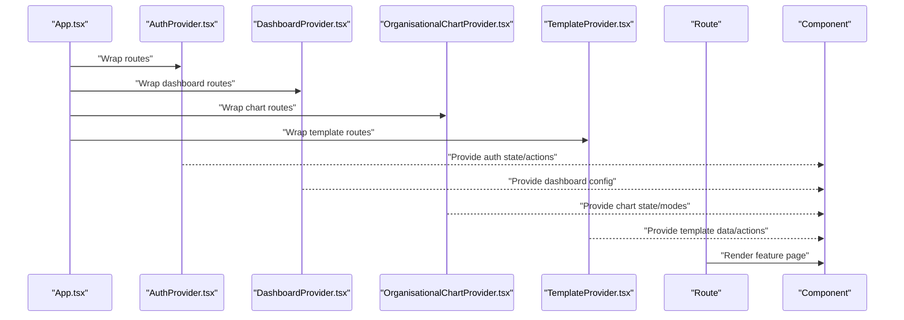

**Diagram sources**
- [App.tsx](file://frontend/src/App.tsx)
- [features/auth/AuthProvider.tsx](file://frontend/src/features/auth/AuthProvider.tsx)
- [features/dashboard/DashboardProvider.tsx](file://frontend/src/features/dashboard/DashboardProvider.tsx)
- [features/organisation/OrganisationalChartProvider.tsx](file://frontend/src/features/organisation/OrganisationalChartProvider.tsx)
- [features/templates/TemplateProvider.tsx](file://frontend/src/features/templates/TemplateProvider.tsx)

**Section sources**
- [features/auth/AuthProvider.tsx](file://frontend/src/features/auth/AuthProvider.tsx)
- [features/dashboard/DashboardProvider.tsx](file://frontend/src/features/dashboard/DashboardProvider.tsx)
- [features/organisation/OrganisationalChartProvider.tsx](file://frontend/src/features/organisation/OrganisationalChartProvider.tsx)
- [features/templates/TemplateProvider.tsx](file://frontend/src/features/templates/TemplateProvider.tsx)

### Hooks and Data Flow
- useAuth: Encapsulates authentication logic, exposing user info, roles/permissions, and actions like login and logout.
- usePagination: Centralizes pagination state and handlers, commonly consumed by DataTable.
- **New**: useOrganisationalChart: Manages chart state, node interactions, and visualization modes.
- **New**: useTemplates: Handles template compilation, variable substitution, and output generation.

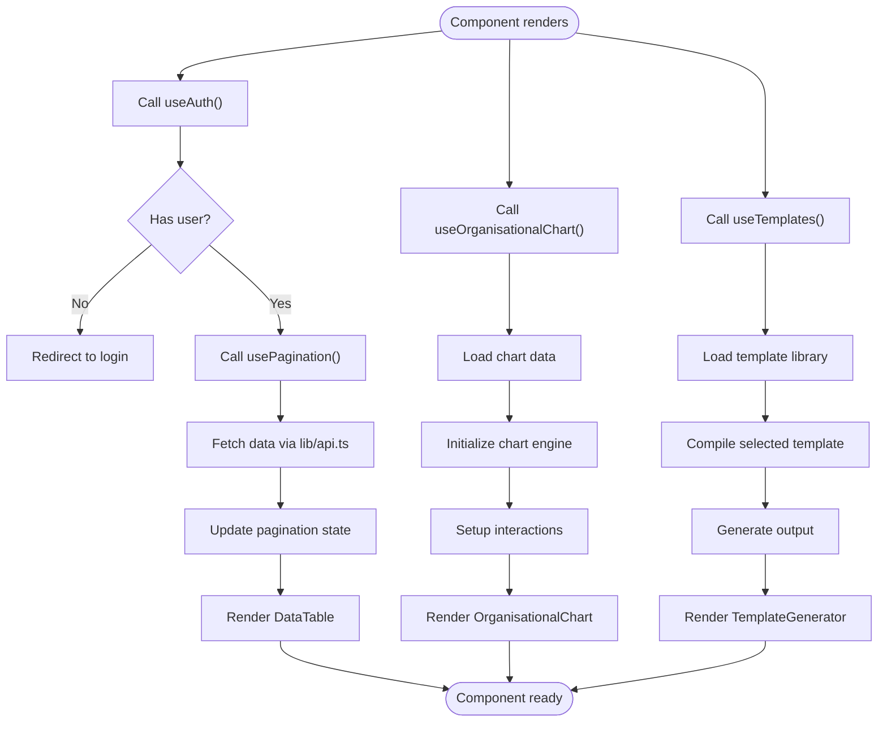

**Diagram sources**
- [hooks/useAuth.ts](file://frontend/src/hooks/useAuth.ts)
- [hooks/usePagination.ts](file://frontend/src/hooks/usePagination.ts)
- [hooks/useOrganisationalChart.ts](file://frontend/src/hooks/useOrganisationalChart.ts)
- [hooks/useTemplates.ts](file://frontend/src/hooks/useTemplates.ts)
- [lib/api.ts](file://frontend/src/lib/api.ts)

**Section sources**
- [hooks/useAuth.ts](file://frontend/src/hooks/useAuth.ts)
- [hooks/usePagination.ts](file://frontend/src/hooks/usePagination.ts)
- [hooks/useOrganisationalChart.ts](file://frontend/src/hooks/useOrganisationalChart.ts)
- [hooks/useTemplates.ts](file://frontend/src/hooks/useTemplates.ts)
- [lib/api.ts](file://frontend/src/lib/api.ts)

### Stores and Global State
- appStore: A lightweight store for cross-cutting application state (e.g., theme, language, notifications). Components subscribe selectively to avoid unnecessary re-renders.
- **New**: chartStore: Manages complex organizational chart state including node positions, connections, viewport settings, and user interactions.
- **New**: templateStore: Handles template definitions, variable scopes, generation history, and output caching.

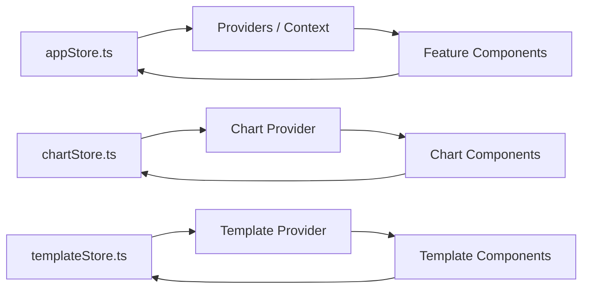

**Diagram sources**
- [stores/appStore.ts](file://frontend/src/stores/appStore.ts)
- [stores/chartStore.ts](file://frontend/src/stores/chartStore.ts)
- [stores/templateStore.ts](file://frontend/src/stores/templateStore.ts)

**Section sources**
- [stores/appStore.ts](file://frontend/src/stores/appStore.ts)
- [stores/chartStore.ts](file://frontend/src/stores/chartStore.ts)
- [stores/templateStore.ts](file://frontend/src/stores/templateStore.ts)

## Dependency Analysis
- Entry points depend on routing and providers.
- Features depend on shared UI and hooks.
- UI components depend on hooks and libraries but not on feature logic.
- Hooks depend on the API library and stores.
- **New**: Specialized engines (chartEngine, templateEngine) provide core functionality for complex features.
- **New**: Dedicated stores manage complex state for visualization and template systems.

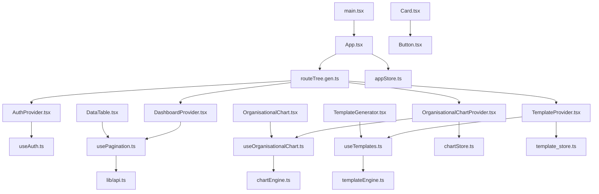

**Diagram sources**
- [main.tsx](file://frontend/src/main.tsx)
- [App.tsx](file://frontend/src/App.tsx)
- [routeTree.gen.ts](file://frontend/src/routeTree.gen.ts)
- [features/auth/AuthProvider.tsx](file://frontend/src/features/auth/AuthProvider.tsx)
- [features/dashboard/DashboardProvider.tsx](file://frontend/src/features/dashboard/DashboardProvider.tsx)
- [features/organisation/OrganisationalChartProvider.tsx](file://frontend/src/features/organisation/OrganisationalChartProvider.tsx)
- [features/templates/TemplateProvider.tsx](file://frontend/src/features/templates/TemplateProvider.tsx)
- [hooks/useAuth.ts](file://frontend/src/hooks/useAuth.ts)
- [hooks/usePagination.ts](file://frontend/src/hooks/usePagination.ts)
- [hooks/useOrganisationalChart.ts](file://frontend/src/hooks/useOrganisationalChart.ts)
- [hooks/useTemplates.ts](file://frontend/src/hooks/useTemplates.ts)
- [components/ui/DataTable.tsx](file://frontend/src/components/ui/DataTable.tsx)
- [components/ui/Card.tsx](file://frontend/src/components/ui/Card.tsx)
- [components/ui/Button.tsx](file://frontend/src/components/ui/Button.tsx)
- [components/ui/OrganisationalChart.tsx](file://frontend/src/components/ui/OrganisationalChart.tsx)
- [components/ui/TemplateGenerator.tsx](file://frontend/src/components/ui/TemplateGenerator.tsx)
- [lib/api.ts](file://frontend/src/lib/api.ts)
- [lib/chartEngine.ts](file://frontend/src/lib/chartEngine.ts)
- [lib/templateEngine.ts](file://frontend/src/lib/templateEngine.ts)
- [stores/appStore.ts](file://frontend/src/stores/appStore.ts)
- [stores/chartStore.ts](file://frontend/src/stores/chartStore.ts)
- [stores/templateStore.ts](file://frontend/src/stores/templateStore.ts)

**Section sources**
- [main.tsx](file://frontend/src/main.tsx)
- [App.tsx](file://frontend/src/App.tsx)
- [routeTree.gen.ts](file://frontend/src/routeTree.gen.ts)
- [components/ui/index.ts](file://frontend/src/components/ui/index.ts)

## Performance Considerations
- Memoization: Wrap expensive computations and derived values with memoization hooks to prevent unnecessary recalculations.
- Selective subscriptions: Subscribe only to needed parts of global state to minimize re-renders.
- Lazy loading: Load heavy feature routes and large components lazily to reduce initial bundle size.
- Virtualization: For large lists or tables, consider virtualized rendering to improve scroll performance.
- Stable references: Stabilize callback and object props to help child components skip updates when using memoization.
- Debounce inputs: Debounce search/filter inputs to reduce network requests and processing overhead.
- Image/media optimization: Use responsive images and lazy loading for media assets.
- **New**: Canvas rendering: Use canvas-based rendering for complex charts to improve performance with large datasets.
- **New**: Web Workers: Offload heavy template processing to background threads to prevent UI blocking.
- **New**: Memory management: Implement proper cleanup for chart instances and template compilations to prevent memory leaks.

## Troubleshooting Guide
- Authentication issues: Verify provider wrapping around protected routes and ensure tokens are correctly handled in hooks.
- Pagination problems: Check hook state initialization and API response shape; validate page size and total counts.
- UI inconsistencies: Ensure shared UI components receive expected props and that styles/themes are applied consistently.
- Global state conflicts: Confirm that stores are updated immutably and that selectors are precise to avoid cascading re-renders.
- Network errors: Centralize error handling in the API library and surface user-friendly messages via providers or toast utilities.
- **New**: Chart rendering issues: Verify data structure compatibility with chart engine and check for circular dependencies in node relationships.
- **New**: Template compilation errors: Validate template syntax and variable references; check for undefined variables in context.
- **New**: Navigation problems: Ensure route guards are properly configured and permission checks are working correctly.

## Conclusion
The architecture emphasizes feature-based organization, reusable UI primitives, and clear separation of concerns through providers, hooks, and stores. The recent overhaul has significantly enhanced the system's capabilities with advanced visualization tools, comprehensive management interfaces, and streamlined navigation structures. This evolution promotes scalability, testability, and performance while providing powerful tools for complex organizational data management and template-driven workflows. By adhering to composition patterns, stable prop interfaces, and careful state management, teams can maintain a robust and evolving codebase that supports increasingly sophisticated business requirements.