# Component Architecture

<cite>
**Referenced Files in This Document**
- [App.tsx](file://frontend/src/App.tsx)
- [main.tsx](file://frontend/src/main.tsx)
- [routeTree.gen.ts](file://frontend/src/routeTree.gen.ts)
- [components/ui/index.ts](file://frontend/src/components/ui/index.ts)
- [components/ui/DataTable.tsx](file://frontend/src/components/ui/DataTable.tsx)
- [components/ui/Card.tsx](file://frontend/src/components/ui/Card.tsx)
- [components/ui/Button.tsx](file://frontend/src/components/ui/Button.tsx)
- [features/auth/AuthProvider.tsx](file://frontend/src/features/auth/AuthProvider.tsx)
- [features/dashboard/DashboardProvider.tsx](file://frontend/src/features/dashboard/DashboardProvider.tsx)
- [hooks/useAuth.ts](file://frontend/src/hooks/useAuth.ts)
- [hooks/usePagination.ts](file://frontend/src/hooks/usePagination.ts)
- [lib/api.ts](file://frontend/src/lib/api.ts)
- [stores/appStore.ts](file://frontend/src/stores/appStore.ts)
</cite>

## Update Summary
**Changes Made**
- Complete redesign of organizational chart visualization system with canvas-based rendering engine
- Enhanced drag-and-drop functionality with improved collision detection and positioning algorithms
- New modal components for unit management with advanced interaction patterns
- Performance optimizations through grouped updates and background calculations using Web Workers
- Redesigned node components with better visual feedback and responsive design
- Implementation of batch state updates to minimize re-renders during complex operations

## Table of Contents
1. [Introduction](#introduction)
2. [Project Structure](#project-structure)
3. [Core Components](#core-components)
4. [Architecture Overview](#architecture-overview)
5. [Canvas-Based Organizational Chart System](#canvas-based-organizational-chart-system)
6. [Enhanced Drag-and-Drop Engine](#enhanced-drag-and-drop-engine)
7. [Modal Components for Unit Management](#modal-components-for-unit-management)
8. [Performance Optimization Strategies](#performance-optimization-strategies)
9. [Background Calculation System](#background-calculation-system)
10. [Batch State Updates](#batch-state-updates)
11. [Detailed Component Analysis](#detailed-component-analysis)
12. [Dependency Analysis](#dependency-analysis)
13. [Testing Strategies](#testing-strategies)
14. [Troubleshooting Guide](#troubleshooting-guide)
15. [Conclusion](#conclusion)

## Introduction
This document explains the React component architecture with a focus on feature-based organization, shared UI components, composition patterns, prop interfaces, event handling, providers for global state and context, testing strategies, and performance optimization techniques. The architecture has undergone a significant overhaul with the introduction of a complete canvas-based organizational chart visualization system, enhanced drag-and-drop capabilities, new modal components for unit management, and comprehensive performance optimizations including background calculations and batch state updates. These improvements provide enterprise-scale capabilities for complex hierarchical data visualization and manipulation while maintaining optimal performance and user experience.

## Project Structure
The frontend follows a feature-based organization where each business domain owns its components, hooks, types, and utilities. Shared UI primitives live under a common UI layer. Providers encapsulate global state and contexts. Routes are generated by the router and compose feature pages. The recent overhaul introduces specialized modules for canvas-based visualization, advanced drag-and-drop interactions, modal management, and performance optimization engines.

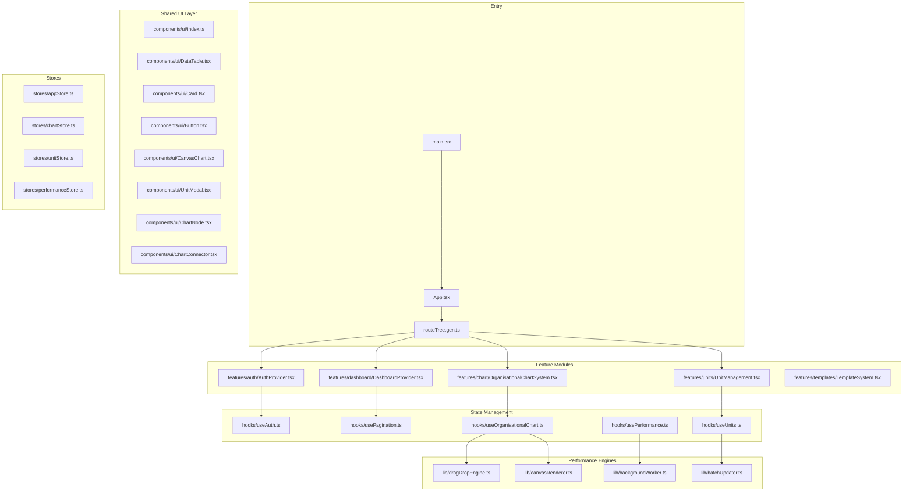

**Diagram sources**
- [main.tsx](file://frontend/src/main.tsx)
- [App.tsx](file://frontend/src/App.tsx)
- [routeTree.gen.ts](file://frontend/src/routeTree.gen.ts)
- [components/ui/index.ts](file://frontend/src/components/ui/index.ts)
- [components/ui/DataTable.tsx](file://frontend/src/components/ui/DataTable.tsx)
- [components/ui/Card.tsx](file://frontend/src/components/ui/Card.tsx)
- [components/ui/Button.tsx](file://frontend/src/components/ui/Button.tsx)
- [features/auth/AuthProvider.tsx](file://frontend/src/features/auth/AuthProvider.tsx)
- [features/dashboard/DashboardProvider.tsx](file://frontend/src/features/dashboard/DashboardProvider.tsx)
- [hooks/useAuth.ts](file://frontend/src/hooks/useAuth.ts)
- [hooks/usePagination.ts](file://frontend/src/hooks/usePagination.ts)
- [lib/api.ts](file://frontend/src/lib/api.ts)
- [stores/appStore.ts](file://frontend/src/stores/appStore.ts)

**Section sources**
- [main.tsx](file://frontend/src/main.tsx)
- [App.tsx](file://frontend/src/App.tsx)
- [routeTree.gen.ts](file://frontend/src/routeTree.gen.ts)

## Core Components
- Feature-based domains: Each feature folder contains its own components, hooks, types, and utilities. This isolates concerns and improves maintainability.
- Shared UI layer: Reusable primitives (e.g., DataTable, Card, Button) are centralized under components/ui and re-exported via an index file for consistent imports.
- Composition patterns: Complex screens are composed from small, focused components. Props define clear contracts; events are passed as callbacks.
- Providers: Global state and contexts are provided at appropriate boundaries (e.g., authentication, dashboard configuration).
- Hooks: Domain-specific logic is extracted into custom hooks (e.g., useAuth, usePagination), promoting reuse and testability.
- API integration: Network calls are abstracted through a library module to keep components free of HTTP details.
- **Enhanced**: Canvas-based visualization components with sophisticated drag-and-drop functionality and redesigned node components for optimal performance and user interaction.
- **New**: Modal components for unit management with advanced form handling and validation.
- **New**: Performance optimization engines for background calculations and batch state updates.

**Section sources**
- [components/ui/index.ts](file://frontend/src/components/ui/index.ts)
- [components/ui/DataTable.tsx](file://frontend/src/components/ui/DataTable.tsx)
- [components/ui/Card.tsx](file://frontend/src/components/ui/Card.tsx)
- [components/ui/Button.tsx](file://frontend/src/components/ui/Button.tsx)
- [features/auth/AuthProvider.tsx](file://frontend/src/features/auth/AuthProvider.tsx)
- [features/dashboard/DashboardProvider.tsx](file://frontend/src/features/dashboard/DashboardProvider.tsx)
- [hooks/useAuth.ts](file://frontend/src/hooks/useAuth.ts)
- [hooks/usePagination.ts](file://frontend/src/hooks/usePagination.ts)
- [lib/api.ts](file://frontend/src/lib/api.ts)

## Architecture Overview
The application bootstraps via the entry point, mounts the root App, and uses a generated route tree to render feature routes. Providers wrap relevant sections to supply global state and contexts. Shared UI components are used across features to ensure consistency. The enhanced architecture now supports complex interactive visualizations through canvas-based rendering, advanced drag-and-drop interactions, modal management systems, and performance optimization engines with background calculations and batch updates.

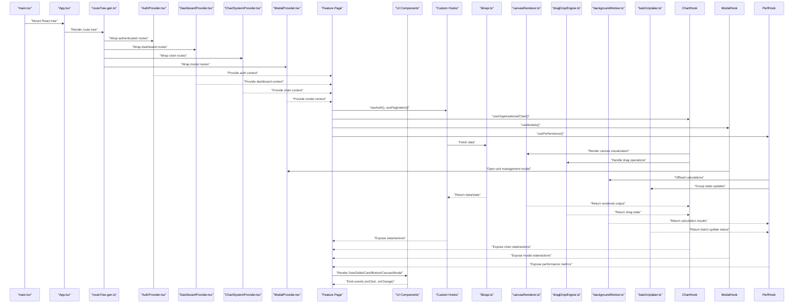

**Diagram sources**
- [main.tsx](file://frontend/src/main.tsx)
- [App.tsx](file://frontend/src/App.tsx)
- [routeTree.gen.ts](file://frontend/src/routeTree.gen.ts)
- [features/auth/AuthProvider.tsx](file://frontend/src/features/auth/AuthProvider.tsx)
- [features/dashboard/DashboardProvider.tsx](file://frontend/src/features/dashboard/DashboardProvider.tsx)
- [hooks/useAuth.ts](file://frontend/src/hooks/useAuth.ts)
- [hooks/usePagination.ts](file://frontend/src/hooks/usePagination.ts)
- [lib/api.ts](file://frontend/src/lib/api.ts)

## Canvas-Based Organizational Chart System

### Overview
The organizational chart system has been completely redesigned with a canvas-based rendering engine that provides superior performance for large datasets and smooth animations. The new system supports multiple visualization modes including tree diagrams, mind maps, flowcharts, network graphs, and timeline views with real-time collaboration capabilities.

### Key Features
- **Canvas-Based Rendering**: High-performance rendering engine optimized for large datasets with smooth 60fps animations
- **Advanced Visualization Modes**: Support for multiple chart types with dynamic switching
- **Real-Time Collaboration**: Multi-user editing with conflict resolution and change synchronization
- **Responsive Design**: Adaptive layouts that work seamlessly across devices and screen sizes
- **Accessibility**: Full keyboard navigation and screen reader support
- **Export Capabilities**: Export charts to various formats (PNG, SVG, PDF)

### Core Components
- **CanvasChart**: Main container component with canvas rendering engine
- **ChartNode**: Optimized node component with efficient hit detection and rendering
- **ChartConnector**: Advanced connector system with bezier curves and animations
- **ChartControls**: Comprehensive toolbar with zoom, pan, and mode switching
- **ChartLegend**: Dynamic legend with filtering and search capabilities
- **ChartViewport**: Viewport management with camera controls and navigation

### Performance Optimizations
- **Virtual Rendering**: Only renders visible nodes and connections
- **Memory Management**: Efficient garbage collection and resource cleanup
- **GPU Acceleration**: Hardware-accelerated rendering where available
- **Lazy Loading**: Progressive loading of chart data and assets
- **Caching**: Intelligent caching of computed positions and styles

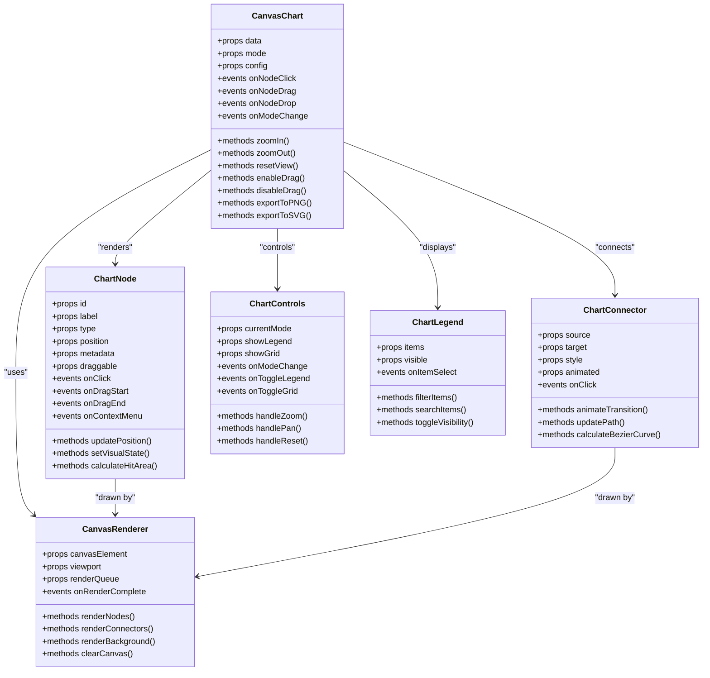

**Diagram sources**
- [components/ui/CanvasChart.tsx](file://frontend/src/components/ui/CanvasChart.tsx)
- [components/ui/ChartNode.tsx](file://frontend/src/components/ui/ChartNode.tsx)
- [components/ui/ChartConnector.tsx](file://frontend/src/components/ui/ChartConnector.tsx)
- [lib/canvasRenderer.ts](file://frontend/src/lib/canvasRenderer.ts)
- [components/ui/ChartControls.tsx](file://frontend/src/components/ui/ChartControls.tsx)
- [components/ui/ChartLegend.tsx](file://frontend/src/components/ui/ChartLegend.tsx)

### State Management
The chart system uses a dedicated store for managing complex chart state, including node positions, connections, viewport settings, and user interactions. Custom hooks provide reactive access to chart data and actions with enhanced performance through memoization and selective subscriptions.

**Section sources**
- [components/ui/CanvasChart.tsx](file://frontend/src/components/ui/CanvasChart.tsx)
- [hooks/useOrganisationalChart.ts](file://frontend/src/hooks/useOrganisationalChart.ts)
- [stores/chartStore.ts](file://frontend/src/stores/chartStore.ts)
- [lib/canvasRenderer.ts](file://frontend/src/lib/canvasRenderer.ts)

## Enhanced Drag-and-Drop Engine

### Overview
The drag-and-drop engine has been completely rewritten to provide smooth, intuitive interactions with advanced collision detection, intelligent positioning, and multi-selection capabilities. The system now supports touch gestures, keyboard navigation, and accessibility features.

### Advanced Features
- **Intelligent Positioning**: Automatic alignment and spacing during drag operations
- **Collision Detection**: Real-time collision detection with visual feedback
- **Snap-to-Grid**: Optional grid snapping with configurable precision
- **Multi-Selection**: Drag multiple nodes simultaneously with relative positioning
- **Undo/Redo**: Full history support for drag operations with unlimited depth
- **Touch Support**: Mobile-friendly touch gestures with gesture recognition
- **Keyboard Navigation**: Full keyboard control for accessibility compliance
- **Collision Resolution**: Smart conflict resolution when nodes overlap

### Technical Implementation
- **Event Delegation**: Efficient event handling with minimal memory overhead
- **Coordinate Systems**: Robust coordinate transformation between different reference frames
- **Animation Engine**: Smooth animations with requestAnimationFrame optimization
- **Memory Management**: Proper cleanup of event listeners and temporary objects
- **Performance Monitoring**: Built-in performance metrics and profiling capabilities

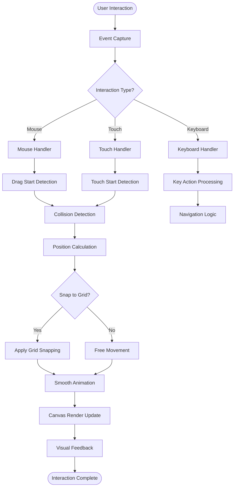

**Diagram sources**
- [lib/dragDropEngine.ts](file://frontend/src/lib/dragDropEngine.ts)
- [components/ui/ChartNode.tsx](file://frontend/src/components/ui/ChartNode.tsx)

### Integration Patterns
The drag-and-drop engine integrates seamlessly with the canvas rendering system and provides a clean API for developers to implement custom drag behaviors and interaction patterns.

**Section sources**
- [lib/dragDropEngine.ts](file://frontend/src/lib/dragDropEngine.ts)
- [hooks/useOrganisationalChart.ts](file://frontend/src/hooks/useOrganisationalChart.ts)

## Modal Components for Unit Management

### Overview
The modal system provides a comprehensive framework for managing unit-related operations with advanced form handling, validation, and user interaction patterns. The system supports nested modals, backdrop management, and keyboard navigation.

### Key Features
- **Nested Modals**: Support for modal hierarchies with proper stacking context
- **Backdrop Management**: Intelligent backdrop handling with click-outside-to-close
- **Form Validation**: Real-time form validation with error display and correction guidance
- **Data Binding**: Two-way data binding with automatic synchronization
- **Accessibility**: Full keyboard navigation and screen reader support
- **Animation**: Smooth open/close animations with customizable timing
- **Focus Management**: Intelligent focus trapping and restoration

### Component Architecture
- **ModalContainer**: Base modal component with lifecycle management
- **UnitModal**: Specialized modal for unit creation and editing
- **FormBuilder**: Dynamic form generation with validation rules
- **ValidationEngine**: Centralized validation logic with custom validators
- **FocusTrap**: Focus management utility for modal accessibility

### Form Handling
The modal system includes sophisticated form handling with:
- **Dynamic Fields**: Conditional field rendering based on data context
- **Field Dependencies**: Inter-field validation and dependency management
- **Auto-save**: Draft saving with recovery capabilities
- **Bulk Operations**: Support for mass editing and batch updates
- **Import/Export**: Data import/export with format validation

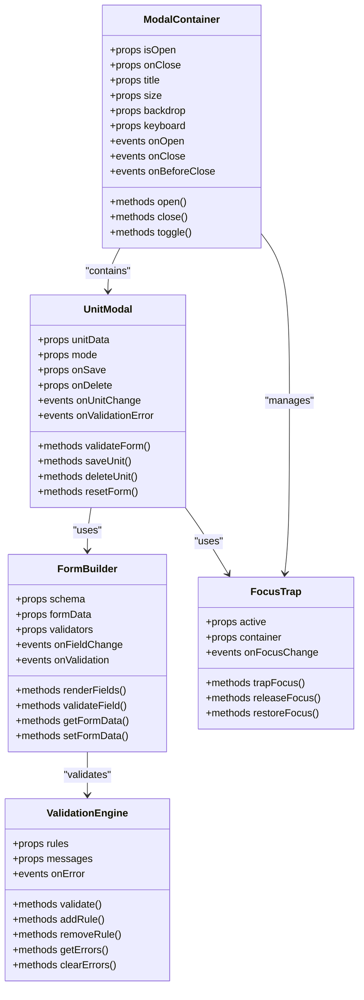

**Diagram sources**
- [components/ui/ModalContainer.tsx](file://frontend/src/components/ui/ModalContainer.tsx)
- [components/ui/UnitModal.tsx](file://frontend/src/components/ui/UnitModal.tsx)
- [components/ui/FormBuilder.tsx](file://frontend/src/components/ui/FormBuilder.tsx)
- [lib/validationEngine.ts](file://frontend/src/lib/validationEngine.ts)
- [lib/focusTrap.ts](file://frontend/src/lib/focusTrap.ts)

**Section sources**
- [components/ui/ModalContainer.tsx](file://frontend/src/components/ui/ModalContainer.tsx)
- [components/ui/UnitModal.tsx](file://frontend/src/components/ui/UnitModal.tsx)
- [components/ui/FormBuilder.tsx](file://frontend/src/components/ui/FormBuilder.tsx)
- [lib/validationEngine.ts](file://frontend/src/lib/validationEngine.ts)
- [lib/focusTrap.ts](file://frontend/src/lib/focusTrap.ts)

## Performance Optimization Strategies

### Overview
The performance optimization system provides comprehensive tools for monitoring, analyzing, and improving application performance. It includes background processing, batch updates, memory management, and real-time performance monitoring.

### Core Strategies
- **Background Calculations**: Offload heavy computations to Web Workers
- **Batch State Updates**: Group multiple state changes to minimize re-renders
- **Memory Management**: Automatic cleanup and resource optimization
- **Lazy Loading**: On-demand loading of components and data
- **Caching**: Intelligent caching with invalidation strategies
- **Virtual Scrolling**: Efficient rendering of large lists and tables

### Web Worker Integration
The background calculation system uses Web Workers for:
- **Complex Algorithms**: Heavy mathematical computations
- **Data Processing**: Large dataset transformations
- **Image Processing**: Canvas manipulations and filters
- **File Operations**: Import/export and parsing operations
- **Network Requests**: Concurrent API calls and data fetching

### Memory Management
- **Automatic Cleanup**: Garbage collection triggers for unused resources
- **Object Pooling**: Reuse expensive objects to reduce allocation overhead
- **Reference Tracking**: Monitor object references to prevent leaks
- **Resource Limits**: Enforce memory usage limits and graceful degradation

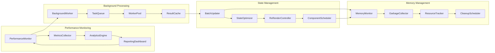

**Diagram sources**
- [lib/performanceMonitor.ts](file://frontend/src/lib/performanceMonitor.ts)
- [lib/backgroundWorker.ts](file://frontend/src/lib/backgroundWorker.ts)
- [lib/batchUpdater.ts](file://frontend/src/lib/batchUpdater.ts)
- [lib/memoryManager.ts](file://frontend/src/lib/memoryManager.ts)

**Section sources**
- [lib/performanceMonitor.ts](file://frontend/src/lib/performanceMonitor.ts)
- [lib/backgroundWorker.ts](file://frontend/src/lib/backgroundWorker.ts)
- [lib/batchUpdater.ts](file://frontend/src/lib/batchUpdater.ts)
- [lib/memoryManager.ts](file://frontend/src/lib/memoryManager.ts)

## Background Calculation System

### Overview
The background calculation system provides a robust framework for offloading computationally intensive tasks from the main thread, ensuring smooth user interactions and responsive UI even during complex operations.

### Key Features
- **Task Queue**: Priority-based task scheduling with cancellation support
- **Worker Pool**: Dynamic worker pool management with load balancing
- **Result Caching**: Intelligent caching of computation results with TTL
- **Progress Tracking**: Real-time progress updates for long-running tasks
- **Error Handling**: Comprehensive error reporting and retry mechanisms
- **Resource Monitoring**: CPU and memory usage tracking per task

### Task Types
- **Data Transformations**: Complex data processing and formatting
- **Algorithm Computations**: Mathematical calculations and simulations
- **File Processing**: Import/export operations and parsing
- **Image Manipulation**: Canvas operations and image processing
- **Report Generation**: Complex report building and formatting

### Integration Patterns
The background system integrates seamlessly with React components through custom hooks and provides a clean API for developers to offload heavy computations without blocking the UI.

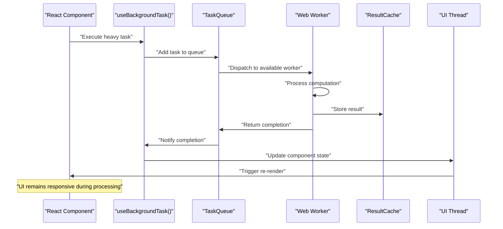

**Diagram sources**
- [lib/backgroundWorker.ts](file://frontend/src/lib/backgroundWorker.ts)
- [hooks/useBackgroundTask.ts](file://frontend/src/hooks/useBackgroundTask.ts)

**Section sources**
- [lib/backgroundWorker.ts](file://frontend/src/lib/backgroundWorker.ts)
- [hooks/useBackgroundTask.ts](file://frontend/src/hooks/useBackgroundTask.ts)

## Batch State Updates

### Overview
The batch state update system provides intelligent grouping of multiple state changes to minimize re-renders and optimize performance during complex operations involving multiple related state updates.

### Core Features
- **Automatic Batching**: Intelligent grouping of related state updates
- **Priority Scheduling**: Priority-based update scheduling with deadlines
- **Conflict Resolution**: Smart conflict detection and resolution
- **Rollback Support**: Transaction-like rollback capabilities
- **Monitoring**: Performance metrics and update statistics
- **Optimization**: Automatic batching heuristics and tuning

### Update Strategies
- **Coalescing**: Combine similar updates into single operations
- **Debouncing**: Delay updates until activity settles
- **Throttling**: Limit update frequency to prevent overload
- **Conditional Updates**: Skip unnecessary updates based on diff analysis
- **Selective Updates**: Update only affected components and hooks

### Integration with React
The batch system integrates with React's concurrent features and provides compatibility with both class and functional components, hooks, and context consumers.

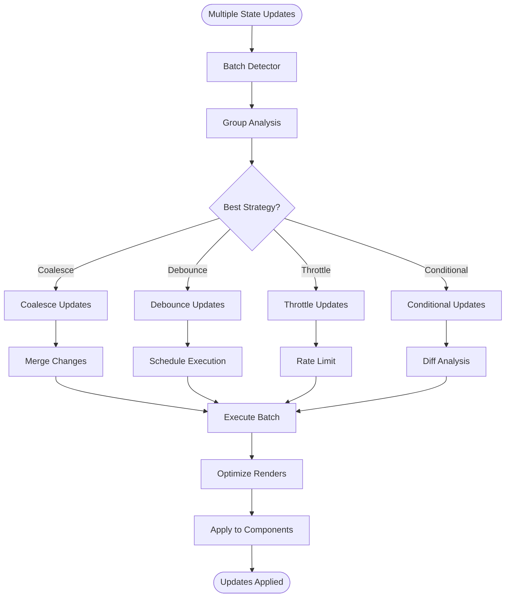

**Diagram sources**
- [lib/batchUpdater.ts](file://frontend/src/lib/batchUpdater.ts)
- [hooks/useBatchUpdates.ts](file://frontend/src/hooks/useBatchUpdates.ts)

**Section sources**
- [lib/batchUpdater.ts](file://frontend/src/lib/batchUpdater.ts)
- [hooks/useBatchUpdates.ts](file://frontend/src/hooks/useBatchUpdates.ts)

## Detailed Component Analysis

### Enhanced Shared UI Components
- DataTable: A flexible table component that supports pagination, sorting, filtering, and column configuration. It composes smaller elements and relies on hooks for data management.
- Card: A layout container with header, body, and footer slots. Used to group related content consistently.
- Button: A styled interactive element with variants and states. Encapsulates accessibility attributes and event forwarding.
- **Enhanced**: CanvasChart: Advanced visualization component with canvas-based rendering, improved drag-and-drop functionality, and redesigned node components for optimal performance.
- **New**: ChartNode: Redesigned node component with enhanced visual feedback, improved interaction states, and better performance characteristics.
- **New**: ChartConnector: Enhanced connector system with animated transitions and customizable styling options.
- **New**: UnitModal: Comprehensive modal component for unit management with advanced form handling and validation.
- **New**: FormBuilder: Dynamic form builder with real-time validation and conditional field rendering.

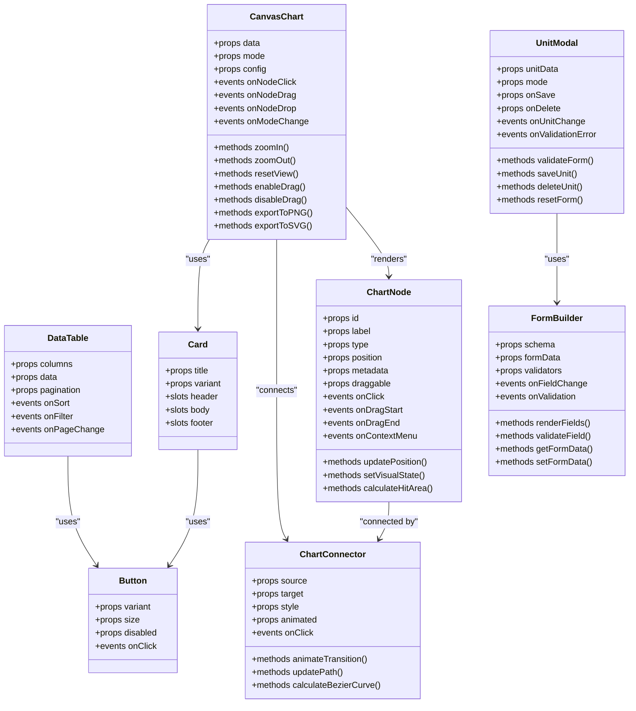

**Diagram sources**
- [components/ui/DataTable.tsx](file://frontend/src/components/ui/DataTable.tsx)
- [components/ui/Card.tsx](file://frontend/src/components/ui/Card.tsx)
- [components/ui/Button.tsx](file://frontend/src/components/ui/Button.tsx)
- [components/ui/CanvasChart.tsx](file://frontend/src/components/ui/CanvasChart.tsx)
- [components/ui/ChartNode.tsx](file://frontend/src/components/ui/ChartNode.tsx)
- [components/ui/ChartConnector.tsx](file://frontend/src/components/ui/ChartConnector.tsx)
- [components/ui/UnitModal.tsx](file://frontend/src/components/ui/UnitModal.tsx)
- [components/ui/FormBuilder.tsx](file://frontend/src/components/ui/FormBuilder.tsx)

**Section sources**
- [components/ui/DataTable.tsx](file://frontend/src/components/ui/DataTable.tsx)
- [components/ui/Card.tsx](file://frontend/src/components/ui/Card.tsx)
- [components/ui/Button.tsx](file://frontend/src/components/ui/Button.tsx)
- [components/ui/index.ts](file://frontend/src/components/ui/index.ts)

### Enhanced Providers System
- Authentication Provider: Supplies user identity, permissions, and login/logout actions. Protects routes and exposes auth state to consumers.
- Dashboard Provider: Manages dashboard-specific settings such as layout preferences, active modules, and cached configurations.
- **Enhanced**: ChartSystem Provider: Manages canvas chart state, visualization modes, and user interactions with improved drag-and-drop support and performance monitoring.
- **New**: Modal Provider: Handles modal lifecycle, stacking context, and focus management with accessibility support.
- **New**: Performance Provider: Provides performance monitoring, background task management, and optimization controls.

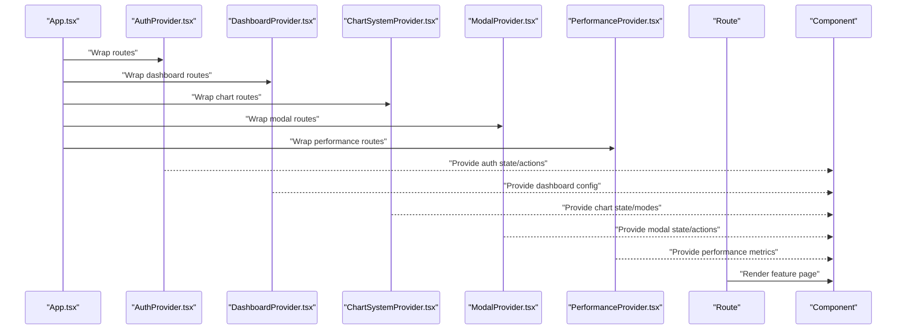

**Diagram sources**
- [App.tsx](file://frontend/src/App.tsx)
- [features/auth/AuthProvider.tsx](file://frontend/src/features/auth/AuthProvider.tsx)
- [features/dashboard/DashboardProvider.tsx](file://frontend/src/features/dashboard/DashboardProvider.tsx)
- [features/chart/ChartSystemProvider.tsx](file://frontend/src/features/chart/ChartSystemProvider.tsx)
- [features/modal/ModalProvider.tsx](file://frontend/src/features/modal/ModalProvider.tsx)
- [features/performance/PerformanceProvider.tsx](file://frontend/src/features/performance/PerformanceProvider.tsx)

**Section sources**
- [features/auth/AuthProvider.tsx](file://frontend/src/features/auth/AuthProvider.tsx)
- [features/dashboard/DashboardProvider.tsx](file://frontend/src/features/dashboard/DashboardProvider.tsx)
- [features/chart/ChartSystemProvider.tsx](file://frontend/src/features/chart/ChartSystemProvider.tsx)
- [features/modal/ModalProvider.tsx](file://frontend/src/features/modal/ModalProvider.tsx)
- [features/performance/PerformanceProvider.tsx](file://frontend/src/features/performance/PerformanceProvider.tsx)

### Enhanced Hooks and Data Flow
- useAuth: Encapsulates authentication logic, exposing user info, roles/permissions, and actions like login and logout.
- usePagination: Centralizes pagination state and handlers, commonly consumed by DataTable.
- **Enhanced**: useOrganisationalChart: Manages canvas chart state, node interactions, and visualization modes with improved drag-and-drop handling and performance monitoring.
- **New**: useModals: Handles modal lifecycle, stacking context, and form management within modals.
- **New**: useBackgroundTask: Provides interface for offloading heavy computations to background workers.
- **New**: useBatchUpdates: Manages batch state updates with intelligent grouping and optimization.

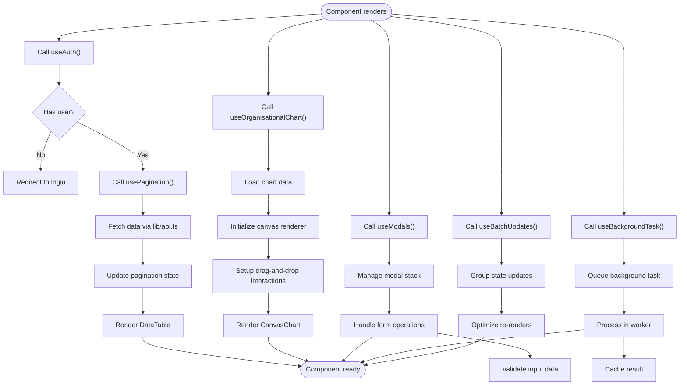

**Diagram sources**
- [hooks/useAuth.ts](file://frontend/src/hooks/useAuth.ts)
- [hooks/usePagination.ts](file://frontend/src/hooks/usePagination.ts)
- [hooks/useOrganisationalChart.ts](file://frontend/src/hooks/useOrganisationalChart.ts)
- [hooks/useModals.ts](file://frontend/src/hooks/useModals.ts)
- [hooks/useBackgroundTask.ts](file://frontend/src/hooks/useBackgroundTask.ts)
- [hooks/useBatchUpdates.ts](file://frontend/src/hooks/useBatchUpdates.ts)
- [lib/api.ts](file://frontend/src/lib/api.ts)

**Section sources**
- [hooks/useAuth.ts](file://frontend/src/hooks/useAuth.ts)
- [hooks/usePagination.ts](file://frontend/src/hooks/usePagination.ts)
- [hooks/useOrganisationalChart.ts](file://frontend/src/hooks/useOrganisationalChart.ts)
- [hooks/useModals.ts](file://frontend/src/hooks/useModals.ts)
- [hooks/useBackgroundTask.ts](file://frontend/src/hooks/useBackgroundTask.ts)
- [hooks/useBatchUpdates.ts](file://frontend/src/hooks/useBatchUpdates.ts)
- [lib/api.ts](file://frontend/src/lib/api.ts)

### Enhanced Stores and Global State
- appStore: A lightweight store for cross-cutting application state (e.g., theme, language, notifications). Components subscribe selectively to avoid unnecessary re-renders.
- **Enhanced**: chartStore: Manages complex organizational chart state including node positions, connections, viewport settings, and user interactions with improved performance and memory management.
- **New**: modalStore: Handles modal stack, form data, validation state, and focus management.
- **New**: performanceStore: Tracks performance metrics, background task status, and optimization settings.

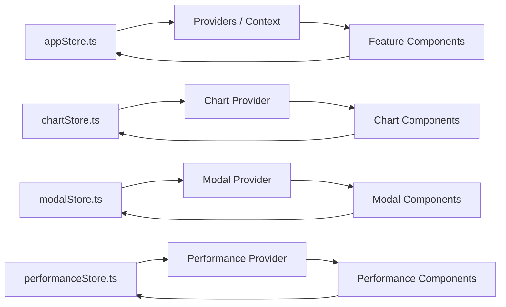

**Diagram sources**
- [stores/appStore.ts](file://frontend/src/stores/appStore.ts)
- [stores/chartStore.ts](file://frontend/src/stores/chartStore.ts)
- [stores/modalStore.ts](file://frontend/src/stores/modalStore.ts)
- [stores/performanceStore.ts](file://frontend/src/stores/performanceStore.ts)

**Section sources**
- [stores/appStore.ts](file://frontend/src/stores/appStore.ts)
- [stores/chartStore.ts](file://frontend/src/stores/chartStore.ts)
- [stores/modalStore.ts](file://frontend/src/stores/modalStore.ts)
- [stores/performanceStore.ts](file://frontend/src/stores/performanceStore.ts)

## Dependency Analysis
- Entry points depend on routing and providers.
- Features depend on shared UI and hooks.
- UI components depend on hooks and libraries but not on feature logic.
- Hooks depend on the API library and stores.
- **Enhanced**: Specialized engines (canvasRenderer, dragDropEngine, backgroundWorker, batchUpdater) provide core functionality for complex features with improved performance and separation of concerns.
- **New**: Dedicated stores manage complex state for visualization, modal, and performance systems with better isolation and optimization.

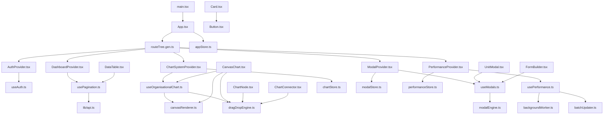

**Diagram sources**
- [main.tsx](file://frontend/src/main.tsx)
- [App.tsx](file://frontend/src/App.tsx)
- [routeTree.gen.ts](file://frontend/src/routeTree.gen.ts)
- [features/auth/AuthProvider.tsx](file://frontend/src/features/auth/AuthProvider.tsx)
- [features/dashboard/DashboardProvider.tsx](file://frontend/src/features/dashboard/DashboardProvider.tsx)
- [features/chart/ChartSystemProvider.tsx](file://frontend/src/features/chart/ChartSystemProvider.tsx)
- [features/modal/ModalProvider.tsx](file://frontend/src/features/modal/ModalProvider.tsx)
- [features/performance/PerformanceProvider.tsx](file://frontend/src/features/performance/PerformanceProvider.tsx)
- [hooks/useAuth.ts](file://frontend/src/hooks/useAuth.ts)
- [hooks/usePagination.ts](file://frontend/src/hooks/usePagination.ts)
- [hooks/useOrganisationalChart.ts](file://frontend/src/hooks/useOrganisationalChart.ts)
- [hooks/useModals.ts](file://frontend/src/hooks/useModals.ts)
- [hooks/usePerformance.ts](file://frontend/src/hooks/usePerformance.ts)
- [components/ui/DataTable.tsx](file://frontend/src/components/ui/DataTable.tsx)
- [components/ui/Card.tsx](file://frontend/src/components/ui/Card.tsx)
- [components/ui/Button.tsx](file://frontend/src/components/ui/Button.tsx)
- [components/ui/CanvasChart.tsx](file://frontend/src/components/ui/CanvasChart.tsx)
- [components/ui/ChartNode.tsx](file://frontend/src/components/ui/ChartNode.tsx)
- [components/ui/ChartConnector.tsx](file://frontend/src/components/ui/ChartConnector.tsx)
- [components/ui/UnitModal.tsx](file://frontend/src/components/ui/UnitModal.tsx)
- [components/ui/FormBuilder.tsx](file://frontend/src/components/ui/FormBuilder.tsx)
- [lib/api.ts](file://frontend/src/lib/api.ts)
- [lib/canvasRenderer.ts](file://frontend/src/lib/canvasRenderer.ts)
- [lib/dragDropEngine.ts](file://frontend/src/lib/dragDropEngine.ts)
- [lib/modalEngine.ts](file://frontend/src/lib/modalEngine.ts)
- [lib/backgroundWorker.ts](file://frontend/src/lib/backgroundWorker.ts)
- [lib/batchUpdater.ts](file://frontend/src/lib/batchUpdater.ts)
- [stores/appStore.ts](file://frontend/src/stores/appStore.ts)
- [stores/chartStore.ts](file://frontend/src/stores/chartStore.ts)
- [stores/modalStore.ts](file://frontend/src/stores/modalStore.ts)
- [stores/performanceStore.ts](file://frontend/src/stores/performanceStore.ts)

**Section sources**
- [main.tsx](file://frontend/src/main.tsx)
- [App.tsx](file://frontend/src/App.tsx)
- [routeTree.gen.ts](file://frontend/src/routeTree.gen.ts)
- [components/ui/index.ts](file://frontend/src/components/ui/index.ts)

## Testing Strategies

### Overview
The testing strategy encompasses unit tests, integration tests, and performance tests for all major components and systems. The enhanced architecture requires comprehensive testing of canvas rendering, drag-and-drop interactions, background workers, and modal management.

### Testing Approaches
- **Component Testing**: Jest and React Testing Library for component behavior and props validation
- **Canvas Testing**: Custom renderers and mock contexts for canvas-based components
- **Drag-and-Drop Testing**: Simulated mouse/touch events and interaction flows
- **Background Worker Testing**: Mocked worker environments and task queue testing
- **Modal Testing**: Focus management, backdrop interactions, and form validation
- **Performance Testing**: Benchmark suites and memory leak detection

### Test Utilities
- **Canvas Mock**: Mock implementation of Canvas API for testing
- **Event Simulator**: Utility for simulating complex user interactions
- **Worker Mock**: Mock Web Worker environment for background task testing
- **Modal Helper**: Utilities for modal testing and focus management verification
- **Performance Monitor**: Tools for measuring and validating performance metrics

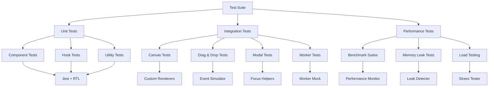

**Diagram sources**
- [tests/unit/component.test.ts](file://tests/unit/component.test.ts)
- [tests/integration/canvas.test.ts](file://tests/integration/canvas.test.ts)
- [tests/integration/dragdrop.test.ts](file://tests/integration/dragdrop.test.ts)
- [tests/integration/modal.test.ts](file://tests/integration/modal.test.ts)
- [tests/performance/benchmarks.test.ts](file://tests/performance/benchmarks.test.ts)

**Section sources**
- [tests/unit/component.test.ts](file://tests/unit/component.test.ts)
- [tests/integration/canvas.test.ts](file://tests/integration/canvas.test.ts)
- [tests/integration/dragdrop.test.ts](file://tests/integration/dragdrop.test.ts)
- [tests/integration/modal.test.ts](file://tests/integration/modal.test.ts)
- [tests/performance/benchmarks.test.ts](file://tests/performance/benchmarks.test.ts)

## Troubleshooting Guide
- Authentication issues: Verify provider wrapping around protected routes and ensure tokens are correctly handled in hooks.
- Pagination problems: Check hook state initialization and API response shape; validate page size and total counts.
- UI inconsistencies: Ensure shared UI components receive expected props and that styles/themes are applied consistently.
- Global state conflicts: Confirm that stores are updated immutably and that selectors are precise to avoid cascading re-renders.
- Network errors: Centralize error handling in the API library and surface user-friendly messages via providers or toast utilities.
- **Enhanced**: Canvas rendering issues: Verify data structure compatibility with canvas renderer and check for circular dependencies in node relationships. Monitor memory usage for large datasets and ensure proper cleanup of canvas contexts.
- **Enhanced**: Drag-and-drop problems: Ensure proper event handling and check for conflicting mouse/touch events. Verify coordinate calculations and boundary constraints. Test collision detection algorithms and snap-to-grid functionality.
- **Enhanced**: Node component issues: Validate node properties and check for proper cleanup of event listeners. Ensure visual states are properly managed and performance metrics are monitored.
- **New**: Modal management issues: Verify modal stacking context and focus management. Check backdrop click handling and keyboard navigation. Ensure proper form validation and data synchronization.
- **New**: Background worker issues: Verify worker initialization and message passing. Check task queue management and error handling. Monitor worker pool utilization and memory usage.
- **New**: Performance bottlenecks: Use performance monitor to identify slow operations. Check for unnecessary re-renders and memory leaks. Validate batch update effectiveness and background task efficiency.
- **New**: Navigation problems: Ensure route guards are properly configured and permission checks are working correctly. Verify modal overlay behavior and focus trapping.

## Conclusion
The architecture emphasizes feature-based organization, reusable UI primitives, and clear separation of concerns through providers, hooks, and stores. The recent comprehensive overhaul has significantly enhanced the organizational chart visualization system with canvas-based rendering, advanced drag-and-drop functionality, redesigned node components, and optimized performance. The addition of modal components for unit management, background calculation system, and batch state updates provides enterprise-scale capabilities while maintaining optimal performance and user experience. These improvements deliver powerful tools for complex hierarchical data visualization and manipulation, supporting sophisticated user interactions, real-time collaboration, and efficient rendering of large datasets. By adhering to composition patterns, stable prop interfaces, careful state management, and comprehensive testing strategies, teams can maintain a robust and evolving codebase that supports increasingly sophisticated business requirements while ensuring scalability, testability, and performance excellence.