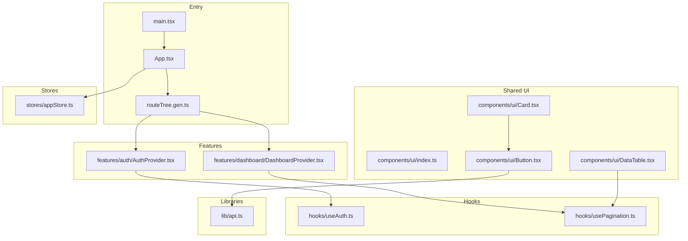
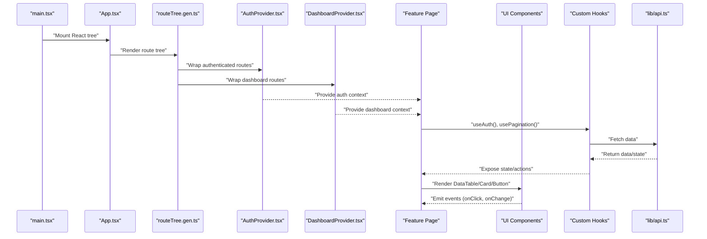
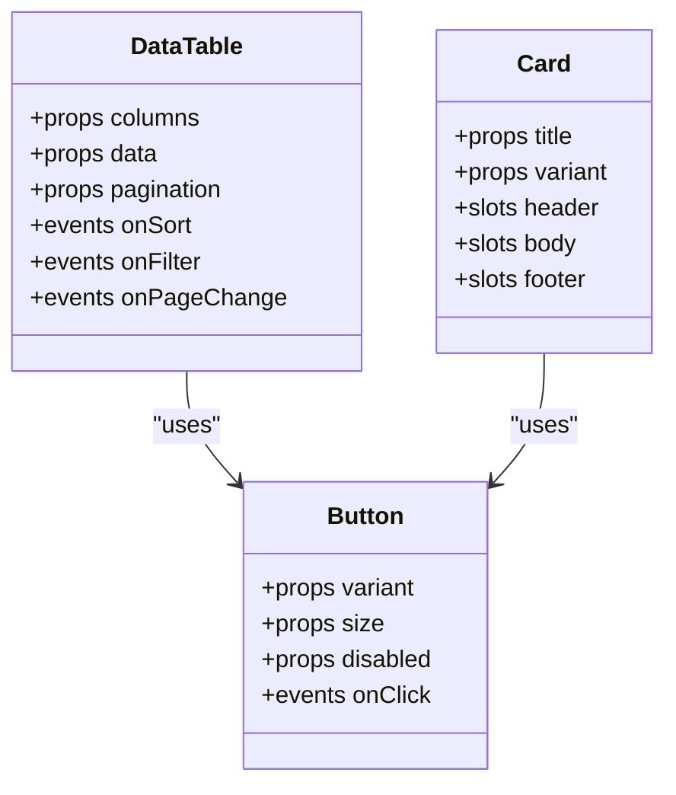
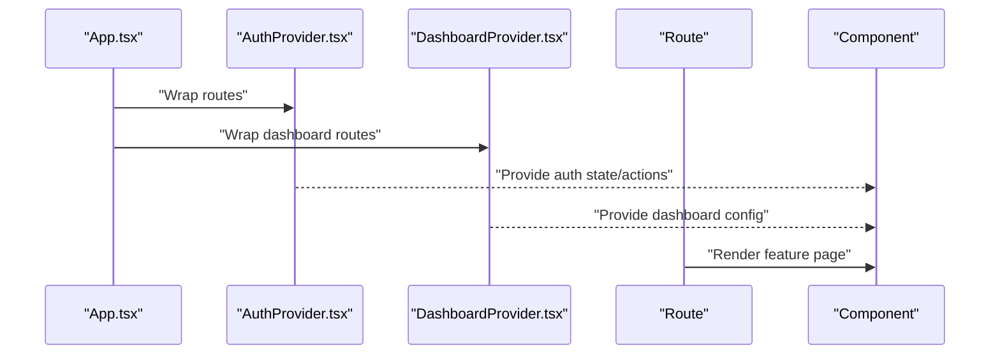
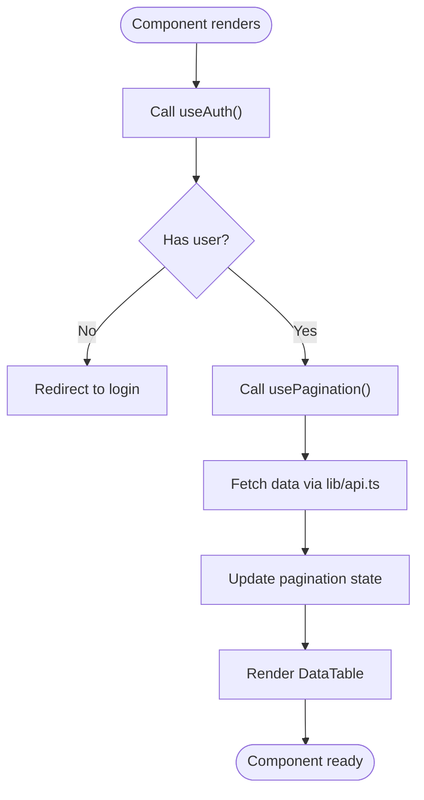
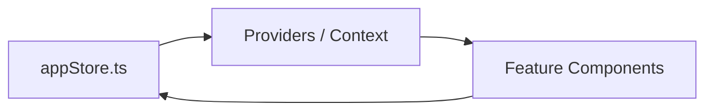
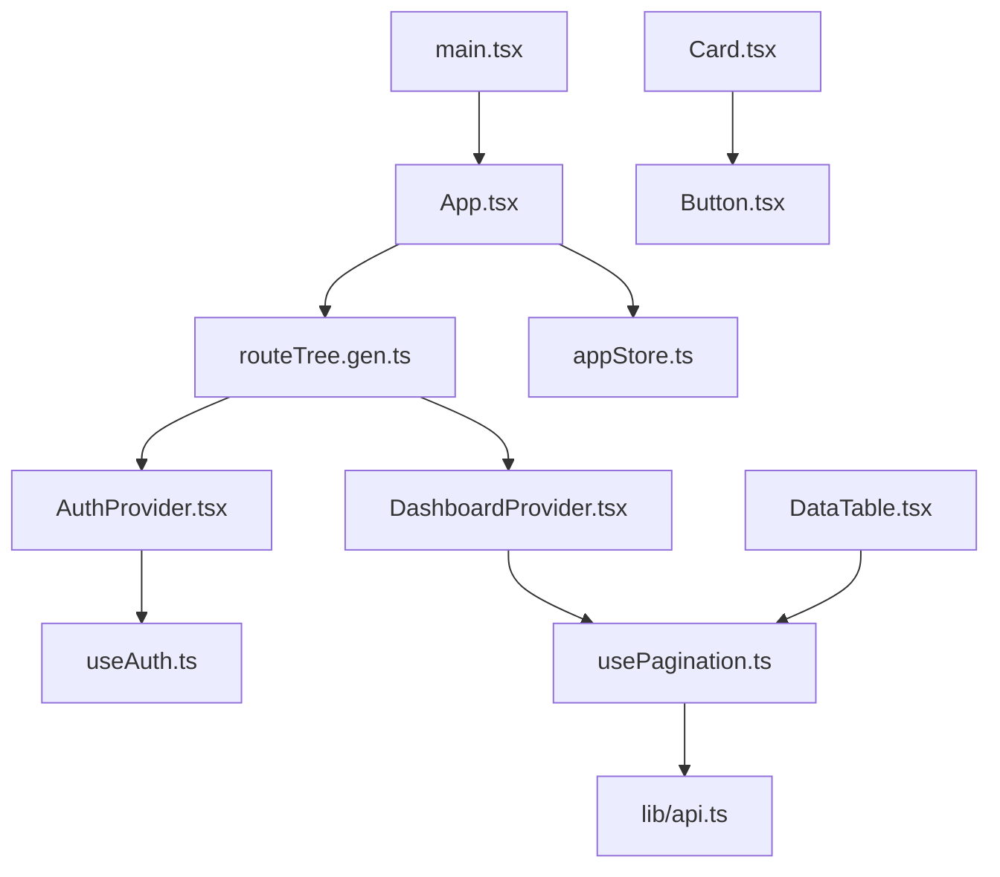

# Component Architecture

<cite>
**Referenced Files in This Document**
- [App.tsx](file://frontend/src/App.tsx)
- [main.tsx](file://frontend/src/main.tsx)
- [routeTree.gen.ts](file://frontend/src/routeTree.gen.ts)
- [components/ui/index.ts](file://frontend/src/components/ui/index.ts)
- [components/ui/DataTable.tsx](file://frontend/src/components/ui/DataTable.tsx)
- [components/ui/Card.tsx](file://frontend/src/components/ui/Card.tsx)
- [components/ui/Button.tsx](file://frontend/src/components/ui/Button.tsx)
- [features/auth/AuthProvider.tsx](file://frontend/src/features/auth/AuthProvider.tsx)
- [features/dashboard/DashboardProvider.tsx](file://frontend/src/features/dashboard/DashboardProvider.tsx)
- [hooks/useAuth.ts](file://frontend/src/hooks/useAuth.ts)
- [hooks/usePagination.ts](file://frontend/src/hooks/usePagination.ts)
- [lib/api.ts](file://frontend/src/lib/api.ts)
- [stores/appStore.ts](file://frontend/src/stores/appStore.ts)
</cite>

## Table of Contents
1. [Introduction](#introduction)
2. [Project Structure](#project-structure)
3. [Core Components](#core-components)
4. [Architecture Overview](#architecture-overview)
5. [Detailed Component Analysis](#detailed-component-analysis)
6. [Dependency Analysis](#dependency-analysis)
7. [Performance Considerations](#performance-considerations)
8. [Troubleshooting Guide](#troubleshooting-guide)
9. [Conclusion](#conclusion)

## Introduction
This document explains the React component architecture with a focus on feature-based organization, shared UI components, composition patterns, prop interfaces, event handling, providers for global state and context, testing strategies, and performance optimization techniques. The goal is to make the system understandable for both new contributors and experienced developers.

## Project Structure
The frontend follows a feature-based organization where each business domain owns its components, hooks, types, and utilities. Shared UI primitives live under a common UI layer. Providers encapsulate global state and contexts. Routes are generated by the router and compose feature pages.

**Diagram sources**
- [main.tsx](file://frontend/src/main.tsx)
- [App.tsx](file://frontend/src/App.tsx)
- [routeTree.gen.ts](file://frontend/src/routeTree.gen.ts)
- [components/ui/index.ts](file://frontend/src/components/ui/index.ts)
- [components/ui/DataTable.tsx](file://frontend/src/components/ui/DataTable.tsx)
- [components/ui/Card.tsx](file://frontend/src/components/ui/Card.tsx)
- [components/ui/Button.tsx](file://frontend/src/components/ui/Button.tsx)
- [features/auth/AuthProvider.tsx](file://frontend/src/features/auth/AuthProvider.tsx)
- [features/dashboard/DashboardProvider.tsx](file://frontend/src/features/dashboard/DashboardProvider.tsx)
- [hooks/useAuth.ts](file://frontend/src/hooks/useAuth.ts)
- [hooks/usePagination.ts](file://frontend/src/hooks/usePagination.ts)
- [lib/api.ts](file://frontend/src/lib/api.ts)
- [stores/appStore.ts](file://frontend/src/stores/appStore.ts)

**Section sources**
- [main.tsx](file://frontend/src/main.tsx)
- [App.tsx](file://frontend/src/App.tsx)
- [routeTree.gen.ts](file://frontend/src/routeTree.gen.ts)

## Core Components
- Feature-based domains: Each feature folder contains its own components, hooks, types, and utilities. This isolates concerns and improves maintainability.
- Shared UI layer: Reusable primitives (e.g., DataTable, Card, Button) are centralized under components/ui and re-exported via an index file for consistent imports.
- Composition patterns: Complex screens are composed from small, focused components. Props define clear contracts; events are passed as callbacks.
- Providers: Global state and contexts are provided at appropriate boundaries (e.g., authentication, dashboard configuration).
- Hooks: Domain-specific logic is extracted into custom hooks (e.g., useAuth, usePagination), promoting reuse and testability.
- API integration: Network calls are abstracted through a library module to keep components free of HTTP details.

**Section sources**
- [components/ui/index.ts](file://frontend/src/components/ui/index.ts)
- [components/ui/DataTable.tsx](file://frontend/src/components/ui/DataTable.tsx)
- [components/ui/Card.tsx](file://frontend/src/components/ui/Card.tsx)
- [components/ui/Button.tsx](file://frontend/src/components/ui/Button.tsx)
- [features/auth/AuthProvider.tsx](file://frontend/src/features/auth/AuthProvider.tsx)
- [features/dashboard/DashboardProvider.tsx](file://frontend/src/features/dashboard/DashboardProvider.tsx)
- [hooks/useAuth.ts](file://frontend/src/hooks/useAuth.ts)
- [hooks/usePagination.ts](file://frontend/src/hooks/usePagination.ts)
- [lib/api.ts](file://frontend/src/lib/api.ts)

## Architecture Overview
The application bootstraps via the entry point, mounts the root App, and uses a generated route tree to render feature routes. Providers wrap relevant sections to supply global state and contexts. Shared UI components are used across features to ensure consistency.

**Diagram sources**
- [main.tsx](file://frontend/src/main.tsx)
- [App.tsx](file://frontend/src/App.tsx)
- [routeTree.gen.ts](file://frontend/src/routeTree.gen.ts)
- [features/auth/AuthProvider.tsx](file://frontend/src/features/auth/AuthProvider.tsx)
- [features/dashboard/DashboardProvider.tsx](file://frontend/src/features/dashboard/DashboardProvider.tsx)
- [hooks/useAuth.ts](file://frontend/src/hooks/useAuth.ts)
- [hooks/usePagination.ts](file://frontend/src/hooks/usePagination.ts)
- [lib/api.ts](file://frontend/src/lib/api.ts)

## Detailed Component Analysis

### Shared UI Components
- DataTable: A flexible table component that supports pagination, sorting, filtering, and column configuration. It composes smaller elements and relies on hooks for data management.
- Card: A layout container with header, body, and footer slots. Used to group related content consistently.
- Button: A styled interactive element with variants and states. Encapsulates accessibility attributes and event forwarding.

**Diagram sources**
- [components/ui/DataTable.tsx](file://frontend/src/components/ui/DataTable.tsx)
- [components/ui/Card.tsx](file://frontend/src/components/ui/Card.tsx)
- [components/ui/Button.tsx](file://frontend/src/components/ui/Button.tsx)

**Section sources**
- [components/ui/DataTable.tsx](file://frontend/src/components/ui/DataTable.tsx)
- [components/ui/Card.tsx](file://frontend/src/components/ui/Card.tsx)
- [components/ui/Button.tsx](file://frontend/src/components/ui/Button.tsx)
- [components/ui/index.ts](file://frontend/src/components/ui/index.ts)

### Providers System
- Authentication Provider: Supplies user identity, permissions, and login/logout actions. Protects routes and exposes auth state to consumers.
- Dashboard Provider: Manages dashboard-specific settings such as layout preferences, active modules, and cached configurations.

**Diagram sources**
- [App.tsx](file://frontend/src/App.tsx)
- [features/auth/AuthProvider.tsx](file://frontend/src/features/auth/AuthProvider.tsx)
- [features/dashboard/DashboardProvider.tsx](file://frontend/src/features/dashboard/DashboardProvider.tsx)

**Section sources**
- [features/auth/AuthProvider.tsx](file://frontend/src/features/auth/AuthProvider.tsx)
- [features/dashboard/DashboardProvider.tsx](file://frontend/src/features/dashboard/DashboardProvider.tsx)

### Hooks and Data Flow
- useAuth: Encapsulates authentication logic, exposing user info, roles/permissions, and actions like login and logout.
- usePagination: Centralizes pagination state and handlers, commonly consumed by DataTable.

**Diagram sources**
- [hooks/useAuth.ts](file://frontend/src/hooks/useAuth.ts)
- [hooks/usePagination.ts](file://frontend/src/hooks/usePagination.ts)
- [lib/api.ts](file://frontend/src/lib/api.ts)

**Section sources**
- [hooks/useAuth.ts](file://frontend/src/hooks/useAuth.ts)
- [hooks/usePagination.ts](file://frontend/src/hooks/usePagination.ts)
- [lib/api.ts](file://frontend/src/lib/api.ts)

### Stores and Global State
- appStore: A lightweight store for cross-cutting application state (e.g., theme, language, notifications). Components subscribe selectively to avoid unnecessary re-renders.

**Diagram sources**
- [stores/appStore.ts](file://frontend/src/stores/appStore.ts)

**Section sources**
- [stores/appStore.ts](file://frontend/src/stores/appStore.ts)

## Dependency Analysis
- Entry points depend on routing and providers.
- Features depend on shared UI and hooks.
- UI components depend on hooks and libraries but not on feature logic.
- Hooks depend on the API library and stores.

**Diagram sources**
- [main.tsx](file://frontend/src/main.tsx)
- [App.tsx](file://frontend/src/App.tsx)
- [routeTree.gen.ts](file://frontend/src/routeTree.gen.ts)
- [features/auth/AuthProvider.tsx](file://frontend/src/features/auth/AuthProvider.tsx)
- [features/dashboard/DashboardProvider.tsx](file://frontend/src/features/dashboard/DashboardProvider.tsx)
- [hooks/useAuth.ts](file://frontend/src/hooks/useAuth.ts)
- [hooks/usePagination.ts](file://frontend/src/hooks/usePagination.ts)
- [components/ui/DataTable.tsx](file://frontend/src/components/ui/DataTable.tsx)
- [components/ui/Card.tsx](file://frontend/src/components/ui/Card.tsx)
- [components/ui/Button.tsx](file://frontend/src/components/ui/Button.tsx)
- [lib/api.ts](file://frontend/src/lib/api.ts)
- [stores/appStore.ts](file://frontend/src/stores/appStore.ts)

**Section sources**
- [main.tsx](file://frontend/src/main.tsx)
- [App.tsx](file://frontend/src/App.tsx)
- [routeTree.gen.ts](file://frontend/src/routeTree.gen.ts)
- [components/ui/index.ts](file://frontend/src/components/ui/index.ts)

## Performance Considerations
- Memoization: Wrap expensive computations and derived values with memoization hooks to prevent unnecessary recalculations.
- Selective subscriptions: Subscribe only to needed parts of global state to minimize re-renders.
- Lazy loading: Load heavy feature routes and large components lazily to reduce initial bundle size.
- Virtualization: For large lists or tables, consider virtualized rendering to improve scroll performance.
- Stable references: Stabilize callback and object props to help child components skip updates when using memoization.
- Debounce inputs: Debounce search/filter inputs to reduce network requests and processing overhead.
- Image/media optimization: Use responsive images and lazy loading for media assets.

[No sources needed since this section provides general guidance]

## Troubleshooting Guide
- Authentication issues: Verify provider wrapping around protected routes and ensure tokens are correctly handled in hooks.
- Pagination problems: Check hook state initialization and API response shape; validate page size and total counts.
- UI inconsistencies: Ensure shared UI components receive expected props and that styles/themes are applied consistently.
- Global state conflicts: Confirm that stores are updated immutably and that selectors are precise to avoid cascading re-renders.
- Network errors: Centralize error handling in the API library and surface user-friendly messages via providers or toast utilities.

[No sources needed since this section provides general guidance]

## Conclusion
The architecture emphasizes feature-based organization, reusable UI primitives, and clear separation of concerns through providers, hooks, and stores. This structure promotes scalability, testability, and performance. By adhering to composition patterns, stable prop interfaces, and careful state management, teams can maintain a robust and evolving codebase.

[No sources needed since this section summarizes without analyzing specific files]