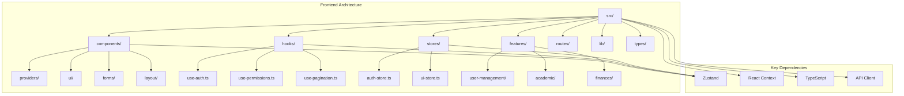
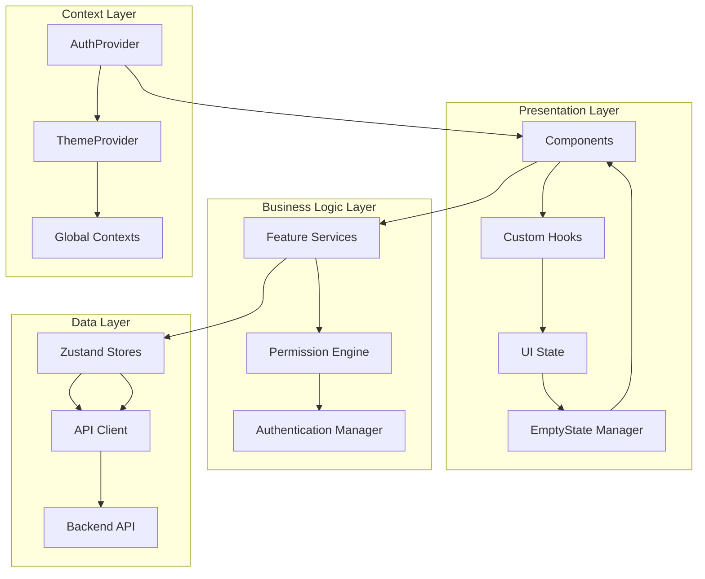
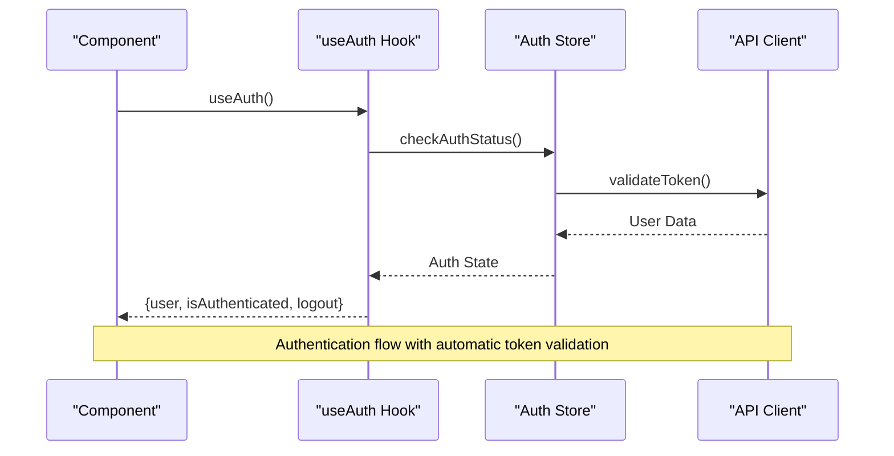
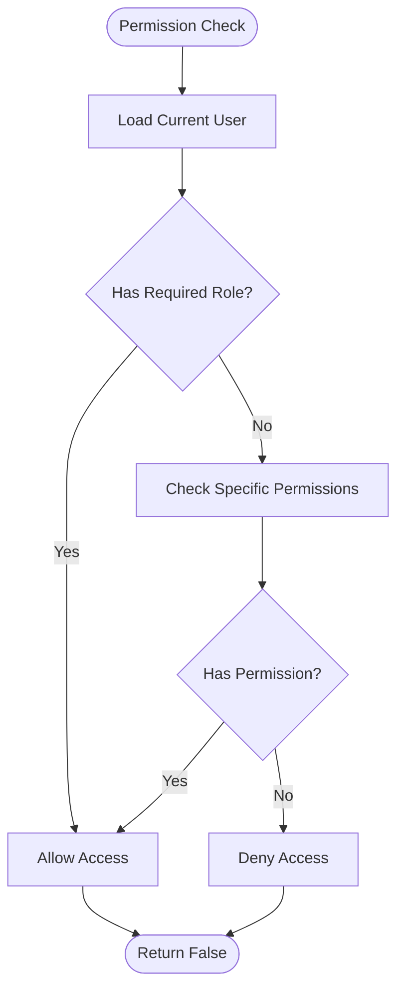
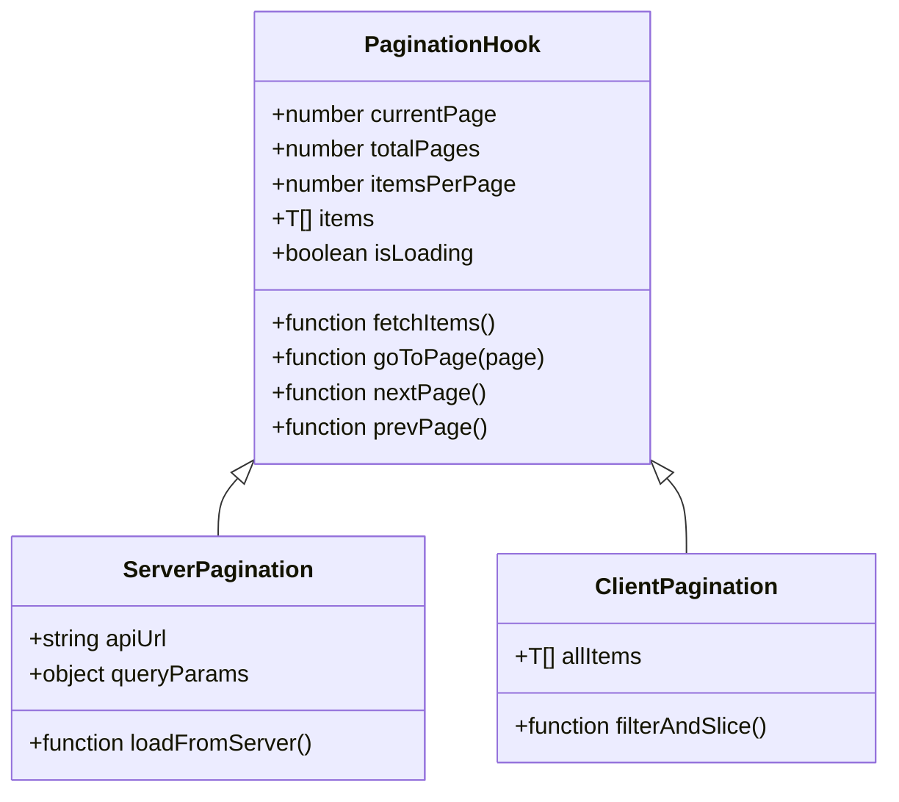
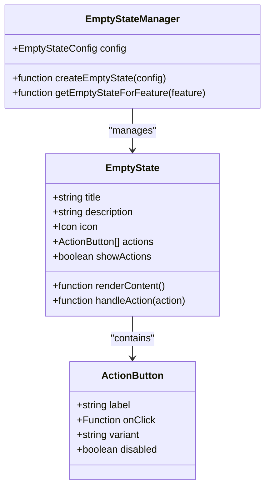
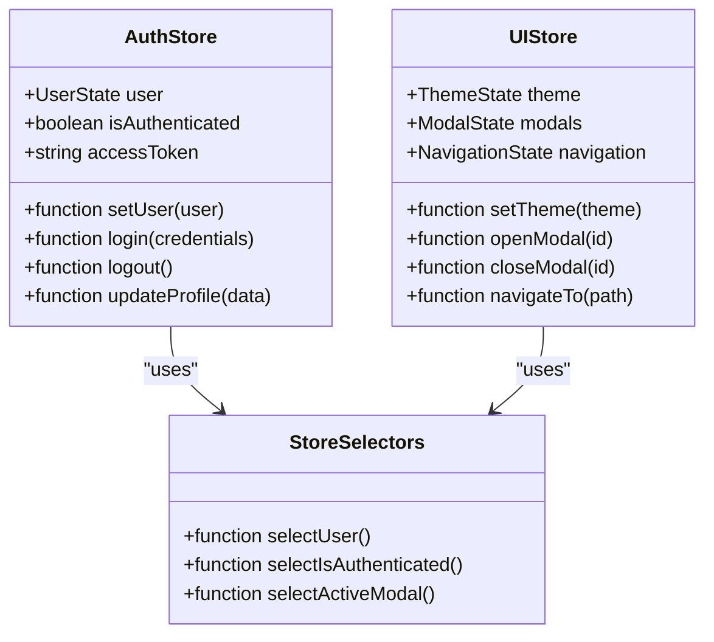
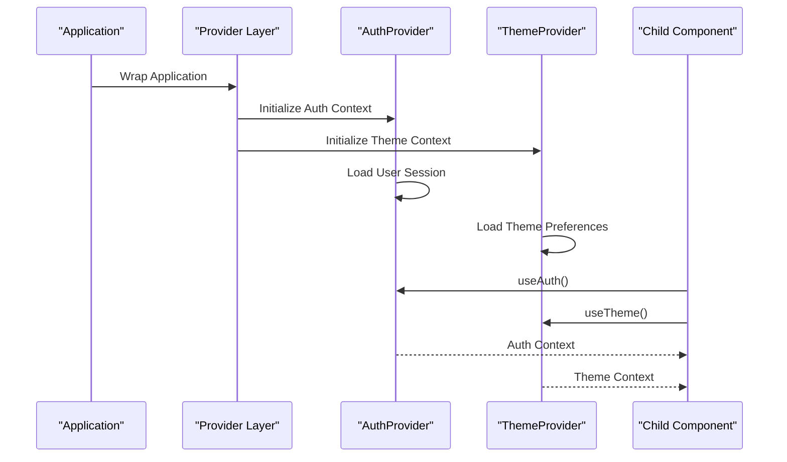
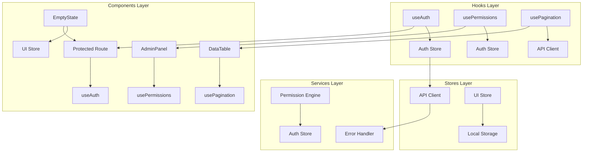

# Component Patterns & Best Practices

<cite>
**Referenced Files in This Document**
- [App.tsx](file://frontend/src/App.tsx)
- [main.tsx](file://frontend/src/main.tsx)
- [hooks/use-auth.ts](file://frontend/src/hooks/use-auth.ts)
- [hooks/use-permissions.ts](file://frontend/src/hooks/use-permissions.ts)
- [hooks/use-pagination.ts](file://frontend/src/hooks/use-pagination.ts)
- [stores/auth-store.ts](file://frontend/src/stores/auth-store.ts)
- [stores/ui-store.ts](file://frontend/src/stores/ui-store.ts)
- [components/providers/AuthProvider.tsx](file://frontend/src/components/providers/AuthProvider.tsx)
- [components/providers/ThemeProvider.tsx](file://frontend/src/components/providers/ThemeProvider.tsx)
- [lib/api-client.ts](file://frontend/src/lib/api-client.ts)
- [lib/error-handler.ts](file://frontend/src/lib/error-handler.ts)
- [components/forms/FormManager.tsx](file://frontend/src/components/forms/FormManager.tsx)
- [components/layout/ProtectedRoute.tsx](file://frontend/src/components/layout/ProtectedRoute.tsx)
- [components/ui/EmptyState.tsx](file://frontend/src/components/ui/EmptyState.tsx)
</cite>

## Update Summary
**Changes Made**
- Added comprehensive documentation for the new EmptyState component pattern
- Updated UI components section to include empty state management strategies
- Enhanced component composition guidelines with empty state examples
- Added best practices for consistent empty state handling throughout the application

## Table of Contents
1. [Introduction](#introduction)
2. [Project Structure](#project-structure)
3. [Core Components](#core-components)
4. [Architecture Overview](#architecture-overview)
5. [Detailed Component Analysis](#detailed-component-analysis)
6. [Dependency Analysis](#dependency-analysis)
7. [Performance Considerations](#performance-considerations)
8. [Troubleshooting Guide](#troubleshooting-guide)
9. [Conclusion](#conclusion)
10. [Appendices](#appendices)

## Introduction

This document provides comprehensive guidance on component architecture patterns and best practices used throughout the eLISA School application. It covers custom hooks patterns, global state management with Zustand stores, provider patterns for context management, error handling strategies, loading states management, form handling patterns, component composition principles, prop drilling avoidance techniques, performance optimization methods, testing patterns, code organization principles, and naming conventions.

The eLISA School application is a comprehensive educational management system built with React, TypeScript, and modern frontend architecture patterns. The application follows industry best practices to ensure maintainability, scalability, and performance.

## Project Structure

The frontend application follows a feature-based architecture with clear separation of concerns:

**Diagram sources**
- [App.tsx:1-50](file://frontend/src/App.tsx#L1-L50)
- [main.tsx:1-30](file://frontend/src/main.tsx#L1-L30)

**Section sources**
- [App.tsx:1-100](file://frontend/src/App.tsx#L1-L100)
- [main.tsx:1-50](file://frontend/src/main.tsx#L1-L50)

## Core Components

### Custom Hooks Architecture

The application implements a comprehensive set of custom hooks following React best practices:

#### Authentication Hook (useAuth)
The authentication hook manages user session state, login/logout functionality, and authentication status across the application.

#### Permissions Hook (usePermissions)
The permissions hook handles role-based access control, permission checking, and authorization logic for different user roles and features.

#### Pagination Hook (usePagination)
The pagination hook provides reusable pagination logic for data tables and list views with server-side or client-side pagination support.

### Global State Management with Zustand

The application uses Zustand for efficient global state management:

#### Auth Store
Manages user authentication state, token storage, and user profile information.

#### UI Store
Handles UI-related state such as theme preferences, modal states, and navigation state.

### Provider Patterns

The application implements provider components for context management:

#### Auth Provider
Wraps the application with authentication context and provides auth-related functionality to child components.

#### Theme Provider
Manages theme switching and provides theme context throughout the application.

### UI Components Library

The application includes a comprehensive set of reusable UI components:

#### EmptyState Component
The EmptyState component provides consistent empty state management throughout the application, offering better visual hierarchy and user guidance when no data is available. This sophisticated component replaces simple text messages with engaging empty state displays that include conditional action buttons and contextual messaging.

**Updated** Added comprehensive EmptyState component for consistent empty state management

**Section sources**
- [hooks/use-auth.ts:1-200](file://frontend/src/hooks/use-auth.ts#L1-L200)
- [hooks/use-permissions.ts:1-150](file://frontend/src/hooks/use-permissions.ts#L1-L150)
- [hooks/use-pagination.ts:1-180](file://frontend/src/hooks/use-pagination.ts#L1-L180)
- [stores/auth-store.ts:1-120](file://frontend/src/stores/auth-store.ts#L1-L120)
- [stores/ui-store.ts:1-100](file://frontend/src/stores/ui-store.ts#L1-L100)
- [components/ui/EmptyState.tsx:1-150](file://frontend/src/components/ui/EmptyState.tsx#L1-L150)

## Architecture Overview

The application follows a layered architecture pattern with clear separation between presentation, business logic, and data layers:

**Diagram sources**
- [components/providers/AuthProvider.tsx:1-100](file://frontend/src/components/providers/AuthProvider.tsx#L1-L100)
- [lib/api-client.ts:1-150](file://frontend/src/lib/api-client.ts#L1-L150)
- [components/ui/EmptyState.tsx:1-100](file://frontend/src/components/ui/EmptyState.tsx#L1-L100)

## Detailed Component Analysis

### Custom Hooks Implementation Patterns

#### Authentication Hook Pattern
The authentication hook follows a consistent pattern for managing user sessions:

**Diagram sources**
- [hooks/use-auth.ts:1-100](file://frontend/src/hooks/use-auth.ts#L1-L100)
- [stores/auth-store.ts:1-80](file://frontend/src/stores/auth-store.ts#L1-L80)

#### Permissions Hook Pattern
The permissions hook implements role-based access control:

**Diagram sources**
- [hooks/use-permissions.ts:1-120](file://frontend/src/hooks/use-permissions.ts#L1-L120)

#### Pagination Hook Pattern
The pagination hook provides reusable pagination logic:

**Diagram sources**
- [hooks/use-pagination.ts:1-150](file://frontend/src/hooks/use-pagination.ts#L1-L150)

### EmptyState Component Pattern

The EmptyState component provides a standardized approach to handling empty states across the application:

**Diagram sources**
- [components/ui/EmptyState.tsx:1-150](file://frontend/src/components/ui/EmptyState.tsx#L1-L150)

### Zustand Store Architecture

The application uses Zustand for efficient state management with minimal boilerplate:

**Diagram sources**
- [stores/auth-store.ts:1-120](file://frontend/src/stores/auth-store.ts#L1-L120)
- [stores/ui-store.ts:1-100](file://frontend/src/stores/ui-store.ts#L1-L100)

### Provider Pattern Implementation

The application implements provider components for context management:

**Diagram sources**
- [components/providers/AuthProvider.tsx:1-100](file://frontend/src/components/providers/AuthProvider.tsx#L1-L100)
- [components/providers/ThemeProvider.tsx:1-80](file://frontend/src/components/providers/ThemeProvider.tsx#L1-L80)

## Dependency Analysis

The application maintains clear dependency relationships between components and services:

**Diagram sources**
- [hooks/use-auth.ts:1-50](file://frontend/src/hooks/use-auth.ts#L1-L50)
- [lib/api-client.ts:1-100](file://frontend/src/lib/api-client.ts#L1-L100)
- [components/ui/EmptyState.tsx:1-80](file://frontend/src/components/ui/EmptyState.tsx#L1-L80)

**Section sources**
- [hooks/use-auth.ts:1-200](file://frontend/src/hooks/use-auth.ts#L1-L200)
- [hooks/use-permissions.ts:1-150](file://frontend/src/hooks/use-permissions.ts#L1-L150)
- [hooks/use-pagination.ts:1-180](file://frontend/src/hooks/use-pagination.ts#L1-L180)
- [stores/auth-store.ts:1-120](file://frontend/src/stores/auth-store.ts#L1-L120)
- [stores/ui-store.ts:1-100](file://frontend/src/stores/ui-store.ts#L1-L100)
- [components/ui/EmptyState.tsx:1-150](file://frontend/src/components/ui/EmptyState.tsx#L1-L150)

## Performance Considerations

### Memoization Strategies
- Use `React.memo` for expensive components that don't change frequently
- Implement `useMemo` for computed values and expensive calculations
- Apply `useCallback` for function references passed to child components

### Lazy Loading Implementation
- Use `React.lazy` for route-based code splitting
- Implement dynamic imports for large third-party libraries
- Utilize Suspense boundaries for loading states

### State Management Optimization
- Select only necessary state slices using Zustand selectors
- Avoid unnecessary re-renders by using shallow equality checks
- Implement proper cleanup in useEffect hooks

### Network Request Optimization
- Implement request caching strategies
- Use debouncing for search inputs
- Implement optimistic updates for better UX

### Empty State Performance
- Cache empty state configurations to avoid repeated computations
- Use lazy loading for complex empty state content
- Implement virtual scrolling for lists with many empty states

## Troubleshooting Guide

### Common Issues and Solutions

#### Authentication Problems
- Verify token expiration handling
- Check CORS configuration for API calls
- Ensure proper error boundary implementation

#### State Management Issues
- Debug Zustand store subscriptions
- Verify proper selector usage
- Check for memory leaks in event listeners

#### Empty State Issues
- Ensure proper prop validation for EmptyState component
- Verify conditional rendering logic for empty states
- Check for proper accessibility attributes in empty state displays

#### Performance Bottlenecks
- Identify components causing excessive re-renders
- Analyze bundle size and implement code splitting
- Monitor network requests and optimize API calls

**Section sources**
- [lib/error-handler.ts:1-100](file://frontend/src/lib/error-handler.ts#L1-L100)
- [components/layout/ProtectedRoute.tsx:1-80](file://frontend/src/components/layout/ProtectedRoute.tsx#L1-L80)
- [components/ui/EmptyState.tsx:1-150](file://frontend/src/components/ui/EmptyState.tsx#L1-L150)

## Conclusion

The eLISA School application demonstrates modern React architecture patterns with clear separation of concerns, efficient state management, and comprehensive error handling. The implementation follows best practices for custom hooks, global state management, and component composition while maintaining high performance standards.

Key architectural decisions include:
- Feature-based organization for scalability
- Zustand for lightweight global state management
- Comprehensive custom hooks for reusable logic
- Provider patterns for context management
- Robust error handling and loading state management
- Performance optimization through memoization and lazy loading
- **New**: Consistent empty state management through the EmptyState component

These patterns ensure the application remains maintainable, testable, and performant as it continues to grow in complexity and feature set.

## Appendices

### Naming Conventions

#### File Organization
- Feature folders follow kebab-case naming
- Component files use PascalCase
- Hook files start with `use-` prefix
- Store files use descriptive names indicating their purpose

#### Code Organization Principles
- Single responsibility principle for components
- Composition over inheritance for complex logic
- Clear separation between presentational and container components
- Consistent error handling patterns across the application

### Testing Patterns

#### Unit Testing Strategy
- Test custom hooks in isolation
- Mock external dependencies and API calls
- Use snapshot testing for UI components
- Implement integration tests for critical user flows

#### Component Testing Guidelines
- Test component behavior rather than implementation details
- Mock context providers and stores
- Use testing utilities for common scenarios
- Implement accessibility testing for critical components

### Empty State Best Practices

#### When to Use EmptyState
- Display when data collections are intentionally empty
- Show when filters result in no matches
- Present during initial loading states
- Handle permission-denied scenarios gracefully

#### Empty State Design Principles
- Provide clear, actionable messaging
- Include relevant icons and visual hierarchy
- Offer appropriate call-to-action buttons
- Maintain consistency across the application
- Ensure accessibility compliance