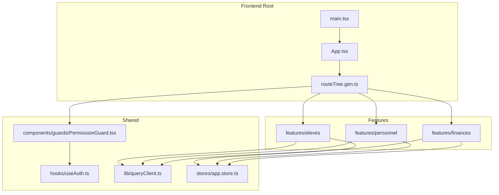
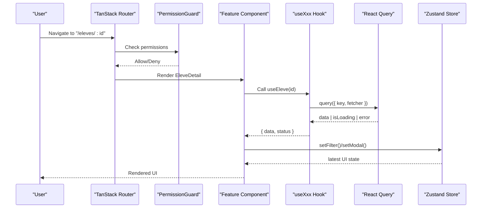
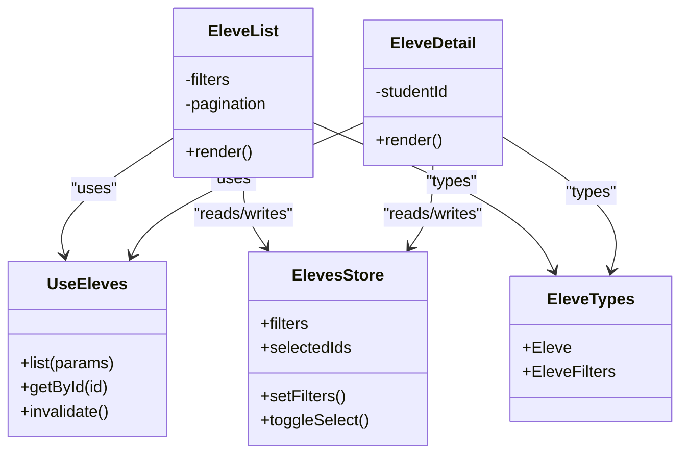
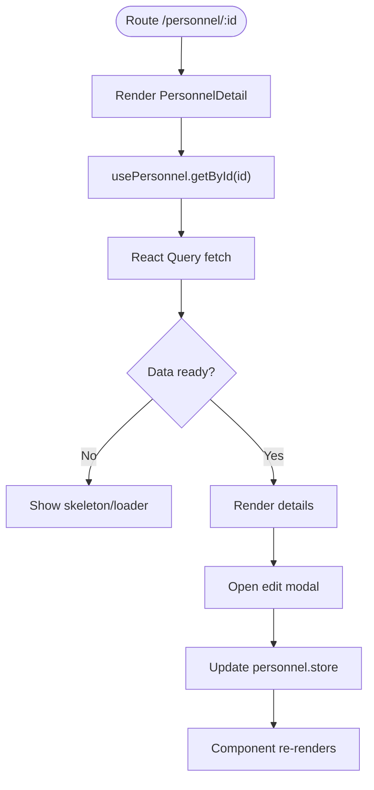
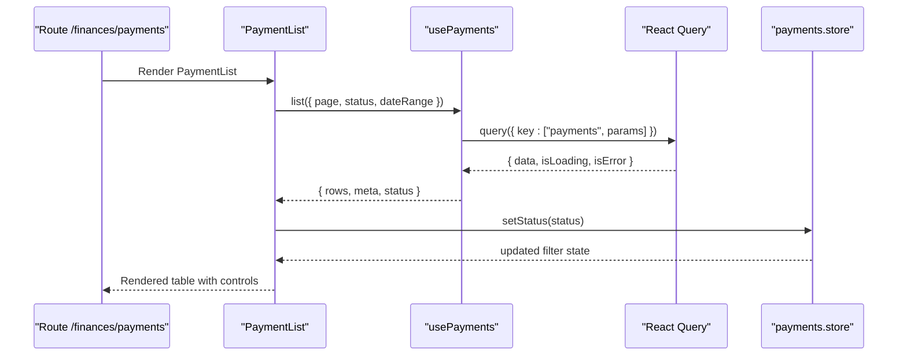
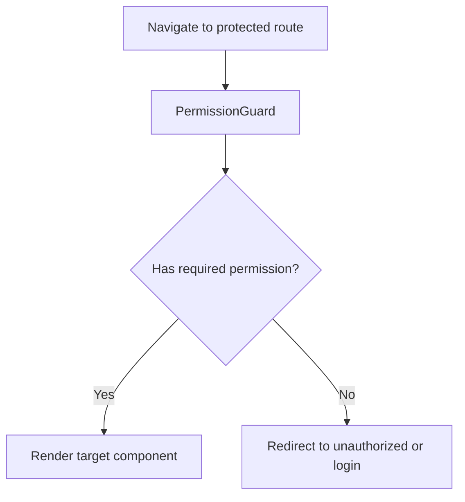
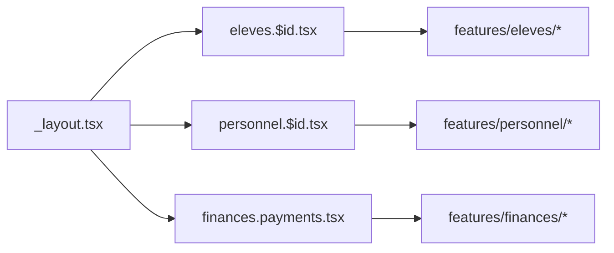
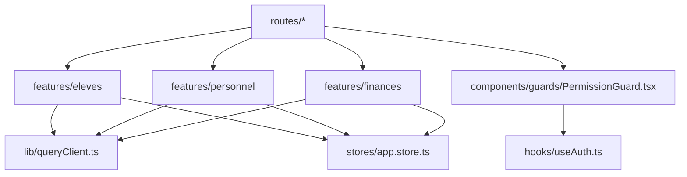

# Feature-Specific Components

<cite>
**Referenced Files in This Document**
- [App.tsx](file://frontend/src/App.tsx)
- [main.tsx](file://frontend/src/main.tsx)
- [routeTree.gen.ts](file://frontend/src/routeTree.gen.ts)
- [eleves/index.ts](file://frontend/src/features/eleves/index.ts)
- [eleves/components/EleveList.tsx](file://frontend/src/features/eleves/components/EleveList.tsx)
- [eleves/hooks/useEleves.ts](file://frontend/src/features/eleves/hooks/useEleves.ts)
- [eleves/types/eleve.types.ts](file://frontend/src/features/eleves/types/eleve.types.ts)
- [eleves/store/eleves.store.ts](file://frontend/src/features/eleves/store/eleves.store.ts)
- [personnel/index.ts](file://frontend/src/features/personnel/index.ts)
- [personnel/components/PersonnelList.tsx](file://frontend/src/features/personnel/components/PersonnelList.tsx)
- [personnel/hooks/usePersonnel.ts](file://frontend/src/features/personnel/hooks/usePersonnel.ts)
- [personnel/types/personnel.types.ts](file://frontend/src/features/personnel/types/personnel.types.ts)
- [personnel/store/personnel.store.ts](file://frontend/src/features/personnel/store/personnel.store.ts)
- [finances/index.ts](file://frontend/src/features/finances/index.ts)
- [finances/components/PaymentList.tsx](file://frontend/src/features/finances/components/PaymentList.tsx)
- [finances/hooks/usePayments.ts](file://frontend/src/features/finances/hooks/usePayments.ts)
- [finances/types/payment.types.ts](file://frontend/src/features/finances/types/payment.types.ts)
- [finances/store/payments.store.ts](file://frontend/src/features/finances/store/payments.store.ts)
- [routes/_layout.tsx](file://frontend/src/routes/_layout.tsx)
- [routes/eleves.$id.tsx](file://frontend/src/routes/eleves.$id.tsx)
- [routes/personnel.$id.tsx](file://frontend/src/routes/personnel.$id.tsx)
- [routes/finances.payments.tsx](file://frontend/src/routes/finances.payments.tsx)
- [components/guards/PermissionGuard.tsx](file://frontend/src/components/guards/PermissionGuard.tsx)
- [hooks/useAuth.ts](file://frontend/src/hooks/useAuth.ts)
- [lib/queryClient.ts](file://frontend/src/lib/queryClient.ts)
- [stores/app.store.ts](file://frontend/src/stores/app.store.ts)
</cite>

## Table of Contents
1. [Introduction](#introduction)
2. [Project Structure](#project-structure)
3. [Core Components](#core-components)
4. [Architecture Overview](#architecture-overview)
5. [Detailed Component Analysis](#detailed-component-analysis)
6. [Dependency Analysis](#dependency-analysis)
7. [Performance Considerations](#performance-considerations)
8. [Troubleshooting Guide](#troubleshooting-guide)
9. [Conclusion](#conclusion)

## Introduction
This document explains the feature-based architecture used across business domains (eleves, personnel, finances, etc.). Each domain owns its components, hooks, types, stores, and utilities. The frontend uses:
- React Query for data fetching and caching
- Zustand for local UI state management
- Route-based component organization with TanStack Router
- Permission guards to protect routes and actions
- Feature module loading patterns for scalability

The goal is to help developers understand how features are composed, how state flows between layers, and how to test and optimize feature components effectively.

## Project Structure
The frontend organizes code by feature under src/features/<domain>. A typical feature includes:
- components: presentational and container components
- hooks: React Query hooks and feature-specific logic
- types: TypeScript interfaces and enums
- store: Zustand slices for local UI state
- index.ts: public API re-exports for clean imports

**Diagram sources**
- [App.tsx](file://frontend/src/App.tsx)
- [main.tsx](file://frontend/src/main.tsx)
- [routeTree.gen.ts](file://frontend/src/routeTree.gen.ts)
- [lib/queryClient.ts](file://frontend/src/lib/queryClient.ts)
- [stores/app.store.ts](file://frontend/src/stores/app.store.ts)
- [components/guards/PermissionGuard.tsx](file://frontend/src/components/guards/PermissionGuard.tsx)
- [hooks/useAuth.ts](file://frontend/src/hooks/useAuth.ts)

**Section sources**
- [App.tsx](file://frontend/src/App.tsx)
- [main.tsx](file://frontend/src/main.tsx)
- [routeTree.gen.ts](file://frontend/src/routeTree.gen.ts)

## Core Components
Each feature exposes a small public surface via an index file that re-exports components, hooks, and types. This keeps route files and other features decoupled from internal structure.

- eleves: student list/detail views, queries, types, and UI store slice
- personnel: staff list/detail views, queries, types, and UI store slice
- finances: payments and related views, queries, types, and UI store slice

Key responsibilities:
- Components render feature UI and consume hooks
- Hooks encapsulate React Query usage and transform server responses
- Types define request/response contracts and UI shapes
- Stores manage local UI state (filters, pagination, modals)

**Section sources**
- [eleves/index.ts](file://frontend/src/features/eleves/index.ts)
- [personnel/index.ts](file://frontend/src/features/personnel/index.ts)
- [finances/index.ts](file://frontend/src/features/finances/index.ts)

## Architecture Overview
Feature architecture follows a layered pattern:
- Routes mount feature components
- Components call feature hooks
- Hooks use React Query to fetch data
- Components read/write Zustand stores for local UI state
- Permission guards wrap protected routes/actions

**Diagram sources**
- [routes/eleves.$id.tsx](file://frontend/src/routes/eleves.$id.tsx)
- [components/guards/PermissionGuard.tsx](file://frontend/src/components/guards/PermissionGuard.tsx)
- [hooks/useAuth.ts](file://frontend/src/hooks/useAuth.ts)
- [lib/queryClient.ts](file://frontend/src/lib/queryClient.ts)
- [eleves/hooks/useEleves.ts](file://frontend/src/features/eleves/hooks/useEleves.ts)
- [eleves/store/eleves.store.ts](file://frontend/src/features/eleves/store/eleves.store.ts)

## Detailed Component Analysis

### Eleves Feature
Responsibilities:
- List and detail views for students
- Queries for listing and fetching a single student
- Local UI state for filters, selection, and modal visibility

Composition patterns:
- Route mounts EleveList or EleveDetail
- Components consume useEleves hooks
- UI state managed in eleves.store.ts

**Diagram sources**
- [eleves/components/EleveList.tsx](file://frontend/src/features/eleves/components/EleveList.tsx)
- [eleves/hooks/useEleves.ts](file://frontend/src/features/eleves/hooks/useEleves.ts)
- [eleves/types/eleve.types.ts](file://frontend/src/features/eleves/types/eleve.types.ts)
- [eleves/store/eleves.store.ts](file://frontend/src/features/eleves/store/eleves.store.ts)

Data flow example:
- Route renders EleveList
- EleveList calls useEleves.list(filters)
- React Query caches results; component subscribes to updates
- EleveList toggles filters via ElevesStore.setFilters()

**Section sources**
- [eleves/components/EleveList.tsx](file://frontend/src/features/eleves/components/EleveList.tsx)
- [eleves/hooks/useEleves.ts](file://frontend/src/features/eleves/hooks/useEleves.ts)
- [eleves/types/eleve.types.ts](file://frontend/src/features/eleves/types/eleve.types.ts)
- [eleves/store/eleves.store.ts](file://frontend/src/features/eleves/store/eleves.store.ts)
- [routes/eleves.$id.tsx](file://frontend/src/routes/eleves.$id.tsx)

### Personnel Feature
Responsibilities:
- Staff directory and profile views
- Queries for listing and fetching a single staff member
- Local UI state for search, roles, and modals

**Diagram sources**
- [personnel/components/PersonnelList.tsx](file://frontend/src/features/personnel/components/PersonnelList.tsx)
- [personnel/hooks/usePersonnel.ts](file://frontend/src/features/personnel/hooks/usePersonnel.ts)
- [personnel/types/personnel.types.ts](file://frontend/src/features/personnel/types/personnel.types.ts)
- [personnel/store/personnel.store.ts](file://frontend/src/features/personnel/store/personnel.store.ts)
- [routes/personnel.$id.tsx](file://frontend/src/routes/personnel.$id.tsx)

**Section sources**
- [personnel/components/PersonnelList.tsx](file://frontend/src/features/personnel/components/PersonnelList.tsx)
- [personnel/hooks/usePersonnel.ts](file://frontend/src/features/personnel/hooks/usePersonnel.ts)
- [personnel/types/personnel.types.ts](file://frontend/src/features/personnel/types/personnel.types.ts)
- [personnel/store/personnel.store.ts](file://frontend/src/features/personnel/store/personnel.store.ts)
- [routes/personnel.$id.tsx](file://frontend/src/routes/personnel.$id.tsx)

### Finances Feature
Responsibilities:
- Payments list and summary views
- Queries for paginated payment lists and totals
- Local UI state for date ranges, statuses, and export flags

**Diagram sources**
- [finances/components/PaymentList.tsx](file://frontend/src/features/finances/components/PaymentList.tsx)
- [finances/hooks/usePayments.ts](file://frontend/src/features/finances/hooks/usePayments.ts)
- [finances/types/payment.types.ts](file://frontend/src/features/finances/types/payment.types.ts)
- [finances/store/payments.store.ts](file://frontend/src/features/finances/store/payments.store.ts)
- [routes/finances.payments.tsx](file://frontend/src/routes/finances.payments.tsx)

**Section sources**
- [finances/components/PaymentList.tsx](file://frontend/src/features/finances/components/PaymentList.tsx)
- [finances/hooks/usePayments.ts](file://frontend/src/features/finances/hooks/usePayments.ts)
- [finances/types/payment.types.ts](file://frontend/src/features/finances/types/payment.types.ts)
- [finances/store/payments.store.ts](file://frontend/src/features/finances/store/payments.store.ts)
- [routes/finances.payments.tsx](file://frontend/src/routes/finances.payments.tsx)

### Permission Guards and Authentication Integration
- PermissionGuard wraps protected routes and checks user capabilities
- useAuth provides current user context and capability checks
- Routes can conditionally render or redirect based on permissions

**Diagram sources**
- [components/guards/PermissionGuard.tsx](file://frontend/src/components/guards/PermissionGuard.tsx)
- [hooks/useAuth.ts](file://frontend/src/hooks/useAuth.ts)

**Section sources**
- [components/guards/PermissionGuard.tsx](file://frontend/src/components/guards/PermissionGuard.tsx)
- [hooks/useAuth.ts](file://frontend/src/hooks/useAuth.ts)

### Route-Based Organization
Routes are organized by domain and nested layout:
- _layout.tsx defines shared chrome and guards
- Domain routes map to feature components
- Generated route tree centralizes navigation configuration

**Diagram sources**
- [routes/_layout.tsx](file://frontend/src/routes/_layout.tsx)
- [routes/eleves.$id.tsx](file://frontend/src/routes/eleves.$id.tsx)
- [routes/personnel.$id.tsx](file://frontend/src/routes/personnel.$id.tsx)
- [routes/finances.payments.tsx](file://frontend/src/routes/finances.payments.tsx)

**Section sources**
- [routes/_layout.tsx](file://frontend/src/routes/_layout.tsx)
- [routes/eleves.$id.tsx](file://frontend/src/routes/eleves.$id.tsx)
- [routes/personnel.$id.tsx](file://frontend/src/routes/personnel.$id.tsx)
- [routes/finances.payments.tsx](file://frontend/src/routes/finances.payments.tsx)

## Dependency Analysis
- Features depend on shared libraries:
  - React Query client configured in lib/queryClient.ts
  - Global app store in stores/app.store.ts
  - Permission guard and auth hook for access control
- Features are loosely coupled through typed APIs and re-exports

**Diagram sources**
- [lib/queryClient.ts](file://frontend/src/lib/queryClient.ts)
- [stores/app.store.ts](file://frontend/src/stores/app.store.ts)
- [components/guards/PermissionGuard.tsx](file://frontend/src/components/guards/PermissionGuard.tsx)
- [hooks/useAuth.ts](file://frontend/src/hooks/useAuth.ts)
- [routes/_layout.tsx](file://frontend/src/routes/_layout.tsx)

**Section sources**
- [lib/queryClient.ts](file://frontend/src/lib/queryClient.ts)
- [stores/app.store.ts](file://frontend/src/stores/app.store.ts)
- [components/guards/PermissionGuard.tsx](file://frontend/src/components/guards/PermissionGuard.tsx)
- [hooks/useAuth.ts](file://frontend/src/hooks/useAuth.ts)

## Performance Considerations
- Prefer React Query cache keys that include all filter parameters to avoid stale data
- Use pagination and infinite queries for large lists
- Debounce input-driven filters in hooks before triggering refetches
- Keep Zustand stores minimal; only persist UI state, not full entities
- Memoize expensive computations in components using selectors or derived values
- Avoid unnecessary re-renders by splitting components and using stable references
- Leverage route-level lazy loading where appropriate to reduce initial bundle size

[No sources needed since this section provides general guidance]

## Troubleshooting Guide
Common issues and strategies:
- Stale or missing data: verify React Query cache keys and invalidation triggers
- Permission denied errors: ensure PermissionGuard has correct permissions and useAuth returns expected capabilities
- Excessive re-renders: check Zustand store subscriptions and component prop stability
- Network errors: inspect React Query error states and implement retry/backoff policies
- Route not found: confirm route definitions and generated route tree consistency

**Section sources**
- [lib/queryClient.ts](file://frontend/src/lib/queryClient.ts)
- [components/guards/PermissionGuard.tsx](file://frontend/src/components/guards/PermissionGuard.tsx)
- [hooks/useAuth.ts](file://frontend/src/hooks/useAuth.ts)

## Conclusion
The feature-based architecture cleanly separates concerns by domain, enabling scalable growth and maintainability. By combining React Query for data, Zustand for UI state, and robust routing with permission guards, each feature remains cohesive and testable. Following the composition patterns and performance tips outlined here will help keep the application responsive and easy to evolve.