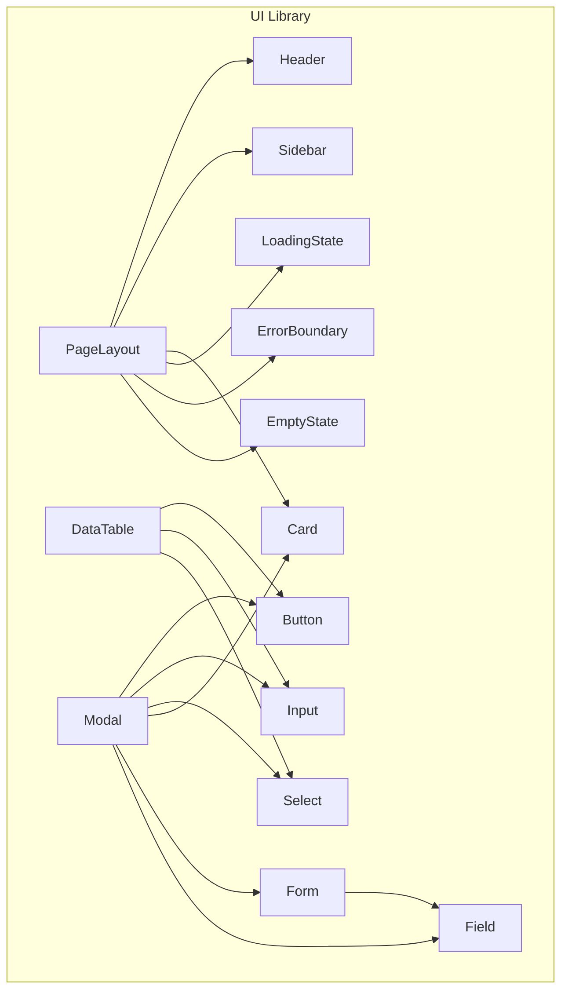
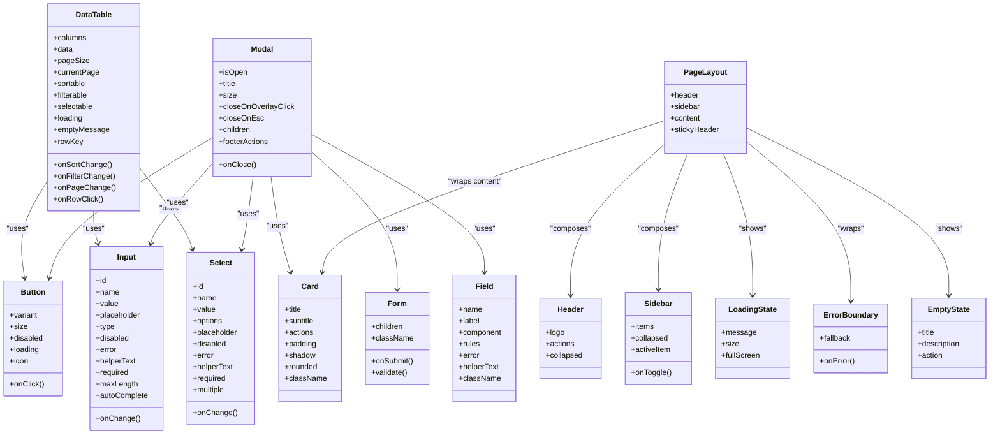
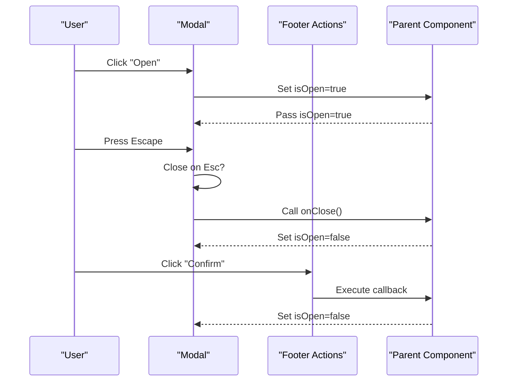
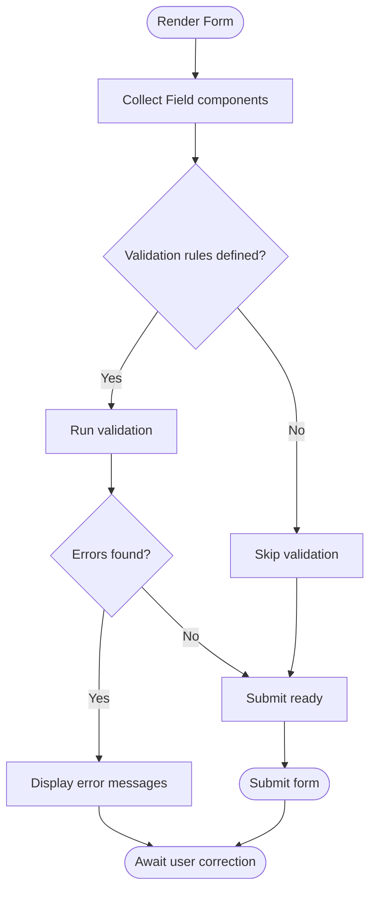
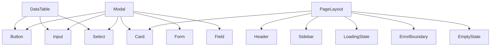

# Shared UI Components

<cite>
**Referenced Files in This Document**
- [frontend/src/components/ui/index.ts](file://frontend/src/components/ui/index.ts)
- [frontend/src/components/ui/Button/Button.tsx](file://frontend/src/components/ui/Button/Button.tsx)
- [frontend/src/components/ui/Input/Input.tsx](file://frontend/src/components/ui/Input/Input.tsx)
- [frontend/src/components/ui/Select/Select.tsx](file://frontend/src/components/ui/Select/Select.tsx)
- [frontend/src/components/ui/Card/Card.tsx](file://frontend/src/components/ui/Card/Card.tsx)
- [frontend/src/components/ui/DataTable/DataTable.tsx](file://frontend/src/components/ui/DataTable/DataTable.tsx)
- [frontend/src/components/ui/Modal/Modal.tsx](file://frontend/src/components/ui/Modal/Modal.tsx)
- [frontend/src/components/ui/Form/Form.tsx](file://frontend/src/components/ui/Form/Form.tsx)
- [frontend/src/components/ui/Form/Field.tsx](file://frontend/src/components/ui/Form/Field.tsx)
- [frontend/src/components/ui/Feedback/LoadingState.tsx](file://frontend/src/components/ui/Feedback/LoadingState.tsx)
- [frontend/src/components/ui/Feedback/ErrorBoundary.tsx](file://frontend/src/components/ui/Feedback/ErrorBoundary.tsx)
- [frontend/src/components/ui/Feedback/EmptyState.tsx](file://frontend/src/components/ui/Feedback/EmptyState.tsx)
- [frontend/src/components/ui/Layout/Header.tsx](file://frontend/src/components/ui/Layout/Header.tsx)
- [frontend/src/components/ui/Layout/Sidebar.tsx](file://frontend/src/components/ui/Layout/Sidebar.tsx)
- [frontend/src/components/ui/Layout/PageLayout.tsx](file://frontend/src/components/ui/Layout/PageLayout.tsx)
</cite>

## Table of Contents
1. [Introduction](#introduction)
2. [Project Structure](#project-structure)
3. [Core Components](#core-components)
4. [Architecture Overview](#architecture-overview)
5. [Detailed Component Analysis](#detailed-component-analysis)
6. [Dependency Analysis](#dependency-analysis)
7. [Performance Considerations](#performance-considerations)
8. [Troubleshooting Guide](#troubleshooting-guide)
9. [Conclusion](#conclusion)
10. [Appendices](#appendices)

## Introduction
This document provides comprehensive documentation for the shared UI component library used across the application. It covers reusable components, their props interfaces, customization options using Tailwind CSS, accessibility features, usage examples, composition patterns, and integration guidelines. It also documents feedback components (LoadingState, ErrorBoundary, EmptyState) and layout components (Header, Sidebar, PageLayout), along with responsive design considerations and cross-browser compatibility guidance.

## Project Structure
The shared UI components are organized under a feature-based structure within the frontend package:
- components/ui: Core primitive and composite UI components
  - Button, Input, Select, Card, DataTable, Modal
  - Form and Field for form building blocks
  - Feedback: LoadingState, ErrorBoundary, EmptyState
  - Layout: Header, Sidebar, PageLayout
- Each component is typically implemented as a single file with its own TypeScript types and Tailwind CSS styling.

[No sources needed since this diagram shows conceptual workflow, not actual code structure]

## Core Components
This section summarizes the core primitives and composites available in the UI library. For each component, we describe purpose, key props, customization via Tailwind CSS, and accessibility notes.

- Button
  - Purpose: Primary interactive element for actions.
  - Key props: variant (primary, secondary, ghost, danger), size (sm, md, lg), disabled, loading, icon, onClick.
  - Customization: Use className to override styles; supports color variants and sizes via Tailwind classes.
  - Accessibility: Focusable, keyboard navigable, aria-disabled when disabled, role="button" semantics by default.

- Input
  - Purpose: Text input field with validation support.
  - Key props: id, name, value, onChange, placeholder, type, disabled, error, helperText, required, maxLength, autoComplete.
  - Customization: className overrides; supports focus rings and error states via Tailwind utilities.
  - Accessibility: Associated label via htmlFor/id, aria-invalid on error, aria-describedby for helperText.

- Select
  - Purpose: Dropdown selection with options.
  - Key props: id, name, value, onChange, options, placeholder, disabled, error, helperText, required, multiple.
  - Customization: className overrides; consistent focus and error styling.
  - Accessibility: Label association, aria-invalid on error, keyboard navigation for options.

- Card
  - Purpose: Container for grouping related content.
  - Key props: title, subtitle, actions, padding, shadow, rounded, className.
  - Customization: Tailwind spacing and shadows; flexible header/body/footer composition.
  - Accessibility: Semantic divs; optional role="region" with aria-labelledby for titled cards.

- DataTable
  - Purpose: Tabular data display with sorting, filtering, pagination, and row selection.
  - Key props: columns, data, pageSize, currentPage, sortable, filterable, selectable, loading, emptyMessage, onSortChange, onFilterChange, onPageChange, onRowClick, rowKey.
  - Customization: Column renderers, cell formatting, header actions, toolbar slots.
  - Accessibility: aria-sort on sortable headers, aria-selected on rows, keyboard navigation, screen reader labels.

- Modal
  - Purpose: Overlay dialog for focused interactions.
  - Key props: isOpen, onClose, title, size, closeOnOverlayClick, closeOnEsc, children, footerActions.
  - Customization: Size variants (sm, md, lg, xl), padding, backdrop opacity via Tailwind.
  - Accessibility: Focus trap, aria-modal, role="dialog", aria-labelledby, escape key handling.

- Form and Field
  - Purpose: Declarative form composition with validation and state management.
  - Key props (Form): onSubmit, validate, children, className.
  - Key props (Field): name, label, component (Input/Select/etc.), rules, error, helperText, className.
  - Customization: Slot-based rendering for custom inputs; consistent error and helper text styling.
  - Accessibility: Labels linked to inputs, error messages associated via aria-describedby.

- Feedback Components
  - LoadingState: Displays spinner or skeleton while data loads. Props: message, size, fullScreen.
  - ErrorBoundary: Catches rendering errors and displays fallback UI. Props: fallback, onError.
  - EmptyState: Shows friendly messaging when no data is present. Props: title, description, action.

- Layout Components
  - Header: Top navigation bar with branding and actions. Props: logo, actions, collapsed.
  - Sidebar: Navigation sidebar with menu items. Props: items, collapsed, onToggle, activeItem.
  - PageLayout: Shell combining Header, Sidebar, and main content area. Props: header, sidebar, content, stickyHeader.

**Section sources**
- [frontend/src/components/ui/Button/Button.tsx](file://frontend/src/components/ui/Button/Button.tsx)
- [frontend/src/components/ui/Input/Input.tsx](file://frontend/src/components/ui/Input/Input.tsx)
- [frontend/src/components/ui/Select/Select.tsx](file://frontend/src/components/ui/Select/Select.tsx)
- [frontend/src/components/ui/Card/Card.tsx](file://frontend/src/components/ui/Card/Card.tsx)
- [frontend/src/components/ui/DataTable/DataTable.tsx](file://frontend/src/components/ui/DataTable/DataTable.tsx)
- [frontend/src/components/ui/Modal/Modal.tsx](file://frontend/src/components/ui/Modal/Modal.tsx)
- [frontend/src/components/ui/Form/Form.tsx](file://frontend/src/components/ui/Form/Form.tsx)
- [frontend/src/components/ui/Form/Field.tsx](file://frontend/src/components/ui/Form/Field.tsx)
- [frontend/src/components/ui/Feedback/LoadingState.tsx](file://frontend/src/components/ui/Feedback/LoadingState.tsx)
- [frontend/src/components/ui/Feedback/ErrorBoundary.tsx](file://frontend/src/components/ui/Feedback/ErrorBoundary.tsx)
- [frontend/src/components/ui/Feedback/EmptyState.tsx](file://frontend/src/components/ui/Feedback/EmptyState.tsx)
- [frontend/src/components/ui/Layout/Header.tsx](file://frontend/src/components/ui/Layout/Header.tsx)
- [frontend/src/components/ui/Layout/Sidebar.tsx](file://frontend/src/components/ui/Layout/Sidebar.tsx)
- [frontend/src/components/ui/Layout/PageLayout.tsx](file://frontend/src/components/ui/Layout/PageLayout.tsx)

## Architecture Overview
The UI library follows a layered architecture:
- Primitives: Button, Input, Select, Card
- Composite: DataTable, Modal, Form, Field
- Feedback: LoadingState, ErrorBoundary, EmptyState
- Layout: Header, Sidebar, PageLayout

Primitives compose into higher-level components. Layout components orchestrate overall page structure. Feedback components provide global UX signals.

**Diagram sources**
- [frontend/src/components/ui/Button/Button.tsx](file://frontend/src/components/ui/Button/Button.tsx)
- [frontend/src/components/ui/Input/Input.tsx](file://frontend/src/components/ui/Input/Input.tsx)
- [frontend/src/components/ui/Select/Select.tsx](file://frontend/src/components/ui/Select/Select.tsx)
- [frontend/src/components/ui/Card/Card.tsx](file://frontend/src/components/ui/Card/Card.tsx)
- [frontend/src/components/ui/DataTable/DataTable.tsx](file://frontend/src/components/ui/DataTable/DataTable.tsx)
- [frontend/src/components/ui/Modal/Modal.tsx](file://frontend/src/components/ui/Modal/Modal.tsx)
- [frontend/src/components/ui/Form/Form.tsx](file://frontend/src/components/ui/Form/Form.tsx)
- [frontend/src/components/ui/Form/Field.tsx](file://frontend/src/components/ui/Form/Field.tsx)
- [frontend/src/components/ui/Feedback/LoadingState.tsx](file://frontend/src/components/ui/Feedback/LoadingState.tsx)
- [frontend/src/components/ui/Feedback/ErrorBoundary.tsx](file://frontend/src/components/ui/Feedback/ErrorBoundary.tsx)
- [frontend/src/components/ui/Feedback/EmptyState.tsx](file://frontend/src/components/ui/Feedback/EmptyState.tsx)
- [frontend/src/components/ui/Layout/Header.tsx](file://frontend/src/components/ui/Layout/Header.tsx)
- [frontend/src/components/ui/Layout/Sidebar.tsx](file://frontend/src/components/ui/Layout/Sidebar.tsx)
- [frontend/src/components/ui/Layout/PageLayout.tsx](file://frontend/src/components/ui/Layout/PageLayout.tsx)

## Detailed Component Analysis

### Button
- Props interface: variant, size, disabled, loading, icon, onClick, className.
- Styling: Tailwind classes for colors, spacing, and focus rings; className allows overrides.
- Accessibility: Keyboard support, aria-disabled, semantic button element.
- Usage example: Render primary action with loading indicator and icon.

**Section sources**
- [frontend/src/components/ui/Button/Button.tsx](file://frontend/src/components/ui/Button/Button.tsx)

### Input
- Props interface: id, name, value, onChange, placeholder, type, disabled, error, helperText, required, maxLength, autoComplete, className.
- Styling: Focus ring, error border, helper text alignment via Tailwind.
- Accessibility: htmlFor/id pairing, aria-invalid, aria-describedby.
- Usage example: Controlled input with validation and helper text.

**Section sources**
- [frontend/src/components/ui/Input/Input.tsx](file://frontend/src/components/ui/Input/Input.tsx)

### Select
- Props interface: id, name, value, onChange, options, placeholder, disabled, error, helperText, required, multiple, className.
- Styling: Consistent dropdown styling, focus and error states.
- Accessibility: Label association, keyboard navigation, aria-invalid.
- Usage example: Single/multiple selection with option groups.

**Section sources**
- [frontend/src/components/ui/Select/Select.tsx](file://frontend/src/components/ui/Select/Select.tsx)

### Card
- Props interface: title, subtitle, actions, padding, shadow, rounded, className.
- Styling: Padding scales, shadow depth, rounded corners via Tailwind.
- Accessibility: Optional region role with aria-labelledby for titled cards.
- Usage example: Grouped content with header and actions.

**Section sources**
- [frontend/src/components/ui/Card/Card.tsx](file://frontend/src/components/ui/Card/Card.tsx)

### DataTable
- Props interface: columns, data, pageSize, currentPage, sortable, filterable, selectable, loading, emptyMessage, onSortChange, onFilterChange, onPageChange, onRowClick, rowKey, className.
- Styling: Responsive table layout, hover states, selected row highlighting.
- Accessibility: aria-sort, aria-selected, keyboard navigation, screen reader labels.
- Usage example: Paginated, sortable, filterable table with row selection.

**Diagram sources**
- [frontend/src/components/ui/DataTable/DataTable.tsx](file://frontend/src/components/ui/DataTable/DataTable.tsx)

**Section sources**
- [frontend/src/components/ui/DataTable/DataTable.tsx](file://frontend/src/components/ui/DataTable/DataTable.tsx)

### Modal
- Props interface: isOpen, onClose, title, size, closeOnOverlayClick, closeOnEsc, children, footerActions, className.
- Styling: Backdrop overlay, size variants, padding, rounded corners.
- Accessibility: Focus trap, aria-modal, role="dialog", aria-labelledby, Escape key handling.
- Usage example: Confirmation dialog with primary and secondary actions.

**Diagram sources**
- [frontend/src/components/ui/Modal/Modal.tsx](file://frontend/src/components/ui/Modal/Modal.tsx)

**Section sources**
- [frontend/src/components/ui/Modal/Modal.tsx](file://frontend/src/components/ui/Modal/Modal.tsx)

### Form and Field
- Form props: onSubmit, validate, children, className.
- Field props: name, label, component, rules, error, helperText, className.
- Styling: Consistent label/input/error layout via Tailwind.
- Accessibility: Labels linked to inputs, error messages associated via aria-describedby.
- Usage example: Compose Field(Input) and Field(Select) inside Form with validation rules.

**Diagram sources**
- [frontend/src/components/ui/Form/Form.tsx](file://frontend/src/components/ui/Form/Form.tsx)
- [frontend/src/components/ui/Form/Field.tsx](file://frontend/src/components/ui/Form/Field.tsx)

**Section sources**
- [frontend/src/components/ui/Form/Form.tsx](file://frontend/src/components/ui/Form/Form.tsx)
- [frontend/src/components/ui/Form/Field.tsx](file://frontend/src/components/ui/Form/Field.tsx)

### Feedback Components
- LoadingState
  - Props: message, size, fullScreen.
  - Styling: Spinner/skeleton variants, centered layout.
  - Accessibility: aria-live for dynamic updates.
- ErrorBoundary
  - Props: fallback, onError.
  - Styling: Fallback UI container.
  - Accessibility: Error message exposed to assistive tech.
- EmptyState
  - Props: title, description, action.
  - Styling: Friendly illustration and call-to-action.
  - Accessibility: Semantic headings and links.

**Section sources**
- [frontend/src/components/ui/Feedback/LoadingState.tsx](file://frontend/src/components/ui/Feedback/LoadingState.tsx)
- [frontend/src/components/ui/Feedback/ErrorBoundary.tsx](file://frontend/src/components/ui/Feedback/ErrorBoundary.tsx)
- [frontend/src/components/ui/Feedback/EmptyState.tsx](file://frontend/src/components/ui/Feedback/EmptyState.tsx)

### Layout Components
- Header
  - Props: logo, actions, collapsed.
  - Styling: Sticky top, brand area, action buttons.
  - Accessibility: Landmark roles, keyboard shortcuts.
- Sidebar
  - Props: items, collapsed, onToggle, activeItem.
  - Styling: Collapsible navigation, hover/focus states.
  - Accessibility: Navigation landmark, aria-current for active item.
- PageLayout
  - Props: header, sidebar, content, stickyHeader.
  - Styling: Grid layout, responsive stacking.
  - Accessibility: Proper landmark regions, focus management.

**Section sources**
- [frontend/src/components/ui/Layout/Header.tsx](file://frontend/src/components/ui/Layout/Header.tsx)
- [frontend/src/components/ui/Layout/Sidebar.tsx](file://frontend/src/components/ui/Layout/Sidebar.tsx)
- [frontend/src/components/ui/Layout/PageLayout.tsx](file://frontend/src/components/ui/Layout/PageLayout.tsx)

## Dependency Analysis
The UI library exhibits clear dependency relationships:
- Primitives (Button, Input, Select, Card) are independent.
- Composite components (DataTable, Modal, Form, Field) depend on primitives.
- Feedback components are standalone but often composed by layout shells.
- Layout components orchestrate primitives and composites to build pages.

**Diagram sources**
- [frontend/src/components/ui/Button/Button.tsx](file://frontend/src/components/ui/Button/Button.tsx)
- [frontend/src/components/ui/Input/Input.tsx](file://frontend/src/components/ui/Input/Input.tsx)
- [frontend/src/components/ui/Select/Select.tsx](file://frontend/src/components/ui/Select/Select.tsx)
- [frontend/src/components/ui/Card/Card.tsx](file://frontend/src/components/ui/Card/Card.tsx)
- [frontend/src/components/ui/DataTable/DataTable.tsx](file://frontend/src/components/ui/DataTable/DataTable.tsx)
- [frontend/src/components/ui/Modal/Modal.tsx](file://frontend/src/components/ui/Modal/Modal.tsx)
- [frontend/src/components/ui/Form/Form.tsx](file://frontend/src/components/ui/Form/Form.tsx)
- [frontend/src/components/ui/Form/Field.tsx](file://frontend/src/components/ui/Form/Field.tsx)
- [frontend/src/components/ui/Feedback/LoadingState.tsx](file://frontend/src/components/ui/Feedback/LoadingState.tsx)
- [frontend/src/components/ui/Feedback/ErrorBoundary.tsx](file://frontend/src/components/ui/Feedback/ErrorBoundary.tsx)
- [frontend/src/components/ui/Feedback/EmptyState.tsx](file://frontend/src/components/ui/Feedback/EmptyState.tsx)
- [frontend/src/components/ui/Layout/Header.tsx](file://frontend/src/components/ui/Layout/Header.tsx)
- [frontend/src/components/ui/Layout/Sidebar.tsx](file://frontend/src/components/ui/Layout/Sidebar.tsx)
- [frontend/src/components/ui/Layout/PageLayout.tsx](file://frontend/src/components/ui/Layout/PageLayout.tsx)

**Section sources**
- [frontend/src/components/ui/index.ts](file://frontend/src/components/ui/index.ts)

## Performance Considerations
- Virtualization: For large datasets in DataTable, consider virtualized rows to reduce DOM overhead.
- Memoization: Wrap expensive computations in React.memo where appropriate to avoid re-renders.
- Lazy Loading: Defer non-critical modal content until opened.
- CSS Optimization: Leverage Tailwind’s utility-first approach to minimize style bloat; ensure unused classes are purged in production builds.
- Event Handling: Debounce search/filter inputs in DataTable to reduce frequent re-renders.

[No sources needed since this section provides general guidance]

## Troubleshooting Guide
- Modal focus issues: Ensure focus trap is active and aria-modal is set; verify Escape key handler closes the modal.
- Form validation errors: Confirm Field components have correct name and error mapping; check aria-describedby associations.
- DataTable performance: If rendering slows, enable pagination and virtualization; debounce filters and sorts.
- LoadingState visibility: Verify loading flags are correctly toggled; use aria-live to announce state changes.
- ErrorBoundary fallback: Provide meaningful fallback UI and log errors via onError for debugging.

**Section sources**
- [frontend/src/components/ui/Feedback/ErrorBoundary.tsx](file://frontend/src/components/ui/Feedback/ErrorBoundary.tsx)
- [frontend/src/components/ui/Feedback/LoadingState.tsx](file://frontend/src/components/ui/Feedback/LoadingState.tsx)
- [frontend/src/components/ui/Feedback/EmptyState.tsx](file://frontend/src/components/ui/Feedback/EmptyState.tsx)
- [frontend/src/components/ui/Modal/Modal.tsx](file://frontend/src/components/ui/Modal/Modal.tsx)
- [frontend/src/components/ui/Form/Form.tsx](file://frontend/src/components/ui/Form/Form.tsx)
- [frontend/src/components/ui/Form/Field.tsx](file://frontend/src/components/ui/Form/Field.tsx)
- [frontend/src/components/ui/DataTable/DataTable.tsx](file://frontend/src/components/ui/DataTable/DataTable.tsx)

## Conclusion
The shared UI component library provides a cohesive set of primitives, composites, feedback, and layout components built with Tailwind CSS and designed for accessibility. By following the documented props interfaces, styling patterns, and composition strategies, teams can maintain consistency, improve usability, and scale the application effectively.

[No sources needed since this section summarizes without analyzing specific files]

## Appendices

### Integration Guidelines
- Import from the centralized index to ensure consistent exports.
- Use Tailwind classes for customization; prefer className overrides over internal prop proliferation.
- Maintain accessible markup by leveraging built-in attributes and ensuring proper label associations.
- Compose complex screens using PageLayout, wrapping content in Card and providing feedback via LoadingState/EmptyState/ErrorBoundary.

**Section sources**
- [frontend/src/components/ui/index.ts](file://frontend/src/components/ui/index.ts)

### Responsive Design Considerations
- Use Tailwind breakpoints to adapt layouts (e.g., sm/md/lg).
- Ensure DataTable columns collapse gracefully on small screens; consider horizontal scrolling or card-based layouts.
- Modal sizes should adapt to viewport; provide smaller sizes for mobile.
- Sidebar should collapse on narrow viewports; expose toggle controls.

[No sources needed since this section provides general guidance]

### Cross-Browser Compatibility
- Test focus management and keyboard interactions across browsers.
- Verify Tailwind utilities render consistently; polyfill if necessary for older browsers.
- Ensure aria attributes are supported and announced by screen readers.

[No sources needed since this section provides general guidance]