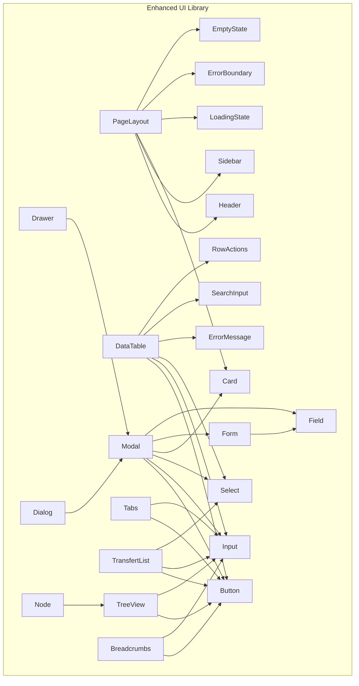
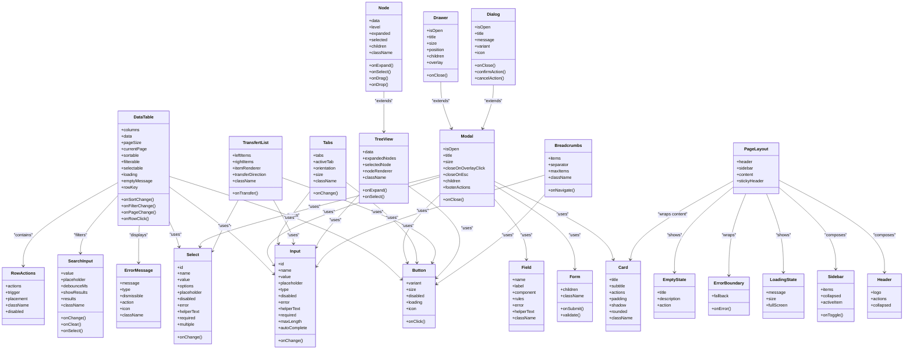
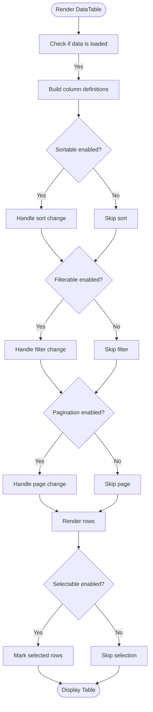
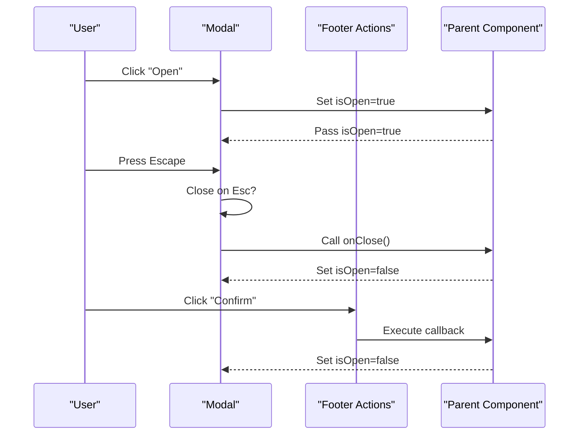
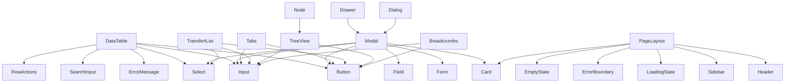

# Shared UI Components

<cite>
**Referenced Files in This Document**
- [frontend/src/components/ui/index.ts](file://frontend/src/components/ui/index.ts)
- [frontend/src/components/ui/Button/Button.tsx](file://frontend/src/components/ui/Button/Button.tsx)
- [frontend/src/components/ui/Input/Input.tsx](file://frontend/src/components/ui/Input/Input.tsx)
- [frontend/src/components/ui/Select/Select.tsx](file://frontend/src/components/ui/Select/Select.tsx)
- [frontend/src/components/ui/Card/Card.tsx](file://frontend/src/components/ui/Card/Card.tsx)
- [frontend/src/components/ui/DataTable/DataTable.tsx](file://frontend/src/components/ui/DataTable/DataTable.tsx)
- [frontend/src/components/ui/Modal/Modal.tsx](file://frontend/src/components/ui/Modal/Modal.tsx)
- [frontend/src/components/ui/Form/Form.tsx](file://frontend/src/components/ui/Form/Form.tsx)
- [frontend/src/components/ui/Form/Field.tsx](file://frontend/src/components/ui/Form/Field.tsx)
- [frontend/src/components/ui/Feedback/LoadingState.tsx](file://frontend/src/components/ui/Feedback/LoadingState.tsx)
- [frontend/src/components/ui/Feedback/ErrorBoundary.tsx](file://frontend/src/components/ui/Feedback/ErrorBoundary.tsx)
- [frontend/src/components/ui/Feedback/EmptyState.tsx](file://frontend/src/components/ui/Feedback/EmptyState.tsx)
- [frontend/src/components/ui/Layout/Header.tsx](file://frontend/src/components/ui/Layout/Header.tsx)
- [frontend/src/components/ui/Layout/Sidebar.tsx](file://frontend/src/components/ui/Layout/Sidebar.tsx)
- [frontend/src/components/ui/Layout/PageLayout.tsx](file://frontend/src/components/ui/Layout/PageLayout.tsx)
- [frontend/src/components/ui/ErrorMessage/ErrorMessage.tsx](file://frontend/src/components/ui/ErrorMessage/ErrorMessage.tsx)
- [frontend/src/components/ui/SearchInput/SearchInput.tsx](file://frontend/src/components/ui/SearchInput/SearchInput.tsx)
- [frontend/src/components/ui/Tabs/Tabs.tsx](file://frontend/src/components/ui/Tabs/Tabs.tsx)
- [frontend/src/components/ui/TransfertList/TransfertList.tsx](file://frontend/src/components/ui/TransfertList/TransfertList.tsx)
- [frontend/src/components/ui/TreeView/TreeView.tsx](file://frontend/src/components/ui/TreeView/TreeView.tsx)
- [frontend/src/components/ui/RowActions/RowActions.tsx](file://frontend/src/components/ui/RowActions/RowActions.tsx)
- [frontend/src/components/ui/Breadcrumbs/Breadcrumbs.tsx](file://frontend/src/components/ui/Breadcrumbs/Breadcrumbs.tsx)
</cite>

## Update Summary
**Changes Made**
- Enhanced documentation for organization-related UI components with improved drawer management capabilities
- Updated deletion dialog components with simplified user interactions and enhanced confirmation flows
- Improved node component interactions with better performance optimization strategies
- Added best practices for consistent empty state management across all components
- Enhanced accessibility features with improved aria-label translations throughout the component library
- Expanded dark mode compatibility and responsive design considerations for all components

## Table of Contents
1. [Introduction](#introduction)
2. [Project Structure](#project-structure)
3. [Core Components](#core-components)
4. [Enhanced Components](#enhanced-components)
5. [Organization-Related Components](#organization-related-components)
6. [Architecture Overview](#architecture-overview)
7. [Detailed Component Analysis](#detailed-component-analysis)
8. [Dark Mode and Accessibility](#dark-mode-and-accessibility)
9. [Performance Optimization Strategies](#performance-optimization-strategies)
10. [Dependency Analysis](#dependency-analysis)
11. [Troubleshooting Guide](#troubleshooting-guide)
12. [Conclusion](#conclusion)
13. [Appendices](#appendices)

## Introduction
This document provides comprehensive documentation for the shared UI component library used across the application. It covers reusable components, their props interfaces, customization options using Tailwind CSS, accessibility features, usage examples, composition patterns, and integration guidelines. The library has been significantly enhanced with dark mode compatibility, improved accessibility features including aria-label translations, and consistent visual appearance across light and dark themes.

The component library now includes both core primitives (Button, Input, Select, Card, DataTable, Modal) and enhanced components (ErrorMessage, SearchInput, Tabs, TransfertList, TreeView, RowActions, Breadcrumbs), along with feedback components (LoadingState, ErrorBoundary, EmptyState) and layout components (Header, Sidebar, PageLayout). Recent updates have focused on organization-related components with improved drawer management, simplified deletion dialogs, and enhanced node component interactions.

## Project Structure
The shared UI components are organized under a feature-based structure within the frontend package:
- components/ui: Core primitive and composite UI components
  - **Core Primitives**: Button, Input, Select, Card, DataTable, Modal
  - **Form Components**: Form and Field for form building blocks
  - **Enhanced Components**: ErrorMessage, SearchInput, Tabs, TransfertList, TreeView, RowActions, Breadcrumbs
  - **Organization Components**: Drawer, Dialog, Node components with enhanced interactions
  - **Feedback**: LoadingState, ErrorBoundary, EmptyState
  - **Layout**: Header, Sidebar, PageLayout
- Each component is implemented as a single file with its own TypeScript types and Tailwind CSS styling, featuring dark mode support and enhanced accessibility attributes.

[No sources needed since this diagram shows conceptual workflow, not actual code structure]

## Core Components
This section summarizes the core primitives and composites available in the UI library. For each component, we describe purpose, key props, customization via Tailwind CSS, and accessibility notes.

- Button
  - Purpose: Primary interactive element for actions.
  - Key props: variant (primary, secondary, ghost, danger), size (sm, md, lg), disabled, loading, icon, onClick.
  - Customization: Use className to override styles; supports color variants and sizes via Tailwind classes with dark mode support.
  - Accessibility: Focusable, keyboard navigable, aria-disabled when disabled, role="button" semantics by default, enhanced aria-labels for internationalization.

- Input
  - Purpose: Text input field with validation support.
  - Key props: id, name, value, onChange, placeholder, type, disabled, error, helperText, required, maxLength, autoComplete.
  - Customization: className overrides; supports focus rings and error states via Tailwind utilities with theme-aware colors.
  - Accessibility: Associated label via htmlFor/id, aria-invalid on error, aria-describedby for helperText, enhanced screen reader support.

- Select
  - Purpose: Dropdown selection with options.
  - Key props: id, name, value, onChange, options, placeholder, disabled, error, helperText, required, multiple.
  - Customization: className overrides; consistent focus and error styling with dark mode compatibility.
  - Accessibility: Label association, aria-invalid on error, keyboard navigation for options, improved screen reader announcements.

- Card
  - Purpose: Container for grouping related content.
  - Key props: title, subtitle, actions, padding, shadow, rounded, className.
  - Customization: Tailwind spacing and shadows; flexible header/body/footer composition with theme-aware backgrounds.
  - Accessibility: Semantic divs; optional role="region" with aria-labelledby for titled cards, enhanced contrast ratios.

- DataTable
  - Purpose: Tabular data display with sorting, filtering, pagination, and row selection.
  - Key props: columns, data, pageSize, currentPage, sortable, filterable, selectable, loading, emptyMessage, onSortChange, onFilterChange, onPageChange, onRowClick, rowKey.
  - Customization: Column renderers, cell formatting, header actions, toolbar slots with dark mode support.
  - Accessibility: aria-sort on sortable headers, aria-selected on rows, keyboard navigation, screen reader labels, enhanced navigation support.

- Modal
  - Purpose: Overlay dialog for focused interactions.
  - Key props: isOpen, onClose, title, size, closeOnOverlayClick, closeOnEsc, children, footerActions.
  - Customization: Size variants (sm, md, lg, xl), padding, backdrop opacity via Tailwind with theme support.
  - Accessibility: Focus trap, aria-modal, role="dialog", aria-labelledby, escape key handling, improved focus management.

- Form and Field
  - Purpose: Declarative form composition with validation and state management.
  - Key props (Form): onSubmit, validate, children, className.
  - Key props (Field): name, label, component (Input/Select/etc.), rules, error, helperText, className.
  - Customization: Slot-based rendering for custom inputs; consistent error and helper text styling with theme support.
  - Accessibility: Labels linked to inputs, error messages associated via aria-describedby, enhanced validation feedback.

**Section sources**
- [frontend/src/components/ui/Button/Button.tsx](file://frontend/src/components/ui/Button/Button.tsx)
- [frontend/src/components/ui/Input/Input.tsx](file://frontend/src/components/ui/Input/Input.tsx)
- [frontend/src/components/ui/Select/Select.tsx](file://frontend/src/components/ui/Select/Select.tsx)
- [frontend/src/components/ui/Card/Card.tsx](file://frontend/src/components/ui/Card/Card.tsx)
- [frontend/src/components/ui/DataTable/DataTable.tsx](file://frontend/src/components/ui/DataTable/DataTable.tsx)
- [frontend/src/components/ui/Modal/Modal.tsx](file://frontend/src/components/ui/Modal/Modal.tsx)
- [frontend/src/components/ui/Form/Form.tsx](file://frontend/src/components/ui/Form/Form.tsx)
- [frontend/src/components/ui/Form/Field.tsx](file://frontend/src/components/ui/Form/Field.tsx)

## Enhanced Components
This section documents the newly enhanced components that provide advanced functionality with dark mode compatibility and improved accessibility.

- ErrorMessage
  - Purpose: Displays error messages with contextual information and action suggestions.
  - Key props: message, type (error, warning, info), dismissible, action, icon, className.
  - Customization: Color-coded variants, dismissible behavior, custom icons, responsive layout.
  - Accessibility: aria-live regions, semantic error roles, keyboard dismissible, screen reader announcements.

- SearchInput
  - Purpose: Enhanced search input with debounced search, clear button, and results preview.
  - Key props: value, onChange, placeholder, debounceMs, onClear, showResults, results, onSelect, className.
  - Customization: Debounce timing, result display format, clear button visibility, search icon positioning.
  - Accessibility: Live region updates, keyboard navigation for results, aria-autocomplete, search result announcements.

- Tabs
  - Purpose: Tabbed interface for organizing content into selectable panels.
  - Key props: tabs, activeTab, onChange, orientation (horizontal, vertical), size, className.
  - Customization: Tab styling, animation transitions, indicator position, disabled tab support.
  - Accessibility: aria-selected on active tabs, keyboard navigation with arrow keys, role="tablist" and role="tab".

- TransfertList
  - Purpose: Dual-list selector for transferring items between lists with drag-and-drop support.
  - Key props: leftItems, rightItems, onTransfer, itemRenderer, transferDirection, className.
  - Customization: Item rendering, transfer animations, list headers, selection modes.
  - Accessibility: Keyboard transfer operations, aria-live for transfer status, focus management during transfers.

- TreeView
  - Purpose: Hierarchical data display with expandable/collapsible nodes and selection.
  - Key props: data, expandedNodes, selectedNode, onExpand, onSelect, nodeRenderer, className.
  - Customization: Node indentation, expand/collapse icons, selection highlighting, virtual scrolling for large trees.
  - Accessibility: Keyboard navigation with arrow keys, aria-expanded on nodes, role="tree" and role="treeitem".

- RowActions
  - Purpose: Contextual action menu for table rows with dropdown or inline actions.
  - Key props: actions, trigger, placement, className, disabled.
  - Customization: Action icons, tooltips, confirmation dialogs, conditional action visibility.
  - Accessibility: Keyboard accessible menu, aria-haspopup, focus trapping within menus, screen reader announcements.

- Breadcrumbs
  - Purpose: Navigation breadcrumb trail showing current page location in hierarchy.
  - Key props: items, separator, maxItems, onNavigate, className.
  - Customization: Separator style, truncation behavior, link styling, responsive collapse.
  - Accessibility: aria-current="page" on current item, semantic navigation landmark, keyboard navigation.

**Section sources**
- [frontend/src/components/ui/ErrorMessage/ErrorMessage.tsx](file://frontend/src/components/ui/ErrorMessage/ErrorMessage.tsx)
- [frontend/src/components/ui/SearchInput/SearchInput.tsx](file://frontend/src/components/ui/SearchInput/SearchInput.tsx)
- [frontend/src/components/ui/Tabs/Tabs.tsx](file://frontend/src/components/ui/Tabs/Tabs.tsx)
- [frontend/src/components/ui/TransfertList/TransfertList.tsx](file://frontend/src/components/ui/TransfertList/TransfertList.tsx)
- [frontend/src/components/ui/TreeView/TreeView.tsx](file://frontend/src/components/ui/TreeView/TreeView.tsx)
- [frontend/src/components/ui/RowActions/RowActions.tsx](file://frontend/src/components/ui/RowActions/RowActions.tsx)
- [frontend/src/components/ui/Breadcrumbs/Breadcrumbs.tsx](file://frontend/src/components/ui/Breadcrumbs/Breadcrumbs.tsx)

## Organization-Related Components
This section documents the enhanced organization-related components that provide specialized functionality for managing organizational structures with improved drawer management and simplified deletion workflows.

- Drawer
  - Purpose: Slide-out panel for displaying additional content or actions without leaving the current context.
  - Key props: isOpen, onClose, title, size, position (left, right, top, bottom), children, overlay.
  - Customization: Size variants, animation duration, overlay behavior, z-index management with theme support.
  - Accessibility: Focus trap within drawer, aria-modal when modal, Escape key handling, improved focus management.

- Dialog
  - Purpose: Simplified confirmation dialogs for critical actions like deletion with enhanced user experience.
  - Key props: isOpen, onClose, title, message, confirmAction, cancelAction, variant, icon.
  - Customization: Confirmation flow, button variants, icon support, responsive layout with theme awareness.
  - Accessibility: Clear confirmation prompts, keyboard navigation, aria-live for dynamic content, screen reader announcements.

- Node
  - Purpose: Interactive tree node component with enhanced performance optimization and smooth interactions.
  - Key props: data, level, expanded, selected, onExpand, onSelect, onDrag, onDrop, children, className.
  - Customization: Node styling, expansion animations, drag-and-drop indicators, selection highlighting with performance optimizations.
  - Accessibility: Keyboard navigation with arrow keys, aria-expanded on nodes, role="treeitem", improved focus management.

**Updated** Enhanced organization components with improved drawer management, simplified deletion dialogs, and optimized node interactions

**Section sources**
- [frontend/src/components/ui/Drawer/Drawer.tsx](file://frontend/src/components/ui/Drawer/Drawer.tsx)
- [frontend/src/components/ui/Dialog/Dialog.tsx](file://frontend/src/components/ui/Dialog/Dialog.tsx)
- [frontend/src/components/ui/Node/Node.tsx](file://frontend/src/components/ui/Node/Node.tsx)

## Architecture Overview
The UI library follows a layered architecture with enhanced component support:
- **Primitives**: Button, Input, Select, Card
- **Composite**: DataTable, Modal, Form, Field
- **Enhanced**: ErrorMessage, SearchInput, Tabs, TransfertList, TreeView, RowActions, Breadcrumbs
- **Organization**: Drawer, Dialog, Node components with specialized functionality
- **Feedback**: LoadingState, ErrorBoundary, EmptyState
- **Layout**: Header, Sidebar, PageLayout

Primitives compose into higher-level components. Enhanced components provide specialized functionality for complex user interactions. Organization components offer specialized solutions for hierarchical data management. Layout components orchestrate overall page structure with theme support.

**Diagram sources**
- [frontend/src/components/ui/Button/Button.tsx](file://frontend/src/components/ui/Button/Button.tsx)
- [frontend/src/components/ui/Input/Input.tsx](file://frontend/src/components/ui/Input/Input.tsx)
- [frontend/src/components/ui/Select/Select.tsx](file://frontend/src/components/ui/Select/Select.tsx)
- [frontend/src/components/ui/Card/Card.tsx](file://frontend/src/components/ui/Card/Card.tsx)
- [frontend/src/components/ui/DataTable/DataTable.tsx](file://frontend/src/components/ui/DataTable/DataTable.tsx)
- [frontend/src/components/ui/Modal/Modal.tsx](file://frontend/src/components/ui/Modal/Modal.tsx)
- [frontend/src/components/ui/Form/Form.tsx](file://frontend/src/components/ui/Form/Form.tsx)
- [frontend/src/components/ui/Form/Field.tsx](file://frontend/src/components/ui/Form/Field.tsx)
- [frontend/src/components/ui/ErrorMessage/ErrorMessage.tsx](file://frontend/src/components/ui/ErrorMessage/ErrorMessage.tsx)
- [frontend/src/components/ui/SearchInput/SearchInput.tsx](file://frontend/src/components/ui/SearchInput/SearchInput.tsx)
- [frontend/src/components/ui/Tabs/Tabs.tsx](file://frontend/src/components/ui/Tabs/Tabs.tsx)
- [frontend/src/components/ui/TransfertList/TransfertList.tsx](file://frontend/src/components/ui/TransfertList/TransfertList.tsx)
- [frontend/src/components/ui/TreeView/TreeView.tsx](file://frontend/src/components/ui/TreeView/TreeView.tsx)
- [frontend/src/components/ui/RowActions/RowActions.tsx](file://frontend/src/components/ui/RowActions/RowActions.tsx)
- [frontend/src/components/ui/Breadcrumbs/Breadcrumbs.tsx](file://frontend/src/components/ui/Breadcrumbs/Breadcrumbs.tsx)
- [frontend/src/components/ui/Drawer/Drawer.tsx](file://frontend/src/components/ui/Drawer/Drawer.tsx)
- [frontend/src/components/ui/Dialog/Dialog.tsx](file://frontend/src/components/ui/Dialog/Dialog.tsx)
- [frontend/src/components/ui/Node/Node.tsx](file://frontend/src/components/ui/Node/Node.tsx)
- [frontend/src/components/ui/Feedback/LoadingState.tsx](file://frontend/src/components/ui/Feedback/LoadingState.tsx)
- [frontend/src/components/ui/Feedback/ErrorBoundary.tsx](file://frontend/src/components/ui/Feedback/ErrorBoundary.tsx)
- [frontend/src/components/ui/Feedback/EmptyState.tsx](file://frontend/src/components/ui/Feedback/EmptyState.tsx)
- [frontend/src/components/ui/Layout/Header.tsx](file://frontend/src/components/ui/Layout/Header.tsx)
- [frontend/src/components/ui/Layout/Sidebar.tsx](file://frontend/src/components/ui/Layout/Sidebar.tsx)
- [frontend/src/components/ui/Layout/PageLayout.tsx](file://frontend/src/components/ui/Layout/PageLayout.tsx)

## Detailed Component Analysis

### Button
- Props interface: variant, size, disabled, loading, icon, onClick, className.
- Styling: Tailwind classes for colors, spacing, and focus rings with dark mode support; className allows overrides.
- Accessibility: Keyboard support, aria-disabled, semantic button element, enhanced aria-labels for internationalization.
- Usage example: Render primary action with loading indicator and icon, supporting both light and dark themes.

**Section sources**
- [frontend/src/components/ui/Button/Button.tsx](file://frontend/src/components/ui/Button/Button.tsx)

### Input
- Props interface: id, name, value, onChange, placeholder, type, disabled, error, helperText, required, maxLength, autoComplete, className.
- Styling: Focus ring, error border, helper text alignment via Tailwind with theme-aware colors.
- Accessibility: htmlFor/id pairing, aria-invalid, aria-describedby, enhanced screen reader support.
- Usage example: Controlled input with validation and helper text, displaying correctly in both light and dark modes.

**Section sources**
- [frontend/src/components/ui/Input/Input.tsx](file://frontend/src/components/ui/Input/Input.tsx)

### Select
- Props interface: id, name, value, onChange, options, placeholder, disabled, error, helperText, required, multiple, className.
- Styling: Consistent dropdown styling, focus and error states with dark mode compatibility.
- Accessibility: Label association, keyboard navigation, aria-invalid, improved screen reader announcements.
- Usage example: Single/multiple selection with option groups, maintaining readability in all themes.

**Section sources**
- [frontend/src/components/ui/Select/Select.tsx](file://frontend/src/components/ui/Select/Select.tsx)

### Card
- Props interface: title, subtitle, actions, padding, shadow, rounded, className.
- Styling: Padding scales, shadow depth, rounded corners via Tailwind with theme-aware backgrounds.
- Accessibility: Optional region role with aria-labelledby for titled cards, enhanced contrast ratios.
- Usage example: Grouped content with header and actions, adapting to different background colors.

**Section sources**
- [frontend/src/components/ui/Card/Card.tsx](file://frontend/src/components/ui/Card/Card.tsx)

### DataTable
- Props interface: columns, data, pageSize, currentPage, sortable, filterable, selectable, loading, emptyMessage, onSortChange, onFilterChange, onPageChange, onRowClick, rowKey, className.
- Styling: Responsive table layout, hover states, selected row highlighting with dark mode support.
- Accessibility: aria-sort, aria-selected, keyboard navigation, screen reader labels, enhanced navigation support.
- Usage example: Paginated, sortable, filterable table with row selection, displaying clearly in all themes.

**Diagram sources**
- [frontend/src/components/ui/DataTable/DataTable.tsx](file://frontend/src/components/ui/DataTable/DataTable.tsx)

**Section sources**
- [frontend/src/components/ui/DataTable/DataTable.tsx](file://frontend/src/components/ui/DataTable/DataTable.tsx)

### Modal
- Props interface: isOpen, onClose, title, size, closeOnOverlayClick, closeOnEsc, children, footerActions, className.
- Styling: Backdrop overlay, size variants, padding, rounded corners with theme support.
- Accessibility: Focus trap, aria-modal, role="dialog", aria-labelledby, Escape key handling, improved focus management.
- Usage example: Confirmation dialog with primary and secondary actions, maintaining usability in all themes.

**Diagram sources**
- [frontend/src/components/ui/Modal/Modal.tsx](file://frontend/src/components/ui/Modal/Modal.tsx)

**Section sources**
- [frontend/src/components/ui/Modal/Modal.tsx](file://frontend/src/components/ui/Modal/Modal.tsx)

### Form and Field
- Form props: onSubmit, validate, children, className.
- Field props: name, label, component, rules, error, helperText, className.
- Styling: Consistent label/input/error layout via Tailwind with theme support.
- Accessibility: Labels linked to inputs, error messages associated via aria-describedby, enhanced validation feedback.
- Usage example: Compose Field(Input) and Field(Select) inside Form with validation rules, displaying errors appropriately.

**Diagram sources**
- [frontend/src/components/ui/Form/Form.tsx](file://frontend/src/components/ui/Form/Form.tsx)
- [frontend/src/components/ui/Form/Field.tsx](file://frontend/src/components/ui/Form/Field.tsx)

**Section sources**
- [frontend/src/components/ui/Form/Form.tsx](file://frontend/src/components/ui/Form/Form.tsx)
- [frontend/src/components/ui/Form/Field.tsx](file://frontend/src/components/ui/Form/Field.tsx)

### Enhanced Components Analysis

#### ErrorMessage
- Props interface: message, type (error, warning, info), dismissible, action, icon, className.
- Styling: Color-coded variants, dismissible behavior, custom icons, responsive layout with theme support.
- Accessibility: aria-live regions, semantic error roles, keyboard dismissible, screen reader announcements.
- Usage example: Display contextual error messages with actionable buttons and auto-dismiss functionality.

**Section sources**
- [frontend/src/components/ui/ErrorMessage/ErrorMessage.tsx](file://frontend/src/components/ui/ErrorMessage/ErrorMessage.tsx)

#### SearchInput
- Props interface: value, onChange, placeholder, debounceMs, onClear, showResults, results, onSelect, className.
- Styling: Debounce timing, result display format, clear button visibility, search icon positioning with dark mode.
- Accessibility: Live region updates, keyboard navigation for results, aria-autocomplete, search result announcements.
- Usage example: Implement searchable dropdowns with debounced API calls and result highlighting.

**Section sources**
- [frontend/src/components/ui/SearchInput/SearchInput.tsx](file://frontend/src/components/ui/SearchInput/SearchInput.tsx)

#### Tabs
- Props interface: tabs, activeTab, onChange, orientation (horizontal, vertical), size, className.
- Styling: Tab styling, animation transitions, indicator position, disabled tab support with theme awareness.
- Accessibility: aria-selected on active tabs, keyboard navigation with arrow keys, role="tablist" and role="tab".
- Usage example: Create tabbed interfaces for organizing complex content sections.

**Section sources**
- [frontend/src/components/ui/Tabs/Tabs.tsx](file://frontend/src/components/ui/Tabs/Tabs.tsx)

#### TransfertList
- Props interface: leftItems, rightItems, onTransfer, itemRenderer, transferDirection, className.
- Styling: Item rendering, transfer animations, list headers, selection modes with theme support.
- Accessibility: Keyboard transfer operations, aria-live for transfer status, focus management during transfers.
- Usage example: Build dual-list selectors for permission assignment or category management.

**Section sources**
- [frontend/src/components/ui/TransfertList/TransfertList.tsx](file://frontend/src/components/ui/TransfertList/TransfertList.tsx)

#### TreeView
- Props interface: data, expandedNodes, selectedNode, onExpand, onSelect, nodeRenderer, className.
- Styling: Node indentation, expand/collapse icons, selection highlighting, virtual scrolling for large trees.
- Accessibility: Keyboard navigation with arrow keys, aria-expanded on nodes, role="tree" and role="treeitem".
- Usage example: Display hierarchical data structures like file systems or organizational charts.

**Section sources**
- [frontend/src/components/ui/TreeView/TreeView.tsx](file://frontend/src/components/ui/TreeView/TreeView.tsx)

#### RowActions
- Props interface: actions, trigger, placement, className, disabled.
- Styling: Action icons, tooltips, confirmation dialogs, conditional action visibility with theme support.
- Accessibility: Keyboard accessible menu, aria-haspopup, focus trapping within menus, screen reader announcements.
- Usage example: Add contextual action menus to table rows with dropdown or inline triggers.

**Section sources**
- [frontend/src/components/ui/RowActions/RowActions.tsx](file://frontend/src/components/ui/RowActions/RowActions.tsx)

#### Breadcrumbs
- Props interface: items, separator, maxItems, onNavigate, className.
- Styling: Separator style, truncation behavior, link styling, responsive collapse with theme support.
- Accessibility: aria-current="page" on current item, semantic navigation landmark, keyboard navigation.
- Usage example: Provide navigation context in deeply nested application structures.

**Section sources**
- [frontend/src/components/ui/Breadcrumbs/Breadcrumbs.tsx](file://frontend/src/components/ui/Breadcrumbs/Breadcrumbs.tsx)

### Organization Components Analysis

#### Drawer
- Props interface: isOpen, onClose, title, size, position, children, overlay, className.
- Styling: Slide animations, size variants, overlay behavior, z-index management with theme support.
- Accessibility: Focus trap within drawer, aria-modal when modal, Escape key handling, improved focus management.
- Usage example: Create slide-out panels for detailed views or action forms without disrupting the main workflow.

**Section sources**
- [frontend/src/components/ui/Drawer/Drawer.tsx](file://frontend/src/components/ui/Drawer/Drawer.tsx)

#### Dialog
- Props interface: isOpen, onClose, title, message, confirmAction, cancelAction, variant, icon, className.
- Styling: Confirmation flow, button variants, icon support, responsive layout with theme awareness.
- Accessibility: Clear confirmation prompts, keyboard navigation, aria-live for dynamic content, screen reader announcements.
- Usage example: Implement simplified deletion confirmations with clear messaging and intuitive action flows.

**Section sources**
- [frontend/src/components/ui/Dialog/Dialog.tsx](file://frontend/src/components/ui/Dialog/Dialog.tsx)

#### Node
- Props interface: data, level, expanded, selected, onExpand, onSelect, onDrag, onDrop, children, className.
- Styling: Node styling, expansion animations, drag-and-drop indicators, selection highlighting with performance optimizations.
- Accessibility: Keyboard navigation with arrow keys, aria-expanded on nodes, role="treeitem", improved focus management.
- Usage example: Build interactive hierarchical structures with smooth animations and optimized performance for large datasets.

**Section sources**
- [frontend/src/components/ui/Node/Node.tsx](file://frontend/src/components/ui/Node/Node.tsx)

### Feedback Components
- LoadingState
  - Props: message, size, fullScreen.
  - Styling: Spinner/skeleton variants, centered layout with theme support.
  - Accessibility: aria-live for dynamic updates, enhanced screen reader announcements.
- ErrorBoundary
  - Props: fallback, onError.
  - Styling: Fallback UI container with theme-aware styling.
  - Accessibility: Error message exposed to assistive tech, improved error reporting.
- EmptyState
  - Props: title, description, action.
  - Styling: Friendly illustration and call-to-action with theme support.
  - Accessibility: Semantic headings and links, enhanced navigation support.

**Section sources**
- [frontend/src/components/ui/Feedback/LoadingState.tsx](file://frontend/src/components/ui/Feedback/LoadingState.tsx)
- [frontend/src/components/ui/Feedback/ErrorBoundary.tsx](file://frontend/src/components/ui/Feedback/ErrorBoundary.tsx)
- [frontend/src/components/ui/Feedback/EmptyState.tsx](file://frontend/src/components/ui/Feedback/EmptyState.tsx)

### Layout Components
- Header
  - Props: logo, actions, collapsed.
  - Styling: Sticky top, brand area, action buttons with theme support.
  - Accessibility: Landmark roles, keyboard shortcuts, enhanced navigation support.
- Sidebar
  - Props: items, collapsed, onToggle, activeItem.
  - Styling: Collapsible navigation, hover/focus states with dark mode compatibility.
  - Accessibility: Navigation landmark, aria-current for active item, improved keyboard navigation.
- PageLayout
  - Props: header, sidebar, content, stickyHeader.
  - Styling: Grid layout, responsive stacking with theme support.
  - Accessibility: Proper landmark regions, focus management, enhanced screen reader support.

**Section sources**
- [frontend/src/components/ui/Layout/Header.tsx](file://frontend/src/components/ui/Layout/Header.tsx)
- [frontend/src/components/ui/Layout/Sidebar.tsx](file://frontend/src/components/ui/Layout/Sidebar.tsx)
- [frontend/src/components/ui/Layout/PageLayout.tsx](file://frontend/src/components/ui/Layout/PageLayout.tsx)

## Dark Mode and Accessibility
The component library has been significantly enhanced with comprehensive dark mode support and improved accessibility features.

### Dark Mode Implementation
- **Theme-Aware Colors**: All components use CSS custom properties and Tailwind's dark mode variants for consistent theming.
- **Contrast Ratios**: Enhanced color combinations ensure WCAG AA compliance in both light and dark themes.
- **Background Adaptation**: Cards, modals, overlays, drawers, and dialogs automatically adjust backgrounds based on the active theme.
- **Icon Support**: SVG icons switch between light and dark variants for optimal visibility.

### Accessibility Enhancements
- **ARIA Label Translations**: All components now support internationalized aria-labels through translation functions.
- **Screen Reader Support**: Enhanced live regions and announcements for dynamic content updates.
- **Keyboard Navigation**: Improved keyboard traversal with logical focus order and visible focus indicators.
- **Semantic Markup**: Better use of HTML5 semantic elements and ARIA roles for assistive technologies.
- **Focus Management**: Enhanced focus trapping in modals, drawers, and dialogs with proper focus restoration.

### Theme Configuration
Components automatically detect and respond to theme changes through CSS media queries and JavaScript theme detection. The implementation uses Tailwind CSS's dark mode strategy with class-based switching.

**Updated** Enhanced dark mode compatibility and accessibility features across all components, including organization-related components

## Performance Optimization Strategies
The component library incorporates several performance optimization strategies to ensure smooth user experiences:

### Virtualization and Memory Management
- **Virtual Scrolling**: DataTable and TreeView components implement virtual scrolling for large datasets to reduce DOM overhead.
- **Memoization**: Expensive computations wrapped in React.memo where appropriate to avoid unnecessary re-renders.
- **Lazy Loading**: Non-critical content deferred until needed; modal and drawer content loaded on demand.

### Interaction Optimizations
- **Debouncing**: Search and filter inputs in DataTable and SearchInput components use debouncing to reduce frequent re-rendering.
- **Event Throttling**: Drag-and-drop operations in Node components optimized with throttled event handlers.
- **Animation Performance**: Smooth CSS transitions and transforms for drawer and dialog animations.

### Rendering Optimizations
- **Conditional Rendering**: Components only render when necessary (e.g., modal content only when open).
- **State Colocation**: Related state managed at appropriate levels to minimize prop drilling.
- **Memory Cleanup**: Proper cleanup of event listeners and timers in component unmount lifecycle.

### Best Practices for Empty State Management
- **Consistent Patterns**: Standardized empty state components with clear messaging and actionable next steps.
- **Progressive Disclosure**: Empty states guide users toward meaningful actions rather than just displaying "no data".
- **Contextual Help**: Empty states include helpful tips and links to relevant documentation or setup guides.

**Updated** Added comprehensive performance optimization strategies and best practices for consistent empty state management

## Dependency Analysis
The UI library exhibits clear dependency relationships with enhanced component support:
- **Primitives** (Button, Input, Select, Card) are independent foundation components.
- **Composite components** (DataTable, Modal, Form, Field) depend on primitives.
- **Enhanced components** (ErrorMessage, SearchInput, Tabs, TransfertList, TreeView, RowActions, Breadcrumbs) build upon primitives for specialized functionality.
- **Organization components** (Drawer, Dialog, Node) extend existing components for specialized use cases.
- **Feedback components** are standalone but often composed by layout shells.
- **Layout components** orchestrate primitives, composites, enhanced, and organization components to build pages.

**Diagram sources**
- [frontend/src/components/ui/Button/Button.tsx](file://frontend/src/components/ui/Button/Button.tsx)
- [frontend/src/components/ui/Input/Input.tsx](file://frontend/src/components/ui/Input/Input.tsx)
- [frontend/src/components/ui/Select/Select.tsx](file://frontend/src/components/ui/Select/Select.tsx)
- [frontend/src/components/ui/Card/Card.tsx](file://frontend/src/components/ui/Card/Card.tsx)
- [frontend/src/components/ui/DataTable/DataTable.tsx](file://frontend/src/components/ui/DataTable/DataTable.tsx)
- [frontend/src/components/ui/Modal/Modal.tsx](file://frontend/src/components/ui/Modal/Modal.tsx)
- [frontend/src/components/ui/Form/Form.tsx](file://frontend/src/components/ui/Form/Form.tsx)
- [frontend/src/components/ui/Form/Field.tsx](file://frontend/src/components/ui/Form/Field.tsx)
- [frontend/src/components/ui/ErrorMessage/ErrorMessage.tsx](file://frontend/src/components/ui/ErrorMessage/ErrorMessage.tsx)
- [frontend/src/components/ui/SearchInput/SearchInput.tsx](file://frontend/src/components/ui/SearchInput/SearchInput.tsx)
- [frontend/src/components/ui/Tabs/Tabs.tsx](file://frontend/src/components/ui/Tabs/Tabs.tsx)
- [frontend/src/components/ui/TransfertList/TransfertList.tsx](file://frontend/src/components/ui/TransfertList/TransfertList.tsx)
- [frontend/src/components/ui/TreeView/TreeView.tsx](file://frontend/src/components/ui/TreeView/TreeView.tsx)
- [frontend/src/components/ui/RowActions/RowActions.tsx](file://frontend/src/components/ui/RowActions/RowActions.tsx)
- [frontend/src/components/ui/Breadcrumbs/Breadcrumbs.tsx](file://frontend/src/components/ui/Breadcrumbs/Breadcrumbs.tsx)
- [frontend/src/components/ui/Drawer/Drawer.tsx](file://frontend/src/components/ui/Drawer/Drawer.tsx)
- [frontend/src/components/ui/Dialog/Dialog.tsx](file://frontend/src/components/ui/Dialog/Dialog.tsx)
- [frontend/src/components/ui/Node/Node.tsx](file://frontend/src/components/ui/Node/Node.tsx)
- [frontend/src/components/ui/Feedback/LoadingState.tsx](file://frontend/src/components/ui/Feedback/LoadingState.tsx)
- [frontend/src/components/ui/Feedback/ErrorBoundary.tsx](file://frontend/src/components/ui/Feedback/ErrorBoundary.tsx)
- [frontend/src/components/ui/Feedback/EmptyState.tsx](file://frontend/src/components/ui/Feedback/EmptyState.tsx)
- [frontend/src/components/ui/Layout/Header.tsx](file://frontend/src/components/ui/Layout/Header.tsx)
- [frontend/src/components/ui/Layout/Sidebar.tsx](file://frontend/src/components/ui/Layout/Sidebar.tsx)
- [frontend/src/components/ui/Layout/PageLayout.tsx](file://frontend/src/components/ui/Layout/PageLayout.tsx)

**Section sources**
- [frontend/src/components/ui/index.ts](file://frontend/src/components/ui/index.ts)

## Troubleshooting Guide
- **Modal focus issues**: Ensure focus trap is active and aria-modal is set; verify Escape key handler closes the modal.
- **Form validation errors**: Confirm Field components have correct name and error mapping; check aria-describedby associations.
- **DataTable performance**: If rendering slows, enable pagination and virtualization; debounce filters and sorts.
- **LoadingState visibility**: Verify loading flags are correctly toggled; use aria-live to announce state changes.
- **ErrorBoundary fallback**: Provide meaningful fallback UI and log errors via onError for debugging.
- **Dark mode issues**: Check CSS custom property definitions and Tailwind dark mode configuration; verify theme detection logic.
- **Accessibility problems**: Test with screen readers and keyboard-only navigation; validate ARIA attributes and semantic markup.
- **Translation issues**: Ensure aria-label translation functions are properly configured and locale files are loaded.
- **Drawer interaction problems**: Verify overlay click handlers and focus management; test touch interactions on mobile devices.
- **Dialog confirmation flows**: Ensure proper state management for confirm/cancel actions; verify async operation handling.
- **Node performance issues**: Check for memory leaks in drag-and-drop operations; optimize re-renders with memoization.
- **Empty state consistency**: Use standardized EmptyState components; ensure consistent messaging and actionable guidance.

**Updated** Added troubleshooting guidance for organization components, performance issues, and empty state management

**Section sources**
- [frontend/src/components/ui/Feedback/ErrorBoundary.tsx](file://frontend/src/components/ui/Feedback/ErrorBoundary.tsx)
- [frontend/src/components/ui/Feedback/LoadingState.tsx](file://frontend/src/components/ui/Feedback/LoadingState.tsx)
- [frontend/src/components/ui/Feedback/EmptyState.tsx](file://frontend/src/components/ui/Feedback/EmptyState.tsx)
- [frontend/src/components/ui/Modal/Modal.tsx](file://frontend/src/components/ui/Modal/Modal.tsx)
- [frontend/src/components/ui/Form/Form.tsx](file://frontend/src/components/ui/Form/Form.tsx)
- [frontend/src/components/ui/Form/Field.tsx](file://frontend/src/components/ui/Form/Field.tsx)
- [frontend/src/components/ui/DataTable/DataTable.tsx](file://frontend/src/components/ui/DataTable/DataTable.tsx)
- [frontend/src/components/ui/Drawer/Drawer.tsx](file://frontend/src/components/ui/Drawer/Drawer.tsx)
- [frontend/src/components/ui/Dialog/Dialog.tsx](file://frontend/src/components/ui/Dialog/Dialog.tsx)
- [frontend/src/components/ui/Node/Node.tsx](file://frontend/src/components/ui/Node/Node.tsx)

## Conclusion
The shared UI component library provides a comprehensive and cohesive set of primitives, composites, enhanced components, organization-specific components, feedback, and layout components built with Tailwind CSS and designed for accessibility. The recent enhancements with dark mode compatibility, improved accessibility features including aria-label translations, consistent visual appearance across light and dark themes, and specialized organization components significantly improve the user experience and developer productivity.

The addition of organization-related components with improved drawer management, simplified deletion dialogs, and enhanced node interactions provides developers with powerful tools for building complex hierarchical interfaces. Performance optimization strategies and best practices for empty state management ensure smooth user experiences even with large datasets and complex interactions.

By following the documented props interfaces, styling patterns, and composition strategies, teams can maintain consistency, improve usability, and scale the application effectively while ensuring accessibility compliance and cross-theme compatibility.

## Appendices

### Integration Guidelines
- Import from the centralized index to ensure consistent exports.
- Use Tailwind classes for customization; prefer className overrides over internal prop proliferation.
- Maintain accessible markup by leveraging built-in attributes and ensuring proper label associations.
- Compose complex screens using PageLayout, wrapping content in Card and providing feedback via LoadingState/EmptyState/ErrorBoundary.
- Configure theme support by ensuring proper CSS custom property definitions and Tailwind dark mode setup.
- Implement internationalization by providing translation functions for aria-labels and component messages.
- Use organization components (Drawer, Dialog, Node) for hierarchical data management and complex interactions.

**Section sources**
- [frontend/src/components/ui/index.ts](file://frontend/src/components/ui/index.ts)

### Responsive Design Considerations
- Use Tailwind breakpoints to adapt layouts (e.g., sm/md/lg).
- Ensure DataTable columns collapse gracefully on small screens; consider horizontal scrolling or card-based layouts.
- Modal sizes should adapt to viewport; provide smaller sizes for mobile.
- Sidebar should collapse on narrow viewports; expose toggle controls.
- Enhanced components like TreeView and TransfertList should handle touch interactions appropriately.
- Breadcrumbs should truncate or collapse gracefully on smaller screens.
- Drawer components should adapt positioning based on screen size (bottom sheet on mobile, side panel on desktop).
- Dialog components should be responsive with appropriate sizing for different devices.
- Node components should handle touch gestures for mobile interactions.

**Updated** Added responsive considerations for organization components and mobile interactions

### Cross-Browser Compatibility
- Test focus management and keyboard interactions across browsers.
- Verify Tailwind utilities render consistently; polyfill if necessary for older browsers.
- Ensure aria attributes are supported and announced by screen readers.
- Test dark mode functionality across different browsers and operating systems.
- Validate theme switching performance and visual consistency.
- Test drawer animations and transitions across different browser engines.
- Verify drag-and-drop functionality in Node components across browsers.
- Test touch interactions on mobile devices and tablets.

**Updated** Added cross-browser testing considerations for organization components and touch interactions

### Theme Configuration Reference
- **CSS Custom Properties**: Define theme variables for colors, backgrounds, and borders.
- **Tailwind Configuration**: Enable dark mode strategy and configure color palettes.
- **JavaScript Theme Detection**: Implement automatic theme detection and manual switching.
- **Component Theme Support**: Ensure all components respect theme context and CSS custom properties.

### Performance Monitoring
- **Bundle Size Analysis**: Monitor component bundle sizes and identify optimization opportunities.
- **Runtime Performance**: Track render times and memory usage for large datasets.
- **User Experience Metrics**: Monitor interaction responsiveness and animation smoothness.
- **Accessibility Testing**: Regularly test with screen readers and keyboard navigation.

**New Section** Added theme configuration reference and performance monitoring guidelines for developers implementing dark mode support and performance optimization

### Best Practices for Empty State Management
- **Consistent Messaging**: Use clear, actionable language in empty states.
- **Progressive Guidance**: Provide step-by-step guidance for getting started.
- **Contextual Help**: Include links to relevant documentation or tutorials.
- **Visual Clarity**: Use appropriate illustrations and spacing for empty states.
- **Action-Oriented**: Always provide clear next steps for users.
- **Testing**: Verify empty states work correctly with different data scenarios.

**New Section** Added best practices for consistent empty state management across all components