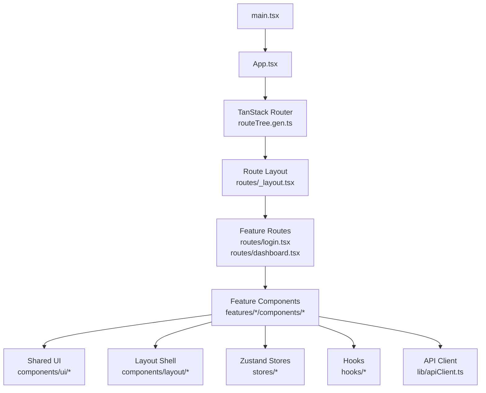
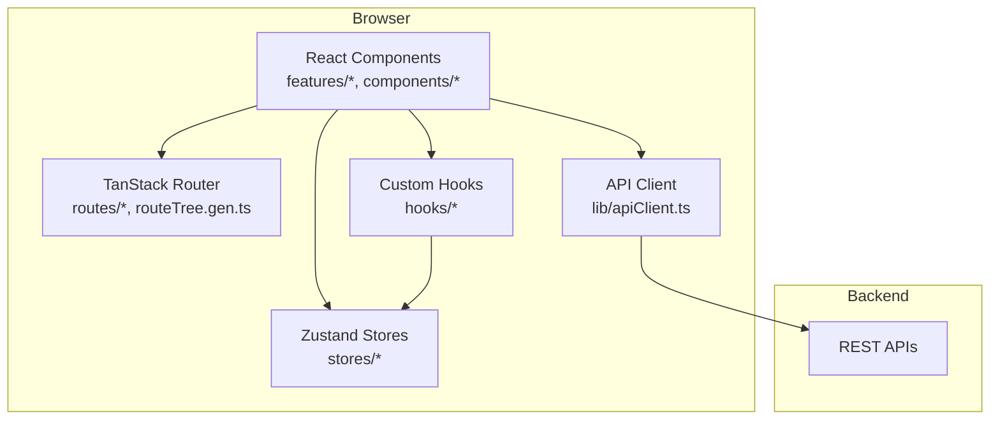
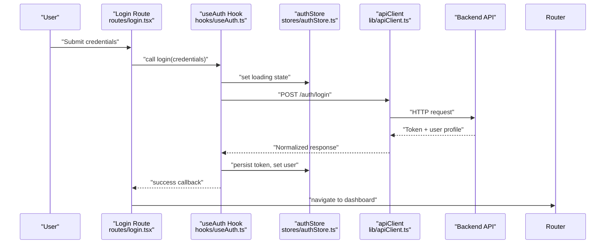
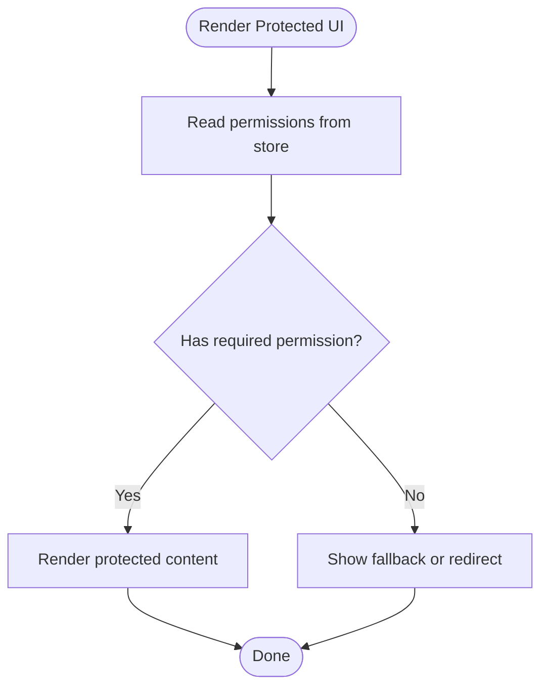
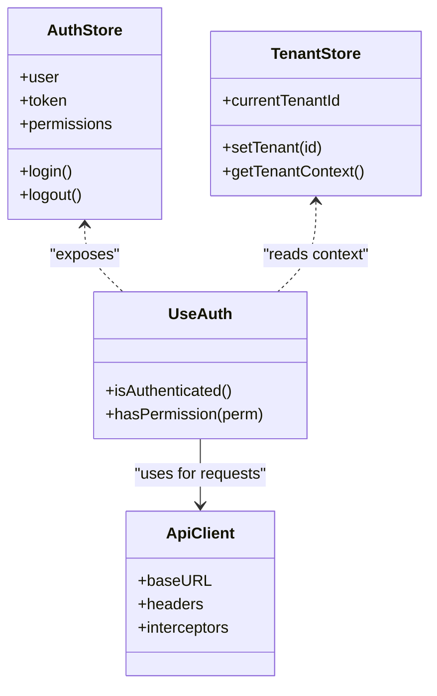
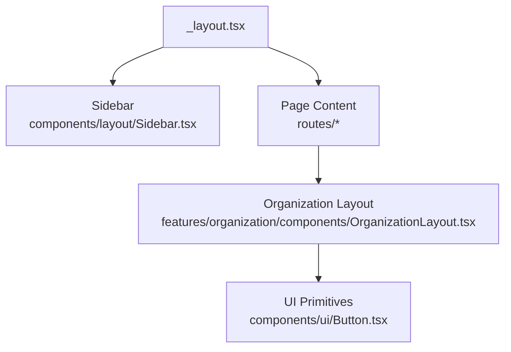
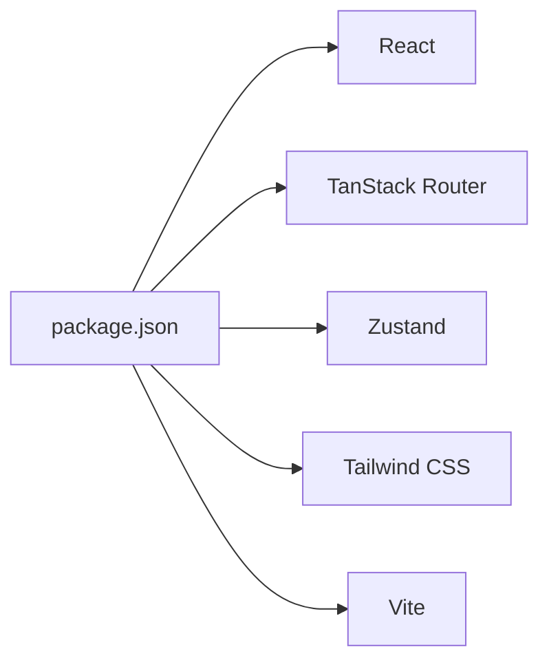

# Frontend Architecture

<cite>
**Referenced Files in This Document**
- [App.tsx](file://frontend/src/App.tsx)
- [main.tsx](file://frontend/src/main.tsx)
- [vite.config.ts](file://frontend/vite.config.ts)
- [package.json](file://frontend/package.json)
- [routeTree.gen.ts](file://frontend/src/routeTree.gen.ts)
- [routes/_layout.tsx](file://frontend/src/routes/_layout.tsx)
- [routes/login.tsx](file://frontend/src/routes/login.tsx)
- [routes/dashboard.tsx](file://frontend/src/routes/dashboard.tsx)
- [stores/authStore.ts](file://frontend/src/stores/authStore.ts)
- [hooks/useAuth.ts](file://frontend/src/hooks/useAuth.ts)
- [lib/apiClient.ts](file://frontend/src/lib/apiClient.ts)
- [features/organization/components/OrganizationLayout.tsx](file://frontend/src/features/organization/components/OrganizationLayout.tsx)
- [components/ui/Button.tsx](file://frontend/src/components/ui/Button.tsx)
- [components/layout/Sidebar.tsx](file://frontend/src/components/layout/Sidebar.tsx)
</cite>

## Table of Contents
1. [Introduction](#introduction)
2. [Project Structure](#project-structure)
3. [Core Components](#core-components)
4. [Architecture Overview](#architecture-overview)
5. [Detailed Component Analysis](#detailed-component-analysis)
6. [Dependency Analysis](#dependency-analysis)
7. [Performance Considerations](#performance-considerations)
8. [Troubleshooting Guide](#troubleshooting-guide)
9. [Conclusion](#conclusion)
10. [Appendices](#appendices)

## Introduction
This document explains the frontend architecture built with React and TypeScript, organized by features and powered by TanStack Router for routing, Zustand for state management, and Tailwind CSS for styling. It covers component hierarchy, hook patterns, API client integration, authentication flow, permission-based UI rendering, multi-tenant context handling, build system configuration with Vite, code splitting strategies, performance optimizations, responsive design patterns, and accessibility considerations.

## Project Structure
The frontend follows a feature-based organization:
- Features live under src/features/<feature>, each encapsulating routes, components, hooks, stores, and types specific to that domain.
- Shared UI primitives are placed under src/components/ui, while layout and shell components reside under src/components/layout.
- Global application bootstrap is defined in main.tsx and App.tsx.
- Routing is generated by TanStack Router and wired through route files and a generated tree.
- State is managed via Zustand stores under src/stores.
- API interactions are centralized in an HTTP client under src/lib.
- Styling uses Tailwind CSS classes throughout components.

**Diagram sources**
- [main.tsx](file://frontend/src/main.tsx)
- [App.tsx](file://frontend/src/App.tsx)
- [routeTree.gen.ts](file://frontend/src/routeTree.gen.ts)
- [routes/_layout.tsx](file://frontend/src/routes/_layout.tsx)
- [routes/login.tsx](file://frontend/src/routes/login.tsx)
- [routes/dashboard.tsx](file://frontend/src/routes/dashboard.tsx)
- [features/organization/components/OrganizationLayout.tsx](file://frontend/src/features/organization/components/OrganizationLayout.tsx)
- [components/ui/Button.tsx](file://frontend/src/components/ui/Button.tsx)
- [components/layout/Sidebar.tsx](file://frontend/src/components/layout/Sidebar.tsx)
- [stores/authStore.ts](file://frontend/src/stores/authStore.ts)
- [hooks/useAuth.ts](file://frontend/src/hooks/useAuth.ts)
- [lib/apiClient.ts](file://frontend/src/lib/apiClient.ts)

**Section sources**
- [main.tsx](file://frontend/src/main.tsx)
- [App.tsx](file://frontend/src/App.tsx)
- [routeTree.gen.ts](file://frontend/src/routeTree.gen.ts)
- [routes/_layout.tsx](file://frontend/src/routes/_layout.tsx)
- [routes/login.tsx](file://frontend/src/routes/login.tsx)
- [routes/dashboard.tsx](file://frontend/src/routes/dashboard.tsx)
- [features/organization/components/OrganizationLayout.tsx](file://frontend/src/features/organization/components/OrganizationLayout.tsx)
- [components/ui/Button.tsx](file://frontend/src/components/ui/Button.tsx)
- [components/layout/Sidebar.tsx](file://frontend/src/components/layout/Sidebar.tsx)
- [stores/authStore.ts](file://frontend/src/stores/authStore.ts)
- [hooks/useAuth.ts](file://frontend/src/hooks/useAuth.ts)
- [lib/apiClient.ts](file://frontend/src/lib/apiClient.ts)

## Core Components
- Application Bootstrap
  - Entry point initializes providers, router, and global styles.
  - Root app configures router and top-level layout.
- Routing
  - TanStack Router generates route tree; route files define pages and layouts.
  - A shared layout provides navigation, header, and sidebar.
- State Management (Zustand)
  - Centralized stores manage auth, tenant context, and UI preferences.
  - Custom hooks expose store slices to components.
- API Client
  - A single HTTP client handles base URL, headers, interceptors, and error normalization.
- UI Layer
  - Reusable primitives (buttons, inputs, modals) styled with Tailwind.
  - Layout components (sidebar, header) compose feature-specific content.

**Section sources**
- [main.tsx](file://frontend/src/main.tsx)
- [App.tsx](file://frontend/src/App.tsx)
- [routeTree.gen.ts](file://frontend/src/routeTree.gen.ts)
- [routes/_layout.tsx](file://frontend/src/routes/_layout.tsx)
- [routes/login.tsx](file://frontend/src/routes/login.tsx)
- [routes/dashboard.tsx](file://frontend/src/routes/dashboard.tsx)
- [stores/authStore.ts](file://frontend/src/stores/authStore.ts)
- [hooks/useAuth.ts](file://frontend/src/hooks/useAuth.ts)
- [lib/apiClient.ts](file://frontend/src/lib/apiClient.ts)
- [components/ui/Button.tsx](file://frontend/src/components/ui/Button.tsx)
- [components/layout/Sidebar.tsx](file://frontend/src/components/layout/Sidebar.tsx)

## Architecture Overview
High-level architecture shows how requests flow from UI to backend and how state and routing orchestrate user experiences.

**Diagram sources**
- [routes/_layout.tsx](file://frontend/src/routes/_layout.tsx)
- [routes/login.tsx](file://frontend/src/routes/login.tsx)
- [routes/dashboard.tsx](file://frontend/src/routes/dashboard.tsx)
- [routeTree.gen.ts](file://frontend/src/routeTree.gen.ts)
- [stores/authStore.ts](file://frontend/src/stores/authStore.ts)
- [hooks/useAuth.ts](file://frontend/src/hooks/useAuth.ts)
- [lib/apiClient.ts](file://frontend/src/lib/apiClient.ts)

## Detailed Component Analysis

### Authentication Flow
End-to-end login sequence using TanStack Router, Zustand, and the API client.

**Diagram sources**
- [routes/login.tsx](file://frontend/src/routes/login.tsx)
- [hooks/useAuth.ts](file://frontend/src/hooks/useAuth.ts)
- [stores/authStore.ts](file://frontend/src/stores/authStore.ts)
- [lib/apiClient.ts](file://frontend/src/lib/apiClient.ts)
- [routes/dashboard.tsx](file://frontend/src/routes/dashboard.tsx)

**Section sources**
- [routes/login.tsx](file://frontend/src/routes/login.tsx)
- [hooks/useAuth.ts](file://frontend/src/hooks/useAuth.ts)
- [stores/authStore.ts](file://frontend/src/stores/authStore.ts)
- [lib/apiClient.ts](file://frontend/src/lib/apiClient.ts)
- [routes/dashboard.tsx](file://frontend/src/routes/dashboard.tsx)

### Permission-Based UI Rendering
Permission checks gate access to routes and UI elements. The pattern typically involves:
- A guard or wrapper component that reads permissions from Zustand.
- Conditional rendering of protected sections based on role/permission sets.
- Route-level guards preventing navigation without required permissions.

[No sources needed since this diagram shows conceptual workflow, not actual code structure]

**Section sources**
- [stores/authStore.ts](file://frontend/src/stores/authStore.ts)
- [hooks/useAuth.ts](file://frontend/src/hooks/useAuth.ts)
- [routes/_layout.tsx](file://frontend/src/routes/_layout.tsx)

### Multi-Tenant Context Handling
Multi-tenancy is handled by storing the active establishment/tenant context in Zustand and propagating it via hooks. Feature components read the current tenant and scope data accordingly.

**Diagram sources**
- [stores/authStore.ts](file://frontend/src/stores/authStore.ts)
- [hooks/useAuth.ts](file://frontend/src/hooks/useAuth.ts)
- [lib/apiClient.ts](file://frontend/src/lib/apiClient.ts)

**Section sources**
- [stores/authStore.ts](file://frontend/src/stores/authStore.ts)
- [hooks/useAuth.ts](file://frontend/src/hooks/useAuth.ts)
- [lib/apiClient.ts](file://frontend/src/lib/apiClient.ts)

### Feature Organization and Layouts
Features encapsulate their own routes, components, hooks, and stores. A shared layout composes navigation and page content.

**Diagram sources**
- [routes/_layout.tsx](file://frontend/src/routes/_layout.tsx)
- [components/layout/Sidebar.tsx](file://frontend/src/components/layout/Sidebar.tsx)
- [features/organization/components/OrganizationLayout.tsx](file://frontend/src/features/organization/components/OrganizationLayout.tsx)
- [components/ui/Button.tsx](file://frontend/src/components/ui/Button.tsx)

**Section sources**
- [routes/_layout.tsx](file://frontend/src/routes/_layout.tsx)
- [components/layout/Sidebar.tsx](file://frontend/src/components/layout/Sidebar.tsx)
- [features/organization/components/OrganizationLayout.tsx](file://frontend/src/features/organization/components/OrganizationLayout.tsx)
- [components/ui/Button.tsx](file://frontend/src/components/ui/Button.tsx)

## Dependency Analysis
Key runtime dependencies include React, TanStack Router, Zustand, and Tailwind CSS. Build tooling is provided by Vite.

**Diagram sources**
- [package.json](file://frontend/package.json)

**Section sources**
- [package.json](file://frontend/package.json)

## Performance Considerations
- Code Splitting
  - Lazy-load heavy feature routes and components to reduce initial bundle size.
  - Use dynamic imports for large charts, maps, or third-party libraries.
- Data Fetching
  - Cache responses where appropriate; leverage query keys and invalidation strategies.
  - Debounce search inputs and paginate lists to minimize payload sizes.
- Rendering Optimization
  - Memoize expensive computations and derived state.
  - Avoid unnecessary re-renders by selecting only necessary store slices.
- Styling Efficiency
  - Prefer Tailwind utility classes to avoid custom CSS bloat.
  - Ensure unused styles are purged in production builds.
- Bundle Analysis
  - Periodically analyze bundle composition to identify oversized dependencies.

[No sources needed since this section provides general guidance]

## Troubleshooting Guide
Common issues and resolutions:
- Authentication Failures
  - Verify token persistence and expiration handling.
  - Check API client interceptors for correct header injection and error mapping.
- Routing Guards
  - Ensure guards run before route transitions and handle redirects properly.
- Multi-Tenant Context
  - Confirm tenant ID is present in requests and stored consistently across sessions.
- Build Errors
  - Validate Vite configuration paths and environment variables.
  - Clear caches if encountering stale module resolution issues.

**Section sources**
- [lib/apiClient.ts](file://frontend/src/lib/apiClient.ts)
- [routes/_layout.tsx](file://frontend/src/routes/_layout.tsx)
- [vite.config.ts](file://frontend/vite.config.ts)

## Conclusion
The frontend leverages a clear feature-based architecture with TanStack Router, Zustand, and Tailwind CSS to deliver a scalable, maintainable application. Centralized API client usage, robust authentication flows, permission-based rendering, and multi-tenant context handling ensure security and flexibility. Vite-powered builds support efficient code splitting and performance optimizations, while responsive design and accessibility practices improve user experience across devices.

## Appendices

### Build System and Configuration
- Vite configuration centralizes dev server, proxy settings, and optimization flags.
- Environment variables control API endpoints and feature toggles.

**Section sources**
- [vite.config.ts](file://frontend/vite.config.ts)

### Responsive Design Patterns
- Mobile-first layout with flexible grids and conditional visibility.
- Breakpoint-aware components for consistent UX across screen sizes.

[No sources needed since this section provides general guidance]

### Accessibility Considerations
- Semantic HTML elements and proper ARIA attributes.
- Keyboard navigation support and focus management in modals and menus.
- Sufficient color contrast and text scaling compatibility.

[No sources needed since this section provides general guidance]