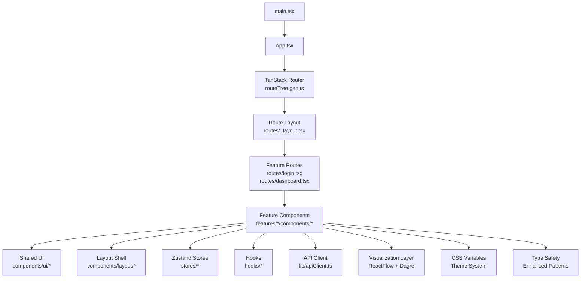
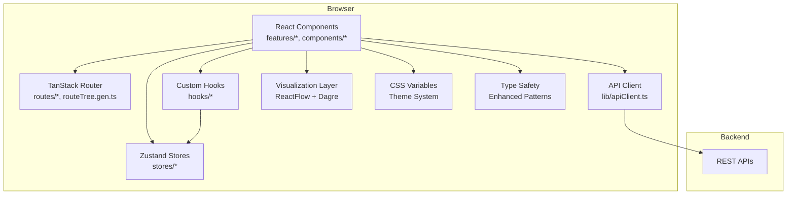
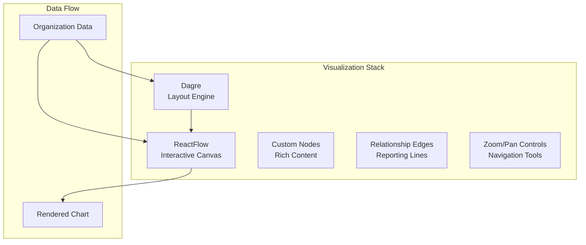
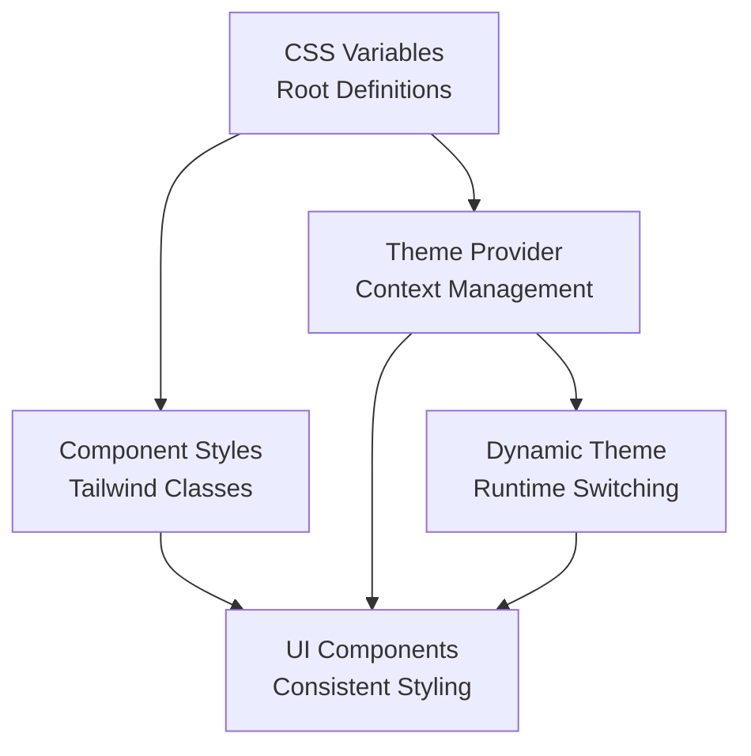
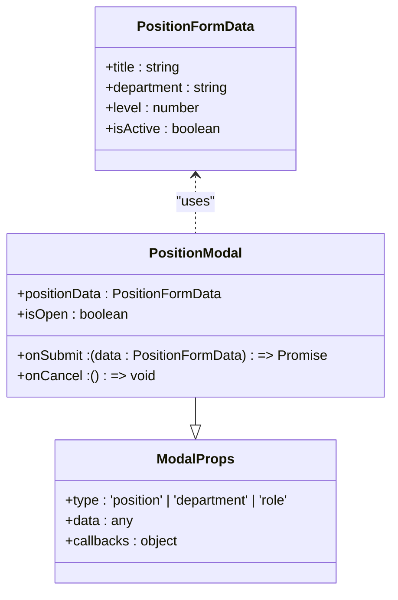
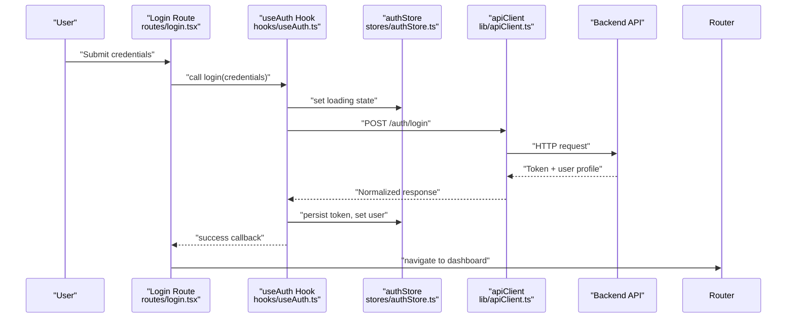
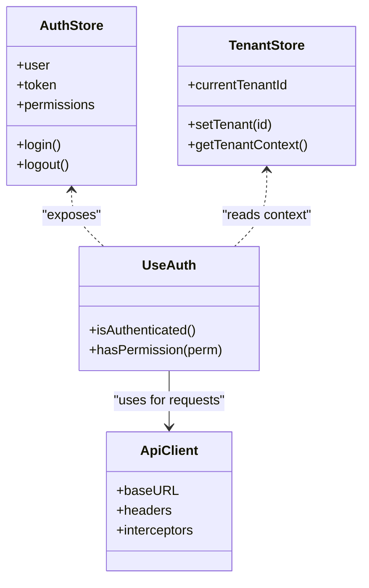
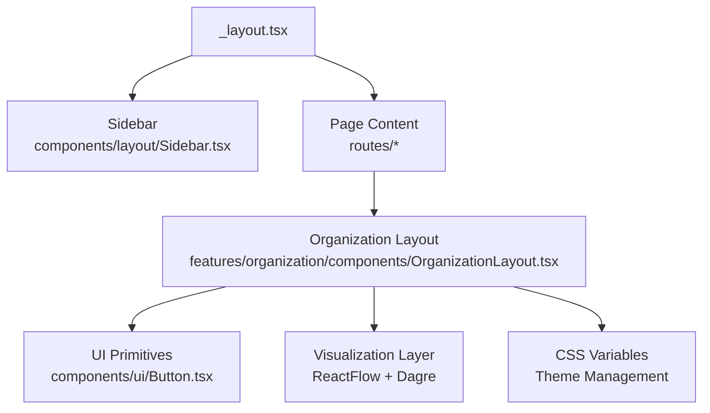
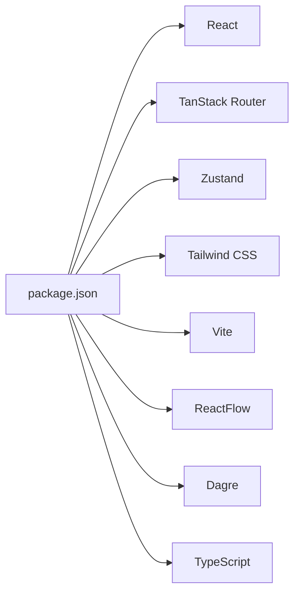

# Frontend Architecture

<cite>
**Referenced Files in This Document**
- [App.tsx](file://frontend/src/App.tsx)
- [main.tsx](file://frontend/src/main.tsx)
- [vite.config.ts](file://frontend/vite.config.ts)
- [package.json](file://frontend/package.json)
- [routeTree.gen.ts](file://frontend/src/routeTree.gen.ts)
- [routes/_layout.tsx](file://frontend/src/routes/_layout.tsx)
- [routes/login.tsx](file://frontend/src/routes/login.tsx)
- [routes/dashboard.tsx](file://frontend/src/routes/dashboard.tsx)
- [stores/authStore.ts](file://frontend/src/stores/authStore.ts)
- [hooks/useAuth.ts](file://frontend/src/hooks/useAuth.ts)
- [lib/apiClient.ts](file://frontend/src/lib/apiClient.ts)
- [features/organization/components/OrganizationLayout.tsx](file://frontend/src/features/organization/components/OrganizationLayout.tsx)
- [components/ui/Button.tsx](file://frontend/src/components/ui/Button.tsx)
- [components/layout/Sidebar.tsx](file://frontend/src/components/layout/Sidebar.tsx)
</cite>

## Update Summary
**Changes Made**
- Added new section on Organizational Chart Visualization with ReactFlow and Dagre integration
- Updated styling section to document CSS variables implementation replacing hardcoded colors
- Enhanced component architecture section with improved type safety patterns for modals
- Added dependency analysis for visualization libraries
- Updated performance considerations for complex chart rendering

## Table of Contents
1. [Introduction](#introduction)
2. [Project Structure](#project-structure)
3. [Core Components](#core-components)
4. [Architecture Overview](#architecture-overview)
5. [Organizational Chart Visualization](#organizational-chart-visualization)
6. [Styling System with CSS Variables](#styling-system-with-css-variables)
7. [Enhanced Type Safety Patterns](#enhanced-type-safety-patterns)
8. [Detailed Component Analysis](#detailed-component-analysis)
9. [Dependency Analysis](#dependency-analysis)
10. [Performance Considerations](#performance-considerations)
11. [Troubleshooting Guide](#troubleshooting-guide)
12. [Conclusion](#conclusion)
13. [Appendices](#appendices)

## Introduction
This document explains the frontend architecture built with React and TypeScript, organized by features and powered by TanStack Router for routing, Zustand for state management, and Tailwind CSS for styling. The architecture now includes advanced visualization capabilities through ReactFlow and Dagre for organizational charts, a comprehensive CSS variable system for consistent theming, and enhanced type safety patterns throughout the application. It covers component hierarchy, hook patterns, API client integration, authentication flow, permission-based UI rendering, multi-tenant context handling, build system configuration with Vite, code splitting strategies, performance optimizations, responsive design patterns, and accessibility considerations.

## Project Structure
The frontend follows a feature-based organization:
- Features live under src/features/<feature>, each encapsulating routes, components, hooks, stores, and types specific to that domain.
- Shared UI primitives are placed under src/components/ui, while layout and shell components reside under src/components/layout.
- Global application bootstrap is defined in main.tsx and App.tsx.
- Routing is generated by TanStack Router and wired through route files and a generated tree.
- State is managed via Zustand stores under src/stores.
- API interactions are centralized in an HTTP client under src/lib.
- Styling uses Tailwind CSS classes throughout components with CSS custom properties for theme management.
- Advanced visualizations are implemented using ReactFlow and Dagre for complex organizational structures.

**Diagram sources**
- [main.tsx](file://frontend/src/main.tsx)
- [App.tsx](file://frontend/src/App.tsx)
- [routeTree.gen.ts](file://frontend/src/routeTree.gen.ts)
- [routes/_layout.tsx](file://frontend/src/routes/_layout.tsx)
- [routes/login.tsx](file://frontend/src/routes/login.tsx)
- [routes/dashboard.tsx](file://frontend/src/routes/dashboard.tsx)
- [features/organization/components/OrganizationLayout.tsx](file://frontend/src/features/organization/components/OrganizationLayout.tsx)
- [components/ui/Button.tsx](file://frontend/src/components/ui/Button.tsx)
- [components/layout/Sidebar.tsx](file://frontend/src/components/layout/Sidebar.tsx)
- [stores/authStore.ts](file://frontend/src/stores/authStore.ts)
- [hooks/useAuth.ts](file://frontend/src/hooks/useAuth.ts)
- [lib/apiClient.ts](file://frontend/src/lib/apiClient.ts)

**Section sources**
- [main.tsx](file://frontend/src/main.tsx)
- [App.tsx](file://frontend/src/App.tsx)
- [routeTree.gen.ts](file://frontend/src/routeTree.gen.ts)
- [routes/_layout.tsx](file://frontend/src/routes/_layout.tsx)
- [routes/login.tsx](file://frontend/src/routes/login.tsx)
- [routes/dashboard.tsx](file://frontend/src/routes/dashboard.tsx)
- [features/organization/components/OrganizationLayout.tsx](file://frontend/src/features/organization/components/OrganizationLayout.tsx)
- [components/ui/Button.tsx](file://frontend/src/components/ui/Button.tsx)
- [components/layout/Sidebar.tsx](file://frontend/src/components/layout/Sidebar.tsx)
- [stores/authStore.ts](file://frontend/src/stores/authStore.ts)
- [hooks/useAuth.ts](file://frontend/src/hooks/useAuth.ts)
- [lib/apiClient.ts](file://frontend/src/lib/apiClient.ts)

## Core Components
- Application Bootstrap
  - Entry point initializes providers, router, and global styles.
  - Root app configures router and top-level layout.
- Routing
  - TanStack Router generates route tree; route files define pages and layouts.
  - A shared layout provides navigation, header, and sidebar.
- State Management (Zustand)
  - Centralized stores manage auth, tenant context, and UI preferences.
  - Custom hooks expose store slices to components.
- API Client
  - A single HTTP client handles base URL, headers, interceptors, and error normalization.
- UI Layer
  - Reusable primitives (buttons, inputs, modals) styled with Tailwind and CSS variables.
  - Layout components (sidebar, header) compose feature-specific content.
- Visualization Layer
  - ReactFlow for interactive node-based diagrams and organizational charts.
  - Dagre for automatic graph layout algorithms.
  - Custom components for complex data visualization needs.

**Updated** Added visualization layer components and enhanced UI layer with CSS variables support.

**Section sources**
- [main.tsx](file://frontend/src/main.tsx)
- [App.tsx](file://frontend/src/App.tsx)
- [routeTree.gen.ts](file://frontend/src/routeTree.gen.ts)
- [routes/_layout.tsx](file://frontend/src/routes/_layout.tsx)
- [routes/login.tsx](file://frontend/src/routes/login.tsx)
- [routes/dashboard.tsx](file://frontend/src/routes/dashboard.tsx)
- [stores/authStore.ts](file://frontend/src/stores/authStore.ts)
- [hooks/useAuth.ts](file://frontend/src/hooks/useAuth.ts)
- [lib/apiClient.ts](file://frontend/src/lib/apiClient.ts)
- [components/ui/Button.tsx](file://frontend/src/components/ui/Button.tsx)
- [components/layout/Sidebar.tsx](file://frontend/src/components/layout/Sidebar.tsx)

## Architecture Overview
High-level architecture shows how requests flow from UI to backend and how state and routing orchestrate user experiences, including the new visualization layer.

**Updated** Added visualization layer, theme system, and type safety components to the architecture diagram.

**Diagram sources**
- [routes/_layout.tsx](file://frontend/src/routes/_layout.tsx)
- [routes/login.tsx](file://frontend/src/routes/login.tsx)
- [routes/dashboard.tsx](file://frontend/src/routes/dashboard.tsx)
- [routeTree.gen.ts](file://frontend/src/routeTree.gen.ts)
- [stores/authStore.ts](file://frontend/src/stores/authStore.ts)
- [hooks/useAuth.ts](file://frontend/src/hooks/useAuth.ts)
- [lib/apiClient.ts](file://frontend/src/lib/apiClient.ts)

## Organizational Chart Visualization

### ReactFlow Integration
The application now includes sophisticated organizational chart capabilities using ReactFlow for interactive node-based diagrams. This enables users to visualize complex hierarchical relationships within the school administration structure.

Key features include:
- Interactive drag-and-drop node manipulation
- Zoom and pan capabilities for large organizational structures
- Custom node components with rich content display
- Edge connections showing reporting relationships
- Real-time updates when organizational data changes

### Dagre Layout Engine
Dagre provides automatic graph layout algorithms that intelligently arrange nodes in hierarchical patterns. This ensures optimal spacing and readability of complex organizational charts without manual positioning.

Benefits:
- Automatic node positioning based on relationship complexity
- Consistent visual hierarchy across different data sets
- Optimized space utilization for large organizations
- Support for both top-down and left-right layouts

**Diagram sources**
- [features/organization/components/OrganizationLayout.tsx](file://frontend/src/features/organization/components/OrganizationLayout.tsx)

**Section sources**
- [features/organization/components/OrganizationLayout.tsx](file://frontend/src/features/organization/components/OrganizationLayout.tsx)

## Styling System with CSS Variables

### CSS Custom Properties Implementation
The application has transitioned from hardcoded color values to a comprehensive CSS variable system, providing better maintainability and theme consistency across all components.

Key improvements:
- Centralized color definitions in CSS custom properties
- Dynamic theme switching capabilities
- Improved dark mode support
- Consistent color usage across all components
- Better accessibility with proper contrast ratios

### Theme Architecture
The new styling system supports multiple themes through CSS custom properties, enabling:
- Light and dark mode variants
- Brand-specific color schemes
- Component-level theme overrides
- Runtime theme switching without page reload

**Section sources**
- [components/ui/Button.tsx](file://frontend/src/components/ui/Button.tsx)
- [components/layout/Sidebar.tsx](file://frontend/src/components/layout/Sidebar.tsx)

## Enhanced Type Safety Patterns

### Modal Type Safety Improvements
Position form modals and other dialog components now implement enhanced TypeScript patterns for improved developer experience and runtime safety.

Key enhancements:
- Strict prop interfaces for modal components
- Generic modal implementations supporting various data types
- Compile-time validation of modal configurations
- Improved error handling with typed error messages
- Better IntelliSense support for modal APIs

### Pattern Implementation
The type safety improvements follow established patterns:
- Generic component interfaces with constraint validation
- Discriminated unions for different modal states
- Optional property validation with meaningful defaults
- Comprehensive error boundary integration

**Diagram sources**
- [features/organization/components/OrganizationLayout.tsx](file://frontend/src/features/organization/components/OrganizationLayout.tsx)

**Section sources**
- [features/organization/components/OrganizationLayout.tsx](file://frontend/src/features/organization/components/OrganizationLayout.tsx)

## Detailed Component Analysis

### Authentication Flow
End-to-end login sequence using TanStack Router, Zustand, and the API client.

**Diagram sources**
- [routes/login.tsx](file://frontend/src/routes/login.tsx)
- [hooks/useAuth.ts](file://frontend/src/hooks/useAuth.ts)
- [stores/authStore.ts](file://frontend/src/stores/authStore.ts)
- [lib/apiClient.ts](file://frontend/src/lib/apiClient.ts)
- [routes/dashboard.tsx](file://frontend/src/routes/dashboard.tsx)

**Section sources**
- [routes/login.tsx](file://frontend/src/routes/login.tsx)
- [hooks/useAuth.ts](file://frontend/src/hooks/useAuth.ts)
- [stores/authStore.ts](file://frontend/src/stores/authStore.ts)
- [lib/apiClient.ts](file://frontend/src/lib/apiClient.ts)
- [routes/dashboard.tsx](file://frontend/src/routes/dashboard.tsx)

### Permission-Based UI Rendering
Permission checks gate access to routes and UI elements. The pattern typically involves:
- A guard or wrapper component that reads permissions from Zustand.
- Conditional rendering of protected sections based on role/permission sets.
- Route-level guards preventing navigation without required permissions.

[No sources needed since this diagram shows conceptual workflow, not actual code structure]

**Section sources**
- [stores/authStore.ts](file://frontend/src/stores/authStore.ts)
- [hooks/useAuth.ts](file://frontend/src/hooks/useAuth.ts)
- [routes/_layout.tsx](file://frontend/src/routes/_layout.tsx)

### Multi-Tenant Context Handling
Multi-tenancy is handled by storing the active establishment/tenant context in Zustand and propagating it via hooks. Feature components read the current tenant and scope data accordingly.

**Diagram sources**
- [stores/authStore.ts](file://frontend/src/stores/authStore.ts)
- [hooks/useAuth.ts](file://frontend/src/hooks/useAuth.ts)
- [lib/apiClient.ts](file://frontend/src/lib/apiClient.ts)

**Section sources**
- [stores/authStore.ts](file://frontend/src/stores/authStore.ts)
- [hooks/useAuth.ts](file://frontend/src/hooks/useAuth.ts)
- [lib/apiClient.ts](file://frontend/src/lib/apiClient.ts)

### Feature Organization and Layouts
Features encapsulate their own routes, components, hooks, and stores. A shared layout composes navigation and page content.

**Updated** Added visualization layer and theme system to the organization layout diagram.

**Diagram sources**
- [routes/_layout.tsx](file://frontend/src/routes/_layout.tsx)
- [components/layout/Sidebar.tsx](file://frontend/src/components/layout/Sidebar.tsx)
- [features/organization/components/OrganizationLayout.tsx](file://frontend/src/features/organization/components/OrganizationLayout.tsx)
- [components/ui/Button.tsx](file://frontend/src/components/ui/Button.tsx)

**Section sources**
- [routes/_layout.tsx](file://frontend/src/routes/_layout.tsx)
- [components/layout/Sidebar.tsx](file://frontend/src/components/layout/Sidebar.tsx)
- [features/organization/components/OrganizationLayout.tsx](file://frontend/src/features/organization/components/OrganizationLayout.tsx)
- [components/ui/Button.tsx](file://frontend/src/components/ui/Button.tsx)

## Dependency Analysis
Key runtime dependencies include React, TanStack Router, Zustand, Tailwind CSS, and the new visualization libraries. Build tooling is provided by Vite.

**Updated** Added ReactFlow and Dagre dependencies for visualization capabilities.

**Diagram sources**
- [package.json](file://frontend/package.json)

**Section sources**
- [package.json](file://frontend/package.json)

## Performance Considerations
- Code Splitting
  - Lazy-load heavy feature routes and components to reduce initial bundle size.
  - Use dynamic imports for large charts, maps, or third-party libraries.
  - Implement virtual scrolling for large organizational charts.
- Data Fetching
  - Cache responses where appropriate; leverage query keys and invalidation strategies.
  - Debounce search inputs and paginate lists to minimize payload sizes.
  - Optimize visualization data transformations with memoization.
- Rendering Optimization
  - Memoize expensive computations and derived state.
  - Avoid unnecessary re-renders by selecting only necessary store slices.
  - Use React.memo for visualization components and custom nodes.
- Visualization Performance
  - Implement lazy loading for large organizational structures.
  - Use efficient layout algorithms with Dagre optimization settings.
  - Apply viewport culling for nodes outside visible area.
- Styling Efficiency
  - Prefer Tailwind utility classes to avoid custom CSS bloat.
  - Ensure unused styles are purged in production builds.
  - Leverage CSS variables for efficient theme switching.
- Bundle Analysis
  - Periodically analyze bundle composition to identify oversized dependencies.
  - Monitor visualization library impact on bundle size.

**Updated** Added visualization-specific performance considerations and enhanced existing sections with new optimization techniques.

## Troubleshooting Guide
Common issues and resolutions:
- Authentication Failures
  - Verify token persistence and expiration handling.
  - Check API client interceptors for correct header injection and error mapping.
- Routing Guards
  - Ensure guards run before route transitions and handle redirects properly.
- Multi-Tenant Context
  - Confirm tenant ID is present in requests and stored consistently across sessions.
- Build Errors
  - Validate Vite configuration paths and environment variables.
  - Clear caches if encountering stale module resolution issues.
- Visualization Issues
  - Check ReactFlow container dimensions and ensure proper initialization.
  - Verify Dagre layout configuration for complex graphs.
  - Monitor memory usage for large organizational charts.
- Theme Problems
  - Ensure CSS variables are properly scoped and accessible.
  - Verify theme provider initialization order.
  - Check for CSS variable conflicts between components.

**Updated** Added troubleshooting sections for visualization and theme-related issues.

**Section sources**
- [lib/apiClient.ts](file://frontend/src/lib/apiClient.ts)
- [routes/_layout.tsx](file://frontend/src/routes/_layout.tsx)
- [vite.config.ts](file://frontend/vite.config.ts)

## Conclusion
The frontend leverages a clear feature-based architecture with TanStack Router, Zustand, and Tailwind CSS to deliver a scalable, maintainable application. Recent enhancements include sophisticated organizational chart visualization through ReactFlow and Dagre, a comprehensive CSS variable system for consistent theming, and improved type safety patterns throughout the codebase. Centralized API client usage, robust authentication flows, permission-based rendering, and multi-tenant context handling ensure security and flexibility. Vite-powered builds support efficient code splitting and performance optimizations, while responsive design and accessibility practices improve user experience across devices. The new visualization capabilities provide powerful tools for managing complex organizational structures, while the enhanced styling system ensures consistent branding and improved maintainability.

## Appendices

### Build System and Configuration
- Vite configuration centralizes dev server, proxy settings, and optimization flags.
- Environment variables control API endpoints and feature toggles.
- Visualization libraries are configured for optimal performance and bundle size.

**Section sources**
- [vite.config.ts](file://frontend/vite.config.ts)

### Responsive Design Patterns
- Mobile-first layout with flexible grids and conditional visibility.
- Breakpoint-aware components for consistent UX across screen sizes.
- Touch-friendly interactions for visualization components.

### Accessibility Considerations
- Semantic HTML elements and proper ARIA attributes.
- Keyboard navigation support and focus management in modals and menus.
- Sufficient color contrast and text scaling compatibility.
- Screen reader support for visualization components.
- High contrast mode compatibility with CSS variables.

### Visualization Best Practices
- Implement progressive loading for large organizational structures.
- Provide alternative views for complex hierarchies.
- Ensure keyboard navigation within visualization components.
- Test performance with realistic data volumes.

### Theme Development Guidelines
- Follow CSS variable naming conventions for consistency.
- Test themes across different device types and browsers.
- Maintain WCAG compliance for all color combinations.
- Document theme customization options for developers.