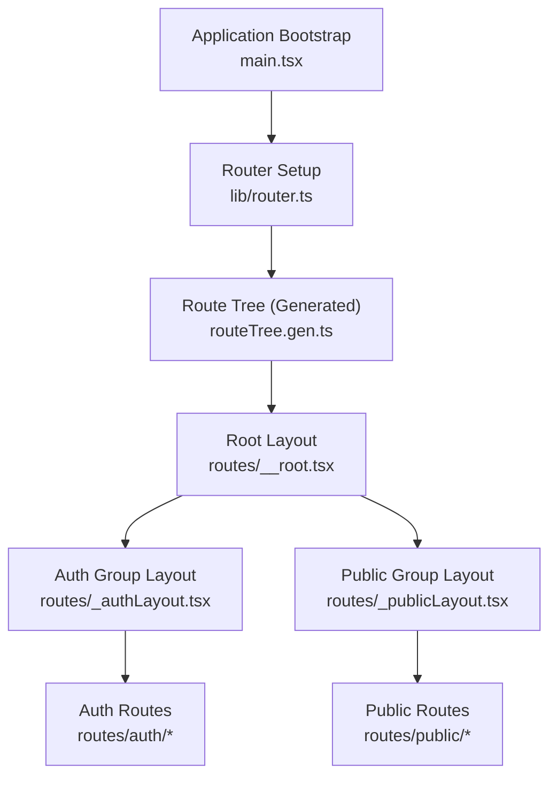
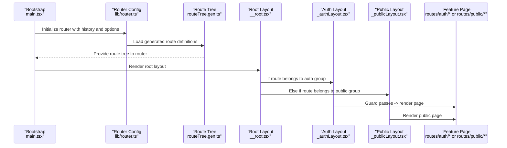
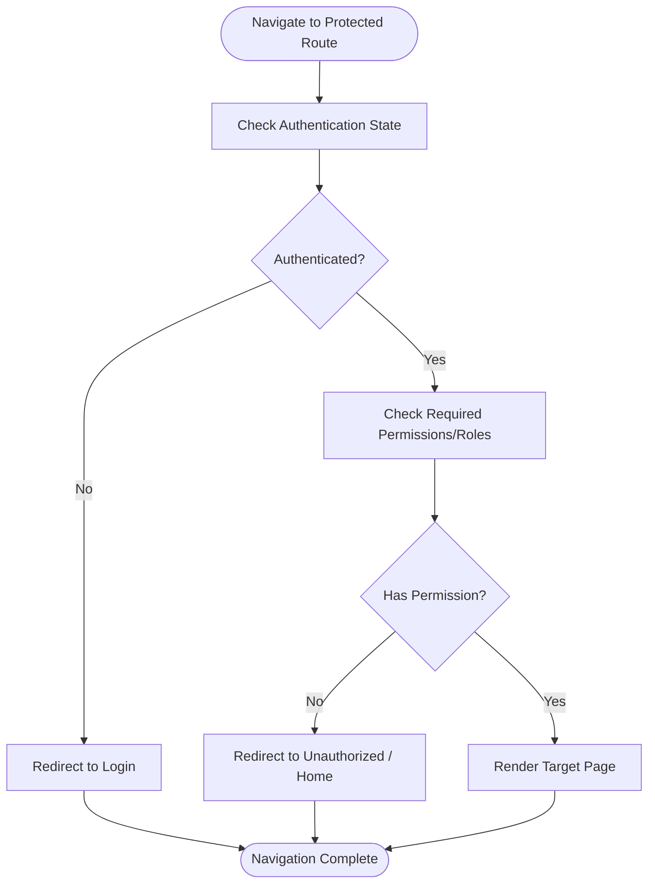
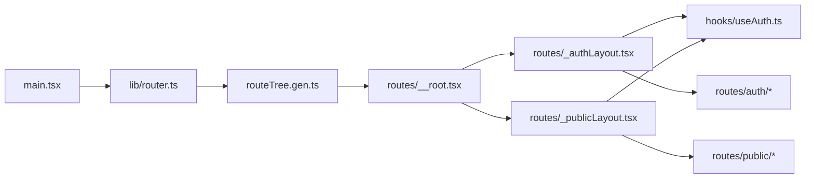

# Routing & Navigation

<cite>
**Referenced Files in This Document**
- [main.tsx](file://frontend/src/main.tsx)
- [App.tsx](file://frontend/src/App.tsx)
- [routeTree.gen.ts](file://frontend/src/routeTree.gen.ts)
- [routes/__root.tsx](file://frontend/src/routes/__root.tsx)
- [routes/_authLayout.tsx](file://frontend/src/routes/_authLayout.tsx)
- [routes/_publicLayout.tsx](file://frontend/src/routes/_publicLayout.tsx)
- [routes/auth/login.tsx](file://frontend/src/routes/auth/login.tsx)
- [routes/auth/dashboard.tsx](file://frontend/src/routes/auth/dashboard.tsx)
- [routes/public/home.tsx](file://frontend/src/routes/public/home.tsx)
- [hooks/useAuth.ts](file://frontend/src/hooks/useAuth.ts)
- [lib/router.ts](file://frontend/src/lib/router.ts)
</cite>

## Table of Contents
1. [Introduction](#introduction)
2. [Project Structure](#project-structure)
3. [Core Components](#core-components)
4. [Architecture Overview](#architecture-overview)
5. [Detailed Component Analysis](#detailed-component-analysis)
6. [Dependency Analysis](#dependency-analysis)
7. [Performance Considerations](#performance-considerations)
8. [Troubleshooting Guide](#troubleshooting-guide)
9. [Conclusion](#conclusion)

## Introduction
This document explains the routing and navigation system built with TanStack Router in the eLISAschool frontend. It covers file-based routing, route groups for authenticated and public areas, guards for authentication and permissions, navigation patterns, breadcrumbs, dynamic parameters, lazy loading and code splitting, nested routing, URL state management, and deep linking. The goal is to help developers understand how routes are organized, secured, and optimized while providing practical guidance for extending and maintaining the system.

## Project Structure
The project uses TanStack Router’s file-based routing convention under src/routes. Route groups are implemented via layout files prefixed with an underscore (for example, _authLayout and _publicLayout). A generated route tree is produced by the build tooling and imported at application bootstrap.

Key structural elements:
- Root entry points initialize the router and app shell.
- Layouts define shared UI and guard logic for route groups.
- Feature-specific routes live under grouped folders (auth, public).
- Generated route tree provides type-safe path helpers and route definitions.

**Diagram sources**
- [main.tsx](file://frontend/src/main.tsx)
- [lib/router.ts](file://frontend/src/lib/router.ts)
- [routeTree.gen.ts](file://frontend/src/routeTree.gen.ts)
- [routes/__root.tsx](file://frontend/src/routes/__root.tsx)
- [routes/_authLayout.tsx](file://frontend/src/routes/_authLayout.tsx)
- [routes/_publicLayout.tsx](file://frontend/src/routes/_publicLayout.tsx)

**Section sources**
- [main.tsx](file://frontend/src/main.tsx)
- [lib/router.ts](file://frontend/src/lib/router.ts)
- [routeTree.gen.ts](file://frontend/src/routeTree.gen.ts)
- [routes/__root.tsx](file://frontend/src/routes/__root.tsx)
- [routes/_authLayout.tsx](file://frontend/src/routes/_authLayout.tsx)
- [routes/_publicLayout.tsx](file://frontend/src/routes/_publicLayout.tsx)

## Core Components
- Application bootstrap: Initializes React and mounts the router provider.
- Router configuration: Configures history, default settings, and global options.
- Route tree: Auto-generated mapping of file paths to route components and layouts.
- Root layout: Provides top-level providers, error boundaries, and common UI chrome.
- Auth group layout: Enforces authentication and permission checks for protected routes.
- Public group layout: Renders unauthenticated UI and redirects based on auth state.
- Auth hooks: Centralized access to current user, roles, and permissions used by guards.

These components collaborate to provide secure, modular, and maintainable navigation across the application.

**Section sources**
- [main.tsx](file://frontend/src/main.tsx)
- [lib/router.ts](file://frontend/src/lib/router.ts)
- [routeTree.gen.ts](file://frontend/src/routeTree.gen.ts)
- [routes/__root.tsx](file://frontend/src/routes/__root.tsx)
- [routes/_authLayout.tsx](file://frontend/src/routes/_authLayout.tsx)
- [routes/_publicLayout.tsx](file://frontend/src/routes/_publicLayout.tsx)
- [hooks/useAuth.ts](file://frontend/src/hooks/useAuth.ts)

## Architecture Overview
The routing architecture follows a layered approach:
- Entry layer: main.tsx bootstraps the app and mounts the router.
- Configuration layer: lib/router.ts sets up TanStack Router with history and defaults.
- Definition layer: routeTree.gen.ts maps file-based routes to components.
- Layout layer: __root.tsx defines root context; _authLayout.tsx and _publicLayout.tsx implement group-level behavior.
- Feature layer: routes/auth/* and routes/public/* contain feature-specific pages.

**Diagram sources**
- [main.tsx](file://frontend/src/main.tsx)
- [lib/router.ts](file://frontend/src/lib/router.ts)
- [routeTree.gen.ts](file://frontend/src/routeTree.gen.ts)
- [routes/__root.tsx](file://frontend/src/routes/__root.tsx)
- [routes/_authLayout.tsx](file://frontend/src/routes/_authLayout.tsx)
- [routes/_publicLayout.tsx](file://frontend/src/routes/_publicLayout.tsx)

## Detailed Component Analysis

### File-Based Routing and Route Groups
- File-to-route mapping: Each file under src/routes corresponds to a route segment. Nested folders create nested routes.
- Route groups: Layout files prefixed with underscore act as grouping containers. For example:
  - _authLayout.tsx applies to all routes under routes/auth/*.
  - _publicLayout.tsx applies to all routes under routes/public*.
- Benefits:
  - Clear separation between authenticated and public flows.
  - Shared UI and guard logic per group without duplicating code.

Implementation notes:
- Ensure layout files export a component that renders Outlet to display child routes.
- Keep group-specific concerns (e.g., redirection, guards) inside the corresponding layout.

**Section sources**
- [routes/_authLayout.tsx](file://frontend/src/routes/_authLayout.tsx)
- [routes/_publicLayout.tsx](file://frontend/src/routes/_publicLayout.tsx)

### Authentication and Permission Guards
- Purpose: Protect sensitive routes and enforce role/permission requirements before rendering content.
- Typical flow:
  - Check authentication state using centralized hooks.
  - Validate required permissions or roles.
  - Redirect to login or unauthorized page when checks fail.
  - Allow navigation when checks pass.

Recommended pattern:
- Implement guards within the auth group layout to centralize logic.
- Use typed route params and search states for safer navigation.

**Diagram sources**
- [routes/_authLayout.tsx](file://frontend/src/routes/_authLayout.tsx)
- [hooks/useAuth.ts](file://frontend/src/hooks/useAuth.ts)

**Section sources**
- [routes/_authLayout.tsx](file://frontend/src/routes/_authLayout.tsx)
- [hooks/useAuth.ts](file://frontend/src/hooks/useAuth.ts)

### Navigation Patterns and Programmatic Navigation
- Declarative navigation: Use Link components for static links and safe transitions.
- Programmatic navigation: Use navigate() from TanStack Router for conditional flows (e.g., after login, form submission).
- Best practices:
  - Prefer typed route helpers generated by the route tree for compile-time safety.
  - Preserve search params when navigating to related pages.
  - Avoid direct DOM manipulation; rely on router APIs.

Typical usage locations:
- After successful authentication, redirect to dashboard or last visited route.
- In forms, navigate to confirmation or list views upon success.

**Section sources**
- [routes/auth/login.tsx](file://frontend/src/routes/auth/login.tsx)
- [routes/auth/dashboard.tsx](file://frontend/src/routes/auth/dashboard.tsx)

### Breadcrumbs System
- Concept: Build a breadcrumb trail based on the active route hierarchy.
- Implementation approach:
  - Derive segments from the current route location.
  - Map segments to human-readable labels and links.
  - Render in the root layout or a dedicated header component.

Considerations:
- Handle dynamic segments gracefully (e.g., show “Details” instead of raw IDs).
- Respect route metadata if available to customize labels.

**Section sources**
- [routes/__root.tsx](file://frontend/src/routes/__root.tsx)

### Dynamic Routing with Parameters
- Path parameters: Define dynamic segments in route files (for example, id, slug).
- Accessing parameters: Read params from the route context provided by TanStack Router.
- Validation: Use route loaders or validators to ensure parameter validity and fetch data safely.

Examples of use cases:
- Resource detail pages (users/:id, classes/:classId).
- Scoped features (organizations/:orgId/settings).

**Section sources**
- [routes/auth/dashboard.tsx](file://frontend/src/routes/auth/dashboard.tsx)

### Lazy Loading and Route-Based Code Splitting
- Strategy: Use lazy imports for route components to split bundles by route.
- Benefits:
  - Reduced initial payload.
  - Faster first paint and improved interactivity.
- Implementation:
  - Wrap route components with lazy loading utilities.
  - Provide fallback UI during loading.

Guidelines:
- Keep small shared components outside route bundles.
- Preload critical routes where appropriate.

**Section sources**
- [routes/auth/login.tsx](file://frontend/src/routes/auth/login.tsx)
- [routes/auth/dashboard.tsx](file://frontend/src/routes/auth/dashboard.tsx)

### Nested Routing Patterns
- Nested layouts: Use outlet components to compose parent and child routes.
- Common patterns:
  - Dashboard with sidebar and nested feature tabs.
  - Settings area with multiple sub-pages.
- Advantages:
  - Reuse headers, sidebars, and guards at higher levels.
  - Maintain clear hierarchical structure aligned with URLs.

**Section sources**
- [routes/__root.tsx](file://frontend/src/routes/__root.tsx)
- [routes/_authLayout.tsx](file://frontend/src/routes/_authLayout.tsx)

### URL State Management and Deep Linking
- Search state: Store filters, pagination, and view preferences in URL query strings for shareability and deep linking.
- Deep linking: Ensure every meaningful state is reflected in the URL so users can bookmark or share exact views.
- Sync strategy:
  - On mount, read search params and hydrate local state.
  - On user interactions, update search params to reflect changes.

Best practices:
- Normalize and validate search params.
- Debounce heavy updates if necessary.
- Provide reset actions to clear filters.

**Section sources**
- [routes/auth/dashboard.tsx](file://frontend/src/routes/auth/dashboard.tsx)

## Dependency Analysis
The following diagram shows key dependencies among routing-related modules:

**Diagram sources**
- [main.tsx](file://frontend/src/main.tsx)
- [lib/router.ts](file://frontend/src/lib/router.ts)
- [routeTree.gen.ts](file://frontend/src/routeTree.gen.ts)
- [routes/__root.tsx](file://frontend/src/routes/__root.tsx)
- [routes/_authLayout.tsx](file://frontend/src/routes/_authLayout.tsx)
- [routes/_publicLayout.tsx](file://frontend/src/routes/_publicLayout.tsx)
- [hooks/useAuth.ts](file://frontend/src/hooks/useAuth.ts)

**Section sources**
- [main.tsx](file://frontend/src/main.tsx)
- [lib/router.ts](file://frontend/src/lib/router.ts)
- [routeTree.gen.ts](file://frontend/src/routeTree.gen.ts)
- [routes/__root.tsx](file://frontend/src/routes/__root.tsx)
- [routes/_authLayout.tsx](file://frontend/src/routes/_authLayout.tsx)
- [routes/_publicLayout.tsx](file://frontend/src/routes/_publicLayout.tsx)
- [hooks/useAuth.ts](file://frontend/src/hooks/useAuth.ts)

## Performance Considerations
- Prefer lazy-loaded route components to minimize initial bundle size.
- Keep layout components lightweight; defer heavy work to route loaders or effects.
- Use memoization for expensive computations derived from route params or search state.
- Avoid unnecessary re-renders by stabilizing props and leveraging route context efficiently.
- Monitor navigation performance and consider preloading frequently accessed routes.

[No sources needed since this section provides general guidance]

## Troubleshooting Guide
Common issues and resolutions:
- Infinite redirect loops:
  - Verify guard conditions and ensure they do not redirect to the same guarded route.
  - Confirm that login redirects account for previously requested URLs.
- Missing route components:
  - Ensure route files exist and export default components.
  - Regenerate the route tree after adding new routes.
- Type errors with route helpers:
  - Run the build or regeneration step to refresh route types.
- Stale search state:
  - Normalize and validate search params on load.
  - Provide explicit reset actions to clear filters.

Operational tips:
- Log navigation events during development to trace unexpected redirects.
- Use browser dev tools to inspect route matches and loaded chunks.

**Section sources**
- [routes/_authLayout.tsx](file://frontend/src/routes/_authLayout.tsx)
- [routes/__root.tsx](file://frontend/src/routes/__root.tsx)

## Conclusion
The eLISAschool frontend leverages TanStack Router’s file-based routing to deliver a secure, scalable, and maintainable navigation system. Route groups separate authenticated and public experiences, while centralized guards enforce access control. Lazy loading and nested layouts optimize performance and composition. By adhering to the patterns described here—typed navigation, robust guards, URL-driven state, and deep linking—the team can extend the application confidently and keep the user experience consistent and performant.