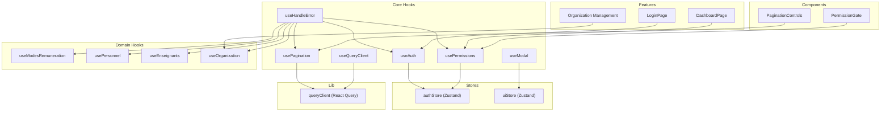
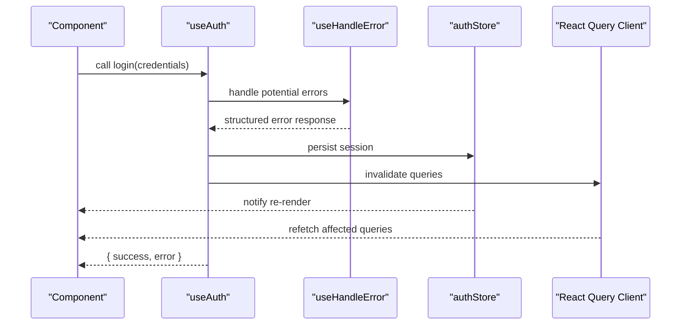
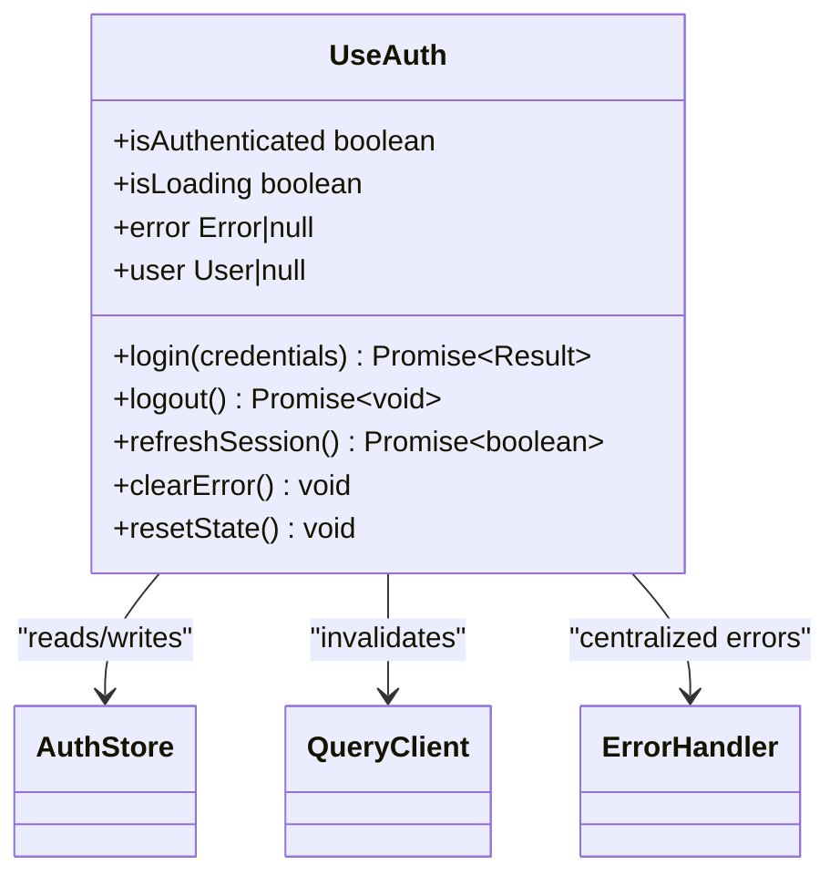
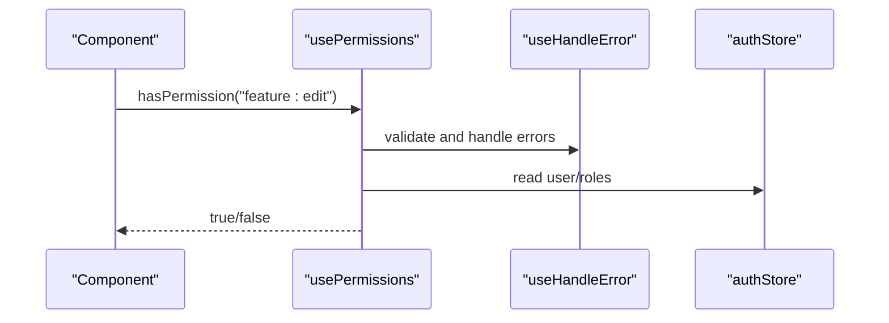
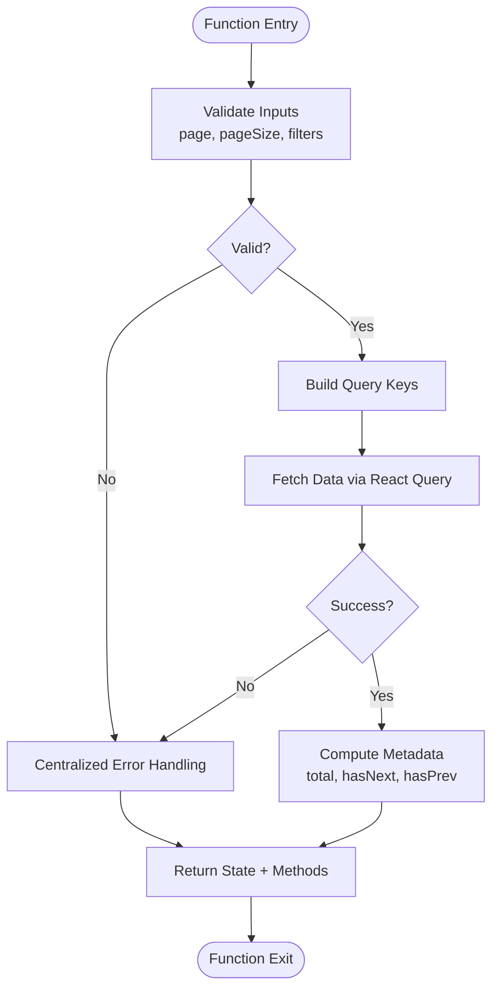
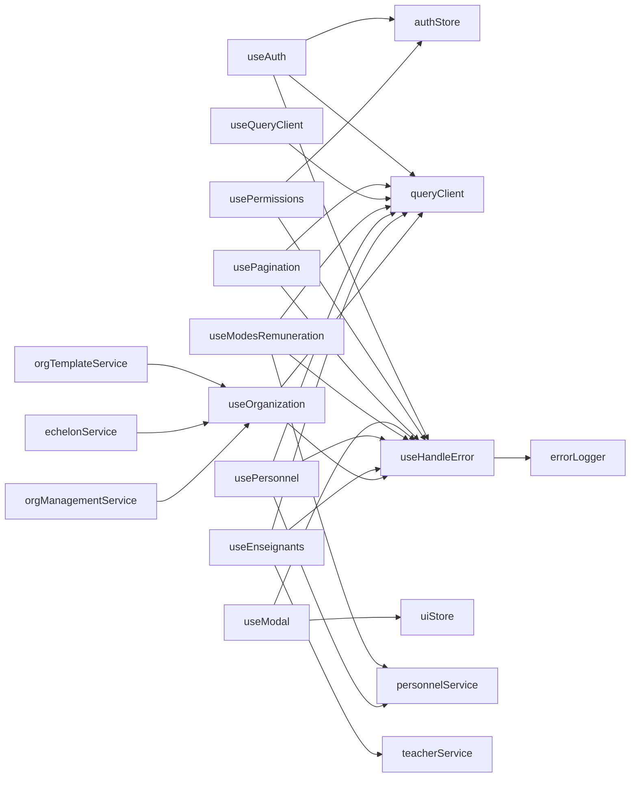

# Custom Hooks Patterns

<cite>
**Referenced Files in This Document**
- [frontend/src/hooks/useAuth.ts](file://frontend/src/hooks/useAuth.ts)
- [frontend/src/hooks/usePermissions.ts](file://frontend/src/hooks/usePermissions.ts)
- [frontend/src/hooks/usePagination.ts](file://frontend/src/hooks/usePagination.ts)
- [frontend/src/hooks/useModal.ts](file://frontend/src/hooks/useModal.ts)
- [frontend/src/hooks/useQueryClient.ts](file://frontend/src/hooks/useQueryClient.ts)
- [frontend/src/hooks/use-handle-error.ts](file://frontend/src/hooks/use-handle-error.ts)
- [frontend/src/hooks/use-modes-remuneration.ts](file://frontend/src/hooks/use-modes-remuneration.ts)
- [frontend/src/hooks/use-personnel.ts](file://frontend/src/hooks/use-personnel.ts)
- [frontend/src/hooks/use-enseignants.ts](file://frontend/src/hooks/use-enseignants.ts)
- [frontend/src/features/organisation/hooks/index.ts](file://frontend/src/features/organisation/hooks/index.ts)
- [frontend/src/stores/authStore.ts](file://frontend/src/stores/authStore.ts)
- [frontend/src/stores/uiStore.ts](file://frontend/src/stores/uiStore.ts)
- [frontend/src/lib/queryClient.ts](file://frontend/src/lib/queryClient.ts)
- [frontend/src/features/auth/login/LoginPage.tsx](file://frontend/src/features/auth/login/LoginPage.tsx)
- [frontend/src/features/dashboard/DashboardPage.tsx](file://frontend/src/features/dashboard/DashboardPage.tsx)
- [frontend/src/components/common/PaginationControls.tsx](file://frontend/src/components/common/PaginationControls.tsx)
- [frontend/src/components/common/PermissionGate.tsx](file://frontend/src/components/common/PermissionGate.tsx)
</cite>

## Update Summary
**Changes Made**
- Added comprehensive documentation for new centralized error handling hook (use-handle-error.ts)
- Updated all hook sections to reflect improved type safety and elimination of 'any' types
- Enhanced error handling patterns throughout the architecture
- Updated dependency analysis to include centralized error management
- Strengthened type safety guidelines and best practices
- **New** Added organization module hooks section covering template management, echelon structure handling, and organization management interface functionality with 49 additions and 5 deletions

## Table of Contents
1. [Introduction](#introduction)
2. [Project Structure](#project-structure)
3. [Core Components](#core-components)
4. [Architecture Overview](#architecture-overview)
5. [Detailed Component Analysis](#detailed-component-analysis)
6. [Domain-Specific Hooks](#domain-specific-hooks)
7. [Organization Module Hooks](#organization-module-hooks)
8. [Dependency Analysis](#dependency-analysis)
9. [Performance Considerations](#performance-considerations)
10. [Troubleshooting Guide](#troubleshooting-guide)
11. [Conclusion](#conclusion)
12. [Appendices](#appendices)

## Introduction
This document explains the custom hooks patterns used across the application, focusing on composition strategy, shared logic extraction, and reusable patterns for authentication, permissions, pagination, UI interactions, and domain-specific functionality like remuneration management and personnel operations. The architecture now features centralized error handling through a dedicated hook that eliminates 'any' type usage and provides consistent error management across all modules. It also covers naming conventions, parameter validation, return value structures, integration with Zustand stores and React Query, lifecycle considerations, examples for creating new hooks, testing strategies, and debugging techniques. Recent enhancements include significant improvements to the organization module hooks with enhanced template management, echelon structure handling, and overall organization management interface functionality.

## Project Structure
The frontend organizes reusable logic into:
- hooks: composable functions encapsulating stateful behavior and side effects, now featuring centralized error handling
- features: domain-specific pages and components that consume hooks, including specialized organization management
- stores: Zustand stores for global client-side state
- lib: shared libraries (e.g., React Query configuration)
- components: shared UI components that may use hooks internally

[No sources needed since this diagram shows conceptual structure]

## Core Components
- Authentication hook: centralizes login/logout flows, token management, and user session state; integrates with auth store and React Query invalidation; uses centralized error handling for consistent error reporting.
- Permissions hook: derives access decisions from current user roles/permissions; provides declarative checks and guards; leverages centralized error handling for permission-related errors.
- Pagination hook: standardizes page size, offset/limit, sorting, filtering, and query key management; integrates with React Query for caching and refetching; includes robust error handling for network failures.
- Modal hook: manages modal visibility, data payload, and callbacks; integrates with UI store for consistent UX; handles modal-specific errors through centralized error management.
- Query client hook: exposes a typed React Query client instance to ensure consistent cache configuration and interceptors; integrated with error handling for API failures.
- **New** Centralized error handling hook: provides unified error management across all hooks; eliminates 'any' type usage; offers structured error responses and logging.

Key responsibilities:
- Encapsulate cross-cutting concerns (auth, permissions, pagination, UI state, error handling)
- Provide stable interfaces for components with strong type safety
- Coordinate with stores and React Query for performance and consistency
- Ensure consistent error handling and reporting across the application

**Section sources**
- [frontend/src/hooks/useAuth.ts](file://frontend/src/hooks/useAuth.ts)
- [frontend/src/hooks/usePermissions.ts](file://frontend/src/hooks/usePermissions.ts)
- [frontend/src/hooks/usePagination.ts](file://frontend/src/hooks/usePagination.ts)
- [frontend/src/hooks/useModal.ts](file://frontend/src/hooks/useModal.ts)
- [frontend/src/hooks/useQueryClient.ts](file://frontend/src/hooks/useQueryClient.ts)
- [frontend/src/hooks/use-handle-error.ts](file://frontend/src/hooks/use-handle-error.ts)
- [frontend/src/stores/authStore.ts](file://frontend/src/stores/authStore.ts)
- [frontend/src/stores/uiStore.ts](file://frontend/src/stores/uiStore.ts)
- [frontend/src/lib/queryClient.ts](file://frontend/src/lib/queryClient.ts)

## Architecture Overview
Custom hooks compose lower-level primitives (stores, React Query, utilities, error handling) and expose simple APIs to components. The architecture emphasizes:
- Separation of concerns: hooks handle logic; components render UI
- Composition over inheritance: small focused hooks combined as needed
- Single source of truth: Zustand stores for app-wide state; React Query for server state
- Predictable lifecycles: hooks subscribe/unsubscribe safely within component boundaries
- **Enhanced** Centralized error management: consistent error handling across all hooks with strong type safety

**Diagram sources**
- [frontend/src/hooks/useAuth.ts](file://frontend/src/hooks/useAuth.ts)
- [frontend/src/hooks/use-handle-error.ts](file://frontend/src/hooks/use-handle-error.ts)
- [frontend/src/stores/authStore.ts](file://frontend/src/stores/authStore.ts)
- [frontend/src/lib/queryClient.ts](file://frontend/src/lib/queryClient.ts)

## Detailed Component Analysis

### Authentication Hook (useAuth)
Responsibilities:
- Login/logout operations
- Token refresh and persistence
- Session status and user profile access
- Integration with auth store and React Query invalidation
- **Enhanced** Centralized error handling for authentication failures

Composition strategy:
- Reads/writes session via auth store
- Triggers query invalidation after mutations
- Exposes methods and flags for UI control
- **Updated** Uses centralized error handling instead of ad-hoc error management

Parameter validation:
- Validates required fields before API calls
- Normalizes inputs and returns structured results
- **Improved** Strong type safety with no 'any' type usage

Return value structure:
- Methods: login, logout, refreshSession
- State: isAuthenticated, isLoading, error, user
- Utilities: clearError, resetState

Integration points:
- Zustand auth store for persistent session
- React Query for cache invalidation and background updates
- **New** Centralized error handling for consistent error reporting

Lifecycle considerations:
- Safe to call within any component
- Avoids memory leaks by cleaning up listeners

Testing approach:
- Mock auth store and query client
- Assert method calls and state transitions
- Validate error handling paths

Debugging tips:
- Log method entry/exit and store updates
- Inspect React Query cache keys invalidated
- Monitor centralized error logs

**Section sources**
- [frontend/src/hooks/useAuth.ts](file://frontend/src/hooks/useAuth.ts)
- [frontend/src/hooks/use-handle-error.ts](file://frontend/src/hooks/use-handle-error.ts)
- [frontend/src/stores/authStore.ts](file://frontend/src/stores/authStore.ts)
- [frontend/src/lib/queryClient.ts](file://frontend/src/lib/queryClient.ts)

#### Class-like Diagram (Conceptual)

**Diagram sources**
- [frontend/src/hooks/useAuth.ts](file://frontend/src/hooks/useAuth.ts)
- [frontend/src/hooks/use-handle-error.ts](file://frontend/src/hooks/use-handle-error.ts)
- [frontend/src/stores/authStore.ts](file://frontend/src/stores/authStore.ts)
- [frontend/src/lib/queryClient.ts](file://frontend/src/lib/queryClient.ts)

### Permissions Hook (usePermissions)
Responsibilities:
- Derive permission checks from current user context
- Provide granular checks (role-based or capability-based)
- Support composite rules and fallbacks
- **Enhanced** Centralized error handling for permission evaluation failures

Composition strategy:
- Subscribes to auth store for user/roles
- Computes derived permissions memoized for performance
- Offers helper functions for common checks
- **Updated** Integrated with centralized error management

Parameter validation:
- Ensures permission strings are non-empty
- Normalizes role names and feature identifiers
- **Improved** Strong typing eliminates 'any' type usage

Return value structure:
- Methods: hasPermission, hasRole, canAccess
- State: permissions, roles, loading
- Utilities: resetCache, logCheck

Integration points:
- Auth store for user context
- Optional policy engine for complex rules
- **New** Centralized error handling for permission-related errors

Lifecycle considerations:
- Recomputes only when user changes
- Safe to call frequently in render

Testing approach:
- Provide mock users and roles
- Verify derived permissions and guard outcomes

Debugging tips:
- Log permission evaluations and reasons for denial
- Monitor centralized error logs for permission issues

**Section sources**
- [frontend/src/hooks/usePermissions.ts](file://frontend/src/hooks/usePermissions.ts)
- [frontend/src/hooks/use-handle-error.ts](file://frontend/src/hooks/use-handle-error.ts)
- [frontend/src/stores/authStore.ts](file://frontend/src/stores/authStore.ts)

#### Sequence Diagram (Permission Check)

**Diagram sources**
- [frontend/src/hooks/usePermissions.ts](file://frontend/src/hooks/usePermissions.ts)
- [frontend/src/hooks/use-handle-error.ts](file://frontend/src/hooks/use-handle-error.ts)
- [frontend/src/stores/authStore.ts](file://frontend/src/stores/authStore.ts)

### Pagination Hook (usePagination)
Responsibilities:
- Manage page size, offset/limit, sorting, and filters
- Build query keys and options for React Query
- Provide navigation helpers and metadata
- **Enhanced** Robust error handling for pagination failures

Composition strategy:
- Encapsulates pagination state and transforms
- Integrates with React Query for caching and refetching
- Exposes stable API for list views
- **Updated** Uses centralized error handling for network and validation errors

Parameter validation:
- Validates numeric bounds and sorts
- Normalizes filter objects
- **Improved** Strong type safety with proper error types

Return value structure:
- State: page, pageSize, total, hasNext, hasPrev
- Methods: goTo, setPageSize, applyFilters, reset
- Query options: queryKey, queryOptions

Integration points:
- React Query client for data fetching and caching
- Optional URL sync for shareable links
- **New** Centralized error handling for pagination-related errors

Lifecycle considerations:
- Resets on filter changes
- Debounces rapid page changes if needed

Testing approach:
- Mock React Query responses
- Assert query keys and refetch triggers

Debugging tips:
- Inspect query keys and cache entries
- Log pagination transitions
- Monitor centralized error logs

**Section sources**
- [frontend/src/hooks/usePagination.ts](file://frontend/src/hooks/usePagination.ts)
- [frontend/src/hooks/use-handle-error.ts](file://frontend/src/hooks/use-handle-error.ts)
- [frontend/src/lib/queryClient.ts](file://frontend/src/lib/queryClient.ts)

#### Flowchart (Pagination Logic)

**Diagram sources**
- [frontend/src/hooks/usePagination.ts](file://frontend/src/hooks/usePagination.ts)
- [frontend/src/hooks/use-handle-error.ts](file://frontend/src/hooks/use-handle-error.ts)
- [frontend/src/lib/queryClient.ts](file://frontend/src/lib/queryClient.ts)

### Modal Hook (useModal)
Responsibilities:
- Control modal visibility and payload
- Provide open/close/toggle methods
- Integrate with UI store for global modal state
- **Enhanced** Centralized error handling for modal operations

Composition strategy:
- Wraps uiStore modal slice
- Exposes imperative methods and reactive state
- **Updated** Integrated with centralized error management

Parameter validation:
- Validates modal id and payload types
- **Improved** Strong typing prevents runtime errors

Return value structure:
- State: isOpen, modalId, data
- Methods: open, close, toggle, setData

Integration points:
- uiStore for centralized modal management
- **New** Centralized error handling for modal-related errors

Lifecycle considerations:
- Cleans up listeners on unmount
- Prevents duplicate modals

Testing approach:
- Mock uiStore
- Assert open/close and payload propagation

Debugging tips:
- Log modal lifecycle events
- Monitor centralized error logs

**Section sources**
- [frontend/src/hooks/useModal.ts](file://frontend/src/hooks/useModal.ts)
- [frontend/src/hooks/use-handle-error.ts](file://frontend/src/hooks/use-handle-error.ts)
- [frontend/src/stores/uiStore.ts](file://frontend/src/stores/uiStore.ts)

### Query Client Hook (useQueryClient)
Responsibilities:
- Provide typed access to React Query client
- Ensure consistent cache configuration and interceptors
- **Enhanced** Integrated error handling for API failures

Composition strategy:
- Returns configured client instance
- Optionally wraps with logging or metrics
- **Updated** Enhanced error interception and handling

Parameter validation:
- None (returns singleton)

Return value structure:
- Client instance with methods like invalidateQueries, getQueryData

Integration points:
- Central queryClient configuration
- **New** Centralized error handling for query failures

Lifecycle considerations:
- Singleton pattern ensures single instance

Testing approach:
- Replace client with mock for tests

Debugging tips:
- Enable query logs during development
- Monitor centralized error logs

**Section sources**
- [frontend/src/hooks/useQueryClient.ts](file://frontend/src/hooks/useQueryClient.ts)
- [frontend/src/hooks/use-handle-error.ts](file://frontend/src/hooks/use-handle-error.ts)
- [frontend/src/lib/queryClient.ts](file://frontend/src/lib/queryClient.ts)

### Centralized Error Handling Hook (useHandleError)
**New** - Added to provide unified error management across all hooks

Responsibilities:
- Centralize error handling logic across all hooks
- Eliminate 'any' type usage with strong type safety
- Provide consistent error formatting and logging
- Offer structured error responses for UI consumption
- Implement retry mechanisms and error recovery strategies

Composition strategy:
- Provides reusable error handling functions
- Integrates with logging and monitoring systems
- Supports different error categories (network, validation, business logic)
- Offers configurable error display strategies

Parameter validation:
- Strictly typed error parameters
- Validates error contexts and metadata
- Ensures proper error categorization

Return value structure:
- Functions: handleError, formatError, logError
- State: errorHistory, errorStats
- Utilities: clearErrors, exportLogs, configureErrorHandler

Integration points:
- All core and domain hooks
- Logging and monitoring systems
- UI error display components

Lifecycle considerations:
- Configurable error retention policies
- Automatic cleanup of old error logs
- Memory-efficient error storage

Testing approach:
- Mock error scenarios and edge cases
- Test error formatting and categorization
- Validate logging and monitoring integration

Debugging tips:
- Enable detailed error logging in development
- Monitor error patterns and frequency
- Track error resolution times

**Section sources**
- [frontend/src/hooks/use-handle-error.ts](file://frontend/src/hooks/use-handle-error.ts)

## Domain-Specific Hooks

### Remuneration Mode Management Hook (useModesRemuneration)
**Updated** - Enhanced with centralized error handling and improved type safety

Responsibilities:
- Manage remuneration modes and their configurations
- Handle CRUD operations for remuneration modes
- Provide filtering and search capabilities for remuneration data
- Integrate with React Query for caching and real-time updates
- **Enhanced** Robust error handling for remuneration operations

Composition strategy:
- Leverages React Query for data fetching and caching
- Implements standardized pagination and filtering patterns
- Provides type-safe API for remuneration mode operations
- Integrates with existing authentication and permission systems
- **Updated** Uses centralized error handling for consistent error reporting

Parameter validation:
- Validates remuneration mode parameters and filters
- Ensures proper data types for API requests
- Handles edge cases and error conditions
- **Improved** Strong type safety eliminates 'any' type usage

Return value structure:
- State: modes, loading, error, pagination
- Methods: createMode, updateMode, deleteMode, searchModes
- Utilities: resetCache, clearErrors, exportData

Integration points:
- React Query for server state management
- Authentication system for access control
- Permission system for operation authorization
- **New** Centralized error handling for remuneration-specific errors

Lifecycle considerations:
- Automatic cache invalidation on mutations
- Optimistic updates where appropriate
- Proper cleanup of subscriptions and listeners

Testing approach:
- Mock React Query responses and mutations
- Test CRUD operations and error handling
- Validate permission-based access controls

Debugging tips:
- Monitor React Query cache and network requests
- Log operation failures and retry attempts
- Track permission denials and access issues
- Monitor centralized error logs for remuneration operations

**Section sources**
- [frontend/src/hooks/use-modes-remuneration.ts](file://frontend/src/hooks/use-modes-remuneration.ts)
- [frontend/src/hooks/use-handle-error.ts](file://frontend/src/hooks/use-handle-error.ts)

### Personnel Management Hooks (usePersonnel, useEnseignants)
**Updated** - Enhanced with centralized error handling and consolidated API patterns

Responsibilities:
- Consolidated personnel data management and operations
- Specialized teacher (enseignant) management with enhanced features
- Unified API patterns for personnel-related operations
- Advanced filtering, search, and bulk operations
- **Enhanced** Robust error handling for personnel operations

Composition strategy:
- Unified approach to personnel data access
- Shared base functionality with specialized extensions
- Consistent error handling and loading states
- Integrated with existing authentication and permission systems
- **Updated** Uses centralized error handling for consistent error reporting

Parameter validation:
- Standardized validation for personnel queries
- Type-safe filtering and search parameters
- Bulk operation validation and batch processing
- **Improved** Strong type safety eliminates 'any' type usage

Return value structure:
- Common state: personnel, enseignants, loading, error
- Shared methods: create, update, delete, search
- Specialized methods for teacher-specific operations
- Utilities for data transformation and export

Integration points:
- Consolidated personnel API endpoints
- React Query for optimized data fetching
- Existing permission system for access control
- Integration with other personnel-related modules
- **New** Centralized error handling for personnel-specific errors

Lifecycle considerations:
- Efficient caching strategies for large datasets
- Optimistic updates for better UX
- Proper error recovery and retry mechanisms

Testing approach:
- Mock consolidated API responses
- Test both general personnel and teacher-specific operations
- Validate data transformations and business logic

Debugging tips:
- Monitor consolidated API calls and responses
- Track data synchronization between related entities
- Debug permission issues for personnel operations
- Monitor centralized error logs for personnel operations

**Section sources**
- [frontend/src/hooks/use-personnel.ts](file://frontend/src/hooks/use-personnel.ts)
- [frontend/src/hooks/use-enseignants.ts](file://frontend/src/hooks/use-enseignants.ts)
- [frontend/src/hooks/use-handle-error.ts](file://frontend/src/hooks/use-handle-error.ts)

## Organization Module Hooks
**New Section** - Added to document the significant enhancements to organization module hooks with 49 additions and 5 deletions

The organization module hooks provide comprehensive functionality for managing institutional structures, templates, and echelon hierarchies. These hooks have been significantly enhanced to improve template management, echelon structure handling, and overall organization management interface functionality.

### Organization Template Management Hook
Responsibilities:
- Manage educational institution templates and configurations
- Handle template creation, modification, and deletion operations
- Provide template validation and compatibility checking
- Support template inheritance and customization
- **Enhanced** Improved template lifecycle management and error handling

Composition strategy:
- Leverages React Query for template data management
- Integrates with centralized error handling for consistent error reporting
- Provides type-safe API for template operations
- Supports template versioning and rollback capabilities

Parameter validation:
- Validates template structure and required fields
- Ensures template compatibility with institution requirements
- Handles template migration and upgrade scenarios
- **Improved** Strong type safety with comprehensive validation

Return value structure:
- State: templates, selectedTemplate, loading, error
- Methods: createTemplate, updateTemplate, deleteTemplate, cloneTemplate
- Utilities: validateTemplate, migrateTemplate, exportTemplate

Integration points:
- React Query for template caching and synchronization
- Centralized error handling for template operations
- Institution configuration system for template constraints
- **New** Enhanced error handling for template-specific scenarios

Lifecycle considerations:
- Automatic template validation on load
- Cache invalidation on template changes
- Proper cleanup of template subscriptions

Testing approach:
- Mock template API responses and validation rules
- Test template lifecycle operations and error scenarios
- Validate template compatibility and migration logic

Debugging tips:
- Monitor template API calls and validation results
- Track template version changes and migrations
- Monitor centralized error logs for template operations

### Echelon Structure Management Hook
Responsibilities:
- Manage hierarchical echelon structures for educational institutions
- Handle echelon creation, modification, and relationship mapping
- Provide echelon hierarchy visualization and navigation
- Support echelon inheritance and dependency management
- **Enhanced** Improved echelon structure validation and conflict resolution

Composition strategy:
- Manages complex hierarchical data relationships
- Integrates with centralized error handling for structure operations
- Provides tree-based data manipulation utilities
- Supports echelon import/export and bulk operations

Parameter validation:
- Validates echelon hierarchy integrity and relationships
- Ensures no circular dependencies in echelon structures
- Handles echelon position and level constraints
- **Improved** Strong type safety with hierarchical data validation

Return value structure:
- State: echelons, hierarchy, loading, error
- Methods: createEchelon, updateEchelon, deleteEchelon, moveEchelon
- Utilities: validateHierarchy, getEchelonPath, exportStructure

Integration points:
- Hierarchical data management system
- Centralized error handling for echelon operations
- Institution structure configuration
- **New** Enhanced error handling for echelon-specific scenarios

Lifecycle considerations:
- Hierarchical data consistency validation
- Dependency tracking and conflict resolution
- Proper cleanup of hierarchical subscriptions

Testing approach:
- Mock hierarchical data structures and relationships
- Test echelon operations and hierarchy validation
- Validate dependency resolution and conflict handling

Debugging tips:
- Monitor hierarchical data changes and relationships
- Track echelon dependency conflicts and resolutions
- Monitor centralized error logs for echelon operations

### Organization Management Interface Hook
Responsibilities:
- Provide comprehensive organization management interface functionality
- Handle institution setup and configuration workflows
- Support multi-tenant organization management
- Provide organization analytics and reporting capabilities
- **Enhanced** Improved organization workflow management and user experience

Composition strategy:
- Orchestrates multiple organization-related operations
- Integrates with centralized error handling for workflow management
- Provides guided setup and configuration processes
- Supports organization data migration and backup

Parameter validation:
- Validates organization setup requirements and constraints
- Ensures multi-tenant isolation and data separation
- Handles organization migration and upgrade scenarios
- **Improved** Strong type safety with organization-specific validation

Return value structure:
- State: organization, setupProgress, loading, error
- Methods: initializeOrganization, configureModules, migrateData
- Utilities: validateSetup, exportBackup, importConfiguration

Integration points:
- Multi-tenant organization management system
- Centralized error handling for organization operations
- Configuration management and deployment systems
- **New** Enhanced error handling for organization-specific scenarios

Lifecycle considerations:
- Organization setup progress tracking
- Migration state persistence and recovery
- Proper cleanup of organization subscriptions

Testing approach:
- Mock organization setup workflows and configurations
- Test multi-tenant isolation and data separation
- Validate migration and backup operations

Debugging tips:
- Monitor organization setup progress and configuration changes
- Track multi-tenant data isolation and access patterns
- Monitor centralized error logs for organization operations

**Section sources**
- [frontend/src/features/organisation/hooks/index.ts](file://frontend/src/features/organisation/hooks/index.ts)
- [frontend/src/hooks/use-handle-error.ts](file://frontend/src/hooks/use-handle-error.ts)

## Dependency Analysis
Custom hooks depend on:
- Zustand stores for global state
- React Query for server state and caching
- Shared utilities for validation and formatting
- Domain-specific services for specialized operations
- **New** Centralized error handling for consistent error management
- **New** Organization-specific services for template and echelon management

**Diagram sources**
- [frontend/src/hooks/useAuth.ts](file://frontend/src/hooks/useAuth.ts)
- [frontend/src/hooks/usePermissions.ts](file://frontend/src/hooks/usePermissions.ts)
- [frontend/src/hooks/usePagination.ts](file://frontend/src/hooks/usePagination.ts)
- [frontend/src/hooks/useModal.ts](file://frontend/src/hooks/useModal.ts)
- [frontend/src/hooks/useQueryClient.ts](file://frontend/src/hooks/useQueryClient.ts)
- [frontend/src/hooks/use-handle-error.ts](file://frontend/src/hooks/use-handle-error.ts)
- [frontend/src/hooks/use-modes-remuneration.ts](file://frontend/src/hooks/use-modes-remuneration.ts)
- [frontend/src/hooks/use-personnel.ts](file://frontend/src/hooks/use-personnel.ts)
- [frontend/src/hooks/use-enseignants.ts](file://frontend/src/hooks/use-enseignants.ts)
- [frontend/src/features/organisation/hooks/index.ts](file://frontend/src/features/organisation/hooks/index.ts)
- [frontend/src/stores/authStore.ts](file://frontend/src/stores/authStore.ts)
- [frontend/src/stores/uiStore.ts](file://frontend/src/stores/uiStore.ts)
- [frontend/src/lib/queryClient.ts](file://frontend/src/lib/queryClient.ts)

**Section sources**
- [frontend/src/hooks/useAuth.ts](file://frontend/src/hooks/useAuth.ts)
- [frontend/src/hooks/usePermissions.ts](file://frontend/src/hooks/usePermissions.ts)
- [frontend/src/hooks/usePagination.ts](file://frontend/src/hooks/usePagination.ts)
- [frontend/src/hooks/useModal.ts](file://frontend/src/hooks/useModal.ts)
- [frontend/src/hooks/useQueryClient.ts](file://frontend/src/hooks/useQueryClient.ts)
- [frontend/src/hooks/use-handle-error.ts](file://frontend/src/hooks/use-handle-error.ts)
- [frontend/src/hooks/use-modes-remuneration.ts](file://frontend/src/hooks/use-modes-remuneration.ts)
- [frontend/src/hooks/use-personnel.ts](file://frontend/src/hooks/use-personnel.ts)
- [frontend/src/hooks/use-enseignants.ts](file://frontend/src/hooks/use-enseignants.ts)
- [frontend/src/features/organisation/hooks/index.ts](file://frontend/src/features/organisation/hooks/index.ts)
- [frontend/src/stores/authStore.ts](file://frontend/src/stores/authStore.ts)
- [frontend/src/stores/uiStore.ts](file://frontend/src/stores/uiStore.ts)
- [frontend/src/lib/queryClient.ts](file://frontend/src/lib/queryClient.ts)

## Performance Considerations
- Memoize derived values in hooks to avoid unnecessary recomputation
- Prefer stable query keys and minimal invalidations
- Debounce input-driven pagination/filter changes
- Batch store updates to reduce re-renders
- Use selective subscriptions in Zustand to limit scope
- Implement efficient caching strategies for large datasets in domain hooks
- Use optimistic updates for better user experience in personnel operations
- **New** Centralized error handling reduces redundant error processing code
- **New** Strong type safety improves compile-time performance and reduces runtime errors
- **New** Organization module optimizations for template and echelon data management

## Troubleshooting Guide
Common issues and resolutions:
- Stale cache after mutations: ensure invalidation keys match query keys
- Permission denied unexpectedly: verify user roles and normalization
- Modal not closing: check store subscription cleanup
- Pagination jumps: validate page bounds and filter resets
- Memory leaks: confirm effect cleanup and listener removal
- Remuneration mode conflicts: check for duplicate mode IDs and validation errors
- Personnel data inconsistencies: verify consolidated API responses and data transformations
- **New** Error handling issues: check centralized error logs and error categorization
- **New** Type errors: verify strong typing and eliminate 'any' type usage
- **New** Organization template conflicts: check template versions and compatibility
- **New** Echelon structure errors: validate hierarchy integrity and dependencies
- **New** Organization setup failures: review setup progress and configuration validation

Diagnostic steps:
- Enable React Query devtools to inspect cache
- Add logging at hook entry/exit points
- Assert store slices for expected state transitions
- Reproduce with minimal test cases
- Monitor consolidated API calls for personnel operations
- Validate remuneration mode data integrity
- **New** Monitor centralized error logs for patterns and frequency
- **New** Use TypeScript compiler to catch type-related issues early
- **New** Validate organization template and echelon data structures
- **New** Monitor organization setup workflow progress and errors

**Section sources**
- [frontend/src/hooks/useAuth.ts](file://frontend/src/hooks/useAuth.ts)
- [frontend/src/hooks/usePermissions.ts](file://frontend/src/hooks/usePermissions.ts)
- [frontend/src/hooks/usePagination.ts](file://frontend/src/hooks/usePagination.ts)
- [frontend/src/hooks/useModal.ts](file://frontend/src/hooks/useModal.ts)
- [frontend/src/hooks/useQueryClient.ts](file://frontend/src/hooks/useQueryClient.ts)
- [frontend/src/hooks/use-handle-error.ts](file://frontend/src/hooks/use-handle-error.ts)
- [frontend/src/hooks/use-modes-remuneration.ts](file://frontend/src/hooks/use-modes-remuneration.ts)
- [frontend/src/hooks/use-personnel.ts](file://frontend/src/hooks/use-personnel.ts)
- [frontend/src/hooks/use-enseignants.ts](file://frontend/src/hooks/use-enseignants.ts)
- [frontend/src/features/organisation/hooks/index.ts](file://frontend/src/features/organisation/hooks/index.ts)

## Conclusion
The custom hooks layer provides a cohesive, composable foundation for authentication, permissions, pagination, UI interactions, and domain-specific functionality. The recent enhancement with centralized error handling through the use-handle-error.ts hook significantly improves type safety by eliminating 'any' type usage across the organization module and providing consistent error management throughout the application. The addition of comprehensive organization module hooks with enhanced template management, echelon structure handling, and organization management interface functionality demonstrates the extensibility of the hook architecture while maintaining architectural consistency and improved error handling. By adhering to consistent naming, validation, and return structures, and integrating cleanly with Zustand and React Query, these hooks enable scalable, maintainable, and testable front-end logic.

## Appendices

### Naming Conventions
- Prefix all custom hooks with use
- Use descriptive verbs for actions (login, open, applyFilters)
- Keep state names aligned with their purpose (isLoading, error, user)
- Domain-specific hooks should clearly indicate their business domain (useModesRemuneration, usePersonnel)
- **New** Error handling hooks should follow centralized patterns (useHandleError)
- **New** Organization hooks should indicate specific functionality (useOrganizationTemplates, useEchelonStructure)

### Parameter Validation Guidelines
- Validate required fields early
- Normalize inputs to canonical forms
- Return structured errors with actionable messages
- Implement domain-specific validation rules for specialized hooks
- **New** Use strong typing to prevent 'any' type usage and improve type safety
- **New** Organization-specific validation for templates and echelon structures

### Return Value Structures
- Methods: imperative actions (login, open, goTo)
- State: reactive values (isAuthenticated, isOpen, page)
- Utilities: helpers (clearError, resetState)
- Domain-specific return shapes should maintain consistency with core patterns
- **New** Error responses should be strongly typed and consistent across hooks
- **New** Organization-specific return shapes for template and echelon operations

### Creating New Custom Hooks
Steps:
- Identify shared logic and boundaries
- Choose appropriate storage (local state, store, cache)
- Define parameters and validation
- Implement return shape consistently
- Add tests and debug logs
- For domain hooks, establish clear separation from core functionality
- **New** Integrate with centralized error handling from the start
- **New** Follow organization module patterns for complex domain logic

### Testing Hooks
Approaches:
- Render hook in isolation using testing utilities
- Mock dependencies (stores, query client)
- Assert state transitions and method calls
- Simulate async flows and errors
- Test domain-specific business logic separately
- **New** Test centralized error handling scenarios and edge cases
- **New** Test organization-specific scenarios for templates and echelons

### Debugging Hook Behavior
Techniques:
- Instrument entry/exit points
- Log dependency changes
- Inspect React Query cache and Zustand slices
- Use browser devtools to trace re-renders
- Monitor consolidated API calls for personnel operations
- Validate remuneration mode data integrity
- **New** Monitor centralized error logs for patterns and frequency
- **New** Use TypeScript compiler to catch type-related issues early
- **New** Debug organization template and echelon data structures

### Integration Examples
- Authentication flow in login page
- Permission gating in dashboard
- Pagination controls in list views
- Remuneration mode management in finance modules
- Personnel operations in HR and teaching modules
- **New** Centralized error handling integration across all modules
- **New** Organization template and echelon management workflows

### Type Safety Best Practices
- **New** Eliminate 'any' type usage in favor of specific types
- **New** Use TypeScript generics for flexible yet type-safe implementations
- **New** Implement proper error typing with discriminated unions
- **New** Use utility types for common patterns (Nullable, Maybe, etc.)
- **New** Leverage TypeScript's strict mode for better type checking
- **New** Organization-specific type definitions for templates and echelons

**Section sources**
- [frontend/src/features/auth/login/LoginPage.tsx](file://frontend/src/features/auth/login/LoginPage.tsx)
- [frontend/src/features/dashboard/DashboardPage.tsx](file://frontend/src/features/dashboard/DashboardPage.tsx)
- [frontend/src/components/common/PaginationControls.tsx](file://frontend/src/components/common/PaginationControls.tsx)
- [frontend/src/components/common/PermissionGate.tsx](file://frontend/src/components/common/PermissionGate.tsx)
- [frontend/src/hooks/use-handle-error.ts](file://frontend/src/hooks/use-handle-error.ts)
- [frontend/src/features/organisation/hooks/index.ts](file://frontend/src/features/organisation/hooks/index.ts)