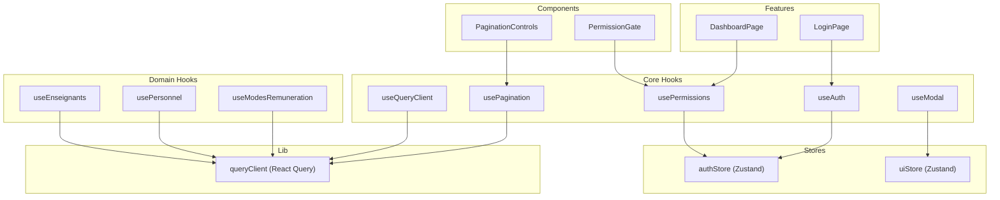
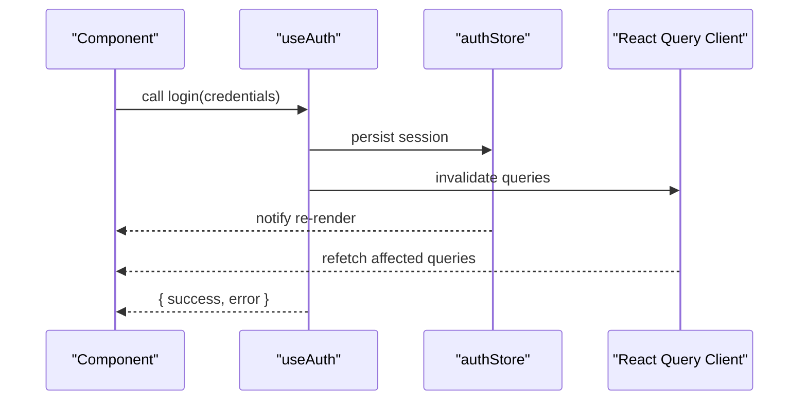
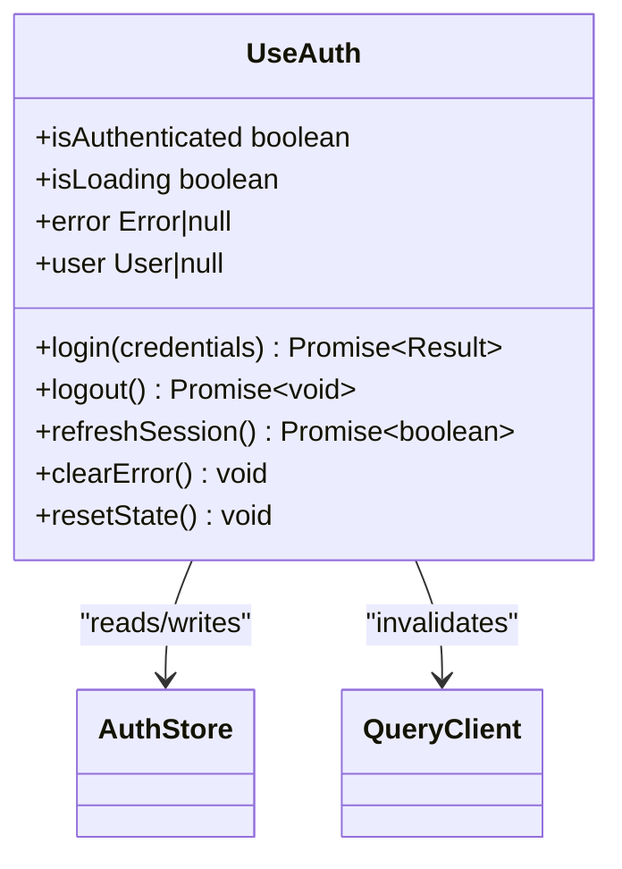
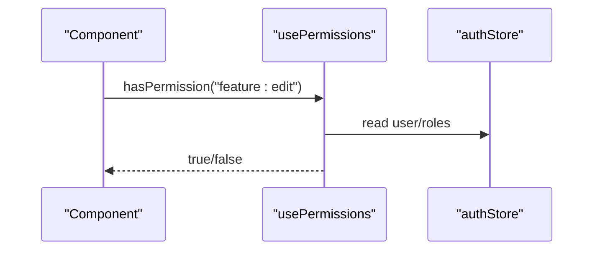
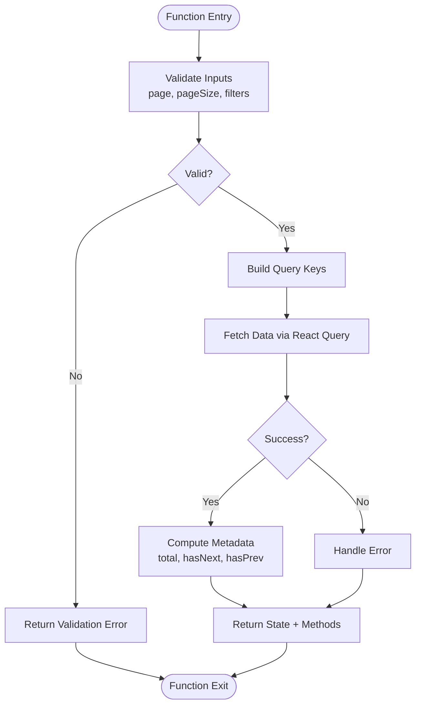
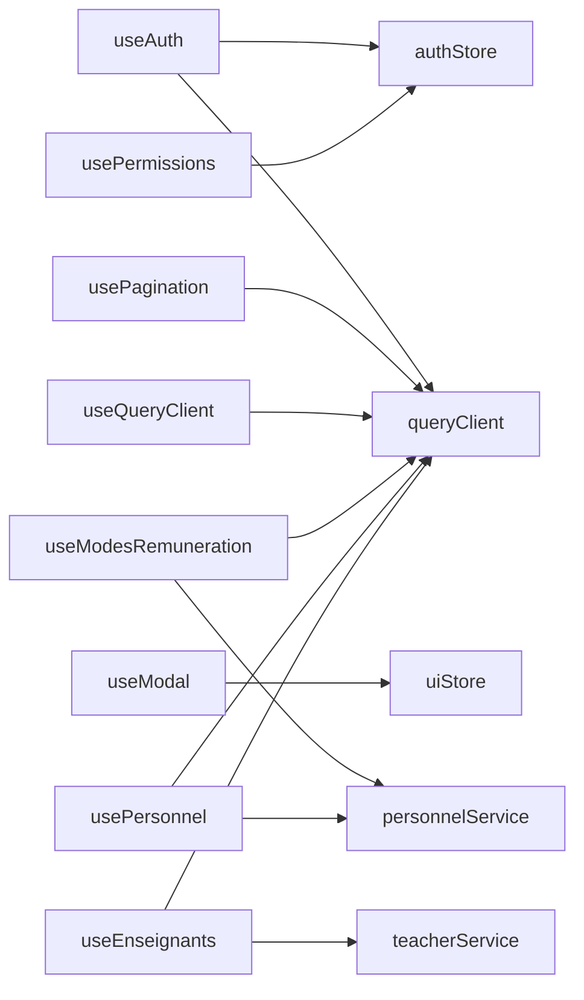

# Custom Hooks Patterns

<cite>
**Referenced Files in This Document**
- [frontend/src/hooks/useAuth.ts](file://frontend/src/hooks/useAuth.ts)
- [frontend/src/hooks/usePermissions.ts](file://frontend/src/hooks/usePermissions.ts)
- [frontend/src/hooks/usePagination.ts](file://frontend/src/hooks/usePagination.ts)
- [frontend/src/hooks/useModal.ts](file://frontend/src/hooks/useModal.ts)
- [frontend/src/hooks/useQueryClient.ts](file://frontend/src/hooks/useQueryClient.ts)
- [frontend/src/hooks/use-modes-remuneration.ts](file://frontend/src/hooks/use-modes-remuneration.ts)
- [frontend/src/hooks/use-personnel.ts](file://frontend/src/hooks/use-personnel.ts)
- [frontend/src/hooks/use-enseignants.ts](file://frontend/src/hooks/use-enseignants.ts)
- [frontend/src/stores/authStore.ts](file://frontend/src/stores/authStore.ts)
- [frontend/src/stores/uiStore.ts](file://frontend/src/stores/uiStore.ts)
- [frontend/src/lib/queryClient.ts](file://frontend/src/lib/queryClient.ts)
- [frontend/src/features/auth/login/LoginPage.tsx](file://frontend/src/features/auth/login/LoginPage.tsx)
- [frontend/src/features/dashboard/DashboardPage.tsx](file://frontend/src/features/dashboard/DashboardPage.tsx)
- [frontend/src/components/common/PaginationControls.tsx](file://frontend/src/components/common/PaginationControls.tsx)
- [frontend/src/components/common/PermissionGate.tsx](file://frontend/src/components/common/PermissionGate.tsx)
</cite>

## Update Summary
**Changes Made**
- Added documentation for new remuneration mode management hook (use-modes-remuneration.ts)
- Updated personnel-related hooks section to reflect consolidated API patterns (use-personnel.ts, use-enseignants.ts)
- Enhanced composition strategy examples with new domain-specific hooks
- Updated dependency analysis to include new personnel and remuneration hooks

## Table of Contents
1. [Introduction](#introduction)
2. [Project Structure](#project-structure)
3. [Core Components](#core-components)
4. [Architecture Overview](#architecture-overview)
5. [Detailed Component Analysis](#detailed-component-analysis)
6. [Domain-Specific Hooks](#domain-specific-hooks)
7. [Dependency Analysis](#dependency-analysis)
8. [Performance Considerations](#performance-considerations)
9. [Troubleshooting Guide](#troubleshooting-guide)
10. [Conclusion](#conclusion)
11. [Appendices](#appendices)

## Introduction
This document explains the custom hooks patterns used across the application, focusing on composition strategy, shared logic extraction, and reusable patterns for authentication, permissions, pagination, UI interactions, and domain-specific functionality like remuneration management and personnel operations. It also covers naming conventions, parameter validation, return value structures, integration with Zustand stores and React Query, lifecycle considerations, examples for creating new hooks, testing strategies, and debugging techniques.

## Project Structure
The frontend organizes reusable logic into:
- hooks: composable functions encapsulating stateful behavior and side effects
- stores: Zustand stores for global client-side state
- lib: shared libraries (e.g., React Query configuration)
- features: domain-specific pages and components that consume hooks
- components: shared UI components that may use hooks internally

[No sources needed since this diagram shows conceptual structure]

## Core Components
- Authentication hook: centralizes login/logout flows, token management, and user session state; integrates with auth store and React Query invalidation.
- Permissions hook: derives access decisions from current user roles/permissions; provides declarative checks and guards.
- Pagination hook: standardizes page size, offset/limit, sorting, filtering, and query key management; integrates with React Query for caching and refetching.
- Modal hook: manages modal visibility, data payload, and callbacks; integrates with UI store for consistent UX.
- Query client hook: exposes a typed React Query client instance to ensure consistent cache configuration and interceptors.

Key responsibilities:
- Encapsulate cross-cutting concerns (auth, permissions, pagination, UI state)
- Provide stable interfaces for components
- Coordinate with stores and React Query for performance and consistency

**Section sources**
- [frontend/src/hooks/useAuth.ts](file://frontend/src/hooks/useAuth.ts)
- [frontend/src/hooks/usePermissions.ts](file://frontend/src/hooks/usePermissions.ts)
- [frontend/src/hooks/usePagination.ts](file://frontend/src/hooks/usePagination.ts)
- [frontend/src/hooks/useModal.ts](file://frontend/src/hooks/useModal.ts)
- [frontend/src/hooks/useQueryClient.ts](file://frontend/src/hooks/useQueryClient.ts)
- [frontend/src/stores/authStore.ts](file://frontend/src/stores/authStore.ts)
- [frontend/src/stores/uiStore.ts](file://frontend/src/stores/uiStore.ts)
- [frontend/src/lib/queryClient.ts](file://frontend/src/lib/queryClient.ts)

## Architecture Overview
Custom hooks compose lower-level primitives (stores, React Query, utilities) and expose simple APIs to components. The architecture emphasizes:
- Separation of concerns: hooks handle logic; components render UI
- Composition over inheritance: small focused hooks combined as needed
- Single source of truth: Zustand stores for app-wide state; React Query for server state
- Predictable lifecycles: hooks subscribe/unsubscribe safely within component boundaries

**Diagram sources**
- [frontend/src/hooks/useAuth.ts](file://frontend/src/hooks/useAuth.ts)
- [frontend/src/stores/authStore.ts](file://frontend/src/stores/authStore.ts)
- [frontend/src/lib/queryClient.ts](file://frontend/src/lib/queryClient.ts)

## Detailed Component Analysis

### Authentication Hook (useAuth)
Responsibilities:
- Login/logout operations
- Token refresh and persistence
- Session status and user profile access
- Integration with auth store and React Query invalidation

Composition strategy:
- Reads/writes session via auth store
- Triggers query invalidation after mutations
- Exposes methods and flags for UI control

Parameter validation:
- Validates required fields before API calls
- Normalizes inputs and returns structured results

Return value structure:
- Methods: login, logout, refreshSession
- State: isAuthenticated, isLoading, error, user
- Utilities: clearError, resetState

Integration points:
- Zustand auth store for persistent session
- React Query for cache invalidation and background updates

Lifecycle considerations:
- Safe to call within any component
- Avoids memory leaks by cleaning up listeners

Testing approach:
- Mock auth store and query client
- Assert method calls and state transitions
- Validate error handling paths

Debugging tips:
- Log method entry/exit and store updates
- Inspect React Query cache keys invalidated

**Section sources**
- [frontend/src/hooks/useAuth.ts](file://frontend/src/hooks/useAuth.ts)
- [frontend/src/stores/authStore.ts](file://frontend/src/stores/authStore.ts)
- [frontend/src/lib/queryClient.ts](file://frontend/src/lib/queryClient.ts)

#### Class-like Diagram (Conceptual)

**Diagram sources**
- [frontend/src/hooks/useAuth.ts](file://frontend/src/hooks/useAuth.ts)
- [frontend/src/stores/authStore.ts](file://frontend/src/stores/authStore.ts)
- [frontend/src/lib/queryClient.ts](file://frontend/src/lib/queryClient.ts)

### Permissions Hook (usePermissions)
Responsibilities:
- Derive permission checks from current user context
- Provide granular checks (role-based or capability-based)
- Support composite rules and fallbacks

Composition strategy:
- Subscribes to auth store for user/roles
- Computes derived permissions memoized for performance
- Offers helper functions for common checks

Parameter validation:
- Ensures permission strings are non-empty
- Normalizes role names and feature identifiers

Return value structure:
- Methods: hasPermission, hasRole, canAccess
- State: permissions, roles, loading
- Utilities: resetCache, logCheck

Integration points:
- Auth store for user context
- Optional policy engine for complex rules

Lifecycle considerations:
- Recomputes only when user changes
- Safe to call frequently in render

Testing approach:
- Provide mock users and roles
- Verify derived permissions and guard outcomes

Debugging tips:
- Log permission evaluations and reasons for denial

**Section sources**
- [frontend/src/hooks/usePermissions.ts](file://frontend/src/hooks/usePermissions.ts)
- [frontend/src/stores/authStore.ts](file://frontend/src/stores/authStore.ts)

#### Sequence Diagram (Permission Check)

**Diagram sources**
- [frontend/src/hooks/usePermissions.ts](file://frontend/src/hooks/usePermissions.ts)
- [frontend/src/stores/authStore.ts](file://frontend/src/stores/authStore.ts)

### Pagination Hook (usePagination)
Responsibilities:
- Manage page size, offset/limit, sorting, and filters
- Build query keys and options for React Query
- Provide navigation helpers and metadata

Composition strategy:
- Encapsulates pagination state and transforms
- Integrates with React Query for caching and refetching
- Exposes stable API for list views

Parameter validation:
- Validates numeric bounds and sorts
- Normalizes filter objects

Return value structure:
- State: page, pageSize, total, hasNext, hasPrev
- Methods: goTo, setPageSize, applyFilters, reset
- Query options: queryKey, queryOptions

Integration points:
- React Query client for data fetching and caching
- Optional URL sync for shareable links

Lifecycle considerations:
- Resets on filter changes
- Debounces rapid page changes if needed

Testing approach:
- Mock React Query responses
- Assert query keys and refetch triggers

Debugging tips:
- Inspect query keys and cache entries
- Log pagination transitions

**Section sources**
- [frontend/src/hooks/usePagination.ts](file://frontend/src/hooks/usePagination.ts)
- [frontend/src/lib/queryClient.ts](file://frontend/src/lib/queryClient.ts)

#### Flowchart (Pagination Logic)

**Diagram sources**
- [frontend/src/hooks/usePagination.ts](file://frontend/src/hooks/usePagination.ts)
- [frontend/src/lib/queryClient.ts](file://frontend/src/lib/queryClient.ts)

### Modal Hook (useModal)
Responsibilities:
- Control modal visibility and payload
- Provide open/close/toggle methods
- Integrate with UI store for global modal state

Composition strategy:
- Wraps uiStore modal slice
- Exposes imperative methods and reactive state

Parameter validation:
- Validates modal id and payload types

Return value structure:
- State: isOpen, modalId, data
- Methods: open, close, toggle, setData

Integration points:
- uiStore for centralized modal management

Lifecycle considerations:
- Cleans up listeners on unmount
- Prevents duplicate modals

Testing approach:
- Mock uiStore
- Assert open/close and payload propagation

Debugging tips:
- Log modal lifecycle events

**Section sources**
- [frontend/src/hooks/useModal.ts](file://frontend/src/hooks/useModal.ts)
- [frontend/src/stores/uiStore.ts](file://frontend/src/stores/uiStore.ts)

### Query Client Hook (useQueryClient)
Responsibilities:
- Provide typed access to React Query client
- Ensure consistent cache configuration and interceptors

Composition strategy:
- Returns configured client instance
- Optionally wraps with logging or metrics

Parameter validation:
- None (returns singleton)

Return value structure:
- Client instance with methods like invalidateQueries, getQueryData

Integration points:
- Central queryClient configuration

Lifecycle considerations:
- Singleton pattern ensures single instance

Testing approach:
- Replace client with mock for tests

Debugging tips:
- Enable query logs during development

**Section sources**
- [frontend/src/hooks/useQueryClient.ts](file://frontend/src/hooks/useQueryClient.ts)
- [frontend/src/lib/queryClient.ts](file://frontend/src/lib/queryClient.ts)

## Domain-Specific Hooks

### Remuneration Mode Management Hook (useModesRemuneration)
**New** - Added to support remuneration mode management functionality

Responsibilities:
- Manage remuneration modes and their configurations
- Handle CRUD operations for remuneration modes
- Provide filtering and search capabilities for remuneration data
- Integrate with React Query for caching and real-time updates

Composition strategy:
- Leverages React Query for data fetching and caching
- Implements standardized pagination and filtering patterns
- Provides type-safe API for remuneration mode operations
- Integrates with existing authentication and permission systems

Parameter validation:
- Validates remuneration mode parameters and filters
- Ensures proper data types for API requests
- Handles edge cases and error conditions

Return value structure:
- State: modes, loading, error, pagination
- Methods: createMode, updateMode, deleteMode, searchModes
- Utilities: resetCache, clearErrors, exportData

Integration points:
- React Query for server state management
- Authentication system for access control
- Permission system for operation authorization

Lifecycle considerations:
- Automatic cache invalidation on mutations
- Optimistic updates where appropriate
- Proper cleanup of subscriptions and listeners

Testing approach:
- Mock React Query responses and mutations
- Test CRUD operations and error handling
- Validate permission-based access controls

Debugging tips:
- Monitor React Query cache and network requests
- Log operation failures and retry attempts
- Track permission denials and access issues

**Section sources**
- [frontend/src/hooks/use-modes-remuneration.ts](file://frontend/src/hooks/use-modes-remuneration.ts)

### Personnel Management Hooks (usePersonnel, useEnseignants)
**Updated** - Enhanced for consolidated personnel APIs

Responsibilities:
- Consolidated personnel data management and operations
- Specialized teacher (enseignant) management with enhanced features
- Unified API patterns for personnel-related operations
- Advanced filtering, search, and bulk operations

Composition strategy:
- Unified approach to personnel data access
- Shared base functionality with specialized extensions
- Consistent error handling and loading states
- Integrated with existing authentication and permission systems

Parameter validation:
- Standardized validation for personnel queries
- Type-safe filtering and search parameters
- Bulk operation validation and batch processing

Return value structure:
- Common state: personnel, enseignants, loading, error
- Shared methods: create, update, delete, search
- Specialized methods for teacher-specific operations
- Utilities for data transformation and export

Integration points:
- Consolidated personnel API endpoints
- React Query for optimized data fetching
- Existing permission system for access control
- Integration with other personnel-related modules

Lifecycle considerations:
- Efficient caching strategies for large datasets
- Optimistic updates for better UX
- Proper error recovery and retry mechanisms

Testing approach:
- Mock consolidated API responses
- Test both general personnel and teacher-specific operations
- Validate data transformations and business logic

Debugging tips:
- Monitor consolidated API calls and responses
- Track data synchronization between related entities
- Debug permission issues for personnel operations

**Section sources**
- [frontend/src/hooks/use-personnel.ts](file://frontend/src/hooks/use-personnel.ts)
- [frontend/src/hooks/use-enseignants.ts](file://frontend/src/hooks/use-enseignants.ts)

## Dependency Analysis
Custom hooks depend on:
- Zustand stores for global state
- React Query for server state and caching
- Shared utilities for validation and formatting
- Domain-specific services for specialized operations

**Diagram sources**
- [frontend/src/hooks/useAuth.ts](file://frontend/src/hooks/useAuth.ts)
- [frontend/src/hooks/usePermissions.ts](file://frontend/src/hooks/usePermissions.ts)
- [frontend/src/hooks/usePagination.ts](file://frontend/src/hooks/usePagination.ts)
- [frontend/src/hooks/useModal.ts](file://frontend/src/hooks/useModal.ts)
- [frontend/src/hooks/useQueryClient.ts](file://frontend/src/hooks/useQueryClient.ts)
- [frontend/src/hooks/use-modes-remuneration.ts](file://frontend/src/hooks/use-modes-remuneration.ts)
- [frontend/src/hooks/use-personnel.ts](file://frontend/src/hooks/use-personnel.ts)
- [frontend/src/hooks/use-enseignants.ts](file://frontend/src/hooks/use-enseignants.ts)
- [frontend/src/stores/authStore.ts](file://frontend/src/stores/authStore.ts)
- [frontend/src/stores/uiStore.ts](file://frontend/src/stores/uiStore.ts)
- [frontend/src/lib/queryClient.ts](file://frontend/src/lib/queryClient.ts)

**Section sources**
- [frontend/src/hooks/useAuth.ts](file://frontend/src/hooks/useAuth.ts)
- [frontend/src/hooks/usePermissions.ts](file://frontend/src/hooks/usePermissions.ts)
- [frontend/src/hooks/usePagination.ts](file://frontend/src/hooks/usePagination.ts)
- [frontend/src/hooks/useModal.ts](file://frontend/src/hooks/useModal.ts)
- [frontend/src/hooks/useQueryClient.ts](file://frontend/src/hooks/useQueryClient.ts)
- [frontend/src/hooks/use-modes-remuneration.ts](file://frontend/src/hooks/use-modes-remuneration.ts)
- [frontend/src/hooks/use-personnel.ts](file://frontend/src/hooks/use-personnel.ts)
- [frontend/src/hooks/use-enseignants.ts](file://frontend/src/hooks/use-enseignants.ts)
- [frontend/src/stores/authStore.ts](file://frontend/src/stores/authStore.ts)
- [frontend/src/stores/uiStore.ts](file://frontend/src/stores/uiStore.ts)
- [frontend/src/lib/queryClient.ts](file://frontend/src/lib/queryClient.ts)

## Performance Considerations
- Memoize derived values in hooks to avoid unnecessary recomputation
- Prefer stable query keys and minimal invalidations
- Debounce input-driven pagination/filter changes
- Batch store updates to reduce re-renders
- Use selective subscriptions in Zustand to limit scope
- Implement efficient caching strategies for large datasets in domain hooks
- Use optimistic updates for better user experience in personnel operations

## Troubleshooting Guide
Common issues and resolutions:
- Stale cache after mutations: ensure invalidation keys match query keys
- Permission denied unexpectedly: verify user roles and normalization
- Modal not closing: check store subscription cleanup
- Pagination jumps: validate page bounds and filter resets
- Memory leaks: confirm effect cleanup and listener removal
- Remuneration mode conflicts: check for duplicate mode IDs and validation errors
- Personnel data inconsistencies: verify consolidated API responses and data transformations

Diagnostic steps:
- Enable React Query devtools to inspect cache
- Add logging at hook entry/exit points
- Assert store slices for expected state transitions
- Reproduce with minimal test cases
- Monitor consolidated API calls for personnel operations
- Validate remuneration mode data integrity

**Section sources**
- [frontend/src/hooks/useAuth.ts](file://frontend/src/hooks/useAuth.ts)
- [frontend/src/hooks/usePermissions.ts](file://frontend/src/hooks/usePermissions.ts)
- [frontend/src/hooks/usePagination.ts](file://frontend/src/hooks/usePagination.ts)
- [frontend/src/hooks/useModal.ts](file://frontend/src/hooks/useModal.ts)
- [frontend/src/hooks/useQueryClient.ts](file://frontend/src/hooks/useQueryClient.ts)
- [frontend/src/hooks/use-modes-remuneration.ts](file://frontend/src/hooks/use-modes-remuneration.ts)
- [frontend/src/hooks/use-personnel.ts](file://frontend/src/hooks/use-personnel.ts)
- [frontend/src/hooks/use-enseignants.ts](file://frontend/src/hooks/use-enseignants.ts)

## Conclusion
The custom hooks layer provides a cohesive, composable foundation for authentication, permissions, pagination, UI interactions, and domain-specific functionality. By adhering to consistent naming, validation, and return structures, and integrating cleanly with Zustand and React Query, these hooks enable scalable, maintainable, and testable front-end logic. The addition of domain-specific hooks for remuneration management and consolidated personnel operations demonstrates the extensibility of the hook architecture while maintaining architectural consistency.

## Appendices

### Naming Conventions
- Prefix all custom hooks with use
- Use descriptive verbs for actions (login, open, applyFilters)
- Keep state names aligned with their purpose (isLoading, error, user)
- Domain-specific hooks should clearly indicate their business domain (useModesRemuneration, usePersonnel)

### Parameter Validation Guidelines
- Validate required fields early
- Normalize inputs to canonical forms
- Return structured errors with actionable messages
- Implement domain-specific validation rules for specialized hooks

### Return Value Structures
- Methods: imperative actions (login, open, goTo)
- State: reactive values (isAuthenticated, isOpen, page)
- Utilities: helpers (clearError, resetState)
- Domain-specific return shapes should maintain consistency with core patterns

### Creating New Custom Hooks
Steps:
- Identify shared logic and boundaries
- Choose appropriate storage (local state, store, cache)
- Define parameters and validation
- Implement return shape consistently
- Add tests and debug logs
- For domain hooks, establish clear separation from core functionality

### Testing Hooks
Approaches:
- Render hook in isolation using testing utilities
- Mock dependencies (stores, query client)
- Assert state transitions and method calls
- Simulate async flows and errors
- Test domain-specific business logic separately

### Debugging Hook Behavior
Techniques:
- Instrument entry/exit points
- Log dependency changes
- Inspect React Query cache and Zustand slices
- Use browser devtools to trace re-renders
- Monitor consolidated API calls for personnel operations
- Validate remuneration mode data integrity

### Integration Examples
- Authentication flow in login page
- Permission gating in dashboard
- Pagination controls in list views
- Remuneration mode management in finance modules
- Personnel operations in HR and teaching modules

**Section sources**
- [frontend/src/features/auth/login/LoginPage.tsx](file://frontend/src/features/auth/login/LoginPage.tsx)
- [frontend/src/features/dashboard/DashboardPage.tsx](file://frontend/src/features/dashboard/DashboardPage.tsx)
- [frontend/src/components/common/PaginationControls.tsx](file://frontend/src/components/common/PaginationControls.tsx)
- [frontend/src/components/common/PermissionGate.tsx](file://frontend/src/components/common/PermissionGate.tsx)