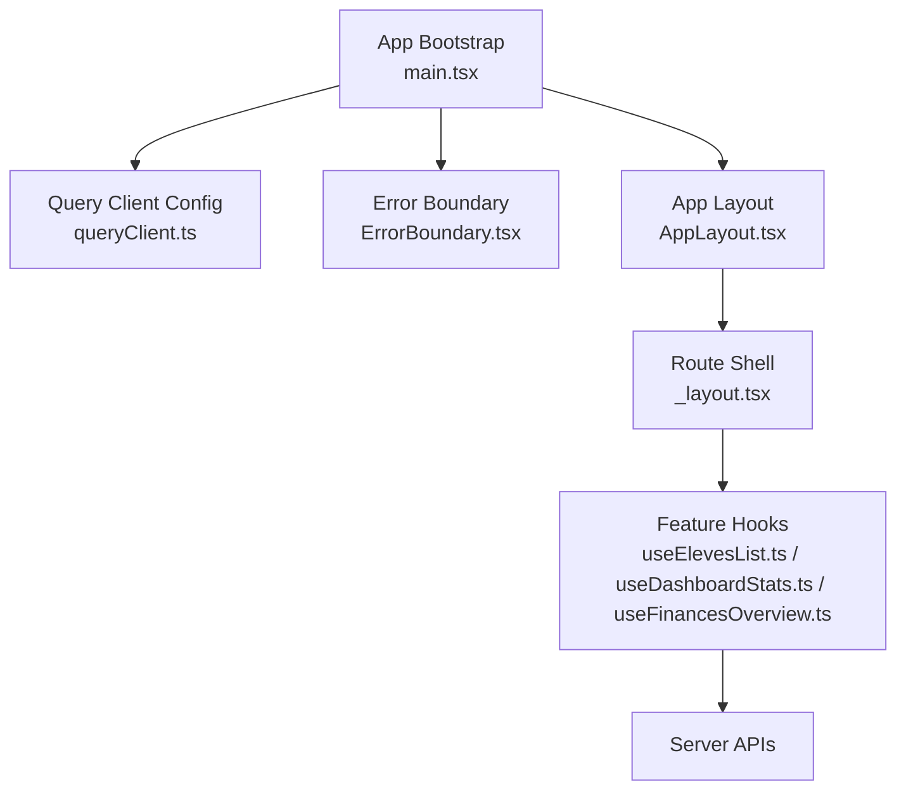
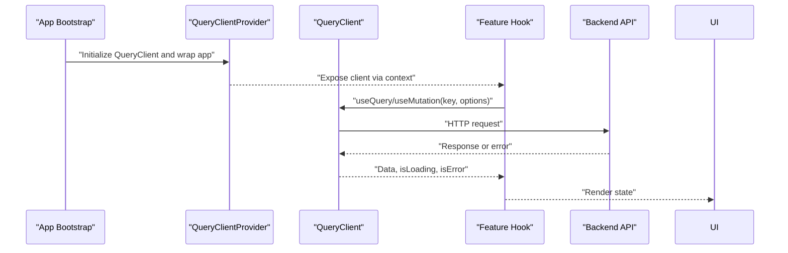
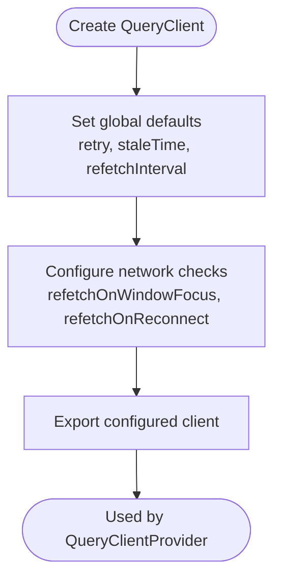
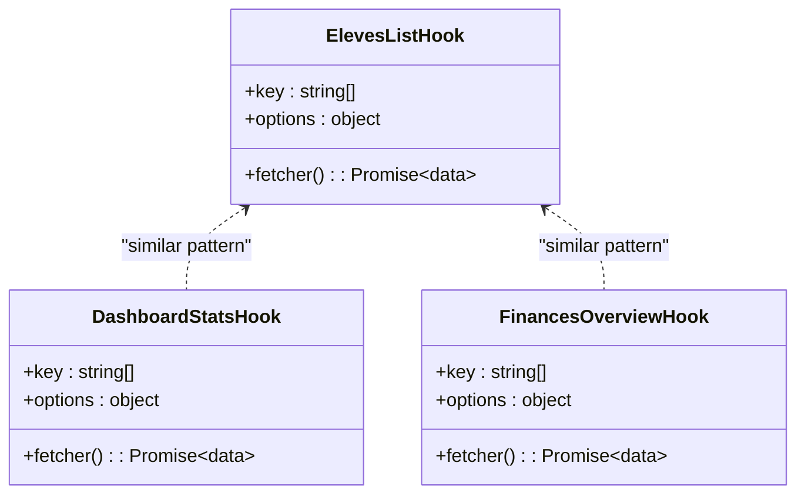
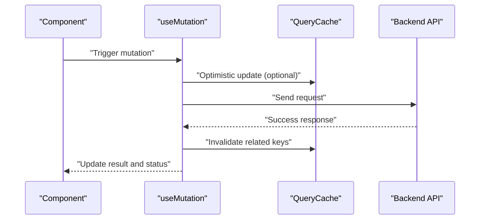
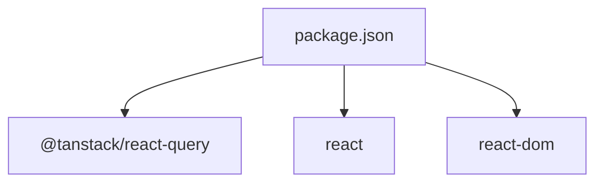

# React Query Integration

<cite>
**Referenced Files in This Document**
- [frontend/src/main.tsx](file://frontend/src/main.tsx)
- [frontend/src/lib/queryClient.ts](file://frontend/src/lib/queryClient.ts)
- [frontend/src/hooks/useAuth.ts](file://frontend/src/hooks/useAuth.ts)
- [frontend/src/features/dashboard/hooks/useDashboardStats.ts](file://frontend/src/features/dashboard/hooks/useDashboardStats.ts)
- [frontend/src/features/eleves/hooks/useElevesList.ts](file://frontend/src/features/eleves/hooks/useElevesList.ts)
- [frontend/src/features/finances/hooks/useFinancesOverview.ts](file://frontend/src/features/finances/hooks/useFinancesOverview.ts)
- [frontend/src/components/ui/ErrorBoundary.tsx](file://frontend/src/components/ui/ErrorBoundary.tsx)
- [frontend/src/components/layout/AppLayout.tsx](file://frontend/src/components/layout/AppLayout.tsx)
- [frontend/src/routes/_layout.tsx](file://frontend/src/routes/_layout.tsx)
- [frontend/package.json](file://frontend/package.json)
</cite>

## Table of Contents
1. [Introduction](#introduction)
2. [Project Structure](#project-structure)
3. [Core Components](#core-components)
4. [Architecture Overview](#architecture-overview)
5. [Detailed Component Analysis](#detailed-component-analysis)
6. [Dependency Analysis](#dependency-analysis)
7. [Performance Considerations](#performance-considerations)
8. [Troubleshooting Guide](#troubleshooting-guide)
9. [Conclusion](#conclusion)

## Introduction
This document explains how React Query (TanStack Query) is integrated across the frontend to manage server state, including query client configuration, cache strategies, global options, mutations, error boundaries, loading states, custom hooks for data fetching, key organization, invalidation patterns, optimistic updates, synchronization with the server, background refetching, and pagination. It provides architecture diagrams, code-level references, and practical guidance for consistent usage across features.

## Project Structure
The React Query integration spans a small set of core files:
- Application bootstrap initializes the QueryClient and wraps the app with QueryClientProvider.
- A dedicated module configures the QueryClient instance with defaults such as retry behavior, stale time, and network status handling.
- Feature-specific hooks encapsulate queries and mutations, organizing keys by feature and resource.
- Global UI components provide error boundaries and layout scaffolding that interact with query state.

**Diagram sources**
- [frontend/src/main.tsx](file://frontend/src/main.tsx)
- [frontend/src/lib/queryClient.ts](file://frontend/src/lib/queryClient.ts)
- [frontend/src/components/ui/ErrorBoundary.tsx](file://frontend/src/components/ui/ErrorBoundary.tsx)
- [frontend/src/components/layout/AppLayout.tsx](file://frontend/src/components/layout/AppLayout.tsx)
- [frontend/src/routes/_layout.tsx](file://frontend/src/routes/_layout.tsx)
- [frontend/src/features/eleves/hooks/useElevesList.ts](file://frontend/src/features/eleves/hooks/useElevesList.ts)
- [frontend/src/features/dashboard/hooks/useDashboardStats.ts](file://frontend/src/features/dashboard/hooks/useDashboardStats.ts)
- [frontend/src/features/finances/hooks/useFinancesOverview.ts](file://frontend/src/features/finances/hooks/useFinancesOverview.ts)

**Section sources**
- [frontend/src/main.tsx](file://frontend/src/main.tsx)
- [frontend/src/lib/queryClient.ts](file://frontend/src/lib/queryClient.ts)
- [frontend/src/components/ui/ErrorBoundary.tsx](file://frontend/src/components/ui/ErrorBoundary.tsx)
- [frontend/src/components/layout/AppLayout.tsx](file://frontend/src/components/layout/AppLayout.tsx)
- [frontend/src/routes/_layout.tsx](file://frontend/src/routes/_layout.tsx)

## Core Components
- QueryClient setup and provider initialization at application root.
- Global defaults for retries, stale times, refetch intervals, and network monitoring.
- Custom hooks per feature that centralize query keys, fetchers, and mutation logic.
- Error boundary component to catch and display query-related errors gracefully.
- Layout and route shell that ensure providers are available throughout the app.

Key responsibilities:
- Centralized configuration ensures consistent caching and refetch behavior.
- Feature hooks promote reuse, predictable key structures, and clear separation of concerns.
- Error boundaries improve resilience and user experience during failures.

**Section sources**
- [frontend/src/main.tsx](file://frontend/src/main.tsx)
- [frontend/src/lib/queryClient.ts](file://frontend/src/lib/queryClient.ts)
- [frontend/src/components/ui/ErrorBoundary.tsx](file://frontend/src/components/ui/ErrorBoundary.tsx)
- [frontend/src/components/layout/AppLayout.tsx](file://frontend/src/components/layout/AppLayout.tsx)
- [frontend/src/routes/_layout.tsx](file://frontend/src/routes/_layout.tsx)

## Architecture Overview
The following diagram shows how the app bootstraps React Query, configures the client, and uses it through feature hooks to fetch and mutate server state.

**Diagram sources**
- [frontend/src/main.tsx](file://frontend/src/main.tsx)
- [frontend/src/lib/queryClient.ts](file://frontend/src/lib/queryClient.ts)
- [frontend/src/features/eleves/hooks/useElevesList.ts](file://frontend/src/features/eleves/hooks/useElevesList.ts)
- [frontend/src/features/dashboard/hooks/useDashboardStats.ts](file://frontend/src/features/dashboard/hooks/useDashboardStats.ts)
- [frontend/src/features/finances/hooks/useFinancesOverview.ts](file://frontend/src/features/finances/hooks/useFinancesOverview.ts)

## Detailed Component Analysis

### Query Client Configuration
Responsibilities:
- Create a single QueryClient instance with global defaults.
- Configure retry policies, stale time, refetch intervals, and network status checks.
- Export the configured client for provider initialization.

Best practices:
- Keep global defaults minimal and predictable; override per-query when needed.
- Use staleTime to avoid unnecessary refetches for stable data.
- Enable refetchOnWindowFocus and refetchOnReconnect for better UX.

**Diagram sources**
- [frontend/src/lib/queryClient.ts](file://frontend/src/lib/queryClient.ts)

**Section sources**
- [frontend/src/lib/queryClient.ts](file://frontend/src/lib/queryClient.ts)

### Application Bootstrap and Provider Setup
Responsibilities:
- Initialize the QueryClient and wrap the application with QueryClientProvider.
- Ensure all routes and components have access to the client context.

Considerations:
- Place provider near the root to cover all components.
- Avoid re-initializing the client on each render.

**Section sources**
- [frontend/src/main.tsx](file://frontend/src/main.tsx)
- [frontend/src/routes/_layout.tsx](file://frontend/src/routes/_layout.tsx)

### Error Boundary Integration
Responsibilities:
- Catch rendering and query-related errors.
- Provide fallback UI and recovery actions.

Integration points:
- Wrap critical sections or the entire app to prevent crashes.
- Display actionable messages and allow retry flows.

**Section sources**
- [frontend/src/components/ui/ErrorBoundary.tsx](file://frontend/src/components/ui/ErrorBoundary.tsx)

### App Layout and Route Shell
Responsibilities:
- Provide shared layout structure and ensure providers are present.
- Coordinate navigation and global UI state alongside query state.

**Section sources**
- [frontend/src/components/layout/AppLayout.tsx](file://frontend/src/components/layout/AppLayout.tsx)
- [frontend/src/routes/_layout.tsx](file://frontend/src/routes/_layout.tsx)

### Custom Hooks for Data Fetching
Patterns:
- Organize query keys by feature and resource, e.g., ["eleves", "list", { filters }].
- Encapsulate fetchers and options within hooks to keep components clean.
- Separate read-only queries from write operations (mutations).

Examples:
- Eleves list hook for paginated or filtered lists.
- Dashboard stats hook for aggregated metrics.
- Finances overview hook for financial summaries.

**Diagram sources**
- [frontend/src/features/eleves/hooks/useElevesList.ts](file://frontend/src/features/eleves/hooks/useElevesList.ts)
- [frontend/src/features/dashboard/hooks/useDashboardStats.ts](file://frontend/src/features/dashboard/hooks/useDashboardStats.ts)
- [frontend/src/features/finances/hooks/useFinancesOverview.ts](file://frontend/src/features/finances/hooks/useFinancesOverview.ts)

**Section sources**
- [frontend/src/features/eleves/hooks/useElevesList.ts](file://frontend/src/features/eleves/hooks/useElevesList.ts)
- [frontend/src/features/dashboard/hooks/useDashboardStats.ts](file://frontend/src/features/dashboard/hooks/useDashboardStats.ts)
- [frontend/src/features/finances/hooks/useFinancesOverview.ts](file://frontend/src/features/finances/hooks/useFinancesOverview.ts)

### Mutation Handling Patterns
Guidelines:
- Use mutations for create/update/delete operations.
- Invalidate affected query keys after successful mutations to refresh data.
- Handle optimistic updates by temporarily updating cache while awaiting server confirmation.

Flow:

**Diagram sources**
- [frontend/src/features/eleves/hooks/useElevesList.ts](file://frontend/src/features/eleves/hooks/useElevesList.ts)
- [frontend/src/features/finances/hooks/useFinancesOverview.ts](file://frontend/src/features/finances/hooks/useFinancesOverview.ts)

**Section sources**
- [frontend/src/features/eleves/hooks/useElevesList.ts](file://frontend/src/features/eleves/hooks/useElevesList.ts)
- [frontend/src/features/finances/hooks/useFinancesOverview.ts](file://frontend/src/features/finances/hooks/useFinancesOverview.ts)

### Loading States and User Feedback
Recommendations:
- Use isLoading and isFetching flags to show spinners or skeletons.
- Differentiate between initial load and background refetches.
- Provide meaningful feedback for long-running operations.

**Section sources**
- [frontend/src/features/dashboard/hooks/useDashboardStats.ts](file://frontend/src/features/dashboard/hooks/useDashboardStats.ts)
- [frontend/src/features/eleves/hooks/useElevesList.ts](file://frontend/src/features/eleves/hooks/useElevesList.ts)

### Query Key Organization and Invalidation Strategies
Principles:
- Use arrays for keys to encode parameters and scope.
- Group keys by feature/resource and include filter/pagination variables.
- Invalidate specific keys after mutations to keep cache coherent.

Example strategy:
- ["eleves", "list", { page, limit, filters }]
- ["dashboard", "stats", { period }]
- ["finances", "overview", { year }]

**Section sources**
- [frontend/src/features/eleves/hooks/useElevesList.ts](file://frontend/src/features/eleves/hooks/useElevesList.ts)
- [frontend/src/features/dashboard/hooks/useDashboardStats.ts](file://frontend/src/features/dashboard/hooks/useDashboardStats.ts)
- [frontend/src/features/finances/hooks/useFinancesOverview.ts](file://frontend/src/features/finances/hooks/useFinancesOverview.ts)

### Optimistic Updates
Approach:
- Update cache immediately with expected results.
- On success, finalize changes; on failure, revert to previous state.
- Combine with invalidation to ensure consistency.

**Section sources**
- [frontend/src/features/eleves/hooks/useElevesList.ts](file://frontend/src/features/eleves/hooks/useElevesList.ts)
- [frontend/src/features/finances/hooks/useFinancesOverview.ts](file://frontend/src/features/finances/hooks/useFinancesOverview.ts)

### Server State Synchronization and Background Refetching
Strategies:
- Set appropriate staleTime to balance freshness and performance.
- Enable refetchOnWindowFocus and refetchOnReconnect for automatic sync.
- Use polling for frequently changing data where necessary.

**Section sources**
- [frontend/src/lib/queryClient.ts](file://frontend/src/lib/queryClient.ts)
- [frontend/src/features/dashboard/hooks/useDashboardStats.ts](file://frontend/src/features/dashboard/hooks/useDashboardStats.ts)

### Pagination Patterns
Implementation tips:
- Include page and limit in query keys.
- Use infinite queries for cursor-based or offset-based pagination.
- Preload next pages on scroll or button clicks.

**Section sources**
- [frontend/src/features/eleves/hooks/useElevesList.ts](file://frontend/src/features/eleves/hooks/useElevesList.ts)

### Authentication Integration
Guidance:
- Attach tokens to requests via an HTTP interceptor or base URL configuration.
- Invalidate auth-related queries on login/logout.
- Guard protected routes based on authentication state.

**Section sources**
- [frontend/src/hooks/useAuth.ts](file://frontend/src/hooks/useAuth.ts)
- [frontend/src/routes/_layout.tsx](file://frontend/src/routes/_layout.tsx)

## Dependency Analysis
React Query dependencies are declared in the frontend package manifest. The integration relies on TanStack Query packages and standard React runtime.

**Diagram sources**
- [frontend/package.json](file://frontend/package.json)

**Section sources**
- [frontend/package.json](file://frontend/package.json)

## Performance Considerations
- Prefer higher staleTime for rarely changing data to reduce network calls.
- Use selective invalidation to minimize cache churn.
- Leverage skeleton loaders instead of full-page spinners for perceived performance.
- Debounce search inputs and combine with query deduplication.
- Monitor memory usage with large datasets; consider virtualization for lists.

[No sources needed since this section provides general guidance]

## Troubleshooting Guide
Common issues and resolutions:
- Stale data not refreshing: verify invalidation keys and mutation callbacks.
- Excessive refetches: adjust staleTime and refetch intervals.
- Errors not surfaced: ensure error boundary is wrapping relevant components.
- Authentication failures: check token attachment and invalidate auth queries on logout.

Diagnostic steps:
- Inspect query keys and options in devtools.
- Log mutation outcomes and cache updates.
- Validate network interceptors and error mapping.

**Section sources**
- [frontend/src/components/ui/ErrorBoundary.tsx](file://frontend/src/components/ui/ErrorBoundary.tsx)
- [frontend/src/lib/queryClient.ts](file://frontend/src/lib/queryClient.ts)
- [frontend/src/hooks/useAuth.ts](file://frontend/src/hooks/useAuth.ts)

## Conclusion
By centralizing QueryClient configuration, organizing query keys consistently, and encapsulating data access in feature hooks, the application achieves predictable caching, efficient refetching, and robust error handling. Mutations with invalidation and optional optimistic updates keep the UI responsive and synchronized with the server. Error boundaries and thoughtful loading states enhance reliability and user experience.

[No sources needed since this section summarizes without analyzing specific files]