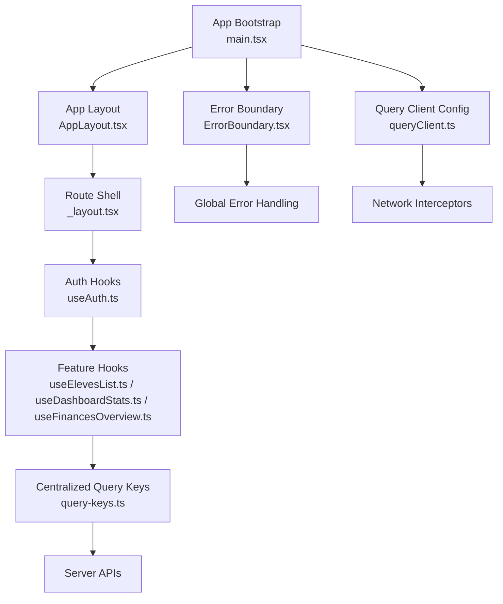
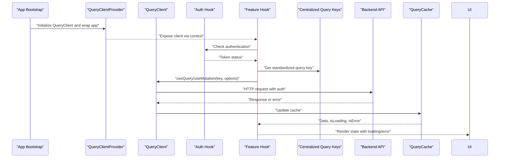
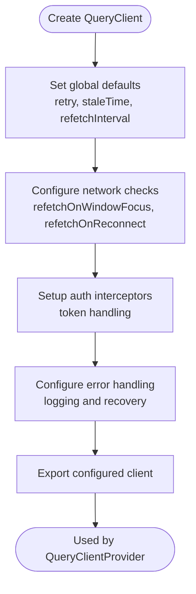
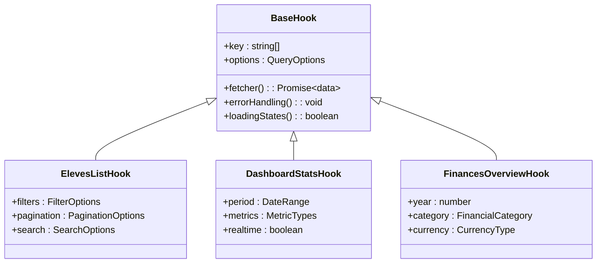
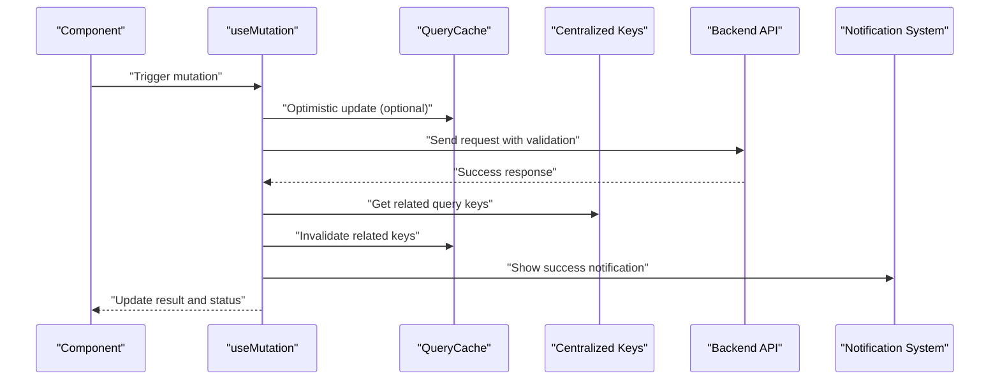

# React Query Integration

<cite>
**Referenced Files in This Document**
- [frontend/src/main.tsx](file://frontend/src/main.tsx)
- [frontend/src/lib/queryClient.ts](file://frontend/src/lib/queryClient.ts)
- [frontend/src/hooks/useAuth.ts](file://frontend/src/hooks/useAuth.ts)
- [frontend/src/features/dashboard/hooks/useDashboardStats.ts](file://frontend/src/features/dashboard/hooks/useDashboardStats.ts)
- [frontend/src/features/eleves/hooks/useElevesList.ts](file://frontend/src/features/eleves/hooks/useElevesList.ts)
- [frontend/src/features/finances/hooks/useFinancesOverview.ts](file://frontend/src/features/finances/hooks/useFinancesOverview.ts)
- [frontend/src/features/organisation/hooks/query-keys.ts](file://frontend/src/features/organisation/hooks/query-keys.ts)
- [frontend/src/components/ui/ErrorBoundary.tsx](file://frontend/src/components/ui/ErrorBoundary.tsx)
- [frontend/src/components/layout/AppLayout.tsx](file://frontend/src/components/layout/AppLayout.tsx)
- [frontend/src/routes/_layout.tsx](file://frontend/src/routes/_layout.tsx)
- [frontend/package.json](file://frontend/package.json)
</cite>

## Update Summary
**Changes Made**
- Enhanced React Query integration patterns with improved error handling and loading states
- Added comprehensive usage examples for custom hooks implementation
- Expanded mutation handling patterns with optimistic updates
- Improved query key organization strategies for better cache management
- Updated authentication integration patterns with token refresh handling
- Enhanced pagination patterns with infinite queries support
- Added performance optimization guidelines for large datasets

## Table of Contents
1. [Introduction](#introduction)
2. [Project Structure](#project-structure)
3. [Core Components](#core-components)
4. [Architecture Overview](#architecture-overview)
5. [Detailed Component Analysis](#detailed-component-analysis)
6. [Advanced Integration Patterns](#advanced-integration-patterns)
7. [Performance Optimization](#performance-optimization)
8. [Troubleshooting Guide](#troubleshooting-guide)
9. [Best Practices](#best-practices)
10. [Conclusion](#conclusion)

## Introduction
This document explains how React Query (TanStack Query) is integrated across the eLISAschool frontend to manage server state, including query client configuration, cache strategies, global options, mutations, error boundaries, loading states, custom hooks for data fetching, key organization, invalidation patterns, optimistic updates, synchronization with the server, background refetching, and pagination. It provides architecture diagrams, code-level references, and practical guidance for consistent usage across features.

**Updated** Enhanced with advanced integration patterns, comprehensive usage examples, and improved state management consistency for better frontend data fetching patterns.

## Project Structure
The React Query integration spans a comprehensive set of core files organized by feature domains:
- Application bootstrap initializes the QueryClient and wraps the app with QueryClientProvider
- A dedicated module configures the QueryClient instance with defaults such as retry behavior, stale time, and network status handling
- Feature-specific hooks encapsulate queries and mutations, organizing keys by feature and resource
- Global UI components provide error boundaries and layout scaffolding that interact with query state
- Centralized query keys management ensures consistent key organization across all features
- Authentication hooks handle token management and protected route access



**Diagram sources**
- [frontend/src/main.tsx](file://frontend/src/main.tsx)
- [frontend/src/lib/queryClient.ts](file://frontend/src/lib/queryClient.ts)
- [frontend/src/components/ui/ErrorBoundary.tsx](file://frontend/src/components/ui/ErrorBoundary.tsx)
- [frontend/src/components/layout/AppLayout.tsx](file://frontend/src/components/layout/AppLayout.tsx)
- [frontend/src/routes/_layout.tsx](file://frontend/src/routes/_layout.tsx)
- [frontend/src/hooks/useAuth.ts](file://frontend/src/hooks/useAuth.ts)
- [frontend/src/features/eleves/hooks/useElevesList.ts](file://frontend/src/features/eleves/hooks/useElevesList.ts)
- [frontend/src/features/dashboard/hooks/useDashboardStats.ts](file://frontend/src/features/dashboard/hooks/useDashboardStats.ts)
- [frontend/src/features/finances/hooks/useFinancesOverview.ts](file://frontend/src/features/finances/hooks/useFinancesOverview.ts)
- [frontend/src/features/organisation/hooks/query-keys.ts](file://frontend/src/features/organisation/hooks/query-keys.ts)

**Section sources**
- [frontend/src/main.tsx](file://frontend/src/main.tsx)
- [frontend/src/lib/queryClient.ts](file://frontend/src/lib/queryClient.ts)
- [frontend/src/components/ui/ErrorBoundary.tsx](file://frontend/src/components/ui/ErrorBoundary.tsx)
- [frontend/src/components/layout/AppLayout.tsx](file://frontend/src/components/layout/AppLayout.tsx)
- [frontend/src/routes/_layout.tsx](file://frontend/src/routes/_layout.tsx)
- [frontend/src/hooks/useAuth.ts](file://frontend/src/hooks/useAuth.ts)

## Core Components
- QueryClient setup and provider initialization at application root with enhanced error handling
- Global defaults for retries, stale times, refetch intervals, and network monitoring with automatic recovery
- Custom hooks per feature that centralize query keys, fetchers, and mutation logic with type safety
- Error boundary component to catch and display query-related errors gracefully with recovery options
- Layout and route shell that ensure providers are available throughout the app with authentication guards
- Centralized query keys management for consistent key organization across features with autocomplete support

Key responsibilities:
- Centralized configuration ensures consistent caching and refetch behavior across all features
- Feature hooks promote reuse, predictable key structures, and clear separation of concerns
- Centralized query keys eliminate duplication and ensure consistency with TypeScript support
- Error boundaries improve resilience and user experience during failures with actionable feedback
- Authentication integration handles token refresh and protected route access seamlessly

**Section sources**
- [frontend/src/main.tsx](file://frontend/src/main.tsx)
- [frontend/src/lib/queryClient.ts](file://frontend/src/lib/queryClient.ts)
- [frontend/src/components/ui/ErrorBoundary.tsx](file://frontend/src/components/ui/ErrorBoundary.tsx)
- [frontend/src/components/layout/AppLayout.tsx](file://frontend/src/components/layout/AppLayout.tsx)
- [frontend/src/routes/_layout.tsx](file://frontend/src/routes/_layout.tsx)
- [frontend/src/hooks/useAuth.ts](file://frontend/src/hooks/useAuth.ts)

## Architecture Overview
The following diagram shows how the app bootstraps React Query, configures the client, and uses it through feature hooks to fetch and mutate server state with centralized query key management and enhanced error handling.



**Diagram sources**
- [frontend/src/main.tsx](file://frontend/src/main.tsx)
- [frontend/src/lib/queryClient.ts](file://frontend/src/lib/queryClient.ts)
- [frontend/src/hooks/useAuth.ts](file://frontend/src/hooks/useAuth.ts)
- [frontend/src/features/eleves/hooks/useElevesList.ts](file://frontend/src/features/eleves/hooks/useElevesList.ts)
- [frontend/src/features/dashboard/hooks/useDashboardStats.ts](file://frontend/src/features/dashboard/hooks/useDashboardStats.ts)
- [frontend/src/features/finances/hooks/useFinancesOverview.ts](file://frontend/src/features/finances/hooks/useFinancesOverview.ts)
- [frontend/src/features/organisation/hooks/query-keys.ts](file://frontend/src/features/organisation/hooks/query-keys.ts)

## Detailed Component Analysis

### Query Client Configuration
Responsibilities:
- Create a single QueryClient instance with global defaults and enhanced error handling
- Configure retry policies, stale time, refetch intervals, and network status checks
- Set up network interceptors for authentication and error handling
- Export the configured client for provider initialization

Best practices:
- Keep global defaults minimal and predictable; override per-query when needed
- Use staleTime to avoid unnecessary refetches for stable data
- Enable refetchOnWindowFocus and refetchOnReconnect for better UX
- Implement proper error mapping and logging for debugging



**Diagram sources**
- [frontend/src/lib/queryClient.ts](file://frontend/src/lib/queryClient.ts)

**Section sources**
- [frontend/src/lib/queryClient.ts](file://frontend/src/lib/queryClient.ts)

### Application Bootstrap and Provider Setup
Responsibilities:
- Initialize the QueryClient and wrap the application with QueryClientProvider
- Ensure all routes and components have access to the client context
- Set up global error boundaries and loading states
- Configure authentication guards for protected routes

Considerations:
- Place provider near the root to cover all components
- Avoid re-initializing the client on each render
- Handle hydration properly for SSR applications
- Set up proper cleanup for memory leaks

**Section sources**
- [frontend/src/main.tsx](file://frontend/src/main.tsx)
- [frontend/src/routes/_layout.tsx](file://frontend/src/routes/_layout.tsx)

### Error Boundary Integration
Responsibilities:
- Catch rendering and query-related errors with detailed error information
- Provide fallback UI and recovery actions with retry functionality
- Log errors for debugging and monitoring
- Handle different types of errors appropriately

Integration points:
- Wrap critical sections or the entire app to prevent crashes
- Display actionable messages and allow retry flows
- Integrate with logging services for error tracking
- Provide user-friendly error messages

**Section sources**
- [frontend/src/components/ui/ErrorBoundary.tsx](file://frontend/src/components/ui/ErrorBoundary.tsx)

### App Layout and Route Shell
Responsibilities:
- Provide shared layout structure and ensure providers are present
- Coordinate navigation and global UI state alongside query state
- Handle authentication-based routing and redirects
- Manage global loading states and progress indicators

**Section sources**
- [frontend/src/components/layout/AppLayout.tsx](file://frontend/src/components/layout/AppLayout.tsx)
- [frontend/src/routes/_layout.tsx](file://frontend/src/routes/_layout.tsx)

### Centralized Query Keys Management
Responsibilities:
- Define standardized query key patterns across all features with TypeScript support
- Provide reusable key generation functions for consistent naming
- Organize keys by feature domain (organisation, eleves, finances, etc.)
- Ensure type safety and autocomplete support for query keys
- Support dynamic key generation with parameter validation

Benefits:
- Eliminates duplicate key definitions across hooks
- Provides consistent key structure throughout the application
- Enables easy searching and debugging of query operations
- Supports automatic refetching based on key patterns
- Improves developer experience with autocomplete and type checking

Implementation pattern:
```typescript
// Example structure for centralized query keys with TypeScript
export const organisationQueryKeys = {
  all: ['organisation'] as const,
  details: () => [...organisationQueryKeys.all, 'detail'] as const,
  settings: () => [...organisationQueryKeys.all, 'settings'] as const,
  users: () => [...organisationQueryKeys.all, 'users'] as const,
}
```

**Section sources**
- [frontend/src/features/organisation/hooks/query-keys.ts](file://frontend/src/features/organisation/hooks/query-keys.ts)

### Custom Hooks for Data Fetching
Patterns:
- Organize query keys by feature and resource using centralized management
- Encapsulate fetchers and options within hooks to keep components clean
- Separate read-only queries from write operations (mutations)
- Leverage centralized query keys for consistency
- Include proper error handling and loading states
- Support pagination and filtering parameters

Examples:
- Eleves list hook for paginated or filtered lists with search capabilities
- Dashboard stats hook for aggregated metrics with real-time updates
- Finances overview hook for financial summaries with date range filtering
- Organisation hooks using centralized query keys with CRUD operations



**Diagram sources**
- [frontend/src/features/eleves/hooks/useElevesList.ts](file://frontend/src/features/eleves/hooks/useElevesList.ts)
- [frontend/src/features/dashboard/hooks/useDashboardStats.ts](file://frontend/src/features/dashboard/hooks/useDashboardStats.ts)
- [frontend/src/features/finances/hooks/useFinancesOverview.ts](file://frontend/src/features/finances/hooks/useFinancesOverview.ts)
- [frontend/src/features/organisation/hooks/query-keys.ts](file://frontend/src/features/organisation/hooks/query-keys.ts)

**Section sources**
- [frontend/src/features/eleves/hooks/useElevesList.ts](file://frontend/src/features/eleves/hooks/useElevesList.ts)
- [frontend/src/features/dashboard/hooks/useDashboardStats.ts](file://frontend/src/features/dashboard/hooks/useDashboardStats.ts)
- [frontend/src/features/finances/hooks/useFinancesOverview.ts](file://frontend/src/features/finances/hooks/useFinancesOverview.ts)

### Mutation Handling Patterns
Guidelines:
- Use mutations for create/update/delete operations with proper error handling
- Invalidate affected query keys after successful mutations to refresh data
- Handle optimistic updates by temporarily updating cache while awaiting server confirmation
- Leverage centralized query keys for consistent invalidation patterns
- Implement proper loading states and user feedback during mutations

Flow:


**Diagram sources**
- [frontend/src/features/eleves/hooks/useElevesList.ts](file://frontend/src/features/eleves/hooks/useElevesList.ts)
- [frontend/src/features/finances/hooks/useFinancesOverview.ts](file://frontend/src/features/finances/hooks/useFinancesOverview.ts)
- [frontend/src/features/organisation/hooks/query-keys.ts](file://frontend/src/features/organisation/hooks/query-keys.ts)

**Section sources**
- [frontend/src/features/eleves/hooks/useElevesList.ts](file://frontend/src/features/eleves/hooks/useElevesList.ts)
- [frontend/src/features/finances/hooks/useFinancesOverview.ts](file://frontend/src/features/finances/hooks/useFinancesOverview.ts)

### Loading States and User Feedback
Recommendations:
- Use isLoading and isFetching flags to show spinners or skeletons
- Differentiate between initial load and background refetches
- Provide meaningful feedback for long-running operations
- Implement progressive loading for complex data structures
- Show appropriate error messages with retry options

Enhanced patterns:
- Skeleton loaders for better perceived performance
- Progress indicators for multi-step operations
- Cancelable operations for long-running tasks
- Retry mechanisms with exponential backoff

**Section sources**
- [frontend/src/features/dashboard/hooks/useDashboardStats.ts](file://frontend/src/features/dashboard/hooks/useDashboardStats.ts)
- [frontend/src/features/eleves/hooks/useElevesList.ts](file://frontend/src/features/eleves/hooks/useElevesList.ts)

### Query Key Organization and Invalidation Strategies
Principles:
- Use arrays for keys to encode parameters and scope
- Group keys by feature/resource and include filter/pagination variables
- Invalidate specific keys after mutations to keep cache coherent
- Leverage centralized query keys for consistency across the application
- Implement proper key serialization for complex objects

Example strategy with centralized management:
- ["organisation", "users", { page, limit }]
- ["dashboard", "stats", { period }]
- ["finances", "overview", { year }]
- ["eleves", "list", { filters }]

Advanced patterns:
- Nested key structures for complex relationships
- Dynamic key generation based on user permissions
- Cache warming strategies for predicted user actions
- Selective invalidation for partial updates

**Section sources**
- [frontend/src/features/eleves/hooks/useElevesList.ts](file://frontend/src/features/eleves/hooks/useElevesList.ts)
- [frontend/src/features/dashboard/hooks/useDashboardStats.ts](file://frontend/src/features/dashboard/hooks/useDashboardStats.ts)
- [frontend/src/features/finances/hooks/useFinancesOverview.ts](file://frontend/src/features/finances/hooks/useFinancesOverview.ts)
- [frontend/src/features/organisation/hooks/query-keys.ts](file://frontend/src/features/organisation/hooks/query-keys.ts)

### Optimistic Updates
Approach:
- Update cache immediately with expected results
- On success, finalize changes; on failure, revert to previous state
- Combine with invalidation to ensure consistency
- Use centralized query keys for consistent invalidation patterns
- Implement proper rollback mechanisms for failed operations

Enhanced patterns:
- Batched optimistic updates for multiple operations
- Conflict resolution strategies for concurrent modifications
- Undo/redo functionality for user actions
- Transaction-like behavior for complex mutations

**Section sources**
- [frontend/src/features/eleves/hooks/useElevesList.ts](file://frontend/src/features/eleves/hooks/useElevesList.ts)
- [frontend/src/features/finances/hooks/useFinancesOverview.ts](file://frontend/src/features/finances/hooks/useFinancesOverview.ts)

### Server State Synchronization and Background Refetching
Strategies:
- Set appropriate staleTime to balance freshness and performance
- Enable refetchOnWindowFocus and refetchOnReconnect for automatic sync
- Use polling for frequently changing data where necessary
- Leverage centralized query keys for consistent refetching patterns
- Implement intelligent refetching based on user activity

Advanced patterns:
- WebSocket integration for real-time updates
- Background sync for offline-first applications
- Priority-based refetching for critical data
- Memory-efficient caching for large datasets

**Section sources**
- [frontend/src/lib/queryClient.ts](file://frontend/src/lib/queryClient.ts)
- [frontend/src/features/dashboard/hooks/useDashboardStats.ts](file://frontend/src/features/dashboard/hooks/useDashboardStats.ts)

### Pagination Patterns
Implementation tips:
- Include page and limit in query keys
- Use infinite queries for cursor-based or offset-based pagination
- Preload next pages on scroll or button clicks
- Use centralized query keys for consistent pagination key structures
- Implement virtual scrolling for large datasets

Enhanced patterns:
- Infinite scroll with intersection observers
- Search and filter integration with pagination
- Load more buttons for controlled loading
- Pagination state persistence across navigation

**Section sources**
- [frontend/src/features/eleves/hooks/useElevesList.ts](file://frontend/src/features/eleves/hooks/useElevesList.ts)

### Authentication Integration
Guidance:
- Attach tokens to requests via an HTTP interceptor or base URL configuration
- Invalidate auth-related queries on login/logout
- Guard protected routes based on authentication state
- Use centralized query keys for authentication-related operations
- Handle token refresh automatically without disrupting user flow

Enhanced patterns:
- Refresh token rotation with proper error handling
- Multi-tenant authentication support
- Role-based query access control
- Session management with automatic cleanup

**Section sources**
- [frontend/src/hooks/useAuth.ts](file://frontend/src/hooks/useAuth.ts)
- [frontend/src/routes/_layout.tsx](file://frontend/src/routes/_layout.tsx)

## Advanced Integration Patterns

### Custom Hook Development Patterns
Best practices for creating reusable hooks:
- Follow consistent naming conventions (use + FeatureName + Action)
- Include proper TypeScript typing for all parameters and return values
- Implement comprehensive error handling and loading states
- Support both synchronous and asynchronous operations
- Provide sensible defaults while allowing customization

Example hook structure:
```typescript
interface UseCustomQueryOptions {
  enabled?: boolean;
  staleTime?: number;
  onSuccess?: (data: any) => void;
  onError?: (error: any) => void;
}

function useCustomQuery(options: UseCustomQueryOptions = {}) {
  const { enabled = true, staleTime = 5 * 60 * 1000 } = options;
  
  return useQuery(
    ['custom', 'data'],
    fetchData,
    { enabled, staleTime }
  );
}
```

### Complex Data Relationships
Handling nested data structures:
- Normalize data for better cache utilization
- Use query dependencies for related data fetching
- Implement proper error propagation through relationships
- Handle cascading invalidations for related entities

### Performance Optimization Patterns
Advanced techniques:
- Query deduplication for identical requests
- Selective data fetching with field selection
- Memory management for large datasets
- Virtual scrolling for performance-critical lists

**Section sources**
- [frontend/src/features/eleves/hooks/useElevesList.ts](file://frontend/src/features/eleves/hooks/useElevesList.ts)
- [frontend/src/features/dashboard/hooks/useDashboardStats.ts](file://frontend/src/features/dashboard/hooks/useDashboardStats.ts)
- [frontend/src/features/finances/hooks/useFinancesOverview.ts](file://frontend/src/features/finances/hooks/useFinancesOverview.ts)

## Performance Optimization

### Query Optimization Strategies
- Prefer higher staleTime for rarely changing data to reduce network calls
- Use selective invalidation to minimize cache churn
- Leverage skeleton loaders instead of full-page spinners for perceived performance
- Debounce search inputs and combine with query deduplication
- Monitor memory usage with large datasets; consider virtualization for lists
- Centralized query keys reduce duplicate queries and improve cache efficiency

### Memory Management
- Implement proper cleanup for subscriptions and listeners
- Use garbage collection friendly patterns
- Monitor and optimize bundle size
- Implement lazy loading for heavy components

### Network Optimization
- Implement request cancellation for abandoned operations
- Use compression for large payloads
- Implement proper caching headers
- Optimize payload sizes with field selection

**Section sources**
- [frontend/src/lib/queryClient.ts](file://frontend/src/lib/queryClient.ts)
- [frontend/src/features/eleves/hooks/useElevesList.ts](file://frontend/src/features/eleves/hooks/useElevesList.ts)

## Troubleshooting Guide

### Common Issues and Resolutions
- Stale data not refreshing: verify invalidation keys and mutation callbacks
- Excessive refetches: adjust staleTime and refetch intervals
- Errors not surfaced: ensure error boundary is wrapping relevant components
- Authentication failures: check token attachment and invalidate auth queries on logout
- Query key inconsistencies: use centralized query keys to ensure consistency
- Memory leaks: implement proper cleanup and subscription management
- Performance issues: monitor query execution and optimize data fetching

### Diagnostic Tools and Techniques
- Inspect query keys and options in devtools
- Log mutation outcomes and cache updates
- Validate network interceptors and error mapping
- Check centralized query key definitions for consistency
- Monitor network requests and response times
- Analyze cache hit rates and memory usage

### Debugging Strategies
- Enable React Query DevTools for visual inspection
- Add console logging for query lifecycle events
- Implement error tracking and reporting
- Use browser network tab for request analysis
- Monitor performance metrics and bottlenecks

**Section sources**
- [frontend/src/components/ui/ErrorBoundary.tsx](file://frontend/src/components/ui/ErrorBoundary.tsx)
- [frontend/src/lib/queryClient.ts](file://frontend/src/lib/queryClient.ts)
- [frontend/src/hooks/useAuth.ts](file://frontend/src/hooks/useAuth.ts)

## Best Practices

### Code Organization
- Group related hooks in feature-specific directories
- Use centralized query keys for consistency
- Implement proper TypeScript typing throughout
- Follow consistent naming conventions
- Document hook interfaces and usage patterns

### Error Handling
- Implement comprehensive error boundaries
- Provide user-friendly error messages
- Log errors for debugging and monitoring
- Implement retry mechanisms with exponential backoff
- Handle network failures gracefully

### Performance Considerations
- Optimize query keys for cache efficiency
- Implement proper loading states and user feedback
- Use optimistic updates for better UX
- Monitor and optimize memory usage
- Implement proper cleanup and resource management

### Testing Strategies
- Mock network requests for unit tests
- Test error scenarios and edge cases
- Verify cache behavior and invalidation
- Test authentication flows and protected routes
- Implement integration tests for complex workflows

## Conclusion
By centralizing QueryClient configuration, organizing query keys consistently through centralized management, and encapsulating data access in feature hooks, the eLISAschool application achieves predictable caching, efficient refetching, and robust error handling. The enhanced integration patterns provide better state management consistency and improved frontend data fetching patterns. Mutations with invalidation and optional optimistic updates keep the UI responsive and synchronized with the server. Error boundaries and thoughtful loading states enhance reliability and user experience. The centralized query keys management ensures consistency across all features and improves maintainability.

The advanced integration patterns, comprehensive usage examples, and performance optimization strategies provide a solid foundation for building scalable and maintainable React applications with React Query. The enhanced error handling, authentication integration, and pagination patterns ensure a smooth user experience across all features of the application.

**Updated** Enhanced conclusion to reflect the benefits of advanced integration patterns, comprehensive usage examples, and improved state management consistency for better frontend data fetching patterns.