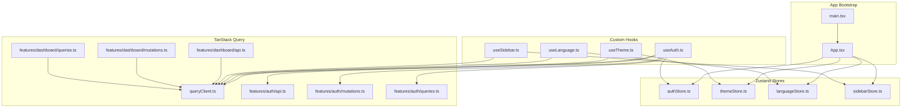
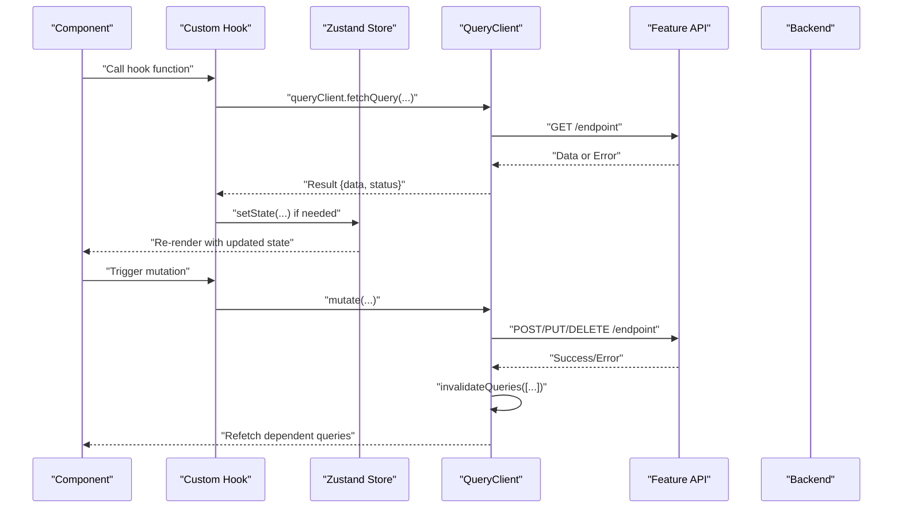
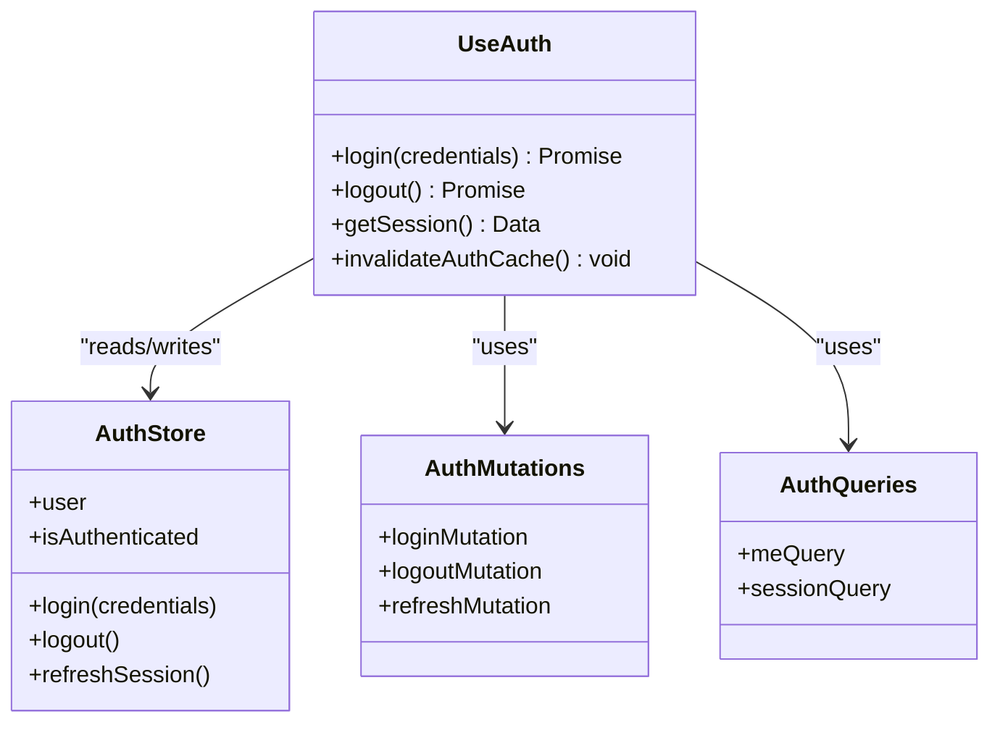
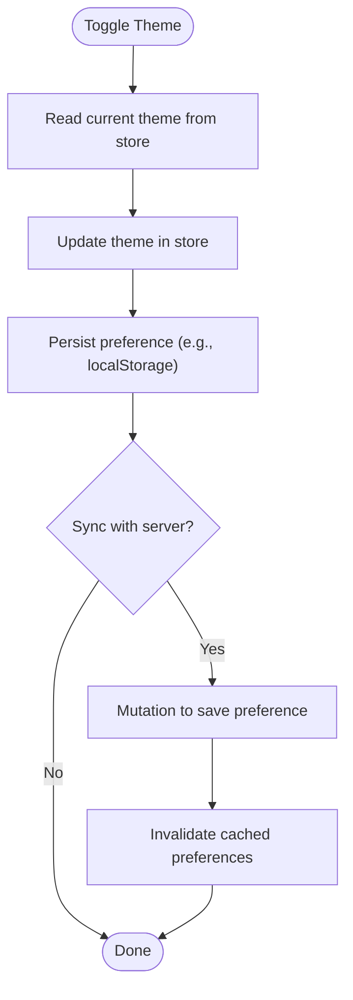
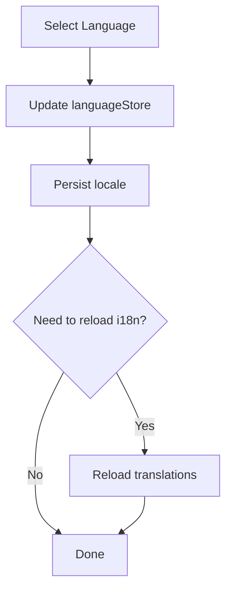
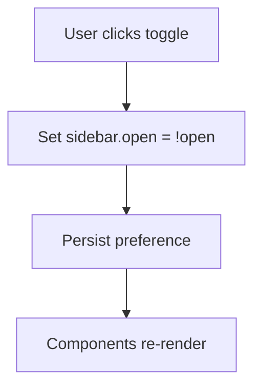
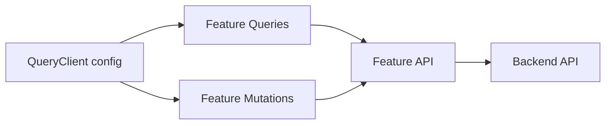

# State Management

<cite>
**Referenced Files in This Document**
- [frontend/src/stores/authStore.ts](file://frontend/src/stores/authStore.ts)
- [frontend/src/stores/themeStore.ts](file://frontend/src/stores/themeStore.ts)
- [frontend/src/stores/languageStore.ts](file://frontend/src/stores/languageStore.ts)
- [frontend/src/stores/sidebarStore.ts](file://frontend/src/stores/sidebarStore.ts)
- [frontend/src/hooks/useAuth.ts](file://frontend/src/hooks/useAuth.ts)
- [frontend/src/hooks/useTheme.ts](file://frontend/src/hooks/useTheme.ts)
- [frontend/src/hooks/useLanguage.ts](file://frontend/src/hooks/useLanguage.ts)
- [frontend/src/hooks/useSidebar.ts](file://frontend/src/hooks/useSidebar.ts)
- [frontend/src/lib/queryClient.ts](file://frontend/src/lib/queryClient.ts)
- [frontend/src/features/auth/api.ts](file://frontend/src/features/auth/api.ts)
- [frontend/src/features/auth/mutations.ts](file://frontend/src/features/auth/mutations.ts)
- [frontend/src/features/auth/queries.ts](file://frontend/src/features/auth/queries.ts)
- [frontend/src/features/dashboard/api.ts](file://frontend/src/features/dashboard/api.ts)
- [frontend/src/features/dashboard/mutations.ts](file://frontend/src/features/dashboard/mutations.ts)
- [frontend/src/features/dashboard/queries.ts](file://frontend/src/features/dashboard/queries.ts)
- [frontend/src/App.tsx](file://frontend/src/App.tsx)
- [frontend/src/main.tsx](file://frontend/src/main.tsx)
</cite>

## Table of Contents
1. [Introduction](#introduction)
2. [Project Structure](#project-structure)
3. [Core Components](#core-components)
4. [Architecture Overview](#architecture-overview)
5. [Detailed Component Analysis](#detailed-component-analysis)
6. [Dependency Analysis](#dependency-analysis)
7. [Performance Considerations](#performance-considerations)
8. [Troubleshooting Guide](#troubleshooting-guide)
9. [Conclusion](#conclusion)
10. [Appendices](#appendices)

## Introduction
This document explains the frontend state management system built with Zustand for client-side UI state and TanStack Query (React Query) for server state. It covers:
- Store architecture with separate stores for authentication, theme, language, and sidebar state
- Custom hooks pattern for data fetching, caching, and state synchronization
- Integration with TanStack Query including query configuration, mutation handling, and cache invalidation strategies
- Practical examples for creating new stores, implementing custom hooks, and managing complex state interactions

The goal is to provide a clear mental model and actionable guidance for extending and maintaining the state layer consistently across features.

## Project Structure
The frontend organizes state into two complementary layers:
- Client state via Zustand stores under src/stores
- Server state via TanStack Query configured in src/lib and used through feature-scoped hooks and API modules

**Diagram sources**
- [frontend/src/main.tsx](file://frontend/src/main.tsx)
- [frontend/src/App.tsx](file://frontend/src/App.tsx)
- [frontend/src/stores/authStore.ts](file://frontend/src/stores/authStore.ts)
- [frontend/src/stores/themeStore.ts](file://frontend/src/stores/themeStore.ts)
- [frontend/src/stores/languageStore.ts](file://frontend/src/stores/languageStore.ts)
- [frontend/src/stores/sidebarStore.ts](file://frontend/src/stores/sidebarStore.ts)
- [frontend/src/hooks/useAuth.ts](file://frontend/src/hooks/useAuth.ts)
- [frontend/src/hooks/useTheme.ts](file://frontend/src/hooks/useTheme.ts)
- [frontend/src/hooks/useLanguage.ts](file://frontend/src/hooks/useLanguage.ts)
- [frontend/src/hooks/useSidebar.ts](file://frontend/src/hooks/useSidebar.ts)
- [frontend/src/lib/queryClient.ts](file://frontend/src/lib/queryClient.ts)
- [frontend/src/features/auth/api.ts](file://frontend/src/features/auth/api.ts)
- [frontend/src/features/auth/mutations.ts](file://frontend/src/features/auth/mutations.ts)
- [frontend/src/features/auth/queries.ts](file://frontend/src/features/auth/queries.ts)
- [frontend/src/features/dashboard/api.ts](file://frontend/src/features/dashboard/api.ts)
- [frontend/src/features/dashboard/mutations.ts](file://frontend/src/features/dashboard/mutations.ts)
- [frontend/src/features/dashboard/queries.ts](file://frontend/src/features/dashboard/queries.ts)

**Section sources**
- [frontend/src/main.tsx](file://frontend/src/main.tsx)
- [frontend/src/App.tsx](file://frontend/src/App.tsx)
- [frontend/src/lib/queryClient.ts](file://frontend/src/lib/queryClient.ts)

## Core Components
- Zustand stores encapsulate UI-only state such as authentication flags, theme preferences, language selection, and sidebar visibility. Each store exposes selectors and actions for predictable updates.
- Custom hooks wrap store accessors and orchestrate TanStack Query operations, providing typed getters, setters, and side effects like cache invalidation.
- TanStack Query manages server state: it fetches, caches, deduplicates, and refetches data; mutations trigger optimistic updates and invalidate related queries.

Key responsibilities:
- Stores: lightweight, synchronous state and actions
- Hooks: composition of store usage + React Query calls
- Query client: global configuration (caching, retries, error handling)
- Feature modules: API functions, queries, and mutations co-located per domain

**Section sources**
- [frontend/src/stores/authStore.ts](file://frontend/src/stores/authStore.ts)
- [frontend/src/stores/themeStore.ts](file://frontend/src/stores/themeStore.ts)
- [frontend/src/stores/languageStore.ts](file://frontend/src/stores/languageStore.ts)
- [frontend/src/stores/sidebarStore.ts](file://frontend/src/stores/sidebarStore.ts)
- [frontend/src/hooks/useAuth.ts](file://frontend/src/hooks/useAuth.ts)
- [frontend/src/hooks/useTheme.ts](file://frontend/src/hooks/useTheme.ts)
- [frontend/src/hooks/useLanguage.ts](file://frontend/src/hooks/useLanguage.ts)
- [frontend/src/hooks/useSidebar.ts](file://frontend/src/hooks/useSidebar.ts)
- [frontend/src/lib/queryClient.ts](file://frontend/src/lib/queryClient.ts)

## Architecture Overview
The system separates concerns between client and server state while keeping feature boundaries clear.

**Diagram sources**
- [frontend/src/hooks/useAuth.ts](file://frontend/src/hooks/useAuth.ts)
- [frontend/src/features/auth/api.ts](file://frontend/src/features/auth/api.ts)
- [frontend/src/features/auth/mutations.ts](file://frontend/src/features/auth/mutations.ts)
- [frontend/src/features/auth/queries.ts](file://frontend/src/features/auth/queries.ts)
- [frontend/src/lib/queryClient.ts](file://frontend/src/lib/queryClient.ts)

## Detailed Component Analysis

### Authentication Store and Hook
- The authentication store holds user identity, token presence, and login/logout actions.
- The custom hook composes store access with TanStack Query to authenticate users, refresh sessions, and synchronize UI state after mutations.

**Diagram sources**
- [frontend/src/stores/authStore.ts](file://frontend/src/stores/authStore.ts)
- [frontend/src/hooks/useAuth.ts](file://frontend/src/hooks/useAuth.ts)
- [frontend/src/features/auth/mutations.ts](file://frontend/src/features/auth/mutations.ts)
- [frontend/src/features/auth/queries.ts](file://frontend/src/features/auth/queries.ts)

**Section sources**
- [frontend/src/stores/authStore.ts](file://frontend/src/stores/authStore.ts)
- [frontend/src/hooks/useAuth.ts](file://frontend/src/hooks/useAuth.ts)
- [frontend/src/features/auth/mutations.ts](file://frontend/src/features/auth/mutations.ts)
- [frontend/src/features/auth/queries.ts](file://frontend/src/features/auth/queries.ts)

### Theme Store and Hook
- The theme store persists theme preference and toggles light/dark modes.
- The custom hook provides a simple interface to read and update theme state, optionally syncing with TanStack Query for remote preferences.

**Diagram sources**
- [frontend/src/stores/themeStore.ts](file://frontend/src/stores/themeStore.ts)
- [frontend/src/hooks/useTheme.ts](file://frontend/src/hooks/useTheme.ts)

**Section sources**
- [frontend/src/stores/themeStore.ts](file://frontend/src/stores/themeStore.ts)
- [frontend/src/hooks/useTheme.ts](file://frontend/src/hooks/useTheme.ts)

### Language Store and Hook
- The language store manages selected locale and i18n-related UI state.
- The custom hook centralizes language switching and optional cache invalidation for localized resources.

**Diagram sources**
- [frontend/src/stores/languageStore.ts](file://frontend/src/stores/languageStore.ts)
- [frontend/src/hooks/useLanguage.ts](file://frontend/src/hooks/useLanguage.ts)

**Section sources**
- [frontend/src/stores/languageStore.ts](file://frontend/src/stores/languageStore.ts)
- [frontend/src/hooks/useLanguage.ts](file://frontend/src/hooks/useLanguage.ts)

### Sidebar Store and Hook
- The sidebar store controls open/close state and collapsed width.
- The custom hook exposes toggle methods and can coordinate with navigation or route-based behavior.

**Diagram sources**
- [frontend/src/stores/sidebarStore.ts](file://frontend/src/stores/sidebarStore.ts)
- [frontend/src/hooks/useSidebar.ts](file://frontend/src/hooks/useSidebar.ts)

**Section sources**
- [frontend/src/stores/sidebarStore.ts](file://frontend/src/stores/sidebarStore.ts)
- [frontend/src/hooks/useSidebar.ts](file://frontend/src/hooks/useSidebar.ts)

### TanStack Query Configuration and Usage
- Global QueryClient setup defines default options such as stale time, retry policy, and error handling.
- Feature modules group API calls, queries, and mutations together for clarity and reuse.

**Diagram sources**
- [frontend/src/lib/queryClient.ts](file://frontend/src/lib/queryClient.ts)
- [frontend/src/features/auth/api.ts](file://frontend/src/features/auth/api.ts)
- [frontend/src/features/auth/queries.ts](file://frontend/src/features/auth/queries.ts)
- [frontend/src/features/auth/mutations.ts](file://frontend/src/features/auth/mutations.ts)
- [frontend/src/features/dashboard/api.ts](file://frontend/src/features/dashboard/api.ts)
- [frontend/src/features/dashboard/queries.ts](file://frontend/src/features/dashboard/queries.ts)
- [frontend/src/features/dashboard/mutations.ts](file://frontend/src/features/dashboard/mutations.ts)

**Section sources**
- [frontend/src/lib/queryClient.ts](file://frontend/src/lib/queryClient.ts)
- [frontend/src/features/auth/api.ts](file://frontend/src/features/auth/api.ts)
- [frontend/src/features/auth/queries.ts](file://frontend/src/features/auth/queries.ts)
- [frontend/src/features/auth/mutations.ts](file://frontend/src/features/auth/mutations.ts)
- [frontend/src/features/dashboard/api.ts](file://frontend/src/features/dashboard/api.ts)
- [frontend/src/features/dashboard/queries.ts](file://frontend/src/features/dashboard/queries.ts)
- [frontend/src/features/dashboard/mutations.ts](file://frontend/src/features/dashboard/mutations.ts)

### Example: Creating a New Store
- Define a small, focused store with state and actions.
- Expose a custom hook that reads/writes the store and integrates with TanStack Query when necessary.
- Keep persistence and sync logic inside the hook or store action for consistency.

Guidelines:
- Prefer minimal state slices
- Use selectors to avoid unnecessary re-renders
- Centralize side effects in hooks

[No sources needed since this section provides general guidance]

### Example: Implementing a Custom Hook
- Compose store access with TanStack Query calls
- Provide typed getters and setters
- Handle loading, error, and success states
- Trigger cache invalidations after mutations

[No sources needed since this section provides general guidance]

### Example: Managing Complex State Interactions
- Coordinate multiple stores and queries within a single hook
- Use optimistic updates for better UX
- Invalidate only affected query keys to minimize refetches

[No sources needed since this section provides general guidance]

## Dependency Analysis
The following diagram shows how components depend on stores and hooks, and how hooks depend on TanStack Query and feature APIs.

```mermaid
graph TB
App["App.tsx"] --> Main["main.tsx"]
App --> AuthStore["authStore.ts"]
App --> ThemeStore["themeStore.ts"]
App --> LangStore["languageStore.ts"]
App --> SidebarStore["sidebarStore.ts"]
UseAuth["useAuth.ts"] --> AuthStore
UseAuth --> AuthMut["features/auth/mutations.ts"]
UseAuth --> AuthQry["features/auth/queries.ts"]
UseAuth --> AuthApi["features/auth/api.ts"]
UseTheme["useTheme.ts"] --> ThemeStore
UseLang["useLanguage.ts"] --> LangStore
UseSidebar["useSidebar.ts"] --> SidebarStore
DashApi["features/dashboard/api.ts"] --> QueryClient["queryClient.ts"]
DashMut["features/dashboard/mutations.ts"] --> QueryClient
DashQry["features/dashboard/queries.ts"] --> QueryClient
```

**Diagram sources**
- [frontend/src/App.tsx](file://frontend/src/App.tsx)
- [frontend/src/main.tsx](file://frontend/src/main.tsx)
- [frontend/src/stores/authStore.ts](file://frontend/src/stores/authStore.ts)
- [frontend/src/stores/themeStore.ts](file://frontend/src/stores/themeStore.ts)
- [frontend/src/stores/languageStore.ts](file://frontend/src/stores/languageStore.ts)
- [frontend/src/stores/sidebarStore.ts](file://frontend/src/stores/sidebarStore.ts)
- [frontend/src/hooks/useAuth.ts](file://frontend/src/hooks/useAuth.ts)
- [frontend/src/hooks/useTheme.ts](file://frontend/src/hooks/useTheme.ts)
- [frontend/src/hooks/useLanguage.ts](file://frontend/src/hooks/useLanguage.ts)
- [frontend/src/hooks/useSidebar.ts](file://frontend/src/hooks/useSidebar.ts)
- [frontend/src/features/auth/api.ts](file://frontend/src/features/auth/api.ts)
- [frontend/src/features/auth/mutations.ts](file://frontend/src/features/auth/mutations.ts)
- [frontend/src/features/auth/queries.ts](file://frontend/src/features/auth/queries.ts)
- [frontend/src/features/dashboard/api.ts](file://frontend/src/features/dashboard/api.ts)
- [frontend/src/features/dashboard/mutations.ts](file://frontend/src/features/dashboard/mutations.ts)
- [frontend/src/features/dashboard/queries.ts](file://frontend/src/features/dashboard/queries.ts)
- [frontend/src/lib/queryClient.ts](file://frontend/src/lib/queryClient.ts)

**Section sources**
- [frontend/src/App.tsx](file://frontend/src/App.tsx)
- [frontend/src/main.tsx](file://frontend/src/main.tsx)
- [frontend/src/lib/queryClient.ts](file://frontend/src/lib/queryClient.ts)

## Performance Considerations
- Prefer fine-grained selectors in Zustand to limit re-renders
- Set appropriate staleTime and gcTime in TanStack Query to balance freshness and network load
- Use query key patterns to scope invalidations precisely
- Avoid storing large payloads in client stores; prefer server cache for heavy data
- Debounce frequent UI updates (e.g., typing) before triggering mutations

[No sources needed since this section provides general guidance]

## Troubleshooting Guide
Common issues and resolutions:
- Stale UI after mutation: ensure you invalidate relevant query keys after successful mutations
- Infinite refetch loops: verify query keys and conditions; avoid refetching on every render without proper dependencies
- Auth state drift: synchronize store flags with query results and handle logout by clearing both store and cache
- Theme not persisting: confirm persistence logic runs on store updates and survives page reloads
- Language switch not applied: ensure i18n instance is reloaded and dependent queries are invalidated if they rely on locale

[No sources needed since this section provides general guidance]

## Conclusion
By separating client state (Zustand) from server state (TanStack Query), and by organizing code around feature-scoped hooks and modules, the application achieves clear boundaries, predictable updates, and efficient caching. Following the patterns outlined here will help maintain consistency and scalability as new features are added.

[No sources needed since this section summarizes without analyzing specific files]

## Appendices

### Quick Reference: Key Files
- Stores:
  - [frontend/src/stores/authStore.ts](file://frontend/src/stores/authStore.ts)
  - [frontend/src/stores/themeStore.ts](file://frontend/src/stores/themeStore.ts)
  - [frontend/src/stores/languageStore.ts](file://frontend/src/stores/languageStore.ts)
  - [frontend/src/stores/sidebarStore.ts](file://frontend/src/stores/sidebarStore.ts)
- Hooks:
  - [frontend/src/hooks/useAuth.ts](file://frontend/src/hooks/useAuth.ts)
  - [frontend/src/hooks/useTheme.ts](file://frontend/src/hooks/useTheme.ts)
  - [frontend/src/hooks/useLanguage.ts](file://frontend/src/hooks/useLanguage.ts)
  - [frontend/src/hooks/useSidebar.ts](file://frontend/src/hooks/useSidebar.ts)
- TanStack Query:
  - [frontend/src/lib/queryClient.ts](file://frontend/src/lib/queryClient.ts)
  - [frontend/src/features/auth/api.ts](file://frontend/src/features/auth/api.ts)
  - [frontend/src/features/auth/mutations.ts](file://frontend/src/features/auth/mutations.ts)
  - [frontend/src/features/auth/queries.ts](file://frontend/src/features/auth/queries.ts)
  - [frontend/src/features/dashboard/api.ts](file://frontend/src/features/dashboard/api.ts)
  - [frontend/src/features/dashboard/mutations.ts](file://frontend/src/features/dashboard/mutations.ts)
  - [frontend/src/features/dashboard/queries.ts](file://frontend/src/features/dashboard/queries.ts)
- App bootstrap:
  - [frontend/src/main.tsx](file://frontend/src/main.tsx)
  - [frontend/src/App.tsx](file://frontend/src/App.tsx)