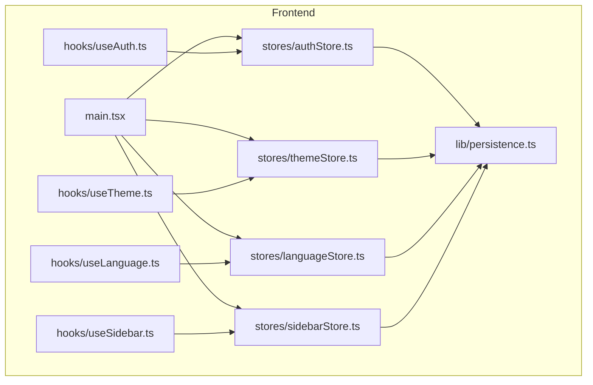
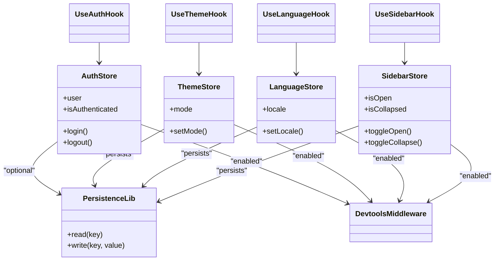
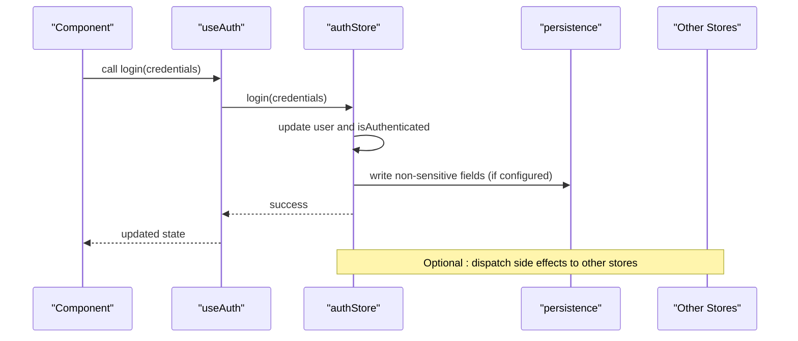
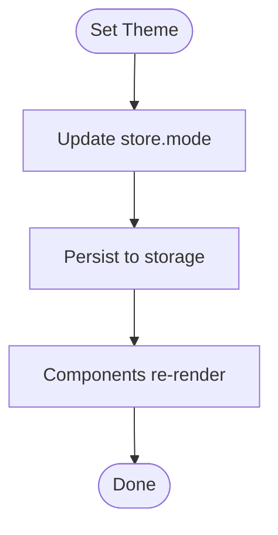
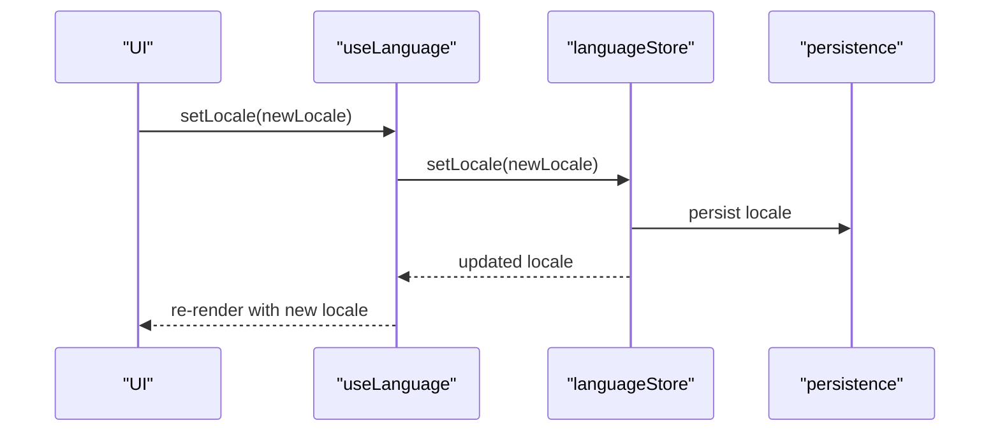
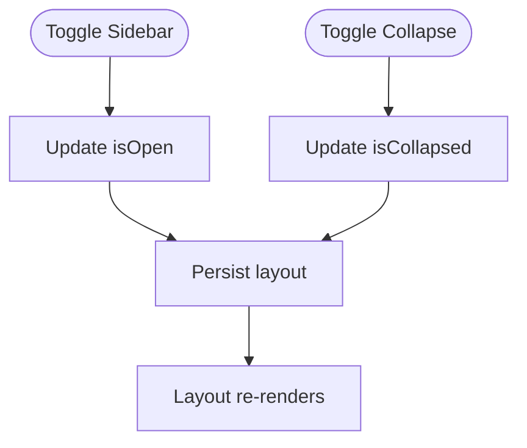
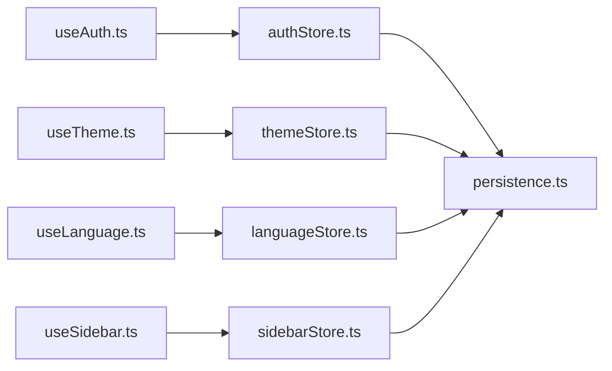

# Zustand Stores

<cite>
**Referenced Files in This Document**
- [frontend/src/stores/authStore.ts](file://frontend/src/stores/authStore.ts)
- [frontend/src/stores/themeStore.ts](file://frontend/src/stores/themeStore.ts)
- [frontend/src/stores/languageStore.ts](file://frontend/src/stores/languageStore.ts)
- [frontend/src/stores/sidebarStore.ts](file://frontend/src/stores/sidebarStore.ts)
- [frontend/src/hooks/useAuth.ts](file://frontend/src/hooks/useAuth.ts)
- [frontend/src/hooks/useTheme.ts](file://frontend/src/hooks/useTheme.ts)
- [frontend/src/hooks/useLanguage.ts](file://frontend/src/hooks/useLanguage.ts)
- [frontend/src/hooks/useSidebar.ts](file://frontend/src/hooks/useSidebar.ts)
- [frontend/src/lib/persistence.ts](file://frontend/src/lib/persistence.ts)
- [frontend/src/main.tsx](file://frontend/src/main.tsx)
</cite>

## Table of Contents
1. [Introduction](#introduction)
2. [Project Structure](#project-structure)
3. [Core Components](#core-components)
4. [Architecture Overview](#architecture-overview)
5. [Detailed Component Analysis](#detailed-component-analysis)
6. [Dependency Analysis](#dependency-analysis)
7. [Performance Considerations](#performance-considerations)
8. [Troubleshooting Guide](#troubleshooting-guide)
9. [Conclusion](#conclusion)
10. [Appendices](#appendices)

## Introduction
This document explains the Zustand stores architecture used to manage application state for authentication, theme preferences, language settings, and sidebar configuration. It covers store structure patterns, persistence strategies, cross-store communication, middleware usage, devtools integration, and performance optimization techniques. It also provides guidance on creating new stores, accessing state in components, and implementing subscriptions.

## Project Structure
The frontend organizes global UI and session state using small, focused Zustand stores under a dedicated directory. Each store encapsulates its own state and actions, with optional persistence and devtools enabled via middleware. Hooks are provided to consume stores in React components.

**Diagram sources**
- [frontend/src/main.tsx](file://frontend/src/main.tsx)
- [frontend/src/stores/authStore.ts](file://frontend/src/stores/authStore.ts)
- [frontend/src/stores/themeStore.ts](file://frontend/src/stores/themeStore.ts)
- [frontend/src/stores/languageStore.ts](file://frontend/src/stores/languageStore.ts)
- [frontend/src/stores/sidebarStore.ts](file://frontend/src/stores/sidebarStore.ts)
- [frontend/src/hooks/useAuth.ts](file://frontend/src/hooks/useAuth.ts)
- [frontend/src/hooks/useTheme.ts](file://frontend/src/hooks/useTheme.ts)
- [frontend/src/hooks/useLanguage.ts](file://frontend/src/hooks/useLanguage.ts)
- [frontend/src/hooks/useSidebar.ts](file://frontend/src/hooks/useSidebar.ts)
- [frontend/src/lib/persistence.ts](file://frontend/src/lib/persistence.ts)

**Section sources**
- [frontend/src/main.tsx](file://frontend/src/main.tsx)
- [frontend/src/stores/authStore.ts](file://frontend/src/stores/authStore.ts)
- [frontend/src/stores/themeStore.ts](file://frontend/src/stores/themeStore.ts)
- [frontend/src/stores/languageStore.ts](file://frontend/src/stores/languageStore.ts)
- [frontend/src/stores/sidebarStore.ts](file://frontend/src/stores/sidebarStore.ts)
- [frontend/src/hooks/useAuth.ts](file://frontend/src/hooks/useAuth.ts)
- [frontend/src/hooks/useTheme.ts](file://frontend/src/hooks/useTheme.ts)
- [frontend/src/hooks/useLanguage.ts](file://frontend/src/hooks/useLanguage.ts)
- [frontend/src/hooks/useSidebar.ts](file://frontend/src/hooks/useSidebar.ts)
- [frontend/src/lib/persistence.ts](file://frontend/src/lib/persistence.ts)

## Core Components
- Authentication store: Manages user identity, login/logout flows, token handling, and related flags.
- Theme store: Controls light/dark mode and theme-related preferences.
- Language store: Manages current locale and i18n selection.
- Sidebar store: Controls sidebar visibility and collapsed state.

Each store is implemented as a Zustand slice with typed state and actions. Persistence is applied where appropriate (e.g., theme, language, sidebar), while sensitive data such as tokens may be excluded from persistent storage or handled separately.

**Section sources**
- [frontend/src/stores/authStore.ts](file://frontend/src/stores/authStore.ts)
- [frontend/src/stores/themeStore.ts](file://frontend/src/stores/themeStore.ts)
- [frontend/src/stores/languageStore.ts](file://frontend/src/stores/languageStore.ts)
- [frontend/src/stores/sidebarStore.ts](file://frontend/src/stores/sidebarStore.ts)

## Architecture Overview
The stores follow a consistent pattern:
- Define typed state and actions within a single file per feature.
- Apply middleware (devtools and persistence) at store creation time.
- Expose hooks that wrap useStore selectors for ergonomic consumption.
- Persist non-sensitive UI preferences; avoid persisting secrets.

**Diagram sources**
- [frontend/src/stores/authStore.ts](file://frontend/src/stores/authStore.ts)
- [frontend/src/stores/themeStore.ts](file://frontend/src/stores/themeStore.ts)
- [frontend/src/stores/languageStore.ts](file://frontend/src/stores/languageStore.ts)
- [frontend/src/stores/sidebarStore.ts](file://frontend/src/stores/sidebarStore.ts)
- [frontend/src/hooks/useAuth.ts](file://frontend/src/hooks/useAuth.ts)
- [frontend/src/hooks/useTheme.ts](file://frontend/src/hooks/useTheme.ts)
- [frontend/src/hooks/useLanguage.ts](file://frontend/src/hooks/useLanguage.ts)
- [frontend/src/hooks/useSidebar.ts](file://frontend/src/hooks/useSidebar.ts)
- [frontend/src/lib/persistence.ts](file://frontend/src/lib/persistence.ts)

## Detailed Component Analysis

### Authentication Store
Responsibilities:
- Maintain user profile and authentication status.
- Provide login/logout actions.
- Coordinate with API services (outside this document).
- Optionally integrate with other stores (e.g., clear sidebar state on logout).

State and Actions:
- State fields include user identity and authentication flags.
- Actions include login, logout, and any helper methods required by the app.

Persistence Strategy:
- Avoid persisting sensitive tokens directly. If needed, rely on secure mechanisms outside the store or exclude them from persisted slices.

Cross-Store Communication:
- On logout, trigger cleanup in other stores if necessary (e.g., reset sidebar or notifications).

**Diagram sources**
- [frontend/src/stores/authStore.ts](file://frontend/src/stores/authStore.ts)
- [frontend/src/hooks/useAuth.ts](file://frontend/src/hooks/useAuth.ts)
- [frontend/src/lib/persistence.ts](file://frontend/src/lib/persistence.ts)

**Section sources**
- [frontend/src/stores/authStore.ts](file://frontend/src/stores/authStore.ts)
- [frontend/src/hooks/useAuth.ts](file://frontend/src/hooks/useAuth.ts)

### Theme Store
Responsibilities:
- Manage theme mode (light/dark).
- Provide setter to switch themes.

Persistence Strategy:
- Persist selected theme across sessions.

Devtools:
- Enabled for debugging state changes.

**Diagram sources**
- [frontend/src/stores/themeStore.ts](file://frontend/src/stores/themeStore.ts)
- [frontend/src/hooks/useTheme.ts](file://frontend/src/hooks/useTheme.ts)
- [frontend/src/lib/persistence.ts](file://frontend/src/lib/persistence.ts)

**Section sources**
- [frontend/src/stores/themeStore.ts](file://frontend/src/stores/themeStore.ts)
- [frontend/src/hooks/useTheme.ts](file://frontend/src/hooks/useTheme.ts)

### Language Store
Responsibilities:
- Track current locale.
- Provide setter to change language.

Persistence Strategy:
- Persist locale preference.

Integration:
- Typically consumed by i18n setup and components that render localized content.

**Diagram sources**
- [frontend/src/stores/languageStore.ts](file://frontend/src/stores/languageStore.ts)
- [frontend/src/hooks/useLanguage.ts](file://frontend/src/hooks/useLanguage.ts)
- [frontend/src/lib/persistence.ts](file://frontend/src/lib/persistence.ts)

**Section sources**
- [frontend/src/stores/languageStore.ts](file://frontend/src/stores/languageStore.ts)
- [frontend/src/hooks/useLanguage.ts](file://frontend/src/hooks/useLanguage.ts)

### Sidebar Store
Responsibilities:
- Control sidebar open/closed state.
- Control collapsed/expanded state.
- Provide toggle actions.

Persistence Strategy:
- Persist layout preferences for better UX.

**Diagram sources**
- [frontend/src/stores/sidebarStore.ts](file://frontend/src/stores/sidebarStore.ts)
- [frontend/src/hooks/useSidebar.ts](file://frontend/src/hooks/useSidebar.ts)
- [frontend/src/lib/persistence.ts](file://frontend/src/lib/persistence.ts)

**Section sources**
- [frontend/src/stores/sidebarStore.ts](file://frontend/src/stores/sidebarStore.ts)
- [frontend/src/hooks/useSidebar.ts](file://frontend/src/hooks/useSidebar.ts)

### Creating New Stores
Recommended pattern:
- Create a new file under the stores directory.
- Define typed state and actions.
- Apply devtools and persistence middleware as needed.
- Export a hook to consume the store safely.

Example steps:
- Define state shape and initial values.
- Implement actions that mutate state immutably.
- Wrap with devtools for development.
- Add persistence for non-sensitive preferences.
- Export a custom hook that selects only the parts of state needed by consumers.

**Section sources**
- [frontend/src/stores/authStore.ts](file://frontend/src/stores/authStore.ts)
- [frontend/src/stores/themeStore.ts](file://frontend/src/stores/themeStore.ts)
- [frontend/src/stores/languageStore.ts](file://frontend/src/stores/languageStore.ts)
- [frontend/src/stores/sidebarStore.ts](file://frontend/src/stores/sidebarStore.ts)

### Accessing Store State in Components
Use the provided hooks to subscribe to specific slices of state:
- For authentication: use the auth hook to read user and authentication flags, and call login/logout actions.
- For theme: use the theme hook to read mode and call setters.
- For language: use the language hook to read locale and call setters.
- For sidebar: use the sidebar hook to read layout state and call toggles.

Best practices:
- Select only the minimal state needed by each component.
- Prefer functional updates when modifying complex objects.
- Keep business logic out of components; delegate to store actions.

**Section sources**
- [frontend/src/hooks/useAuth.ts](file://frontend/src/hooks/useAuth.ts)
- [frontend/src/hooks/useTheme.ts](file://frontend/src/hooks/useTheme.ts)
- [frontend/src/hooks/useLanguage.ts](file://frontend/src/hooks/useLanguage.ts)
- [frontend/src/hooks/useSidebar.ts](file://frontend/src/hooks/useSidebar.ts)

### Implementing Store Subscriptions
Zustand enables fine-grained subscriptions through selectors:
- Subscribe to a single field to minimize re-renders.
- Combine multiple fields into a selector when they are always used together.
- Avoid subscribing to entire store state unless necessary.

Examples:
- Subscribe to authentication status only.
- Subscribe to theme mode only.
- Subscribe to sidebar open state only.

**Section sources**
- [frontend/src/stores/authStore.ts](file://frontend/src/stores/authStore.ts)
- [frontend/src/stores/themeStore.ts](file://frontend/src/stores/themeStore.ts)
- [frontend/src/stores/languageStore.ts](file://frontend/src/stores/languageStore.ts)
- [frontend/src/stores/sidebarStore.ts](file://frontend/src/stores/sidebarStore.ts)

### Middleware Usage and Devtools Integration
- Devtools: Enable devtools middleware for all stores to inspect state and actions during development.
- Persistence: Apply persistence middleware to stores managing UI preferences (theme, language, sidebar). Exclude sensitive fields (e.g., tokens) from persistence.

Configuration tips:
- Use selective persistence keys to reduce storage size.
- Ensure serialization safety for stored values.
- Disable persistence in production if not required.

**Section sources**
- [frontend/src/stores/authStore.ts](file://frontend/src/stores/authStore.ts)
- [frontend/src/stores/themeStore.ts](file://frontend/src/stores/themeStore.ts)
- [frontend/src/stores/languageStore.ts](file://frontend/src/stores/languageStore.ts)
- [frontend/src/stores/sidebarStore.ts](file://frontend/src/stores/sidebarStore.ts)
- [frontend/src/lib/persistence.ts](file://frontend/src/lib/persistence.ts)

### Cross-Store Communication
While stores should remain loosely coupled, occasional coordination is necessary:
- On logout, reset or clear non-persistent UI state in other stores.
- When switching tenants or users, refresh dependent stores.

Approaches:
- Call actions in other stores from the triggering store’s action.
- Use a central orchestrator or event bus if interactions become complex.
- Keep side effects explicit and documented.

**Section sources**
- [frontend/src/stores/authStore.ts](file://frontend/src/stores/authStore.ts)
- [frontend/src/stores/sidebarStore.ts](file://frontend/src/stores/sidebarStore.ts)

## Dependency Analysis
The stores depend on:
- Persistence library for non-sensitive preferences.
- Devtools middleware for development insights.
- Custom hooks for safe consumption in components.

**Diagram sources**
- [frontend/src/stores/authStore.ts](file://frontend/src/stores/authStore.ts)
- [frontend/src/stores/themeStore.ts](file://frontend/src/stores/themeStore.ts)
- [frontend/src/stores/languageStore.ts](file://frontend/src/stores/languageStore.ts)
- [frontend/src/stores/sidebarStore.ts](file://frontend/src/stores/sidebarStore.ts)
- [frontend/src/hooks/useAuth.ts](file://frontend/src/hooks/useAuth.ts)
- [frontend/src/hooks/useTheme.ts](file://frontend/src/hooks/useTheme.ts)
- [frontend/src/hooks/useLanguage.ts](file://frontend/src/hooks/useLanguage.ts)
- [frontend/src/hooks/useSidebar.ts](file://frontend/src/hooks/useSidebar.ts)
- [frontend/src/lib/persistence.ts](file://frontend/src/lib/persistence.ts)

**Section sources**
- [frontend/src/stores/authStore.ts](file://frontend/src/stores/authStore.ts)
- [frontend/src/stores/themeStore.ts](file://frontend/src/stores/themeStore.ts)
- [frontend/src/stores/languageStore.ts](file://frontend/src/stores/languageStore.ts)
- [frontend/src/stores/sidebarStore.ts](file://frontend/src/stores/sidebarStore.ts)
- [frontend/src/hooks/useAuth.ts](file://frontend/src/hooks/useAuth.ts)
- [frontend/src/hooks/useTheme.ts](file://frontend/src/hooks/useTheme.ts)
- [frontend/src/hooks/useLanguage.ts](file://frontend/src/hooks/useLanguage.ts)
- [frontend/src/hooks/useSidebar.ts](file://frontend/src/hooks/useSidebar.ts)
- [frontend/src/lib/persistence.ts](file://frontend/src/lib/persistence.ts)

## Performance Considerations
- Selective subscriptions: Subscribe to minimal state slices to avoid unnecessary re-renders.
- Memoized selectors: Derive computed values using memoization to prevent recomputation.
- Batched updates: Group related state changes to reduce render cycles.
- Avoid large objects in state: Prefer normalized structures and references.
- Lazy initialization: Initialize heavy computations lazily when first accessed.
- Conditional persistence: Only persist essential fields to reduce storage overhead.

[No sources needed since this section provides general guidance]

## Troubleshooting Guide
Common issues and resolutions:
- Unexpected re-renders: Check if components subscribe to too much state; refine selectors.
- Persistence conflicts: Ensure serialized types match expected shapes; guard against undefined or null values.
- Devtools noise: Filter actions or disable devtools in production builds.
- Cross-store side effects: Verify that actions do not create circular dependencies; keep side effects explicit.

Diagnostic steps:
- Inspect store state in devtools to confirm expected values.
- Log action calls to trace state mutation paths.
- Validate persistence keys and storage contents.

**Section sources**
- [frontend/src/stores/authStore.ts](file://frontend/src/stores/authStore.ts)
- [frontend/src/stores/themeStore.ts](file://frontend/src/stores/themeStore.ts)
- [frontend/src/stores/languageStore.ts](file://frontend/src/stores/languageStore.ts)
- [frontend/src/stores/sidebarStore.ts](file://frontend/src/stores/sidebarStore.ts)
- [frontend/src/lib/persistence.ts](file://frontend/src/lib/persistence.ts)

## Conclusion
The Zustand stores provide a clean, modular approach to managing core application state. By following consistent patterns, applying persistence selectively, leveraging devtools, and optimizing subscriptions, the system remains maintainable and performant. The provided hooks simplify consumption in components, and the architecture supports easy extension with new stores as features grow.

[No sources needed since this section summarizes without analyzing specific files]

## Appendices

### Quick Reference: Store Responsibilities
- Authentication: Identity, login/logout, token management.
- Theme: Light/dark mode and related preferences.
- Language: Locale selection and persistence.
- Sidebar: Visibility and collapse state.

**Section sources**
- [frontend/src/stores/authStore.ts](file://frontend/src/stores/authStore.ts)
- [frontend/src/stores/themeStore.ts](file://frontend/src/stores/themeStore.ts)
- [frontend/src/stores/languageStore.ts](file://frontend/src/stores/languageStore.ts)
- [frontend/src/stores/sidebarStore.ts](file://frontend/src/stores/sidebarStore.ts)