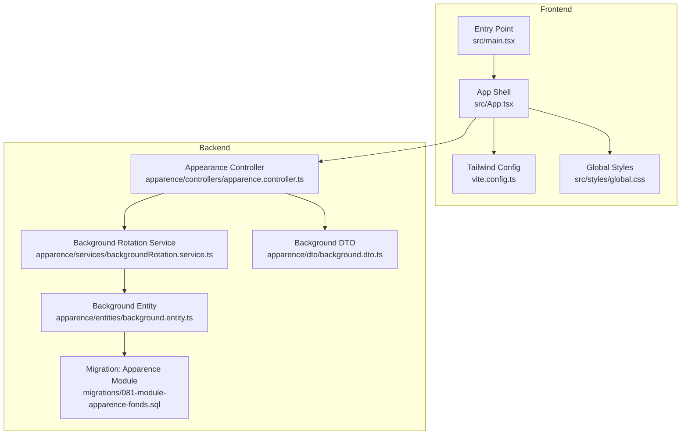
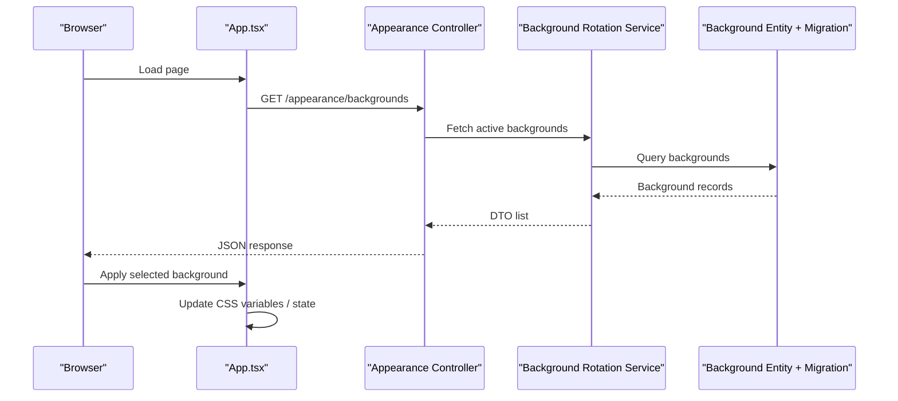
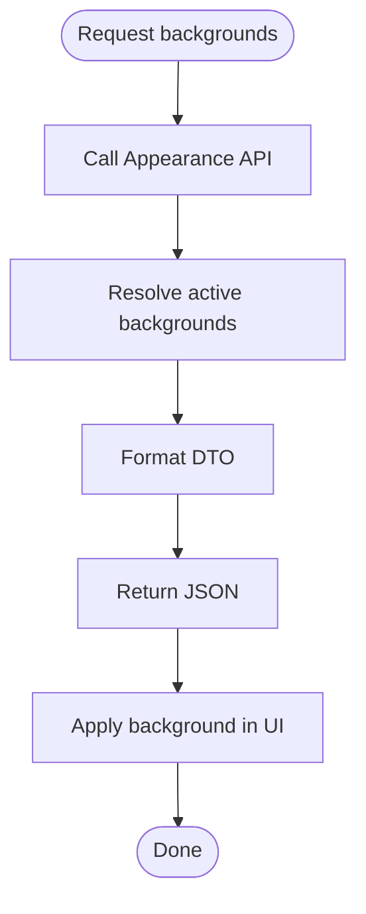
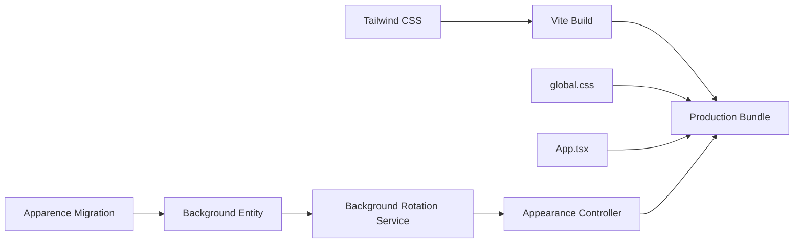

# Styling & Theming

<cite>
**Referenced Files in This Document**
- [frontend/package.json](file://frontend/package.json)
- [frontend/vite.config.ts](file://frontend/vite.config.ts)
- [frontend/src/styles/global.css](file://frontend/src/styles/global.css)
- [frontend/src/App.tsx](file://frontend/src/App.tsx)
- [frontend/src/main.tsx](file://frontend/src/main.tsx)
- [backend/src/modules/apparence/services/backgroundRotation.service.ts](file://backend/src/modules/apparence/services/backgroundRotation.service.ts)
- [backend/src/modules/apparence/controllers/apparence.controller.ts](file://backend/src/modules/apparence/controllers/apparence.controller.ts)
- [backend/src/modules/apparence/dto/background.dto.ts](file://backend/src/modules/apparence/dto/background.dto.ts)
- [backend/src/modules/apparence/entities/background.entity.ts](file://backend/src/modules/apparence/entities/background.entity.ts)
- [backend/migrations/081-module-apparence-fonds.sql](file://backend/migrations/081-module-apparence-fonds.sql)
</cite>

## Table of Contents
1. [Introduction](#introduction)
2. [Project Structure](#project-structure)
3. [Core Components](#core-components)
4. [Architecture Overview](#architecture-overview)
5. [Detailed Component Analysis](#detailed-component-analysis)
6. [Dependency Analysis](#dependency-analysis)
7. [Performance Considerations](#performance-considerations)
8. [Troubleshooting Guide](#troubleshooting-guide)
9. [Conclusion](#conclusion)
10. [Appendices](#appendices)

## Introduction
This document explains the styling system built with Tailwind CSS and custom theming across the frontend, including design tokens, color palettes, typography scales, dark mode, responsive patterns, mobile-first approach, background rotation for institutions, and custom theme configuration. It also covers CSS-in-JS patterns used in components, best practices for component styling, performance optimization strategies, cross-browser compatibility considerations, and accessibility compliance.

## Project Structure
The styling system is primarily implemented in the frontend using Tailwind CSS and a global stylesheet for base styles and theme variables. The backend provides dynamic background assets per institution via an appearance module that exposes endpoints to fetch available backgrounds and their metadata.

**Diagram sources**
- [frontend/vite.config.ts](file://frontend/vite.config.ts)
- [frontend/src/styles/global.css](file://frontend/src/styles/global.css)
- [frontend/src/App.tsx](file://frontend/src/App.tsx)
- [frontend/src/main.tsx](file://frontend/src/main.tsx)
- [backend/src/modules/apparence/services/backgroundRotation.service.ts](file://backend/src/modules/apparence/services/backgroundRotation.service.ts)
- [backend/src/modules/apparence/controllers/apparence.controller.ts](file://backend/src/modules/apparence/controllers/apparence.controller.ts)
- [backend/src/modules/apparence/dto/background.dto.ts](file://backend/src/modules/apparence/dto/background.dto.ts)
- [backend/src/modules/apparence/entities/background.entity.ts](file://backend/src/modules/apparence/entities/background.entity.ts)
- [backend/migrations/081-module-apparence-fonds.sql](file://backend/migrations/081-module-apparence-fonds.sql)

**Section sources**
- [frontend/package.json](file://frontend/package.json)
- [frontend/vite.config.ts](file://frontend/vite.config.ts)
- [frontend/src/styles/global.css](file://frontend/src/styles/global.css)
- [frontend/src/App.tsx](file://frontend/src/App.tsx)
- [frontend/src/main.tsx](file://frontend/src/main.tsx)
- [backend/src/modules/apparence/services/backgroundRotation.service.ts](file://backend/src/modules/apparence/services/backgroundRotation.service.ts)
- [backend/src/modules/apparence/controllers/apparence.controller.ts](file://backend/src/modules/apparence/controllers/apparence.controller.ts)
- [backend/src/modules/apparence/dto/background.dto.ts](file://backend/src/modules/apparence/dto/background.dto.ts)
- [backend/src/modules/apparence/entities/background.entity.ts](file://backend/src/modules/apparence/entities/background.entity.ts)
- [backend/migrations/081-module-apparence-fonds.sql](file://backend/migrations/081-module-apparence-fonds.sql)

## Core Components
- Tailwind CSS integration and build-time processing are configured through the Vite setup. This includes plugin registration and any Tailwind-specific options.
- Global styles define base CSS variables (design tokens), typography scale, spacing, and color tokens. These variables are consumed by Tailwind utilities and custom components.
- The application shell initializes providers and theme context if needed, ensuring consistent rendering across routes.
- The backend appearance module serves institution-specific background assets and metadata, enabling dynamic theming at runtime.

Key responsibilities:
- Build configuration: Tailwind plugin and source paths.
- Design tokens: CSS custom properties for colors, typography, spacing, shadows, and radii.
- Dark mode: Root-level class toggling and token overrides.
- Responsive/mobile-first: Utility-first classes and breakpoint-driven layouts.
- Background rotation: Backend API to list and select rotating backgrounds per institution.

**Section sources**
- [frontend/vite.config.ts](file://frontend/vite.config.ts)
- [frontend/src/styles/global.css](file://frontend/src/styles/global.css)
- [frontend/src/App.tsx](file://frontend/src/App.tsx)
- [frontend/src/main.tsx](file://frontend/src/main.tsx)
- [backend/src/modules/apparence/controllers/apparence.controller.ts](file://backend/src/modules/apparence/controllers/apparence.controller.ts)
- [backend/src/modules/apparence/services/backgroundRotation.service.ts](file://backend/src/modules/apparence/services/backgroundRotation.service.ts)
- [backend/src/modules/apparence/dto/background.dto.ts](file://backend/src/modules/apparence/dto/background.dto.ts)
- [backend/src/modules/apparence/entities/background.entity.ts](file://backend/src/modules/apparence/entities/background.entity.ts)
- [backend/migrations/081-module-apparence-fonds.sql](file://backend/migrations/081-module-apparence-fonds.sql)

## Architecture Overview
The styling architecture combines static design tokens with dynamic runtime theming:
- Static layer: Tailwind utilities and global CSS variables provide a consistent foundation.
- Dynamic layer: Institution-specific backgrounds are fetched from the backend and applied to the UI.
- Theme switching: Dark mode toggles CSS variable values and Tailwind’s dark variant behavior.

**Diagram sources**
- [frontend/src/App.tsx](file://frontend/src/App.tsx)
- [backend/src/modules/apparence/controllers/apparence.controller.ts](file://backend/src/modules/apparence/controllers/apparence.controller.ts)
- [backend/src/modules/apparence/services/backgroundRotation.service.ts](file://backend/src/modules/apparence/services/backgroundRotation.service.ts)
- [backend/src/modules/apparence/entities/background.entity.ts](file://backend/src/modules/apparence/entities/background.entity.ts)
- [backend/migrations/081-module-apparence-fonds.sql](file://backend/migrations/081-module-apparence-fonds.sql)

## Detailed Component Analysis

### Tailwind Configuration and Build Pipeline
- Tailwind is integrated via the Vite configuration file. The setup registers the Tailwind plugin and defines content paths so only used utilities are included in production builds.
- Source scanning ensures all component files are analyzed for utility usage, minimizing bundle size.

Best practices:
- Keep Tailwind content globs precise to avoid unnecessary scans.
- Use purge-safe patterns when generating class names dynamically.

**Section sources**
- [frontend/vite.config.ts](file://frontend/vite.config.ts)

### Global Styles and Design Tokens
- Global CSS defines CSS custom properties for colors, typography, spacing, shadows, and border radius. These tokens act as the single source of truth for visual consistency.
- Typography scale is expressed via semantic tokens (e.g., headings, body text) and mapped to Tailwind utilities or component styles.
- Color palette tokens include light and dark variants, enabling seamless theme switching.

Accessibility tips:
- Ensure sufficient contrast between foreground and background tokens.
- Provide focus-visible styles for interactive elements.

**Section sources**
- [frontend/src/styles/global.css](file://frontend/src/styles/global.css)

### Application Shell and Theme Context
- The app shell initializes providers and may manage theme state (e.g., dark mode). It composes layout and applies global classes.
- If a theme context exists, it propagates tokens and preferences down the tree.

Mobile-first approach:
- Default styles target small screens; larger breakpoints enhance layouts progressively.

**Section sources**
- [frontend/src/App.tsx](file://frontend/src/App.tsx)
- [frontend/src/main.tsx](file://frontend/src/main.tsx)

### Dark Mode Implementation
- Dark mode is typically toggled by adding/removing a class on the root element. CSS variables override token values under the dark selector.
- Tailwind’s dark variant reads the presence of the dark class to apply alternate styles.

Implementation notes:
- Persist user preference in local storage.
- Respect system preference on first load.

**Section sources**
- [frontend/src/styles/global.css](file://frontend/src/styles/global.css)
- [frontend/src/App.tsx](file://frontend/src/App.tsx)

### Responsive Design Patterns
- Use Tailwind’s responsive prefixes to adapt layouts across breakpoints.
- Prefer stacking layouts on small screens and expanding to multi-column grids on larger screens.
- Avoid fixed widths; use fluid units and container queries where appropriate.

**Section sources**
- [frontend/src/styles/global.css](file://frontend/src/styles/global.css)

### Background Rotation System for Institutions
- The backend exposes endpoints to retrieve available backgrounds and metadata for the current institution.
- The service selects backgrounds based on rotation rules and returns a DTO suitable for the client.
- The entity and migration define the schema for storing background assets and their attributes.

Runtime flow:
- Frontend requests background list.
- Backend resolves active backgrounds and formats response.
- Frontend applies chosen background to the UI.

**Diagram sources**
- [backend/src/modules/apparence/controllers/apparence.controller.ts](file://backend/src/modules/apparence/controllers/apparence.controller.ts)
- [backend/src/modules/apparence/services/backgroundRotation.service.ts](file://backend/src/modules/apparence/services/backgroundRotation.service.ts)
- [backend/src/modules/apparence/dto/background.dto.ts](file://backend/src/modules/apparence/dto/background.dto.ts)
- [backend/src/modules/apparence/entities/background.entity.ts](file://backend/src/modules/apparence/entities/background.entity.ts)
- [backend/migrations/081-module-apparence-fonds.sql](file://backend/migrations/081-module-apparence-fonds.sql)

**Section sources**
- [backend/src/modules/apparence/controllers/apparence.controller.ts](file://backend/src/modules/apparence/controllers/apparence.controller.ts)
- [backend/src/modules/apparence/services/backgroundRotation.service.ts](file://backend/src/modules/apparence/services/backgroundRotation.service.ts)
- [backend/src/modules/apparence/dto/background.dto.ts](file://backend/src/modules/apparence/dto/background.dto.ts)
- [backend/src/modules/apparence/entities/background.entity.ts](file://backend/src/modules/apparence/entities/background.entity.ts)
- [backend/migrations/081-module-apparence-fonds.sql](file://backend/migrations/081-module-apparence-fonds.sql)

### Custom Theme Configuration
- Centralize tokens in global CSS and reference them via Tailwind utilities or component styles.
- For dynamic themes, update CSS variables at runtime based on user or institution preferences.
- Maintain separate token sets for light and dark modes.

**Section sources**
- [frontend/src/styles/global.css](file://frontend/src/styles/global.css)

### CSS-in-JS Patterns and Component Styling Best Practices
- Prefer Tailwind utilities for most styling needs to keep styles co-located and predictable.
- When dynamic styles are required, compute style objects conditionally and merge with utility classes.
- Extract reusable composition helpers to avoid duplication and ensure consistency.

Guidelines:
- Keep inline styles minimal and reserved for truly dynamic values.
- Use semantic class names and data attributes for testability.
- Avoid deep nesting; rely on utility composition.

**Section sources**
- [frontend/src/styles/global.css](file://frontend/src/styles/global.css)
- [frontend/src/App.tsx](file://frontend/src/App.tsx)

### Performance Optimization for Styles
- Rely on Tailwind’s build-time purging to remove unused utilities.
- Minimize large inline style objects; prefer CSS variables and utilities.
- Lazy-load heavy background images and use responsive image formats.
- Cache API responses for background lists to reduce network overhead.

**Section sources**
- [frontend/vite.config.ts](file://frontend/vite.config.ts)
- [backend/src/modules/apparence/controllers/apparence.controller.ts](file://backend/src/modules/apparence/controllers/apparence.controller.ts)

### Cross-Browser Compatibility
- Test dark mode and CSS variables across major browsers.
- Validate responsive layouts on mobile devices and tablets.
- Ensure fallbacks for older browsers if necessary.

**Section sources**
- [frontend/src/styles/global.css](file://frontend/src/styles/global.css)

### Accessibility Compliance in Styling
- Maintain WCAG contrast ratios for text and interactive elements.
- Provide visible focus indicators and keyboard navigation support.
- Use semantic HTML and ARIA attributes where appropriate.
- Avoid relying solely on color to convey information.

**Section sources**
- [frontend/src/styles/global.css](file://frontend/src/styles/global.css)

## Dependency Analysis
The styling system depends on:
- Tailwind CSS and its build pipeline for utility generation.
- Global CSS for design tokens and base styles.
- Backend appearance module for dynamic background assets.

**Diagram sources**
- [frontend/vite.config.ts](file://frontend/vite.config.ts)
- [frontend/src/styles/global.css](file://frontend/src/styles/global.css)
- [frontend/src/App.tsx](file://frontend/src/App.tsx)
- [backend/src/modules/apparence/controllers/apparence.controller.ts](file://backend/src/modules/apparence/controllers/apparence.controller.ts)
- [backend/src/modules/apparence/services/backgroundRotation.service.ts](file://backend/src/modules/apparence/services/backgroundRotation.service.ts)
- [backend/src/modules/apparence/entities/background.entity.ts](file://backend/src/modules/apparence/entities/background.entity.ts)
- [backend/migrations/081-module-apparence-fonds.sql](file://backend/migrations/081-module-apparence-fonds.sql)

**Section sources**
- [frontend/vite.config.ts](file://frontend/vite.config.ts)
- [frontend/src/styles/global.css](file://frontend/src/styles/global.css)
- [frontend/src/App.tsx](file://frontend/src/App.tsx)
- [backend/src/modules/apparence/controllers/apparence.controller.ts](file://backend/src/modules/apparence/controllers/apparence.controller.ts)
- [backend/src/modules/apparence/services/backgroundRotation.service.ts](file://backend/src/modules/apparence/services/backgroundRotation.service.ts)
- [backend/src/modules/apparence/entities/background.entity.ts](file://backend/src/modules/apparence/entities/background.entity.ts)
- [backend/migrations/081-module-apparence-fonds.sql](file://backend/migrations/081-module-apparence-fonds.sql)

## Performance Considerations
- Keep Tailwind content paths accurate to minimize scan time and output size.
- Defer non-critical background images and use lazy loading.
- Cache background lists and metadata on the client side.
- Prefer CSS variables over frequent DOM updates for theme changes.
- Monitor bundle size and avoid importing unused libraries.

[No sources needed since this section provides general guidance]

## Troubleshooting Guide
Common issues and resolutions:
- Dark mode not applying: Verify root class toggling and CSS variable overrides.
- Unused Tailwind classes: Ensure content globs include all component directories.
- Background not updating: Check API availability and CORS settings; validate DTO structure.
- Contrast problems: Audit color tokens against WCAG guidelines.

**Section sources**
- [frontend/src/styles/global.css](file://frontend/src/styles/global.css)
- [frontend/vite.config.ts](file://frontend/vite.config.ts)
- [backend/src/modules/apparence/controllers/apparence.controller.ts](file://backend/src/modules/apparence/controllers/apparence.controller.ts)

## Conclusion
The styling system leverages Tailwind CSS for utility-first styling, global CSS for design tokens, and a backend appearance module for dynamic theming. By centralizing tokens, adopting mobile-first responsive patterns, and optimizing build pipelines, the system achieves consistency, scalability, and performance. Adhering to accessibility and cross-browser best practices ensures a robust user experience across environments.

[No sources needed since this section summarizes without analyzing specific files]

## Appendices

### Appendix A: Token Reference Guidelines
- Colors: Define semantic tokens for primary, secondary, neutral, and status colors.
- Typography: Establish a type scale with line-height and letter-spacing tokens.
- Spacing: Standardize spacing units for margins and paddings.
- Shadows and Radii: Create consistent elevation and corner radius tokens.

**Section sources**
- [frontend/src/styles/global.css](file://frontend/src/styles/global.css)

### Appendix B: Background Rotation Data Model
- Entity fields include asset URL, metadata, and selection criteria.
- Migration defines table structure and constraints.
- DTO exposes safe fields to the client.

**Section sources**
- [backend/src/modules/apparence/entities/background.entity.ts](file://backend/src/modules/apparence/entities/background.entity.ts)
- [backend/migrations/081-module-apparence-fonds.sql](file://backend/migrations/081-module-apparence-fonds.sql)
- [backend/src/modules/apparence/dto/background.dto.ts](file://backend/src/modules/apparence/dto/background.dto.ts)