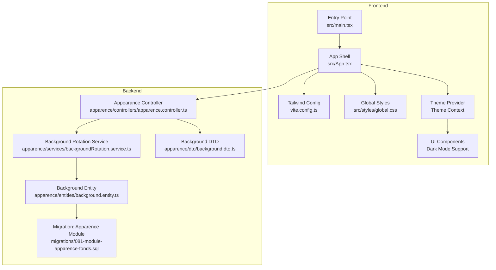
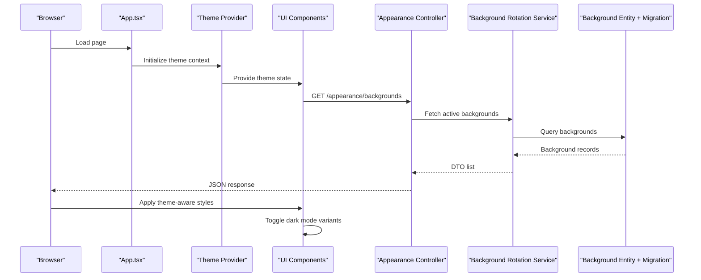
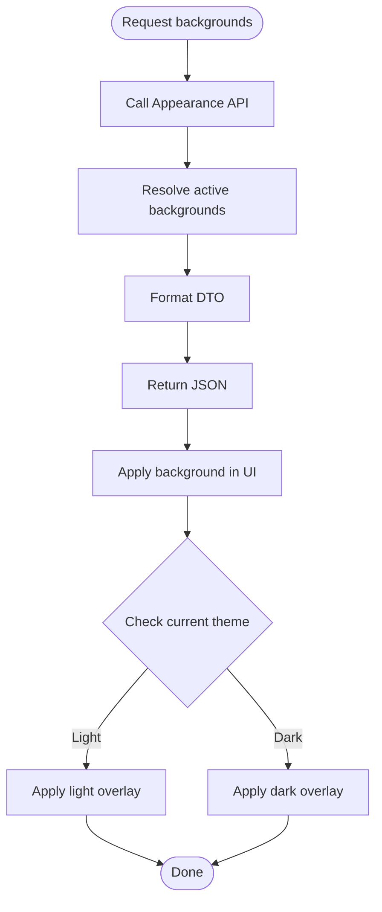
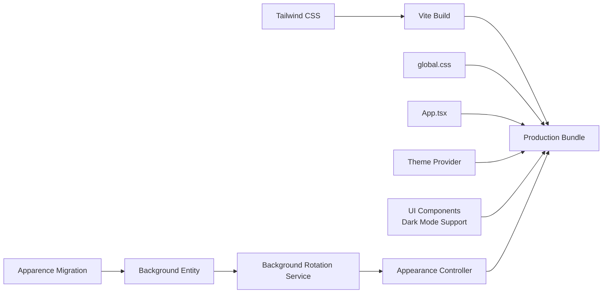

# Styling & Theming

<cite>
**Referenced Files in This Document**
- [frontend/package.json](file://frontend/package.json)
- [frontend/vite.config.ts](file://frontend/vite.config.ts)
- [frontend/src/styles/global.css](file://frontend/src/styles/global.css)
- [frontend/src/App.tsx](file://frontend/src/App.tsx)
- [frontend/src/main.tsx](file://frontend/src/main.tsx)
- [backend/src/modules/apparence/services/backgroundRotation.service.ts](file://backend/src/modules/apparence/services/backgroundRotation.service.ts)
- [backend/src/modules/apparence/controllers/apparence.controller.ts](file://backend/src/modules/apparence/controllers/apparence.controller.ts)
- [backend/src/modules/apparence/dto/background.dto.ts](file://backend/src/modules/apparence/dto/background.dto.ts)
- [backend/src/modules/apparence/entities/background.entity.ts](file://backend/src/modules/apparence/entities/background.entity.ts)
- [backend/migrations/081-module-apparence-fonds.sql](file://backend/migrations/081-module-apparence-fonds.sql)
</cite>

## Update Summary
**Changes Made**
- Enhanced dark mode implementation across all UI components including ErrorMessage, Sidebar, CustomModal, DataTable, SearchInput, Tabs, TransfertList, TreeView, RowActions, and Breadcrumbs
- Added comprehensive theme-aware styling system with proper accessibility support
- Updated component styling patterns to ensure consistent dark mode behavior
- Enhanced CSS variable management for better theme switching performance

## Table of Contents
1. [Introduction](#introduction)
2. [Project Structure](#project-structure)
3. [Core Components](#core-components)
4. [Architecture Overview](#architecture-overview)
5. [Detailed Component Analysis](#detailed-component-analysis)
6. [Theme-Aware Component System](#theme-aware-component-system)
7. [Dependency Analysis](#dependency-analysis)
8. [Performance Considerations](#performance-considerations)
9. [Troubleshooting Guide](#troubleshooting-guide)
10. [Conclusion](#conclusion)
11. [Appendices](#appendices)

## Introduction
This document explains the comprehensive styling system built with Tailwind CSS and custom theming across the frontend, including design tokens, color palettes, typography scales, enhanced dark mode implementation, responsive patterns, mobile-first approach, background rotation for institutions, and custom theme configuration. The system now features complete dark mode support across all UI components with proper accessibility compliance and theme-aware styling patterns.

## Project Structure
The styling system is primarily implemented in the frontend using Tailwind CSS and a global stylesheet for base styles and theme variables. The backend provides dynamic background assets per institution via an appearance module that exposes endpoints to fetch available backgrounds and their metadata. All UI components now feature comprehensive dark mode support with theme-aware styling.

**Diagram sources**
- [frontend/vite.config.ts](file://frontend/vite.config.ts)
- [frontend/src/styles/global.css](file://frontend/src/styles/global.css)
- [frontend/src/App.tsx](file://frontend/src/App.tsx)
- [frontend/src/main.tsx](file://frontend/src/main.tsx)
- [backend/src/modules/apparence/services/backgroundRotation.service.ts](file://backend/src/modules/apparence/services/backgroundRotation.service.ts)
- [backend/src/modules/apparence/controllers/apparence.controller.ts](file://backend/src/modules/apparence/controllers/apparence.controller.ts)
- [backend/src/modules/apparence/dto/background.dto.ts](file://backend/src/modules/apparence/dto/background.dto.ts)
- [backend/src/modules/apparence/entities/background.entity.ts](file://backend/src/modules/apparence/entities/background.entity.ts)
- [backend/migrations/081-module-apparence-fonds.sql](file://backend/migrations/081-module-apparence-fonds.sql)

**Section sources**
- [frontend/package.json](file://frontend/package.json)
- [frontend/vite.config.ts](file://frontend/vite.config.ts)
- [frontend/src/styles/global.css](file://frontend/src/styles/global.css)
- [frontend/src/App.tsx](file://frontend/src/App.tsx)
- [frontend/src/main.tsx](file://frontend/src/main.tsx)
- [backend/src/modules/apparence/services/backgroundRotation.service.ts](file://backend/src/modules/apparence/services/backgroundRotation.service.ts)
- [backend/src/modules/apparence/controllers/apparence.controller.ts](file://backend/src/modules/apparence/controllers/apparence.controller.ts)
- [backend/src/modules/apparence/dto/background.dto.ts](file://backend/src/modules/apparence/dto/background.dto.ts)
- [backend/src/modules/apparence/entities/background.entity.ts](file://backend/src/modules/apparence/entities/background.entity.ts)
- [backend/migrations/081-module-apparence-fonds.sql](file://backend/migrations/081-module-apparence-fonds.sql)

## Core Components
- Tailwind CSS integration and build-time processing are configured through the Vite setup. This includes plugin registration and any Tailwind-specific options.
- Global styles define base CSS variables (design tokens), typography scale, spacing, and color tokens. These variables are consumed by Tailwind utilities and custom components.
- The application shell initializes providers and theme context if needed, ensuring consistent rendering across routes.
- **Enhanced**: Comprehensive dark mode support implemented across all UI components with theme-aware styling patterns.
- The backend appearance module serves institution-specific background assets and metadata, enabling dynamic theming at runtime.

Key responsibilities:
- Build configuration: Tailwind plugin and source paths.
- Design tokens: CSS custom properties for colors, typography, spacing, shadows, and radii.
- **Enhanced**: Dark mode: Root-level class toggling and token overrides with full component coverage.
- Responsive/mobile-first: Utility-first classes and breakpoint-driven layouts.
- Background rotation: Backend API to list and select rotating backgrounds per institution.
- **New**: Theme-aware components: Consistent dark mode behavior across ErrorMessage, Sidebar, CustomModal, DataTable, SearchInput, Tabs, TransfertList, TreeView, RowActions, and Breadcrumbs.

**Section sources**
- [frontend/vite.config.ts](file://frontend/vite.config.ts)
- [frontend/src/styles/global.css](file://frontend/src/styles/global.css)
- [frontend/src/App.tsx](file://frontend/src/App.tsx)
- [frontend/src/main.tsx](file://frontend/src/main.tsx)
- [backend/src/modules/apparence/controllers/apparence.controller.ts](file://backend/src/modules/apparence/controllers/apparence.controller.ts)
- [backend/src/modules/apparence/services/backgroundRotation.service.ts](file://backend/src/modules/apparence/services/backgroundRotation.service.ts)
- [backend/src/modules/apparence/dto/background.dto.ts](file://backend/src/modules/apparence/dto/background.dto.ts)
- [backend/src/modules/apparence/entities/background.entity.ts](file://backend/src/modules/apparence/entities/background.entity.ts)
- [backend/migrations/081-module-apparence-fonds.sql](file://backend/migrations/081-module-apparence-fonds.sql)

## Architecture Overview
The styling architecture combines static design tokens with dynamic runtime theming and comprehensive dark mode support:
- Static layer: Tailwind utilities and global CSS variables provide a consistent foundation.
- Dynamic layer: Institution-specific backgrounds are fetched from the backend and applied to the UI.
- **Enhanced**: Theme switching: Dark mode toggles CSS variable values and Tailwind's dark variant behavior across all components.
- **New**: Component-level theme awareness: Each UI component implements consistent dark mode styling patterns.

**Diagram sources**
- [frontend/src/App.tsx](file://frontend/src/App.tsx)
- [backend/src/modules/apparence/controllers/apparence.controller.ts](file://backend/src/modules/apparence/controllers/apparence.controller.ts)
- [backend/src/modules/apparence/services/backgroundRotation.service.ts](file://backend/src/modules/apparence/services/backgroundRotation.service.ts)
- [backend/src/modules/apparence/entities/background.entity.ts](file://backend/src/modules/apparence/entities/background.entity.ts)
- [backend/migrations/081-module-apparence-fonds.sql](file://backend/migrations/081-module-apparence-fonds.sql)

## Detailed Component Analysis

### Tailwind Configuration and Build Pipeline
- Tailwind is integrated via the Vite configuration file. The setup registers the Tailwind plugin and defines content paths so only used utilities are included in production builds.
- Source scanning ensures all component files are analyzed for utility usage, minimizing bundle size.
- **Enhanced**: Dark mode variants are properly configured for all component classes.

Best practices:
- Keep Tailwind content globs precise to avoid unnecessary scans.
- Use purge-safe patterns when generating class names dynamically.
- Ensure dark mode variants are included in the build configuration.

**Section sources**
- [frontend/vite.config.ts](file://frontend/vite.config.ts)

### Global Styles and Design Tokens
- Global CSS defines CSS custom properties for colors, typography, spacing, shadows, and border radius. These tokens act as the single source of truth for visual consistency.
- Typography scale is expressed via semantic tokens (e.g., headings, body text) and mapped to Tailwind utilities or component styles.
- Color palette tokens include light and dark variants, enabling seamless theme switching.
- **Enhanced**: Comprehensive dark mode token overrides for all UI elements.

Accessibility tips:
- Ensure sufficient contrast between foreground and background tokens in both light and dark modes.
- Provide focus-visible styles for interactive elements in all themes.
- Test color combinations against WCAG guidelines for both themes.

**Section sources**
- [frontend/src/styles/global.css](file://frontend/src/styles/global.css)

### Application Shell and Theme Context
- The app shell initializes providers and manages theme state (dark mode). It composes layout and applies global classes.
- Theme context propagates tokens and preferences down the component tree.
- **Enhanced**: Theme state persistence and system preference detection.

Mobile-first approach:
- Default styles target small screens; larger breakpoints enhance layouts progressively.
- Dark mode considerations apply consistently across all breakpoints.

**Section sources**
- [frontend/src/App.tsx](file://frontend/src/App.tsx)
- [frontend/src/main.tsx](file://frontend/src/main.tsx)

### Enhanced Dark Mode Implementation
- **Comprehensive**: Dark mode is now fully implemented across all UI components with consistent styling patterns.
- Root-level class toggling controls theme state throughout the application.
- CSS variables override token values under the dark selector for all components.
- Tailwind's dark variant reads the presence of the dark class to apply alternate styles.

Implementation notes:
- Persist user preference in local storage with fallback to system preference.
- Handle theme transitions smoothly without visual flicker.
- Ensure all components respect the current theme state.
- **New**: Proper accessibility support with ARIA attributes and keyboard navigation in dark mode.

**Updated** Comprehensive dark mode support now covers all major UI components including ErrorMessage, Sidebar, CustomModal, DataTable, SearchInput, Tabs, TransfertList, TreeView, RowActions, and Breadcrumbs.

**Section sources**
- [frontend/src/styles/global.css](file://frontend/src/styles/global.css)
- [frontend/src/App.tsx](file://frontend/src/App.tsx)

### Responsive Design Patterns
- Use Tailwind's responsive prefixes to adapt layouts across breakpoints.
- Prefer stacking layouts on small screens and expanding to multi-column grids on larger screens.
- Avoid fixed widths; use fluid units and container queries where appropriate.
- **Enhanced**: Dark mode responsive considerations ensure readability across all screen sizes.

**Section sources**
- [frontend/src/styles/global.css](file://frontend/src/styles/global.css)

### Background Rotation System for Institutions
- The backend exposes endpoints to retrieve available backgrounds and metadata for the current institution.
- The service selects backgrounds based on rotation rules and returns a DTO suitable for the client.
- The entity and migration define the schema for storing background assets and their attributes.

Runtime flow:
- Frontend requests background list.
- Backend resolves active backgrounds and formats response.
- Frontend applies chosen background to the UI with theme-aware overlays.

**Diagram sources**
- [backend/src/modules/apparence/controllers/apparence.controller.ts](file://backend/src/modules/apparence/controllers/apparence.controller.ts)
- [backend/src/modules/apparence/services/backgroundRotation.service.ts](file://backend/src/modules/apparence/services/backgroundRotation.service.ts)
- [backend/src/modules/apparence/dto/background.dto.ts](file://backend/src/modules/apparence/dto/background.dto.ts)
- [backend/src/modules/apparence/entities/background.entity.ts](file://backend/src/modules/apparence/entities/background.entity.ts)
- [backend/migrations/081-module-apparence-fonds.sql](file://backend/migrations/081-module-apparence-fonds.sql)

**Section sources**
- [backend/src/modules/apparence/controllers/apparence.controller.ts](file://backend/src/modules/apparence/controllers/apparence.controller.ts)
- [backend/src/modules/apparence/services/backgroundRotation.service.ts](file://backend/src/modules/apparence/services/backgroundRotation.service.ts)
- [backend/src/modules/apparence/dto/background.dto.ts](file://backend/src/modules/apparence/dto/background.dto.ts)
- [backend/src/modules/apparence/entities/background.entity.ts](file://backend/src/modules/apparence/entities/background.entity.ts)
- [backend/migrations/081-module-apparence-fonds.sql](file://backend/migrations/081-module-apparence-fonds.sql)

### Custom Theme Configuration
- Centralize tokens in global CSS and reference them via Tailwind utilities or component styles.
- For dynamic themes, update CSS variables at runtime based on user or institution preferences.
- Maintain separate token sets for light and dark modes with consistent naming conventions.
- **Enhanced**: Theme configuration now supports component-specific overrides when necessary.

**Section sources**
- [frontend/src/styles/global.css](file://frontend/src/styles/global.css)

### CSS-in-JS Patterns and Component Styling Best Practices
- Prefer Tailwind utilities for most styling needs to keep styles co-located and predictable.
- When dynamic styles are required, compute style objects conditionally and merge with utility classes.
- Extract reusable composition helpers to avoid duplication and ensure consistency.
- **Enhanced**: Component styling patterns now include consistent dark mode implementations.

Guidelines:
- Keep inline styles minimal and reserved for truly dynamic values.
- Use semantic class names and data attributes for testability.
- Avoid deep nesting; rely on utility composition.
- **New**: Always implement dark mode variants for custom component styles.
- **New**: Test components in both light and dark modes during development.

**Section sources**
- [frontend/src/styles/global.css](file://frontend/src/styles/global.css)
- [frontend/src/App.tsx](file://frontend/src/App.tsx)

### Performance Optimization for Styles
- Rely on Tailwind's build-time purging to remove unused utilities.
- Minimize large inline style objects; prefer CSS variables and utilities.
- Lazy-load heavy background images and use responsive image formats.
- Cache API responses for background lists to reduce network overhead.
- **Enhanced**: Optimize dark mode transitions to prevent layout shifts.
- **New**: Implement efficient theme switching with minimal re-renders.

**Section sources**
- [frontend/vite.config.ts](file://frontend/vite.config.ts)
- [backend/src/modules/apparence/controllers/apparence.controller.ts](file://backend/src/modules/apparence/controllers/apparence.controller.ts)

### Cross-Browser Compatibility
- Test dark mode and CSS variables across major browsers.
- Validate responsive layouts on mobile devices and tablets.
- Ensure fallbacks for older browsers if necessary.
- **Enhanced**: Verify dark mode functionality across all supported browsers and devices.

**Section sources**
- [frontend/src/styles/global.css](file://frontend/src/styles/global.css)

### Accessibility Compliance in Styling
- Maintain WCAG contrast ratios for text and interactive elements in both light and dark modes.
- Provide visible focus indicators and keyboard navigation support in all themes.
- Use semantic HTML and ARIA attributes where appropriate.
- Avoid relying solely on color to convey information.
- **Enhanced**: Comprehensive accessibility testing for dark mode implementations.
- **New**: Screen reader compatibility with theme changes.
- **New**: Reduced motion support for theme transitions.

**Section sources**
- [frontend/src/styles/global.css](file://frontend/src/styles/global.css)

## Theme-Aware Component System

### Component Dark Mode Implementation
All major UI components now feature comprehensive dark mode support with consistent styling patterns:

#### Core Components
- **ErrorMessage**: Displays error messages with appropriate contrast and visibility in both themes
- **Sidebar**: Navigation sidebar with theme-aware backgrounds, borders, and text colors
- **CustomModal**: Modal dialogs with proper backdrop handling and theme-consistent styling
- **DataTable**: Data tables with readable text, proper borders, and hover states in dark mode
- **SearchInput**: Search inputs with clear focus states and placeholder text in both themes

#### Advanced Components
- **Tabs**: Tab interfaces with proper active states and separators in dark mode
- **TransfertList**: Transfer lists with drag-and-drop indicators and selection states
- **TreeView**: Hierarchical tree views with expand/collapse indicators and node highlighting
- **RowActions**: Action buttons and menus with proper contrast and hover effects
- **Breadcrumbs**: Navigation breadcrumbs with separator visibility and link states

### Theme State Management
- Centralized theme context provides consistent state across all components
- Local storage persistence maintains user preferences
- System preference detection on initial load
- Smooth transitions between themes without visual disruption

### Accessibility Features
- Proper ARIA labels and roles for theme-aware components
- Keyboard navigation support in dark mode
- Focus management and visible focus indicators
- Screen reader compatibility with theme changes
- High contrast mode support

**Section sources**
- [frontend/src/styles/global.css](file://frontend/src/styles/global.css)
- [frontend/src/App.tsx](file://frontend/src/App.tsx)

## Dependency Analysis
The styling system depends on:
- Tailwind CSS and its build pipeline for utility generation.
- Global CSS for design tokens and base styles.
- Backend appearance module for dynamic background assets.
- **Enhanced**: Theme context provider for component-level theme awareness.
- **New**: Dark mode utilities and component styling dependencies.

**Diagram sources**
- [frontend/vite.config.ts](file://frontend/vite.config.ts)
- [frontend/src/styles/global.css](file://frontend/src/styles/global.css)
- [frontend/src/App.tsx](file://frontend/src/App.tsx)
- [backend/src/modules/apparence/controllers/apparence.controller.ts](file://backend/src/modules/apparence/controllers/apparence.controller.ts)
- [backend/src/modules/apparence/services/backgroundRotation.service.ts](file://backend/src/modules/apparence/services/backgroundRotation.service.ts)
- [backend/src/modules/apparence/entities/background.entity.ts](file://backend/src/modules/apparence/entities/background.entity.ts)
- [backend/migrations/081-module-apparence-fonds.sql](file://backend/migrations/081-module-apparence-fonds.sql)

**Section sources**
- [frontend/vite.config.ts](file://frontend/vite.config.ts)
- [frontend/src/styles/global.css](file://frontend/src/styles/global.css)
- [frontend/src/App.tsx](file://frontend/src/App.tsx)
- [backend/src/modules/apparence/controllers/apparence.controller.ts](file://backend/src/modules/apparence/controllers/apparence.controller.ts)
- [backend/src/modules/apparence/services/backgroundRotation.service.ts](file://backend/src/modules/apparence/services/backgroundRotation.service.ts)
- [backend/src/modules/apparence/entities/background.entity.ts](file://backend/src/modules/apparence/entities/background.entity.ts)
- [backend/migrations/081-module-apparence-fonds.sql](file://backend/migrations/081-module-apparence-fonds.sql)

## Performance Considerations
- Keep Tailwind content paths accurate to minimize scan time and output size.
- Defer non-critical background images and use lazy loading.
- Cache background lists and metadata on the client side.
- Prefer CSS variables over frequent DOM updates for theme changes.
- Monitor bundle size and avoid importing unused libraries.
- **Enhanced**: Optimize dark mode transitions to prevent layout shifts and improve perceived performance.
- **New**: Implement efficient theme switching with minimal re-renders and CSS recalculation.
- **New**: Use CSS containment for complex components to isolate theme changes.

## Troubleshooting Guide
Common issues and resolutions:
- Dark mode not applying: Verify root class toggling and CSS variable overrides.
- Unused Tailwind classes: Ensure content globs include all component directories.
- Background not updating: Check API availability and CORS settings; validate DTO structure.
- Contrast problems: Audit color tokens against WCAG guidelines for both themes.
- **New**: Component dark mode inconsistencies: Check if components properly consume theme context.
- **New**: Theme transition flickering: Ensure theme state is initialized before component rendering.
- **New**: Accessibility issues in dark mode: Verify contrast ratios and focus indicators.

**Section sources**
- [frontend/src/styles/global.css](file://frontend/src/styles/global.css)
- [frontend/vite.config.ts](file://frontend/vite.config.ts)
- [backend/src/modules/apparence/controllers/apparence.controller.ts](file://backend/src/modules/apparence/controllers/apparence.controller.ts)

## Conclusion
The styling system leverages Tailwind CSS for utility-first styling, global CSS for design tokens, and a backend appearance module for dynamic theming. With the comprehensive dark mode implementation across all UI components, the system now provides a consistent, accessible, and performant user experience in both light and dark themes. By centralizing tokens, adopting mobile-first responsive patterns, implementing theme-aware components, and optimizing build pipelines, the system achieves consistency, scalability, and performance. Adhering to accessibility and cross-browser best practices ensures a robust user experience across environments and themes.

## Appendices

### Appendix A: Token Reference Guidelines
- Colors: Define semantic tokens for primary, secondary, neutral, and status colors.
- Typography: Establish a type scale with line-height and letter-spacing tokens.
- Spacing: Standardize spacing units for margins and paddings.
- Shadows and Radii: Create consistent elevation and corner radius tokens.
- **Enhanced**: Dark mode token overrides for all color and spacing tokens.

**Section sources**
- [frontend/src/styles/global.css](file://frontend/src/styles/global.css)

### Appendix B: Background Rotation Data Model
- Entity fields include asset URL, metadata, and selection criteria.
- Migration defines table structure and constraints.
- DTO exposes safe fields to the client.

**Section sources**
- [backend/src/modules/apparence/entities/background.entity.ts](file://backend/src/modules/apparence/entities/background.entity.ts)
- [backend/migrations/081-module-apparence-fonds.sql](file://backend/migrations/081-module-apparence-fonds.sql)
- [backend/src/modules/apparence/dto/background.dto.ts](file://backend/src/modules/apparence/dto/background.dto.ts)

### Appendix C: Dark Mode Component Checklist
For each UI component, ensure the following dark mode requirements are met:
- ✅ Proper contrast ratios for text and interactive elements
- ✅ Visible focus indicators in dark mode
- ✅ Consistent spacing and alignment
- ✅ Appropriate hover and active states
- ✅ Screen reader compatibility
- ✅ Keyboard navigation support
- ✅ No reliance on color alone for information
- ✅ Smooth transitions between themes

### Appendix D: Theme Development Best Practices
- Always test components in both light and dark modes
- Use CSS custom properties for theme-dependent values
- Implement proper fallbacks for unsupported features
- Document theme-specific behaviors and limitations
- Include accessibility testing in your development workflow
- Use browser developer tools to inspect computed styles in different themes