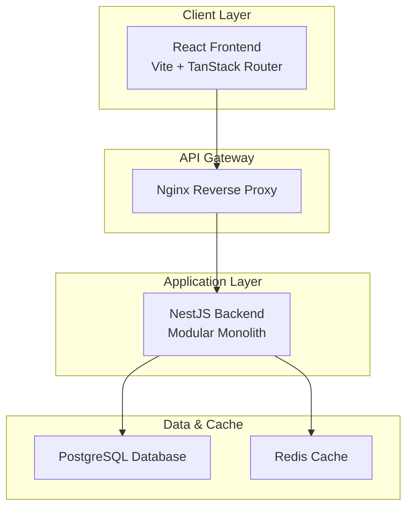
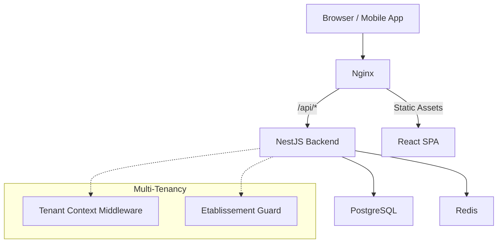
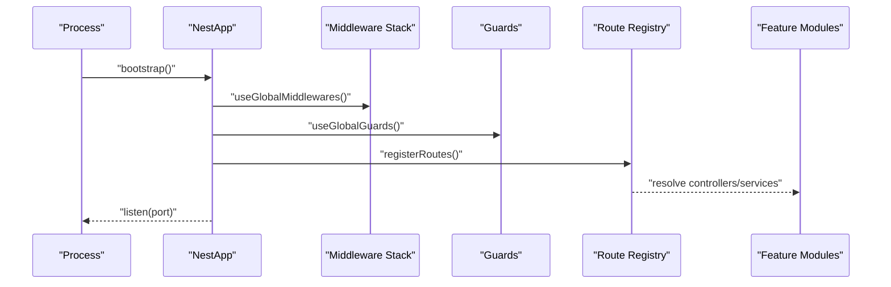
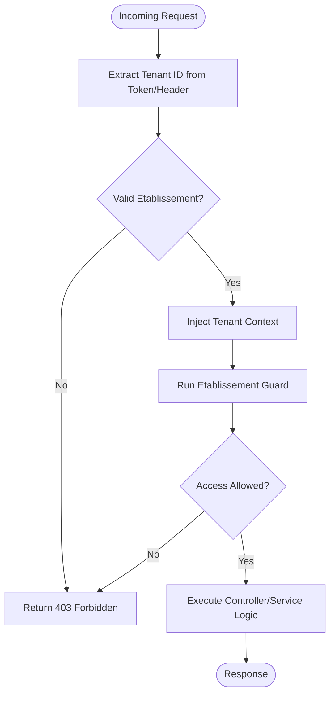
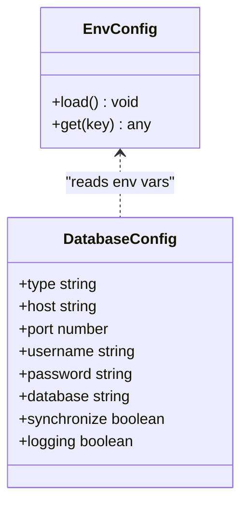
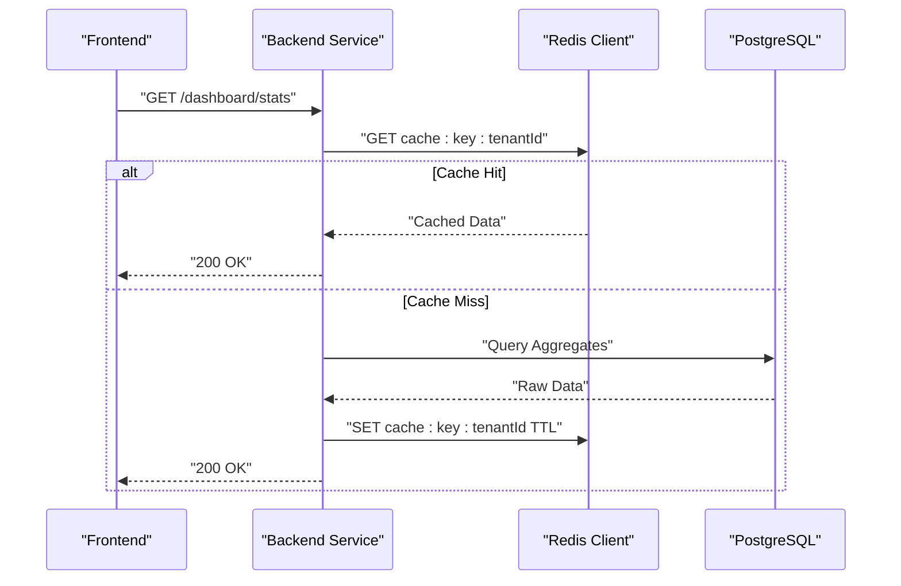
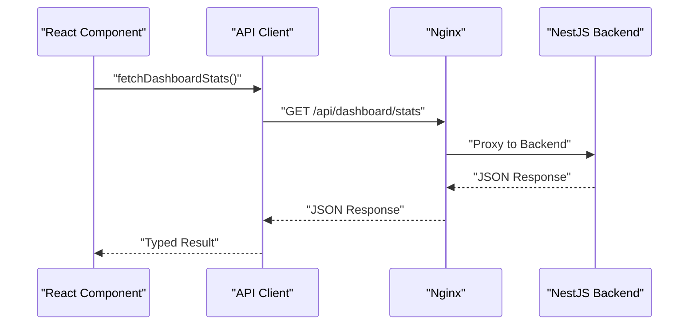
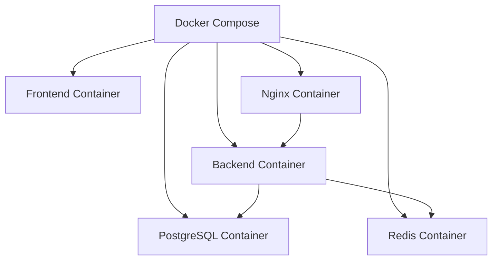
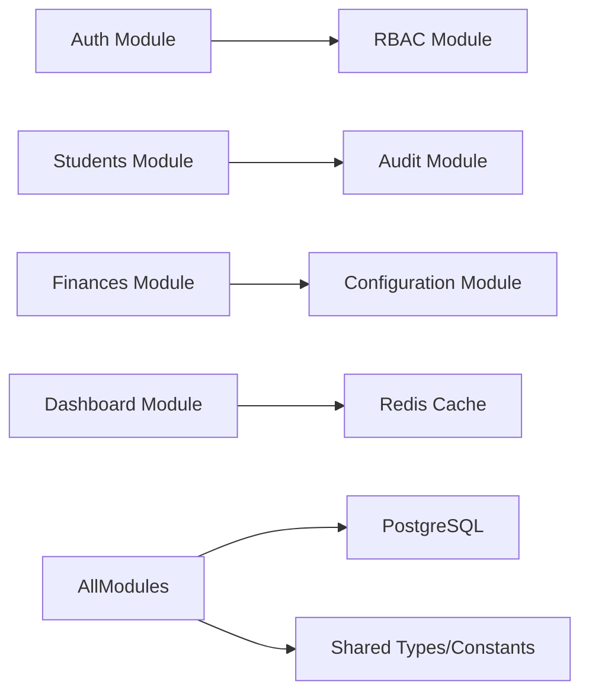

# Overall Architecture Overview

<cite>
**Referenced Files in This Document**
- [docker-compose.yml](file://docker/docker-compose.yml)
- [Dockerfile.backend](file://docker/Dockerfile.backend)
- [Dockerfile.frontend](file://docker/Dockerfile.frontend)
- [nginx.conf](file://docker/nginx.conf)
- [backend/src/index.ts](file://backend/src/index.ts)
- [backend/src/app.ts](file://backend/src/app.ts)
- [backend/src/config/database.config.ts](file://backend/src/config/database.config.ts)
- [backend/src/config/env.config.ts](file://backend/src/config/env.config.ts)
- [backend/src/modules/auth/guards/etablissement.guard.ts](file://backend/src/modules/auth/guards/etablissement.guard.ts)
- [backend/src/common/middlewares/tenant-context.middleware.ts](file://backend/src/common/middlewares/tenant-context.middleware.ts)
- [backend/src/modules/configuration/services/configuration.service.ts](file://backend/src/modules/configuration/services/configuration.service.ts)
- [backend/src/modules/dashboard/services/dashboard.service.ts](file://backend/src/modules/dashboard/services/dashboard.service.ts)
- [backend/src/routes/route-registry.ts](file://backend/src/routes/route-registry.ts)
- [frontend/vite.config.ts](file://frontend/vite.config.ts)
- [frontend/src/lib/api-client.ts](file://frontend/src/lib/api-client.ts)
</cite>

## Table of Contents
1. [Introduction](#introduction)
2. [Project Structure](#project-structure)
3. [Core Components](#core-components)
4. [Architecture Overview](#architecture-overview)
5. [Detailed Component Analysis](#detailed-component-analysis)
6. [Dependency Analysis](#dependency-analysis)
7. [Performance Considerations](#performance-considerations)
8. [Troubleshooting Guide](#troubleshooting-guide)
9. [Conclusion](#conclusion)

## Introduction
This document presents the overall system architecture for eLISAschool, a full-stack educational management platform designed to support multiple independent institutions within a single deployment. The system follows a modular monolith pattern with clear service boundaries, multi-tenant isolation, and containerized deployment using Docker. It combines a NestJS backend, a React frontend, PostgreSQL for persistence, and Redis for caching and session storage.

The architecture emphasizes:
- Multi-tenancy by institution (établissement) with strict data isolation
- Modular monolith design that balances microservices benefits with operational simplicity
- Container orchestration via Docker Compose for local and cloud environments
- Clear separation between API services, presentation layer, and data stores
- Caching strategies and performance-oriented database design

## Project Structure
The repository is organized into distinct layers:
- Backend: NestJS application with feature modules, shared utilities, configuration, and database migrations
- Frontend: React application with TanStack Router, feature-based organization, and API client integration
- Docker: Container definitions, compose files, Nginx reverse proxy, and deployment scripts
- Shared: TypeScript types and constants used across frontend and backend
- Docs: Comprehensive documentation covering implementation details, guides, and analysis

**Diagram sources**
- [docker-compose.yml](file://docker/docker-compose.yml)
- [nginx.conf](file://docker/nginx.conf)
- [backend/src/index.ts](file://backend/src/index.ts)
- [backend/src/config/database.config.ts](file://backend/src/config/database.config.ts)

**Section sources**
- [docker-compose.yml](file://docker/docker-compose.yml)
- [Dockerfile.backend](file://docker/Dockerfile.backend)
- [Dockerfile.frontend](file://docker/Dockerfile.frontend)
- [nginx.conf](file://docker/nginx.conf)
- [backend/src/index.ts](file://backend/src/index.ts)
- [backend/src/app.ts](file://backend/src/app.ts)
- [backend/src/config/database.config.ts](file://backend/src/config/database.config.ts)
- [backend/src/config/env.config.ts](file://backend/src/config/env.config.ts)
- [frontend/vite.config.ts](file://frontend/vite.config.ts)
- [frontend/src/lib/api-client.ts](file://frontend/src/lib/api-client.ts)

## Core Components
- Backend Application Entry Point: Initializes NestJS application, global middleware, guards, and module registration.
- Configuration Management: Environment variables and database connection settings are centralized for consistent runtime behavior.
- Multi-Tenant Guard and Context Middleware: Enforce per-institution scoping and propagate tenant context across requests.
- Feature Modules: Domain-driven modules encapsulate business logic (auth, students, finances, HR, scheduling, etc.).
- Route Registry: Centralizes route registration and versioning for maintainable API surface.
- Frontend API Client: Provides typed HTTP calls to backend endpoints with error handling and token management.
- Containerization: Dockerfiles define reproducible builds; docker-compose orchestrates services; Nginx proxies traffic.

Key responsibilities:
- Tenant isolation at request processing time
- Consistent configuration across environments
- Clear module boundaries enabling incremental evolution toward microservices if needed
- Efficient caching and database access patterns

**Section sources**
- [backend/src/index.ts](file://backend/src/index.ts)
- [backend/src/app.ts](file://backend/src/app.ts)
- [backend/src/config/env.config.ts](file://backend/src/config/env.config.ts)
- [backend/src/config/database.config.ts](file://backend/src/config/database.config.ts)
- [backend/src/modules/auth/guards/etablissement.guard.ts](file://backend/src/modules/auth/guards/etablissement.guard.ts)
- [backend/src/common/middlewares/tenant-context.middleware.ts](file://backend/src/common/middlewares/tenant-context.middleware.ts)
- [backend/src/routes/route-registry.ts](file://backend/src/routes/route-registry.ts)
- [frontend/src/lib/api-client.ts](file://frontend/src/lib/api-client.ts)

## Architecture Overview
The system follows a layered architecture with explicit boundaries:
- Presentation Layer: React SPA served by Vite in development and static assets in production.
- API Gateway: Nginx routes external requests to the backend and serves frontend assets.
- Application Layer: NestJS modular monolith with domain modules and cross-cutting concerns (auth, audit, monitoring).
- Data Layer: PostgreSQL for relational data; Redis for caching, sessions, and rate limiting.

**Diagram sources**
- [docker-compose.yml](file://docker/docker-compose.yml)
- [nginx.conf](file://docker/nginx.conf)
- [backend/src/common/middlewares/tenant-context.middleware.ts](file://backend/src/common/middlewares/tenant-context.middleware.ts)
- [backend/src/modules/auth/guards/etablissement.guard.ts](file://backend/src/modules/auth/guards/etablissement.guard.ts)

## Detailed Component Analysis

### Backend Application Bootstrap and Module Registration
The backend initializes the NestJS application, registers global interceptors, filters, guards, and middlewares, then bootstraps controllers and services. The route registry centralizes endpoint definitions and versioning.

**Diagram sources**
- [backend/src/index.ts](file://backend/src/index.ts)
- [backend/src/app.ts](file://backend/src/app.ts)
- [backend/src/routes/route-registry.ts](file://backend/src/routes/route-registry.ts)

**Section sources**
- [backend/src/index.ts](file://backend/src/index.ts)
- [backend/src/app.ts](file://backend/src/app.ts)
- [backend/src/routes/route-registry.ts](file://backend/src/routes/route-registry.ts)

### Multi-Tenant Isolation Pattern
Multi-tenancy is enforced through:
- Etablissement guard validating user’s institution scope
- Tenant context middleware injecting tenant identifiers into request context
- Service-level scoping ensuring queries include tenant constraints

**Diagram sources**
- [backend/src/modules/auth/guards/etablissement.guard.ts](file://backend/src/modules/auth/guards/etablissement.guard.ts)
- [backend/src/common/middlewares/tenant-context.middleware.ts](file://backend/src/common/middlewares/tenant-context.middleware.ts)

**Section sources**
- [backend/src/modules/auth/guards/etablissement.guard.ts](file://backend/src/modules/auth/guards/etablissement.guard.ts)
- [backend/src/common/middlewares/tenant-context.middleware.ts](file://backend/src/common/middlewares/tenant-context.middleware.ts)

### Configuration and Environment Management
Configuration is centralized via environment variables and typed config modules. Database connections and Redis settings are loaded consistently across environments.

**Diagram sources**
- [backend/src/config/env.config.ts](file://backend/src/config/env.config.ts)
- [backend/src/config/database.config.ts](file://backend/src/config/database.config.ts)

**Section sources**
- [backend/src/config/env.config.ts](file://backend/src/config/env.config.ts)
- [backend/src/config/database.config.ts](file://backend/src/config/database.config.ts)

### Caching Strategy with Redis
Caching is implemented at service level for frequently accessed data such as dashboard aggregates and configuration values. Keys are scoped by tenant to ensure isolation.

**Diagram sources**
- [backend/src/modules/dashboard/services/dashboard.service.ts](file://backend/src/modules/dashboard/services/dashboard.service.ts)
- [backend/src/modules/configuration/services/configuration.service.ts](file://backend/src/modules/configuration/services/configuration.service.ts)

**Section sources**
- [backend/src/modules/dashboard/services/dashboard.service.ts](file://backend/src/modules/dashboard/services/dashboard.service.ts)
- [backend/src/modules/configuration/services/configuration.service.ts](file://backend/src/modules/configuration/services/configuration.service.ts)

### Frontend Integration and API Client
The React frontend communicates with the backend via a typed API client that handles authentication tokens, base URL configuration, and error normalization.

**Diagram sources**
- [frontend/src/lib/api-client.ts](file://frontend/src/lib/api-client.ts)
- [frontend/vite.config.ts](file://frontend/vite.config.ts)
- [nginx.conf](file://docker/nginx.conf)

**Section sources**
- [frontend/src/lib/api-client.ts](file://frontend/src/lib/api-client.ts)
- [frontend/vite.config.ts](file://frontend/vite.config.ts)
- [nginx.conf](file://docker/nginx.conf)

### Containerization and Service Orchestration
Docker containers encapsulate each service:
- Backend image built from Dockerfile.backend
- Frontend image built from Dockerfile.frontend
- Nginx reverse proxy configured via nginx.conf
- Services orchestrated via docker-compose.yml

**Diagram sources**
- [docker-compose.yml](file://docker/docker-compose.yml)
- [Dockerfile.backend](file://docker/Dockerfile.backend)
- [Dockerfile.frontend](file://docker/Dockerfile.frontend)
- [nginx.conf](file://docker/nginx.conf)

**Section sources**
- [docker-compose.yml](file://docker/docker-compose.yml)
- [Dockerfile.backend](file://docker/Dockerfile.backend)
- [Dockerfile.frontend](file://docker/Dockerfile.frontend)
- [nginx.conf](file://docker/nginx.conf)

## Dependency Analysis
The modular monolith organizes dependencies by feature modules with shared infrastructure:
- Cross-cutting concerns (auth, audit, monitoring) are reusable across modules
- Database entities and migrations are versioned and applied centrally
- Redis usage is consistent across services for caching and rate limiting
- Frontend depends on backend API contracts defined in shared types

[No sources needed since this diagram shows conceptual relationships without mapping to specific files]

## Performance Considerations
- Database Indexing: Strategic indexes improve query performance for multi-tenant filtered queries.
- Caching Layers: Redis caches reduce database load for read-heavy endpoints like dashboards and configuration.
- Connection Pooling: Database connection pooling ensures efficient resource utilization under load.
- Static Asset Optimization: Frontend assets are optimized and cached via Nginx.
- Pagination and Filtering: API endpoints implement pagination to limit payload sizes.

[No sources needed since this section provides general guidance]

## Troubleshooting Guide
Common issues and resolutions:
- Multi-tenant Access Denied: Verify etablissement guard logic and tenant context propagation.
- Redis Connectivity Errors: Check Redis host/port configuration and network policies.
- Database Migration Failures: Review migration logs and schema consistency.
- CORS Issues: Ensure Nginx and backend CORS settings align with frontend origin.

**Section sources**
- [backend/src/modules/auth/guards/etablissement.guard.ts](file://backend/src/modules/auth/guards/etablissement.guard.ts)
- [backend/src/common/middlewares/tenant-context.middleware.ts](file://backend/src/common/middlewares/tenant-context.middleware.ts)
- [backend/src/config/database.config.ts](file://backend/src/config/database.config.ts)
- [backend/src/config/env.config.ts](file://backend/src/config/env.config.ts)

## Conclusion
eLISAschool’s architecture delivers a robust, scalable, and maintainable platform for educational institutions. The modular monolith pattern enables clear boundaries and incremental evolution while simplifying operations. Multi-tenancy ensures data isolation, and containerization streamlines deployment. With PostgreSQL and Redis providing reliable persistence and caching, the system balances performance with operational efficiency.