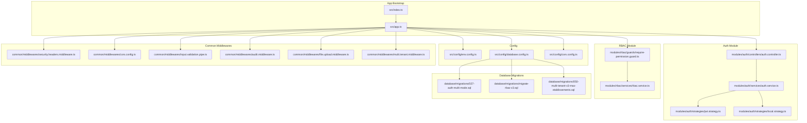
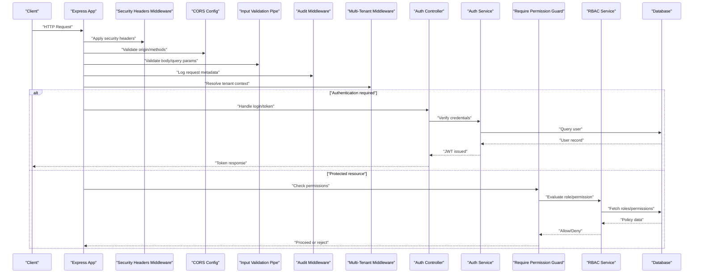
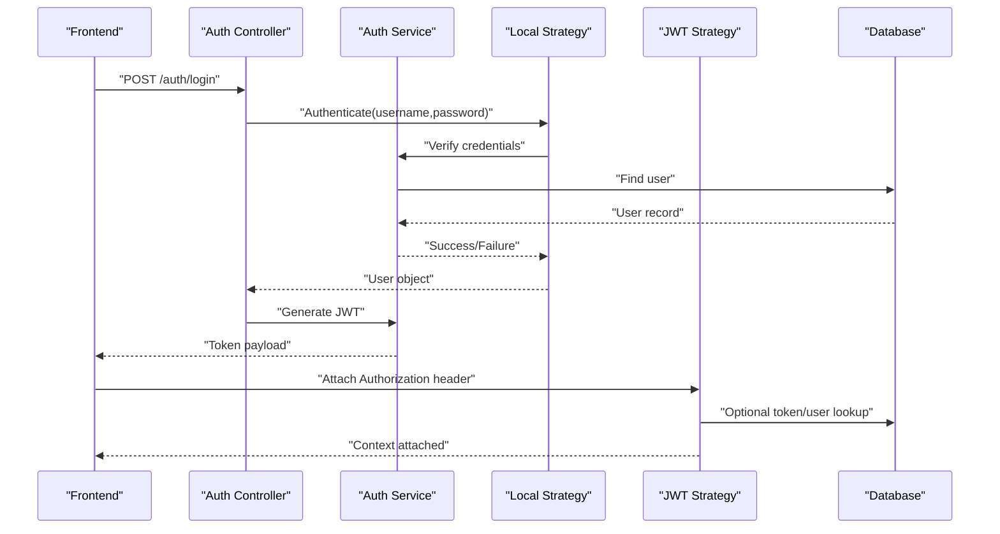
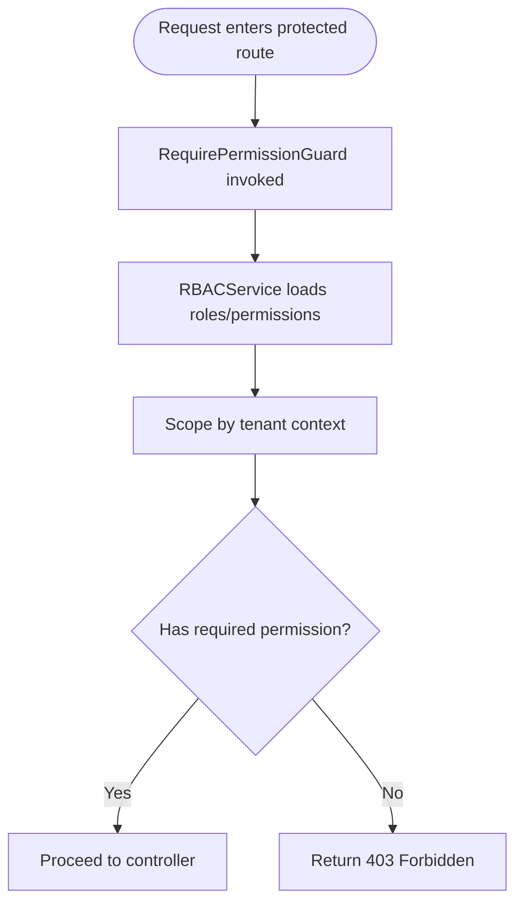
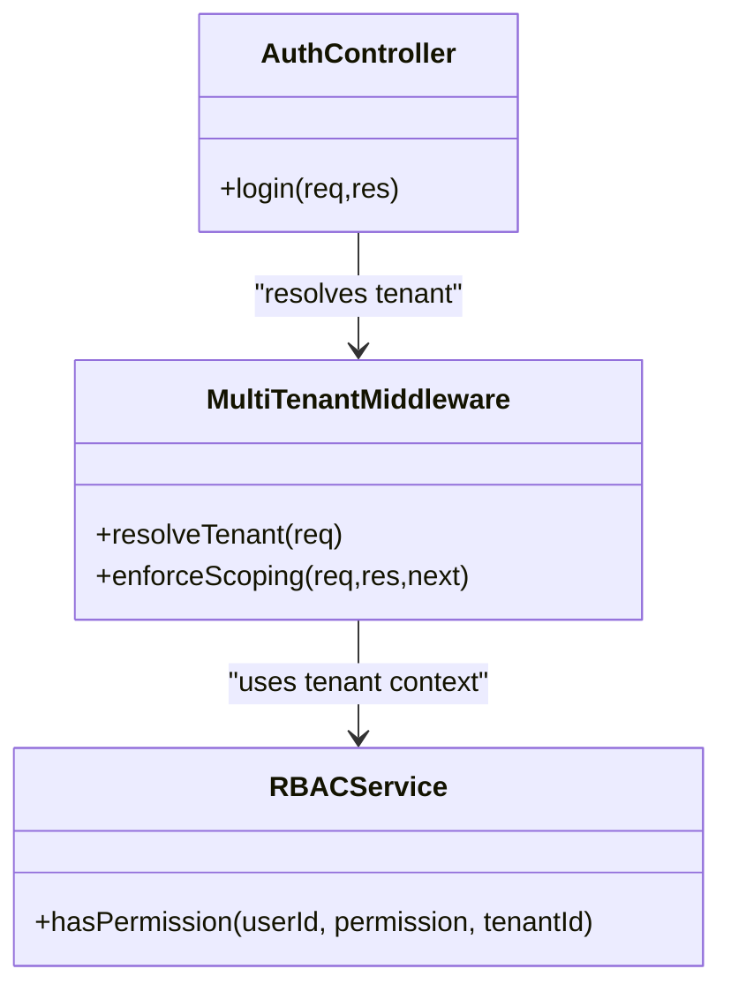
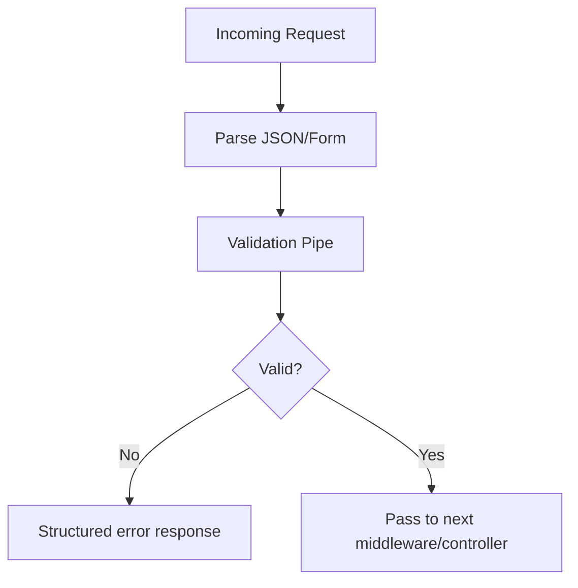
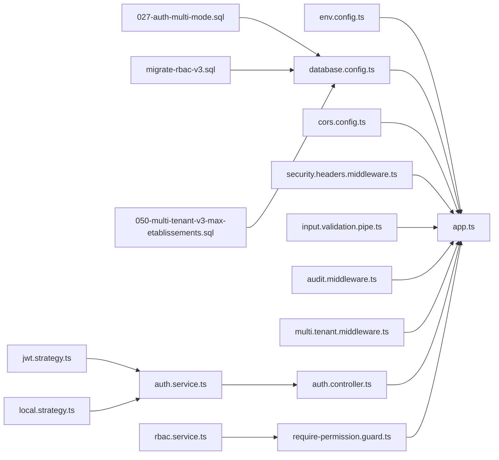

# Security Architecture

<cite>
**Referenced Files in This Document**
- [app.ts](file://backend/src/app.ts)
- [index.ts](file://backend/src/index.ts)
- [env.config.ts](file://backend/src/config/env.config.ts)
- [database.config.ts](file://backend/src/config/database.config.ts)
- [auth.controller.ts](file://backend/src/modules/auth/controllers/auth.controller.ts)
- [auth.service.ts](file://backend/src/modules/auth/services/auth.service.ts)
- [jwt.strategy.ts](file://backend/src/modules/auth/strategies/jwt.strategy.ts)
- [local.strategy.ts](file://backend/src/modules/auth/strategies/local.strategy.ts)
- [require-permission.guard.ts](file://backend/src/modules/rbac/guards/require-permission.guard.ts)
- [rbac.service.ts](file://backend/src/modules/rbac/services/rbac.service.ts)
- [audit.middleware.ts](file://backend/src/common/middlewares/audit.middleware.ts)
- [cors.config.ts](file://backend/src/config/cors.config.ts)
- [security.headers.middleware.ts](file://backend/src/common/middlewares/security.headers.middleware.ts)
- [input.validation.pipe.ts](file://backend/src/common/pipes/input.validation.pipe.ts)
- [file.upload.middleware.ts](file://backend/src/common/middlewares/file.upload.middleware.ts)
- [multi.tenant.middleware.ts](file://backend/src/common/middlewares/multi.tenant.middleware.ts)
- [027-auth-multi-mode.sql](file://backend/database/migrations/027-auth-multi-mode.sql)
- [migrate-rbac-v3.sql](file://backend/database/migrations/migrate-rbac-v3.sql)
- [050-multi-tenant-v3-max-etablissements.sql](file://backend/database/migrations/050-multi-tenant-v3-max-etablissements.sql)
- [test-multi-tenant-isolation.test.ts](file://backend/test/multi-tenant-isolation.test.ts)
- [SECURE-LOGOUT-IMPLEMENTATION.md](file://docs/autres/SECURE-LOGOUT-IMPLEMENTATION.md)
- [SYSTEME-BLOCAGE-AUTH-DEUX-NIVEAUX.md](file://docs/SYSTEME-BLOCAGE-AUTH-DEUX-NIVEAUX.md)
- [GUIDE-TEST-SECURITE.md](file://docs/guides/GUIDE-TEST-SECURITE.md)
</cite>

## Table of Contents
1. [Introduction](#introduction)
2. [Project Structure](#project-structure)
3. [Core Components](#core-components)
4. [Architecture Overview](#architecture-overview)
5. [Detailed Component Analysis](#detailed-component-analysis)
6. [Dependency Analysis](#dependency-analysis)
7. [Performance Considerations](#performance-considerations)
8. [Troubleshooting Guide](#troubleshooting-guide)
9. [Conclusion](#conclusion)
10. [Appendices](#appendices)

## Introduction
This document describes the security architecture of the application with a focus on authentication, authorization, and data protection. It explains the JWT-based authentication system, role-based access control (RBAC), multi-tenant isolation, password hashing, session management, input validation, audit logging, security headers, CORS configuration, secure API communication, file upload security, vulnerability mitigation, compliance considerations, and best practices. The goal is to provide both high-level understanding and code-level traceability for developers and operators.

## Project Structure
Security-related functionality is implemented across dedicated modules and shared infrastructure:
- Authentication module provides login, token issuance, and strategy configuration.
- RBAC module implements permission checks via guards and services.
- Common middlewares enforce security headers, CORS, input validation, audit logging, and tenant scoping.
- Configuration centralizes environment variables, database connectivity, and CORS settings.
- Database migrations define schema changes related to authentication modes, RBAC, and multi-tenant constraints.
- Tests validate multi-tenant isolation behavior.

**Diagram sources**
- [index.ts](file://backend/src/index.ts)
- [app.ts](file://backend/src/app.ts)
- [env.config.ts](file://backend/src/config/env.config.ts)
- [database.config.ts](file://backend/src/config/database.config.ts)
- [cors.config.ts](file://backend/src/config/cors.config.ts)
- [auth.controller.ts](file://backend/src/modules/auth/controllers/auth.controller.ts)
- [auth.service.ts](file://backend/src/modules/auth/services/auth.service.ts)
- [jwt.strategy.ts](file://backend/src/modules/auth/strategies/jwt.strategy.ts)
- [local.strategy.ts](file://backend/src/modules/auth/strategies/local.strategy.ts)
- [require-permission.guard.ts](file://backend/src/modules/rbac/guards/require-permission.guard.ts)
- [rbac.service.ts](file://backend/src/modules/rbac/services/rbac.service.ts)
- [security.headers.middleware.ts](file://backend/src/common/middlewares/security.headers.middleware.ts)
- [input.validation.pipe.ts](file://backend/src/common/pipes/input.validation.pipe.ts)
- [audit.middleware.ts](file://backend/src/common/middlewares/audit.middleware.ts)
- [file.upload.middleware.ts](file://backend/src/common/middlewares/file.upload.middleware.ts)
- [multi.tenant.middleware.ts](file://backend/src/common/middlewares/multi.tenant.middleware.ts)
- [027-auth-multi-mode.sql](file://backend/database/migrations/027-auth-multi-mode.sql)
- [migrate-rbac-v3.sql](file://backend/database/migrations/migrate-rbac-v3.sql)
- [050-multi-tenant-v3-max-etablissements.sql](file://backend/database/migrations/050-multi-tenant-v3-max-etablissements.sql)

**Section sources**
- [index.ts](file://backend/src/index.ts)
- [app.ts](file://backend/src/app.ts)
- [env.config.ts](file://backend/src/config/env.config.ts)
- [database.config.ts](file://backend/src/config/database.config.ts)
- [cors.config.ts](file://backend/src/config/cors.config.ts)

## Core Components
- Authentication controller and service handle credential verification, token generation, and logout flows.
- JWT and local strategies implement Passport-based authentication mechanisms.
- RBAC guard enforces permissions at route level using RBAC service.
- Shared middlewares apply security headers, CORS policy, input validation, audit logging, file upload restrictions, and multi-tenant scoping.
- Environment and database configurations centralize secrets and connection parameters.
- Database migrations establish authentication modes, RBAC structures, and multi-tenant constraints.

Key responsibilities:
- Enforce least privilege via RBAC.
- Isolate tenants by etablishment context.
- Validate all inputs and sanitize uploads.
- Log security-relevant events.
- Configure strict HTTP security headers and CORS.

**Section sources**
- [auth.controller.ts](file://backend/src/modules/auth/controllers/auth.controller.ts)
- [auth.service.ts](file://backend/src/modules/auth/services/auth.service.ts)
- [jwt.strategy.ts](file://backend/src/modules/auth/strategies/jwt.strategy.ts)
- [local.strategy.ts](file://backend/src/modules/auth/strategies/local.strategy.ts)
- [require-permission.guard.ts](file://backend/src/modules/rbac/guards/require-permission.guard.ts)
- [rbac.service.ts](file://backend/src/modules/rbac/services/rbac.service.ts)
- [security.headers.middleware.ts](file://backend/src/common/middlewares/security.headers.middleware.ts)
- [input.validation.pipe.ts](file://backend/src/common/pipes/input.validation.pipe.ts)
- [audit.middleware.ts](file://backend/src/common/middlewares/audit.middleware.ts)
- [file.upload.middleware.ts](file://backend/src/common/middlewares/file.upload.middleware.ts)
- [multi.tenant.middleware.ts](file://backend/src/common/middlewares/multi.tenant.middleware.ts)
- [env.config.ts](file://backend/src/config/env.config.ts)
- [database.config.ts](file://backend/src/config/database.config.ts)

## Architecture Overview
The request lifecycle integrates multiple security layers:
- Global middlewares set security headers, parse and validate inputs, log audit events, and scope requests to tenants.
- Controllers invoke auth services to authenticate users and issue tokens.
- Guards check permissions before controllers execute business logic.
- Database layer enforces multi-tenant constraints defined by migrations.

**Diagram sources**
- [app.ts](file://backend/src/app.ts)
- [security.headers.middleware.ts](file://backend/src/common/middlewares/security.headers.middleware.ts)
- [cors.config.ts](file://backend/src/config/cors.config.ts)
- [input.validation.pipe.ts](file://backend/src/common/pipes/input.validation.pipe.ts)
- [audit.middleware.ts](file://backend/src/common/middlewares/audit.middleware.ts)
- [multi.tenant.middleware.ts](file://backend/src/common/middlewares/multi.tenant.middleware.ts)
- [auth.controller.ts](file://backend/src/modules/auth/controllers/auth.controller.ts)
- [auth.service.ts](file://backend/src/modules/auth/services/auth.service.ts)
- [require-permission.guard.ts](file://backend/src/modules/rbac/guards/require-permission.guard.ts)
- [rbac.service.ts](file://backend/src/modules/rbac/services/rbac.service.ts)

## Detailed Component Analysis

### Authentication System (JWT + Local Strategy)
- Login flow validates credentials via local strategy and issues JWTs through the auth service.
- Protected routes rely on JWT strategy to extract and verify tokens.
- Secure logout clears server-side state and invalidates sessions where applicable.

**Diagram sources**
- [auth.controller.ts](file://backend/src/modules/auth/controllers/auth.controller.ts)
- [auth.service.ts](file://backend/src/modules/auth/services/auth.service.ts)
- [local.strategy.ts](file://backend/src/modules/auth/strategies/local.strategy.ts)
- [jwt.strategy.ts](file://backend/src/modules/auth/strategies/jwt.strategy.ts)

**Section sources**
- [auth.controller.ts](file://backend/src/modules/auth/controllers/auth.controller.ts)
- [auth.service.ts](file://backend/src/modules/auth/services/auth.service.ts)
- [local.strategy.ts](file://backend/src/modules/auth/strategies/local.strategy.ts)
- [jwt.strategy.ts](file://backend/src/modules/auth/strategies/jwt.strategy.ts)
- [SECURE-LOGOUT-IMPLEMENTATION.md](file://docs/autres/SECURE-LOGOUT-IMPLEMENTATION.md)

### Role-Based Access Control (RBAC)
- RequirePermissionGuard evaluates user roles/permissions against route requirements.
- RBACService queries role-permission mappings and supports multi-tenant scoping.
- Migrations define RBAC schema and seed data.

**Diagram sources**
- [require-permission.guard.ts](file://backend/src/modules/rbac/guards/require-permission.guard.ts)
- [rbac.service.ts](file://backend/src/modules/rbac/services/rbac.service.ts)
- [migrate-rbac-v3.sql](file://backend/database/migrations/migrate-rbac-v3.sql)

**Section sources**
- [require-permission.guard.ts](file://backend/src/modules/rbac/guards/require-permission.guard.ts)
- [rbac.service.ts](file://backend/src/modules/rbac/services/rbac.service.ts)
- [migrate-rbac-v3.sql](file://backend/database/migrations/migrate-rbac-v3.sql)

### Multi-Tenant Security Isolation
- Multi-tenant middleware resolves establishment context from request headers or session.
- Database migrations enforce tenant-scoped constraints and limits.
- Tests validate that cross-tenant data access is blocked.

**Diagram sources**
- [multi.tenant.middleware.ts](file://backend/src/common/middlewares/multi.tenant.middleware.ts)
- [rbac.service.ts](file://backend/src/modules/rbac/services/rbac.service.ts)
- [auth.controller.ts](file://backend/src/modules/auth/controllers/auth.controller.ts)
- [050-multi-tenant-v3-max-etablissements.sql](file://backend/database/migrations/050-multi-tenant-v3-max-etablissements.sql)
- [test-multi-tenant-isolation.test.ts](file://backend/test/multi-tenant-isolation.test.ts)

**Section sources**
- [multi.tenant.middleware.ts](file://backend/src/common/middlewares/multi.tenant.middleware.ts)
- [050-multi-tenant-v3-max-etablissements.sql](file://backend/database/migrations/050-multi-tenant-v3-max-etablissements.sql)
- [test-multi-tenant-isolation.test.ts](file://backend/test/multi-tenant-isolation.test.ts)

### Password Hashing and Session Management
- Password hashing uses industry-standard algorithms configured via environment variables.
- Session management integrates with secure cookie policies and optional Redis-backed stores.
- Two-level blocking mechanism mitigates brute-force attacks during authentication.

Best practices applied:
- Salted hashing with configurable cost factor.
- Secure, HttpOnly cookies for session identifiers.
- Rate limiting and account lockout thresholds.

**Section sources**
- [env.config.ts](file://backend/src/config/env.config.ts)
- [SYSTEME-BLOCAGE-AUTH-DEUX-NIVEAUX.md](file://docs/SYSTEME-BLOCAGE-AUTH-DEUX-NIVEAUX.md)
- [SECURE-LOGOUT-IMPLEMENTATION.md](file://docs/autres/SECURE-LOGOUT-IMPLEMENTATION.md)

### Input Validation Strategies
- Centralized validation pipe enforces schema rules on request bodies and query parameters.
- Custom validators prevent injection and malformed payloads.
- Error responses are sanitized to avoid leaking internal details.

**Diagram sources**
- [input.validation.pipe.ts](file://backend/src/common/pipes/input.validation.pipe.ts)

**Section sources**
- [input.validation.pipe.ts](file://backend/src/common/pipes/input.validation.pipe.ts)

### Audit Logging System
- Audit middleware captures security-relevant events such as login attempts, permission denials, and tenant resolution.
- Logs include timestamps, user identity, action type, and outcome.
- Supports structured logging for analysis and alerting.

**Section sources**
- [audit.middleware.ts](file://backend/src/common/middlewares/audit.middleware.ts)

### Security Headers and CORS Configuration
- Security headers middleware applies recommended directives (e.g., HSTS, X-Frame-Options, CSP).
- CORS configuration restricts allowed origins, methods, and credentials.
- Environment-driven toggles allow fine-grained control per deployment.

**Section sources**
- [security.headers.middleware.ts](file://backend/src/common/middlewares/security.headers.middleware.ts)
- [cors.config.ts](file://backend/src/config/cors.config.ts)

### Secure API Communication
- HTTPS termination enforced at reverse proxy; backend trusts upstream TLS.
- Strict transport security and certificate pinning guidance provided in deployment docs.
- Token transmission restricted to secure channels.

[No sources needed since this section provides general guidance]

### File Upload Security
- File upload middleware enforces size limits, MIME type checks, and extension whitelisting.
- Stored files are isolated per tenant and served via controlled endpoints.
- Virus scanning hooks can be integrated at upload time.

**Section sources**
- [file.upload.middleware.ts](file://backend/src/common/middlewares/file.upload.middleware.ts)

### Vulnerability Mitigation Approaches
- Input validation prevents injection and XSS vectors.
- RBAC ensures least privilege across modules.
- Multi-tenant scoping prevents cross-tenant data leakage.
- Brute-force protection reduces credential stuffing risk.
- Security headers mitigate common web vulnerabilities.

**Section sources**
- [input.validation.pipe.ts](file://backend/src/common/pipes/input.validation.pipe.ts)
- [require-permission.guard.ts](file://backend/src/modules/rbac/guards/require-permission.guard.ts)
- [multi.tenant.middleware.ts](file://backend/src/common/middlewares/multi.tenant.middleware.ts)
- [SYSTEME-BLOCAGE-AUTH-DEUX-NIVEAUX.md](file://docs/SYSTEME-BLOCAGE-AUTH-DEUX-NIVEAUX.md)
- [security.headers.middleware.ts](file://backend/src/common/middlewares/security.headers.middleware.ts)

### Compliance Considerations and Best Practices
- Data minimization and purpose limitation in audit logs.
- Retention policies for sensitive logs and session data.
- Regular rotation of secrets and tokens.
- Periodic review of RBAC policies and tenant boundaries.
- Adherence to OWASP Top 10 and GDPR principles.

[No sources needed since this section provides general guidance]

## Dependency Analysis
Security components depend on configuration and database layers, while middlewares orchestrate request processing. RBAC depends on tenant context and user roles.

**Diagram sources**
- [env.config.ts](file://backend/src/config/env.config.ts)
- [database.config.ts](file://backend/src/config/database.config.ts)
- [cors.config.ts](file://backend/src/config/cors.config.ts)
- [app.ts](file://backend/src/app.ts)
- [security.headers.middleware.ts](file://backend/src/common/middlewares/security.headers.middleware.ts)
- [input.validation.pipe.ts](file://backend/src/common/pipes/input.validation.pipe.ts)
- [audit.middleware.ts](file://backend/src/common/middlewares/audit.middleware.ts)
- [multi.tenant.middleware.ts](file://backend/src/common/middlewares/multi.tenant.middleware.ts)
- [auth.controller.ts](file://backend/src/modules/auth/controllers/auth.controller.ts)
- [auth.service.ts](file://backend/src/modules/auth/services/auth.service.ts)
- [jwt.strategy.ts](file://backend/src/modules/auth/strategies/jwt.strategy.ts)
- [local.strategy.ts](file://backend/src/modules/auth/strategies/local.strategy.ts)
- [require-permission.guard.ts](file://backend/src/modules/rbac/guards/require-permission.guard.ts)
- [rbac.service.ts](file://backend/src/modules/rbac/services/rbac.service.ts)
- [027-auth-multi-mode.sql](file://backend/database/migrations/027-auth-multi-mode.sql)
- [migrate-rbac-v3.sql](file://backend/database/migrations/migrate-rbac-v3.sql)
- [050-multi-tenant-v3-max-etablissements.sql](file://backend/database/migrations/050-multi-tenant-v3-max-etablissements.sql)

**Section sources**
- [app.ts](file://backend/src/app.ts)
- [env.config.ts](file://backend/src/config/env.config.ts)
- [database.config.ts](file://backend/src/config/database.config.ts)
- [cors.config.ts](file://backend/src/config/cors.config.ts)
- [auth.controller.ts](file://backend/src/modules/auth/controllers/auth.controller.ts)
- [auth.service.ts](file://backend/src/modules/auth/services/auth.service.ts)
- [jwt.strategy.ts](file://backend/src/modules/auth/strategies/jwt.strategy.ts)
- [local.strategy.ts](file://backend/src/modules/auth/strategies/local.strategy.ts)
- [require-permission.guard.ts](file://backend/src/modules/rbac/guards/require-permission.guard.ts)
- [rbac.service.ts](file://backend/src/modules/rbac/services/rbac.service.ts)
- [027-auth-multi-mode.sql](file://backend/database/migrations/027-auth-multi-mode.sql)
- [migrate-rbac-v3.sql](file://backend/database/migrations/migrate-rbac-v3.sql)
- [050-multi-tenant-v3-max-etablissements.sql](file://backend/database/migrations/050-multi-tenant-v3-max-etablissements.sql)

## Performance Considerations
- Minimize RBAC lookups by caching role-permission mappings when safe.
- Use efficient indexes for tenant-scoped queries.
- Avoid heavy operations in global middlewares; offload to background jobs where possible.
- Tune JWT payload size to reduce overhead.

[No sources needed since this section provides general guidance]

## Troubleshooting Guide
- Authentication failures: Review two-level blocking configuration and audit logs for repeated attempts.
- Permission denials: Verify RBAC assignments and tenant scoping; ensure migration v3 is applied.
- CORS errors: Confirm allowed origins and credentials settings match frontend domain.
- Multi-tenant leaks: Run isolation tests and inspect tenant middleware resolution.
- Input validation errors: Inspect validation schemas and adjust client payloads accordingly.

**Section sources**
- [SYSTEME-BLOCAGE-AUTH-DEUX-NIVEAUX.md](file://docs/SYSTEME-BLOCAGE-AUTH-DEUX-NIVEAUX.md)
- [migrate-rbac-v3.sql](file://backend/database/migrations/migrate-rbac-v3.sql)
- [cors.config.ts](file://backend/src/config/cors.config.ts)
- [test-multi-tenant-isolation.test.ts](file://backend/test/multi-tenant-isolation.test.ts)
- [input.validation.pipe.ts](file://backend/src/common/pipes/input.validation.pipe.ts)

## Conclusion
The security architecture combines layered defenses: robust authentication with JWT, granular RBAC enforcement, strict multi-tenant isolation, comprehensive input validation, audit logging, and hardened HTTP configuration. Together, these mechanisms protect sensitive data, limit attack surfaces, and support compliance objectives. Continuous monitoring, periodic reviews, and adherence to best practices will sustain a strong security posture.

## Appendices
- Testing guidance for security scenarios and penetration testing recommendations.
- Deployment hardening checklist including TLS, secrets management, and container security.

**Section sources**
- [GUIDE-TEST-SECURITE.md](file://docs/guides/GUIDE-TEST-SECURITE.md)