# System Architecture

<cite>
**Referenced Files in This Document**
- [backend/src/app.ts](file://backend/src/app.ts)
- [backend/src/index.ts](file://backend/src/index.ts)
- [backend/src/config/database.config.ts](file://backend/src/config/database.config.ts)
- [backend/src/config/env.config.ts](file://backend/src/config/env.config.ts)
- [backend/src/config/swagger.config.ts](file://backend/src/config/swagger.config.ts)
- [backend/src/modules/auth/guards/jwt-auth.guard.ts](file://backend/src/modules/auth/guards/jwt-auth.guard.ts)
- [backend/src/modules/auth/guards/roles.guard.ts](file://backend/src/modules/auth/guards/roles.guard.ts)
- [backend/src/modules/auth/services/auth.service.ts](file://backend/src/modules/auth/services/auth.service.ts)
- [backend/src/modules/auth/controllers/auth.controller.ts](file://backend/src/modules/auth/controllers/auth.controller.ts)
- [backend/src/modules/etablissement/services/etablissement.service.ts](file://backend/src/modules/etablissement/services/etablissement.service.ts)
- [backend/src/common/middlewares/tenant.middleware.ts](file://backend/src/common/middlewares/tenant.middleware.ts)
- [backend/src/common/interceptors/audit.interceptor.ts](file://backend/src/common/interceptors/audit.interceptor.ts)
- [backend/src/modules/dashboard/services/dashboard.service.ts](file://backend/src/modules/dashboard/services/dashboard.service.ts)
- [backend/src/modules/notifications/services/notification.service.ts](file://backend/src/modules/notifications/services/notification.service.ts)
- [backend/src/modules/monitoring/services/monitoring.service.ts](file://backend/src/modules/monitoring/services/monitoring.service.ts)
- [backend/src/routes/route-registry.ts](file://backend/src/routes/route-registry.ts)
- [backend/database/data-source.ts](file://backend/database/data-source.ts)
- [docker/docker-compose.yml](file://docker/docker-compose.yml)
- [docker/Dockerfile.backend](file://docker/Dockerfile.backend)
- [docker/Dockerfile.frontend](file://docker/Dockerfile.frontend)
- [docker/nginx.conf](file://docker/nginx.conf)
- [frontend/src/App.tsx](file://frontend/src/App.tsx)
- [frontend/src/main.tsx](file://frontend/src/main.tsx)
- [frontend/vite.config.ts](file://frontend/vite.config.ts)
</cite>

## Table of Contents
1. [Introduction](#introduction)
2. [Project Structure](#project-structure)
3. [Core Components](#core-components)
4. [Architecture Overview](#architecture-overview)
5. [Detailed Component Analysis](#detailed-component-analysis)
6. [Dependency Analysis](#dependency-analysis)
7. [Performance Considerations](#performance-considerations)
8. [Troubleshooting Guide](#troubleshooting-guide)
9. [Conclusion](#conclusion)
10. [Appendices](#appendices)

## Introduction
This document describes the overall system architecture for eLISAschool, a multi-tenant school management platform. It covers the high-level design including the NestJS backend, React frontend, PostgreSQL database, and Redis caching layer. The system follows a modular, microservices-inspired structure within a single monorepo, with clear separation of concerns across modules, shared utilities, and infrastructure configuration.

Key architectural themes:
- Multi-tenancy by establishment (tenant isolation at application and data layers)
- Modular NestJS backend with Repository and Service Layer patterns
- Role-based access control (RBAC) and JWT authentication
- Caching via Redis for performance optimization
- Containerized deployment using Docker Compose with Nginx reverse proxy
- Frontend built with React and Vite, organized by features and routes

## Project Structure
The repository is organized into three primary areas:
- Backend: NestJS application with feature modules, common utilities, configuration, and database migrations
- Frontend: React application with feature-based organization and route definitions
- Docker: Containerization and orchestration files for local and production environments

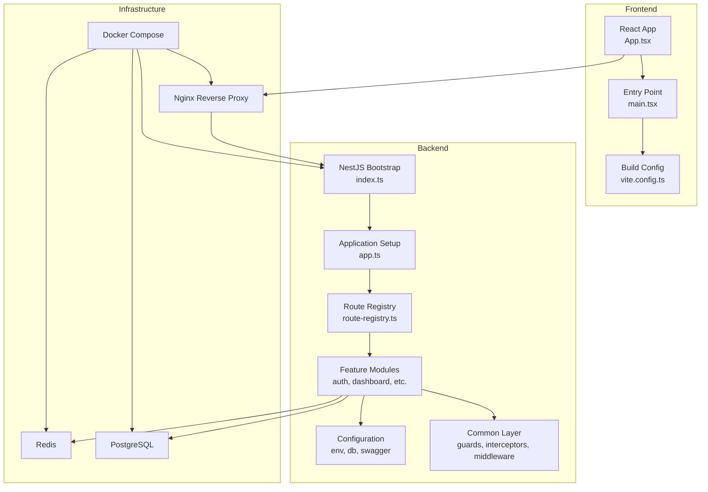

**Diagram sources**
- [backend/src/index.ts](file://backend/src/index.ts)
- [backend/src/app.ts](file://backend/src/app.ts)
- [backend/src/routes/route-registry.ts](file://backend/src/routes/route-registry.ts)
- [docker/docker-compose.yml](file://docker/docker-compose.yml)
- [docker/nginx.conf](file://docker/nginx.conf)
- [frontend/src/App.tsx](file://frontend/src/App.tsx)
- [frontend/src/main.tsx](file://frontend/src/main.tsx)
- [frontend/vite.config.ts](file://frontend/vite.config.ts)

**Section sources**
- [backend/src/index.ts](file://backend/src/index.ts)
- [backend/src/app.ts](file://backend/src/app.ts)
- [backend/src/routes/route-registry.ts](file://backend/src/routes/route-registry.ts)
- [docker/docker-compose.yml](file://docker/docker-compose.yml)
- [docker/nginx.conf](file://docker/nginx.conf)
- [frontend/src/App.tsx](file://frontend/src/App.tsx)
- [frontend/src/main.tsx](file://frontend/src/main.tsx)
- [frontend/vite.config.ts](file://frontend/vite.config.ts)

## Core Components
- NestJS Application Bootstrap: Initializes the HTTP server, global guards, interceptors, and module registration.
- Route Registry: Centralizes API route definitions and controller imports for maintainability.
- Authentication Module: Provides JWT-based login, token issuance, and session handling.
- RBAC Guards: Enforce role and permission checks on protected endpoints.
- Tenant Middleware: Injects tenant context (establishment ID) into requests for multi-tenant scoping.
- Audit Interceptor: Captures request/response metadata for audit logging.
- Database Configuration: TypeORM DataSource setup with connection pooling and migration support.
- Environment Configuration: Loads environment variables for DB, Redis, JWT secrets, and feature flags.
- Swagger Configuration: Generates API documentation from decorators.
- Dashboard and Notifications Services: Provide domain-specific business logic and orchestrate cross-module interactions.
- Monitoring Service: Exposes health checks and metrics endpoints.

**Section sources**
- [backend/src/index.ts](file://backend/src/index.ts)
- [backend/src/app.ts](file://backend/src/app.ts)
- [backend/src/routes/route-registry.ts](file://backend/src/routes/route-registry.ts)
- [backend/src/modules/auth/services/auth.service.ts](file://backend/src/modules/auth/services/auth.service.ts)
- [backend/src/modules/auth/guards/jwt-auth.guard.ts](file://backend/src/modules/auth/guards/jwt-auth.guard.ts)
- [backend/src/modules/auth/guards/roles.guard.ts](file://backend/src/modules/auth/guards/roles.guard.ts)
- [backend/src/common/middlewares/tenant.middleware.ts](file://backend/src/common/middlewares/tenant.middleware.ts)
- [backend/src/common/interceptors/audit.interceptor.ts](file://backend/src/common/interceptors/audit.interceptor.ts)
- [backend/src/config/database.config.ts](file://backend/src/config/database.config.ts)
- [backend/src/config/env.config.ts](file://backend/src/config/env.config.ts)
- [backend/src/config/swagger.config.ts](file://backend/src/config/swagger.config.ts)
- [backend/src/modules/dashboard/services/dashboard.service.ts](file://backend/src/modules/dashboard/services/dashboard.service.ts)
- [backend/src/modules/notifications/services/notification.service.ts](file://backend/src/modules/notifications/services/notification.service.ts)
- [backend/src/modules/monitoring/services/monitoring.service.ts](file://backend/src/modules/monitoring/services/monitoring.service.ts)

## Architecture Overview
The system uses a layered architecture:
- Presentation Layer: React frontend served via Nginx; communicates with NestJS APIs over HTTP(S).
- API Gateway: Nginx acts as reverse proxy, routing frontend assets and API calls to backend services.
- Application Layer: NestJS controllers handle HTTP requests, delegating to services for business logic.
- Domain Layer: Feature modules encapsulate business rules, repositories, and DTOs.
- Infrastructure Layer: PostgreSQL stores persistent data; Redis provides caching and session storage.

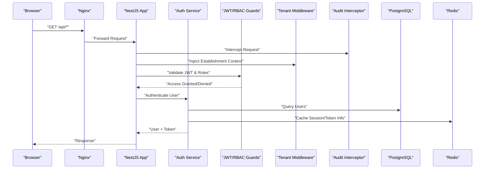

**Diagram sources**
- [docker/nginx.conf](file://docker/nginx.conf)
- [backend/src/index.ts](file://backend/src/index.ts)
- [backend/src/common/interceptors/audit.interceptor.ts](file://backend/src/common/interceptors/audit.interceptor.ts)
- [backend/src/common/middlewares/tenant.middleware.ts](file://backend/src/common/middlewares/tenant.middleware.ts)
- [backend/src/modules/auth/guards/jwt-auth.guard.ts](file://backend/src/modules/auth/guards/jwt-auth.guard.ts)
- [backend/src/modules/auth/guards/roles.guard.ts](file://backend/src/modules/auth/guards/roles.guard.ts)
- [backend/src/modules/auth/services/auth.service.ts](file://backend/src/modules/auth/services/auth.service.ts)
- [backend/database/data-source.ts](file://backend/database/data-source.ts)

## Detailed Component Analysis

### Authentication and Authorization Flow
Authentication uses JWT tokens issued after successful login. Authorization enforces roles and permissions via guards.

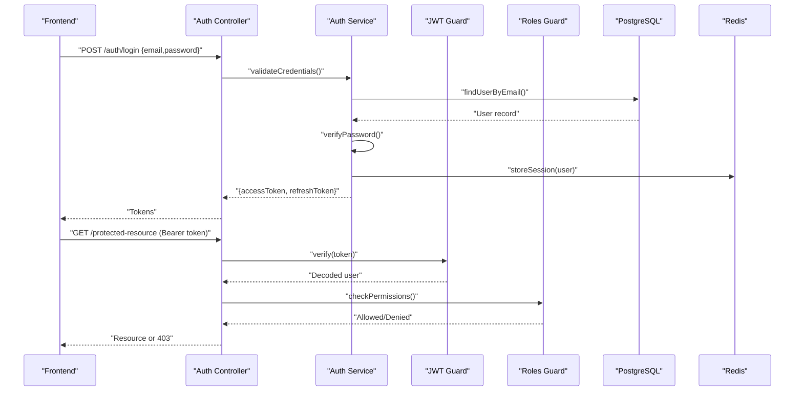

**Diagram sources**
- [backend/src/modules/auth/controllers/auth.controller.ts](file://backend/src/modules/auth/controllers/auth.controller.ts)
- [backend/src/modules/auth/services/auth.service.ts](file://backend/src/modules/auth/services/auth.service.ts)
- [backend/src/modules/auth/guards/jwt-auth.guard.ts](file://backend/src/modules/auth/guards/jwt-auth.guard.ts)
- [backend/src/modules/auth/guards/roles.guard.ts](file://backend/src/modules/auth/guards/roles.guard.ts)
- [backend/database/data-source.ts](file://backend/database/data-source.ts)

**Section sources**
- [backend/src/modules/auth/controllers/auth.controller.ts](file://backend/src/modules/auth/controllers/auth.controller.ts)
- [backend/src/modules/auth/services/auth.service.ts](file://backend/src/modules/auth/services/auth.service.ts)
- [backend/src/modules/auth/guards/jwt-auth.guard.ts](file://backend/src/modules/auth/guards/jwt-auth.guard.ts)
- [backend/src/modules/auth/guards/roles.guard.ts](file://backend/src/modules/auth/guards/roles.guard.ts)

### Multi-Tenant Architecture Patterns
Multi-tenancy is implemented by scoping all queries to an establishment context injected by middleware. Guards and services validate that users belong to the requested establishment.

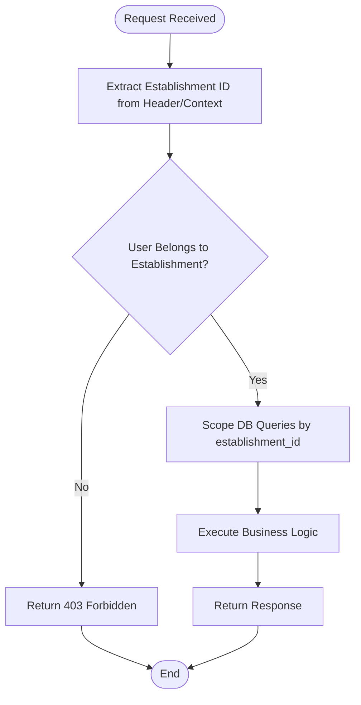

**Diagram sources**
- [backend/src/common/middlewares/tenant.middleware.ts](file://backend/src/common/middlewares/tenant.middleware.ts)
- [backend/src/modules/etablissement/services/etablissement.service.ts](file://backend/src/modules/etablissement/services/etablissement.service.ts)

**Section sources**
- [backend/src/common/middlewares/tenant.middleware.ts](file://backend/src/common/middlewares/tenant.middleware.ts)
- [backend/src/modules/etablissement/services/etablissement.service.ts](file://backend/src/modules/etablissement/services/etablissement.service.ts)

### Audit Logging and Cross-Cutting Concerns
An interceptor captures request metadata and response outcomes for audit trails. Combined with RBAC guards and tenant middleware, it ensures comprehensive traceability.

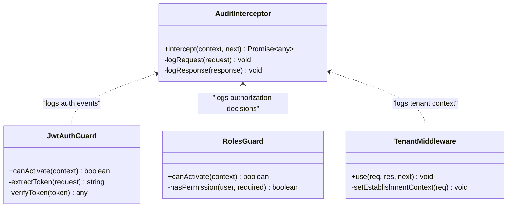

**Diagram sources**
- [backend/src/common/interceptors/audit.interceptor.ts](file://backend/src/common/interceptors/audit.interceptor.ts)
- [backend/src/modules/auth/guards/jwt-auth.guard.ts](file://backend/src/modules/auth/guards/jwt-auth.guard.ts)
- [backend/src/modules/auth/guards/roles.guard.ts](file://backend/src/modules/auth/guards/roles.guard.ts)
- [backend/src/common/middlewares/tenant.middleware.ts](file://backend/src/common/middlewares/tenant.middleware.ts)

**Section sources**
- [backend/src/common/interceptors/audit.interceptor.ts](file://backend/src/common/interceptors/audit.interceptor.ts)
- [backend/src/modules/auth/guards/jwt-auth.guard.ts](file://backend/src/modules/auth/guards/jwt-auth.guard.ts)
- [backend/src/modules/auth/guards/roles.guard.ts](file://backend/src/modules/auth/guards/roles.guard.ts)
- [backend/src/common/middlewares/tenant.middleware.ts](file://backend/src/common/middlewares/tenant.middleware.ts)

### Data Access and Caching Strategy
TypeORM DataSource configures PostgreSQL connections and migrations. Redis is used for caching frequently accessed data and sessions.

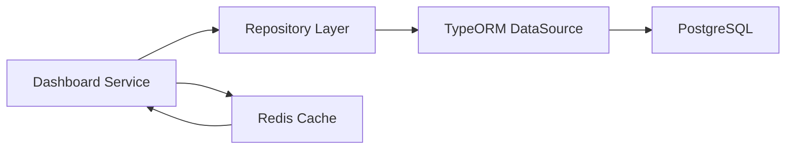

**Diagram sources**
- [backend/src/modules/dashboard/services/dashboard.service.ts](file://backend/src/modules/dashboard/services/dashboard.service.ts)
- [backend/database/data-source.ts](file://backend/database/data-source.ts)

**Section sources**
- [backend/src/modules/dashboard/services/dashboard.service.ts](file://backend/src/modules/dashboard/services/dashboard.service.ts)
- [backend/database/data-source.ts](file://backend/database/data-source.ts)

### Notification Orchestration
Notifications service coordinates message delivery across channels and integrates with audit logs.

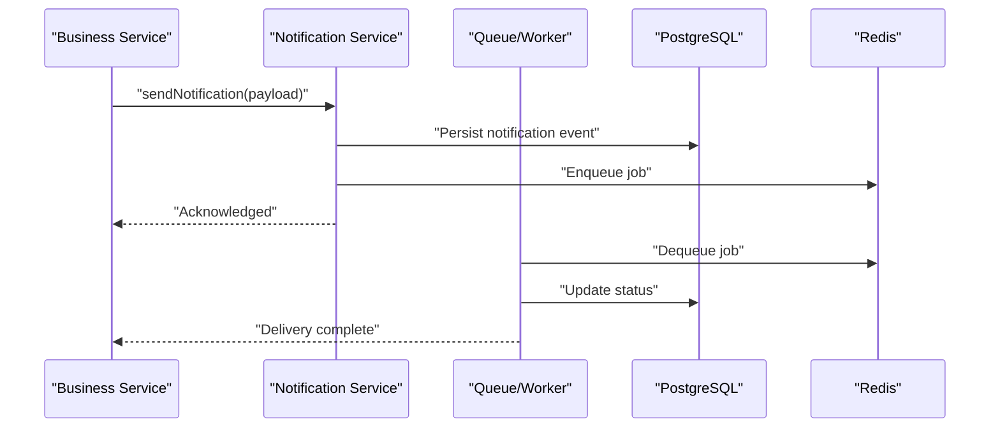

**Diagram sources**
- [backend/src/modules/notifications/services/notification.service.ts](file://backend/src/modules/notifications/services/notification.service.ts)

**Section sources**
- [backend/src/modules/notifications/services/notification.service.ts](file://backend/src/modules/notifications/services/notification.service.ts)

### Monitoring and Health Checks
Monitoring service exposes health endpoints and metrics for observability.

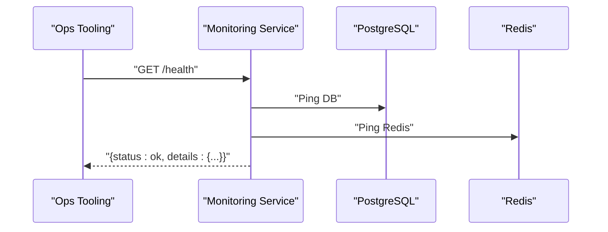

**Diagram sources**
- [backend/src/modules/monitoring/services/monitoring.service.ts](file://backend/src/modules/monitoring/services/monitoring.service.ts)

**Section sources**
- [backend/src/modules/monitoring/services/monitoring.service.ts](file://backend/src/modules/monitoring/services/monitoring.service.ts)

### Frontend Integration
The React frontend organizes features and routes, communicating with the NestJS backend through REST APIs. Vite configures development and build processes.

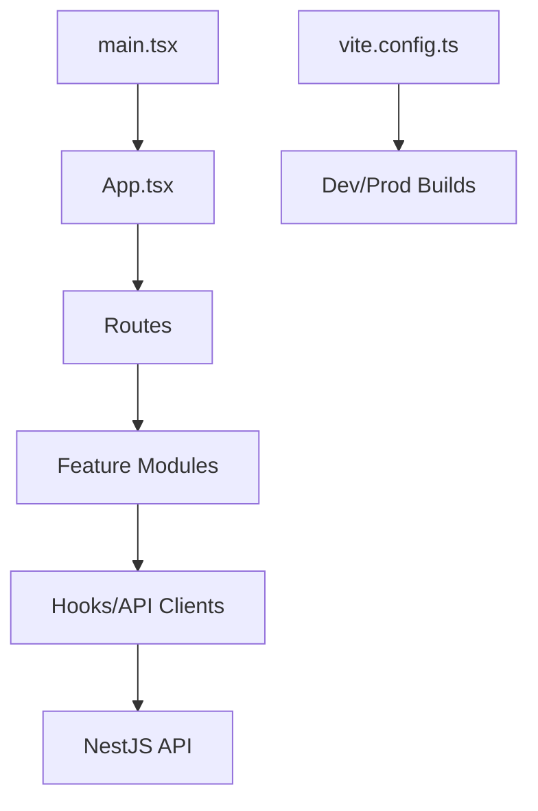

**Diagram sources**
- [frontend/src/App.tsx](file://frontend/src/App.tsx)
- [frontend/src/main.tsx](file://frontend/src/main.tsx)
- [frontend/vite.config.ts](file://frontend/vite.config.ts)

**Section sources**
- [frontend/src/App.tsx](file://frontend/src/App.tsx)
- [frontend/src/main.tsx](file://frontend/src/main.tsx)
- [frontend/vite.config.ts](file://frontend/vite.config.ts)

## Dependency Analysis
The backend depends on:
- TypeORM and PostgreSQL for persistence
- Redis for caching and sessions
- JWT libraries for authentication
- Swagger for API documentation
- Common middlewares and interceptors for cross-cutting concerns

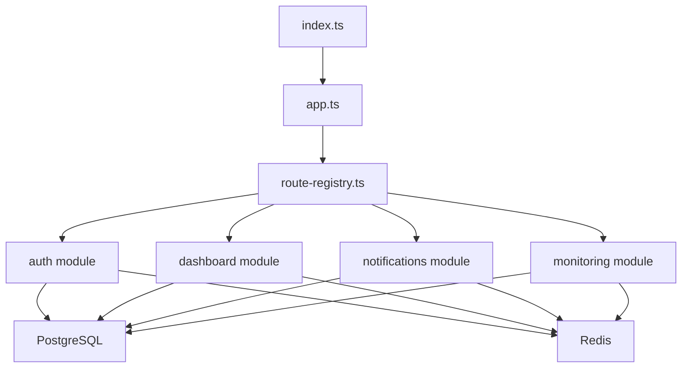

**Diagram sources**
- [backend/src/index.ts](file://backend/src/index.ts)
- [backend/src/app.ts](file://backend/src/app.ts)
- [backend/src/routes/route-registry.ts](file://backend/src/routes/route-registry.ts)
- [backend/database/data-source.ts](file://backend/database/data-source.ts)

**Section sources**
- [backend/src/index.ts](file://backend/src/index.ts)
- [backend/src/app.ts](file://backend/src/app.ts)
- [backend/src/routes/route-registry.ts](file://backend/src/routes/route-registry.ts)
- [backend/database/data-source.ts](file://backend/database/data-source.ts)

## Performance Considerations
- Database Indexes: Ensure composite indexes on tenant-scoped foreign keys and frequently filtered columns.
- Query Optimization: Use pagination and selective field projection to reduce payload sizes.
- Caching Strategy: Cache read-heavy resources (e.g., dashboards, reference data) with appropriate TTLs.
- Connection Pooling: Tune TypeORM pool size based on workload and container limits.
- Async Processing: Offload notifications and heavy tasks to background workers.
- Observability: Monitor slow queries and cache hit ratios; adjust strategies accordingly.

[No sources needed since this section provides general guidance]

## Troubleshooting Guide
- Authentication Failures: Verify JWT secret configuration and token expiration settings. Check guard logs for denied requests.
- Authorization Errors: Confirm role-permission mappings and establishment scoping. Review RBAC guard decisions.
- Tenant Isolation Issues: Ensure tenant middleware sets establishment context correctly; validate user-establishment relationships.
- Database Connectivity: Validate TypeORM DataSource parameters and network reachability.
- Redis Availability: Check Redis connectivity and memory usage; monitor cache miss spikes.
- Audit Logs: Inspect interceptor outputs for request/response anomalies and security events.

**Section sources**
- [backend/src/modules/auth/guards/jwt-auth.guard.ts](file://backend/src/modules/auth/guards/jwt-auth.guard.ts)
- [backend/src/modules/auth/guards/roles.guard.ts](file://backend/src/modules/auth/guards/roles.guard.ts)
- [backend/src/common/middlewares/tenant.middleware.ts](file://backend/src/common/middlewares/tenant.middleware.ts)
- [backend/src/common/interceptors/audit.interceptor.ts](file://backend/src/common/interceptors/audit.interceptor.ts)
- [backend/src/config/database.config.ts](file://backend/src/config/database.config.ts)
- [backend/src/config/env.config.ts](file://backend/src/config/env.config.ts)

## Conclusion
eLISAschool’s architecture combines a modular NestJS backend with a React frontend, PostgreSQL persistence, and Redis caching. Multi-tenancy is enforced via middleware and scoped queries, while JWT and RBAC guards secure access. The system is containerized with Docker Compose and Nginx, enabling scalable and observable deployments. Continuous monitoring, caching, and query optimizations ensure robust performance under load.

[No sources needed since this section summarizes without analyzing specific files]

## Appendices

### Infrastructure Requirements
- Node.js runtime for backend and frontend builds
- PostgreSQL instance with sufficient disk and I/O capacity
- Redis instance for caching and sessions
- Docker and Docker Compose for orchestration
- Nginx for reverse proxy and static asset serving

**Section sources**
- [docker/docker-compose.yml](file://docker/docker-compose.yml)
- [docker/Dockerfile.backend](file://docker/Dockerfile.backend)
- [docker/Dockerfile.frontend](file://docker/Dockerfile.frontend)
- [docker/nginx.conf](file://docker/nginx.conf)

### Deployment Topology
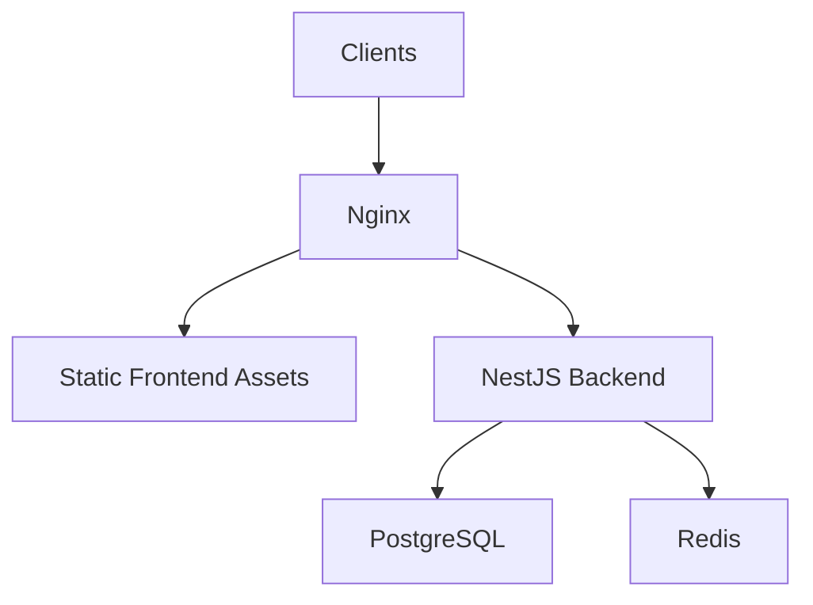

**Diagram sources**
- [docker/docker-compose.yml](file://docker/docker-compose.yml)
- [docker/nginx.conf](file://docker/nginx.conf)