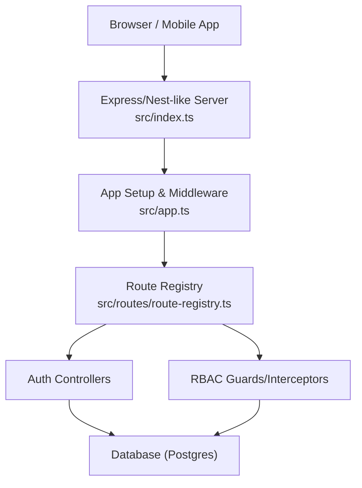
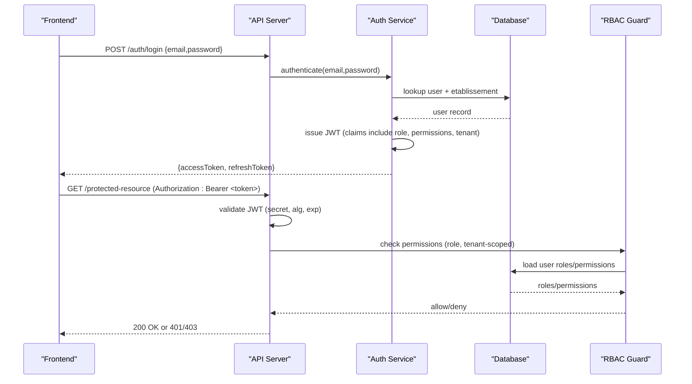
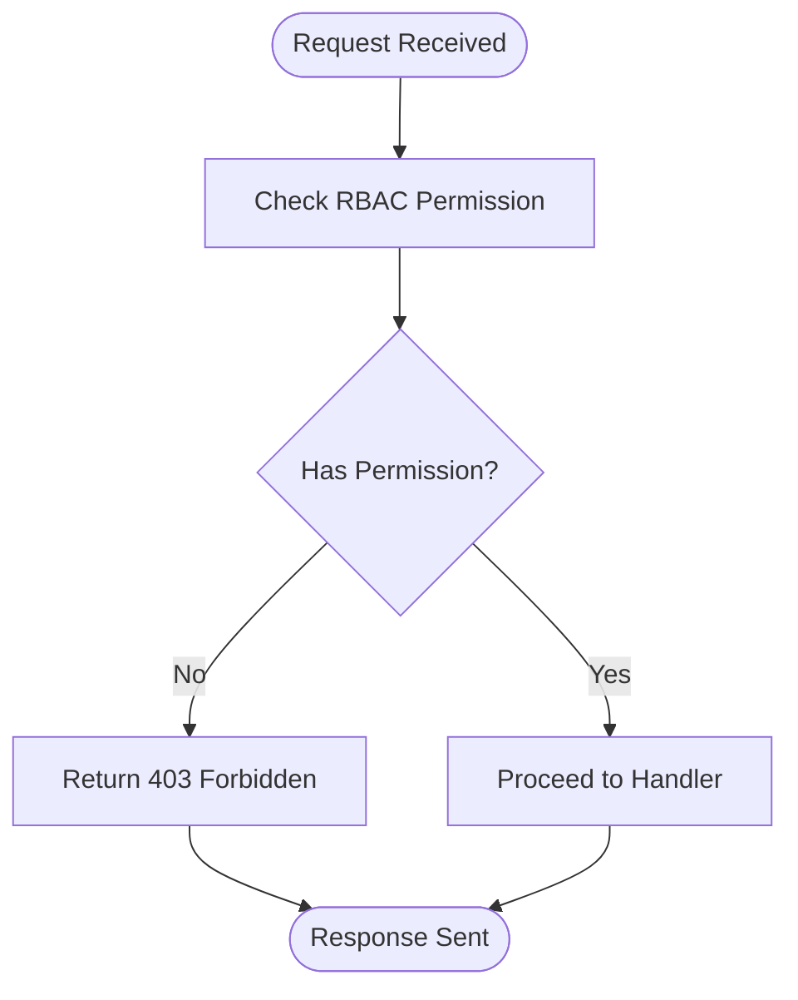
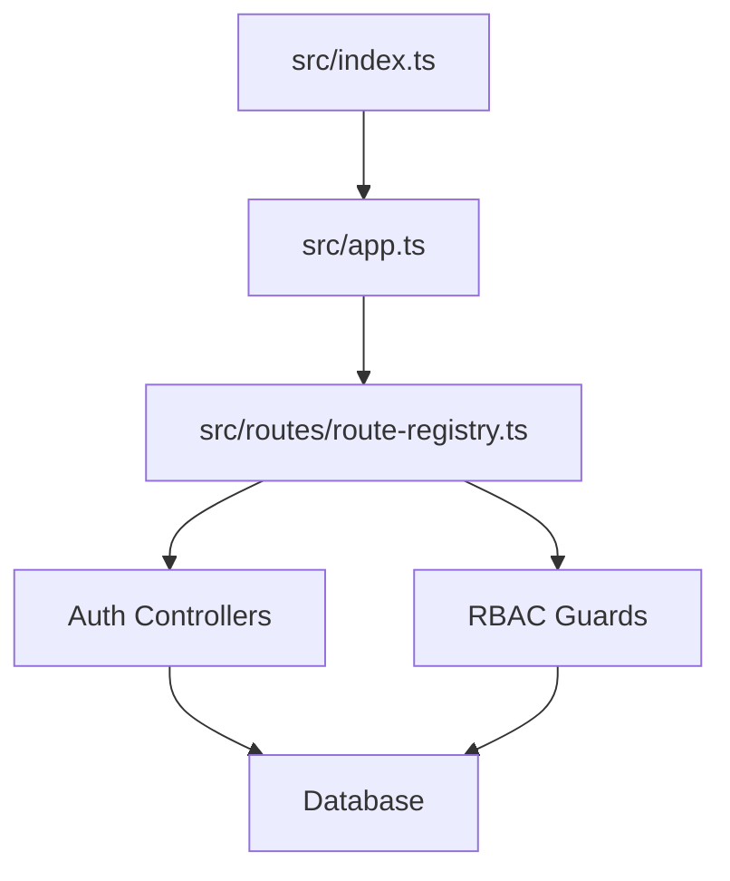

# Authentication & Authorization Errors

<cite>
**Referenced Files in This Document**
- [app.ts](file://backend/src/app.ts)
- [index.ts](file://backend/src/index.ts)
- [route-registry.ts](file://backend/src/routes/route-registry.ts)
- [auth-multi-etablissement.spec.ts](file://backend/test/integration/auth-multi-etablissement.spec.ts)
- [configuration-multi-tenant.spec.ts](file://backend/test/integration/configuration-multi-tenant.spec.ts)
- [DIAGNOSTIC-401-TOKEN-INVALIDE.md](file://docs/autres/_fix/DIAGNOSTIC-401-TOKEN-INVALIDE.md)
- [CORRECTION-401-JWT-SECRET-DYNAMIQUE.md](file://docs/corrections/CORRECTION-401-JWT-SECRET-DYNAMIQUE.md)
- [CORRECTION-FINALE-401-MIDDLEWARE-ORDER.md](file://docs/corrections/CORRECTION-FINALE-401-MIDDLEWARE-ORDER.md)
- [CORRECTION-TOKEN-EXPIRE-SWITCH.md](file://docs/corrections/CORRECTION-TOKEN-EXPIRE-SWITCH.md)
- [GUIDE-TEST-MULTI-TENANT-V3.md](file://docs/guides/GUIDE-TEST-MULTI-TENANT-V3.md)
- [IMPLEMENTATION-BLOCAGE-AUTH-TERMINEE.md](file://docs/implementations/IMPLEMENTATION-BLOCAGE-AUTH-TERMINEE.md)
- [SYSTEME-BLOCAGE-AUTH-DEUX-NIVEAUX.md](file://docs/SYSTEME-BLOCAGE-AUTH-DEUX-NIVEAUX.md)
- [ANALYSE-ERREUR-403-ELEVES.md](file://docs/analyses/ANALYSE-ERREUR-403-ELEVES.md)
- [CORRECTION-PERMISSIONS-COMPLETE-LOGIN.md](file://docs/corrections/CORRECTION-PERMISSIONS-COMPLETE-LOGIN.md)
- [CORRECTION-SUPER-ADMIN-ALL-PERMISSION.md](file://docs/corrections/CORRECTION-SUPER-ADMIN-ALL-PERMISSION.md)
- [POLLING-BACKEND-BLOCAGE-AUTH.md](file://docs/autres/POLLING-BACKEND-BLOCAGE-AUTH.md)
- [SECURE-LOGOUT-IMPLEMENTATION.md](file://docs/autres/SECURE-LOGOUT-IMPLEMENTATION.md)
- [CONFIGURATION-BLOCAGE-2-MINUTES.md](file://docs/configurations/CONFIGURATION-BLOCAGE-2-MINUTES.md)
- [IMPLÉMENTATION-AUTH-COMPLETE.md](file://docs/implementations/IMPLÉMENTATION-AUTH-COMPLETE.md)
- [RBAC_COMPLETION.md](file://docs/RBAC_COMPLETION.md)
- [rbac-system.md](file://docs/rbac-system.md)
- [PERMISSIONS-BASE-DONNEES.md](file://docs/PERMISSIONS-BASE-DONNEES.md)
</cite>

## Table of Contents
1. [Introduction](#introduction)
2. [Project Structure](#project-structure)
3. [Core Components](#core-components)
4. [Architecture Overview](#architecture-overview)
5. [Detailed Component Analysis](#detailed-component-analysis)
6. [Dependency Analysis](#dependency-analysis)
7. [Performance Considerations](#performance-considerations)
8. [Troubleshooting Guide](#troubleshooting-guide)
9. [Conclusion](#conclusion)
10. [Appendices](#appendices)

## Introduction
This document provides a comprehensive guide to authentication and authorization issues in eLISAschool, focusing on:
- JWT token validation failures (including dynamic secret misconfiguration and middleware ordering)
- Multi-tenant authentication problems (etablissement scoping and role resolution)
- Role-based access control errors (RBAC permission checks and super-admin behavior)
- Permission denied scenarios (403 Forbidden), session expiration (Token Expired), and account lockout situations
- Password reset failures, email verification problems, and account activation issues
- Practical debugging techniques using browser developer tools, backend logs, and API testing with curl or Postman

The goal is to help developers and operators diagnose and resolve common auth/authz errors quickly and reliably.

## Project Structure
eLISAschool’s backend is organized by modules under src/modules, with shared infrastructure in src/common and configuration in src/config. Authentication and authorization span multiple layers:
- Application bootstrap and global middleware setup
- Route registration and guards
- Auth module controllers/services for login, token issuance, refresh, and lockout handling
- RBAC system for permissions and roles
- Multi-tenant scoping via etablissement context

**Diagram sources**
- [index.ts](file://backend/src/index.ts)
- [app.ts](file://backend/src/app.ts)
- [route-registry.ts](file://backend/src/routes/route-registry.ts)

**Section sources**
- [index.ts](file://backend/src/index.ts)
- [app.ts](file://backend/src/app.ts)
- [route-registry.ts](file://backend/src/routes/route-registry.ts)

## Core Components
- JWT Token Validation: Validates tokens issued during login; sensitive to secret key mismatches, algorithm settings, and issuer/audience claims.
- Multi-Tenant Context: Enforces per-etablissement scoping for users and resources; incorrect tenant selection leads to unauthorized access.
- RBAC Permissions: Role-based access control enforces fine-grained permissions; missing or mismatched permissions cause 403 responses.
- Account Lockout: Rate-limiting and lockout mechanisms protect against brute-force attempts; can block legitimate users if thresholds are too low.
- Session Management: Handles token expiry and logout flows; improper handling causes unexpected 401s.

Key areas to inspect when diagnosing auth/authz issues:
- Global middleware order and JWT guard placement
- Etablissement context propagation across requests
- Permission definitions and user-role mappings
- Lockout counters and cooldown windows
- Token lifecycle (issuance, refresh, expiry)

**Section sources**
- [app.ts](file://backend/src/app.ts)
- [route-registry.ts](file://backend/src/routes/route-registry.ts)
- [auth-multi-etablissement.spec.ts](file://backend/test/integration/auth-multi-etablissement.spec.ts)
- [configuration-multi-tenant.spec.ts](file://backend/test/integration/configuration-multi-tenant.spec.ts)

## Architecture Overview
The authentication flow involves issuing and validating JWTs, enforcing multi-tenant scoping, and checking RBAC permissions before allowing access to protected endpoints.

**Diagram sources**
- [index.ts](file://backend/src/index.ts)
- [app.ts](file://backend/src/app.ts)
- [route-registry.ts](file://backend/src/routes/route-registry.ts)

## Detailed Component Analysis

### JWT Token Validation Failures
Symptoms:
- 401 Unauthorized immediately after login or on subsequent requests
- “Token Expired” messages in frontend logs
- Inconsistent behavior across environments

Root Causes:
- Dynamic JWT secret misconfiguration causing signature verification failures
- Incorrect middleware ordering where JWT validation runs before tenant context is established
- Token expiry not handled gracefully during tenant switch or long-running sessions

Resolution Steps:
- Verify JWT secret configuration matches the value used at token issuance time
- Ensure JWT validation middleware executes after establishing tenant context
- Implement token refresh logic and handle expiry proactively on the frontend
- Review middleware order to prevent premature rejection

Relevant References:
- [DIAGNOSTIC-401-TOKEN-INVALIDE.md](file://docs/autres/_fix/DIAGNOSTIC-401-TOKEN-INVALIDE.md)
- [CORRECTION-401-JWT-SECRET-DYNAMIQUE.md](file://docs/corrections/CORRECTION-401-JWT-SECRET-DYNAMIQUE.md)
- [CORRECTION-FINALE-401-MIDDLEWARE-ORDER.md](file://docs/corrections/CORRECTION-FINALE-401-MIDDLEWARE-ORDER.md)
- [CORRECTION-TOKEN-EXPIRE-SWITCH.md](file://docs/corrections/CORRECTION-TOKEN-EXPIRE-SWITCH.md)

**Section sources**
- [DIAGNOSTIC-401-TOKEN-INVALIDE.md](file://docs/autres/_fix/DIAGNOSTIC-401-TOKEN-INVALIDE.md)
- [CORRECTION-401-JWT-SECRET-DYNAMIQUE.md](file://docs/corrections/CORRECTION-401-JWT-SECRET-DYNAMIQUE.md)
- [CORRECTION-FINALE-401-MIDDLEWARE-ORDER.md](file://docs/corrections/CORRECTION-FINALE-401-MIDDLEWARE-ORDER.md)
- [CORRECTION-TOKEN-EXPIRE-SWITCH.md](file://docs/corrections/CORRECTION-TOKEN-EXPIRE-SWITCH.md)

### Multi-Tenant Authentication Problems
Symptoms:
- Successful login but immediate 401/403 when accessing resources
- Data leakage or inability to see tenant-specific content
- Switching tenants invalidates current session unexpectedly

Root Causes:
- Missing or incorrect etablissement context in request headers or cookies
- User-to-tenant mapping not enforced during permission checks
- Tenant-scoped routes not properly validated

Resolution Steps:
- Ensure client sends correct tenant identifier with each request
- Validate tenant context early in middleware pipeline
- Confirm user has active membership in the requested tenant
- Test multi-tenant flows with integration tests

Relevant References:
- [auth-multi-etablissement.spec.ts](file://backend/test/integration/auth-multi-etablissement.spec.ts)
- [configuration-multi-tenant.spec.ts](file://backend/test/integration/configuration-multi-tenant.spec.ts)
- [GUIDE-TEST-MULTI-TENANT-V3.md](file://docs/guides/GUIDE-TEST-MULTI-TENANT-V3.md)

**Section sources**
- [auth-multi-etablissement.spec.ts](file://backend/test/integration/auth-multi-etablissement.spec.ts)
- [configuration-multi-tenant.spec.ts](file://backend/test/integration/configuration-multi-tenant.spec.ts)
- [GUIDE-TEST-MULTI-TENANT-V3.md](file://docs/guides/GUIDE-TEST-MULTI-TENANT-V3.md)

### Role-Based Access Control Errors
Symptoms:
- 403 Forbidden on permitted endpoints
- Super-admin cannot access certain features
- Roles assigned but permissions not applied

Root Causes:
- Missing permission entries for roles
- Incorrect role-permission mapping in database
- RBAC guard not evaluating tenant-scoped permissions

Resolution Steps:
- Audit role-permission assignments and ensure required permissions exist
- Verify super-admin grants all necessary permissions
- Confirm RBAC evaluation includes tenant context
- Use RBAC documentation to align frontend checks with backend enforcement

Relevant References:
- [ANALYSE-ERREUR-403-ELEVES.md](file://docs/analyses/ANALYSE-ERREUR-403-ELEVES.md)
- [CORRECTION-PERMISSIONS-COMPLETE-LOGIN.md](file://docs/corrections/CORRECTION-PERMISSIONS-COMPLETE-LOGIN.md)
- [CORRECTION-SUPER-ADMIN-ALL-PERMISSION.md](file://docs/corrections/CORRECTION-SUPER-ADMIN-ALL-PERMISSION.md)
- [RBAC_COMPLETION.md](file://docs/RBAC_COMPLETION.md)
- [rbac-system.md](file://docs/rbac-system.md)
- [PERMISSIONS-BASE-DONNEES.md](file://docs/PERMISSIONS-BASE-DONNEES.md)

**Section sources**
- [ANALYSE-ERREUR-403-ELEVES.md](file://docs/analyses/ANALYSE-ERREUR-403-ELEVES.md)
- [CORRECTION-PERMISSIONS-COMPLETE-LOGIN.md](file://docs/corrections/CORRECTION-PERMISSIONS-COMPLETE-LOGIN.md)
- [CORRECTION-SUPER-ADMIN-ALL-PERMISSION.md](file://docs/corrections/CORRECTION-SUPER-ADMIN-ALL-PERMISSION.md)
- [RBAC_COMPLETION.md](file://docs/RBAC_COMPLETION.md)
- [rbac-system.md](file://docs/rbac-system.md)
- [PERMISSIONS-BASE-DONNEES.md](file://docs/PERMISSIONS-BASE-DONNEES.md)

### Permission Denied Scenarios (403 Forbidden)
Common Triggers:
- User lacks required permission for the endpoint
- Role does not map to needed permission
- Tenant-scoped resource outside user’s scope

Diagnostic Flow:

**Diagram sources**
- [ANALYSE-ERREUR-403-ELEVES.md](file://docs/analyses/ANALYSE-ERREUR-403-ELEVES.md)
- [rbac-system.md](file://docs/rbac-system.md)

**Section sources**
- [ANALYSE-ERREUR-403-ELEVES.md](file://docs/analyses/ANALYSE-ERREUR-403-ELEVES.md)
- [rbac-system.md](file://docs/rbac-system.md)

### Session Expiration Issues (Token Expired)
Symptoms:
- Frontend shows “Token Expired” and redirects to login
- Intermittent 401 during long operations or tenant switches

Root Causes:
- Short token lifetime without refresh strategy
- Tenant switch invalidating existing token
- Clock skew between server and client

Resolution Steps:
- Implement token refresh on expiry or before expiry window
- Re-issue tokens upon tenant switch
- Synchronize server/client clocks and adjust tolerance

Relevant References:
- [CORRECTION-TOKEN-EXPIRE-SWITCH.md](file://docs/corrections/CORRECTION-TOKEN-EXPIRE-SWITCH.md)
- [SECURE-LOGOUT-IMPLEMENTATION.md](file://docs/autres/SECURE-LOGOUT-IMPLEMENTATION.md)

**Section sources**
- [CORRECTION-TOKEN-EXPIRE-SWITCH.md](file://docs/corrections/CORRECTION-TOKEN-EXPIRE-SWITCH.md)
- [SECURE-LOGOUT-IMPLEMENTATION.md](file://docs/autres/SECURE-LOGOUT-IMPLEMENTATION.md)

### User Account Lockout Situations
Symptoms:
- Login blocked after several failed attempts
- Users locked out temporarily or permanently

Root Causes:
- Aggressive lockout thresholds
- Persistent lockout counters not reset after successful login
- Misconfigured cooldown periods

Resolution Steps:
- Adjust lockout thresholds based on risk profile
- Reset counters on successful authentication
- Provide clear feedback and recovery options

Relevant References:
- [IMPLEMENTATION-BLOCAGE-AUTH-TERMINEE.md](file://docs/implementations/IMPLEMENTATION-BLOCAGE-AUTH-TERMINEE.md)
- [SYSTEME-BLOCAGE-AUTH-DEUX-NIVEAUX.md](file://docs/SYSTEME-BLOCAGE-AUTH-DEUX-NIVEAUX.md)
- [CONFIGURATION-BLOCAGE-2-MINUTES.md](file://docs/configurations/CONFIGURATION-BLOCAGE-2-MINUTES.md)
- [POLLING-BACKEND-BLOCAGE-AUTH.md](file://docs/autres/POLLING-BACKEND-BLOCAGE-AUTH.md)

**Section sources**
- [IMPLEMENTATION-BLOCAGE-AUTH-TERMINEE.md](file://docs/implementations/IMPLEMENTATION-BLOCAGE-AUTH-TERMINEE.md)
- [SYSTEME-BLOCAGE-AUTH-DEUX-NIVEAUX.md](file://docs/SYSTEME-BLOCAGE-AUTH-DEUX-NIVEAUX.md)
- [CONFIGURATION-BLOCAGE-2-MINUTES.md](file://docs/configurations/CONFIGURATION-BLOCAGE-2-MINUTES.md)
- [POLLING-BACKEND-BLOCAGE-AUTH.md](file://docs/autres/POLLING-BACKEND-BLOCAGE-AUTH.md)

### Password Reset Failures
Symptoms:
- Reset link expired or invalid
- Email not received or delivered late
- Reset succeeds but login still fails

Root Causes:
- Token expiry too short for user action
- Email delivery delays or filtering
- Password policy mismatch or hashing issues

Resolution Steps:
- Extend reset token lifetime and provide re-send option
- Monitor email provider logs and retry policies
- Validate password policy compliance and hash consistency

Relevant References:
- [IMPLÉMENTATION-AUTH-COMPLETE.md](file://docs/implementations/IMPLÉMENTATION-AUTH-COMPLETE.md)

**Section sources**
- [IMPLÉMENTATION-AUTH-COMPLETE.md](file://docs/implementations/IMPLÉMENTATION-AUTH-COMPLETE.md)

### Email Verification Problems
Symptoms:
- Verification link broken or expired
- Status remains unverified after clicking link

Root Causes:
- Link generation/signature issues
- Database status not updated atomically
- Race conditions during verification

Resolution Steps:
- Ensure atomic update of verification status
- Include robust error handling and logging
- Provide fallback to resend verification email

Relevant References:
- [IMPLÉMENTATION-AUTH-COMPLETE.md](file://docs/implementations/IMPLÉMENTATION-AUTH-COMPLETE.md)

**Section sources**
- [IMPLÉMENTATION-AUTH-COMPLETE.md](file://docs/implementations/IMPLÉMENTATION-AUTH-COMPLETE.md)

### Account Activation Issues
Symptoms:
- New accounts cannot log in despite creation
- Activation workflow stuck or incomplete

Root Causes:
- Missing activation step in user lifecycle
- Role assignment not linked to activation
- Tenant provisioning incomplete

Resolution Steps:
- Enforce activation gate before granting access
- Ensure role and permissions are provisioned on activation
- Validate tenant setup completeness

Relevant References:
- [IMPLÉMENTATION-AUTH-COMPLETE.md](file://docs/implementations/IMPLÉMENTATION-AUTH-COMPLETE.md)

**Section sources**
- [IMPLÉMENTATION-AUTH-COMPLETE.md](file://docs/implementations/IMPLÉMENTATION-AUTH-COMPLETE.md)

## Dependency Analysis
Authentication and authorization depend on:
- Global middleware for JWT validation and tenant context
- Route registry that wires controllers and guards
- RBAC system for permission enforcement
- Database for user, role, and permission data

**Diagram sources**
- [index.ts](file://backend/src/index.ts)
- [app.ts](file://backend/src/app.ts)
- [route-registry.ts](file://backend/src/routes/route-registry.ts)

**Section sources**
- [index.ts](file://backend/src/index.ts)
- [app.ts](file://backend/src/app.ts)
- [route-registry.ts](file://backend/src/routes/route-registry.ts)

## Performance Considerations
- Minimize RBAC lookups by caching role-permission mappings where safe
- Avoid excessive database queries during JWT validation; prefer lightweight claim checks
- Tune lockout thresholds to balance security and usability
- Use connection pooling and indexes for user/role/permission tables

[No sources needed since this section provides general guidance]

## Troubleshooting Guide

### Browser Developer Tools
- Inspect Network tab for 401/403 responses and payload details
- Check Authorization header presence and format
- Verify tenant identifiers in request headers or cookies
- Look for token expiry timestamps and refresh attempts

### Backend Log Analysis
- Search for JWT validation errors and middleware order warnings
- Identify RBAC denial reasons and missing permissions
- Monitor lockout events and cooldown durations
- Correlate tenant context establishment with request processing

### API Endpoint Testing with curl or Postman
- Reproduce login flow and capture access token
- Send protected requests with proper Authorization header
- Include tenant context as required by endpoints
- Test token refresh and expiry handling

Practical Tips:
- Compare environment configurations for JWT secrets and algorithms
- Validate tenant membership and role assignments in the database
- Use integration tests to assert multi-tenant isolation and RBAC correctness

**Section sources**
- [DIAGNOSTIC-401-TOKEN-INVALIDE.md](file://docs/autres/_fix/DIAGNOSTIC-401-TOKEN-INVALIDE.md)
- [CORRECTION-FINALE-401-MIDDLEWARE-ORDER.md](file://docs/corrections/CORRECTION-FINALE-401-MIDDLEWARE-ORDER.md)
- [auth-multi-etablissement.spec.ts](file://backend/test/integration/auth-multi-etablissement.spec.ts)
- [configuration-multi-tenant.spec.ts](file://backend/test/integration/configuration-multi-tenant.spec.ts)

## Conclusion
Authentication and authorization in eLISAschool require careful alignment across JWT configuration, middleware ordering, multi-tenant scoping, and RBAC enforcement. By systematically validating token lifecycle, tenant context, and permission mappings—and leveraging the provided diagnostics and guides—teams can quickly resolve 401/403 errors, manage session expiry, and handle lockouts effectively.

[No sources needed since this section summarizes without analyzing specific files]

## Appendices

### Error Reference Summary
- 401 Unauthorized: Typically caused by invalid/expired JWT or missing credentials
- 403 Forbidden: Indicates insufficient permissions or wrong tenant scope
- Token Expired: Requires refresh or re-authentication; check expiry handling

[No sources needed since this section provides general guidance]