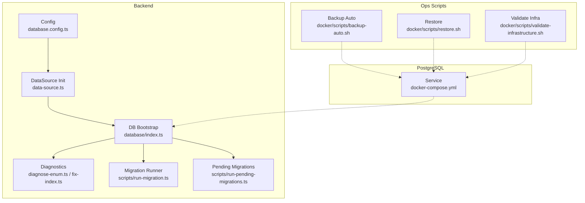
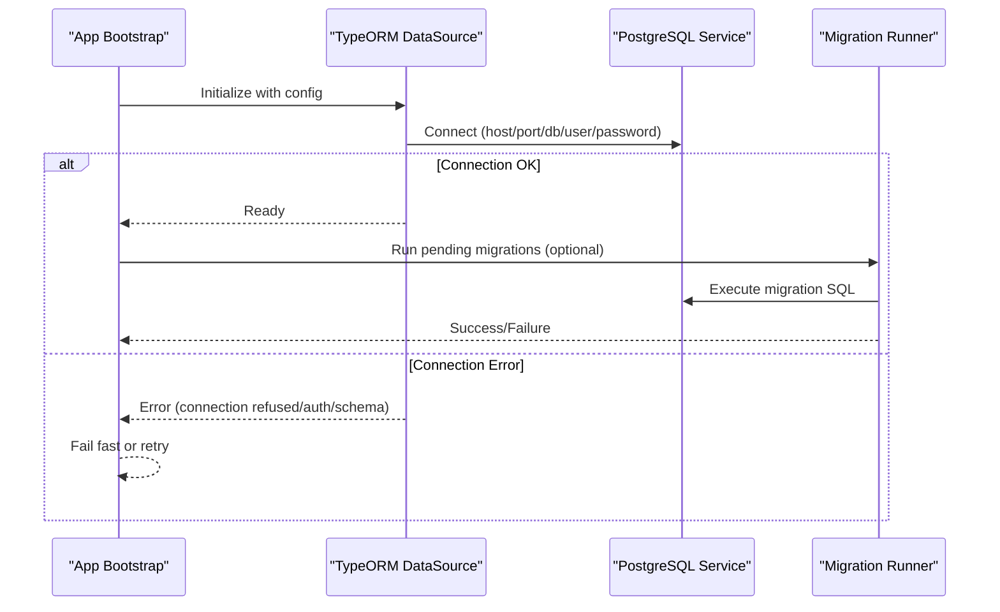
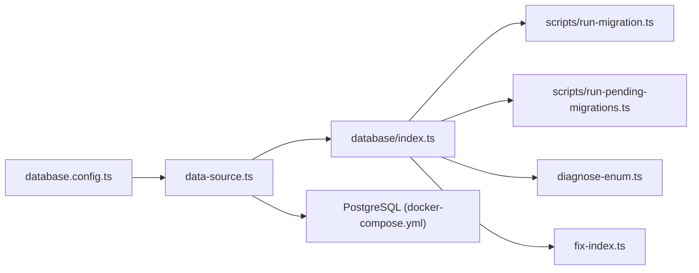
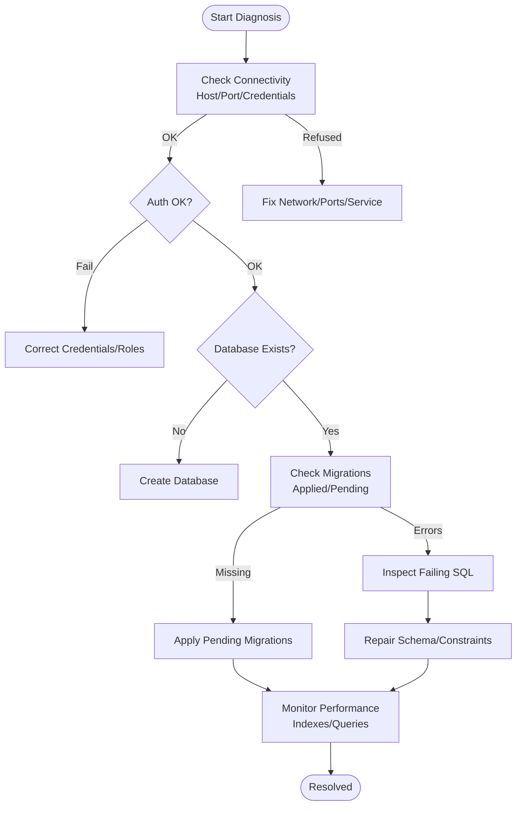

# Database Connection Problems

<cite>
**Referenced Files in This Document**
- [database.config.ts](file://backend/src/config/database.config.ts)
- [data-source.ts](file://backend/src/database/data-source.ts)
- [index.ts](file://backend/src/database/index.ts)
- [run-migration.ts](file://backend/scripts/run-migration.ts)
- [run-pending-migrations.ts](file://backend/scripts/run-pending-migrations.ts)
- [diagnose-enum.ts](file://backend/src/database/diagnose-enum.ts)
- [fix-index.ts](file://backend/src/database/fix-index.ts)
- [docker-compose.yml](file://docker/docker-compose.yml)
- [backup-auto.sh](file://docker/scripts/backup-auto.sh)
- [restore.sh](file://docker/scripts/restore.sh)
- [validate-infrastructure.sh](file://docker/scripts/validate-infrastructure.sh)
- [099-add-monitoring-params.sql](file://backend/database/migrations/099-add-monitoring-params.sql)
- [MIGRATION-076-SUCCESS.md](file://backend/database/migrations/MIGRATION-076-SUCCESS.md)
</cite>

## Table of Contents
1. [Introduction](#introduction)
2. [Project Structure](#project-structure)
3. [Core Components](#core-components)
4. [Architecture Overview](#architecture-overview)
5. [Detailed Component Analysis](#detailed-component-analysis)
6. [Dependency Analysis](#dependency-analysis)
7. [Performance Considerations](#performance-considerations)
8. [Troubleshooting Guide](#troubleshooting-guide)
9. [Conclusion](#conclusion)
10. [Appendices](#appendices)

## Introduction
This document focuses on diagnosing and resolving database connection and operation issues in eLISAschool, specifically:
- PostgreSQL connection failures (e.g., "Connection refused")
- TypeORM initialization errors
- Migration execution problems (e.g., "Migration not found", "Query failed")
- Schema inconsistencies and foreign key constraint violations
- Data integrity issues
- Performance problems such as query timeouts and connection pool exhaustion
It provides actionable diagnostic steps, PostgreSQL administration commands, TypeORM debugging guidance, health checks, and backup/recovery procedures for corrupted databases.

## Project Structure
The database subsystem is centered around TypeORM configuration, a data source bootstrap, migration scripts, and operational scripts for running migrations and diagnostics. Docker compose defines the PostgreSQL service and related tooling.

**Diagram sources**
- [database.config.ts](file://backend/src/config/database.config.ts)
- [data-source.ts](file://backend/src/database/data-source.ts)
- [index.ts](file://backend/src/database/index.ts)
- [run-migration.ts](file://backend/scripts/run-migration.ts)
- [run-pending-migrations.ts](file://backend/scripts/run-pending-migrations.ts)
- [diagnose-enum.ts](file://backend/src/database/diagnose-enum.ts)
- [fix-index.ts](file://backend/src/database/fix-index.ts)
- [docker-compose.yml](file://docker/docker-compose.yml)
- [backup-auto.sh](file://docker/scripts/backup-auto.sh)
- [restore.sh](file://docker/scripts/restore.sh)
- [validate-infrastructure.sh](file://docker/scripts/validate-infrastructure.sh)

**Section sources**
- [database.config.ts](file://backend/src/config/database.config.ts)
- [data-source.ts](file://backend/src/database/data-source.ts)
- [index.ts](file://backend/src/database/index.ts)
- [run-migration.ts](file://backend/scripts/run-migration.ts)
- [run-pending-migrations.ts](file://backend/scripts/run-pending-migrations.ts)
- [diagnose-enum.ts](file://backend/src/database/diagnose-enum.ts)
- [fix-index.ts](file://backend/src/database/fix-index.ts)
- [docker-compose.yml](file://docker/docker-compose.yml)
- [backup-auto.sh](file://docker/scripts/backup-auto.sh)
- [restore.sh](file://docker/scripts/restore.sh)
- [validate-infrastructure.sh](file://docker/scripts/validate-infrastructure.sh)

## Core Components
- Configuration: Centralized database settings are defined in the configuration module used by TypeORM.
- DataSource: The TypeORM DataSource is initialized with entities, migrations, and logging options.
- Bootstrap: The database bootstrap initializes connections and ensures readiness before application startup.
- Migration runners: Standalone scripts execute migrations and pending migrations.
- Diagnostics: Utilities to diagnose enum mismatches and index issues.
- Docker Compose: Defines the PostgreSQL service and environment variables.
- Ops scripts: Automated backups, restore, and infrastructure validation.

Key responsibilities:
- Establish and validate connectivity to PostgreSQL
- Manage schema evolution via migrations
- Provide observability and diagnostics for DB-related issues
- Support operational tasks like backup and restore

**Section sources**
- [database.config.ts](file://backend/src/config/database.config.ts)
- [data-source.ts](file://backend/src/database/data-source.ts)
- [index.ts](file://backend/src/database/index.ts)
- [run-migration.ts](file://backend/scripts/run-migration.ts)
- [run-pending-migrations.ts](file://backend/scripts/run-pending-migrations.ts)
- [diagnose-enum.ts](file://backend/src/database/diagnose-enum.ts)
- [fix-index.ts](file://backend/src/database/fix-index.ts)
- [docker-compose.yml](file://docker/docker-compose.yml)
- [backup-auto.sh](file://docker/scripts/backup-auto.sh)
- [restore.sh](file://docker/scripts/restore.sh)
- [validate-infrastructure.sh](file://docker/scripts/validate-infrastructure.sh)

## Architecture Overview
The runtime flow connects the backend to PostgreSQL through TypeORM, using configuration-driven settings and a bootstrap process that validates connectivity and runs migrations when needed. Operational scripts support maintenance and recovery.

**Diagram sources**
- [data-source.ts](file://backend/src/database/data-source.ts)
- [index.ts](file://backend/src/database/index.ts)
- [run-migration.ts](file://backend/scripts/run-migration.ts)
- [docker-compose.yml](file://docker/docker-compose.yml)

## Detailed Component Analysis

### PostgreSQL Connectivity and TypeORM Initialization
Symptoms:
- "Connection refused": Indicates network-level failure (wrong host/port, service down, firewall).
- Authentication failures: Wrong credentials or missing roles.
- Database not found: Incorrect database name or missing creation step.
- SSL/TLS mismatch: Enforced SSL without proper client config.

Diagnostic steps:
- Verify PostgreSQL service status and port exposure in docker-compose.
- Confirm environment variables for host, port, user, password, and database name.
- Test connectivity from the backend container or host using psql or telnet/netcat.
- Inspect TypeORM logs for detailed error messages during DataSource initialization.

Operational checks:
- Use the infrastructure validation script to confirm service availability and basic connectivity.
- Review PostgreSQL logs for rejected connections or authentication errors.

**Section sources**
- [docker-compose.yml](file://docker/docker-compose.yml)
- [validate-infrastructure.sh](file://docker/scripts/validate-infrastructure.sh)
- [data-source.ts](file://backend/src/database/data-source.ts)
- [index.ts](file://backend/src/database/index.ts)

### Migration Execution Problems
Symptoms:
- "Migration not found": Missing or misnamed migration file, incorrect path, or entity/migration sync issue.
- "Query failed": Syntax error, missing table/column, or constraint violation during migration.
- Repeated migration runs: Duplicate entries in TypeORM migrations table or inconsistent state.

Diagnostic steps:
- Ensure all migration files exist under the configured migrations directory and match expected naming/ordering.
- Validate that the DataSource points to the correct migrations folder and includes required entities.
- Check the TypeORM migrations tracking table to identify already-applied migrations.
- For "Query failed", inspect the failing migration SQL and verify referenced objects exist.

Remediation:
- Fix broken or incomplete migrations; avoid manual edits to applied migrations.
- If necessary, reset the migrations tracking table carefully after confirming data safety.
- Use the pending migrations runner to apply only unapplied changes.

**Section sources**
- [run-migration.ts](file://backend/scripts/run-migration.ts)
- [run-pending-migrations.ts](file://backend/scripts/run-pending-migrations.ts)
- [data-source.ts](file://backend/src/database/data-source.ts)
- [MIGRATION-076-SUCCESS.md](file://backend/database/migrations/MIGRATION-076-SUCCESS.md)

### Schema Inconsistencies and Foreign Key Violations
Symptoms:
- Constraint violations when inserting/updating records referencing non-existent parent rows.
- Errors about missing columns or types after partial migrations.
- Enum mismatches causing type errors.

Diagnostic steps:
- Identify orphaned references by querying foreign keys pointing to missing parents.
- Compare current schema against expected structure; re-run targeted migrations if needed.
- Use the enum diagnosis utility to detect mismatches between code and database enums.

Remediation:
- Repair referential integrity by fixing or removing orphaned records.
- Apply missing migrations or corrective scripts.
- Align enum definitions across code and database.

**Section sources**
- [diagnose-enum.ts](file://backend/src/database/diagnose-enum.ts)
- [fix-index.ts](file://backend/src/database/fix-index.ts)

### Data Integrity Issues
Symptoms:
- Duplicate unique constraints violated.
- Null values where NOT NULL is enforced.
- Invalid states due to missing default values or triggers.

Diagnostic steps:
- Audit tables for duplicates and nulls using targeted queries.
- Review constraints and defaults; ensure they align with business rules.
- Validate seed data consistency if applicable.

Remediation:
- Deduplicate records based on business keys.
- Backfill missing fields with safe defaults.
- Add constraints or validations at the database level where appropriate.

[No sources needed since this section provides general guidance]

### Performance Problems: Query Timeouts and Connection Pool Exhaustion
Symptoms:
- Slow endpoints due to long-running queries.
- Timeouts from the application or driver.
- Connection pool saturation leading to request queuing or failures.

Diagnostic steps:
- Enable slow query logging in PostgreSQL and review top queries.
- Analyze query plans for expensive operations; add or adjust indexes.
- Monitor connection usage and pool size; tune TypeORM and PostgreSQL parameters.

Remediation:
- Optimize queries and add composite indexes where beneficial.
- Adjust connection pool sizes based on workload and resource limits.
- Introduce caching or pagination strategies for heavy reads.

**Section sources**
- [099-add-monitoring-params.sql](file://backend/database/migrations/099-add-monitoring-params.sql)
- [fix-index.ts](file://backend/src/database/fix-index.ts)

## Dependency Analysis
The following diagram shows how components depend on each other and on PostgreSQL.

**Diagram sources**
- [database.config.ts](file://backend/src/config/database.config.ts)
- [data-source.ts](file://backend/src/database/data-source.ts)
- [index.ts](file://backend/src/database/index.ts)
- [run-migration.ts](file://backend/scripts/run-migration.ts)
- [run-pending-migrations.ts](file://backend/scripts/run-pending-migrations.ts)
- [diagnose-enum.ts](file://backend/src/database/diagnose-enum.ts)
- [fix-index.ts](file://backend/src/database/fix-index.ts)
- [docker-compose.yml](file://docker/docker-compose.yml)

**Section sources**
- [database.config.ts](file://backend/src/config/database.config.ts)
- [data-source.ts](file://backend/src/database/data-source.ts)
- [index.ts](file://backend/src/database/index.ts)
- [run-migration.ts](file://backend/scripts/run-migration.ts)
- [run-pending-migrations.ts](file://backend/scripts/run-pending-migrations.ts)
- [diagnose-enum.ts](file://backend/src/database/diagnose-enum.ts)
- [fix-index.ts](file://backend/src/database/fix-index.ts)
- [docker-compose.yml](file://docker/docker-compose.yml)

## Performance Considerations
- Tune PostgreSQL shared buffers, work_mem, and effective_cache_size according to available memory.
- Configure TypeORM logging levels to capture slow queries during development and limited logging in production.
- Use monitoring parameters added by dedicated migrations to track performance metrics.
- Regularly analyze and update indexes; remove unused ones.
- Avoid N+1 queries by leveraging eager loading or raw optimized queries where necessary.

[No sources needed since this section provides general guidance]

## Troubleshooting Guide

### Common Error Messages and Actions
- "Connection refused"
  - Verify PostgreSQL is running and reachable on the configured host/port.
  - Check firewall rules and container networking.
  - Confirm environment variables for connection details.
- "Authentication failed"
  - Validate username/password and role permissions.
  - Ensure pg_hba.conf allows the connection method (e.g., md5/scram-sha-256).
- "Database does not exist"
  - Create the database or correct the database name in configuration.
- "Migration not found"
  - Confirm migration file exists and matches expected naming/ordering.
  - Ensure DataSource migrations path includes the target directory.
- "Query failed"
  - Inspect the failing migration SQL for syntax or object reference errors.
  - Verify referenced tables/columns exist and types match.

### PostgreSQL Administration Commands
- Check service status and ports:
  - Use the infrastructure validation script to assert availability.
- Connect to the database:
  - Use psql with the configured host, port, user, and database.
- List databases and users:
  - Query system catalogs to verify existence and roles.
- Inspect locks and long-running queries:
  - Query lock and activity views to identify blockers.
- View and tune configuration:
  - Show current settings and reload if changed.

### TypeORM Debugging
- Enable logging in DataSource configuration to capture SQL and errors.
- Inspect the migrations table to determine applied vs. pending migrations.
- Use the pending migrations runner to isolate unapplied changes.

### Health Checks
- Use the infrastructure validation script to perform automated checks.
- Implement periodic HTTP health endpoints that probe database connectivity.

### Backup and Recovery Procedures
- Automated backups:
  - Schedule the automated backup script to run regularly.
- Manual backups:
  - Invoke the backup script manually before risky operations.
- Restore:
  - Use the restore script to recover from a known-good backup.
- Pre-migration snapshots:
  - Maintain pre-migration schema dumps for quick rollback.

**Section sources**
- [validate-infrastructure.sh](file://docker/scripts/validate-infrastructure.sh)
- [backup-auto.sh](file://docker/scripts/backup-auto.sh)
- [restore.sh](file://docker/scripts/restore.sh)
- [run-migration.ts](file://backend/scripts/run-migration.ts)
- [run-pending-migrations.ts](file://backend/scripts/run-pending-migrations.ts)
- [data-source.ts](file://backend/src/database/data-source.ts)

## Conclusion
Database issues in eLISAschool typically stem from connectivity misconfiguration, incomplete or inconsistent migrations, and performance bottlenecks. By systematically validating PostgreSQL availability, ensuring migration integrity, and applying targeted optimizations, most problems can be resolved quickly. Operational scripts and diagnostics streamline routine maintenance and recovery.

[No sources needed since this section summarizes without analyzing specific files]

## Appendices

### Quick Reference: Diagnostic Flow

[No sources needed since this diagram shows conceptual workflow, not actual code structure]