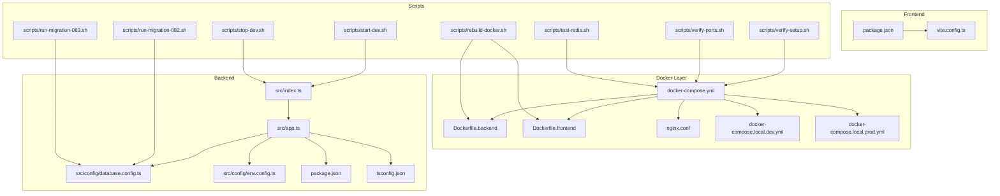
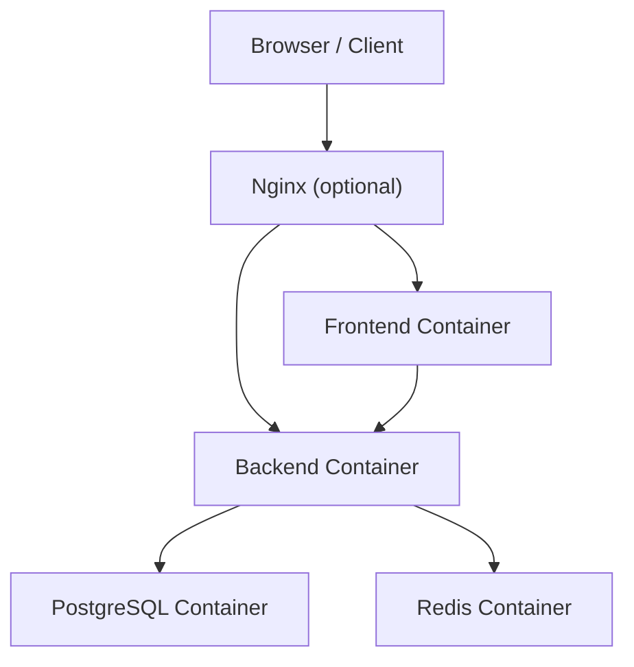
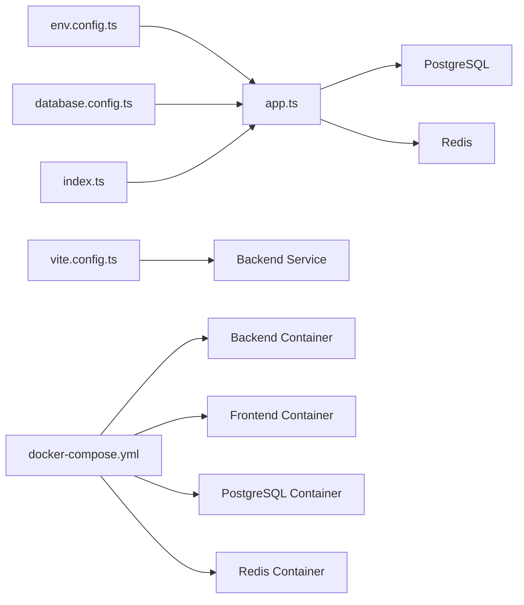
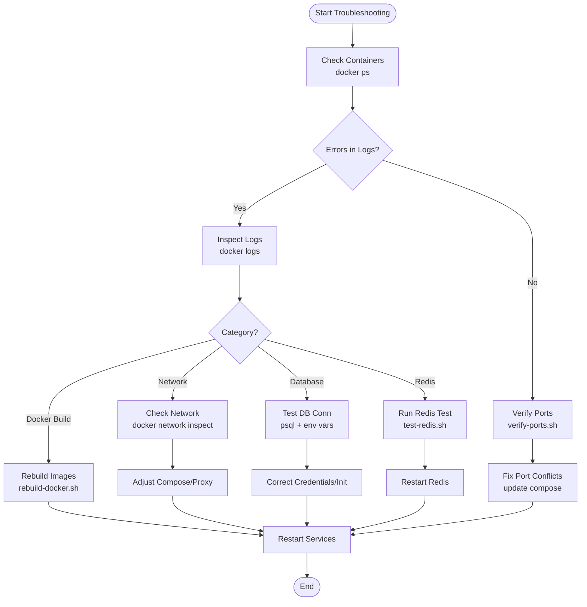

# Installation & Setup Issues

<cite>
**Referenced Files in This Document**
- [docker-compose.yml](file://docker/docker-compose.yml)
- [Dockerfile.backend](file://docker/Dockerfile.backend)
- [Dockerfile.frontend](file://docker/Dockerfile.frontend)
- [docker-compose.local.dev.yml](file://docker/docker-compose.local.dev.yml)
- [docker-compose.local.prod.yml](file://docker/docker-compose.local.prod.yml)
- [nginx.conf](file://docker/nginx.conf)
- [backend/package.json](file://backend/package.json)
- [backend/tsconfig.json](file://backend/tsconfig.json)
- [backend/src/config/database.config.ts](file://backend/src/config/database.config.ts)
- [backend/src/config/env.config.ts](file://backend/src/config/env.config.ts)
- [backend/src/index.ts](file://backend/src/index.ts)
- [backend/src/app.ts](file://backend/src/app.ts)
- [frontend/package.json](file://frontend/package.json)
- [frontend/vite.config.ts](file://frontend/vite.config.ts)
- [scripts/verify-setup.sh](file://scripts/verify-setup.sh)
- [scripts/verify-ports.sh](file://scripts/verify-ports.sh)
- [scripts/test-redis.sh](file://scripts/test-redis.sh)
- [scripts/run-migration-082.sh](file://scripts/run-migration-082.sh)
- [scripts/run-migration-083.sh](file://scripts/run-migration-083.sh)
- [scripts/rebuild-docker.sh](file://scripts/rebuild-docker.sh)
- [scripts/start-dev.sh](file://scripts/start-dev.sh)
- [scripts/stop-dev.sh](file://scripts/stop-dev.sh)
- [backend/deploy-all-migrations.sh](file://backend/deploy-all-migrations.sh)
- [backend/deploy-v31-complete.sh](file://backend/deploy-v31-complete.sh)
- [backend/nodemon.json](file://backend/nodemon.json)
- [backend/.env.example](file://backend/.env.example)
- [backend/.env](file://backend/.env)
</cite>

## Table of Contents
1. [Introduction](#introduction)
2. [Project Structure](#project-structure)
3. [Core Components](#core-components)
4. [Architecture Overview](#architecture-overview)
5. [Detailed Component Analysis](#detailed-component-analysis)
6. [Dependency Analysis](#dependency-analysis)
7. [Performance Considerations](#performance-considerations)
8. [Troubleshooting Guide](#troubleshooting-guide)
9. [Conclusion](#conclusion)
10. [Appendices](#appendices)

## Introduction
This document provides a comprehensive troubleshooting guide for installation and setup issues in eLISAschool. It focuses on Docker containerization problems (image build failures, volume mounting errors, network configuration), database connectivity (PostgreSQL authentication, TypeORM migrations, Redis), Node.js dependency conflicts, TypeScript compilation errors, port binding issues, environment variable misconfiguration, file permission problems, and cross-platform compatibility across Windows, macOS, and Linux. Each section includes step-by-step procedures, diagnostic commands, and references to relevant project files.

## Project Structure
The repository is organized into backend, frontend, docker, scripts, and shared modules. The Docker layer defines images and compose services for development and production. Configuration files centralize environment variables, database settings, and application entry points. Scripts automate verification, migration execution, and service lifecycle management.

**Diagram sources**
- [docker-compose.yml](file://docker/docker-compose.yml)
- [Dockerfile.backend](file://docker/Dockerfile.backend)
- [Dockerfile.frontend](file://docker/Dockerfile.frontend)
- [nginx.conf](file://docker/nginx.conf)
- [docker-compose.local.dev.yml](file://docker/docker-compose.local.dev.yml)
- [docker-compose.local.prod.yml](file://docker/docker-compose.local.prod.yml)
- [backend/src/index.ts](file://backend/src/index.ts)
- [backend/src/app.ts](file://backend/src/app.ts)
- [backend/src/config/database.config.ts](file://backend/src/config/database.config.ts)
- [backend/src/config/env.config.ts](file://backend/src/config/env.config.ts)
- [backend/package.json](file://backend/package.json)
- [backend/tsconfig.json](file://backend/tsconfig.json)
- [frontend/package.json](file://frontend/package.json)
- [frontend/vite.config.ts](file://frontend/vite.config.ts)
- [scripts/verify-setup.sh](file://scripts/verify-setup.sh)
- [scripts/verify-ports.sh](file://scripts/verify-ports.sh)
- [scripts/test-redis.sh](file://scripts/test-redis.sh)
- [scripts/run-migration-082.sh](file://scripts/run-migration-082.sh)
- [scripts/run-migration-083.sh](file://scripts/run-migration-083.sh)
- [scripts/rebuild-docker.sh](file://scripts/rebuild-docker.sh)
- [scripts/start-dev.sh](file://scripts/start-dev.sh)
- [scripts/stop-dev.sh](file://scripts/stop-dev.sh)

**Section sources**
- [docker-compose.yml](file://docker/docker-compose.yml)
- [Dockerfile.backend](file://docker/Dockerfile.backend)
- [Dockerfile.frontend](file://docker/Dockerfile.frontend)
- [nginx.conf](file://docker/nginx.conf)
- [docker-compose.local.dev.yml](file://docker/docker-compose.local.dev.yml)
- [docker-compose.local.prod.yml](file://docker/docker-compose.local.prod.yml)
- [backend/src/index.ts](file://backend/src/index.ts)
- [backend/src/app.ts](file://backend/src/app.ts)
- [backend/src/config/database.config.ts](file://backend/src/config/database.config.ts)
- [backend/src/config/env.config.ts](file://backend/src/config/env.config.ts)
- [backend/package.json](file://backend/package.json)
- [backend/tsconfig.json](file://backend/tsconfig.json)
- [frontend/package.json](file://frontend/package.json)
- [frontend/vite.config.ts](file://frontend/vite.config.ts)
- [scripts/verify-setup.sh](file://scripts/verify-setup.sh)
- [scripts/verify-ports.sh](file://scripts/verify-ports.sh)
- [scripts/test-redis.sh](file://scripts/test-redis.sh)
- [scripts/run-migration-082.sh](file://scripts/run-migration-082.sh)
- [scripts/run-migration-083.sh](file://scripts/run-migration-083.sh)
- [scripts/rebuild-docker.sh](file://scripts/rebuild-docker.sh)
- [scripts/start-dev.sh](file://scripts/start-dev.sh)
- [scripts/stop-dev.sh](file://scripts/stop-dev.sh)

## Core Components
- Backend application entry and app initialization:
  - Entry point initializes the NestJS application and starts the HTTP server.
  - App module configures global middleware, routes, and integrations.
- Database configuration:
  - Centralized TypeORM data source configuration reads environment variables for PostgreSQL connection parameters.
- Environment configuration:
  - Loads and validates environment variables used by the backend at runtime.
- Frontend configuration:
  - Vite configuration sets up dev server, proxying, and build options.
- Docker Compose:
  - Defines services for backend, frontend, PostgreSQL, Redis, and optional pgAdmin with networking and volumes.
- Scripts:
  - Verification, port checks, Redis tests, migration runners, rebuild helpers, and dev lifecycle utilities.

**Section sources**
- [backend/src/index.ts](file://backend/src/index.ts)
- [backend/src/app.ts](file://backend/src/app.ts)
- [backend/src/config/database.config.ts](file://backend/src/config/database.config.ts)
- [backend/src/config/env.config.ts](file://backend/src/config/env.config.ts)
- [frontend/vite.config.ts](file://frontend/vite.config.ts)
- [docker-compose.yml](file://docker/docker-compose.yml)
- [scripts/verify-setup.sh](file://scripts/verify-setup.sh)
- [scripts/verify-ports.sh](file://scripts/verify-ports.sh)
- [scripts/test-redis.sh](file://scripts/test-redis.sh)
- [scripts/run-migration-082.sh](file://scripts/run-migration-082.sh)
- [scripts/run-migration-083.sh](file://scripts/run-migration-083.sh)
- [scripts/rebuild-docker.sh](file://scripts/rebuild-docker.sh)
- [scripts/start-dev.sh](file://scripts/start-dev.sh)
- [scripts/stop-dev.sh](file://scripts/stop-dev.sh)

## Architecture Overview
The system runs as multiple containers orchestrated by Docker Compose. The backend connects to PostgreSQL and Redis, while the frontend proxies API requests to the backend during development. Nginx can be used for reverse proxying in production.

**Diagram sources**
- [docker-compose.yml](file://docker/docker-compose.yml)
- [nginx.conf](file://docker/nginx.conf)
- [frontend/vite.config.ts](file://frontend/vite.config.ts)
- [backend/src/config/database.config.ts](file://backend/src/config/database.config.ts)

## Detailed Component Analysis

### Docker Image Build Failures
Common causes include missing base image layers, incorrect Node.js versions, or failing build steps inside Dockerfiles.

- Check image build logs:
  - Use container inspection and logs to identify failed stages.
- Validate Dockerfiles:
  - Ensure correct FROM statements, COPY paths, and RUN commands.
- Rebuild images:
  - Use the provided rebuild script to force clean builds.

Diagnostic commands:
- Inspect running containers: `docker ps`
- View container logs: `docker logs <container_name>`
- Force rebuild: run the rebuild helper script.

Remediation steps:
- Confirm base image availability and version compatibility.
- Verify that all required dependencies are present in the image context.
- Clear dangling images if necessary before rebuilding.

**Section sources**
- [Dockerfile.backend](file://docker/Dockerfile.backend)
- [Dockerfile.frontend](file://docker/Dockerfile.frontend)
- [scripts/rebuild-docker.sh](file://scripts/rebuild-docker.sh)

### Volume Mounting Errors
Symptoms include missing files, permission denied, or stale caches when using bind mounts.

- Verify mount paths:
  - Ensure host directories exist and match compose volume definitions.
- Fix permissions:
  - Adjust ownership and mode of mounted directories to match container user IDs.
- Cross-platform notes:
  - On Windows/macOS, ensure Docker Desktop has access to the host drive and correct path separators.

Diagnostic commands:
- List volumes: `docker volume ls`
- Inspect volume details: `docker volume inspect <volume_name>`
- Check container filesystem: `docker exec -it <container_name> ls -la /path/in/container`

Remediation steps:
- Recreate volumes if corrupted.
- Align file permissions between host and container.
- Use absolute paths and consistent line endings to avoid issues.

**Section sources**
- [docker-compose.yml](file://docker/docker-compose.yml)

### Network Configuration Issues
Symptoms include ECONNREFUSED errors between services or inability to reach external endpoints.

- Validate service names:
  - Services must reference each other by their compose service name.
- Port exposure:
  - Ensure ports are published only when needed; internal communication uses container networks.
- Proxy configuration:
  - Frontend dev server should proxy API calls to the backend service name.

Diagnostic commands:
- Inspect network: `docker network ls`, `docker network inspect <network_name>`
- Test connectivity from within a container: `docker exec -it <container_name> curl http://<service>:<port>`

Remediation steps:
- Correct service names and ports in compose and application configs.
- Update frontend proxy settings to use the backend service hostname.
- Avoid conflicting host ports; prefer internal networking for inter-service calls.

**Section sources**
- [docker-compose.yml](file://docker/docker-compose.yml)
- [frontend/vite.config.ts](file://frontend/vite.config.ts)
- [nginx.conf](file://docker/nginx.conf)

### PostgreSQL Authentication Failures
Symptoms include login failures due to wrong credentials or missing users/databases.

- Verify environment variables:
  - Ensure POSTGRES_USER, POSTGRES_PASSWORD, POSTGRES_DB are set correctly.
- Initialize database:
  - Confirm init scripts create required databases and roles.
- Connection string:
  - Validate TypeORM configuration reads env vars properly.

Diagnostic commands:
- Connect to PostgreSQL container: `docker exec -it <pg_container> psql -U <user> -d <db>`
- Check logs: `docker logs <pg_container>`

Remediation steps:
- Reset credentials and recreate the database if needed.
- Ensure init scripts are executed on first boot.
- Confirm TypeORM host resolves to the PostgreSQL service name.

**Section sources**
- [docker-compose.yml](file://docker/docker-compose.yml)
- [backend/src/config/database.config.ts](file://backend/src/config/database.config.ts)

### TypeORM Migration Errors
Symptoms include schema mismatch, duplicate indexes, or migration rollback failures.

- Run migrations explicitly:
  - Use migration scripts to apply pending changes.
- Inspect migration status:
  - Query migration tables to determine applied vs pending migrations.
- Fix known issues:
  - Some migrations address specific fixes; ensure they are executed in order.

Diagnostic commands:
- Execute migration runner scripts.
- Inspect container logs for migration output.

Remediation steps:
- Roll back problematic migrations if safe.
- Apply targeted fix migrations.
- Re-run full migration suite after cleanup.

**Section sources**
- [scripts/run-migration-082.sh](file://scripts/run-migration-082.sh)
- [scripts/run-migration-083.sh](file://scripts/run-migration-083.sh)
- [backend/deploy-all-migrations.sh](file://backend/deploy-all-migrations.sh)
- [backend/deploy-v31-complete.sh](file://backend/deploy-v31-complete.sh)
- [backend/src/config/database.config.ts](file://backend/src/config/database.config.ts)

### Redis Connectivity Issues
Symptoms include cache misses, session store failures, or timeouts.

- Verify Redis service:
  - Ensure Redis container is running and reachable via service name.
- Test connectivity:
  - Use the provided test script to validate Redis health.

Diagnostic commands:
- Run Redis test script.
- Inspect Redis logs: `docker logs <redis_container>`

Remediation steps:
- Confirm Redis URL and port in environment variables.
- Restart Redis if it becomes unresponsive.
- Check firewall rules and network policies if applicable.

**Section sources**
- [scripts/test-redis.sh](file://scripts/test-redis.sh)
- [docker-compose.yml](file://docker/docker-compose.yml)

### Node.js Dependency Conflicts
Symptoms include install failures, missing modules, or runtime errors due to incompatible versions.

- Clean and reinstall:
  - Remove node_modules and lock files, then reinstall dependencies.
- Match Node.js versions:
  - Ensure local and container Node.js versions align with project requirements.

Diagnostic commands:
- Install dependencies in backend/frontend directories.
- Check package manager logs for errors.

Remediation steps:
- Pin Node.js version using .nvmrc or engine fields.
- Regenerate lock files consistently across environments.

**Section sources**
- [backend/package.json](file://backend/package.json)
- [frontend/package.json](file://frontend/package.json)

### TypeScript Compilation Errors
Symptoms include build failures, type mismatches, or missing declarations.

- Validate tsconfig:
  - Ensure target, module, and paths are configured correctly.
- Incremental builds:
  - Clear build artifacts and recompile.

Diagnostic commands:
- Compile backend with TypeScript compiler.
- Review error messages for missing types or strict mode violations.

Remediation steps:
- Fix type errors reported by the compiler.
- Adjust tsconfig options to match project structure.

**Section sources**
- [backend/tsconfig.json](file://backend/tsconfig.json)

### Port Binding Problems
Symptoms include EADDRINUSE errors or services not accessible on expected ports.

- Check port usage:
  - Identify processes occupying conflicting ports.
- Update compose mappings:
  - Change host-to-container port bindings to avoid conflicts.

Diagnostic commands:
- Run port verification script.
- Inspect listening ports on host and containers.

Remediation steps:
- Free conflicting ports or remap them in compose.
- Restart affected services after changes.

**Section sources**
- [scripts/verify-ports.sh](file://scripts/verify-ports.sh)
- [docker-compose.yml](file://docker/docker-compose.yml)

### Environment Variable Configuration Issues
Symptoms include missing secrets, wrong URLs, or feature flags not applied.

- Load env files:
  - Ensure .env files are present and referenced by compose or startup scripts.
- Validate values:
  - Confirm database URLs, JWT secrets, and feature toggles are set.

Diagnostic commands:
- Inspect container environment: `docker exec -it <container_name> printenv`
- Compare against example env templates.

Remediation steps:
- Populate missing variables from examples.
- Reload services after updating env files.

**Section sources**
- [backend/.env.example](file://backend/.env.example)
- [backend/.env](file://backend/.env)
- [backend/src/config/env.config.ts](file://backend/src/config/env.config.ts)

### File Permission Problems
Symptoms include permission denied when writing logs, uploads, or generated files.

- Adjust ownership/mode:
  - Set appropriate permissions for mounted directories.
- Container user alignment:
  - Ensure the container user matches directory ownership.

Diagnostic commands:
- Inspect directory permissions inside containers.
- Check host directory modes.

Remediation steps:
- Recreate volumes with correct permissions.
- Use chown/chmod on host directories before mounting.

**Section sources**
- [docker-compose.yml](file://docker/docker-compose.yml)

### Cross-Platform Compatibility (Windows, macOS, Linux)
Symptoms include path resolution issues, line ending differences, or Docker Desktop limitations.

- Path normalization:
  - Use forward slashes and absolute paths in compose and scripts.
- Line endings:
  - Normalize to LF to avoid shell script issues.
- Docker Desktop access:
  - Grant file sharing permissions for host drives.

Diagnostic commands:
- Verify Docker Desktop settings and shared drives.
- Test scripts in a POSIX-compatible shell.

Remediation steps:
- Convert line endings and adjust path formats.
- Ensure consistent toolchains across platforms.

**Section sources**
- [docker-compose.yml](file://docker/docker-compose.yml)
- [scripts/verify-setup.sh](file://scripts/verify-setup.sh)

## Dependency Analysis
The following diagram shows key runtime dependencies among core components and how they interact during startup and operation.

**Diagram sources**
- [backend/src/config/env.config.ts](file://backend/src/config/env.config.ts)
- [backend/src/config/database.config.ts](file://backend/src/config/database.config.ts)
- [backend/src/app.ts](file://backend/src/app.ts)
- [backend/src/index.ts](file://backend/src/index.ts)
- [frontend/vite.config.ts](file://frontend/vite.config.ts)
- [docker-compose.yml](file://docker/docker-compose.yml)

**Section sources**
- [backend/src/config/env.config.ts](file://backend/src/config/env.config.ts)
- [backend/src/config/database.config.ts](file://backend/src/config/database.config.ts)
- [backend/src/app.ts](file://backend/src/app.ts)
- [backend/src/index.ts](file://backend/src/index.ts)
- [frontend/vite.config.ts](file://frontend/vite.config.ts)
- [docker-compose.yml](file://docker/docker-compose.yml)

## Performance Considerations
- Prefer internal networking over host port exposure for inter-service communication.
- Use persistent volumes for databases and caches to avoid cold starts.
- Enable incremental builds and caching layers in Dockerfiles where possible.
- Monitor container resource limits and tune JVM/Node.js memory settings if needed.

[No sources needed since this section provides general guidance]

## Troubleshooting Guide

### Step-by-Step Procedures

#### 1. Validate Overall Setup
- Run the setup verification script to check prerequisites and basic connectivity.
- Inspect container states and logs for early failures.

Commands:
- `bash scripts/verify-setup.sh`
- `docker ps`
- `docker logs <container_name>`

**Section sources**
- [scripts/verify-setup.sh](file://scripts/verify-setup.sh)

#### 2. Diagnose Port Conflicts
- Use the port verification script to detect conflicts.
- Remap ports in compose if necessary.

Commands:
- `bash scripts/verify-ports.sh`
- `netstat -tulnp` or equivalent OS command
- `lsof -i :<port>`

**Section sources**
- [scripts/verify-ports.sh](file://scripts/verify-ports.sh)

#### 3. Test Redis Connectivity
- Execute the Redis test script to confirm reachability and responsiveness.

Commands:
- `bash scripts/test-redis.sh`
- `docker exec -it <redis_container> redis-cli ping`

**Section sources**
- [scripts/test-redis.sh](file://scripts/test-redis.sh)

#### 4. Apply Targeted Migrations
- Run specific migration scripts to fix known schema issues.

Commands:
- `bash scripts/run-migration-082.sh`
- `bash scripts/run-migration-083.sh`

**Section sources**
- [scripts/run-migration-082.sh](file://scripts/run-migration-082.sh)
- [scripts/run-migration-083.sh](file://scripts/run-migration-083.sh)

#### 5. Rebuild Docker Images
- Force clean rebuilds to resolve cached layer issues.

Commands:
- `bash scripts/rebuild-docker.sh`

**Section sources**
- [scripts/rebuild-docker.sh](file://scripts/rebuild-docker.sh)

#### 6. Manage Development Lifecycle
- Start and stop development services using helper scripts.

Commands:
- `bash scripts/start-dev.sh`
- `bash scripts/stop-dev.sh`

**Section sources**
- [scripts/start-dev.sh](file://scripts/start-dev.sh)
- [scripts/stop-dev.sh](file://scripts/stop-dev.sh)

#### 7. Full Migration Suite
- Execute the complete migration deployment scripts to bring the database up to date.

Commands:
- `bash backend/deploy-all-migrations.sh`
- `bash backend/deploy-v31-complete.sh`

**Section sources**
- [backend/deploy-all-migrations.sh](file://backend/deploy-all-migrations.sh)
- [backend/deploy-v31-complete.sh](file://backend/deploy-v31-complete.sh)

#### 8. Debugging Flow for Common Errors

**Diagram sources**
- [docker-compose.yml](file://docker/docker-compose.yml)
- [scripts/verify-ports.sh](file://scripts/verify-ports.sh)
- [scripts/rebuild-docker.sh](file://scripts/rebuild-docker.sh)
- [scripts/test-redis.sh](file://scripts/test-redis.sh)
- [backend/src/config/database.config.ts](file://backend/src/config/database.config.ts)

## Conclusion
By systematically validating Docker images, volumes, networking, database connections, Redis, dependencies, TypeScript configuration, and environment variables, most installation and setup issues in eLISAschool can be resolved efficiently. Use the provided scripts and diagnostic commands to isolate problems quickly, and consult the referenced configuration files to ensure consistency across environments.

[No sources needed since this section summarizes without analyzing specific files]

## Appendices

### Quick Reference Commands
- Inspect containers: `docker ps`
- View logs: `docker logs <container_name>`
- Exec into container: `docker exec -it <container_name> sh`
- Network diagnostics: `docker network ls`, `docker network inspect <network>`
- Port checks: `bash scripts/verify-ports.sh`
- Redis test: `bash scripts/test-redis.sh`
- Rebuild images: `bash scripts/rebuild-docker.sh`
- Start/Stop dev: `bash scripts/start-dev.sh`, `bash scripts/stop-dev.sh`

[No sources needed since this section lists general commands]