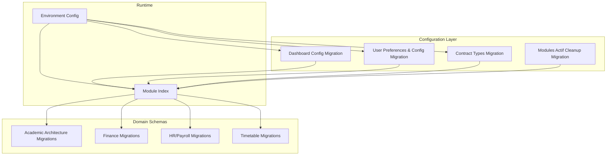
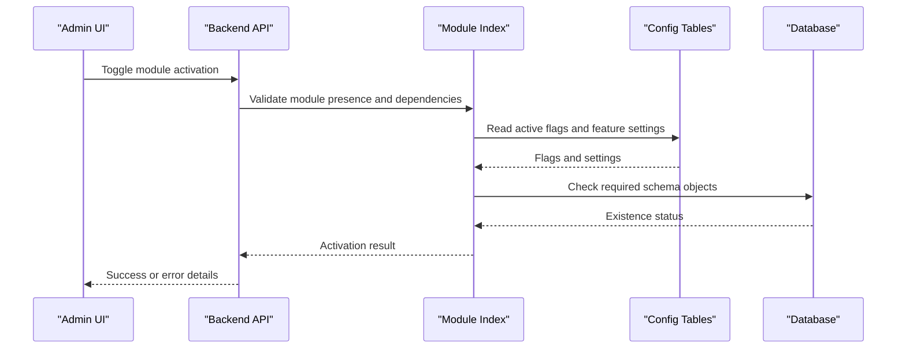
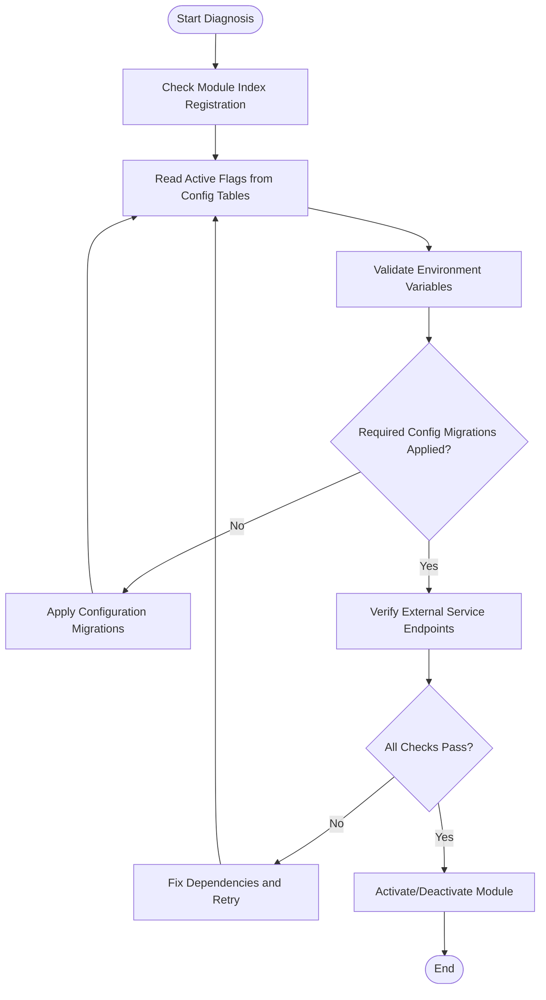
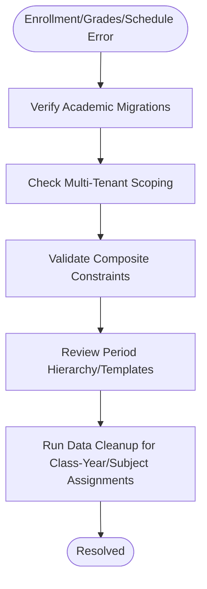
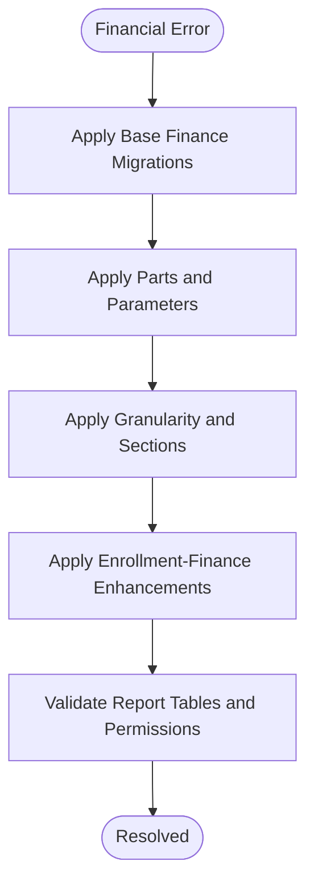
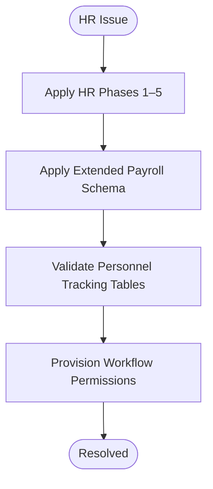
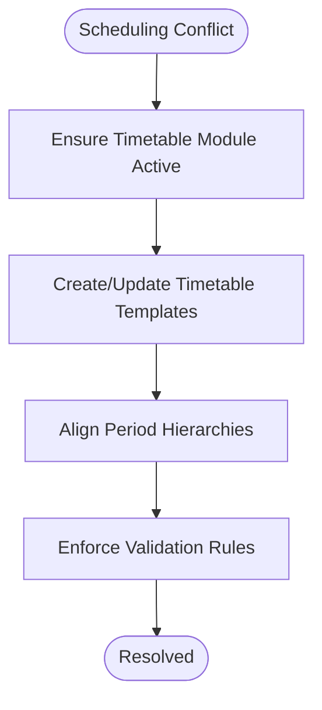
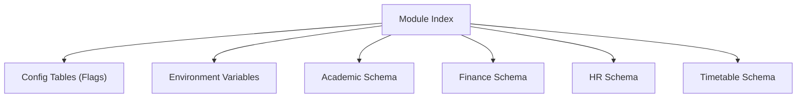

# Module Functionality Errors

<cite>
**Referenced Files in This Document**
- [backend/src/modules/index.ts](file://backend/src/modules/index.ts)
- [backend/src/config/env.config.ts](file://backend/src/config/env.config.ts)
- [backend/src/database/migrations/107-cleanup-configuration-modules-actif.sql](file://backend/src/database/migrations/107-cleanup-configuration-modules-actif.sql)
- [backend/src/database/migrations/046-dashboard-config.sql](file://backend/src/database/migrations/046-dashboard-config.sql)
- [backend/src/database/migrations/046-preferences-utilisateur-et-config.sql](file://backend/src/database/migrations/046-preferences-utilisateur-et-config.sql)
- [backend/src/database/migrations/046-types-contrat-personnalises.sql](file://backend/src/database/migrations/046-types-contrat-personnalises.sql)
- [backend/src/database/migrations/059-ajouter-affectation-matiere-sous-systeme.sql](file://backend/src/database/migrations/059-ajouter-affectation-matiere-sous-systeme.sql)
- [backend/src/database/migrations/063-creer-module-emploi-du-temps.sql](file://backend/src/database/migrations/063-creer-module-emploi-du-temps.sql)
- [backend/src/database/migrations/088-refactorisation-architecture-academique.sql](file://backend/src/database/migrations/088-refactorisation-architecture-academique.sql)
- [backend/src/database/migrations/089-finalisation-architecture-academique-v2.sql](file://backend/src/database/migrations/089-finalisation-architecture-academique-v2.sql)
- [backend/src/database/migrations/091-peuplement-architecture-academique.sql](file://backend/src/database/migrations/091-peuplement-architecture-academique.sql)
- [backend/src/database/migrations/101-normalisation-annee-scolaire-cloture.sql](file://backend/src/database/migrations/101-normalisation-annee-scolaire-cloture.sql)
- [backend/src/database/migrations/102-periodes-hierarchie.sql](file://backend/src/database/migrations/102-periodes-hierarchie.sql)
- [backend/src/database/migrations/103-templates-periode-personnalisables.sql](file://backend/src/database/migrations/103-templates-periode-personnalisables.sql)
- [backend/src/database/migrations/104-refonte-periodes-niveaux-configurables.sql](file://backend/src/database/migrations/104-refonte-periodes-niveaux-configurables.sql)
- [backend/src/database/migrations/010-module-finances.sql](file://backend/src/database/migrations/010-module-finances.sql)
- [backend/src/database/migrations/011-module-finances-part2.sql](file://backend/src/database/migrations/011-module-finances-part2.sql)
- [backend/src/database/migrations/012-module-finances-part3-parametres.sql](file://backend/src/database/migrations/012-module-finances-part3-parametres.sql)
- [backend/src/database/migrations/013-module-finances-phase1-granularite.sql](file://backend/src/database/migrations/013-module-finances-phase1-granularite.sql)
- [backend/src/database/migrations/014-module-finances-phase2-section.sql](file://backend/src/database/migrations/014-module-finances-phase2-section.sql)
- [backend/src/database/migrations/016-module-personnel-rh-phase1.sql](file://backend/src/database/migrations/016-module-personnel-rh-phase1.sql)
- [backend/src/database/migrations/017-module-personnel-rh-phase2.sql](file://backend/src/database/migrations/017-module-personnel-rh-phase2.sql)
- [backend/src/database/migrations/018-module-personnel-rh-phase3.sql](file://backend/src/database/migrations/018-module-personnel-rh-phase3.sql)
- [backend/src/database/migrations/019-module-personnel-rh-phase4.sql](file://backend/src/database/migrations/019-module-personnel-rh-phase4.sql)
- [backend/src/database/migrations/020-module-personnel-rh-phase5.sql](file://backend/src/database/migrations/020-module-personnel-rh-phase5.sql)
- [backend/src/database/migrations/029-paie-etendue.sql](file://backend/src/database/migrations/029-paie-etendue.sql)
- [backend/src/database/migrations/030-suivi-eleves.sql](file://backend/src/database/migrations/030-suivi-eleves.sql)
- [backend/src/database/migrations/031-suivi-personnel.sql](file://backend/src/database/migrations/031-suivi-personnel.sql)
- [backend/src/database/migrations/049-ameliorations-inscription-finances.sql](file://backend/src/database/migrations/049-ameliorations-inscription-finances.sql)
- [backend/src/database/migrations/050-ameliorations-inscription-relances.sql](file://backend/src/database/migrations/050-ameliorations-inscription-relances.sql)
- [backend/src/database/migrations/053-structure-academique-complete.sql](file://backend/src/database/migrations/053-structure-academique-complete.sql)
- [backend/src/database/migrations/054-refonte-structure-academique-v2.sql](file://backend/src/database/migrations/054-refonte-structure-academique-v2.sql)
- [backend/src/database/migrations/055-structure-academique-ameliorations.sql](file://backend/src/database/migrations/055-structure-academique-ameliorations.sql)
- [backend/src/database/migrations/056-refactor-note-enseignant-membre-personnel.sql](file://backend/src/database/migrations/056-refactor-note-enseignant-membre-personnel.sql)
- [backend/src/database/migrations/058-multi-tenant-structure-academique.sql](file://backend/src/database/migrations/058-multi-tenant-structure-academique.sql)
- [backend/src/database/migrations/059-multi-tenant-matiere.sql](file://backend/src/database/migrations/059-multi-tenant-matiere.sql)
- [backend/src/database/migrations/060-ajouter-affectation-matiere-coefficient.sql](file://backend/src/database/migrations/060-ajouter-affectation-matiere-coefficient.sql)
- [backend/src/database/migrations/061-creer-table-bulletins-matieres.sql](file://backend/src/database/migrations/061-creer-table-bulletins-matieres.sql)
- [backend/src/database/migrations/062-creer-table-evaluations-competences.sql](file://backend/src/database/migrations/062-creer-table-evaluations-competences.sql)
- [backend/src/database/migrations/064-validateur-sous-systeme.sql](file://backend/src/database/migrations/064-validateur-sous-systeme.sql)
- [backend/src/database/migrations/065-templates-emploi-du-temps.sql](file://backend/src/database/migrations/065-templates-emploi-du-temps.sql)
- [backend/src/database/migrations/072-scoping-cycles-niveaux.sql](file://backend/src/database/migrations/072-scoping-cycles-niveaux.sql)
- [backend/src/database/migrations/073-competence-unique-composite.sql](file://backend/src/database/migrations/073-competence-unique-composite.sql)
- [backend/src/database/migrations/074-matiere-niveau-unique-composite.sql](file://backend/src/database/migrations/074-matiere-niveau-unique-composite.sql)
- [backend/src/database/migrations/085-periode-etablissement-id.sql](file://backend/src/database/migrations/085-periode-etablissement-id.sql)
- [backend/src/database/migrations/086-affectation-matiere-etablissement-id.sql](file://backend/src/database/migrations/086-affectation-matiere-etablissement-id.sql)
- [backend/src/database/migrations/087-affectation-matiere-verifications.sql](file://backend/src/database/migrations/087-affectation-matiere-verifications.sql)
- [backend/src/database/migrations/092-refactorisation-classeAnneeId.sql](file://backend/src/database/migrations/092-refactorisation-classeAnneeId.sql)
- [backend/src/database/migrations/099-add-monitoring-params.sql](file://backend/src/database/migrations/099-add-monitoring-params.sql)
- [backend/src/database/migrations/100-classes-salle-principale.sql](file://backend/src/database/migrations/100-classes-salle-principale.sql)
- [backend/src/database/migrations/105-migration-templates-v5.sql](file://backend/src/database/migrations/105-migration-templates-v5.sql)
- [backend/src/database/migrations/106-rename-sequence-to-evaluation.sql](file://backend/src/database/migrations/106-rename-sequence-to-evaluation.sql)
- [backend/src/database/migrations/043-permissions-critiques-manquantes.sql](file://backend/src/database/migrations/043-permissions-critiques-manquantes.sql)
- [backend/src/database/migrations/069-fix-super-admin-permissions.sql](file://backend/src/database/migrations/069-fix-super-admin-permissions.sql)
- [backend/src/database/migrations/070-fix-super-admin-all-permission.sql](file://backend/src/database/migrations/070-fix-super-admin-all-permission.sql)
- [backend/src/database/migrations/079-add-roleId-utilisateur-etablissements.sql](file://backend/src/database/migrations/079-add-roleId-utilisateur-etablissements.sql)
- [backend/src/database/migrations/079-correction-permissions-groupes.sql](file://backend/src/database/migrations/079-correction-permissions-groupes.sql)
- [backend/src/database/migrations/080-preferences-utilisateur-multi-tenant.sql](file://backend/src/database/migrations/080-preferences-utilisateur-multi-tenant.sql)
- [backend/src/database/migrations/082-fix-contrainte-unique-preferences.sql](file://backend/src/database/migrations/082-fix-contrainte-unique-preferences.sql)
- [backend/src/database/migrations/083-fix-contrainte-unique-parametres.sql](file://backend/src/database/migrations/083-fix-contrainte-unique-parametres.sql)
- [backend/src/database/migrations/084-cleanup-classe-id-notes.sql](file://backend/src/database/migrations/084-cleanup-classe-id-notes.sql)
- [backend/src/database/migrations/040-reset-capabilities.sql](file://backend/src/database/migrations/040-reset-capabilities.sql)
- [backend/src/database/migrations/033-workflow-permissions-nouveaux-modules.sql](file://backend/src/database/migrations/033-workflow-permissions-nouveaux-modules.sql)
- [backend/src/database/migrations/034-annee-scolaire-suivi.sql](file://backend/src/database/migrations/034-annee-scolaire-suivi.sql)
- [backend/src/database/migrations/035-contexte-africain-periodes.sql](file://backend/src/database/migrations/035-contexte-africain-periodes.sql)
- [backend/src/database/migrations/035b-migration-donnees-periodes.sql](file://backend/src/database/migrations/035b-migration-donnees-periodes.sql)
- [backend/src/database/migrations/036-module-types-enum.sql](file://backend/src/database/migrations/036-module-types-enum.sql)
- [backend/src/database/migrations/041-module-annonces-complete.sql](file://backend/src/database/migrations/041-module-annonces-complete.sql)
- [backend/src/database/migrations/041-module-sondages.sql](file://backend/src/database/migrations/041-module-sondages.sql)
- [backend/src/database/migrations/042-annonces-performance-optimization.sql](file://backend/src/database/migrations/042-annonces-performance-optimization.sql)
- [backend/src/database/migrations/043-module-messagerie-complete.sql](file://backend/src/database/migrations/043-module-messagerie-complete.sql)
- [backend/src/database/migrations/044-module-organisation.sql](file://backend/src/database/migrations/044-module-organisation.sql)
- [backend/src/database/migrations/044-organisation-optimisations.sql](file://backend/src/database/migrations/044-organisation-optimisations.sql)
- [backend/src/database/migrations/045-module-recrutement.sql](file://backend/src/database/migrations/045-module-recrutement.sql)
- [backend/src/database/migrations/046-dashboard-config.sql](file://backend/src/database/migrations/046-dashboard-config.sql)
- [backend/src/database/migrations/047-notifications-ameliorations.sql](file://backend/src/database/migrations/047-notifications-ameliorations.sql)
- [backend/src/database/migrations/047-optimisations-performance-v3.1.sql](file://backend/src/database/migrations/047-optimisations-performance-v3.1.sql)
- [backend/src/database/migrations/048-notifications-performance-optimizations.sql](file://backend/src/database/migrations/048-notifications-performance-optimizations.sql)
- [backend/src/database/migrations/070-module-salles.sql](file://backend/src/database/migrations/070-module-salles.sql)
- [backend/src/database/migrations/075-module-groupes-etablissements.sql](file://backend/src/database/migrations/075-module-groupes-etablissements.sql)
- [backend/src/database/migrations/076-permissions-groupes-etablissements.sql](file://backend/src/database/migrations/076-permissions-groupes-etablissements.sql)
- [backend/src/database/migrations/077-update-permissions-groupes.sql](file://backend/src/database/migrations/077-update-permissions-groupes.sql)
- [backend/src/database/migrations/078-utilisateur-test-groupes.sql](file://backend/src/database/migrations/078-utilisateur-test-groupes.sql)
- [backend/src/database/migrations/081-module-apparence-fonds.sql](file://backend/src/database/migrations/081-module-apparence-fonds.sql)
- [backend/src/database/migrations/090-correction-migration-088-camelcase.sql](file://backend/src/database/migrations/090-correction-migration-088-camelcase.sql)
- [backend/src/database/migrations/099-add-monitoring-params.sql](file://backend/src/database/migrations/099-add-monitoring-params.sql)
- [backend/src/database/migrations/100-classes-salle-principale.sql](file://backend/src/database/migrations/100-classes-salle-principale.sql)
- [backend/src/database/migrations/101-normalisation-annee-scolaire-cloture.sql](file://backend/src/database/migrations/101-normalisation-annee-scolaire-cloture.sql)
- [backend/src/database/migrations/102-periodes-hierarchie.sql](file://backend/src/database/migrations/102-periodes-hierarchie.sql)
- [backend/src/database/migrations/103-templates-periode-personnalisables.sql](file://backend/src/database/migrations/103-templates-periode-personnalisables.sql)
- [backend/src/database/migrations/104-refonte-periodes-niveaux-configurables.sql](file://backend/src/database/migrations/104-refonte-periodes-niveaux-configurables.sql)
- [backend/src/database/migrations/105-migration-templates-v5.sql](file://backend/src/database/migrations/105-migration-templates-v5.sql)
- [backend/src/database/migrations/106-rename-sequence-to-evaluation.sql](file://backend/src/database/migrations/106-rename-sequence-to-evaluation.sql)
- [backend/src/database/migrations/043-permissions-critiques-manquantes.sql](file://backend/src/database/migrations/043-permissions-critiques-manquantes.sql)
- [backend/src/database/migrations/069-fix-super-admin-permissions.sql](file://backend/src/database/migrations/069-fix-super-admin-permissions.sql)
- [backend/src/database/migrations/070-fix-super-admin-all-permission.sql](file://backend/src/database/migrations/070-fix-super-admin-all-permission.sql)
- [backend/src/database/migrations/079-add-roleId-utilisateur-etablissements.sql](file://backend/src/database/migrations/079-add-roleId-utilisateur-etablissements.sql)
- [backend/src/database/migrations/079-correction-permissions-groupes.sql](file://backend/src/database/migrations/079-correction-permissions-groupes.sql)
- [backend/src/database/migrations/080-preferences-utilisateur-multi-tenant.sql](file://backend/src/database/migrations/080-preferences-utilisateur-multi-tenant.sql)
- [backend/src/database/migrations/082-fix-contrainte-unique-preferences.sql](file://backend/src/database/migrations/082-fix-contrainte-unique-preferences.sql)
- [backend/src/database/migrations/083-fix-contrainte-unique-parametres.sql](file://backend/src/database/migrations/083-fix-contrainte-unique-parametres.sql)
- [backend/src/database/migrations/084-cleanup-classe-id-notes.sql](file://backend/src/database/migrations/084-cleanup-classe-id-notes.sql)
- [backend/src/database/migrations/040-reset-capabilities.sql](file://backend/src/database/migrations/040-reset-capabilities.sql)
- [backend/src/database/migrations/033-workflow-permissions-nouveaux-modules.sql](file://backend/src/database/migrations/033-workflow-permissions-nouveaux-modules.sql)
- [backend/src/database/migrations/034-annee-scolaire-suivi.sql](file://backend/src/database/migrations/034-annee-scolaire-suivi.sql)
- [backend/src/database/migrations/035-contexte-africain-periodes.sql](file://backend/src/database/migrations/035-contexte-africain-periodes.sql)
- [backend/src/database/migrations/035b-migration-donnees-periodes.sql](file://backend/src/database/migrations/035b-migration-donnees-periodes.sql)
- [backend/src/database/migrations/036-module-types-enum.sql](file://backend/src/database/migrations/036-module-types-enum.sql)
- [backend/src/database/migrations/041-module-annonces-complete.sql](file://backend/src/database/migrations/041-module-annonces-complete.sql)
- [backend/src/database/migrations/041-module-sondages.sql](file://backend/src/database/migrations/041-module-sondages.sql)
- [backend/src/database/migrations/042-annonces-performance-optimization.sql](file://backend/src/database/migrations/042-annonces-performance-optimization.sql)
- [backend/src/database/migrations/043-module-messagerie-complete.sql](file://backend/src/database/migrations/043-module-messagerie-complete.sql)
- [backend/src/database/migrations/044-module-organisation.sql](file://backend/src/database/migrations/044-module-organisation.sql)
- [backend/src/database/migrations/044-organisation-optimisations.sql](file://backend/src/database/migrations/044-organisation-optimisations.sql)
- [backend/src/database/migrations/045-module-recrutement.sql](file://backend/src/database/migrations/045-module-recrutement.sql)
- [backend/src/database/migrations/046-dashboard-config.sql](file://backend/src/database/migrations/046-dashboard-config.sql)
- [backend/src/database/migrations/047-notifications-ameliorations.sql](file://backend/src/database/migrations/047-notifications-ameliorations.sql)
- [backend/src/database/migrations/047-optimisations-performance-v3.1.sql](file://backend/src/database/migrations/047-optimisations-performance-v3.1.sql)
- [backend/src/database/migrations/048-notifications-performance-optimizations.sql](file://backend/src/database/migrations/048-notifications-performance-optimizations.sql)
- [backend/src/database/migrations/070-module-salles.sql](file://backend/src/database/migrations/070-module-salles.sql)
- [backend/src/database/migrations/075-module-groupes-etablissements.sql](file://backend/src/database/migrations/075-module-groupes-etablissements.sql)
- [backend/src/database/migrations/076-permissions-groupes-etablissements.sql](file://backend/src/database/migrations/076-permissions-groupes-etablissements.sql)
- [backend/src/database/migrations/077-update-permissions-groupes.sql](file://backend/src/database/migrations/077-update-permissions-groupes.sql)
- [backend/src/database/migrations/078-utilisateur-test-groupes.sql](file://backend/src/database/migrations/078-utilisateur-test-groupes.sql)
- [backend/src/database/migrations/081-module-apparence-fonds.sql](file://backend/src/database/migrations/081-module-apparence-fonds.sql)
- [backend/src/database/migrations/090-correction-migration-088-camelcase.sql](file://backend/src/database/migrations/090-correction-migration-088-camelcase.sql)
- [backend/src/database/migrations/099-add-monitoring-params.sql](file://backend/src/database/migrations/099-add-monitoring-params.sql)
- [backend/src/database/migrations/100-classes-salle-principale.sql](file://backend/src/database/migrations/100-classes-salle-principale.sql)
- [backend/src/database/migrations/101-normalisation-annee-scolaire-cloture.sql](file://backend/src/database/migrations/101-normalisation-annee-scolaire-cloture.sql)
- [backend/src/database/migrations/102-periodes-hierarchie.sql](file://backend/src/database/migrations/102-periodes-hierarchie.sql)
- [backend/src/database/migrations/103-templates-periode-personnalisables.sql](file://backend/src/database/migrations/103-templates-periode-personnalisables.sql)
- [backend/src/database/migrations/104-refonte-periodes-niveaux-configurables.sql](file://backend/src/database/migrations/104-refonte-periodes-niveaux-configurables.sql)
- [backend/src/database/migrations/105-migration-templates-v5.sql](file://backend/src/database/migrations/105-migration-templates-v5.sql)
- [backend/src/database/migrations/106-rename-sequence-to-evaluation.sql](file://backend/src/database/migrations/106-rename-sequence-to-evaluation.sql)
</cite>

## Table of Contents
1. [Introduction](#introduction)
2. [Project Structure](#project-structure)
3. [Core Components](#core-components)
4. [Architecture Overview](#architecture-overview)
5. [Detailed Component Analysis](#detailed-component-analysis)
6. [Dependency Analysis](#dependency-analysis)
7. [Performance Considerations](#performance-considerations)
8. [Troubleshooting Guide](#troubleshooting-guide)
9. [Conclusion](#conclusion)
10. [Appendices](#appendices)

## Introduction
This document focuses on module-specific functionality errors across eLISAschool, with emphasis on:
- Module activation/deactivation problems and feature flag misconfigurations
- Service dependency failures between modules
- Academic management errors (enrollment, grades, scheduling)
- Financial module errors (payments, fee structures, reports)
- HR module issues (payroll, attendance, personnel workflows)
- Diagnostic commands, log analysis techniques, and recovery procedures for corrupted module states

The guidance is grounded in the repository’s module registry, configuration migrations, and domain-specific schema changes that influence runtime behavior.

## Project Structure
At a high level, module enablement and feature flags are driven by database configuration and preferences, while academic, financial, and HR capabilities depend on specific migrations and tables. The backend module index aggregates available modules, and environment configuration provides runtime toggles.

**Diagram sources**
- [backend/src/modules/index.ts](file://backend/src/modules/index.ts)
- [backend/src/config/env.config.ts](file://backend/src/config/env.config.ts)
- [backend/src/database/migrations/046-dashboard-config.sql](file://backend/src/database/migrations/046-dashboard-config.sql)
- [backend/src/database/migrations/046-preferences-utilisateur-et-config.sql](file://backend/src/database/migrations/046-preferences-utilisateur-et-config.sql)
- [backend/src/database/migrations/046-types-contrat-personnalises.sql](file://backend/src/database/migrations/046-types-contrat-personnalises.sql)
- [backend/src/database/migrations/107-cleanup-configuration-modules-actif.sql](file://backend/src/database/migrations/107-cleanup-configuration-modules-actif.sql)
- [backend/src/database/migrations/088-refactorisation-architecture-academique.sql](file://backend/src/database/migrations/088-refactorisation-architecture-academique.sql)
- [backend/src/database/migrations/089-finalisation-architecture-academique-v2.sql](file://backend/src/database/migrations/089-finalisation-architecture-academique-v2.sql)
- [backend/src/database/migrations/010-module-finances.sql](file://backend/src/database/migrations/010-module-finances.sql)
- [backend/src/database/migrations/016-module-personnel-rh-phase1.sql](file://backend/src/database/migrations/016-module-personnel-rh-phase1.sql)
- [backend/src/database/migrations/063-creer-module-emploi-du-temps.sql](file://backend/src/database/migrations/063-creer-module-emploi-du-temps.sql)

**Section sources**
- [backend/src/modules/index.ts](file://backend/src/modules/index.ts)
- [backend/src/config/env.config.ts](file://backend/src/config/env.config.ts)
- [backend/src/database/migrations/046-dashboard-config.sql](file://backend/src/database/migrations/046-dashboard-config.sql)
- [backend/src/database/migrations/046-preferences-utilisateur-et-config.sql](file://backend/src/database/migrations/046-preferences-utilisateur-et-config.sql)
- [backend/src/database/migrations/046-types-contrat-personnalises.sql](file://backend/src/database/migrations/046-types-contrat-personnalises.sql)
- [backend/src/database/migrations/107-cleanup-configuration-modules-actif.sql](file://backend/src/database/migrations/107-cleanup-configuration-modules-actif.sql)

## Core Components
- Module Registry and Activation
  - The module index centralizes module availability and wiring. Misregistration or missing dependencies here can cause activation failures.
  - Feature flags and module state often rely on configuration tables created by dashboard config and user preferences migrations.
- Configuration and Environment
  - Environment configuration supplies runtime toggles and service endpoints. Incorrect values can lead to service dependency failures.
- Domain Schema Dependencies
  - Academic, Finance, HR, and Timetable modules depend on specific migrations. Missing or partially applied migrations result in validation and calculation errors.

Key areas to inspect when diagnosing module errors:
- Module index registration and initialization order
- Configuration tables for active modules and feature flags
- Environment variables for external services
- Presence and integrity of domain tables and constraints

**Section sources**
- [backend/src/modules/index.ts](file://backend/src/modules/index.ts)
- [backend/src/config/env.config.ts](file://backend/src/config/env.config.ts)
- [backend/src/database/migrations/046-dashboard-config.sql](file://backend/src/database/migrations/046-dashboard-config.sql)
- [backend/src/database/migrations/046-preferences-utilisateur-et-config.sql](file://backend/src/database/migrations/046-preferences-utilisateur-et-config.sql)
- [backend/src/database/migrations/107-cleanup-configuration-modules-actif.sql](file://backend/src/database/migrations/107-cleanup-configuration-modules-actif.sql)

## Architecture Overview
The system composes modules around a shared configuration layer and domain schemas. Activation depends on both code-level registration and database-driven flags.

**Diagram sources**
- [backend/src/modules/index.ts](file://backend/src/modules/index.ts)
- [backend/src/config/env.config.ts](file://backend/src/config/env.config.ts)
- [backend/src/database/migrations/046-dashboard-config.sql](file://backend/src/database/migrations/046-dashboard-config.sql)
- [backend/src/database/migrations/046-preferences-utilisateur-et-config.sql](file://backend/src/database/migrations/046-preferences-utilisateur-et-config.sql)

## Detailed Component Analysis

### Module Activation/Deactivation and Feature Flags
Common symptoms:
- Module appears disabled despite being enabled in UI
- Feature not visible after enabling module
- Activation fails due to missing dependencies

Root causes:
- Inconsistent state between module index and configuration tables
- Missing or incomplete configuration migrations
- Feature flags not persisted or scoped incorrectly
- External service endpoints misconfigured in environment

Diagnostic steps:
- Verify module registration in the module index
- Inspect configuration tables for active module flags and feature toggles
- Confirm environment variables for dependent services
- Ensure all relevant configuration migrations have been applied

Recovery procedures:
- Re-run configuration migrations if flags are missing
- Reset module activation state via configuration tables
- Correct environment variables and restart services
- Validate module index consistency and reinitialize if needed

**Diagram sources**
- [backend/src/modules/index.ts](file://backend/src/modules/index.ts)
- [backend/src/config/env.config.ts](file://backend/src/config/env.config.ts)
- [backend/src/database/migrations/046-dashboard-config.sql](file://backend/src/database/migrations/046-dashboard-config.sql)
- [backend/src/database/migrations/046-preferences-utilisateur-et-config.sql](file://backend/src/database/migrations/046-preferences-utilisateur-et-config.sql)
- [backend/src/database/migrations/107-cleanup-configuration-modules-actif.sql](file://backend/src/database/migrations/107-cleanup-configuration-modules-actif.sql)

**Section sources**
- [backend/src/modules/index.ts](file://backend/src/modules/index.ts)
- [backend/src/config/env.config.ts](file://backend/src/config/env.config.ts)
- [backend/src/database/migrations/046-dashboard-config.sql](file://backend/src/database/migrations/046-dashboard-config.sql)
- [backend/src/database/migrations/046-preferences-utilisateur-et-config.sql](file://backend/src/database/migrations/046-preferences-utilisateur-et-config.sql)
- [backend/src/database/migrations/107-cleanup-configuration-modules-actif.sql](file://backend/src/database/migrations/107-cleanup-configuration-modules-actif.sql)

### Academic Management Errors
Typical issues:
- Student enrollment conflicts or failures
- Grade calculation inconsistencies
- Schedule/timetable conflicts

Root causes:
- Incomplete academic architecture migrations
- Missing multi-tenant scoping or composite constraints
- Invalid period hierarchies or templates
- Data cleanup gaps affecting class-year relationships

Diagnostic steps:
- Confirm academic architecture migrations are fully applied
- Validate multi-tenant scoping and unique constraints
- Review period hierarchy and template configurations
- Check class-year and subject assignment integrity

Recovery procedures:
- Apply pending academic migrations
- Enforce composite constraints and unique keys
- Rebuild period hierarchies and templates
- Run data cleanup scripts for orphaned records

**Diagram sources**
- [backend/src/database/migrations/088-refactorisation-architecture-academique.sql](file://backend/src/database/migrations/088-refactorisation-architecture-academique.sql)
- [backend/src/database/migrations/089-finalisation-architecture-academique-v2.sql](file://backend/src/database/migrations/089-finalisation-architecture-academique-v2.sql)
- [backend/src/database/migrations/091-peuplement-architecture-academique.sql](file://backend/src/database/migrations/091-peuplement-architecture-academique.sql)
- [backend/src/database/migrations/058-multi-tenant-structure-academique.sql](file://backend/src/database/migrations/058-multi-tenant-structure-academique.sql)
- [backend/src/database/migrations/072-scoping-cycles-niveaux.sql](file://backend/src/database/migrations/072-scoping-cycles-niveaux.sql)
- [backend/src/database/migrations/073-competence-unique-composite.sql](file://backend/src/database/migrations/073-competence-unique-composite.sql)
- [backend/src/database/migrations/074-matiere-niveau-unique-composite.sql](file://backend/src/database/migrations/074-matiere-niveau-unique-composite.sql)
- [backend/src/database/migrations/059-ajouter-affectation-matiere-sous-systeme.sql](file://backend/src/database/migrations/059-ajouter-affectation-matiere-sous-systeme.sql)
- [backend/src/database/migrations/060-ajouter-affectation-matiere-coefficient.sql](file://backend/src/database/migrations/060-ajouter-affectation-matiere-coefficient.sql)
- [backend/src/database/migrations/084-cleanup-classe-id-notes.sql](file://backend/src/database/migrations/084-cleanup-classe-id-notes.sql)
- [backend/src/database/migrations/092-refactorisation-classeAnneeId.sql](file://backend/src/database/migrations/092-refactorisation-classeAnneeId.sql)
- [backend/src/database/migrations/101-normalisation-annee-scolaire-cloture.sql](file://backend/src/database/migrations/101-normalisation-annee-scolaire-cloture.sql)
- [backend/src/database/migrations/102-periodes-hierarchie.sql](file://backend/src/database/migrations/102-periodes-hierarchie.sql)
- [backend/src/database/migrations/103-templates-periode-personnalisables.sql](file://backend/src/database/migrations/103-templates-periode-personnalisables.sql)
- [backend/src/database/migrations/104-refonte-periodes-niveaux-configurables.sql](file://backend/src/database/migrations/104-refonte-periodes-niveaux-configurables.sql)
- [backend/src/database/migrations/053-structure-academique-complete.sql](file://backend/src/database/migrations/053-structure-academique-complete.sql)
- [backend/src/database/migrations/054-refonte-structure-academique-v2.sql](file://backend/src/database/migrations/054-refonte-structure-academique-v2.sql)
- [backend/src/database/migrations/055-structure-academique-ameliorations.sql](file://backend/src/database/migrations/055-structure-academique-ameliorations.sql)
- [backend/src/database/migrations/056-refactor-note-enseignant-membre-personnel.sql](file://backend/src/database/migrations/056-refactor-note-enseignant-membre-personnel.sql)
- [backend/src/database/migrations/059-multi-tenant-matiere.sql](file://backend/src/database/migrations/059-multi-tenant-matiere.sql)
- [backend/src/database/migrations/061-creer-table-bulletins-matieres.sql](file://backend/src/database/migrations/061-creer-table-bulletins-matieres.sql)
- [backend/src/database/migrations/062-creer-table-evaluations-competences.sql](file://backend/src/database/migrations/062-creer-table-evaluations-competences.sql)
- [backend/src/database/migrations/064-validateur-sous-systeme.sql](file://backend/src/database/migrations/064-validateur-sous-systeme.sql)
- [backend/src/database/migrations/085-periode-etablissement-id.sql](file://backend/src/database/migrations/085-periode-etablissement-id.sql)
- [backend/src/database/migrations/086-affectation-matiere-etablissement-id.sql](file://backend/src/database/migrations/086-affectation-matiere-etablissement-id.sql)
- [backend/src/database/migrations/087-affectation-matiere-verifications.sql](file://backend/src/database/migrations/087-affectation-matiere-verifications.sql)

**Section sources**
- [backend/src/database/migrations/088-refactorisation-architecture-academique.sql](file://backend/src/database/migrations/088-refactorisation-architecture-academique.sql)
- [backend/src/database/migrations/089-finalisation-architecture-academique-v2.sql](file://backend/src/database/migrations/089-finalisation-architecture-academique-v2.sql)
- [backend/src/database/migrations/091-peuplement-architecture-academique.sql](file://backend/src/database/migrations/091-peuplement-architecture-academique.sql)
- [backend/src/database/migrations/058-multi-tenant-structure-academique.sql](file://backend/src/database/migrations/058-multi-tenant-structure-academique.sql)
- [backend/src/database/migrations/072-scoping-cycles-niveaux.sql](file://backend/src/database/migrations/072-scoping-cycles-niveaux.sql)
- [backend/src/database/migrations/073-competence-unique-composite.sql](file://backend/src/database/migrations/073-competence-unique-composite.sql)
- [backend/src/database/migrations/074-matiere-niveau-unique-composite.sql](file://backend/src/database/migrations/074-matiere-niveau-unique-composite.sql)
- [backend/src/database/migrations/059-ajouter-affectation-matiere-sous-systeme.sql](file://backend/src/database/migrations/059-ajouter-affectation-matiere-sous-systeme.sql)
- [backend/src/database/migrations/060-ajouter-affectation-matiere-coefficient.sql](file://backend/src/database/migrations/060-ajouter-affectation-matiere-coefficient.sql)
- [backend/src/database/migrations/084-cleanup-classe-id-notes.sql](file://backend/src/database/migrations/084-cleanup-classe-id-notes.sql)
- [backend/src/database/migrations/092-refactorisation-classeAnneeId.sql](file://backend/src/database/migrations/092-refactorisation-classeAnneeId.sql)
- [backend/src/database/migrations/101-normalisation-annee-scolaire-cloture.sql](file://backend/src/database/migrations/101-normalisation-annee-scolaire-cloture.sql)
- [backend/src/database/migrations/102-periodes-hierarchie.sql](file://backend/src/database/migrations/102-periodes-hierarchie.sql)
- [backend/src/database/migrations/103-templates-periode-personnalisables.sql](file://backend/src/database/migrations/103-templates-periode-personnalisables.sql)
- [backend/src/database/migrations/104-refonte-periodes-niveaux-configurables.sql](file://backend/src/database/migrations/104-refonte-periodes-niveaux-configurables.sql)
- [backend/src/database/migrations/053-structure-academique-complete.sql](file://backend/src/database/migrations/053-structure-academique-complete.sql)
- [backend/src/database/migrations/054-refonte-structure-academique-v2.sql](file://backend/src/database/migrations/054-refonte-structure-academique-v2.sql)
- [backend/src/database/migrations/055-structure-academique-ameliorations.sql](file://backend/src/database/migrations/055-structure-academique-ameliorations.sql)
- [backend/src/database/migrations/056-refactor-note-enseignant-membre-personnel.sql](file://backend/src/database/migrations/056-refactor-note-enseignant-membre-personnel.sql)
- [backend/src/database/migrations/059-multi-tenant-matiere.sql](file://backend/src/database/migrations/059-multi-tenant-matiere.sql)
- [backend/src/database/migrations/061-creer-table-bulletins-matieres.sql](file://backend/src/database/migrations/061-creer-table-bulletins-matieres.sql)
- [backend/src/database/migrations/062-creer-table-evaluations-competences.sql](file://backend/src/database/migrations/062-creer-table-evaluations-competences.sql)
- [backend/src/database/migrations/064-validateur-sous-systeme.sql](file://backend/src/database/migrations/064-validateur-sous-systeme.sql)
- [backend/src/database/migrations/085-periode-etablissement-id.sql](file://backend/src/database/migrations/085-periode-etablissement-id.sql)
- [backend/src/database/migrations/086-affectation-matiere-etablissement-id.sql](file://backend/src/database/migrations/086-affectation-matiere-etablissement-id.sql)
- [backend/src/database/migrations/087-affectation-matiere-verifications.sql](file://backend/src/database/migrations/087-affectation-matiere-verifications.sql)

### Financial Module Errors
Common issues:
- Payment processing failures
- Fee structure validation errors
- Report generation problems

Root causes:
- Missing finance schema objects or parameters
- Granularity and section configuration not applied
- Enrollment improvements not migrated
- Reporting dependencies absent

Diagnostic steps:
- Verify finance migrations (base, parts, parameters, granularity, sections)
- Confirm enrollment-related finance enhancements are present
- Check reporting table existence and permissions

Recovery procedures:
- Apply all finance migrations in order
- Re-seed or validate fee structures and parameters
- Recreate report templates and ensure access rights

**Diagram sources**
- [backend/src/database/migrations/010-module-finances.sql](file://backend/src/database/migrations/010-module-finances.sql)
- [backend/src/database/migrations/011-module-finances-part2.sql](file://backend/src/database/migrations/011-module-finances-part2.sql)
- [backend/src/database/migrations/012-module-finances-part3-parametres.sql](file://backend/src/database/migrations/012-module-finances-part3-parametres.sql)
- [backend/src/database/migrations/013-module-finances-phase1-granularite.sql](file://backend/src/database/migrations/013-module-finances-phase1-granularite.sql)
- [backend/src/database/migrations/014-module-finances-phase2-section.sql](file://backend/src/database/migrations/014-module-finances-phase2-section.sql)
- [backend/src/database/migrations/049-ameliorations-inscription-finances.sql](file://backend/src/database/migrations/049-ameliorations-inscription-finances.sql)
- [backend/src/database/migrations/050-ameliorations-inscription-relances.sql](file://backend/src/database/migrations/050-ameliorations-inscription-relances.sql)

**Section sources**
- [backend/src/database/migrations/010-module-finances.sql](file://backend/src/database/migrations/010-module-finances.sql)
- [backend/src/database/migrations/011-module-finances-part2.sql](file://backend/src/database/migrations/011-module-finances-part2.sql)
- [backend/src/database/migrations/012-module-finances-part3-parametres.sql](file://backend/src/database/migrations/012-module-finances-part3-parametres.sql)
- [backend/src/database/migrations/013-module-finances-phase1-granularite.sql](file://backend/src/database/migrations/013-module-finances-phase1-granularite.sql)
- [backend/src/database/migrations/014-module-finances-phase2-section.sql](file://backend/src/database/migrations/014-module-finances-phase2-section.sql)
- [backend/src/database/migrations/049-ameliorations-inscription-finances.sql](file://backend/src/database/migrations/049-ameliorations-inscription-finances.sql)
- [backend/src/database/migrations/050-ameliorations-inscription-relances.sql](file://backend/src/database/migrations/050-ameliorations-inscription-relances.sql)

### HR Module Problems
Typical issues:
- Payroll calculation errors
- Attendance tracking anomalies
- Personnel workflow failures

Root causes:
- Incomplete HR phase migrations
- Extended payroll schema not applied
- Tracking tables missing or inconsistent
- Workflow permissions not provisioned

Diagnostic steps:
- Confirm HR phases 1–5 are applied
- Verify extended payroll tables and fields
- Check personnel tracking tables and indexes
- Ensure workflow permissions exist for new modules

Recovery procedures:
- Apply all HR phase migrations
- Rebuild payroll calculations using updated schema
- Re-index tracking tables
- Provision workflow permissions and test flows

**Diagram sources**
- [backend/src/database/migrations/016-module-personnel-rh-phase1.sql](file://backend/src/database/migrations/016-module-personnel-rh-phase1.sql)
- [backend/src/database/migrations/017-module-personnel-rh-phase2.sql](file://backend/src/database/migrations/017-module-personnel-rh-phase2.sql)
- [backend/src/database/migrations/018-module-personnel-rh-phase3.sql](file://backend/src/database/migrations/018-module-personnel-rh-phase3.sql)
- [backend/src/database/migrations/019-module-personnel-rh-phase4.sql](file://backend/src/database/migrations/019-module-personnel-rh-phase4.sql)
- [backend/src/database/migrations/020-module-personnel-rh-phase5.sql](file://backend/src/database/migrations/020-module-personnel-rh-phase5.sql)
- [backend/src/database/migrations/029-paie-etendue.sql](file://backend/src/database/migrations/029-paie-etendue.sql)
- [backend/src/database/migrations/031-suivi-personnel.sql](file://backend/src/database/migrations/031-suivi-personnel.sql)
- [backend/src/database/migrations/033-workflow-permissions-nouveaux-modules.sql](file://backend/src/database/migrations/033-workflow-permissions-nouveaux-modules.sql)

**Section sources**
- [backend/src/database/migrations/016-module-personnel-rh-phase1.sql](file://backend/src/database/migrations/016-module-personnel-rh-phase1.sql)
- [backend/src/database/migrations/017-module-personnel-rh-phase2.sql](file://backend/src/database/migrations/017-module-personnel-rh-phase2.sql)
- [backend/src/database/migrations/018-module-personnel-rh-phase3.sql](file://backend/src/database/migrations/018-module-personnel-rh-phase3.sql)
- [backend/src/database/migrations/019-module-personnel-rh-phase4.sql](file://backend/src/database/migrations/019-module-personnel-rh-phase4.sql)
- [backend/src/database/migrations/020-module-personnel-rh-phase5.sql](file://backend/src/database/migrations/020-module-personnel-rh-phase5.sql)
- [backend/src/database/migrations/029-paie-etendue.sql](file://backend/src/database/migrations/029-paie-etendue.sql)
- [backend/src/database/migrations/031-suivi-personnel.sql](file://backend/src/database/migrations/031-suivi-personnel.sql)
- [backend/src/database/migrations/033-workflow-permissions-nouveaux-modules.sql](file://backend/src/database/migrations/033-workflow-permissions-nouveaux-modules.sql)

### Timetable and Scheduling Conflicts
Symptoms:
- Overlapping sessions
- Room or teacher double-bookings
- Template application failures

Root causes:
- Timetable module not activated
- Templates not configured or outdated
- Validation rules not enforced

Diagnostic steps:
- Ensure timetable module exists and is active
- Validate timetable templates and periods
- Check validation rules and constraints

Recovery procedures:
- Create or update timetable templates
- Reapply period hierarchies and templates
- Enforce validation rules to prevent conflicts

**Diagram sources**
- [backend/src/database/migrations/063-creer-module-emploi-du-temps.sql](file://backend/src/database/migrations/063-creer-module-emploi-du-temps.sql)
- [backend/src/database/migrations/065-templates-emploi-du-temps.sql](file://backend/src/database/migrations/065-templates-emploi-du-temps.sql)
- [backend/src/database/migrations/102-periodes-hierarchie.sql](file://backend/src/database/migrations/102-periodes-hierarchie.sql)
- [backend/src/database/migrations/103-templates-periode-personnalisables.sql](file://backend/src/database/migrations/103-templates-periode-personnalisables.sql)
- [backend/src/database/migrations/104-refonte-periodes-niveaux-configurables.sql](file://backend/src/database/migrations/104-refonte-periodes-niveaux-configurables.sql)

**Section sources**
- [backend/src/database/migrations/063-creer-module-emploi-du-temps.sql](file://backend/src/database/migrations/063-creer-module-emploi-du-temps.sql)
- [backend/src/database/migrations/065-templates-emploi-du-temps.sql](file://backend/src/database/migrations/065-templates-emploi-du-temps.sql)
- [backend/src/database/migrations/102-periodes-hierarchie.sql](file://backend/src/database/migrations/102-periodes-hierarchie.sql)
- [backend/src/database/migrations/103-templates-periode-personnalisables.sql](file://backend/src/database/migrations/103-templates-periode-personnalisables.sql)
- [backend/src/database/migrations/104-refonte-periodes-niveaux-configurables.sql](file://backend/src/database/migrations/104-refonte-periodes-niveaux-configurables.sql)

## Dependency Analysis
Module activation depends on:
- Code-level module index registration
- Database configuration tables for active flags and feature toggles
- Environment variables for external services
- Domain schema completeness

**Diagram sources**
- [backend/src/modules/index.ts](file://backend/src/modules/index.ts)
- [backend/src/config/env.config.ts](file://backend/src/config/env.config.ts)
- [backend/src/database/migrations/046-dashboard-config.sql](file://backend/src/database/migrations/046-dashboard-config.sql)
- [backend/src/database/migrations/046-preferences-utilisateur-et-config.sql](file://backend/src/database/migrations/046-preferences-utilisateur-et-config.sql)
- [backend/src/database/migrations/088-refactorisation-architecture-academique.sql](file://backend/src/database/migrations/088-refactorisation-architecture-academique.sql)
- [backend/src/database/migrations/010-module-finances.sql](file://backend/src/database/migrations/010-module-finances.sql)
- [backend/src/database/migrations/016-module-personnel-rh-phase1.sql](file://backend/src/database/migrations/016-module-personnel-rh-phase1.sql)
- [backend/src/database/migrations/063-creer-module-emploi-du-temps.sql](file://backend/src/database/migrations/063-creer-module-emploi-du-temps.sql)

**Section sources**
- [backend/src/modules/index.ts](file://backend/src/modules/index.ts)
- [backend/src/config/env.config.ts](file://backend/src/config/env.config.ts)
- [backend/src/database/migrations/046-dashboard-config.sql](file://backend/src/database/migrations/046-dashboard-config.sql)
- [backend/src/database/migrations/046-preferences-utilisateur-et-config.sql](file://backend/src/database/migrations/046-preferences-utilisateur-et-config.sql)
- [backend/src/database/migrations/088-refactorisation-architecture-academique.sql](file://backend/src/database/migrations/088-refactorisation-architecture-academique.sql)
- [backend/src/database/migrations/010-module-finances.sql](file://backend/src/database/migrations/010-module-finances.sql)
- [backend/src/database/migrations/016-module-personnel-rh-phase1.sql](file://backend/src/database/migrations/016-module-personnel-rh-phase1.sql)
- [backend/src/database/migrations/063-creer-module-emploi-du-temps.sql](file://backend/src/database/migrations/063-creer-module-emploi-du-temps.sql)

## Performance Considerations
- Avoid excessive module toggling during peak hours; batch configuration updates.
- Ensure indexes exist for frequently queried tables (academic, finance, HR).
- Use migration ordering to minimize downtime and lock contention.
- Monitor external service latency and configure timeouts appropriately.

[No sources needed since this section provides general guidance]

## Troubleshooting Guide

### Diagnostic Commands and Techniques
- Verify module index registration and initialization order.
- Inspect configuration tables for active module flags and feature toggles.
- Validate environment variables for external service endpoints.
- Confirm all required migrations are applied for each module.
- Check permissions and workflow provisioning for new modules.

### Log Analysis Techniques
- Focus logs around module activation requests and configuration reads.
- Correlate errors with missing schema objects or constraint violations.
- Track permission denials related to workflow and RBAC.
- Identify external service connection failures and timeouts.

### Recovery Procedures for Corrupted Module States
- Re-run configuration migrations to restore flags and settings.
- Reset module activation state via configuration tables.
- Apply domain-specific migrations to repair schema gaps.
- Re-provision permissions and workflow entries.
- Restart services after configuration changes to refresh caches.

**Section sources**
- [backend/src/modules/index.ts](file://backend/src/modules/index.ts)
- [backend/src/config/env.config.ts](file://backend/src/config/env.config.ts)
- [backend/src/database/migrations/046-dashboard-config.sql](file://backend/src/database/migrations/046-dashboard-config.sql)
- [backend/src/database/migrations/046-preferences-utilisateur-et-config.sql](file://backend/src/database/migrations/046-preferences-utilisateur-et-config.sql)
- [backend/src/database/migrations/107-cleanup-configuration-modules-actif.sql](file://backend/src/database/migrations/107-cleanup-configuration-modules-actif.sql)

## Conclusion
Module functionality errors in eLISAschool typically stem from misaligned configuration, incomplete migrations, or incorrect environment setup. By systematically verifying module registration, configuration flags, environment variables, and domain schemas—and applying targeted recovery steps—you can resolve activation issues, academic discrepancies, financial processing failures, and HR workflow problems efficiently.

[No sources needed since this section summarizes without analyzing specific files]

## Appendices

### Appendix A: Key Migrations by Module
- Academic: [088-refactorisation-architecture-academique.sql](file://backend/src/database/migrations/088-refactorisation-architecture-academique.sql), [089-finalisation-architecture-academique-v2.sql](file://backend/src/database/migrations/089-finalisation-architecture-academique-v2.sql), [091-peuplement-architecture-academique.sql](file://backend/src/database/migrations/091-peuplement-architecture-academique.sql), [058-multi-tenant-structure-academique.sql](file://backend/src/database/migrations/058-multi-tenant-structure-academique.sql), [072-scoping-cycles-niveaux.sql](file://backend/src/database/migrations/072-scoping-cycles-niveaux.sql), [073-competence-unique-composite.sql](file://backend/src/database/migrations/073-competence-unique-composite.sql), [074-matiere-niveau-unique-composite.sql](file://backend/src/database/migrations/074-matiere-niveau-unique-composite.sql), [059-ajouter-affectation-matiere-sous-systeme.sql](file://backend/src/database/migrations/059-ajouter-affectation-matiere-sous-systeme.sql), [060-ajouter-affectation-matiere-coefficient.sql](file://backend/src/database/migrations/060-ajouter-affectation-matiere-coefficient.sql), [084-cleanup-classe-id-notes.sql](file://backend/src/database/migrations/084-cleanup-classe-id-notes.sql), [092-refactorisation-classeAnneeId.sql](file://backend/src/database/migrations/092-refactorisation-classeAnneeId.sql), [101-normalisation-annee-scolaire-cloture.sql](file://backend/src/database/migrations/101-normalisation-annee-scolaire-cloture.sql), [102-periodes-hierarchie.sql](file://backend/src/database/migrations/102-periodes-hierarchie.sql), [103-templates-periode-personnalisables.sql](file://backend/src/database/migrations/103-templates-periode-personnalisables.sql), [104-refonte-periodes-niveaux-configurables.sql](file://backend/src/database/migrations/104-refonte-periodes-niveaux-configurables.sql), [053-structure-academique-complete.sql](file://backend/src/database/migrations/053-structure-academique-complete.sql), [054-refonte-structure-academique-v2.sql](file://backend/src/database/migrations/054-refonte-structure-academique-v2.sql), [055-structure-academique-ameliorations.sql](file://backend/src/database/migrations/055-structure-academique-ameliorations.sql), [056-refactor-note-enseignant-membre-personnel.sql](file://backend/src/database/migrations/056-refactor-note-enseignant-membre-personnel.sql), [059-multi-tenant-matiere.sql](file://backend/src/database/migrations/059-multi-tenant-matiere.sql), [061-creer-table-bulletins-matieres.sql](file://backend/src/database/migrations/061-creer-table-bulletins-matieres.sql), [062-creer-table-evaluations-competences.sql](file://backend/src/database/migrations/062-creer-table-evaluations-competences.sql), [064-validateur-sous-systeme.sql](file://backend/src/database/migrations/064-validateur-sous-systeme.sql), [085-periode-etablissement-id.sql](file://backend/src/database/migrations/085-periode-etablissement-id.sql), [086-affectation-matiere-etablissement-id.sql](file://backend/src/database/migrations/086-affectation-matiere-etablissement-id.sql), [087-affectation-matiere-verifications.sql](file://backend/src/database/migrations/087-affectation-matiere-verifications.sql)
- Finance: [010-module-finances.sql](file://backend/src/database/migrations/010-module-finances.sql), [011-module-finances-part2.sql](file://backend/src/database/migrations/011-module-finances-part2.sql), [012-module-finances-part3-parametres.sql](file://backend/src/database/migrations/012-module-finances-part3-parametres.sql), [013-module-finances-phase1-granularite.sql](file://backend/src/database/migrations/013-module-finances-phase1-granularite.sql), [014-module-finances-phase2-section.sql](file://backend/src/database/migrations/014-module-finances-phase2-section.sql), [049-ameliorations-inscription-finances.sql](file://backend/src/database/migrations/049-ameliorations-inscription-finances.sql), [050-ameliorations-inscription-relances.sql](file://backend/src/database/migrations/050-ameliorations-inscription-relances.sql)
- HR: [016-module-personnel-rh-phase1.sql](file://backend/src/database/migrations/016-module-personnel-rh-phase1.sql), [017-module-personnel-rh-phase2.sql](file://backend/src/database/migrations/017-module-personnel-rh-phase2.sql), [018-module-personnel-rh-phase3.sql](file://backend/src/database/migrations/018-module-personnel-rh-phase3.sql), [019-module-personnel-rh-phase4.sql](file://backend/src/database/migrations/019-module-personnel-rh-phase4.sql), [020-module-personnel-rh-phase5.sql](file://backend/src/database/migrations/020-module-personnel-rh-phase5.sql), [029-paie-etendue.sql](file://backend/src/database/migrations/029-paie-etendue.sql), [031-suivi-personnel.sql](file://backend/src/database/migrations/031-suivi-personnel.sql), [033-workflow-permissions-nouveaux-modules.sql](file://backend/src/database/migrations/033-workflow-permissions-nouveaux-modules.sql)
- Timetable: [063-creer-module-emploi-du-temps.sql](file://backend/src/database/migrations/063-creer-module-emploi-du-temps.sql), [065-templates-emploi-du-temps.sql](file://backend/src/database/migrations/065-templates-emploi-du-temps.sql), [102-periodes-hierarchie.sql](file://backend/src/database/migrations/102-periodes-hierarchie.sql), [103-templates-periode-personnalisables.sql](file://backend/src/database/migrations/103-templates-periode-personnalisables.sql), [104-refonte-periodes-niveaux-configurables.sql](file://backend/src/database/migrations/104-refonte-periodes-niveaux-configurables.sql)

### Appendix B: Configuration and Permissions References
- Dashboard config and user preferences: [046-dashboard-config.sql](file://backend/src/database/migrations/046-dashboard-config.sql), [046-preferences-utilisateur-et-config.sql](file://backend/src/database/migrations/046-preferences-utilisateur-et-config.sql)
- Contract types: [046-types-contrat-personnalises.sql](file://backend/src/database/migrations/046-types-contrat-personnalises.sql)
- Modules actif cleanup: [107-cleanup-configuration-modules-actif.sql](file://backend/src/database/migrations/107-cleanup-configuration-modules-actif.sql)
- Critical permissions and super admin fixes: [043-permissions-critiques-manquantes.sql](file://backend/src/database/migrations/043-permissions-critiques-manquantes.sql), [069-fix-super-admin-permissions.sql](file://backend/src/database/migrations/069-fix-super-admin-permissions.sql), [070-fix-super-admin-all-permission.sql](file://backend/src/database/migrations/070-fix-super-admin-all-permission.sql)
- Role and group permissions: [079-add-roleId-utilisateur-etablissements.sql](file://backend/src/database/migrations/079-add-roleId-utilisateur-etablissements.sql), [079-correction-permissions-groupes.sql](file://backend/src/database/migrations/079-correction-permissions-groupes.sql)
- User preferences multi-tenant: [080-preferences-utilisateur-multi-tenant.sql](file://backend/src/database/migrations/080-preferences-utilisateur-multi-tenant.sql)
- Unique constraints fixes: [082-fix-contrainte-unique-preferences.sql](file://backend/src/database/migrations/082-fix-contrainte-unique-preferences.sql), [083-fix-contrainte-unique-parametres.sql](file://backend/src/database/migrations/083-fix-contrainte-unique-parametres.sql)
- Monitoring params: [099-add-monitoring-params.sql](file://backend/src/database/migrations/099-add-monitoring-params.sql)