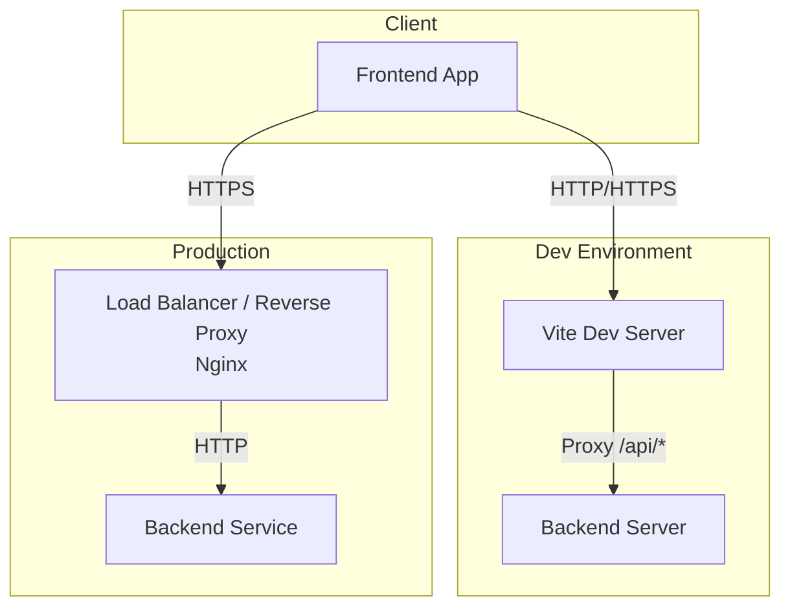
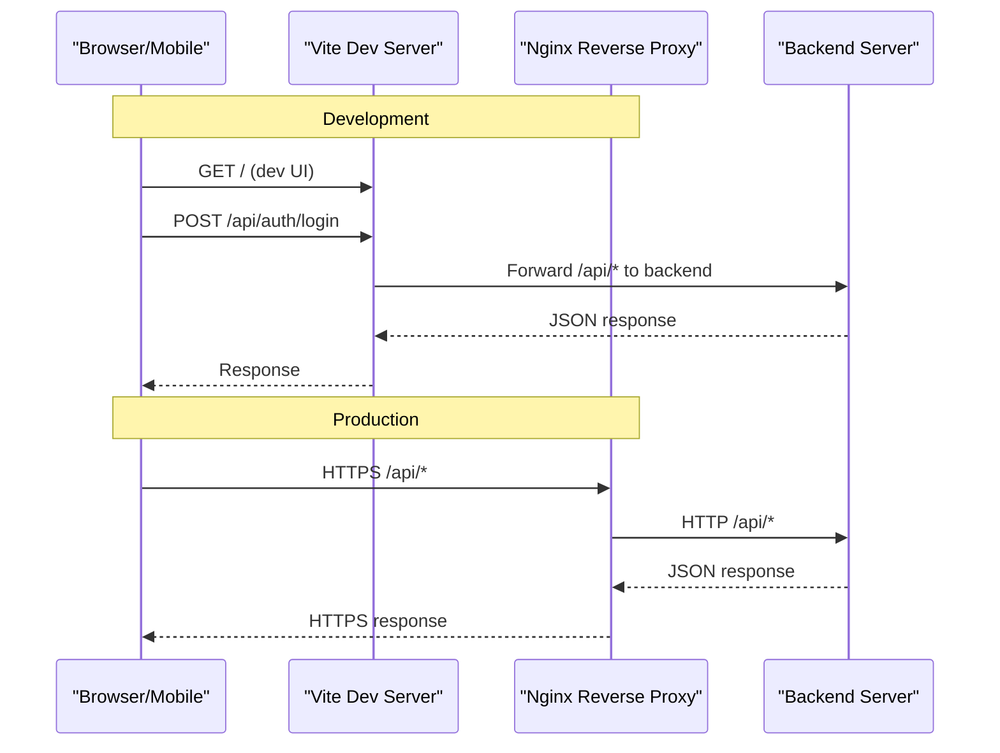
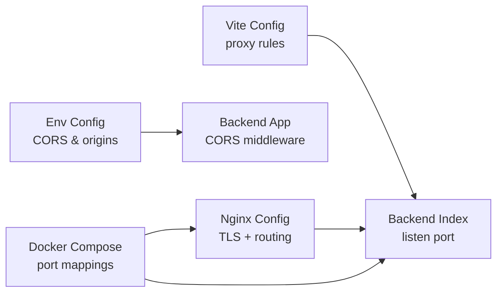

# Network Connectivity Issues

<cite>
**Referenced Files in This Document**
- [backend/src/app.ts](file://backend/src/app.ts)
- [backend/src/index.ts](file://backend/src/index.ts)
- [backend/src/config/env.config.ts](file://backend/src/config/env.config.ts)
- [docker/nginx.conf](file://docker/nginx.conf)
- [docker/docker-compose.yml](file://docker/docker-compose.yml)
- [frontend/vite.config.ts](file://frontend/vite.config.ts)
- [docs/corrections/CORRECTION-CORS-PORTS.md](file://docs/corrections/CORRECTION-CORS-PORTS.md)
- [docs/corrections/CORRECTION-PROXY-VITE-ECONNREFUSED.md](file://docs/corrections/CORRECTION-PROXY-VITE-ECONNREFUSED.md)
- [docs/guides/GUIDE-ACCES-RESEAU-LOCAL.md](file://docs/guides/GUIDE-ACCES-RESEAU-LOCAL.md)
- [scripts/verify-ports.sh](file://scripts/verify-ports.sh)
</cite>

## Table of Contents
1. [Introduction](#introduction)
2. [Project Structure](#project-structure)
3. [Core Components](#core-components)
4. [Architecture Overview](#architecture-overview)
5. [Detailed Component Analysis](#detailed-component-analysis)
6. [Dependency Analysis](#dependency-analysis)
7. [Performance Considerations](#performance-considerations)
8. [Troubleshooting Guide](#troubleshooting-guide)
9. [Conclusion](#conclusion)
10. [Appendices](#appendices)

## Introduction
This document provides a comprehensive guide to diagnosing and resolving network connectivity issues in eLISAschool, focusing on:
- CORS configuration errors
- Proxy setup problems (development and production)
- API endpoint accessibility issues
- Port conflicts and firewall restrictions
- DNS resolution failures
- Mobile device connectivity, VPN interference, and corporate network restrictions
- SSL/TLS certificate issues and HTTPS redirect problems
- Load balancer configuration troubleshooting
- Network diagnostic tools usage and packet capture techniques

It maps symptoms to concrete fixes using repository configuration files and deployment artifacts.

## Project Structure
The networking stack spans the backend server, reverse proxy (Nginx), Docker Compose orchestration, and the frontend development proxy. Key areas include:
- Backend application entry points and environment configuration
- Nginx reverse proxy for TLS termination and routing
- Docker Compose service definitions and port mappings
- Frontend Vite dev server proxy configuration

[No sources needed since this diagram shows conceptual workflow, not actual code structure]

## Core Components
- Backend HTTP server initialization and environment-driven settings
- Nginx reverse proxy configuration for TLS and routing
- Docker Compose service definitions and exposed ports
- Frontend Vite development proxy rules

These components collectively determine how clients reach APIs, how cross-origin requests are handled, and how traffic is routed and secured.

**Section sources**
- [backend/src/app.ts](file://backend/src/app.ts)
- [backend/src/index.ts](file://backend/src/index.ts)
- [backend/src/config/env.config.ts](file://backend/src/config/env.config.ts)
- [docker/nginx.conf](file://docker/nginx.conf)
- [docker/docker-compose.yml](file://docker/docker-compose.yml)
- [frontend/vite.config.ts](file://frontend/vite.config.ts)

## Architecture Overview
End-to-end request flow across environments:

**Diagram sources**
- [docker/nginx.conf](file://docker/nginx.conf)
- [frontend/vite.config.ts](file://frontend/vite.config.ts)
- [backend/src/index.ts](file://backend/src/index.ts)

## Detailed Component Analysis

### CORS Configuration Errors
Symptoms:
- Browser console messages indicating CORS policy blocked
- Preflight OPTIONS requests failing
- Cross-origin headers missing or mismatched

Common causes:
- Missing or incorrect allowed origins
- Strict origin matching without supporting multiple domains
- Development vs production mismatches between frontend URL and backend CORS settings

Resolution steps:
- Ensure the backend CORS configuration includes all required origins (localhost, staging, production domains).
- Validate that credentials mode is consistent with cookie-based sessions if used.
- Confirm that preflight responses include necessary headers.

Configuration references:
- Backend app initialization where CORS may be configured
- Environment variables controlling allowed origins and security policies

**Section sources**
- [backend/src/app.ts](file://backend/src/app.ts)
- [backend/src/config/env.config.ts](file://backend/src/config/env.config.ts)
- [docs/corrections/CORRECTION-CORS-PORTS.md](file://docs/corrections/CORRECTION-CORS-PORTS.md)

### Proxy Setup Problems (Development)
Symptoms:
- ECONNREFUSED when calling API endpoints from the frontend dev server
- Requests hitting wrong ports or paths
- Mixed content warnings due to protocol mismatches

Common causes:
- Incorrect proxy target in Vite configuration
- Backend not running on expected host/port
- Relative path handling differences in dev vs prod

Resolution steps:
- Verify Vite proxy target matches backend listen address and port
- Ensure the backend is reachable from the same machine running the dev server
- Use absolute URLs for API calls during development to avoid ambiguity

Configuration references:
- Vite proxy configuration for forwarding API routes
- Backend listen port configuration

**Section sources**
- [frontend/vite.config.ts](file://frontend/vite.config.ts)
- [backend/src/index.ts](file://backend/src/index.ts)
- [docs/corrections/CORRECTION-PROXY-VITE-ECONNREFUSED.md](file://docs/corrections/CORRECTION-PROXY-VITE-ECONNREFUSED.md)

### API Endpoint Accessibility Issues
Symptoms:
- Network request failed errors in browser or mobile apps
- 404/502/503 responses via reverse proxy
- Intermittent timeouts under load

Common causes:
- Misrouted paths at the reverse proxy layer
- Backend service down or misconfigured
- Health checks failing due to dependency outages

Resolution steps:
- Check reverse proxy logs for upstream errors
- Validate backend health endpoints
- Inspect Docker Compose service status and container logs

Configuration references:
- Nginx location blocks and upstream definitions
- Docker Compose service dependencies and restart policies

**Section sources**
- [docker/nginx.conf](file://docker/nginx.conf)
- [docker/docker-compose.yml](file://docker/docker-compose.yml)

### Port Conflicts and Firewall Restrictions
Symptoms:
- Services fail to start due to port already in use
- Connection refused errors from external clients
- Inconsistent behavior across machines

Common causes:
- Multiple instances binding to the same port
- Host firewalls blocking inbound traffic
- Container port mapping conflicts

Resolution steps:
- Identify processes using conflicting ports
- Adjust service ports or stop conflicting services
- Open required ports in host and cloud firewalls
- Validate Docker port mappings

Diagnostics:
- Use provided scripts to verify ports and availability

**Section sources**
- [scripts/verify-ports.sh](file://scripts/verify-ports.sh)
- [docker/docker-compose.yml](file://docker/docker-compose.yml)

### DNS Resolution Failures
Symptoms:
- ERR_NAME_NOT_RESOLVED or similar DNS errors
- Intermittent connectivity depending on resolver
- Localhost vs hostname inconsistencies

Common causes:
- Missing or incorrect DNS entries
- Corporate DNS policies blocking internal names
- Hosts file overrides

Resolution steps:
- Add correct A records for domain names
- Configure local hosts file for development
- Test with dig/nslookup to validate resolution

**Section sources**
- [docs/corrections/CORRECTION-ERR-NAME-NOT-RESOLVED.md](file://docs/corrections/CORRECTION-ERR-NAME-NOT-RESOLVED.md)

### Mobile Device Connectivity Problems
Symptoms:
- Apps cannot reach backend on local networks
- Timeouts when switching Wi-Fi/mobile data
- Mixed content errors when accessing HTTP from HTTPS pages

Common causes:
- Devices on different subnets unable to reach localhost
- iOS/Android strict mixed content enforcement
- NAT/firewall rules blocking access

Resolution steps:
- Use device’s LAN IP instead of localhost
- Serve over HTTPS locally for testing or configure trusted certificates
- Ensure backend binds to 0.0.0.0 for containerized setups

**Section sources**
- [docs/guides/GUIDE-ACCES-RESEAU-LOCAL.md](file://docs/guides/GUIDE-ACCES-RESEAU-LOCAL.md)

### VPN Interference and Corporate Network Restrictions
Symptoms:
- Random timeouts or connection resets
- Split tunneling causing inconsistent routing
- Blocked ports by corporate firewall

Common causes:
- VPN routing overrides
- Corporate proxies intercepting traffic
- Restricted outbound ports

Resolution steps:
- Temporarily disable VPN to isolate issues
- Configure corporate proxy exceptions for development domains
- Use standard ports (80/443) when possible

**Section sources**
- [docs/guides/GUIDE-ACCES-RESEAU-LOCAL.md](file://docs/guides/GUIDE-ACCES-RESEAU-LOCAL.md)

### SSL/TLS Certificate Issues and HTTPS Redirect Problems
Symptoms:
- Certificate errors in browsers
- Infinite redirects between HTTP and HTTPS
- HSTS preventing fallback to HTTP

Common causes:
- Expired or self-signed certificates not trusted
- Misconfigured redirect rules in reverse proxy
- Incorrect SNI or virtual host configuration

Resolution steps:
- Install valid certificates and ensure chain completeness
- Review Nginx redirect rules and ensure they match client expectations
- Clear browser cache/HSTS for testing

**Section sources**
- [docker/nginx.conf](file://docker/nginx.conf)

### Load Balancer Configuration Troubleshooting
Symptoms:
- Uneven distribution of requests
- Stale connections after backend restarts
- Health check failures leading to node removal

Common causes:
- Incorrect keepalive settings
- Health check endpoints not implemented or misrouted
- Sticky sessions unexpectedly enabled

Resolution steps:
- Implement robust health check endpoints
- Tune keepalive and timeout values
- Validate sticky session requirements and configuration

**Section sources**
- [docker/nginx.conf](file://docker/nginx.conf)

## Dependency Analysis
Key relationships among networking components:

**Diagram sources**
- [frontend/vite.config.ts](file://frontend/vite.config.ts)
- [backend/src/index.ts](file://backend/src/index.ts)
- [backend/src/config/env.config.ts](file://backend/src/config/env.config.ts)
- [backend/src/app.ts](file://backend/src/app.ts)
- [docker/nginx.conf](file://docker/nginx.conf)
- [docker/docker-compose.yml](file://docker/docker-compose.yml)

**Section sources**
- [frontend/vite.config.ts](file://frontend/vite.config.ts)
- [backend/src/index.ts](file://backend/src/index.ts)
- [backend/src/config/env.config.ts](file://backend/src/config/env.config.ts)
- [backend/src/app.ts](file://backend/src/app.ts)
- [docker/nginx.conf](file://docker/nginx.conf)
- [docker/docker-compose.yml](file://docker/docker-compose.yml)

## Performance Considerations
- Prefer reverse proxy termination of TLS to offload CPU from backend
- Enable HTTP/2 and appropriate keepalive settings at the proxy layer
- Cache static assets at the edge; route only dynamic API calls to backend
- Monitor upstream response times and adjust timeouts accordingly

[No sources needed since this section provides general guidance]

## Troubleshooting Guide

### Common Error Messages and Fixes
- CORS policy blocked
  - Ensure allowed origins include the requesting frontend URL
  - Validate preflight responses and header allowances
  - Reference: [CORS ports correction](file://docs/corrections/CORRECTION-CORS-PORTS.md)

- ECONNREFUSED
  - Confirm backend is listening on the expected host/port
  - Check Vite proxy target and Docker port mappings
  - Reference: [Vite proxy ECONNREFUSED fix](file://docs/corrections/CORRECTION-PROXY-VITE-ECONNREFUSED.md)

- Network request failed
  - Inspect reverse proxy logs for upstream errors
  - Validate health endpoints and service availability
  - Check firewall and DNS resolution

### Diagnostic Tools Usage
- Verify ports and services
  - Use the provided script to detect conflicts and confirm bindings
  - Reference: [verify-ports.sh](file://scripts/verify-ports.sh)

- DNS validation
  - Use dig/nslookup to confirm name resolution
  - For local development, update hosts file as needed

- Packet capture techniques
  - Capture traffic on the loopback interface for local dev
  - Capture on the relevant NIC for remote devices
  - Filter by port ranges used by backend and proxy

- Reverse proxy inspection
  - Review Nginx error and access logs for upstream failures
  - Validate location blocks and upstream definitions

- Docker service checks
  - Inspect container logs for startup errors
  - Validate service dependencies and restart policies

**Section sources**
- [docs/corrections/CORRECTION-CORS-PORTS.md](file://docs/corrections/CORRECTION-CORS-PORTS.md)
- [docs/corrections/CORRECTION-PROXY-VITE-ECONNREFUSED.md](file://docs/corrections/CORRECTION-PROXY-VITE-ECONNREFUSED.md)
- [scripts/verify-ports.sh](file://scripts/verify-ports.sh)
- [docker/nginx.conf](file://docker/nginx.conf)
- [docker/docker-compose.yml](file://docker/docker-compose.yml)

## Conclusion
Network connectivity issues in eLISAschool typically stem from misaligned CORS settings, incorrect proxy targets, port conflicts, DNS problems, or TLS misconfiguration. By systematically validating each layer—client, dev proxy, reverse proxy, and backend—and leveraging the provided diagnostics and corrections, most issues can be resolved quickly and reliably.

[No sources needed since this section summarizes without analyzing specific files]

## Appendices

### Quick Checks Checklist
- CORS origins include all frontend URLs
- Vite proxy target matches backend listen address
- Backend listens on 0.0.0.0 in containers
- Docker Compose exposes correct ports
- Nginx routes /api/* to backend and terminates TLS
- DNS resolves correctly in all environments
- Firewalls allow inbound/outbound on required ports
- Health endpoints respond successfully

[No sources needed since this section provides general guidance]