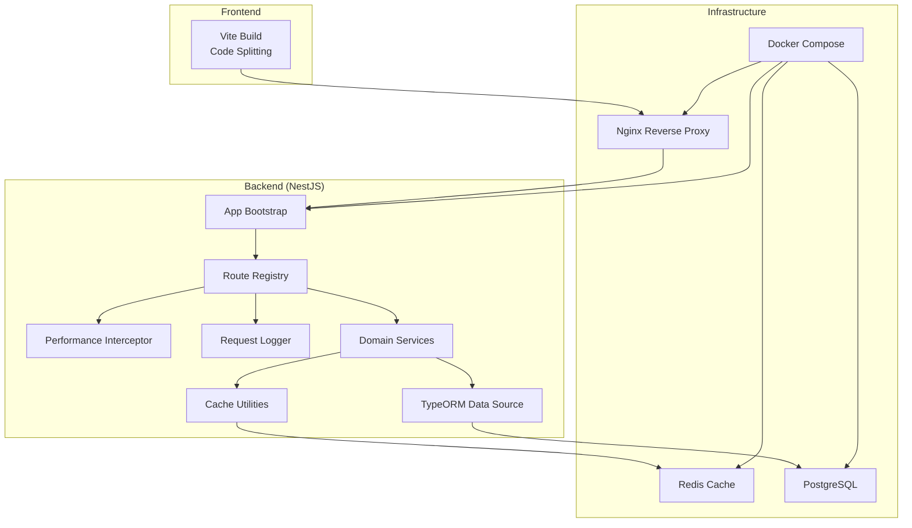
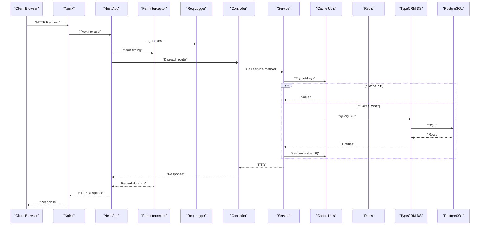
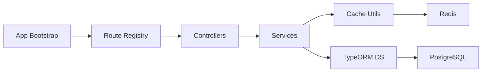

# Performance Bottlenecks

<cite>
**Referenced Files in This Document**
- [backend/src/config/database.config.ts](file://backend/src/config/database.config.ts)
- [backend/src/config/env.config.ts](file://backend/src/config/env.config.ts)
- [backend/src/modules/monitoring/controllers/monitoring.controller.ts](file://backend/src/modules/monitoring/controllers/monitoring.controller.ts)
- [backend/src/modules/monitoring/services/monitoring.service.ts](file://backend/src/modules/monitoring/services/monitoring.service.ts)
- [backend/src/common/interceptors/performance.interceptor.ts](file://backend/src/common/interceptors/performance.interceptor.ts)
- [backend/src/common/middlewares/request-logger.middleware.ts](file://backend/src/common/middlewares/request-logger.middleware.ts)
- [backend/src/common/utils/cache.util.ts](file://backend/src/common/utils/cache.util.ts)
- [backend/src/modules/auth/services/auth.service.ts](file://backend/src/modules/auth/services/auth.service.ts)
- [backend/src/modules/dashboard/services/dashboard.service.ts](file://backend/src/modules/dashboard/services/dashboard.service.ts)
- [backend/src/modules/eleves/services/eleves.service.ts](file://backend/src/modules/eleves/services/eleves.service.ts)
- [backend/src/modules/notes/services/notes.service.ts](file://backend/src/modules/notes/services/notes.service.ts)
- [backend/src/modules/finances/services/finances.service.ts](file://backend/src/modules/finances/services/finances.service.ts)
- [backend/src/modules/notifications/services/notifications.service.ts](file://backend/src/modules/notifications/services/notifications.service.ts)
- [backend/src/modules/sondages/services/sondages.service.ts](file://backend/src/modules/sondages/services/sondages.service.ts)
- [backend/src/modules/emploi-du-temps/services/emploi-du-temps.service.ts](file://backend/src/modules/emploi-du-temps/services/emploi-du-temps.service.ts)
- [backend/src/modules/gamification/services/gamification.service.ts](file://backend/src/modules/gamification/services/gamification.service.ts)
- [backend/src/modules/suivi-eleves/services/suivi-eleves.service.ts](file://backend/src/modules/suivi-eleves/services/suivi-eleves.service.ts)
- [backend/src/modules/suivi-personnel/services/suivi-personnel.service.ts](file://backend/src/modules/suivi-personnel/services/suivi-personnel.service.ts)
- [backend/src/modules/paie/services/paie.service.ts](file://backend/src/modules/paie/services/paie.service.ts)
- [backend/src/modules/recrutement/services/recrutement.service.ts](file://backend/src/modules/recrutement/services/recrutement.service.ts)
- [backend/src/modules/transport/services/transport.service.ts](file://backend/src/modules/transport/services/transport.service.ts)
- [backend/src/modules/cantine/services/cantine.service.ts](file://backend/src/modules/cantine/services/cantine.service.ts)
- [backend/src/modules/bulletins/services/bulletins.service.ts](file://backend/src/modules/bulletins/services/bulletins.service.ts)
- [backend/src/modules/apparence/services/apparence.service.ts](file://backend/src/modules/apparence/services/apparence.service.ts)
- [backend/src/modules/configuration/services/configuration.service.ts](file://backend/src/modules/configuration/services/configuration.service.ts)
- [backend/src/modules/options/services/options.service.ts](file://backend/src/modules/options/services/options.service.ts)
- [backend/src/modules/types-enum/services/types-enum.service.ts](file://backend/src/modules/types-enum/services/types-enum.service.ts)
- [backend/src/modules/organisation/services/organisation.service.ts](file://backend/src/modules/organisation/services/organisation.service.ts)
- [backend/src/modules/etablissement/services/etablissement.service.ts](file://backend/src/modules/etablissement/services/etablissement.service.ts)
- [backend/src/modules/utilisateurs/services/utilisateurs.service.ts](file://backend/src/modules/utilisateurs/services/utilisateurs.service.ts)
- [backend/src/modules/rbac/services/rbac.service.ts](file://backend/src/modules/rbac/services/rbac.service.ts)
- [backend/src/modules/audit/services/audit.service.ts](file://backend/src/modules/audit/services/audit.service.ts)
- [backend/src/modules/annces-scolaires/services/annees-scolaires.service.ts](file://backend/src/modules/annees-scolaires/services/annees-scolaires.service.ts)
- [backend/src/modules/classes/services/classes.service.ts](file://backend/src/modules/classes/services/classes.service.ts)
- [backend/src/modules/cycles/services/cycles.service.ts](file://backend/src/modules/cycles/services/cycles.service.ts)
- [backend/src/modules/fonctions/services/fonctions.service.ts](file://backend/src/modules/fonctions/services/fonctions.service.ts)
- [backend/src/modules/matieres/services/matieres.service.ts](file://backend/src/modules/matieres/services/matieres.service.ts)
- [backend/src/modules/niveaux/services/niveaux.service.ts](file://backend/src/modules/niveaux/services/niveaux.service.ts)
- [backend/src/modules/periodes/services/periodes.service.ts](file://backend/src/modules/periodes/services/periodes.service.ts)
- [backend/src/modules/postes/services/postes.service.ts](file://backend/src/modules/postes/services/postes.service.ts)
- [backend/src/modules/programmes/services/programmes.service.ts](file://backend/src/modules/programmes/services/programmes.service.ts)
- [backend/src/modules/requetes/services/requetes.service.ts](file://backend/src/modules/requetes/services/requetes.service.ts)
- [backend/src/modules/responsables-eleves/services/responsables-eleves.service.ts](file://backend/src/modules/responsables-eleves/services/responsables-eleves.service.ts)
- [backend/src/modules/salles/services/salles.service.ts](file://backend/src/modules/salles/services/salles.service.ts)
- [backend/src/modules/sante/services/sante.service.ts](file://backend/src/modules/sante/services/sante.service.ts)
- [backend/src/modules/scoring/services/scoring.service.ts](file://backend/src/modules/scoring/services/scoring.service.ts)
- [backend/src/modules/specialites/services/specialites.service.ts](file://backend/src/modules/specialites/services/specialites.service.ts)
- [backend/src/modules/validation-workflow/services/validation-workflow.service.ts](file://backend/src/modules/validation-workflow/services/validation-workflow.service.ts)
- [backend/src/modules/groupes-etablissements/services/groupes-etablissements.service.ts](file://backend/src/modules/groupes-etablissements/services/groupes-etablissements.service.ts)
- [backend/src/modules/impressions/services/impressions.service.ts](file://backend/src/modules/impressions/services/impressions.service.ts)
- [backend/src/modules/materiel/services/materiel.service.ts](file://backend/src/modules/materiel/services/materiel.service.ts)
- [backend/src/modules/examens-nationaux/services/examens-nationaux.service.ts](file://backend/src/modules/examens-nationaux/services/examens-nationaux.service.ts)
- [backend/src/modules/diplomes-eleves/services/diplomes-eleves.service.ts](file://backend/src/modules/diplomes-eleves/services/diplomes-eleves.service.ts)
- [backend/src/modules/cartes/services/cartes.service.ts](file://backend/src/modules/cartes/services/cartes.service.ts)
- [backend/src/modules/annonces/services/annonces.service.ts](file://backend/src/modules/annonces/services/annonces.service.ts)
- [backend/src/modules/personnel/services/personnel.service.ts](file://backend/src/modules/personnel/services/personnel.service.ts)
- [backend/src/modules/evaluation/services/evaluation.service.ts](file://backend/src/modules/evaluation/services/evaluation.service.ts)
- [backend/src/modules/competences/services/competences.service.ts](file://backend/src/modules/competences/services/competences.service.ts)
- [backend/src/modules/emploi-du-temps/controllers/emploi-du-temps.controller.ts](file://backend/src/modules/emploi-du-temps/controllers/emploi-du-temps.controller.ts)
- [backend/src/modules/notes/controllers/notes.controller.ts](file://backend/src/modules/notes/controllers/notes.controller.ts)
- [backend/src/modules/finances/controllers/finances.controller.ts](file://backend/src/modules/finances/controllers/finances.controller.ts)
- [backend/src/modules/eleves/controllers/eleves.controller.ts](file://backend/src/modules/eleves/controllers/eleves.controller.ts)
- [backend/src/modules/dashboard/controllers/dashboard.controller.ts](file://backend/src/modules/dashboard/controllers/dashboard.controller.ts)
- [backend/src/modules/auth/controllers/auth.controller.ts](file://backend/src/modules/auth/controllers/auth.controller.ts)
- [backend/src/modules/sondages/controllers/sondages.controller.ts](file://backend/src/modules/sondages/controllers/sondages.controller.ts)
- [backend/src/modules/notifications/controllers/notifications.controller.ts](file://backend/src/modules/notifications/controllers/notifications.controller.ts)
- [backend/src/modules/gamification/controllers/gamification.controller.ts](file://backend/src/modules/gamification/controllers/gamification.controller.ts)
- [backend/src/modules/suivi-eleves/controllers/suivi-eleves.controller.ts](file://backend/src/modules/suivi-eleves/controllers/suivi-eleves.controller.ts)
- [backend/src/modules/suivi-personnel/controllers/suivi-personnel.controller.ts](file://backend/src/modules/suivi-personnel/controllers/suivi-personnel.controller.ts)
- [backend/src/modules/paie/controllers/paie.controller.ts](file://backend/src/modules/paie/controllers/paie.controller.ts)
- [backend/src/modules/recrutement/controllers/recrutement.controller.ts](file://backend/src/modules/recrutement/controllers/recrutement.controller.ts)
- [backend/src/modules/transport/controllers/transport.controller.ts](file://backend/src/modules/transport/controllers/transport.controller.ts)
- [backend/src/modules/cantine/controllers/cantine.controller.ts](file://backend/src/modules/cantine/controllers/cantine.controller.ts)
- [backend/src/modules/bulletins/controllers/bulletins.controller.ts](file://backend/src/modules/bulletins/controllers/bulletins.controller.ts)
- [backend/src/modules/apparence/controllers/apparence.controller.ts](file://backend/src/modules/apparence/controllers/apparence.controller.ts)
- [backend/src/modules/configuration/controllers/configuration.controller.ts](file://backend/src/modules/configuration/controllers/configuration.controller.ts)
- [backend/src/modules/options/controllers/options.controller.ts](file://backend/src/modules/options/controllers/options.controller.ts)
- [backend/src/modules/types-enum/controllers/types-enum.controller.ts](file://backend/src/modules/types-enum/controllers/types-enum.controller.ts)
- [backend/src/modules/organisation/controllers/organisation.controller.ts](file://backend/src/modules/organisation/controllers/organisation.controller.ts)
- [backend/src/modules/etablissement/controllers/etablissement.controller.ts](file://backend/src/modules/etablissement/controllers/etablissement.controller.ts)
- [backend/src/modules/utilisateurs/controllers/utilisateurs.controller.ts](file://backend/src/modules/utilisateurs/controllers/utilisateurs.controller.ts)
- [backend/src/modules/rbac/controllers/rbac.controller.ts](file://backend/src/modules/rbac/controllers/rbac.controller.ts)
- [backend/src/modules/audit/controllers/audit.controller.ts](file://backend/src/modules/audit/controllers/audit.controller.ts)
- [backend/src/modules/annees-scolaires/controllers/annees-scolaires.controller.ts](file://backend/src/modules/annees-scolaires/controllers/annees-scolaires.controller.ts)
- [backend/src/modules/classes/controllers/classes.controller.ts](file://backend/src/modules/classes/controllers/classes.controller.ts)
- [backend/src/modules/cycles/controllers/cycles.controller.ts](file://backend/src/modules/cycles/controllers/cycles.controller.ts)
- [backend/src/modules/fonctions/controllers/fonctions.controller.ts](file://backend/src/modules/fonctions/controllers/fonctions.controller.ts)
- [backend/src/modules/matieres/controllers/matieres.controller.ts](file://backend/src/modules/matieres/controllers/matieres.controller.ts)
- [backend/src/modules/niveaux/controllers/niveaux.controller.ts](file://backend/src/modules/niveaux/controllers/niveaux.controller.ts)
- [backend/src/modules/periodes/controllers/periodes.controller.ts](file://backend/src/modules/periodes/controllers/periodes.controller.ts)
- [backend/src/modules/postes/controllers/postes.controller.ts](file://backend/src/modules/postes/controllers/postes.controller.ts)
- [backend/src/modules/programmes/controllers/programmes.controller.ts](file://backend/src/modules/programmes/controllers/programmes.controller.ts)
- [backend/src/modules/requetes/controllers/requetes.controller.ts](file://backend/src/modules/requetes/controllers/requetes.controller.ts)
- [backend/src/modules/responsables-eleves/controllers/responsables-eleves.controller.ts](file://backend/src/modules/responsables-eleves/controllers/responsables-eleves.controller.ts)
- [backend/src/modules/salles/controllers/salles.controller.ts](file://backend/src/modules/salles/controllers/salles.controller.ts)
- [backend/src/modules/sante/controllers/sante.controller.ts](file://backend/src/modules/sante/controllers/sante.controller.ts)
- [backend/src/modules/scoring/controllers/scoring.controller.ts](file://backend/src/modules/scoring/controllers/scoring.controller.ts)
- [backend/src/modules/specialites/controllers/specialites.controller.ts](file://backend/src/modules/specialites/controllers/specialites.controller.ts)
- [backend/src/modules/validation-workflow/controllers/validation-workflow.controller.ts](file://backend/src/modules/validation-workflow/controllers/validation-workflow.controller.ts)
- [backend/src/modules/groupes-etablissements/controllers/groupes-etablissements.controller.ts](file://backend/src/modules/groupes-etablissements/controllers/groupes-etablissements.controller.ts)
- [backend/src/modules/impressions/controllers/impressions.controller.ts](file://backend/src/modules/impressions/controllers/impressions.controller.ts)
- [backend/src/modules/materiel/controllers/materiel.controller.ts](file://backend/src/modules/materiel/controllers/materiel.controller.ts)
- [backend/src/modules/examens-nationaux/controllers/examens-nationaux.controller.ts](file://backend/src/modules/examens-nationaux/controllers/examens-nationaux.controller.ts)
- [backend/src/modules/diplomes-eleves/controllers/diplomes-eleves.controller.ts](file://backend/src/modules/diplomes-eleves/controllers/diplomes-eleves.controller.ts)
- [backend/src/modules/cartes/controllers/cartes.controller.ts](file://backend/src/modules/cartes/controllers/cartes.controller.ts)
- [backend/src/modules/annonces/controllers/annonces.controller.ts](file://backend/src/modules/annonces/controllers/annonces.controller.ts)
- [backend/src/modules/personnel/controllers/personnel.controller.ts](file://backend/src/modules/personnel/controllers/personnel.controller.ts)
- [backend/src/modules/evaluation/controllers/evaluation.controller.ts](file://backend/src/modules/evaluation/controllers/evaluation.controller.ts)
- [backend/src/modules/competences/controllers/competences.controller.ts](file://backend/src/modules/competences/controllers/competences.controller.ts)
- [backend/src/routes/route-registry.ts](file://backend/src/routes/route-registry.ts)
- [backend/src/app.ts](file://backend/src/app.ts)
- [backend/src/index.ts](file://backend/src/index.ts)
- [backend/package.json](file://backend/package.json)
- [frontend/vite.config.ts](file://frontend/vite.config.ts)
- [frontend/src/App.tsx](file://frontend/src/App.tsx)
- [frontend/src/main.tsx](file://frontend/src/main.tsx)
- [docker/docker-compose.yml](file://docker/docker-compose.yml)
- [docker/Dockerfile.backend](file://docker/Dockerfile.backend)
- [docker/nginx.conf](file://docker/nginx.conf)
- [scripts/deploy-optimisations-performance-v3.1.sh](file://scripts/deploy-optimisations-performance-v3.1.sh)
- [scripts/test-redis.sh](file://scripts/test-redis.sh)
- [scripts/run-indexes.sh](file://scripts/run-indexes.sh)
- [scripts/load-test-pagination.ts](file://scripts/load-test-pagination.ts)
- [backend/scripts/analyze-indexes.ts](file://backend/scripts/analyze-indexes.ts)
- [backend/scripts/run-migration.ts](file://backend/scripts/run-migration.ts)
- [backend/database/data-source.ts](file://backend/database/data-source.ts)
- [backend/database/fix-index.ts](file://backend/database/fix-index.ts)
- [backend/database/migrations/009-performance-indexes.sql](file://backend/database/migrations/009-performance-indexes.sql)
- [backend/database/migrations/042-annonces-performance-optimization.sql](file://backend/database/migrations/042-annonces-performance-optimization.sql)
- [backend/database/migrations/046-organisation-performance-avancee.sql](file://backend/database/migrations/046-organisation-performance-avancee.sql)
- [backend/database/migrations/047-optimisations-performance-v3.1.sql](file://backend/database/migrations/047-optimisations-performance-v3.1.sql)
- [backend/database/migrations/048-notifications-performance-optimizations.sql](file://backend/database/migrations/048-notifications-performance-optimizations.sql)
- [backend/database/migrations/099-add-monitoring-params.sql](file://backend/database/migrations/099-add-monitoring-params.sql)
- [backend/database/migrations/038-index-performance-gamification-suivi.ts](file://backend/database/migrations/038-index-performance-gamification-suivi.ts)
- [backend/database/migrations/050-multi-tenant-v3-max-etablissements.sql](file://backend/database/migrations/050-multi-tenant-v3-max-etablissements.sql)
- [backend/database/migrations/058-multi-tenant-structure-academique.sql](file://backend/database/migrations/058-multi-tenant-structure-academique.sql)
- [backend/database/migrations/088-refactorisation-architecture-academique.sql](file://backend/database/migrations/088-refactorisation-architecture-academique.sql)
- [backend/database/migrations/089-finalisation-architecture-academique-v2.sql](file://backend/database/migrations/089-finalisation-architecture-academique-v2.sql)
- [backend/database/migrations/090-correction-migration-088-camelcase.sql](file://backend/database/migrations/090-correction-migration-088-camelcase.sql)
- [backend/database/migrations/091-peuplement-architecture-academique.sql](file://backend/database/migrations/091-peuplement-architecture-academique.sql)
- [backend/database/migrations/092-refactorisation-classeAnneeId.sql](file://backend/database/migrations/092-refactorisation-classeAnneeId.sql)
- [backend/database/migrations/100-classes-salle-principale.sql](file://backend/database/migrations/100-classes-salle-principale.sql)
- [backend/database/migrations/101-normalisation-annee-scolaire-cloture.sql](file://backend/database/migrations/101-normalisation-annee-scolaire-cloture.sql)
- [backend/database/migrations/102-periodes-hierarchie.sql](file://backend/database/migrations/102-periodes-hierarchie.sql)
- [backend/database/migrations/103-templates-periode-personnalisables.sql](file://backend/database/migrations/103-templates-periode-personnalisables.sql)
- [backend/database/migrations/104-refonte-periodes-niveaux-configurables.sql](file://backend/database/migrations/104-refonte-periodes-niveaux-configurables.sql)
- [backend/database/migrations/105-migration-templates-v5.sql](file://backend/database/migrations/105-migration-templates-v5.sql)
- [backend/database/migrations/106-rename-sequence-to-evaluation.sql](file://backend/database/migrations/106-rename-sequence-to-evaluation.sql)
- [backend/database/migrations/107-cleanup-configuration-modules-actif.sql](file://backend/database/migrations/107-cleanup-configuration-modules-actif.sql)
- [backend/database/migrations/108-refactor-salle-principale.sql](file://backend/database/migrations/108-refactor-salle-principale.sql)
- [backend/database/migrations/044-messagerie-optimisations-v2.1.sql](file://backend/database/migrations/044-messagerie-optimisations-v2.1.sql)
- [backend/database/migrations/045-messagerie-fonctionnalites-avancees-v2.2.sql](file://backend/database/migrations/045-messagerie-fonctionnalites-avancees-v2.2.sql)
- [backend/database/migrations/043-module-messagerie-complete.sql](file://backend/database/migrations/043-module-messagerie-complete.sql)
- [backend/database/migrations/041-module-annonces-complete.sql](file://backend/database/migrations/041-module-annonces-complete.sql)
- [backend/database/migrations/041-module-annonces-fix.sql](file://backend/database/migrations/041-module-annonces-fix.sql)
- [backend/database/migrations/041-module-annonces.sql](file://backend/database/migrations/041-module-annonces.sql)
- [backend/database/migrations/042-sondages-recurrents.sql](file://backend/database/migrations/042-sondages-recurrents.sql)
- [backend/database/migrations/043-correction-dossier-medical-fk.ts](file://backend/database/migrations/043-correction-dossier-medical-fk.ts)
- [backend/database/migrations/043-permissions-critiques-manquantes.sql](file://backend/database/migrations/043-permissions-critiques-manquantes.sql)
- [backend/database/migrations/043-structure-academique-v4.sql](file://backend/database/migrations/043-structure-academique-v4.sql)
- [backend/database/migrations/044-module-organisation.sql](file://backend/database/migrations/044-module-organisation.sql)
- [backend/database/migrations/045-organisation-optimisations.sql](file://backend/database/migrations/045-organisation-optimisations.sql)
- [backend/database/migrations/046-dashboard-config.sql](file://backend/database/migrations/046-dashboard-config.sql)
- [backend/database/migrations/046-preferences-utilisateur-et-config.sql](file://backend/database/migrations/046-preferences-utilisateur-et-config.sql)
- [backend/database/migrations/046-types-contrat-personnalises.sql](file://backend/database/migrations/046-types-contrat-personnalises.sql)
- [backend/database/migrations/047-notifications-ameliorations.sql](file://backend/database/migrations/047-notifications-ameliorations.sql)
- [backend/database/migrations/049-ameliorations-inscription-finances.sql](file://backend/database/migrations/049-ameliorations-inscription-finances.sql)
- [backend/database/migrations/050-ameliorations-inscription-relances.sql](file://backend/database/migrations/050-ameliorations-inscription-relances.sql)
- [backend/database/migrations/050-etablissements-couleurs.sql](file://backend/database/migrations/050-etablissements-couleurs.sql)
- [backend/database/migrations/050-suppression-utilisateur-etablissementId.sql](file://backend/database/migrations/050-suppression-utilisateur-etablissementId.sql)
- [backend/database/migrations/051-champs-preinscription-enrichis.sql](file://backend/database/migrations/051-champs-preinscription-enrichis.sql)
- [backend/database/migrations/052-approche-hybride-parents.sql](file://backend/database/migrations/052-approche-hybride-parents.sql)
- [backend/database/migrations/053-structure-academique-complete.sql](file://backend/database/migrations/053-structure-academique-complete.sql)
- [backend/database/migrations/054-refonte-structure-academique-v2.sql](file://backend/database/migrations/054-refonte-structure-academique-v2.sql)
- [backend/database/migrations/054-structure-academique-complete-fr-en.sql](file://backend/database/migrations/054-structure-academique-complete-fr-en.sql)
- [backend/database/migrations/055-structure-academique-ameliorations.sql](file://backend/database/migrations/055-structure-academique-ameliorations.sql)
- [backend/database/migrations/056-refactor-note-enseignant-membre-personnel.sql](file://backend/database/migrations/056-refactor-note-enseignant-membre-personnel.sql)
- [backend/database/migrations/056-suppression-cycle-scolaire.sql](file://backend/database/migrations/056-suppression-cycle-scolaire.sql)
- [backend/database/migrations/057-supprimer-niveau-filiere-id.sql](file://backend/database/migrations/057-supprimer-niveau-filiere-id.sql)
- [backend/database/migrations/057-supprimer-parametres-dupliques-etablissement.sql](file://backend/database/migrations/057-supprimer-parametres-dupliques-etablissement.sql)
- [backend/database/migrations/059-ajouter-affectation-matiere-sous-systeme.sql](file://backend/database/migrations/059-ajouter-affectation-matiere-sous-systeme.sql)
- [backend/database/migrations/059-multi-tenant-matiere.sql](file://backend/database/migrations/059-multi-tenant-matiere.sql)
- [backend/database/migrations/060-ajouter-affectation-matiere-coefficient.sql](file://backend/database/migrations/060-ajouter-affectation-matiere-coefficient.sql)
- [backend/database/migrations/061-creer-table-bulletins-matieres.sql](file://backend/database/migrations/061-creer-table-bulletins-matieres.sql)
- [backend/database/migrations/062-creer-table-evaluations-competences.sql](file://backend/database/migrations/062-creer-table-evaluations-competences.sql)
- [backend/database/migrations/063-creer-module-emploi-du-temps.sql](file://backend/database/migrations/063-creer-module-emploi-du-temps.sql)
- [backend/database/migrations/064-validateur-sous-systeme.sql](file://backend/database/migrations/064-validateur-sous-systeme.sql)
- [backend/database/migrations/065-creer-templates-emploi-du-temps.sql](file://backend/database/migrations/065-creer-templates-emploi-du-temps.sql)
- [backend/database/migrations/069-fix-super-admin-permissions.sql](file://backend/database/migrations/069-fix-super-admin-permissions.sql)
- [backend/database/migrations/070-fix-super-admin-all-permission.sql](file://backend/database/migrations/070-fix-super-admin-all-permission.sql)
- [backend/database/migrations/070-module-salles.sql](file://backend/database/migrations/070-module-salles.sql)
- [backend/database/migrations/072-scoping-cycles-niveaux.sql](file://backend/database/migrations/072-scoping-cycles-niveaux.sql)
- [backend/database/migrations/073-competence-unique-composite.sql](file://backend/database/migrations/073-competence-unique-composite.sql)
- [backend/database/migrations/074-matiere-niveau-unique-composite.sql](file://backend/database/migrations/074-matiere-niveau-unique-composite.sql)
- [backend/database/migrations/075-module-groupes-etablissements.sql](file://backend/database/migrations/075-module-groupes-etablissements.sql)
- [backend/database/migrations/076-permissions-groupes-etablissements.sql](file://backend/database/migrations/076-permissions-groupes-etablissements.sql)
- [backend/database/migrations/077-update-permissions-groupes.sql](file://backend/database/migrations/077-update-permissions-groupes.sql)
- [backend/database/migrations/078-utilisateur-test-groupes.sql](file://backend/database/migrations/078-utilisateur-test-groupes.sql)
- [backend/database/migrations/079-add-roleId-utilisateur-etablissements.sql](file://backend/database/migrations/079-add-roleId-utilisateur-etablissements.sql)
- [backend/database/migrations/079-correction-permissions-groupes.sql](file://backend/database/migrations/079-correction-permissions-groupes.sql)
- [backend/database/migrations/080-preferences-utilisateur-multi-tenant.sql](file://backend/database/migrations/080-preferences-utilisateur-multi-tenant.sql)
- [backend/database/migrations/081-module-apparence-fonds.sql](file://backend/database/migrations/081-module-apparence-fonds.sql)
- [backend/database/migrations/082-fix-contrainte-unique-preferences.sql](file://backend/database/migrations/082-fix-contrainte-unique-preferences.sql)
- [backend/database/migrations/083-fix-contrainte-unique-parametres.sql](file://backend/database/migrations/083-fix-contrainte-unique-parametres.sql)
- [backend/database/migrations/084-cleanup-classe-id-notes.sql](file://backend/database/migrations/084-cleanup-classe-id-notes.sql)
- [backend/database/migrations/085-periode-etablissement-id.sql](file://backend/database/migrations/085-periode-etablissement-id.sql)
- [backend/database/migrations/086-affectation-matiere-etablissement-id.sql](file://backend/database/migrations/086-affectation-matiere-etablissement-id.sql)
- [backend/database/migrations/087-affectation-matiere-verifications.sql](file://backend/database/migrations/087-affectation-matiere-verifications.sql)
- [backend/database/migrations/099-add-monitoring-params.sql](file://backend/database/migrations/099-add-monitoring-params.sql)
- [backend/database/migrations/100-classes-salle-principale.sql](file://backend/database/migrations/100-classes-salle-principale.sql)
- [backend/database/migrations/101-normalisation-annee-scolaire-cloture.sql](file://backend/database/migrations/101-normalisation-annee-scolaire-cloture.sql)
- [backend/database/migrations/102-periodes-hierarchie.sql](file://backend/database/migrations/102-periodes-hierarchie.sql)
- [backend/database/migrations/103-templates-periode-personnalisables.sql](file://backend/database/migrations/103-templates-periode-personnalisables.sql)
- [backend/database/migrations/104-refonte-periodes-niveaux-configurables.sql](file://backend/database/migrations/104-refonte-periodes-niveaux-configurables.sql)
- [backend/database/migrations/105-migration-templates-v5.sql](file://backend/database/migrations/105-migration-templates-v5.sql)
- [backend/database/migrations/106-rename-sequence-to-evaluation.sql](file://backend/database/migrations/106-rename-sequence-to-evaluation.sql)
- [backend/database/migrations/107-cleanup-configuration-modules-actif.sql](file://backend/database/migrations/107-cleanup-configuration-modules-actif.sql)
- [backend/database/migrations/108-refactor-salle-principale.sql](file://backend/database/migrations/108-refactor-salle-principale.sql)
</cite>

## Table of Contents
1. [Introduction](#introduction)
2. [Project Structure](#project-structure)
3. [Core Components](#core-components)
4. [Architecture Overview](#architecture-overview)
5. [Detailed Component Analysis](#detailed-component-analysis)
6. [Dependency Analysis](#dependency-analysis)
7. [Performance Considerations](#performance-considerations)
8. [Troubleshooting Guide](#troubleshooting-guide)
9. [Conclusion](#conclusion)
10. [Appendices](#appendices)

## Introduction
This document focuses on performance optimization and bottleneck identification for eLISAschool across API response times, database query efficiency, memory usage, caching strategy effectiveness, Redis tuning, indexing problems, profiling with APM tools, load testing, frontend rendering and bundle size optimization, browser memory leaks, monitoring dashboards, alerting, regression detection, scaling strategies, and resource utilization. It synthesizes backend configuration, middleware/interceptors, service-layer patterns, database migrations, Docker/Nginx setup, and frontend build configuration to provide actionable guidance.

## Project Structure
The repository is a full-stack application:
- Backend (NestJS): modules organized by domain, shared interceptors/middlewares for observability, database migrations for schema and indexes, scripts for analysis and load testing.
- Frontend (Vite + React/TanStack): build configuration for code splitting and asset optimization.
- Infrastructure: Docker Compose, Nginx reverse proxy, and deployment scripts.

**Diagram sources**
- [backend/src/app.ts](file://backend/src/app.ts)
- [backend/src/routes/route-registry.ts](file://backend/src/routes/route-registry.ts)
- [backend/src/common/interceptors/performance.interceptor.ts](file://backend/src/common/interceptors/performance.interceptor.ts)
- [backend/src/common/middlewares/request-logger.middleware.ts](file://backend/src/common/middlewares/request-logger.middleware.ts)
- [backend/database/data-source.ts](file://backend/database/data-source.ts)
- [backend/src/common/utils/cache.util.ts](file://backend/src/common/utils/cache.util.ts)
- [docker/docker-compose.yml](file://docker/docker-compose.yml)
- [docker/nginx.conf](file://docker/nginx.conf)

**Section sources**
- [backend/src/app.ts](file://backend/src/app.ts)
- [backend/src/routes/route-registry.ts](file://backend/src/routes/route-registry.ts)
- [backend/src/common/interceptors/performance.interceptor.ts](file://backend/src/common/interceptors/performance.interceptor.ts)
- [backend/src/common/middlewares/request-logger.middleware.ts](file://backend/src/common/middlewares/request-logger.middleware.ts)
- [backend/database/data-source.ts](file://backend/database/data-source.ts)
- [backend/src/common/utils/cache.util.ts](file://backend/src/common/utils/cache.util.ts)
- [docker/docker-compose.yml](file://docker/docker-compose.yml)
- [docker/nginx.conf](file://docker/nginx.conf)

## Core Components
Key components that influence performance:
- Request lifecycle instrumentation:
  - Performance interceptor measures per-request latency and can emit metrics.
  - Request logger middleware captures structured request/response metadata.
- Caching layer:
  - Cache utilities abstract cache operations; typically backed by Redis.
- Database access:
  - TypeORM data source configuration and connection pooling.
  - Indexing migrations for hot paths.
- Monitoring endpoints:
  - Dedicated monitoring controller/service expose health and metrics.

Optimization levers:
- Reduce DB round-trips via proper indexes and query shaping.
- Apply caching at service boundaries for read-heavy endpoints.
- Tune connection pools and timeouts.
- Enable HTTP compression and keep-alives via Nginx.
- Profile critical paths using APM and Prometheus/Grafana.

**Section sources**
- [backend/src/common/interceptors/performance.interceptor.ts](file://backend/src/common/interceptors/performance.interceptor.ts)
- [backend/src/common/middlewares/request-logger.middleware.ts](file://backend/src/common/middlewares/request-logger.middleware.ts)
- [backend/src/common/utils/cache.util.ts](file://backend/src/common/utils/cache.util.ts)
- [backend/database/data-source.ts](file://backend/database/data-source.ts)
- [backend/src/modules/monitoring/controllers/monitoring.controller.ts](file://backend/src/modules/monitoring/controllers/monitoring.controller.ts)
- [backend/src/modules/monitoring/services/monitoring.service.ts](file://backend/src/modules/monitoring/services/monitoring.service.ts)

## Architecture Overview
End-to-end flow from client to DB with performance instrumentation points:

**Diagram sources**
- [backend/src/common/middlewares/request-logger.middleware.ts](file://backend/src/common/middlewares/request-logger.middleware.ts)
- [backend/src/common/interceptors/performance.interceptor.ts](file://backend/src/common/interceptors/performance.interceptor.ts)
- [backend/src/common/utils/cache.util.ts](file://backend/src/common/utils/cache.util.ts)
- [backend/database/data-source.ts](file://backend/database/data-source.ts)
- [docker/nginx.conf](file://docker/nginx.conf)

## Detailed Component Analysis

### API Response Time Instrumentation
- The performance interceptor wraps controller execution to measure elapsed time and can attach timing headers or metrics.
- The request logger middleware records structured logs for requests and responses, enabling correlation and slow-path analysis.

Recommendations:
- Ensure all controllers are covered by the interceptor.
- Emit metrics to Prometheus (counters/histograms) and export to Grafana.
- Add sampling for high-throughput endpoints to reduce overhead.

**Section sources**
- [backend/src/common/interceptors/performance.interceptor.ts](file://backend/src/common/interceptors/performance.interceptor.ts)
- [backend/src/common/middlewares/request-logger.middleware.ts](file://backend/src/common/middlewares/request-logger.middleware.ts)

### Caching Strategy and Redis Tuning
- Cache utilities centralize get/set/delete operations and TTL management.
- Typical pattern: check cache before DB; write-through or write-behind depending on consistency needs.

Tuning checklist:
- Set appropriate TTLs per key type (short-lived for volatile data, longer for reference data).
- Use keys scoped by tenant/module to avoid collisions.
- Monitor Redis memory fragmentation and eviction policies.
- Prefer pipelining and batch operations where possible.

**Section sources**
- [backend/src/common/utils/cache.util.ts](file://backend/src/common/utils/cache.util.ts)

### Database Query Optimization and Indexing
- Multiple migrations add targeted indexes and structural improvements for performance-critical tables.
- Scripts analyze index usage and fix duplicates.

Actionable steps:
- Run index analysis regularly and validate coverage for top queries.
- Avoid over-indexing; monitor write amplification.
- Normalize hot paths into composite indexes when multi-column filters are common.

**Section sources**
- [backend/database/migrations/009-performance-indexes.sql](file://backend/database/migrations/009-performance-indexes.sql)
- [backend/database/migrations/042-annonces-performance-optimization.sql](file://backend/database/migrations/042-annonces-performance-optimization.sql)
- [backend/database/migrations/046-organisation-performance-avancee.sql](file://backend/database/migrations/046-organisation-performance-avancee.sql)
- [backend/database/migrations/047-optimisations-performance-v3.1.sql](file://backend/database/migrations/047-optimisations-performance-v3.1.sql)
- [backend/database/migrations/048-notifications-performance-optimizations.sql](file://backend/database/migrations/048-notifications-performance-optimizations.sql)
- [backend/database/migrations/038-index-performance-gamification-suivi.ts](file://backend/database/migrations/038-index-performance-gamification-suivi.ts)
- [backend/scripts/analyze-indexes.ts](file://backend/scripts/analyze-indexes.ts)
- [backend/database/fix-index.ts](file://backend/database/fix-index.ts)
- [scripts/run-indexes.sh](file://scripts/run-indexes.sh)

### Connection Pooling and Data Source Configuration
- TypeORM data source config controls pool sizes, timeouts, and retry behavior.
- Align pool size with CPU cores and DB capacity; tune max connections at DB level.

**Section sources**
- [backend/database/data-source.ts](file://backend/database/data-source.ts)

### Monitoring Endpoints and Metrics
- Monitoring controller and service expose health and metrics endpoints suitable for scraping.
- Combine with Prometheus/Grafana for dashboards and alerts.

**Section sources**
- [backend/src/modules/monitoring/controllers/monitoring.controller.ts](file://backend/src/modules/monitoring/controllers/monitoring.controller.ts)
- [backend/src/modules/monitoring/services/monitoring.service.ts](file://backend/src/modules/monitoring/services/monitoring.service.ts)

### High-Impact Service Hotspots
These services frequently appear in user-facing flows and should be prioritized for profiling and caching:
- Authentication and authorization: auth, rbac, utilisateurs
- Academic core: classes, cycles, niveaux, matieres, periodes, programmes, emploi-du-temps
- Student tracking: eleves, suivi-eleves, bulletins, notes, scoring, gamification
- Finance and HR: finances, paie, personnel, recrutement
- Operations: organisation, etablissement, options, types-enum, configuration
- Messaging and notifications: messagerie, notifications, sondages
- Facilities: salles, cantine, transport, materiel
- Content and UI: annonces, apparence, cartes, impressions

For each hotspot:
- Identify slow queries and add indexes.
- Introduce cache layers for read-heavy DTOs.
- Paginate large lists and avoid N+1 queries.

**Section sources**
- [backend/src/modules/auth/services/auth.service.ts](file://backend/src/modules/auth/services/auth.service.ts)
- [backend/src/modules/rbac/services/rbac.service.ts](file://backend/src/modules/rbac/services/rbac.service.ts)
- [backend/src/modules/utilisateurs/services/utilisateurs.service.ts](file://backend/src/modules/utilisateurs/services/utilisateurs.service.ts)
- [backend/src/modules/classes/services/classes.service.ts](file://backend/src/modules/classes/services/classes.service.ts)
- [backend/src/modules/cycles/services/cycles.service.ts](file://backend/src/modules/cycles/services/cycles.service.ts)
- [backend/src/modules/niveaux/services/niveaux.service.ts](file://backend/src/modules/niveaux/services/niveaux.service.ts)
- [backend/src/modules/matieres/services/matieres.service.ts](file://backend/src/modules/matieres/services/matieres.service.ts)
- [backend/src/modules/periodes/services/periodes.service.ts](file://backend/src/modules/periodes/services/periodes.service.ts)
- [backend/src/modules/programmes/services/programmes.service.ts](file://backend/src/modules/programmes/services/programmes.service.ts)
- [backend/src/modules/emploi-du-temps/services/emploi-du-temps.service.ts](file://backend/src/modules/emploi-du-temps/services/emploi-du-temps.service.ts)
- [backend/src/modules/eleves/services/eleves.service.ts](file://backend/src/modules/eleves/services/eleves.service.ts)
- [backend/src/modules/suivi-eleves/services/suivi-eleves.service.ts](file://backend/src/modules/suivi-eleves/services/suivi-eleves.service.ts)
- [backend/src/modules/bulletins/services/bulletins.service.ts](file://backend/src/modules/bulletins/services/bulletins.service.ts)
- [backend/src/modules/notes/services/notes.service.ts](file://backend/src/modules/notes/services/notes.service.ts)
- [backend/src/modules/scoring/services/scoring.service.ts](file://backend/src/modules/scoring/services/scoring.service.ts)
- [backend/src/modules/gamification/services/gamification.service.ts](file://backend/src/modules/gamification/services/gamification.service.ts)
- [backend/src/modules/finances/services/finances.service.ts](file://backend/src/modules/finances/services/finances.service.ts)
- [backend/src/modules/paie/services/paie.service.ts](file://backend/src/modules/paie/services/paie.service.ts)
- [backend/src/modules/personnel/services/personnel.service.ts](file://backend/src/modules/personnel/services/personnel.service.ts)
- [backend/src/modules/recrutement/services/recrutement.service.ts](file://backend/src/modules/recrutement/services/recrutement.service.ts)
- [backend/src/modules/organisation/services/organisation.service.ts](file://backend/src/modules/organisation/services/organisation.service.ts)
- [backend/src/modules/etablissement/services/etablissement.service.ts](file://backend/src/modules/etablissement/services/etablissement.service.ts)
- [backend/src/modules/options/services/options.service.ts](file://backend/src/modules/options/services/options.service.ts)
- [backend/src/modules/types-enum/services/types-enum.service.ts](file://backend/src/modules/types-enum/services/types-enum.service.ts)
- [backend/src/modules/configuration/services/configuration.service.ts](file://backend/src/modules/configuration/services/configuration.service.ts)
- [backend/src/modules/notifications/services/notifications.service.ts](file://backend/src/modules/notifications/services/notifications.service.ts)
- [backend/src/modules/sondages/services/sondages.service.ts](file://backend/src/modules/sondages/services/sondages.service.ts)
- [backend/src/modules/salles/services/salles.service.ts](file://backend/src/modules/salles/services/salles.service.ts)
- [backend/src/modules/cantine/services/cantine.service.ts](file://backend/src/modules/cantine/services/cantine.service.ts)
- [backend/src/modules/transport/services/transport.service.ts](file://backend/src/modules/transport/services/transport.service.ts)
- [backend/src/modules/materiel/services/materiel.service.ts](file://backend/src/modules/materiel/services/materiel.service.ts)
- [backend/src/modules/annonces/services/annonces.service.ts](file://backend/src/modules/annonces/services/annonces.service.ts)
- [backend/src/modules/apparence/services/apparence.service.ts](file://backend/src/modules/apparence/services/apparence.service.ts)
- [backend/src/modules/cartes/services/cartes.service.ts](file://backend/src/modules/cartes/services/cartes.service.ts)
- [backend/src/modules/impressions/services/impressions.service.ts](file://backend/src/modules/impressions/services/impressions.service.ts)

### Controller-Level Hotspots
Controllers orchestrate routes and often aggregate multiple services. Focus on:
- Reducing payload sizes
- Enabling pagination
- Applying response caching where safe

Examples include controllers for emploi-du-temps, notes, finances, eleves, dashboard, auth, sondages, notifications, gamification, suivi-eleves, suivi-personnel, paie, recrutement, transport, cantine, bulletins, apparence, configuration, options, types-enum, organisation, etablissement, utilisateurs, rbac, audit, annees-scolaires, classes, cycles, fonctions, matieres, niveaux, periodes, postes, programmes, requetes, responsables-eleves, salles, sante, scoring, specialites, validation-workflow, groupes-etablissements, impressions, materiel, examens-nationaux, diplomes-eleves, cartes, annonces, personnel, evaluation, competences.

**Section sources**
- [backend/src/modules/emploi-du-temps/controllers/emploi-du-temps.controller.ts](file://backend/src/modules/emploi-du-temps/controllers/emploi-du-temps.controller.ts)
- [backend/src/modules/notes/controllers/notes.controller.ts](file://backend/src/modules/notes/controllers/notes.controller.ts)
- [backend/src/modules/finances/controllers/finances.controller.ts](file://backend/src/modules/finances/controllers/finances.controller.ts)
- [backend/src/modules/eleves/controllers/eleves.controller.ts](file://backend/src/modules/eleves/controllers/eleves.controller.ts)
- [backend/src/modules/dashboard/controllers/dashboard.controller.ts](file://backend/src/modules/dashboard/controllers/dashboard.controller.ts)
- [backend/src/modules/auth/controllers/auth.controller.ts](file://backend/src/modules/auth/controllers/auth.controller.ts)
- [backend/src/modules/sondages/controllers/sondages.controller.ts](file://backend/src/modules/sondages/controllers/sondages.controller.ts)
- [backend/src/modules/notifications/controllers/notifications.controller.ts](file://backend/src/modules/notifications/controllers/notifications.controller.ts)
- [backend/src/modules/gamification/controllers/gamification.controller.ts](file://backend/src/modules/gamification/controllers/gamification.controller.ts)
- [backend/src/modules/suivi-eleves/controllers/suivi-eleves.controller.ts](file://backend/src/modules/suivi-eleves/controllers/suivi-eleves.controller.ts)
- [backend/src/modules/suivi-personnel/controllers/suivi-personnel.controller.ts](file://backend/src/modules/suivi-personnel/controllers/suivi-personnel.controller.ts)
- [backend/src/modules/paie/controllers/paie.controller.ts](file://backend/src/modules/paie/controllers/paie.controller.ts)
- [backend/src/modules/recrutement/controllers/recrutement.controller.ts](file://backend/src/modules/recrutement/controllers/recrutement.controller.ts)
- [backend/src/modules/transport/controllers/transport.controller.ts](file://backend/src/modules/transport/controllers/transport.controller.ts)
- [backend/src/modules/cantine/controllers/cantine.controller.ts](file://backend/src/modules/cantine/controllers/cantine.controller.ts)
- [backend/src/modules/bulletins/controllers/bulletins.controller.ts](file://backend/src/modules/bulletins/controllers/bulletins.controller.ts)
- [backend/src/modules/apparence/controllers/apparence.controller.ts](file://backend/src/modules/apparence/controllers/apparence.controller.ts)
- [backend/src/modules/configuration/controllers/configuration.controller.ts](file://backend/src/modules/configuration/controllers/configuration.controller.ts)
- [backend/src/modules/options/controllers/options.controller.ts](file://backend/src/modules/options/controllers/options.controller.ts)
- [backend/src/modules/types-enum/controllers/types-enum.controller.ts](file://backend/src/modules/types-enum/controllers/types-enum.controller.ts)
- [backend/src/modules/organisation/controllers/organisation.controller.ts](file://backend/src/modules/organisation/controllers/organisation.controller.ts)
- [backend/src/modules/etablissement/controllers/etablissement.controller.ts](file://backend/src/modules/etablissement/controllers/etablissement.controller.ts)
- [backend/src/modules/utilisateurs/controllers/utilisateurs.controller.ts](file://backend/src/modules/utilisateurs/controllers/utilisateurs.controller.ts)
- [backend/src/modules/rbac/controllers/rbac.controller.ts](file://backend/src/modules/rbac/controllers/rbac.controller.ts)
- [backend/src/modules/audit/controllers/audit.controller.ts](file://backend/src/modules/audit/controllers/audit.controller.ts)
- [backend/src/modules/annees-scolaires/controllers/annees-scolaires.controller.ts](file://backend/src/modules/annees-scolaires/controllers/annees-scolaires.controller.ts)
- [backend/src/modules/classes/controllers/classes.controller.ts](file://backend/src/modules/classes/controllers/classes.controller.ts)
- [backend/src/modules/cycles/controllers/cycles.controller.ts](file://backend/src/modules/cycles/controllers/cycles.controller.ts)
- [backend/src/modules/fonctions/controllers/fonctions.controller.ts](file://backend/src/modules/fonctions/controllers/fonctions.controller.ts)
- [backend/src/modules/matieres/controllers/matieres.controller.ts](file://backend/src/modules/matieres/controllers/matieres.controller.ts)
- [backend/src/modules/niveaux/controllers/niveaux.controller.ts](file://backend/src/modules/niveaux/controllers/niveaux.controller.ts)
- [backend/src/modules/periodes/controllers/periodes.controller.ts](file://backend/src/modules/periodes/controllers/periodes.controller.ts)
- [backend/src/modules/postes/controllers/postes.controller.ts](file://backend/src/modules/postes/controllers/postes.controller.ts)
- [backend/src/modules/programmes/controllers/programmes.controller.ts](file://backend/src/modules/programmes/controllers/programmes.controller.ts)
- [backend/src/modules/requetes/controllers/requetes.controller.ts](file://backend/src/modules/requetes/controllers/requetes.controller.ts)
- [backend/src/modules/responsables-eleves/controllers/responsables-eleves.controller.ts](file://backend/src/modules/responsables-eleves/controllers/responsables-eleves.controller.ts)
- [backend/src/modules/salles/controllers/salles.controller.ts](file://backend/src/modules/salles/controllers/salles.controller.ts)
- [backend/src/modules/sante/controllers/sante.controller.ts](file://backend/src/modules/sante/controllers/sante.controller.ts)
- [backend/src/modules/scoring/controllers/scoring.controller.ts](file://backend/src/modules/scoring/controllers/scoring.controller.ts)
- [backend/src/modules/specialites/controllers/specialites.controller.ts](file://backend/src/modules/specialites/controllers/specialites.controller.ts)
- [backend/src/modules/validation-workflow/controllers/validation-workflow.controller.ts](file://backend/src/modules/validation-workflow/controllers/validation-workflow.controller.ts)
- [backend/src/modules/groupes-etablissements/controllers/groupes-etablissements.controller.ts](file://backend/src/modules/groupes-etablissements/controllers/groupes-etablissements.controller.ts)
- [backend/src/modules/impressions/controllers/impressions.controller.ts](file://backend/src/modules/impressions/controllers/impressions.controller.ts)
- [backend/src/modules/materiel/controllers/materiel.controller.ts](file://backend/src/modules/materiel/controllers/materiel.controller.ts)
- [backend/src/modules/examens-nationaux/controllers/examens-nationaux.controller.ts](file://backend/src/modules/examens-nationaux/controllers/examens-nationaux.controller.ts)
- [backend/src/modules/diplomes-eleves/controllers/diplomes-eleves.controller.ts](file://backend/src/modules/diplomes-eleves/controllers/diplomes-eleves.controller.ts)
- [backend/src/modules/cartes/controllers/cartes.controller.ts](file://backend/src/modules/cartes/controllers/cartes.controller.ts)
- [backend/src/modules/annonces/controllers/annonces.controller.ts](file://backend/src/modules/annonces/controllers/annonces.controller.ts)
- [backend/src/modules/personnel/controllers/personnel.controller.ts](file://backend/src/modules/personnel/controllers/personnel.controller.ts)
- [backend/src/modules/evaluation/controllers/evaluation.controller.ts](file://backend/src/modules/evaluation/controllers/evaluation.controller.ts)
- [backend/src/modules/competences/controllers/competences.controller.ts](file://backend/src/modules/competences/controllers/competences.controller.ts)

## Dependency Analysis
High-level dependency relationships among core runtime components:

**Diagram sources**
- [backend/src/app.ts](file://backend/src/app.ts)
- [backend/src/routes/route-registry.ts](file://backend/src/routes/route-registry.ts)
- [backend/src/common/utils/cache.util.ts](file://backend/src/common/utils/cache.util.ts)
- [backend/database/data-source.ts](file://backend/database/data-source.ts)

**Section sources**
- [backend/src/app.ts](file://backend/src/app.ts)
- [backend/src/routes/route-registry.ts](file://backend/src/routes/route-registry.ts)
- [backend/src/common/utils/cache.util.ts](file://backend/src/common/utils/cache.util.ts)
- [backend/database/data-source.ts](file://backend/database/data-source.ts)

## Performance Considerations

### Slow API Response Times
- Use the performance interceptor to capture p50/p95/p99 latencies per endpoint.
- Correlate with request logger logs to identify heavy payloads or nested calls.
- Introduce pagination and field selection to reduce serialization cost.

**Section sources**
- [backend/src/common/interceptors/performance.interceptor.ts](file://backend/src/common/interceptors/performance.interceptor.ts)
- [backend/src/common/middlewares/request-logger.middleware.ts](file://backend/src/common/middlewares/request-logger.middleware.ts)

### Database Query Optimization
- Validate index coverage for top queries using the index analysis script.
- Prefer composite indexes for frequent filter combinations.
- Avoid SELECT *; project only needed columns.

**Section sources**
- [backend/scripts/analyze-indexes.ts](file://backend/scripts/analyze-indexes.ts)
- [backend/database/migrations/009-performance-indexes.sql](file://backend/database/migrations/009-performance-indexes.sql)
- [backend/database/migrations/047-optimisations-performance-v3.1.sql](file://backend/database/migrations/047-optimisations-performance-v3.1.sql)

### Memory Usage Issues
- Watch Node.js heap growth under load; set appropriate --max-old-space-size if containerized.
- Avoid retaining large objects in caches or closures.
- Stream large exports instead of buffering.

[No sources needed since this section provides general guidance]

### Caching Strategy Effectiveness
- Measure cache hit ratio and TTL expiry impact.
- Invalidate aggressively on writes; consider versioned keys for complex aggregates.

**Section sources**
- [backend/src/common/utils/cache.util.ts](file://backend/src/common/utils/cache.util.ts)

### Redis Performance Tuning
- Tune maxmemory and eviction policy (allkeys-lru recommended for caches).
- Use pipeline and Lua scripts for atomic updates.
- Monitor latency and network throughput.

**Section sources**
- [docker/docker-compose.yml](file://docker/docker-compose.yml)
- [scripts/test-redis.sh](file://scripts/test-redis.sh)

### Database Indexing Problems
- Remove duplicate indexes; ensure selective columns are indexed.
- Periodically run VACUUM/ANALYZE and monitor bloat.

**Section sources**
- [backend/database/fix-index.ts](file://backend/database/fix-index.ts)
- [scripts/run-indexes.sh](file://scripts/run-indexes.sh)

### Profiling Techniques Using APM Tools
- Export metrics from monitoring endpoints to Prometheus.
- Visualize in Grafana; add traces if integrating OpenTelemetry.
- Use flame graphs for CPU-bound hotspots.

**Section sources**
- [backend/src/modules/monitoring/controllers/monitoring.controller.ts](file://backend/src/modules/monitoring/controllers/monitoring.controller.ts)
- [backend/src/modules/monitoring/services/monitoring.service.ts](file://backend/src/modules/monitoring/services/monitoring.service.ts)

### Load Testing Procedures
- Use provided pagination load test script to simulate realistic workloads.
- Gradually increase concurrency; track error rates and latency percentiles.

**Section sources**
- [scripts/load-test-pagination.ts](file://scripts/load-test-pagination.ts)

### Frontend Rendering Performance
- Leverage Vite’s code splitting and lazy loading.
- Minimize re-renders; memoize expensive computations.

**Section sources**
- [frontend/vite.config.ts](file://frontend/vite.config.ts)
- [frontend/src/App.tsx](file://frontend/src/App.tsx)
- [frontend/src/main.tsx](file://frontend/src/main.tsx)

### Bundle Size Optimization
- Tree-shake unused dependencies.
- Analyze bundle with build analyzer; split vendor chunks.

**Section sources**
- [frontend/vite.config.ts](file://frontend/vite.config.ts)

### Browser Memory Leaks
- Avoid global references to DOM nodes or large objects.
- Clean up event listeners and timers on unmount.

[No sources needed since this section provides general guidance]

### Monitoring Dashboard Setup and Alerting
- Configure Prometheus scrapes for /metrics endpoints.
- Create Grafana panels for latency, throughput, error rate, DB pool usage, Redis stats.
- Define alerts for p95 latency spikes and error rate thresholds.

**Section sources**
- [backend/src/modules/monitoring/controllers/monitoring.controller.ts](file://backend/src/modules/monitoring/controllers/monitoring.controller.ts)
- [backend/src/modules/monitoring/services/monitoring.service.ts](file://backend/src/modules/monitoring/services/monitoring.service.ts)

### Performance Regression Detection
- Gate CI with baseline latency checks.
- Compare new builds against historical percentiles.

[No sources needed since this section provides general guidance]

### Scaling Strategies for High-Traffic Scenarios
- Horizontal scaling of backend replicas behind Nginx.
- Separate Redis and PostgreSQL instances; tune connection pools.
- Use read replicas for analytics-heavy endpoints.

**Section sources**
- [docker/docker-compose.yml](file://docker/docker-compose.yml)
- [docker/nginx.conf](file://docker/nginx.conf)

### Resource Utilization Optimization
- Right-size containers; set CPU/memory limits.
- Enable HTTP/2 and gzip/br compression at Nginx.

**Section sources**
- [docker/nginx.conf](file://docker/nginx.conf)
- [docker/Dockerfile.backend](file://docker/Dockerfile.backend)

## Troubleshooting Guide

Common issues and diagnostics:
- Slow endpoints:
  - Inspect performance interceptor timings and correlate with request logger entries.
  - Check DB slow query logs and index coverage.
- High memory usage:
  - Capture heap snapshots; look for retained large objects.
  - Review cache TTLs and key cardinality.
- Redis saturation:
  - Verify maxmemory and eviction policy; check latency.
- N+1 queries:
  - Profile service methods; use eager loading or batch queries.

Operational tips:
- Use migration scripts to apply performance-related schema changes safely.
- Validate environment variables for DB and Redis connectivity.

**Section sources**
- [backend/src/common/interceptors/performance.interceptor.ts](file://backend/src/common/interceptors/performance.interceptor.ts)
- [backend/src/common/middlewares/request-logger.middleware.ts](file://backend/src/common/middlewares/request-logger.middleware.ts)
- [backend/database/data-source.ts](file://backend/database/data-source.ts)
- [backend/src/common/utils/cache.util.ts](file://backend/src/common/utils/cache.util.ts)
- [backend/scripts/run-migration.ts](file://backend/scripts/run-migration.ts)
- [backend/src/config/database.config.ts](file://backend/src/config/database.config.ts)
- [backend/src/config/env.config.ts](file://backend/src/config/env.config.ts)

## Conclusion
By instrumenting request lifecycles, optimizing database indexes, applying effective caching, and leveraging APM-driven dashboards, eLISAschool can achieve predictable low-latency performance under load. Continuous load testing and regression gating ensure sustained quality. Frontend optimizations complement backend gains, while scalable infrastructure and careful resource tuning support growth.

## Appendices

### Key Migration References for Performance
- General performance indexes and optimizations:
  - [009-performance-indexes.sql](file://backend/database/migrations/009-performance-indexes.sql)
  - [042-annonces-performance-optimization.sql](file://backend/database/migrations/042-annonces-performance-optimization.sql)
  - [046-organisation-performance-avancee.sql](file://backend/database/migrations/046-organisation-performance-avancee.sql)
  - [047-optimisations-performance-v3.1.sql](file://backend/database/migrations/047-optimisations-performance-v3.1.sql)
  - [048-notifications-performance-optimizations.sql](file://backend/database/migrations/048-notifications-performance-optimizations.sql)
  - [038-index-performance-gamification-suivi.ts](file://backend/database/migrations/038-index-performance-gamification-suivi.ts)
- Multi-tenant and academic structure improvements impacting query paths:
  - [050-multi-tenant-v3-max-etablissements.sql](file://backend/database/migrations/050-multi-tenant-v3-max-etablissements.sql)
  - [058-multi-tenant-structure-academique.sql](file://backend/database/migrations/058-multi-tenant-structure-academique.sql)
  - [088-refactorisation-architecture-academique.sql](file://backend/database/migrations/088-refactorisation-architecture-academique.sql)
  - [089-finalisation-architecture-academique-v2.sql](file://backend/database/migrations/089-finalisation-architecture-academique-v2.sql)
  - [090-correction-migration-088-camelcase.sql](file://backend/database/migrations/090-correction-migration-088-camelcase.sql)
  - [091-peuplement-architecture-academique.sql](file://backend/database/migrations/091-peuplement-architecture-academique.sql)
  - [092-refactorisation-classeAnneeId.sql](file://backend/database/migrations/092-refactorisation-classeAnneeId.sql)
- Additional feature-specific performance and schema refinements:
  - [100-classes-salle-principale.sql](file://backend/database/migrations/100-classes-salle-principale.sql)
  - [101-normalisation-annee-scolaire-cloture.sql](file://backend/database/migrations/101-normalisation-annee-scolaire-cloture.sql)
  - [102-periodes-hierarchie.sql](file://backend/database/migrations/102-periodes-hierarchie.sql)
  - [103-templates-periode-personnalisables.sql](file://backend/database/migrations/103-templates-periode-personnalisables.sql)
  - [104-refonte-periodes-niveaux-configurables.sql](file://backend/database/migrations/104-refonte-periodes-niveaux-configurables.sql)
  - [105-migration-templates-v5.sql](file://backend/database/migrations/105-migration-templates-v5.sql)
  - [106-rename-sequence-to-evaluation.sql](file://backend/database/migrations/106-rename-sequence-to-evaluation.sql)
  - [107-cleanup-configuration-modules-actif.sql](file://backend/database/migrations/107-cleanup-configuration-modules-actif.sql)
  - [108-refactor-salle-principale.sql](file://backend/database/migrations/108-refactor-salle-principale.sql)
- Messaging and announcements:
  - [043-module-messagerie-complete.sql](file://backend/database/migrations/043-module-messagerie-complete.sql)
  - [044-messagerie-optimisations-v2.1.sql](file://backend/database/migrations/044-messagerie-optimisations-v2.1.sql)
  - [045-messagerie-fonctionnalites-avancees-v2.2.sql](file://backend/database/migrations/045-messagerie-fonctionnalites-avancees-v2.2.sql)
  - [041-module-annonces-complete.sql](file://backend/database/migrations/041-module-annonces-complete.sql)
  - [041-module-annonces-fix.sql](file://backend/database/migrations/041-module-annonces-fix.sql)
  - [041-module-annonces.sql](file://backend/database/migrations/041-module-annonces.sql)
  - [042-sondages-recurrents.sql](file://backend/database/migrations/042-sondages-recurrents.sql)

### Deployment and Operational Scripts
- Performance deployment automation:
  - [deploy-optimisations-performance-v3.1.sh](file://scripts/deploy-optimisations-performance-v3.1.sh)
- Redis verification:
  - [test-redis.sh](file://scripts/test-redis.sh)
- Index maintenance:
  - [run-indexes.sh](file://scripts/run-indexes.sh)