# Debugging Workflows & Tools

<cite>
**Referenced Files in This Document**
- [backend/src/app.ts](file://backend/src/app.ts)
- [backend/src/index.ts](file://backend/src/index.ts)
- [backend/src/config/swagger.config.ts](file://backend/src/config/swagger.config.ts)
- [backend/src/common/filters/global-error.filter.ts](file://backend/src/common/filters/global-error.filter.ts)
- [backend/src/common/middlewares/request-logger.middleware.ts](file://backend/src/common/middlewares/request-logger.middleware.ts)
- [backend/src/database/data-source.ts](file://backend/src/database/data-source.ts)
- [backend/nodemon.json](file://backend/nodemon.json)
- [backend/package.json](file://backend/package.json)
- [docker/Dockerfile.backend.dev](file://docker/Dockerfile.backend.dev)
- [frontend/vite.config.ts](file://frontend/vite.config.ts)
- [frontend/src/lib/api-client.ts](file://frontend/src/lib/api-client.ts)
- [frontend/src/hooks/useAuth.ts](file://frontend/src/hooks/useAuth.ts)
- [backend/scripts/run-migration.ts](file://backend/scripts/run-migration.ts)
- [backend/scripts/verify-pagination.sh](file://backend/scripts/verify-pagination.sh)
</cite>

## Table of Contents
1. [Introduction](#introduction)
2. [Project Structure](#project-structure)
3. [Core Components](#core-components)
4. [Architecture Overview](#architecture-overview)
5. [Detailed Component Analysis](#detailed-component-analysis)
6. [Dependency Analysis](#dependency-analysis)
7. [Performance Considerations](#performance-considerations)
8. [Troubleshooting Guide](#troubleshooting-guide)
9. [Conclusion](#conclusion)
10. [Appendices](#appendices)

## Introduction
This document provides a comprehensive guide to debugging workflows and development tools for eLISAschool. It covers:
- Swagger API documentation usage for endpoint testing
- Backend error filter implementation for consistent error handling
- Frontend debugging utilities and React DevTools usage
- Backend debugging strategies (Node.js, database queries, middleware inspection)
- Frontend debugging strategies (React DevTools, network request analysis)
- Testing methodologies, mock data creation, and isolated environment debugging
- Step-by-step troubleshooting guides for common development scenarios and production issue diagnosis

The goal is to help developers quickly diagnose issues across the full stack with clear, actionable steps.

## Project Structure
At a high level, the project includes:
- Backend (NestJS): application bootstrap, configuration, filters, middlewares, database setup, scripts
- Frontend (Vite + React): dev server configuration, API client, authentication hooks
- Docker: development container definitions
- Scripts: migrations, verification, and utility helpers

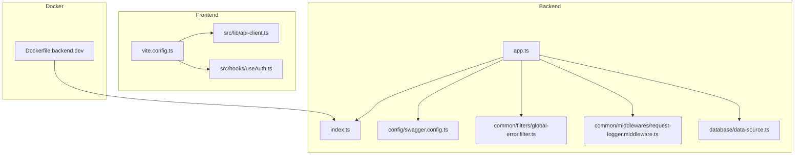

**Diagram sources**
- [backend/src/app.ts](file://backend/src/app.ts)
- [backend/src/index.ts](file://backend/src/index.ts)
- [backend/src/config/swagger.config.ts](file://backend/src/config/swagger.config.ts)
- [backend/src/common/filters/global-error.filter.ts](file://backend/src/common/filters/global-error.filter.ts)
- [backend/src/common/middlewares/request-logger.middleware.ts](file://backend/src/common/middlewares/request-logger.middleware.ts)
- [backend/src/database/data-source.ts](file://backend/src/database/data-source.ts)
- [frontend/vite.config.ts](file://frontend/vite.config.ts)
- [frontend/src/lib/api-client.ts](file://frontend/src/lib/api-client.ts)
- [frontend/src/hooks/useAuth.ts](file://frontend/src/hooks/useAuth.ts)
- [docker/Dockerfile.backend.dev](file://docker/Dockerfile.backend.dev)

**Section sources**
- [backend/src/app.ts](file://backend/src/app.ts)
- [backend/src/index.ts](file://backend/src/index.ts)
- [backend/src/config/swagger.config.ts](file://backend/src/config/swagger.config.ts)
- [backend/src/common/filters/global-error.filter.ts](file://backend/src/common/filters/global-error.filter.ts)
- [backend/src/common/middlewares/request-logger.middleware.ts](file://backend/src/common/middlewares/request-logger.middleware.ts)
- [backend/src/database/data-source.ts](file://backend/src/database/data-source.ts)
- [frontend/vite.config.ts](file://frontend/vite.config.ts)
- [frontend/src/lib/api-client.ts](file://frontend/src/lib/api-client.ts)
- [frontend/src/hooks/useAuth.ts](file://frontend/src/hooks/useAuth.ts)
- [docker/Dockerfile.backend.dev](file://docker/Dockerfile.backend.dev)

## Core Components
- Application bootstrap and entry points:
  - Entry point initializes the NestJS application and registers global components such as filters, interceptors, and middlewares.
  - Swagger configuration exposes interactive API docs for testing endpoints.
- Error handling:
  - Global error filter centralizes exception formatting and response structure.
- Request logging:
  - Middleware logs incoming requests and responses for observability during development.
- Database connectivity:
  - Data source configures TypeORM connection and options used by services and repositories.
- Frontend API client:
  - Centralized HTTP client encapsulates base URL, headers, token injection, and error normalization.
- Authentication hook:
  - Provides authenticated state and helper methods for protected routes and API calls.

**Section sources**
- [backend/src/index.ts](file://backend/src/index.ts)
- [backend/src/app.ts](file://backend/src/app.ts)
- [backend/src/config/swagger.config.ts](file://backend/src/config/swagger.config.ts)
- [backend/src/common/filters/global-error.filter.ts](file://backend/src/common/filters/global-error.filter.ts)
- [backend/src/common/middlewares/request-logger.middleware.ts](file://backend/src/common/middlewares/request-logger.middleware.ts)
- [backend/src/database/data-source.ts](file://backend/src/database/data-source.ts)
- [frontend/src/lib/api-client.ts](file://frontend/src/lib/api-client.ts)
- [frontend/src/hooks/useAuth.ts](file://frontend/src/hooks/useAuth.ts)

## Architecture Overview
The backend exposes a REST API documented via Swagger UI. The frontend consumes the API through a typed client. During development, Node.js debugging, request logging, and database query inspection are essential.

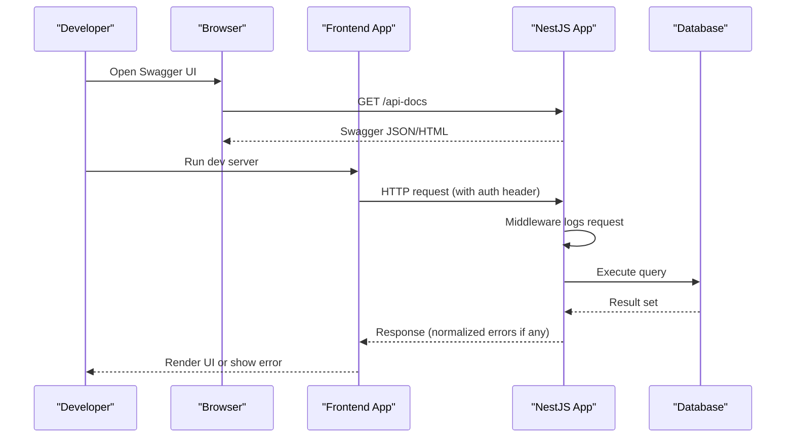

**Diagram sources**
- [backend/src/config/swagger.config.ts](file://backend/src/config/swagger.config.ts)
- [backend/src/common/middlewares/request-logger.middleware.ts](file://backend/src/common/middlewares/request-logger.middleware.ts)
- [backend/src/database/data-source.ts](file://backend/src/database/data-source.ts)
- [frontend/src/lib/api-client.ts](file://frontend/src/lib/api-client.ts)

## Detailed Component Analysis

### Swagger API Documentation
- Purpose: Interactive endpoint discovery and testing without writing code.
- How it works:
  - Swagger module is configured in the app bootstrap.
  - Exposes a route that serves the OpenAPI specification and UI.
- Development workflow:
  - Start the backend.
  - Open the Swagger UI in the browser.
  - Use “Try it out” to test endpoints with sample payloads.
  - Validate status codes, response shapes, and error formats.

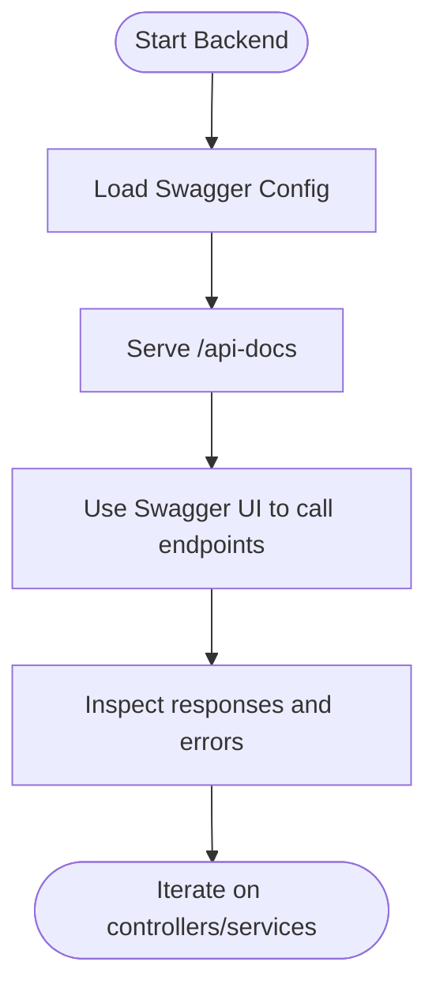

**Diagram sources**
- [backend/src/config/swagger.config.ts](file://backend/src/config/swagger.config.ts)
- [backend/src/app.ts](file://backend/src/app.ts)

**Section sources**
- [backend/src/config/swagger.config.ts](file://backend/src/config/swagger.config.ts)
- [backend/src/app.ts](file://backend/src/app.ts)

### Global Error Filter
- Purpose: Normalize all unhandled exceptions into consistent API error responses.
- Key behaviors:
  - Captures exceptions thrown by controllers, guards, interceptors, and services.
  - Formats error payload with standardized fields (e.g., message, timestamp).
  - Ensures predictable client-side error handling.
- Development tips:
  - Add contextual details inside the filter when needed.
  - Avoid leaking sensitive information in production.

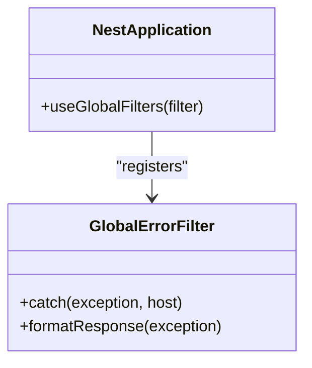

**Diagram sources**
- [backend/src/common/filters/global-error.filter.ts](file://backend/src/common/filters/global-error.filter.ts)
- [backend/src/app.ts](file://backend/src/app.ts)

**Section sources**
- [backend/src/common/filters/global-error.filter.ts](file://backend/src/common/filters/global-error.filter.ts)
- [backend/src/app.ts](file://backend/src/app.ts)

### Request Logger Middleware
- Purpose: Log incoming requests and outgoing responses for debugging and performance analysis.
- Typical fields:
  - Method, path, query parameters, headers (sanitized), status code, duration.
- Usage:
  - Register globally or per-route depending on scope.
  - Adjust log levels and redaction rules for security.

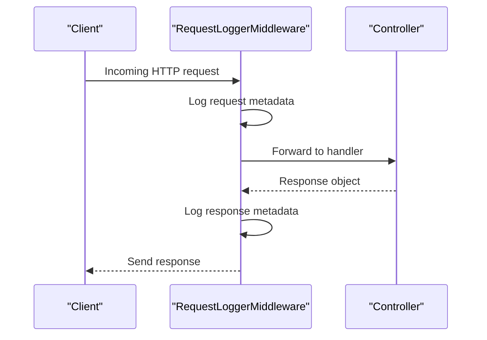

**Diagram sources**
- [backend/src/common/middlewares/request-logger.middleware.ts](file://backend/src/common/middlewares/request-logger.middleware.ts)

**Section sources**
- [backend/src/common/middlewares/request-logger.middleware.ts](file://backend/src/common/middlewares/request-logger.middleware.ts)

### Database Connectivity and Query Inspection
- Purpose: Configure TypeORM connection and enable query logging for diagnostics.
- Key aspects:
  - Connection settings (host, port, credentials, database name).
  - Logging options to capture slow or failing queries.
- Debugging approach:
  - Enable query logging in development.
  - Analyze generated SQL to identify N+1 queries or missing indexes.
  - Use migration scripts to validate schema changes.

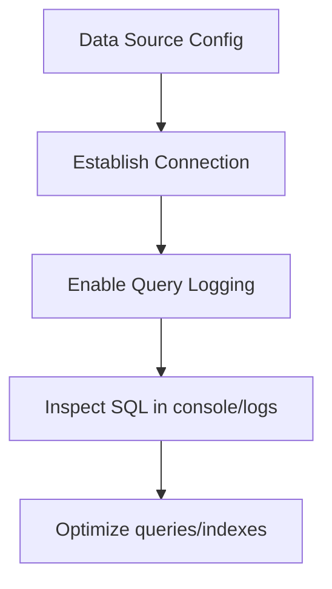

**Diagram sources**
- [backend/src/database/data-source.ts](file://backend/src/database/data-source.ts)

**Section sources**
- [backend/src/database/data-source.ts](file://backend/src/database/data-source.ts)

### Frontend API Client
- Purpose: Centralize HTTP interactions, headers, token management, and error normalization.
- Features:
  - Base URL configuration (dev/proxy).
  - Automatic Authorization header injection from session/token store.
  - Consistent error mapping to user-friendly messages.
- Debugging tips:
  - Inspect requests/responses in browser Network tab.
  - Add temporary logging around fetch/axios calls.
  - Verify CORS and proxy settings in vite config.

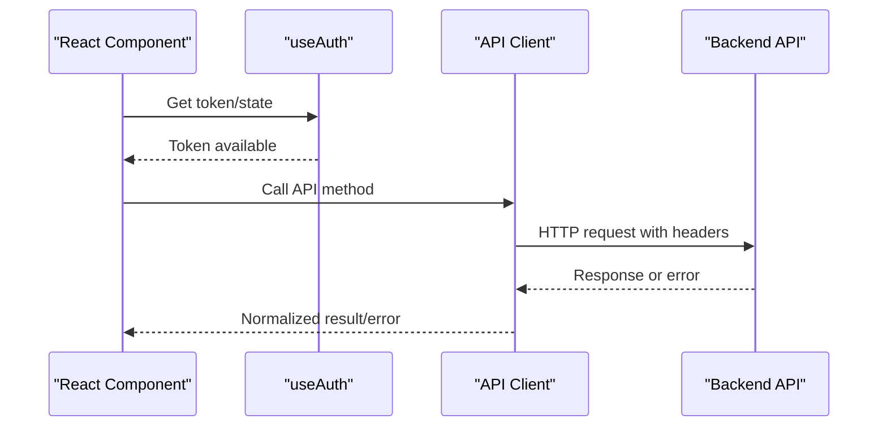

**Diagram sources**
- [frontend/src/lib/api-client.ts](file://frontend/src/lib/api-client.ts)
- [frontend/src/hooks/useAuth.ts](file://frontend/src/hooks/useAuth.ts)

**Section sources**
- [frontend/src/lib/api-client.ts](file://frontend/src/lib/api-client.ts)
- [frontend/src/hooks/useAuth.ts](file://frontend/src/hooks/useAuth.ts)

### Node.js Debugging and Hot Reload
- Local development:
  - Use nodemon for automatic restarts on file changes.
  - Attach VS Code debugger to the running process.
- Docker development:
  - Use the development Dockerfile which enables debugging ports.
- Steps:
  - Start the backend with debug flags.
  - Launch a debug configuration in your IDE.
  - Set breakpoints in controllers, services, and filters.

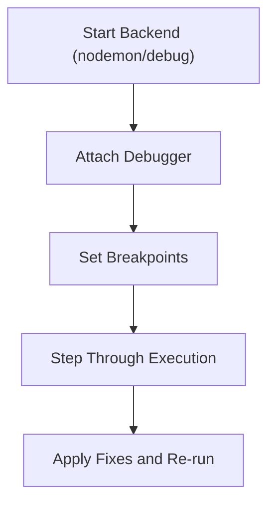

**Diagram sources**
- [backend/nodemon.json](file://backend/nodemon.json)
- [docker/Dockerfile.backend.dev](file://docker/Dockerfile.backend.dev)
- [backend/package.json](file://backend/package.json)

**Section sources**
- [backend/nodemon.json](file://backend/nodemon.json)
- [docker/Dockerfile.backend.dev](file://docker/Dockerfile.backend.dev)
- [backend/package.json](file://backend/package.json)

### Frontend Debugging Utilities
- React DevTools:
  - Inspect component tree, props, state, and Redux/Zustand stores if used.
- Network analysis:
  - Use browser Network tab to inspect request/response payloads, timing, and errors.
- Vite dev server:
  - Check proxy configuration to ensure API calls reach the backend.
- Common pitfalls:
  - CORS misconfiguration.
  - Incorrect base URL or missing Authorization header.

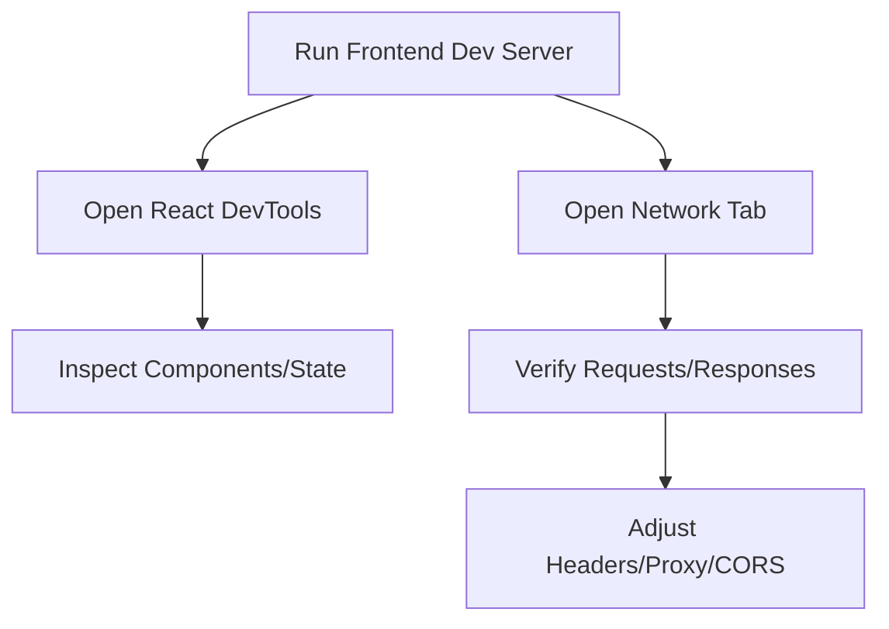

**Diagram sources**
- [frontend/vite.config.ts](file://frontend/vite.config.ts)
- [frontend/src/lib/api-client.ts](file://frontend/src/lib/api-client.ts)

**Section sources**
- [frontend/vite.config.ts](file://frontend/vite.config.ts)
- [frontend/src/lib/api-client.ts](file://frontend/src/lib/api-client.ts)

### Testing Methodologies and Mock Data
- Unit tests:
  - Isolate services and utilities; mock dependencies like database and external APIs.
- Integration tests:
  - Spin up test databases and run migrations before executing tests.
- Seed data:
  - Create deterministic fixtures for complex entities (users, classes, schedules).
- Scripts:
  - Use provided scripts to run migrations and verify features in isolation.

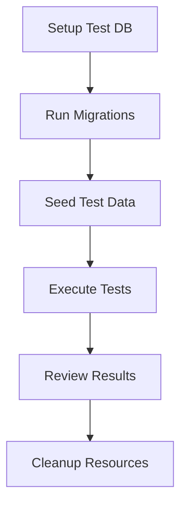

**Diagram sources**
- [backend/scripts/run-migration.ts](file://backend/scripts/run-migration.ts)
- [backend/scripts/verify-pagination.sh](file://backend/scripts/verify-pagination.sh)

**Section sources**
- [backend/scripts/run-migration.ts](file://backend/scripts/run-migration.ts)
- [backend/scripts/verify-pagination.sh](file://backend/scripts/verify-pagination.sh)

## Dependency Analysis
Key runtime dependencies and their roles:
- NestJS application bootstrap depends on:
  - Swagger configuration for API docs
  - Global error filter for consistent error handling
  - Request logger middleware for observability
  - Database data source for persistence
- Frontend depends on:
  - Vite dev server configuration (proxy, port)
  - API client for HTTP communication
  - Auth hook for token management

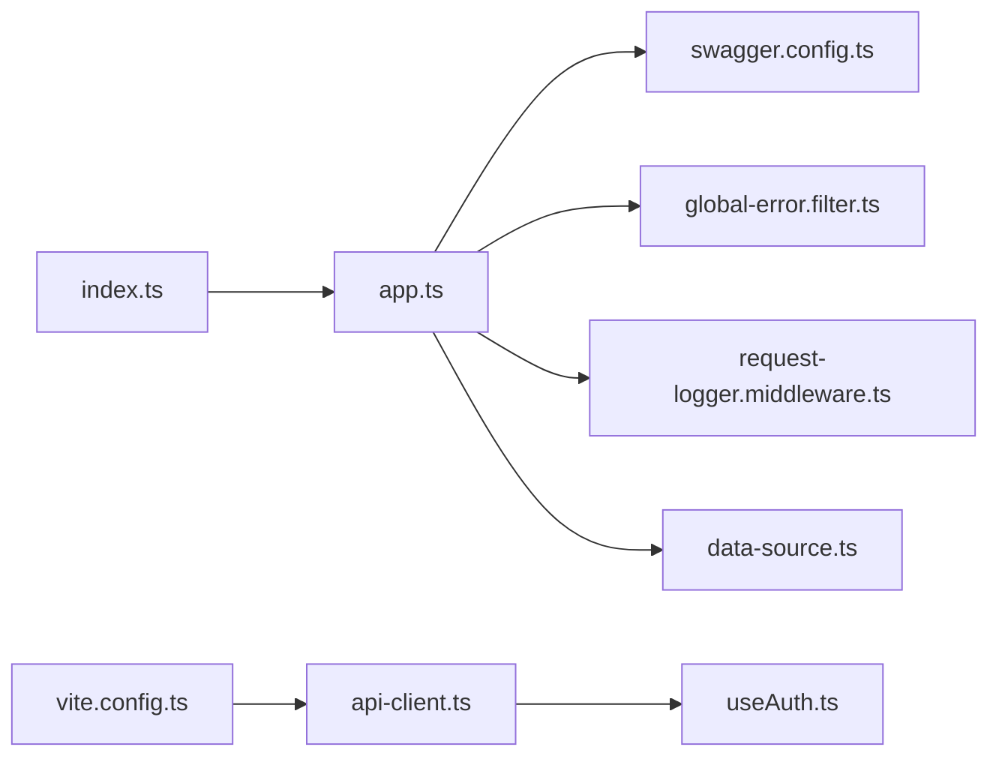

**Diagram sources**
- [backend/src/index.ts](file://backend/src/index.ts)
- [backend/src/app.ts](file://backend/src/app.ts)
- [backend/src/config/swagger.config.ts](file://backend/src/config/swagger.config.ts)
- [backend/src/common/filters/global-error.filter.ts](file://backend/src/common/filters/global-error.filter.ts)
- [backend/src/common/middlewares/request-logger.middleware.ts](file://backend/src/common/middlewares/request-logger.middleware.ts)
- [backend/src/database/data-source.ts](file://backend/src/database/data-source.ts)
- [frontend/vite.config.ts](file://frontend/vite.config.ts)
- [frontend/src/lib/api-client.ts](file://frontend/src/lib/api-client.ts)
- [frontend/src/hooks/useAuth.ts](file://frontend/src/hooks/useAuth.ts)

**Section sources**
- [backend/src/index.ts](file://backend/src/index.ts)
- [backend/src/app.ts](file://backend/src/app.ts)
- [backend/src/config/swagger.config.ts](file://backend/src/config/swagger.config.ts)
- [backend/src/common/filters/global-error.filter.ts](file://backend/src/common/filters/global-error.filter.ts)
- [backend/src/common/middlewares/request-logger.middleware.ts](file://backend/src/common/middlewares/request-logger.middleware.ts)
- [backend/src/database/data-source.ts](file://backend/src/database/data-source.ts)
- [frontend/vite.config.ts](file://frontend/vite.config.ts)
- [frontend/src/lib/api-client.ts](file://frontend/src/lib/api-client.ts)
- [frontend/src/hooks/useAuth.ts](file://frontend/src/hooks/useAuth.ts)

## Performance Considerations
- Enable query logging only in development to avoid overhead in production.
- Use pagination and selective field fetching in both backend and frontend.
- Profile hot paths using Node.js CPU profiler and React Profiler.
- Monitor response times via request logger middleware and adjust caching strategies accordingly.

[No sources needed since this section provides general guidance]

## Troubleshooting Guide

### Backend: Endpoint Returns 500
- Steps:
  - Check global error filter output for normalized error details.
  - Review request logger middleware logs for context (path, params, headers).
  - Inspect database logs for failing queries.
  - Reproduce via Swagger UI to isolate controller/service logic.
- Tips:
  - Add targeted logging in service methods.
  - Validate inputs early in controllers.

**Section sources**
- [backend/src/common/filters/global-error.filter.ts](file://backend/src/common/filters/global-error.filter.ts)
- [backend/src/common/middlewares/request-logger.middleware.ts](file://backend/src/common/middlewares/request-logger.middleware.ts)
- [backend/src/database/data-source.ts](file://backend/src/database/data-source.ts)

### Backend: Slow Queries
- Steps:
  - Enable query logging in data source configuration.
  - Identify long-running queries from logs.
  - Add appropriate indexes and refactor joins.
  - Use pagination to limit result sets.
- Tips:
  - Prefer raw SQL for complex analytics where necessary.
  - Cache frequently accessed read-heavy data.

**Section sources**
- [backend/src/database/data-source.ts](file://backend/src/database/data-source.ts)

### Frontend: Network Errors or CORS Issues
- Steps:
  - Verify Vite proxy configuration matches backend URL/port.
  - Ensure Authorization header is attached via API client.
  - Check browser Network tab for 4xx/5xx responses.
  - Confirm CORS allows required origins and headers.
- Tips:
  - Temporarily disable strict CORS checks in local dev if needed.
  - Normalize error messages in the API client for better UX.

**Section sources**
- [frontend/vite.config.ts](file://frontend/vite.config.ts)
- [frontend/src/lib/api-client.ts](file://frontend/src/lib/api-client.ts)

### Frontend: Authentication Failures
- Steps:
  - Confirm token presence and expiration handling in useAuth hook.
  - Validate API client injects correct Authorization header.
  - Reproduce login flow in Swagger UI to confirm backend behavior.
- Tips:
  - Add explicit logging for token lifecycle events.
  - Handle refresh flows gracefully.

**Section sources**
- [frontend/src/hooks/useAuth.ts](file://frontend/src/hooks/useAuth.ts)
- [frontend/src/lib/api-client.ts](file://frontend/src/lib/api-client.ts)

### Database Migration Issues
- Steps:
  - Run migration script against a clean test database.
  - Inspect migration logs for constraint violations.
  - Rollback or fix schema mismatches before re-running.
- Tips:
  - Keep migrations idempotent where possible.
  - Use seed scripts to populate realistic data for validation.

**Section sources**
- [backend/scripts/run-migration.ts](file://backend/scripts/run-migration.ts)

### Node.js Debugging Not Attaching
- Steps:
  - Ensure nodemon or Docker dev image exposes debug port.
  - Verify IDE debug configuration matches port and protocol.
  - Restart backend with debug flags and attach immediately.
- Tips:
  - Use conditional breakpoints to skip cold-start code.
  - Inspect process.env for configuration discrepancies.

**Section sources**
- [backend/nodemon.json](file://backend/nodemon.json)
- [docker/Dockerfile.backend.dev](file://docker/Dockerfile.backend.dev)
- [backend/package.json](file://backend/package.json)

## Conclusion
By leveraging Swagger for API exploration, centralized error filtering, request logging, and robust frontend debugging tools, teams can efficiently diagnose and resolve issues across the stack. Combine these practices with disciplined testing, seed data, and isolated environments to maintain confidence during rapid development cycles.

[No sources needed since this section summarizes without analyzing specific files]

## Appendices

### Quick Start Checklist
- Start backend with debug enabled and open Swagger UI.
- Start frontend dev server and verify proxy to backend.
- Use React DevTools and Network tab to inspect UI and requests.
- Enable query logging in data source for DB diagnostics.
- Run migrations and seed data in a dedicated test database.

[No sources needed since this section provides general guidance]