# Diagnostic Tools & Monitoring

<cite>
**Referenced Files in This Document**
- [backend/src/modules/monitoring/index.ts](file://backend/src/modules/monitoring/index.ts)
- [backend/src/modules/monitoring/controllers/monitoring.controller.ts](file://backend/src/modules/monitoring/controllers/monitoring.controller.ts)
- [backend/src/modules/monitoring/services/monitoring.service.ts](file://backend/src/modules/monitoring/services/monitoring.service.ts)
- [backend/src/common/interceptors/tracing.interceptor.ts](file://backend/src/common/interceptors/tracing.interceptor.ts)
- [backend/src/common/middlewares/request-logger.middleware.ts](file://backend/src/common/middlewares/request-logger.middleware.ts)
- [backend/src/config/env.config.ts](file://backend/src/config/env.config.ts)
- [backend/src/database/data-source.ts](file://backend/src/database/data-source.ts)
- [backend/src/app.ts](file://backend/src/app.ts)
- [backend/src/routes/route-registry.ts](file://backend/src/routes/route-registry.ts)
- [backend/src/modules/dashboard/controllers/dashboard.controller.ts](file://backend/src/modules/dashboard/controllers/dashboard.controller.ts)
- [backend/src/modules/dashboard/services/dashboard.service.ts](file://backend/src/modules/dashboard/services/dashboard.service.ts)
- [backend/src/modules/audit/services/audit.service.ts](file://backend/src/modules/audit/services/audit.service.ts)
- [backend/src/modules/audit/entities/audit.entity.ts](file://backend/src/modules/audit/entities/audit.entity.ts)
- [backend/src/modules/configuration/services/global-config.service.ts](file://backend/src/modules/configuration/services/global-config.service.ts)
- [backend/src/modules/configuration/dto/global-config.dto.ts](file://backend/src/modules/configuration/dto/global-config.dto.ts)
- [backend/src/modules/configuration/migrations/099-add-monitoring-params.sql](file://backend/src/modules/configuration/migrations/099-add-monitoring-params.sql)
- [backend/scripts/run-migration.ts](file://backend/scripts/run-migration.ts)
- [docker/docker-compose.yml](file://docker/docker-compose.yml)
- [docker/nginx.conf](file://docker/nginx.conf)
- [frontend/src/features/monitoring/MonitoringDashboard.tsx](file://frontend/src/features/monitoring/MonitoringDashboard.tsx)
- [frontend/src/hooks/useMonitoringMetrics.ts](file://frontend/src/hooks/useMonitoringMetrics.ts)
- [frontend/src/lib/api.ts](file://frontend/src/lib/api.ts)
</cite>

## Table of Contents
1. [Introduction](#introduction)
2. [Project Structure](#project-structure)
3. [Core Components](#core-components)
4. [Architecture Overview](#architecture-overview)
5. [Detailed Component Analysis](#detailed-component-analysis)
6. [Dependency Analysis](#dependency-analysis)
7. [Performance Considerations](#performance-considerations)
8. [Troubleshooting Guide](#troubleshooting-guide)
9. [Conclusion](#conclusion)
10. [Appendices](#appendices)

## Introduction
This document explains eLISAschool’s diagnostic tools and monitoring capabilities, including the built-in monitoring dashboard, health check endpoints, performance metrics collection, cache metrics, system resource monitoring, request tracing utilities, structured logging, audit trail examination, error pattern detection, debugging workflows for backend services, frontend components, and database queries, as well as profiling, memory leak detection, bottleneck identification, and production alerting best practices.

## Project Structure
The monitoring and diagnostics features are implemented across backend modules, shared infrastructure, configuration, and a frontend dashboard:

- Backend monitoring module exposes health checks, metrics, and tracing hooks.
- Common interceptors and middlewares provide request tracing and structured logging.
- Configuration module stores runtime monitoring parameters (e.g., sampling rates).
- Database layer includes migrations to support monitoring-related settings.
- Frontend provides a monitoring dashboard UI that consumes backend metrics.

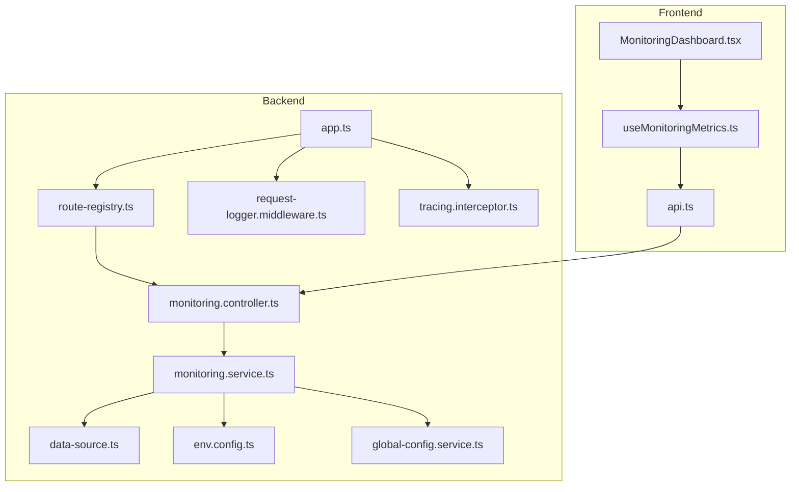

**Diagram sources**
- [backend/src/app.ts](file://backend/src/app.ts)
- [backend/src/routes/route-registry.ts](file://backend/src/routes/route-registry.ts)
- [backend/src/modules/monitoring/controllers/monitoring.controller.ts](file://backend/src/modules/monitoring/controllers/monitoring.controller.ts)
- [backend/src/modules/monitoring/services/monitoring.service.ts](file://backend/src/modules/monitoring/services/monitoring.service.ts)
- [backend/src/common/middlewares/request-logger.middleware.ts](file://backend/src/common/middlewares/request-logger.middleware.ts)
- [backend/src/common/interceptors/tracing.interceptor.ts](file://backend/src/common/interceptors/tracing.interceptor.ts)
- [backend/src/database/data-source.ts](file://backend/src/database/data-source.ts)
- [backend/src/config/env.config.ts](file://backend/src/config/env.config.ts)
- [backend/src/modules/configuration/services/global-config.service.ts](file://backend/src/modules/configuration/services/global-config.service.ts)
- [frontend/src/features/monitoring/MonitoringDashboard.tsx](file://frontend/src/features/monitoring/MonitoringDashboard.tsx)
- [frontend/src/hooks/useMonitoringMetrics.ts](file://frontend/src/hooks/useMonitoringMetrics.ts)
- [frontend/src/lib/api.ts](file://frontend/src/lib/api.ts)

**Section sources**
- [backend/src/app.ts](file://backend/src/app.ts)
- [backend/src/routes/route-registry.ts](file://backend/src/routes/route-registry.ts)
- [backend/src/modules/monitoring/controllers/monitoring.controller.ts](file://backend/src/modules/monitoring/controllers/monitoring.controller.ts)
- [backend/src/modules/monitoring/services/monitoring.service.ts](file://backend/src/modules/monitoring/services/monitoring.service.ts)
- [backend/src/common/middlewares/request-logger.middleware.ts](file://backend/src/common/middlewares/request-logger.middleware.ts)
- [backend/src/common/interceptors/tracing.interceptor.ts](file://backend/src/common/interceptors/tracing.interceptor.ts)
- [backend/src/database/data-source.ts](file://backend/src/database/data-source.ts)
- [backend/src/config/env.config.ts](file://backend/src/config/env.config.ts)
- [backend/src/modules/configuration/services/global-config.service.ts](file://backend/src/modules/configuration/services/global-config.service.ts)
- [frontend/src/features/monitoring/MonitoringDashboard.tsx](file://frontend/src/features/monitoring/MonitoringDashboard.tsx)
- [frontend/src/hooks/useMonitoringMetrics.ts](file://frontend/src/hooks/useMonitoringMetrics.ts)
- [frontend/src/lib/api.ts](file://frontend/src/lib/api.ts)

## Core Components
- Monitoring Controller: Exposes health check and metrics endpoints used by the dashboard and external systems.
- Monitoring Service: Aggregates metrics from application state, caches, database, and process resources; formats results for consumption.
- Request Logger Middleware: Emits structured logs per HTTP request with correlation IDs and timing.
- Tracing Interceptor: Wraps controller methods to capture latency, errors, and context for distributed tracing.
- Configuration Service: Provides runtime toggles and thresholds for monitoring behavior (e.g., sampling rate).
- Dashboard Module: Serves aggregated data for the frontend monitoring dashboard.
- Audit Service and Entity: Persist audit events for compliance and troubleshooting.

Key responsibilities:
- Health checks: readiness/liveness indicators.
- Metrics: CPU, memory, heap, GC, DB pool stats, cache hit/miss ratios, request latency percentiles.
- Tracing: per-request spans and correlation IDs.
- Logging: structured JSON logs with consistent fields.
- Auditing: immutable records of significant actions.

**Section sources**
- [backend/src/modules/monitoring/controllers/monitoring.controller.ts](file://backend/src/modules/monitoring/controllers/monitoring.controller.ts)
- [backend/src/modules/monitoring/services/monitoring.service.ts](file://backend/src/modules/monitoring/services/monitoring.service.ts)
- [backend/src/common/middlewares/request-logger.middleware.ts](file://backend/src/common/middlewares/request-logger.middleware.ts)
- [backend/src/common/interceptors/tracing.interceptor.ts](file://backend/src/common/interceptors/tracing.interceptor.ts)
- [backend/src/modules/configuration/services/global-config.service.ts](file://backend/src/modules/configuration/services/global-config.service.ts)
- [backend/src/modules/dashboard/controllers/dashboard.controller.ts](file://backend/src/modules/dashboard/controllers/dashboard.controller.ts)
- [backend/src/modules/dashboard/services/dashboard.service.ts](file://backend/src/modules/dashboard/services/dashboard.service.ts)
- [backend/src/modules/audit/services/audit.service.ts](file://backend/src/modules/audit/services/audit.service.ts)
- [backend/src/modules/audit/entities/audit.entity.ts](file://backend/src/modules/audit/entities/audit.entity.ts)

## Architecture Overview
The monitoring architecture integrates at multiple layers:

- HTTP Layer: Middleware and interceptor add tracing and structured logging around each request.
- Controller Layer: Health and metrics endpoints expose operational status.
- Service Layer: Collects metrics from caches, databases, and process internals.
- Configuration Layer: Controls sampling and feature flags for monitoring.
- Frontend Layer: Dashboard UI polls metrics and renders real-time insights.

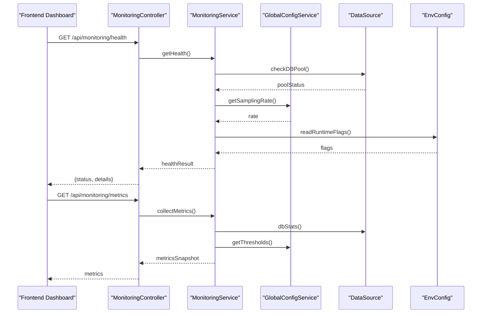

**Diagram sources**
- [backend/src/modules/monitoring/controllers/monitoring.controller.ts](file://backend/src/modules/monitoring/controllers/monitoring.controller.ts)
- [backend/src/modules/monitoring/services/monitoring.service.ts](file://backend/src/modules/monitoring/services/monitoring.service.ts)
- [backend/src/modules/configuration/services/global-config.service.ts](file://backend/src/modules/configuration/services/global-config.service.ts)
- [backend/src/database/data-source.ts](file://backend/src/database/data-source.ts)
- [backend/src/config/env.config.ts](file://backend/src/config/env.config.ts)

## Detailed Component Analysis

### Monitoring Controller
- Purpose: Define REST endpoints for health checks and metrics.
- Behavior: Delegates to MonitoringService for aggregation; returns standardized responses suitable for dashboards and alerting systems.
- Integration: Registered via route registry and protected according to environment policies.

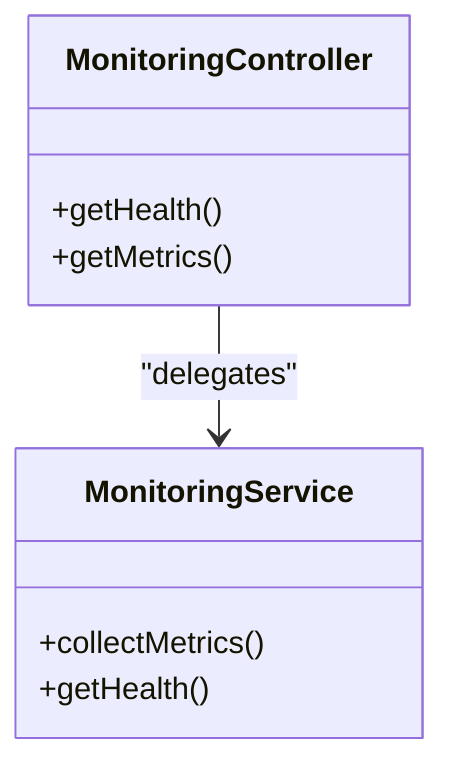

**Diagram sources**
- [backend/src/modules/monitoring/controllers/monitoring.controller.ts](file://backend/src/modules/monitoring/controllers/monitoring.controller.ts)
- [backend/src/modules/monitoring/services/monitoring.service.ts](file://backend/src/modules/monitoring/services/monitoring.service.ts)

**Section sources**
- [backend/src/modules/monitoring/controllers/monitoring.controller.ts](file://backend/src/modules/monitoring/controllers/monitoring.controller.ts)
- [backend/src/routes/route-registry.ts](file://backend/src/routes/route-registry.ts)

### Monitoring Service
- Purpose: Aggregate metrics from multiple subsystems (cache, DB, process).
- Data Sources:
  - Cache metrics: hit/miss ratio, size, eviction counts.
  - System resources: CPU usage, memory footprint, heap usage, GC counters.
  - Database: connection pool utilization, query latency distribution.
- Output: Normalized snapshot consumed by controllers and dashboards.

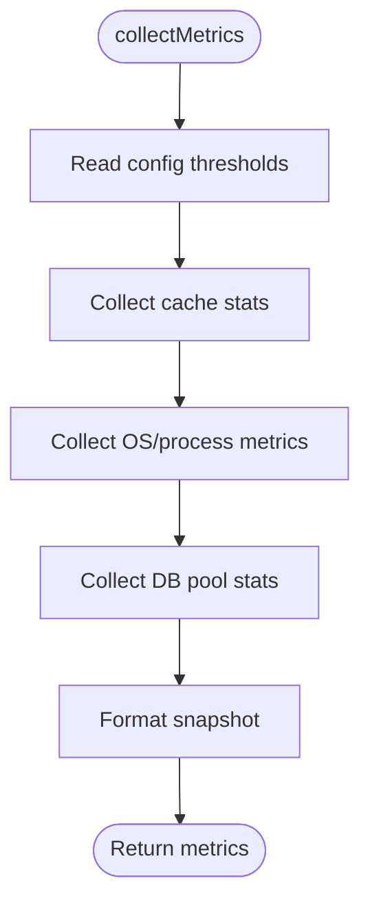

**Diagram sources**
- [backend/src/modules/monitoring/services/monitoring.service.ts](file://backend/src/modules/monitoring/services/monitoring.service.ts)
- [backend/src/modules/configuration/services/global-config.service.ts](file://backend/src/modules/configuration/services/global-config.service.ts)
- [backend/src/database/data-source.ts](file://backend/src/database/data-source.ts)

**Section sources**
- [backend/src/modules/monitoring/services/monitoring.service.ts](file://backend/src/modules/monitoring/services/monitoring.service.ts)
- [backend/src/modules/configuration/services/global-config.service.ts](file://backend/src/modules/configuration/services/global-config.service.ts)
- [backend/src/database/data-source.ts](file://backend/src/database/data-source.ts)

### Request Logger Middleware
- Purpose: Emit structured logs for every HTTP request with correlation ID, method, path, status, duration, and user context when available.
- Usage: Applied globally or per-route group; ensures consistent log shape for analysis pipelines.

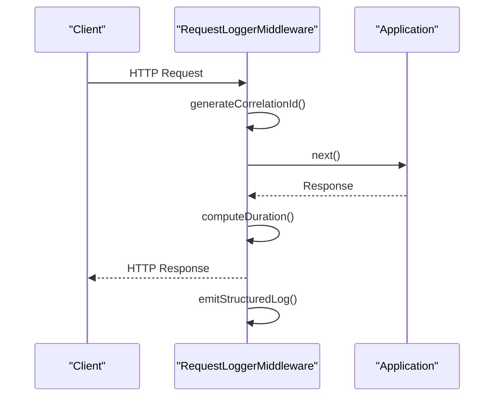

**Diagram sources**
- [backend/src/common/middlewares/request-logger.middleware.ts](file://backend/src/common/middlewares/request-logger.middleware.ts)

**Section sources**
- [backend/src/common/middlewares/request-logger.middleware.ts](file://backend/src/common/middlewares/request-logger.middleware.ts)

### Tracing Interceptor
- Purpose: Wrap controller execution to capture latency, errors, and contextual metadata; integrate with tracing backends if configured.
- Behavior: Starts span on entry, attaches correlation ID, records exceptions, finalizes span on completion.

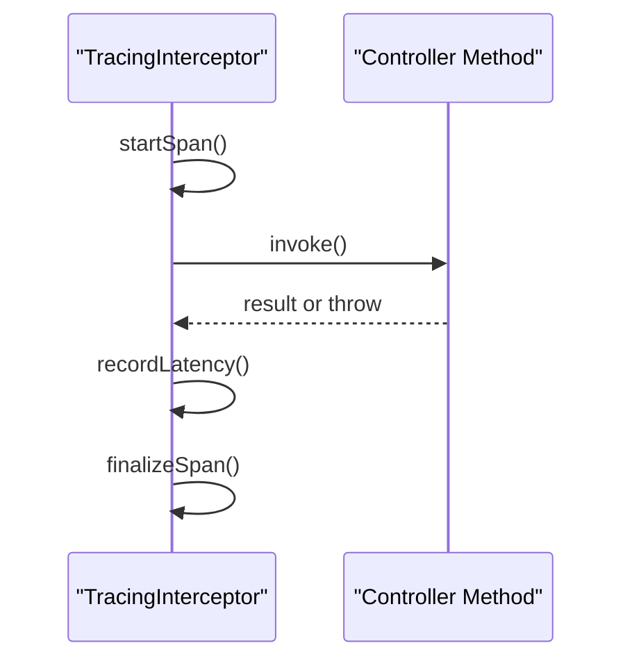

**Diagram sources**
- [backend/src/common/interceptors/tracing.interceptor.ts](file://backend/src/common/interceptors/tracing.interceptor.ts)

**Section sources**
- [backend/src/common/interceptors/tracing.interceptor.ts](file://backend/src/common/interceptors/tracing.interceptor.ts)

### Configuration for Monitoring
- Global Config Service: Provides runtime parameters such as sampling rate, metric retention windows, and threshold values.
- Environment Config: Reads environment variables controlling feature flags and sensitive settings.
- Migration: Adds monitoring-related parameters to persistent configuration store.

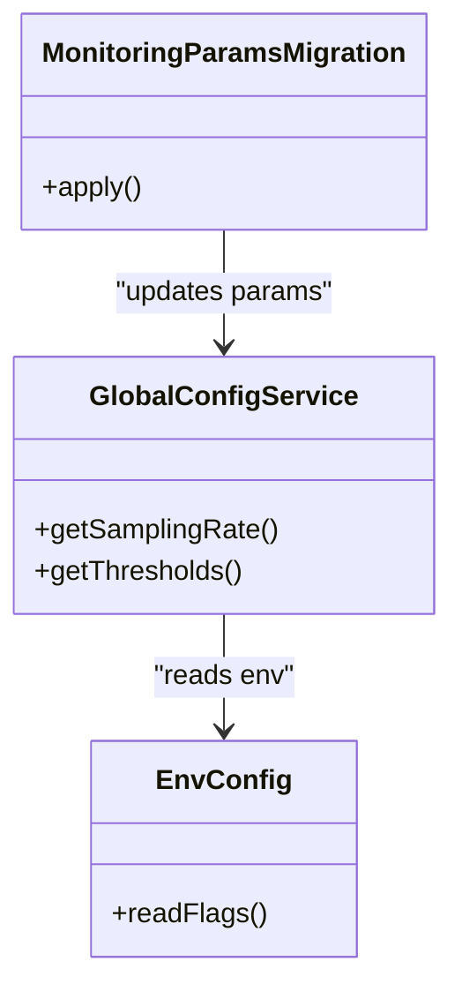

**Diagram sources**
- [backend/src/modules/configuration/services/global-config.service.ts](file://backend/src/modules/configuration/services/global-config.service.ts)
- [backend/src/config/env.config.ts](file://backend/src/config/env.config.ts)
- [backend/src/modules/configuration/migrations/099-add-monitoring-params.sql](file://backend/src/modules/configuration/migrations/099-add-monitoring-params.sql)

**Section sources**
- [backend/src/modules/configuration/services/global-config.service.ts](file://backend/src/modules/configuration/services/global-config.service.ts)
- [backend/src/config/env.config.ts](file://backend/src/config/env.config.ts)
- [backend/src/modules/configuration/migrations/099-add-monitoring-params.sql](file://backend/src/modules/configuration/migrations/099-add-monitoring-params.sql)
- [backend/scripts/run-migration.ts](file://backend/scripts/run-migration.ts)

### Dashboard Module
- Purpose: Serve aggregated data for the frontend monitoring dashboard.
- Components:
  - Controller: Exposes endpoints for dashboard-specific views.
  - Service: Aggregates and transforms metrics into dashboard-friendly payloads.

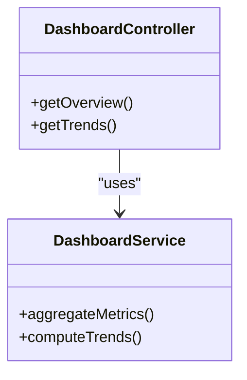

**Diagram sources**
- [backend/src/modules/dashboard/controllers/dashboard.controller.ts](file://backend/src/modules/dashboard/controllers/dashboard.controller.ts)
- [backend/src/modules/dashboard/services/dashboard.service.ts](file://backend/src/modules/dashboard/services/dashboard.service.ts)

**Section sources**
- [backend/src/modules/dashboard/controllers/dashboard.controller.ts](file://backend/src/modules/dashboard/controllers/dashboard.controller.ts)
- [backend/src/modules/dashboard/services/dashboard.service.ts](file://backend/src/modules/dashboard/services/dashboard.service.ts)

### Audit Trail
- Purpose: Record important actions for compliance and post-incident analysis.
- Implementation:
  - Audit Service: Persists audit events with actor, action, entity, and metadata.
  - Audit Entity: Defines schema for audit records.

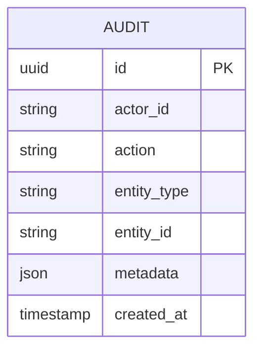

**Diagram sources**
- [backend/src/modules/audit/services/audit.service.ts](file://backend/src/modules/audit/services/audit.service.ts)
- [backend/src/modules/audit/entities/audit.entity.ts](file://backend/src/modules/audit/entities/audit.entity.ts)

**Section sources**
- [backend/src/modules/audit/services/audit.service.ts](file://backend/src/modules/audit/services/audit.service.ts)
- [backend/src/modules/audit/entities/audit.entity.ts](file://backend/src/modules/audit/entities/audit.entity.ts)

### Frontend Monitoring Dashboard
- Purpose: Visualize health, metrics, and trends; allow operators to inspect recent logs and traces.
- Components:
  - MonitoringDashboard: Main view rendering charts and tables.
  - useMonitoringMetrics: Hook to fetch and refresh metrics from backend.
  - api: Centralized API client for requests.

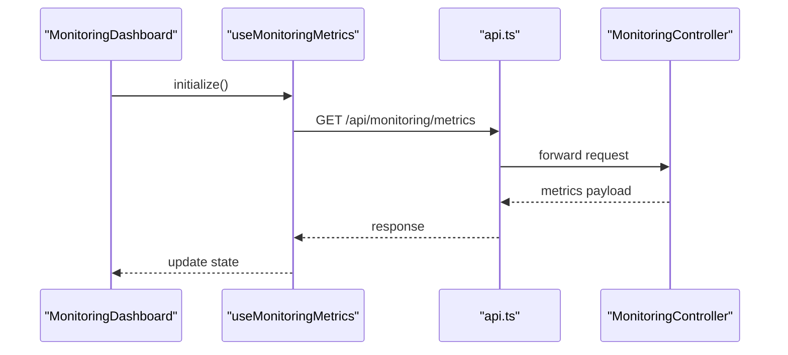

**Diagram sources**
- [frontend/src/features/monitoring/MonitoringDashboard.tsx](file://frontend/src/features/monitoring/MonitoringDashboard.tsx)
- [frontend/src/hooks/useMonitoringMetrics.ts](file://frontend/src/hooks/useMonitoringMetrics.ts)
- [frontend/src/lib/api.ts](file://frontend/src/lib/api.ts)
- [backend/src/modules/monitoring/controllers/monitoring.controller.ts](file://backend/src/modules/monitoring/controllers/monitoring.controller.ts)

**Section sources**
- [frontend/src/features/monitoring/MonitoringDashboard.tsx](file://frontend/src/features/monitoring/MonitoringDashboard.tsx)
- [frontend/src/hooks/useMonitoringMetrics.ts](file://frontend/src/hooks/useMonitoringMetrics.ts)
- [frontend/src/lib/api.ts](file://frontend/src/lib/api.ts)

## Dependency Analysis
High-level dependencies among monitoring components:

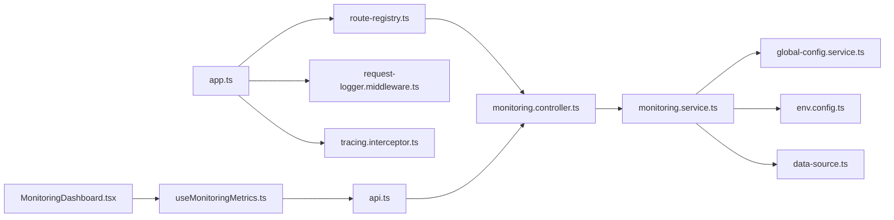

**Diagram sources**
- [backend/src/app.ts](file://backend/src/app.ts)
- [backend/src/routes/route-registry.ts](file://backend/src/routes/route-registry.ts)
- [backend/src/modules/monitoring/controllers/monitoring.controller.ts](file://backend/src/modules/monitoring/controllers/monitoring.controller.ts)
- [backend/src/modules/monitoring/services/monitoring.service.ts](file://backend/src/modules/monitoring/services/monitoring.service.ts)
- [backend/src/modules/configuration/services/global-config.service.ts](file://backend/src/modules/configuration/services/global-config.service.ts)
- [backend/src/config/env.config.ts](file://backend/src/config/env.config.ts)
- [backend/src/database/data-source.ts](file://backend/src/database/data-source.ts)
- [backend/src/common/middlewares/request-logger.middleware.ts](file://backend/src/common/middlewares/request-logger.middleware.ts)
- [backend/src/common/interceptors/tracing.interceptor.ts](file://backend/src/common/interceptors/tracing.interceptor.ts)
- [frontend/src/features/monitoring/MonitoringDashboard.tsx](file://frontend/src/features/monitoring/MonitoringDashboard.tsx)
- [frontend/src/hooks/useMonitoringMetrics.ts](file://frontend/src/hooks/useMonitoringMetrics.ts)
- [frontend/src/lib/api.ts](file://frontend/src/lib/api.ts)

**Section sources**
- [backend/src/app.ts](file://backend/src/app.ts)
- [backend/src/routes/route-registry.ts](file://backend/src/routes/route-registry.ts)
- [backend/src/modules/monitoring/controllers/monitoring.controller.ts](file://backend/src/modules/monitoring/controllers/monitoring.controller.ts)
- [backend/src/modules/monitoring/services/monitoring.service.ts](file://backend/src/modules/monitoring/services/monitoring.service.ts)
- [backend/src/modules/configuration/services/global-config.service.ts](file://backend/src/modules/configuration/services/global-config.service.ts)
- [backend/src/config/env.config.ts](file://backend/src/config/env.config.ts)
- [backend/src/database/data-source.ts](file://backend/src/database/data-source.ts)
- [backend/src/common/middlewares/request-logger.middleware.ts](file://backend/src/common/middlewares/request-logger.middleware.ts)
- [backend/src/common/interceptors/tracing.interceptor.ts](file://backend/src/common/interceptors/tracing.interceptor.ts)
- [frontend/src/features/monitoring/MonitoringDashboard.tsx](file://frontend/src/features/monitoring/MonitoringDashboard.tsx)
- [frontend/src/hooks/useMonitoringMetrics.ts](file://frontend/src/hooks/useMonitoringMetrics.ts)
- [frontend/src/lib/api.ts](file://frontend/src/lib/api.ts)

## Performance Considerations
- Sampling: Use configurable sampling rates to reduce overhead in high-throughput environments.
- Batching: Batch metrics emission where possible to avoid excessive I/O.
- Indexing: Ensure database indexes support frequent monitoring queries.
- Caching: Cache computed aggregates for short intervals to reduce load.
- Backpressure: Apply rate limiting on metrics endpoints to protect the service.
- Resource Limits: Monitor heap and GC pressure; tune Node.js flags accordingly.

[No sources needed since this section provides general guidance]

## Troubleshooting Guide
- Health Checks:
  - Verify readiness/liveness endpoints return expected statuses.
  - Inspect dependency health (DB pool, cache connectivity).
- Structured Logs:
  - Filter by correlation ID to trace full request lifecycle.
  - Validate log levels and ensure sensitive fields are redacted.
- Audit Trail:
  - Query audit records by actor/action/entity to reconstruct incidents.
  - Cross-reference timestamps with metrics spikes.
- Error Patterns:
  - Group errors by type and endpoint; correlate with latency percentiles.
  - Identify recurring failures and their root causes using traces.
- Debugging Workflows:
  - Backend: Enable verbose logging temporarily; attach debugger to running process.
  - Frontend: Inspect network calls and state updates in the monitoring hook.
  - Database: Review slow query logs and pool utilization during incidents.
- Profiling and Memory Leaks:
  - Use heap snapshots to detect leaks; compare before/after operations.
  - Profile CPU hotspots to identify bottlenecks in critical paths.
- Alerting:
  - Configure alerts for high error rates, latency p95/p99, low cache hit ratio, DB pool saturation, and memory growth.
  - Integrate with notification channels (email, Slack, PagerDuty).

**Section sources**
- [backend/src/modules/monitoring/controllers/monitoring.controller.ts](file://backend/src/modules/monitoring/controllers/monitoring.controller.ts)
- [backend/src/modules/monitoring/services/monitoring.service.ts](file://backend/src/modules/monitoring/services/monitoring.service.ts)
- [backend/src/common/middlewares/request-logger.middleware.ts](file://backend/src/common/middlewares/request-logger.middleware.ts)
- [backend/src/common/interceptors/tracing.interceptor.ts](file://backend/src/common/interceptors/tracing.interceptor.ts)
- [backend/src/modules/audit/services/audit.service.ts](file://backend/src/modules/audit/services/audit.service.ts)
- [backend/src/modules/audit/entities/audit.entity.ts](file://backend/src/modules/audit/entities/audit.entity.ts)

## Conclusion
eLISAschool’s monitoring stack provides comprehensive observability through health checks, metrics, tracing, structured logging, and audit trails. The frontend dashboard offers an accessible interface for operators to monitor system health and performance. By following the recommended practices—sampling, batching, alerting, and disciplined debugging—you can maintain reliability and quickly diagnose issues in production.

[No sources needed since this section summarizes without analyzing specific files]

## Appendices

### Production Deployment Notes
- Containerization: Use Docker Compose to orchestrate backend, database, and reverse proxy.
- Reverse Proxy: Configure nginx to expose health and metrics endpoints securely.

**Section sources**
- [docker/docker-compose.yml](file://docker/docker-compose.yml)
- [docker/nginx.conf](file://docker/nginx.conf)