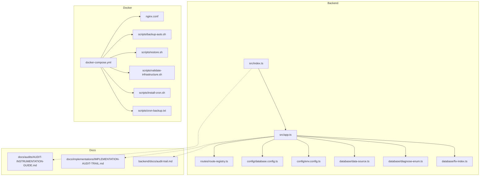
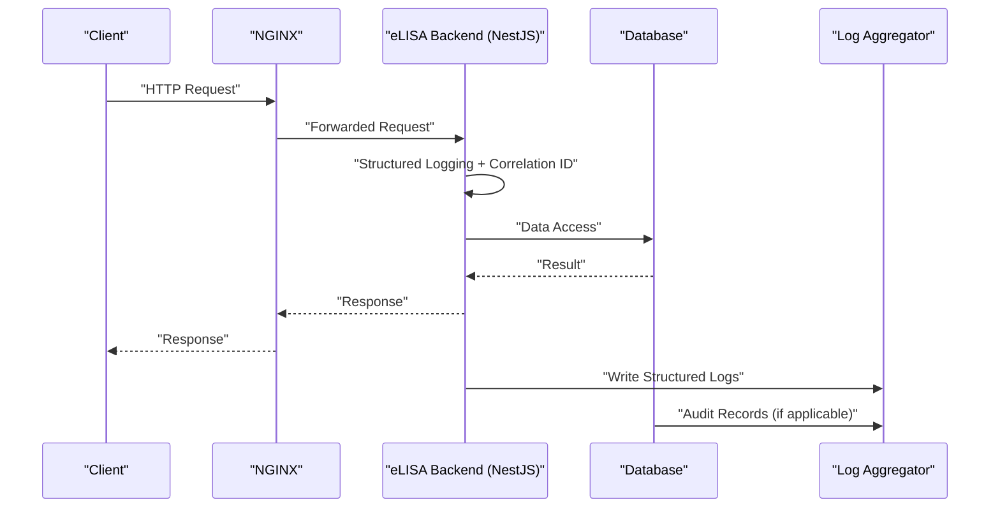
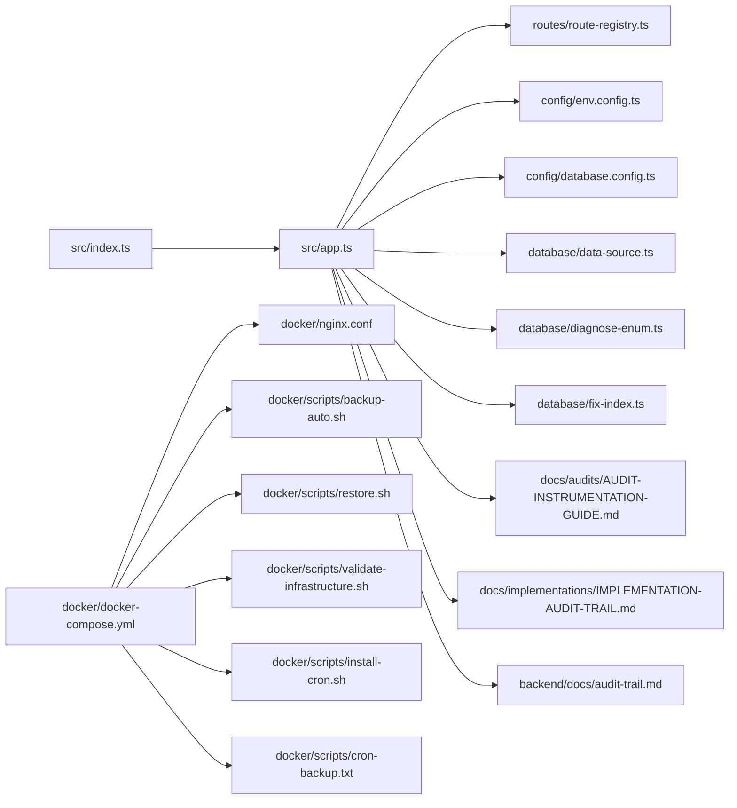

# Log Analysis & Debugging

<cite>
**Referenced Files in This Document**
- [audit-trail.md](file://backend/docs/audit-trail.md)
- [IMPLEMENTATION-AUDIT-TRAIL.md](file://docs/implementations/IMPLEMENTATION-AUDIT-TRAIL.md)
- [AUDIT-INSTRUMENTATION-GUIDE.md](file://docs/audits/AUDIT-INSTRUMENTATION-GUIDE.md)
- [app.ts](file://backend/src/app.ts)
- [index.ts](file://backend/src/index.ts)
- [route-registry.ts](file://backend/src/routes/route-registry.ts)
- [database.config.ts](file://backend/src/config/database.config.ts)
- [env.config.ts](file://backend/src/config/env.config.ts)
- [data-source.ts](file://backend/src/database/data-source.ts)
- [diagnose-enum.ts](file://backend/src/database/diagnose-enum.ts)
- [fix-index.ts](file://backend/src/database/fix-index.ts)
- [package.json](file://backend/package.json)
- [docker-compose.yml](file://docker/docker-compose.yml)
- [nginx.conf](file://docker/nginx.conf)
- [backup-auto.sh](file://docker/scripts/backup-auto.sh)
- [restore.sh](file://docker/scripts/restore.sh)
- [validate-infrastructure.sh](file://docker/scripts/validate-infrastructure.sh)
- [install-cron.sh](file://docker/scripts/install-cron.sh)
- [cron-backup.txt](file://docker/scripts/cron-backup.txt)
</cite>

## Table of Contents
1. [Introduction](#introduction)
2. [Project Structure](#project-structure)
3. [Core Components](#core-components)
4. [Architecture Overview](#architecture-overview)
5. [Detailed Component Analysis](#detailed-component-analysis)
6. [Dependency Analysis](#dependency-analysis)
7. [Performance Considerations](#performance-considerations)
8. [Troubleshooting Guide](#troubleshooting-guide)
9. [Conclusion](#conclusion)
10. [Appendices](#appendices)

## Introduction
This document explains the eLISAschool logging infrastructure and debugging utilities with a focus on structured logging, audit trail implementation, log aggregation strategies, and production troubleshooting techniques. It provides guidance for analyzing application logs using log levels, correlation IDs, and contextual information, as well as operational practices for rotation, storage management, and compliance requirements for audit logs.

## Project Structure
The logging and auditing capabilities are implemented across backend modules and supporting configuration:
- Application bootstrap and middleware orchestration
- Audit trail documentation and implementation references
- Database diagnostics and environment configuration
- Dockerized deployment artifacts for log and backup management

**Diagram sources**
- [index.ts](file://backend/src/index.ts)
- [app.ts](file://backend/src/app.ts)
- [route-registry.ts](file://backend/src/routes/route-registry.ts)
- [database.config.ts](file://backend/src/config/database.config.ts)
- [env.config.ts](file://backend/src/config/env.config.ts)
- [data-source.ts](file://backend/src/database/data-source.ts)
- [diagnose-enum.ts](file://backend/src/database/diagnose-enum.ts)
- [fix-index.ts](file://backend/src/database/fix-index.ts)
- [AUDIT-INSTRUMENTATION-GUIDE.md](file://docs/audits/AUDIT-INSTRUMENTATION-GUIDE.md)
- [IMPLEMENTATION-AUDIT-TRAIL.md](file://docs/implementations/IMPLEMENTATION-AUDIT-TRAIL.md)
- [audit-trail.md](file://backend/docs/audit-trail.md)
- [docker-compose.yml](file://docker/docker-compose.yml)
- [nginx.conf](file://docker/nginx.conf)
- [backup-auto.sh](file://docker/scripts/backup-auto.sh)
- [restore.sh](file://docker/scripts/restore.sh)
- [validate-infrastructure.sh](file://docker/scripts/validate-infrastructure.sh)
- [install-cron.sh](file://docker/scripts/install-cron.sh)
- [cron-backup.txt](file://docker/scripts/cron-backup.txt)

**Section sources**
- [index.ts](file://backend/src/index.ts)
- [app.ts](file://backend/src/app.ts)
- [route-registry.ts](file://backend/src/routes/route-registry.ts)
- [database.config.ts](file://backend/src/config/database.config.ts)
- [env.config.ts](file://backend/src/config/env.config.ts)
- [data-source.ts](file://backend/src/database/data-source.ts)
- [diagnose-enum.ts](file://backend/src/database/diagnose-enum.ts)
- [fix-index.ts](file://backend/src/database/fix-index.ts)
- [AUDIT-INSTRUMENTATION-GUIDE.md](file://docs/audits/AUDIT-INSTRUMENTATION-GUIDE.md)
- [IMPLEMENTATION-AUDIT-TRAIL.md](file://docs/implementations/IMPLEMENTATION-AUDIT-TRAIL.md)
- [audit-trail.md](file://backend/docs/audit-trail.md)
- [docker-compose.yml](file://docker/docker-compose.yml)
- [nginx.conf](file://docker/nginx.conf)
- [backup-auto.sh](file://docker/scripts/backup-auto.sh)
- [restore.sh](file://docker/scripts/restore.sh)
- [validate-infrastructure.sh](file://docker/scripts/validate-infrastructure.sh)
- [install-cron.sh](file://docker/scripts/install-cron.sh)
- [cron-backup.txt](file://docker/scripts/cron-backup.txt)

## Core Components
- Structured logging system: Centralized logging configuration and request/response instrumentation to produce consistent, machine-readable logs.
- Audit trail: Persistent records of sensitive operations with user context, timestamps, and outcomes for compliance and forensics.
- Log aggregation strategy: Containerized services and reverse proxy configured to collect and forward logs; scripts manage backups and validation.
- Debugging utilities: Database diagnostics and index repair helpers to accelerate issue resolution.

Key areas to review:
- Application bootstrap and middleware wiring for logging and tracing
- Audit trail documentation and implementation references
- Environment and database configuration for log-related settings
- Docker compose and nginx configurations for log collection and rotation
- Backup and restore scripts for audit data retention

**Section sources**
- [app.ts](file://backend/src/app.ts)
- [index.ts](file://backend/src/index.ts)
- [route-registry.ts](file://backend/src/routes/route-registry.ts)
- [AUDIT-INSTRUMENTATION-GUIDE.md](file://docs/audits/AUDIT-INSTRUMENTATION-GUIDE.md)
- [IMPLEMENTATION-AUDIT-TRAIL.md](file://docs/implementations/IMPLEMENTATION-AUDIT-TRAIL.md)
- [audit-trail.md](file://backend/docs/audit-trail.md)
- [env.config.ts](file://backend/src/config/env.config.ts)
- [database.config.ts](file://backend/src/config/database.config.ts)
- [docker-compose.yml](file://docker/docker-compose.yml)
- [nginx.conf](file://docker/nginx.conf)
- [backup-auto.sh](file://docker/scripts/backup-auto.sh)
- [restore.sh](file://docker/scripts/restore.sh)

## Architecture Overview
The logging and audit architecture integrates application-level instrumentation with containerized log collection and retention mechanisms.

**Diagram sources**
- [nginx.conf](file://docker/nginx.conf)
- [app.ts](file://backend/src/app.ts)
- [index.ts](file://backend/src/index.ts)
- [data-source.ts](file://backend/src/database/data-source.ts)
- [AUDIT-INSTRUMENTATION-GUIDE.md](file://docs/audits/AUDIT-INSTRUMENTATION-GUIDE.md)

## Detailed Component Analysis

### Structured Logging System
- Purpose: Produce consistent, searchable logs with standardized fields such as timestamp, level, service name, correlation ID, and contextual metadata.
- Integration points:
  - Application bootstrap initializes logging and global interceptors/middlewares for request lifecycle logging.
  - Route registry ensures endpoints are instrumented consistently.
- Recommended fields:
  - correlationId: unique per request
  - userId or tenantId when available
  - method, path, statusCode, durationMs
  - error details only at appropriate levels

Operational guidance:
- Ensure correlation IDs propagate across all downstream calls.
- Avoid logging sensitive data; mask tokens, passwords, and personal identifiers.
- Use structured JSON format for easy parsing by log aggregators.

**Section sources**
- [app.ts](file://backend/src/app.ts)
- [index.ts](file://backend/src/index.ts)
- [route-registry.ts](file://backend/src/routes/route-registry.ts)
- [AUDIT-INSTRUMENTATION-GUIDE.md](file://docs/audits/AUDIT-INSTRUMENTATION-GUIDE.md)

### Audit Trail Implementation
- Purpose: Record high-risk operations with immutable context for compliance and forensic analysis.
- Scope: Authentication events, permission changes, financial transactions, and critical configuration updates.
- Data model considerations:
  - Actor identity, action type, target entity, before/after snapshots (sanitized), outcome, and timestamp.
- Storage and retention:
  - Separate table(s) with strict access controls.
  - Retention policies aligned with regulatory requirements.

Querying and reporting:
- Filter by actor, action, time range, and outcome.
- Export for audits with integrity checks.

**Section sources**
- [audit-trail.md](file://backend/docs/audit-trail.md)
- [IMPLEMENTATION-AUDIT-TRAIL.md](file://docs/implementations/IMPLEMENTATION-AUDIT-TRAIL.md)

### Log Aggregation and Rotation
- Collection:
  - Reverse proxy captures access logs and forwards them to centralized collectors.
  - Application writes structured logs to stdout/stderr for container orchestration to capture.
- Rotation and retention:
  - Use container-native log drivers or sidecar agents to rotate and compress logs.
  - Enforce maximum size and age limits to control storage growth.
- Backups:
  - Automated backup scripts ensure periodic snapshots of databases and critical artifacts.
  - Restore procedures validated via infrastructure validation scripts.

Compliance considerations:
- Immutable audit logs with tamper-evident storage.
- Role-based access to logs and audit records.
- Data minimization and masking in non-audit logs.

**Section sources**
- [nginx.conf](file://docker/nginx.conf)
- [docker-compose.yml](file://docker/docker-compose.yml)
- [backup-auto.sh](file://docker/scripts/backup-auto.sh)
- [restore.sh](file://docker/scripts/restore.sh)
- [validate-infrastructure.sh](file://docker/scripts/validate-infrastructure.sh)
- [install-cron.sh](file://docker/scripts/install-cron.sh)
- [cron-backup.txt](file://docker/scripts/cron-backup.txt)

### Debugging Utilities
- Database diagnostics:
  - Enum diagnosis helper to validate schema consistency.
  - Index fix utility to repair performance issues.
- Configuration inspection:
  - Environment and database configuration files provide runtime parameters relevant to logging and connectivity.

Usage patterns:
- Run diagnostic scripts in isolated environments to avoid impacting production.
- Validate indexes after migrations to prevent slow queries.

**Section sources**
- [diagnose-enum.ts](file://backend/src/database/diagnose-enum.ts)
- [fix-index.ts](file://backend/src/database/fix-index.ts)
- [database.config.ts](file://backend/src/config/database.config.ts)
- [env.config.ts](file://backend/src/config/env.config.ts)

## Dependency Analysis
The following diagram shows key dependencies among core components involved in logging and auditing.

**Diagram sources**
- [index.ts](file://backend/src/index.ts)
- [app.ts](file://backend/src/app.ts)
- [route-registry.ts](file://backend/src/routes/route-registry.ts)
- [env.config.ts](file://backend/src/config/env.config.ts)
- [database.config.ts](file://backend/src/config/database.config.ts)
- [data-source.ts](file://backend/src/database/data-source.ts)
- [diagnose-enum.ts](file://backend/src/database/diagnose-enum.ts)
- [fix-index.ts](file://backend/src/database/fix-index.ts)
- [AUDIT-INSTRUMENTATION-GUIDE.md](file://docs/audits/AUDIT-INSTRUMENTATION-GUIDE.md)
- [IMPLEMENTATION-AUDIT-TRAIL.md](file://docs/implementations/IMPLEMENTATION-AUDIT-TRAIL.md)
- [audit-trail.md](file://backend/docs/audit-trail.md)
- [docker-compose.yml](file://docker/docker-compose.yml)
- [nginx.conf](file://docker/nginx.conf)
- [backup-auto.sh](file://docker/scripts/backup-auto.sh)
- [restore.sh](file://docker/scripts/restore.sh)
- [validate-infrastructure.sh](file://docker/scripts/validate-infrastructure.sh)
- [install-cron.sh](file://docker/scripts/install-cron.sh)
- [cron-backup.txt](file://docker/scripts/cron-backup.txt)

**Section sources**
- [index.ts](file://backend/src/index.ts)
- [app.ts](file://backend/src/app.ts)
- [route-registry.ts](file://backend/src/routes/route-registry.ts)
- [env.config.ts](file://backend/src/config/env.config.ts)
- [database.config.ts](file://backend/src/config/database.config.ts)
- [data-source.ts](file://backend/src/database/data-source.ts)
- [diagnose-enum.ts](file://backend/src/database/diagnose-enum.ts)
- [fix-index.ts](file://backend/src/database/fix-index.ts)
- [AUDIT-INSTRUMENTATION-GUIDE.md](file://docs/audits/AUDIT-INSTRUMENTATION-GUIDE.md)
- [IMPLEMENTATION-AUDIT-TRAIL.md](file://docs/implementations/IMPLEMENTATION-AUDIT-TRAIL.md)
- [audit-trail.md](file://backend/docs/audit-trail.md)
- [docker-compose.yml](file://docker/docker-compose.yml)
- [nginx.conf](file://docker/nginx.conf)
- [backup-auto.sh](file://docker/scripts/backup-auto.sh)
- [restore.sh](file://docker/scripts/restore.sh)
- [validate-infrastructure.sh](file://docker/scripts/validate-infrastructure.sh)
- [install-cron.sh](file://docker/scripts/install-cron.sh)
- [cron-backup.txt](file://docker/scripts/cron-backup.txt)

## Performance Considerations
- Keep log payloads minimal and structured to reduce overhead.
- Avoid synchronous disk writes in hot paths; rely on buffered writers or async sinks.
- Use correlation IDs to correlate distributed traces without expensive joins.
- Rotate logs frequently to prevent large file scans during analysis.
- Monitor database query performance and maintain indexes to keep response times predictable.

[No sources needed since this section provides general guidance]

## Troubleshooting Guide

### Authentication Failures
Symptoms:
- Repeated 401/403 responses
- Failed login attempts flagged by security controls

Investigation steps:
- Search logs by correlationId and userId for the affected session.
- Inspect authentication middleware logs for token validation errors.
- Check audit trail entries for failed login attempts and account lockouts.
- Verify environment configuration for JWT secrets and issuer settings.

Patterns to match:
- Error codes related to invalid tokens or expired sessions.
- Rate limiting or blocking counters incrementing.

Remediation:
- Reset credentials or unlock accounts based on policy.
- Update secret configuration if misconfigured.
- Review RBAC rules and permissions for the role.

**Section sources**
- [AUDIT-INSTRUMENTATION-GUIDE.md](file://docs/audits/AUDIT-INSTRUMENTATION-GUIDE.md)
- [IMPLEMENTATION-AUDIT-TRAIL.md](file://docs/implementations/IMPLEMENTATION-AUDIT-TRAIL.md)
- [env.config.ts](file://backend/src/config/env.config.ts)

### Database Connection Problems
Symptoms:
- Timeouts or connection refused errors
- Slow queries or deadlocks

Investigation steps:
- Check database configuration parameters and network reachability.
- Use enum diagnosis tool to verify schema consistency.
- Run index fix utility to repair degraded indexes post-migration.
- Validate infrastructure with provided script to confirm service health.

Patterns to match:
- Connection pool exhaustion warnings.
- Query execution time spikes.

Remediation:
- Adjust connection pool sizes and timeouts.
- Rebuild indexes where necessary.
- Scale database resources or optimize queries.

**Section sources**
- [database.config.ts](file://backend/src/config/database.config.ts)
- [diagnose-enum.ts](file://backend/src/database/diagnose-enum.ts)
- [fix-index.ts](file://backend/src/database/fix-index.ts)
- [validate-infrastructure.sh](file://docker/scripts/validate-infrastructure.sh)

### API Errors
Symptoms:
- Unexpected 5xx responses
- Validation failures or missing fields

Investigation steps:
- Trace requests using correlationId from client headers or proxy logs.
- Inspect structured logs for stack traces and error contexts.
- Confirm route registration and controller behavior.
- Validate request payloads against expected schemas.

Patterns to match:
- Validation error messages.
- Unhandled exceptions bubbling up to global error handler.

Remediation:
- Fix input validation logic.
- Add defensive checks for null or undefined values.
- Improve error messages while avoiding sensitive data exposure.

**Section sources**
- [route-registry.ts](file://backend/src/routes/route-registry.ts)
- [app.ts](file://backend/src/app.ts)

### Log Rotation and Storage Management
Policies:
- Rotate logs by size and age to prevent unbounded growth.
- Compress rotated logs and retain according to compliance timelines.
- Offload long-term storage to secure archives with integrity checks.

Automation:
- Use cron jobs to schedule backups and cleanup tasks.
- Validate backups periodically with restore drills.

**Section sources**
- [backup-auto.sh](file://docker/scripts/backup-auto.sh)
- [restore.sh](file://docker/scripts/restore.sh)
- [install-cron.sh](file://docker/scripts/install-cron.sh)
- [cron-backup.txt](file://docker/scripts/cron-backup.txt)

## Conclusion
eLISAschool’s logging and audit infrastructure emphasizes structured, traceable, and compliant observability. By leveraging correlation IDs, consistent log formats, and robust audit trails, teams can efficiently diagnose issues and meet regulatory requirements. Operational automation through Docker and scripts supports reliable log rotation, backup, and validation.

[No sources needed since this section summarizes without analyzing specific files]

## Appendices

### Log Querying and Pattern Matching Examples
- Filter by correlationId to reconstruct request flows.
- Match HTTP status codes and durations to identify slow endpoints.
- Search audit trail by actor and action for compliance reports.

[No sources needed since this section provides general guidance]

### Compliance Requirements for Audit Logs
- Immutability and tamper-evidence.
- Strict access controls and least privilege.
- Defined retention periods and secure archival.
- Regular integrity verification and restore testing.

[No sources needed since this section provides general guidance]