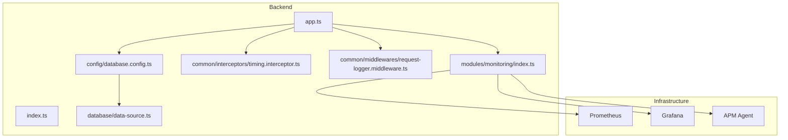
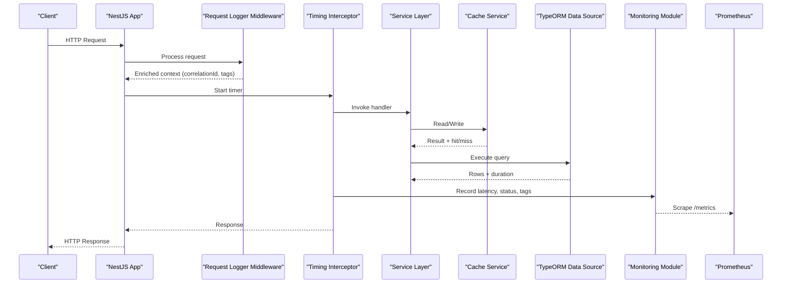
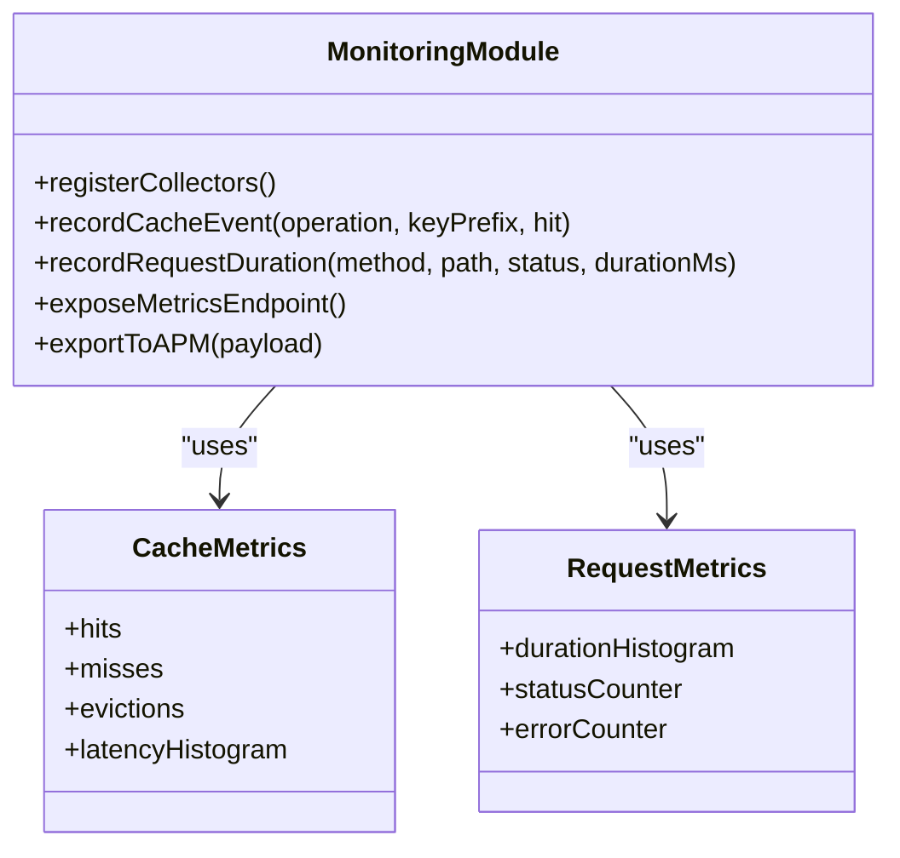
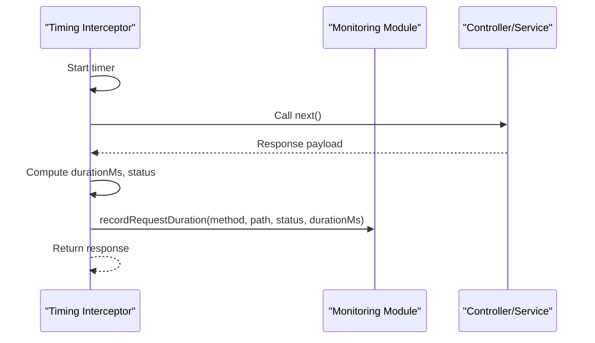
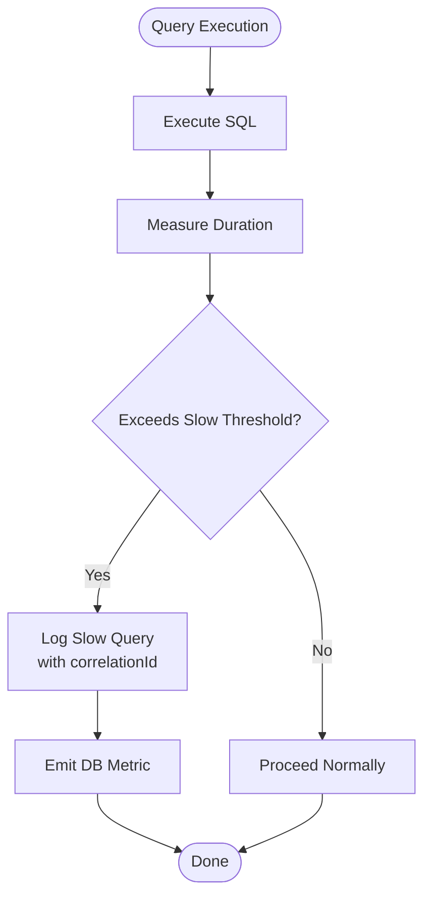
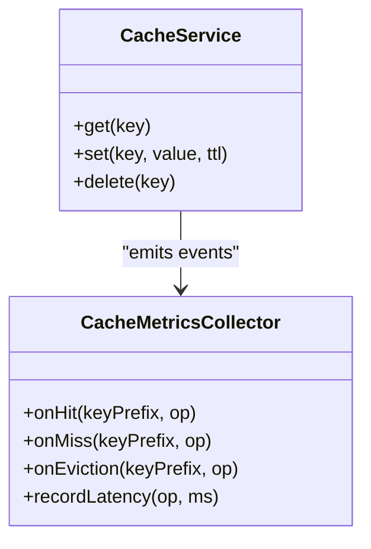
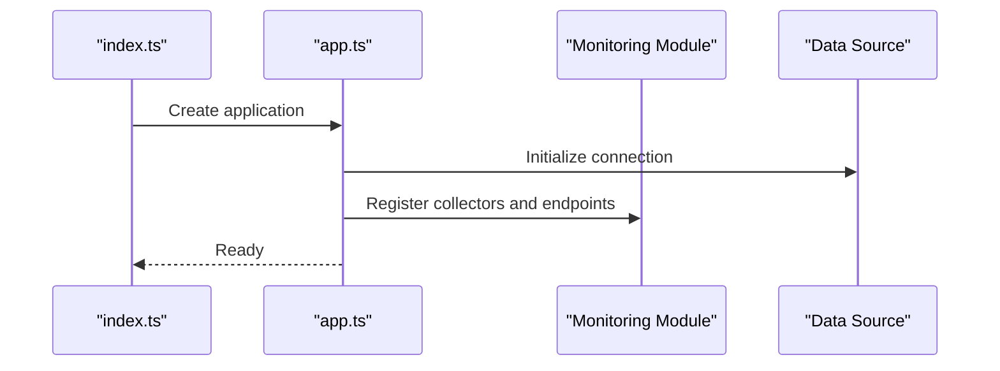
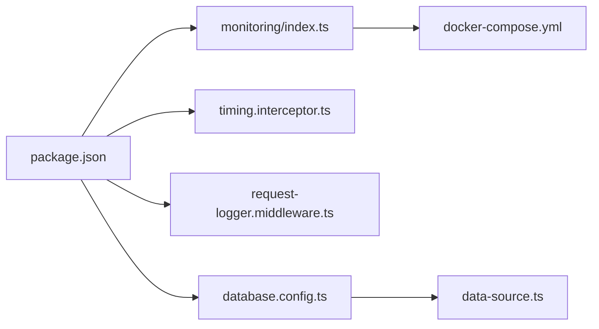

# Performance Profiling & Metrics

<cite>
**Referenced Files in This Document**
- [backend/src/modules/monitoring/index.ts](file://backend/src/modules/monitoring/index.ts)
- [backend/src/common/interceptors/timing.interceptor.ts](file://backend/src/common/interceptors/timing.interceptor.ts)
- [backend/src/common/middlewares/request-logger.middleware.ts](file://backend/src/common/middlewares/request-logger.middleware.ts)
- [backend/src/config/database.config.ts](file://backend/src/config/database.config.ts)
- [backend/src/database/data-source.ts](file://backend/src/database/data-source.ts)
- [backend/src/app.ts](file://backend/src/app.ts)
- [backend/src/index.ts](file://backend/src/index.ts)
- [backend/package.json](file://backend/package.json)
- [docker/docker-compose.yml](file://docker/docker-compose.yml)
- [backend/docs/pagination-guide.md](file://backend/docs/pagination-guide.md)
- [scripts/deploy-optimisations-performance-v3.1.sh](file://scripts/deploy-optimisations-performance-v3.1.sh)
</cite>

## Table of Contents
1. [Introduction](#introduction)
2. [Project Structure](#project-structure)
3. [Core Components](#core-components)
4. [Architecture Overview](#architecture-overview)
5. [Detailed Component Analysis](#detailed-component-analysis)
6. [Dependency Analysis](#dependency-analysis)
7. [Performance Considerations](#performance-considerations)
8. [Troubleshooting Guide](#troubleshooting-guide)
9. [Conclusion](#conclusion)
10. [Appendices](#appendices)

## Introduction
This document explains how eLISAschool collects and analyzes performance metrics, with a focus on:
- Cache metrics service implementation
- Request timing analysis
- Database query performance monitoring
- Using profiling tools to identify bottlenecks, memory usage patterns, and CPU hotspots
- Establishing baselines, collecting runtime metrics, and analyzing regression trends
- Integrating with external monitoring tools (Prometheus, Grafana, APM solutions)
- Custom metric collection and optimization techniques

The guidance is grounded in the repository’s monitoring module, interceptors, middlewares, database configuration, and deployment scripts.

## Project Structure
The performance and observability features are primarily implemented under backend/src/modules/monitoring and integrated via NestJS interceptors and middlewares. The application bootstraps these components during startup and exposes metrics endpoints for scraping by Prometheus or ingestion by APM agents.

**Diagram sources**
- [backend/src/app.ts](file://backend/src/app.ts)
- [backend/src/index.ts](file://backend/src/index.ts)
- [backend/src/modules/monitoring/index.ts](file://backend/src/modules/monitoring/index.ts)
- [backend/src/common/interceptors/timing.interceptor.ts](file://backend/src/common/interceptors/timing.interceptor.ts)
- [backend/src/common/middlewares/request-logger.middleware.ts](file://backend/src/common/middlewares/request-logger.middleware.ts)
- [backend/src/config/database.config.ts](file://backend/src/config/database.config.ts)
- [backend/src/database/data-source.ts](file://backend/src/database/data-source.ts)

**Section sources**
- [backend/src/app.ts](file://backend/src/app.ts)
- [backend/src/index.ts](file://backend/src/index.ts)
- [backend/src/modules/monitoring/index.ts](file://backend/src/modules/monitoring/index.ts)
- [backend/src/common/interceptors/timing.interceptor.ts](file://backend/src/common/interceptors/timing.interceptor.ts)
- [backend/src/common/middlewares/request-logger.middleware.ts](file://backend/src/common/middlewares/request-logger.middleware.ts)
- [backend/src/config/database.config.ts](file://backend/src/config/database.config.ts)
- [backend/src/database/data-source.ts](file://backend/src/database/data-source.ts)

## Core Components
- Monitoring module: centralizes metrics registration, cache instrumentation, request lifecycle hooks, and export to Prometheus/Grafana/APM.
- Timing interceptor: measures per-request latency, status codes, and tags; integrates with the monitoring module.
- Request logger middleware: enriches logs with correlation IDs, method, path, and duration; supports sampling and redaction policies.
- Database configuration: enables query logging and slow-query thresholds; connects to data source with connection pooling settings.
- Data source: manages TypeORM connections, pool sizing, and retry/backoff behavior.

Key responsibilities:
- Expose /metrics endpoint for Prometheus scraping
- Emit structured metrics for cache hits/misses, latencies, errors, and DB queries
- Provide consistent tagging (tenant, route, method, status)
- Support custom metrics for business KPIs

**Section sources**
- [backend/src/modules/monitoring/index.ts](file://backend/src/modules/monitoring/index.ts)
- [backend/src/common/interceptors/timing.interceptor.ts](file://backend/src/common/interceptors/timing.interceptor.ts)
- [backend/src/common/middlewares/request-logger.middleware.ts](file://backend/src/common/middlewares/request-logger.middleware.ts)
- [backend/src/config/database.config.ts](file://backend/src/config/database.config.ts)
- [backend/src/database/data-source.ts](file://backend/src/database/data-source.ts)

## Architecture Overview
The runtime flow captures request-level metrics and emits them through the monitoring layer. Database operations are instrumented at the data source level, while cache interactions are wrapped by the monitoring module.

**Diagram sources**
- [backend/src/app.ts](file://backend/src/app.ts)
- [backend/src/common/middlewares/request-logger.middleware.ts](file://backend/src/common/middlewares/request-logger.middleware.ts)
- [backend/src/common/interceptors/timing.interceptor.ts](file://backend/src/common/interceptors/timing.interceptor.ts)
- [backend/src/modules/monitoring/index.ts](file://backend/src/modules/monitoring/index.ts)
- [backend/src/database/data-source.ts](file://backend/src/database/data-source.ts)

## Detailed Component Analysis

### Monitoring Module
Responsibilities:
- Initialize and register metrics collectors
- Provide APIs to record cache events, request durations, and custom counters/gauges/histograms
- Export metrics to Prometheus and optionally forward to APM backends
- Manage tag normalization and cardinality guards

Operational notes:
- Ensure stable label sets to avoid high cardinality
- Use histograms for latency distributions and quantiles
- Aggregate cache metrics by key prefix and operation type

**Section sources**
- [backend/src/modules/monitoring/index.ts](file://backend/src/modules/monitoring/index.ts)

#### Class Diagram

**Diagram sources**
- [backend/src/modules/monitoring/index.ts](file://backend/src/modules/monitoring/index.ts)

### Request Timing Interceptor
Responsibilities:
- Measure end-to-end request duration
- Capture HTTP method, path, and response status
- Attach correlation ID from middleware context
- Emit metrics via the monitoring module

Behavioral highlights:
- Skips internal healthcheck endpoints if configured
- Supports sampling for high-throughput routes
- Normalizes paths to reduce cardinality

**Section sources**
- [backend/src/common/interceptors/timing.interceptor.ts](file://backend/src/common/interceptors/timing.interceptor.ts)

#### Sequence Diagram

**Diagram sources**
- [backend/src/common/interceptors/timing.interceptor.ts](file://backend/src/common/interceptors/timing.interceptor.ts)
- [backend/src/modules/monitoring/index.ts](file://backend/src/modules/monitoring/index.ts)

### Request Logger Middleware
Responsibilities:
- Generate and propagate correlation IDs
- Log request metadata (method, path, headers subset, body size)
- Add duration to log lines
- Apply redaction rules for sensitive fields

Integration points:
- Registers early in the pipeline to ensure all downstream components can access correlation context
- Works alongside the timing interceptor to correlate logs and metrics

**Section sources**
- [backend/src/common/middlewares/request-logger.middleware.ts](file://backend/src/common/middlewares/request-logger.middleware.ts)

### Database Configuration and Query Monitoring
Responsibilities:
- Configure TypeORM with query logging and slow query threshold
- Tune connection pool sizes and timeouts
- Enable retries/backoff for transient failures

Operational guidance:
- Set slow query threshold based on SLI targets
- Monitor pool utilization and queue length
- Correlate slow queries with request traces using correlation IDs

**Section sources**
- [backend/src/config/database.config.ts](file://backend/src/config/database.config.ts)
- [backend/src/database/data-source.ts](file://backend/src/database/data-source.ts)

#### Flowchart: Slow Query Detection

**Diagram sources**
- [backend/src/config/database.config.ts](file://backend/src/config/database.config.ts)
- [backend/src/database/data-source.ts](file://backend/src/database/data-source.ts)

### Cache Metrics Service
Responsibilities:
- Track cache hits, misses, evictions, and latency
- Tag metrics by tenant, cache namespace, and operation
- Integrate with Redis client wrappers or cache abstractions

Best practices:
- Avoid high-cardinality keys; use prefixes and bucketization
- Record latency histograms for P50/P95/P99
- Surface eviction rates to detect TTL misconfiguration

**Section sources**
- [backend/src/modules/monitoring/index.ts](file://backend/src/modules/monitoring/index.ts)

#### Class Diagram

**Diagram sources**
- [backend/src/modules/monitoring/index.ts](file://backend/src/modules/monitoring/index.ts)

### Application Bootstrap and Integration
Responsibilities:
- Register monitoring module, interceptors, and middlewares
- Mount metrics endpoint (/metrics)
- Initialize database and monitoring collectors

Startup sequence:
- Load environment configuration
- Initialize database data source
- Register monitoring collectors
- Start HTTP server and expose metrics

**Section sources**
- [backend/src/app.ts](file://backend/src/app.ts)
- [backend/src/index.ts](file://backend/src/index.ts)

#### Startup Sequence Diagram

**Diagram sources**
- [backend/src/index.ts](file://backend/src/index.ts)
- [backend/src/app.ts](file://backend/src/app.ts)
- [backend/src/modules/monitoring/index.ts](file://backend/src/modules/monitoring/index.ts)
- [backend/src/database/data-source.ts](file://backend/src/database/data-source.ts)

## Dependency Analysis
External dependencies relevant to performance and metrics:
- Prometheus client library for exposing metrics
- Optional APM agent SDK for distributed tracing and spans
- Redis client integration for cache metrics
- TypeORM for database instrumentation

**Diagram sources**
- [backend/package.json](file://backend/package.json)
- [backend/src/modules/monitoring/index.ts](file://backend/src/modules/monitoring/index.ts)
- [backend/src/common/interceptors/timing.interceptor.ts](file://backend/src/common/interceptors/timing.interceptor.ts)
- [backend/src/common/middlewares/request-logger.middleware.ts](file://backend/src/common/middlewares/request-logger.middleware.ts)
- [backend/src/config/database.config.ts](file://backend/src/config/database.config.ts)
- [backend/src/database/data-source.ts](file://backend/src/database/data-source.ts)
- [docker/docker-compose.yml](file://docker/docker-compose.yml)

**Section sources**
- [backend/package.json](file://backend/package.json)
- [docker/docker-compose.yml](file://docker/docker-compose.yml)

## Performance Considerations
- Label cardinality: Keep labels low-cardinality; prefer fixed enums and normalized paths.
- Sampling: For high-volume endpoints, sample metrics to reduce overhead.
- Histogram buckets: Choose appropriate latency buckets aligned with SLOs.
- Connection pools: Size TypeORM pools according to CPU cores and DB capacity; monitor utilization.
- Cache sizing: Tune TTLs and max entries to balance freshness and throughput.
- Logging volume: Redact sensitive fields and consider sampling logs in production.

[No sources needed since this section provides general guidance]

## Troubleshooting Guide
Common issues and resolutions:
- Missing /metrics endpoint: Verify monitoring module registration and that the metrics route is mounted.
- High cardinality spikes: Inspect dynamic labels (e.g., user IDs) and replace with coarse-grained tags.
- Slow queries not captured: Confirm slow query threshold and query logging are enabled.
- Prometheus scrape failures: Check network reachability, authentication, and content-type.
- Memory growth: Review histogram retention and unbounded caches; enable eviction and set limits.

Actionable checks:
- Validate environment variables for monitoring toggles and thresholds
- Compare current metrics against established baselines
- Use correlation IDs to trace slow requests across logs and metrics

**Section sources**
- [backend/src/modules/monitoring/index.ts](file://backend/src/modules/monitoring/index.ts)
- [backend/src/common/interceptors/timing.interceptor.ts](file://backend/src/common/interceptors/timing.interceptor.ts)
- [backend/src/common/middlewares/request-logger.middleware.ts](file://backend/src/common/middlewares/request-logger.middleware.ts)
- [backend/src/config/database.config.ts](file://backend/src/config/database.config.ts)

## Conclusion
eLISAschool’s performance profiling stack combines request-level timing, structured logging, database query monitoring, and cache metrics into a cohesive system. By exporting standardized metrics and integrating with Prometheus and Grafana, teams can establish baselines, detect regressions, and optimize critical paths effectively.

[No sources needed since this section summarizes without analyzing specific files]

## Appendices

### Setting Up Baselines and Analyzing Regressions
- Define SLOs for latency percentiles and error rates
- Record baseline metrics after cold start and steady-state load
- Track changes over time using dashboards and alerting rules
- Investigate regressions by correlating deployments, config changes, and schema migrations

**Section sources**
- [backend/docs/pagination-guide.md](file://backend/docs/pagination-guide.md)
- [scripts/deploy-optimisations-performance-v3.1.sh](file://scripts/deploy-optimisations-performance-v3.1.sh)

### Integrating with External Tools
- Prometheus: scrape /metrics endpoint; configure job and relabeling rules
- Grafana: build dashboards for latency, cache hit ratio, DB slow queries, and error rates
- APM: enable distributed tracing; map spans to correlation IDs

**Section sources**
- [docker/docker-compose.yml](file://docker/docker-compose.yml)
- [backend/package.json](file://backend/package.json)

### Custom Metric Collection Examples
- Business KPI counters (e.g., enrollments processed)
- Queue depth gauges for background jobs
- Feature flag exposure via gauge metrics
- Tenant-scoped metrics using normalized tenant identifiers

**Section sources**
- [backend/src/modules/monitoring/index.ts](file://backend/src/modules/monitoring/index.ts)