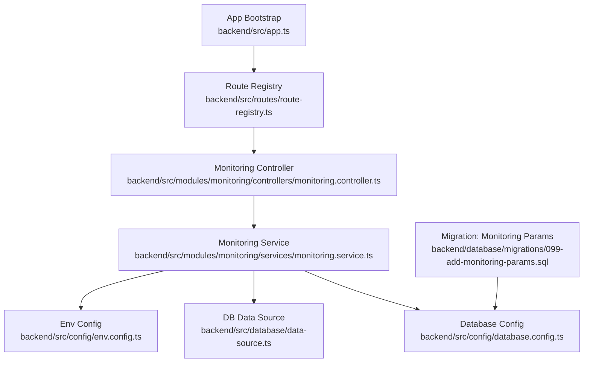
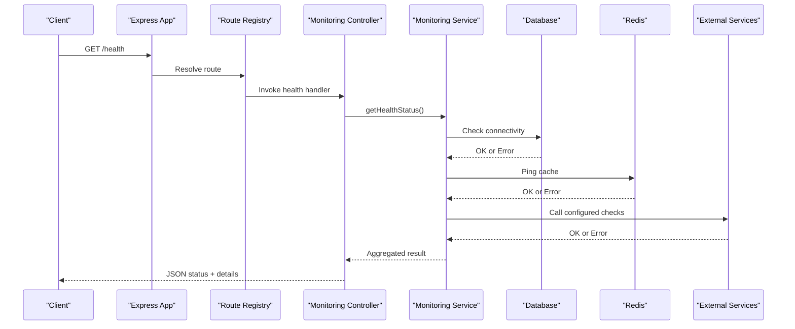
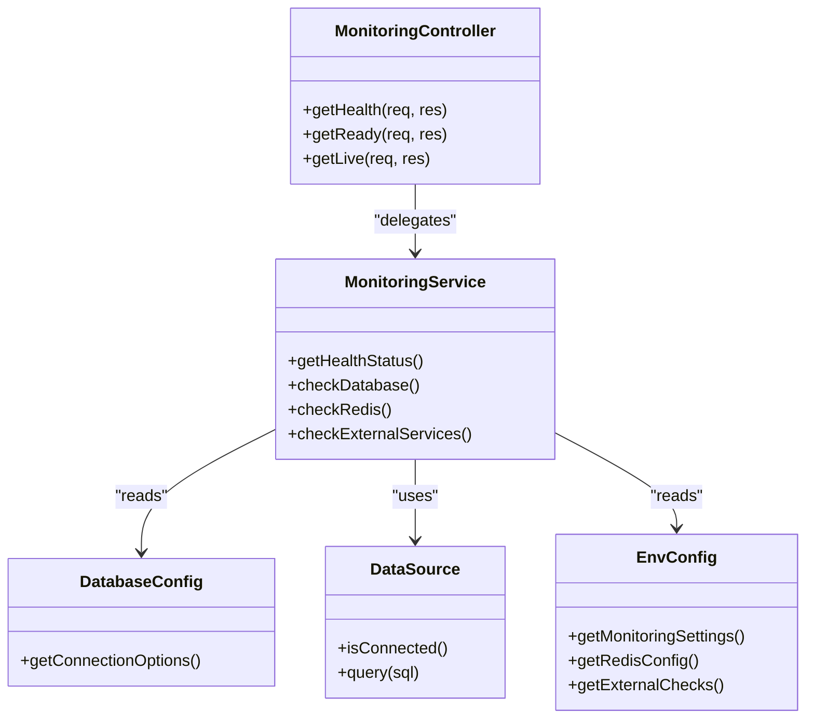

# System Health Checks

<cite>
**Referenced Files in This Document**
- [app.ts](file://backend/src/app.ts)
- [index.ts](file://backend/src/index.ts)
- [route-registry.ts](file://backend/src/routes/route-registry.ts)
- [monitoring.controller.ts](file://backend/src/modules/monitoring/controllers/monitoring.controller.ts)
- [monitoring.service.ts](file://backend/src/modules/monitoring/services/monitoring.service.ts)
- [database.config.ts](file://backend/src/config/database.config.ts)
- [env.config.ts](file://backend/src/config/env.config.ts)
- [data-source.ts](file://backend/src/database/data-source.ts)
- [099-add-monitoring-params.sql](file://backend/database/migrations/099-add-monitoring-params.sql)
- [DASHBOARD-SYSTEM.md](file://backend/docs/DASHBOARD-SYSTEM.md)
- [GUIDE-MONITORING-PERFORMANCE-RBAC.md](file://docs/guides/GUIDE-MONITORING-PERFORMANCE-RBAC.md)
</cite>

## Table of Contents
1. [Introduction](#introduction)
2. [Project Structure](#project-structure)
3. [Core Components](#core-components)
4. [Architecture Overview](#architecture-overview)
5. [Detailed Component Analysis](#detailed-component-analysis)
6. [Dependency Analysis](#dependency-analysis)
7. [Performance Considerations](#performance-considerations)
8. [Troubleshooting Guide](#troubleshooting-guide)
9. [Conclusion](#conclusion)
10. [Appendices](#appendices)

## Introduction
This document describes the eLISAschool system health checks and monitoring capabilities. It covers built-in health check endpoints, database connectivity verification, Redis cache status, service dependency health, configuration for custom health checks, example responses, error codes, troubleshooting procedures, and integration with monitoring dashboards and alerting in production environments.

## Project Structure
The health check and monitoring features are implemented under the backend module structure:
- Application bootstrap and route registration
- Monitoring module (controller and service)
- Database configuration and data source initialization
- Environment configuration
- Migration artifacts for monitoring parameters
- Documentation references for dashboard and performance monitoring

**Diagram sources**
- [app.ts](file://backend/src/app.ts)
- [route-registry.ts](file://backend/src/routes/route-registry.ts)
- [monitoring.controller.ts](file://backend/src/modules/monitoring/controllers/monitoring.controller.ts)
- [monitoring.service.ts](file://backend/src/modules/monitoring/services/monitoring.service.ts)
- [database.config.ts](file://backend/src/config/database.config.ts)
- [data-source.ts](file://backend/src/database/data-source.ts)
- [env.config.ts](file://backend/src/config/env.config.ts)
- [099-add-monitoring-params.sql](file://backend/database/migrations/099-add-monitoring-params.sql)

**Section sources**
- [app.ts](file://backend/src/app.ts)
- [index.ts](file://backend/src/index.ts)
- [route-registry.ts](file://backend/src/routes/route-registry.ts)

## Core Components
- Monitoring controller: Exposes HTTP endpoints for health checks and liveness/readiness probes.
- Monitoring service: Orchestrates checks across dependencies (database, Redis, external services), aggregates results, and formats responses.
- Configuration: Reads environment variables to enable/disable checks and tune timeouts.
- Database layer: Uses TypeORM data source to verify connectivity and schema readiness.
- Migrations: Provide persistence for monitoring parameters when applicable.

Key responsibilities:
- Real-time system status aggregation
- Dependency health verification (database, Redis, third-party services)
- Standardized response format with status codes and diagnostics
- Extensibility for custom health checks

**Section sources**
- [monitoring.controller.ts](file://backend/src/modules/monitoring/controllers/monitoring.controller.ts)
- [monitoring.service.ts](file://backend/src/modules/monitoring/services/monitoring.service.ts)
- [database.config.ts](file://backend/src/config/database.config.ts)
- [env.config.ts](file://backend/src/config/env.config.ts)
- [data-source.ts](file://backend/src/database/data-source.ts)
- [099-add-monitoring-params.sql](file://backend/database/migrations/099-add-monitoring-params.sql)

## Architecture Overview
The health check flow is request-driven:
- Client calls a health endpoint
- Controller delegates to the monitoring service
- Service queries each dependency (database, Redis, configured external services)
- Results are aggregated into a single response with overall status and per-dependency details

**Diagram sources**
- [app.ts](file://backend/src/app.ts)
- [route-registry.ts](file://backend/src/routes/route-registry.ts)
- [monitoring.controller.ts](file://backend/src/modules/monitoring/controllers/monitoring.controller.ts)
- [monitoring.service.ts](file://backend/src/modules/monitoring/services/monitoring.service.ts)
- [database.config.ts](file://backend/src/config/database.config.ts)
- [data-source.ts](file://backend/src/database/data-source.ts)
- [env.config.ts](file://backend/src/config/env.config.ts)

## Detailed Component Analysis

### Monitoring Controller
Responsibilities:
- Define routes for health checks (e.g., /health, /ready, /live)
- Accept optional query parameters to include detailed diagnostics
- Return standardized JSON responses with HTTP status codes reflecting overall health

Operational notes:
- Readiness vs Liveness: readiness indicates all critical dependencies are healthy; liveness indicates process is alive regardless of dependencies.
- Response includes timestamp, version, and per-dependency statuses.

**Section sources**
- [monitoring.controller.ts](file://backend/src/modules/monitoring/controllers/monitoring.controller.ts)
- [route-registry.ts](file://backend/src/routes/route-registry.ts)

### Monitoring Service
Responsibilities:
- Orchestrate dependency checks
- Aggregate results and compute overall status
- Support custom health checks via configuration
- Enforce timeouts and circuit-breaker-like behavior for external services

Implementation patterns:
- Parallel execution of independent checks with timeout guards
- Result normalization to consistent shape
- Logging and metrics hooks for observability

Custom health checks:
- Register additional checks through configuration or plugin points
- Each check returns a status object with success/failure and diagnostic info

**Section sources**
- [monitoring.service.ts](file://backend/src/modules/monitoring/services/monitoring.service.ts)
- [env.config.ts](file://backend/src/config/env.config.ts)

### Database Connectivity Verification
Responsibilities:
- Verify TypeORM connection state
- Execute a lightweight query to confirm schema readiness
- Report latency and error details

Configuration:
- Connection settings from environment
- Retry/backoff strategy for transient failures

**Section sources**
- [database.config.ts](file://backend/src/config/database.config.ts)
- [data-source.ts](file://backend/src/database/data-source.ts)

### Redis Cache Status
Responsibilities:
- Ping Redis server
- Validate basic operations (ping/set/get) if needed
- Report latency and errors

Configuration:
- Host, port, credentials from environment
- Optional TLS and cluster mode flags

**Section sources**
- [env.config.ts](file://backend/src/config/env.config.ts)

### External Services and Third-Party Integrations
Responsibilities:
- Health-check configurable external endpoints
- Respect timeouts and failure thresholds
- Include provider-specific diagnostics

Configuration:
- List of external services with URLs and expected behaviors
- Enable/disable per environment

**Section sources**
- [monitoring.service.ts](file://backend/src/modules/monitoring/services/monitoring.service.ts)
- [env.config.ts](file://backend/src/config/env.config.ts)

### Example Health Check Responses
Overall status values:
- healthy: All critical checks passed
- degraded: Non-critical checks failed or high latency
- unhealthy: Critical checks failed

Response fields:
- status: Overall health
- timestamp: ISO time
- version: Application version
- dependencies: Map of dependency name to status and diagnostics
- uptime: Process uptime in seconds

HTTP status codes:
- 200: healthy
- 503: unhealthy or degraded depending on policy

Note: The exact field names and structure are defined by the monitoring service implementation.

[No sources needed since this section provides general guidance]

### Custom Health Checks Configuration
How to add a custom check:
- Add an entry in the monitoring configuration for the external service
- Implement a check function that returns a status object
- Ensure the check respects global timeout settings

Best practices:
- Keep checks fast and idempotent
- Avoid heavy I/O or side effects
- Use separate timeouts for network-bound checks

**Section sources**
- [monitoring.service.ts](file://backend/src/modules/monitoring/services/monitoring.service.ts)
- [env.config.ts](file://backend/src/config/env.config.ts)

### Monitoring Dashboard Integration
Integration points:
- Export metrics and health status for scraping by Prometheus or similar tools
- Provide structured logs for log aggregators
- Reference documentation for dashboard setup and panels

References:
- Dashboard system overview
- Performance monitoring guide

**Section sources**
- [DASHBOARD-SYSTEM.md](file://backend/docs/DASHBOARD-SYSTEM.md)
- [GUIDE-MONITORING-PERFORMANCE-RBAC.md](file://docs/guides/GUIDE-MONITORING-PERFORMANCE-RBAC.md)

## Dependency Analysis
High-level dependencies among health check components:

**Diagram sources**
- [monitoring.controller.ts](file://backend/src/modules/monitoring/controllers/monitoring.controller.ts)
- [monitoring.service.ts](file://backend/src/modules/monitoring/services/monitoring.service.ts)
- [database.config.ts](file://backend/src/config/database.config.ts)
- [data-source.ts](file://backend/src/database/data-source.ts)
- [env.config.ts](file://backend/src/config/env.config.ts)

**Section sources**
- [monitoring.controller.ts](file://backend/src/modules/monitoring/controllers/monitoring.controller.ts)
- [monitoring.service.ts](file://backend/src/modules/monitoring/services/monitoring.service.ts)
- [database.config.ts](file://backend/src/config/database.config.ts)
- [data-source.ts](file://backend/src/database/data-source.ts)
- [env.config.ts](file://backend/src/config/env.config.ts)

## Performance Considerations
- Keep health checks lightweight and fast
- Use parallel execution for independent checks
- Apply timeouts to avoid blocking requests
- Avoid writing to persistent storage during health checks
- Cache non-volatile configuration where appropriate

[No sources needed since this section provides general guidance]

## Troubleshooting Guide
Common issues and resolutions:
- Database unreachable:
  - Verify connection parameters and network access
  - Confirm migrations are applied
  - Check database logs for authentication or permission errors
- Redis not responding:
  - Validate host/port and credentials
  - Ensure firewall rules allow traffic
  - Check Redis logs for memory or connection limits
- External service failures:
  - Inspect URL and authentication
  - Review timeouts and retry policies
  - Validate certificate chains for HTTPS endpoints
- High latency:
  - Profile dependency response times
  - Adjust timeouts and concurrency limits
  - Investigate resource contention (CPU, memory, I/O)

Operational tips:
- Use readiness probe to prevent routing traffic until fully ready
- Use liveness probe to restart unresponsive processes
- Log detailed diagnostics for each dependency failure

**Section sources**
- [monitoring.service.ts](file://backend/src/modules/monitoring/services/monitoring.service.ts)
- [database.config.ts](file://backend/src/config/database.config.ts)
- [data-source.ts](file://backend/src/database/data-source.ts)
- [env.config.ts](file://backend/src/config/env.config.ts)

## Conclusion
The eLISAschool health check system provides a robust foundation for operational visibility. It exposes clear endpoints, verifies critical dependencies, supports custom checks, and integrates with dashboards and alerting systems. By following the configuration and troubleshooting guidance, teams can maintain high availability and quickly diagnose issues in production.

[No sources needed since this section summarizes without analyzing specific files]

## Appendices

### Health Check Endpoints Summary
- GET /health: Returns overall health and dependency details
- GET /ready: Readiness probe indicating if the service can accept traffic
- GET /live: Liveness probe indicating if the process is alive

Notes:
- Exact paths may vary based on route registration
- Query parameters can control verbosity of diagnostics

**Section sources**
- [monitoring.controller.ts](file://backend/src/modules/monitoring/controllers/monitoring.controller.ts)
- [route-registry.ts](file://backend/src/routes/route-registry.ts)

### Monitoring Parameters Migration
A migration exists to add monitoring-related parameters to the database schema.

**Section sources**
- [099-add-monitoring-params.sql](file://backend/database/migrations/099-add-monitoring-params.sql)