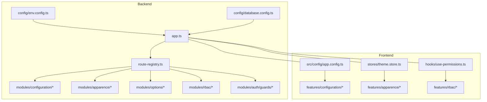
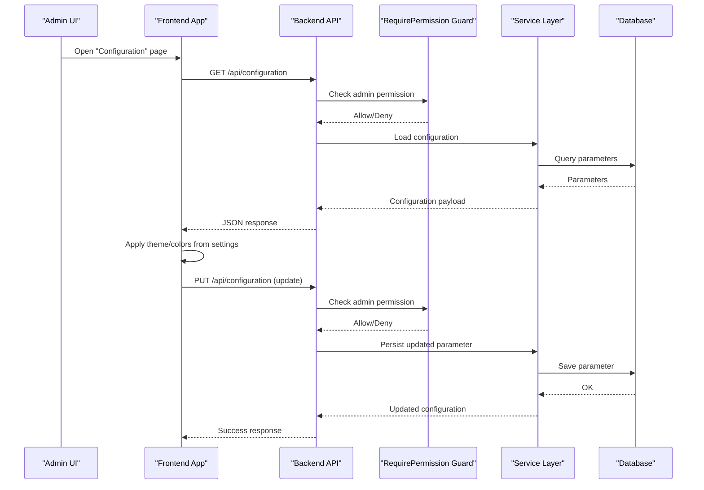
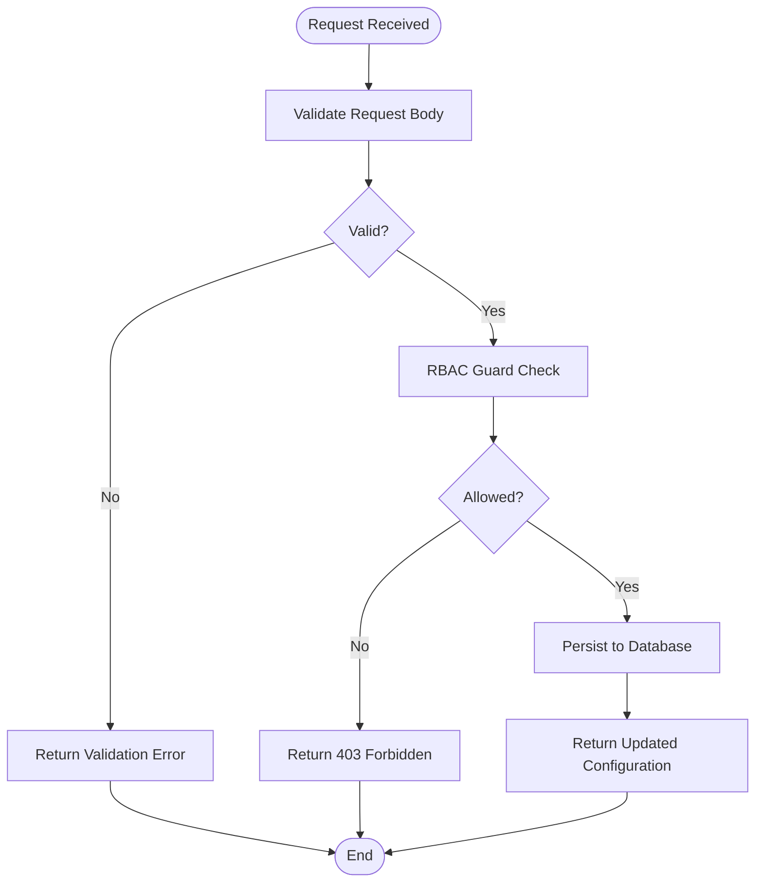
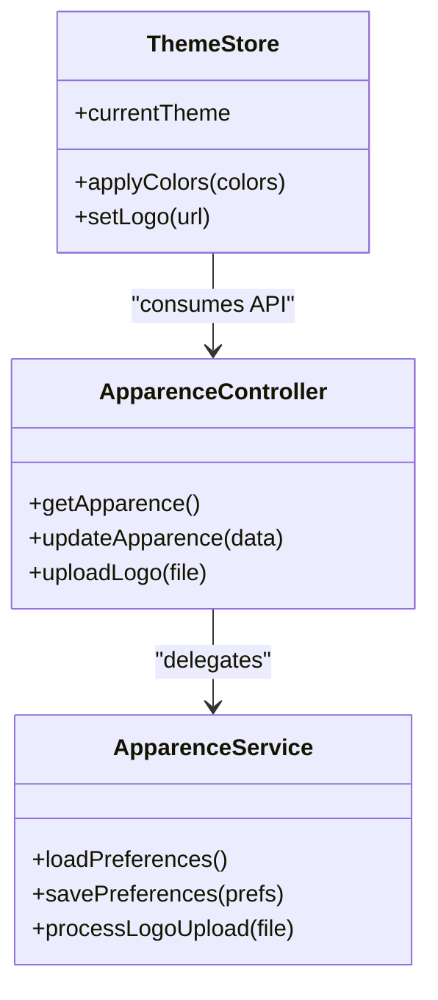
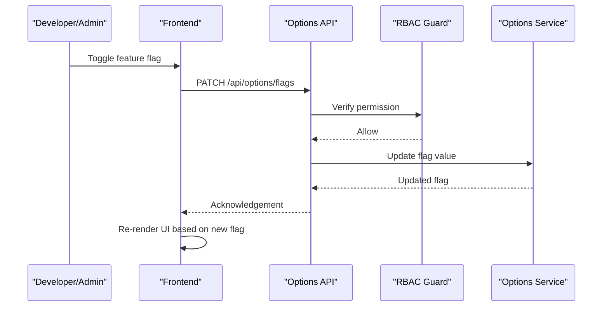
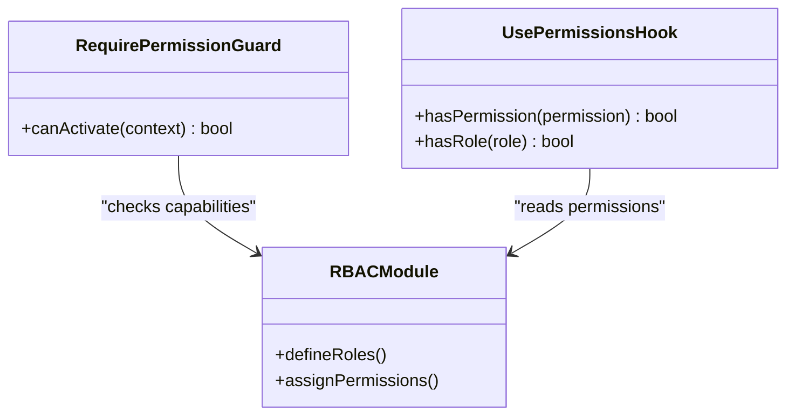
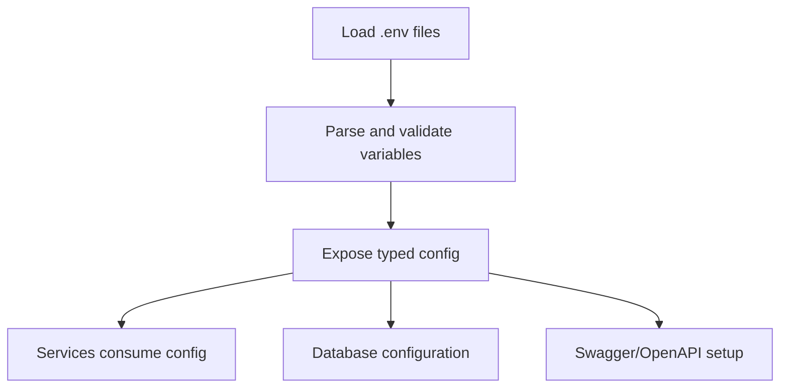
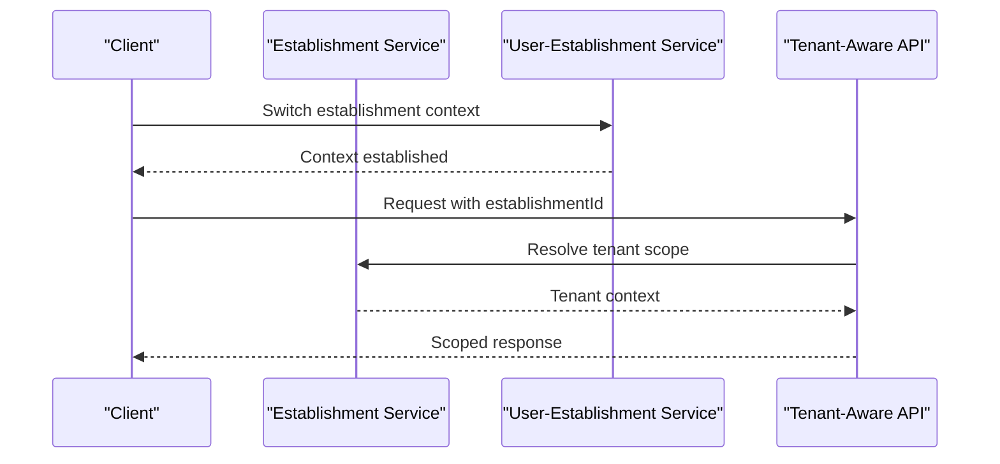
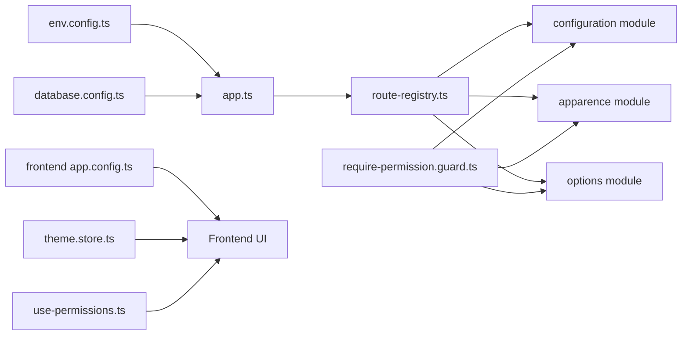

# Configuration & Customization

<cite>
**Referenced Files in This Document**
- [backend/src/modules/configuration/index.ts](file://backend/src/modules/configuration/index.ts)
- [backend/src/modules/configuration/services/configuration.service.ts](file://backend/src/modules/configuration/services/configuration.service.ts)
- [backend/src/modules/configuration/controllers/configuration.controller.ts](file://backend/src/modules/configuration/controllers/configuration.controller.ts)
- [backend/src/modules/apparence/index.ts](file://backend/src/modules/apparence/index.ts)
- [backend/src/modules/apparence/services/apparence.service.ts](file://backend/src/modules/apparence/services/apparence.service.ts)
- [backend/src/modules/apparence/controllers/apparence.controller.ts](file://backend/src/modules/apparence/controllers/apparence.controller.ts)
- [backend/src/modules/rbac/index.ts](file://backend/src/modules/rbac/index.ts)
- [backend/src/modules/auth/guards/require-permission.guard.ts](file://backend/src/modules/auth/guards/require-permission.guard.ts)
- [backend/src/config/env.config.ts](file://backend/src/config/env.config.ts)
- [backend/src/config/database.config.ts](file://backend/src/config/database.config.ts)
- [backend/src/config/swagger.config.ts](file://backend/src/config/swagger.config.ts)
- [backend/src/app.ts](file://backend/src/app.ts)
- [backend/src/routes/route-registry.ts](file://backend/src/routes/route-registry.ts)
- [backend/src/modules/options/index.ts](file://backend/src/modules/options/index.ts)
- [backend/src/modules/options/services/options.service.ts](file://backend/src/modules/options/services/options.service.ts)
- [backend/src/modules/options/controllers/options.controller.ts](file://backend/src/modules/options/controllers/options.controller.ts)
- [backend/src/modules/etablissement/index.ts](file://backend/src/modules/etablissement/index.ts)
- [backend/src/modules/etablissement/services/etablissement.service.ts](file://backend/src/modules/etablissement/services/etablissement.service.ts)
- [backend/src/modules/etablissement/controllers/etablissement.controller.ts](file://backend/src/modules/etablissement/controllers/etablissement.controller.ts)
- [backend/src/modules/utilisateurs/index.ts](file://backend/src/modules/utilisateurs/index.ts)
- [backend/src/modules/utilisateurs/services/utilisateur-etablissement.service.ts](file://backend/src/modules/utilisateurs/services/utilisateur-etablissement.service.ts)
- [backend/src/modules/utilisateurs/controllers/utilisateur-etablissement.controller.ts](file://backend/src/modules/utilisateurs/controllers/utilisateur-etablissement.controller.ts)
- [backend/src/modules/dashboard/index.ts](file://backend/src/modules/dashboard/index.ts)
- [backend/src/modules/dashboard/services/dashboard.service.ts](file://backend/src/modules/dashboard/services/dashboard.service.ts)
- [backend/src/modules/dashboard/controllers/dashboard.controller.ts](file://backend/src/modules/dashboard/controllers/dashboard.controller.ts)
- [backend/src/modules/types-enum/index.ts](file://backend/src/modules/types-enum/index.ts)
- [backend/src/modules/types-enum/services/types-enum.service.ts](file://backend/src/modules/types-enum/services/types-enum.service.ts)
- [backend/src/modules/types-enum/controllers/types-enum.controller.ts](file://backend/src/modules/types-enum/controllers/types-enum.controller.ts)
- [backend/src/modules/organisation/index.ts](file://backend/src/modules/organisation/index.ts)
- [backend/src/modules/organisation/services/organisation.service.ts](file://backend/src/modules/organisation/services/organisation.service.ts)
- [backend/src/modules/organisation/controllers/organisation.controller.ts](file://backend/src/modules/organisation/controllers/organisation.controller.ts)
- [backend/src/modules/notifications/index.ts](file://backend/src/modules/notifications/index.ts)
- [backend/src/modules/notifications/services/notifications.service.ts](file://backend/src/modules/notifications/services/notifications.service.ts)
- [backend/src/modules/notifications/controllers/notifications.controller.ts](file://backend/src/modules/notifications/controllers/notifications.controller.ts)
- [backend/src/modules/monitoring/index.ts](file://backend/src/modules/monitoring/index.ts)
- [backend/src/modules/monitoring/services/monitoring.service.ts](file://backend/src/modules/monitoring/services/monitoring.service.ts)
- [backend/src/modules/monitoring/controllers/monitoring.controller.ts](file://backend/src/modules/monitoring/controllers/monitoring.controller.ts)
- [backend/src/modules/dev/controllers/dev-controller.ts](file://backend/src/modules/dev/controllers/dev-controller.ts)
- [backend/scripts/run-migration.ts](file://backend/scripts/run-migration.ts)
- [backend/scripts/migrate-config-app-to-parametres.ts](file://backend/scripts/migrate-config-app-to-parametres.ts)
- [backend/scripts/migrate-etablissement-config-to-parametres.ts](file://backend/scripts/migrate-etablissement-config-to-parametres.ts)
- [backend/scripts/verify-configuration-integrity.ts](file://backend/scripts/verify-configuration-integrity.ts)
- [backend/deploy-all-migrations.sh](file://backend/deploy-all-migrations.sh)
- [docker/docker-compose.yml](file://docker/docker-compose.yml)
- [frontend/src/config/app.config.ts](file://frontend/src/config/app.config.ts)
- [frontend/src/stores/theme.store.ts](file://frontend/src/stores/theme.store.ts)
- [frontend/src/hooks/use-permissions.ts](file://frontend/src/hooks/use-permissions.ts)
- [frontend/src/features/configuration/index.tsx](file://frontend/src/features/configuration/index.tsx)
- [frontend/src/features/apparence/index.tsx](file://frontend/src/features/apparence/index.tsx)
- [frontend/src/features/rbac/index.tsx](file://frontend/src/features/rbac/index.tsx)
</cite>

## Table of Contents
1. [Introduction](#introduction)
2. [Project Structure](#project-structure)
3. [Core Components](#core-components)
4. [Architecture Overview](#architecture-overview)
5. [Detailed Component Analysis](#detailed-component-analysis)
6. [Dependency Analysis](#dependency-analysis)
7. [Performance Considerations](#performance-considerations)
8. [Troubleshooting Guide](#troubleshooting-guide)
9. [Conclusion](#conclusion)
10. [Appendices](#appendices)

## Introduction
This document provides an FAQ-style guide to configuration and customization for the system, focusing on:
- Module activation and deactivation
- System preference management
- Environment-specific settings
- Branding customization (logo, theme, color scheme)
- Feature flags, permissions, and role-based access control (RBAC)
- Extending functionality with custom modules and modifying existing features while preserving integrity

It is designed for administrators, integrators, and developers who need to configure and tailor the platform across environments without compromising stability or security.

## Project Structure
Configuration and customization span both backend and frontend layers:
- Backend:
  - Centralized configuration module for application-wide parameters
  - Apparence module for branding assets and visual preferences
  - Options module for feature toggles and runtime options
  - RBAC and Auth guards for permission enforcement
  - Environment configuration loader and database config
  - Route registry and app bootstrap wiring
- Frontend:
  - App-level configuration and theme store
  - Feature pages for configuration, appearance, and RBAC
  - Permission hooks for UI gating

**Diagram sources**
- [backend/src/app.ts](file://backend/src/app.ts)
- [backend/src/routes/route-registry.ts](file://backend/src/routes/route-registry.ts)
- [backend/src/config/env.config.ts](file://backend/src/config/env.config.ts)
- [backend/src/config/database.config.ts](file://backend/src/config/database.config.ts)
- [backend/src/modules/configuration/index.ts](file://backend/src/modules/configuration/index.ts)
- [backend/src/modules/apparence/index.ts](file://backend/src/modules/apparence/index.ts)
- [backend/src/modules/options/index.ts](file://backend/src/modules/options/index.ts)
- [backend/src/modules/rbac/index.ts](file://backend/src/modules/rbac/index.ts)
- [backend/src/modules/auth/guards/require-permission.guard.ts](file://backend/src/modules/auth/guards/require-permission.guard.ts)
- [frontend/src/config/app.config.ts](file://frontend/src/config/app.config.ts)
- [frontend/src/stores/theme.store.ts](file://frontend/src/stores/theme.store.ts)
- [frontend/src/features/configuration/index.tsx](file://frontend/src/features/configuration/index.tsx)
- [frontend/src/features/apparence/index.tsx](file://frontend/src/features/apparence/index.tsx)
- [frontend/src/features/rbac/index.tsx](file://frontend/src/features/rbac/index.tsx)
- [frontend/src/hooks/use-permissions.ts](file://frontend/src/hooks/use-permissions.ts)

**Section sources**
- [backend/src/app.ts](file://backend/src/app.ts)
- [backend/src/routes/route-registry.ts](file://backend/src/routes/route-registry.ts)
- [backend/src/config/env.config.ts](file://backend/src/config/env.config.ts)
- [backend/src/config/database.config.ts](file://backend/src/config/database.config.ts)
- [backend/src/modules/configuration/index.ts](file://backend/src/modules/configuration/index.ts)
- [backend/src/modules/apparence/index.ts](file://backend/src/modules/apparence/index.ts)
- [backend/src/modules/options/index.ts](file://backend/src/modules/options/index.ts)
- [backend/src/modules/rbac/index.ts](file://backend/src/modules/rbac/index.ts)
- [backend/src/modules/auth/guards/require-permission.guard.ts](file://backend/src/modules/auth/guards/require-permission.guard.ts)
- [frontend/src/config/app.config.ts](file://frontend/src/config/app.config.ts)
- [frontend/src/stores/theme.store.ts](file://frontend/src/stores/theme.store.ts)
- [frontend/src/features/configuration/index.tsx](file://frontend/src/features/configuration/index.tsx)
- [frontend/src/features/apparence/index.tsx](file://frontend/src/features/apparence/index.tsx)
- [frontend/src/features/rbac/index.tsx](file://frontend/src/features/rbac/index.tsx)
- [frontend/src/hooks/use-permissions.ts](file://frontend/src/hooks/use-permissions.ts)

## Core Components
- Configuration Service and Controller: Provide CRUD operations for application-wide parameters and environment overrides.
- Apparence Service and Controller: Manage branding assets (logos, backgrounds), themes, and color schemes.
- Options Service and Controller: Handle feature flags and runtime toggles.
- RBAC and Auth Guards: Enforce permissions at API level; integrate with roles and capabilities.
- Environment Config Loader: Reads environment variables and exposes typed configuration.
- Database Config: Manages connection settings and migration readiness.
- Frontend App Config and Theme Store: Drive UI behavior, theming, and feature visibility.
- Permission Hook: Provides client-side checks for UI elements based on user permissions.

**Section sources**
- [backend/src/modules/configuration/services/configuration.service.ts](file://backend/src/modules/configuration/services/configuration.service.ts)
- [backend/src/modules/configuration/controllers/configuration.controller.ts](file://backend/src/modules/configuration/controllers/configuration.controller.ts)
- [backend/src/modules/apparence/services/apparence.service.ts](file://backend/src/modules/apparence/services/apparence.service.ts)
- [backend/src/modules/apparence/controllers/apparence.controller.ts](file://backend/src/modules/apparence/controllers/apparence.controller.ts)
- [backend/src/modules/options/services/options.service.ts](file://backend/src/modules/options/services/options.service.ts)
- [backend/src/modules/options/controllers/options.controller.ts](file://backend/src/modules/options/controllers/options.controller.ts)
- [backend/src/modules/rbac/index.ts](file://backend/src/modules/rbac/index.ts)
- [backend/src/modules/auth/guards/require-permission.guard.ts](file://backend/src/modules/auth/guards/require-permission.guard.ts)
- [backend/src/config/env.config.ts](file://backend/src/config/env.config.ts)
- [backend/src/config/database.config.ts](file://backend/src/config/database.config.ts)
- [frontend/src/config/app.config.ts](file://frontend/src/config/app.config.ts)
- [frontend/src/stores/theme.store.ts](file://frontend/src/stores/theme.store.ts)
- [frontend/src/hooks/use-permissions.ts](file://frontend/src/hooks/use-permissions.ts)

## Architecture Overview
The configuration and customization architecture centers around a small set of cohesive modules that expose REST endpoints, enforce permissions via guards, and persist settings to the database. The frontend consumes these APIs and applies local theming and feature flags.

**Diagram sources**
- [backend/src/modules/configuration/controllers/configuration.controller.ts](file://backend/src/modules/configuration/controllers/configuration.controller.ts)
- [backend/src/modules/configuration/services/configuration.service.ts](file://backend/src/modules/configuration/services/configuration.service.ts)
- [backend/src/modules/auth/guards/require-permission.guard.ts](file://backend/src/modules/auth/guards/require-permission.guard.ts)
- [backend/src/config/database.config.ts](file://backend/src/config/database.config.ts)
- [frontend/src/features/configuration/index.tsx](file://frontend/src/features/configuration/index.tsx)

## Detailed Component Analysis

### Configuration Management
- Purpose: Centralize application-wide settings such as module activation flags, default behaviors, and tenant-scoped parameters.
- Key responsibilities:
  - Read/write configuration entries
  - Validate inputs and ensure uniqueness constraints
  - Expose endpoints guarded by RBAC
- Typical flows:
  - List all parameters
  - Update a specific parameter
  - Bulk update multiple parameters
  - Reset to defaults (if supported)

**Diagram sources**
- [backend/src/modules/configuration/controllers/configuration.controller.ts](file://backend/src/modules/configuration/controllers/configuration.controller.ts)
- [backend/src/modules/configuration/services/configuration.service.ts](file://backend/src/modules/configuration/services/configuration.service.ts)
- [backend/src/modules/auth/guards/require-permission.guard.ts](file://backend/src/modules/auth/guards/require-permission.guard.ts)

**Section sources**
- [backend/src/modules/configuration/index.ts](file://backend/src/modules/configuration/index.ts)
- [backend/src/modules/configuration/services/configuration.service.ts](file://backend/src/modules/configuration/services/configuration.service.ts)
- [backend/src/modules/configuration/controllers/configuration.controller.ts](file://backend/src/modules/configuration/controllers/configuration.controller.ts)

### Apparence (Branding and Theming)
- Purpose: Manage logos, backgrounds, themes, and color schemes per establishment or globally.
- Capabilities:
  - Upload and replace logo assets
  - Configure primary/secondary colors and theme variants
  - Persist preferences and serve them to the frontend
- Integration points:
  - Frontend theme store reads current apparence settings
  - UI components reactively apply styles based on stored values

**Diagram sources**
- [backend/src/modules/apparence/controllers/apparence.controller.ts](file://backend/src/modules/apparence/controllers/apparence.controller.ts)
- [backend/src/modules/apparence/services/apparence.service.ts](file://backend/src/modules/apparence/services/apparence.service.ts)
- [frontend/src/stores/theme.store.ts](file://frontend/src/stores/theme.store.ts)

**Section sources**
- [backend/src/modules/apparence/index.ts](file://backend/src/modules/apparence/index.ts)
- [backend/src/modules/apparence/services/apparence.service.ts](file://backend/src/modules/apparence/services/apparence.service.ts)
- [backend/src/modules/apparence/controllers/apparence.controller.ts](file://backend/src/modules/apparence/controllers/apparence.controller.ts)
- [frontend/src/stores/theme.store.ts](file://frontend/src/stores/theme.store.ts)

### Options (Feature Flags and Runtime Toggles)
- Purpose: Control feature availability and behavioral toggles without redeployment.
- Typical use cases:
  - Enable/disable experimental features
  - Toggle maintenance mode or restricted access
  - Adjust performance-related switches
- Access control:
  - Protected by RBAC to prevent unauthorized changes

**Diagram sources**
- [backend/src/modules/options/controllers/options.controller.ts](file://backend/src/modules/options/controllers/options.controller.ts)
- [backend/src/modules/options/services/options.service.ts](file://backend/src/modules/options/services/options.service.ts)
- [backend/src/modules/auth/guards/require-permission.guard.ts](file://backend/src/modules/auth/guards/require-permission.guard.ts)

**Section sources**
- [backend/src/modules/options/index.ts](file://backend/src/modules/options/index.ts)
- [backend/src/modules/options/services/options.service.ts](file://backend/src/modules/options/services/options.service.ts)
- [backend/src/modules/options/controllers/options.controller.ts](file://backend/src/modules/options/controllers/options.controller.ts)

### RBAC and Permissions
- Purpose: Define roles, permissions, and enforce access at API and UI levels.
- Key elements:
  - RequirePermission guard validates requests against user capabilities
  - Roles map to sets of permissions
  - Frontend hook uses current user’s permissions to gate UI actions

**Diagram sources**
- [backend/src/modules/auth/guards/require-permission.guard.ts](file://backend/src/modules/auth/guards/require-permission.guard.ts)
- [backend/src/modules/rbac/index.ts](file://backend/src/modules/rbac/index.ts)
- [frontend/src/hooks/use-permissions.ts](file://frontend/src/hooks/use-permissions.ts)

**Section sources**
- [backend/src/modules/rbac/index.ts](file://backend/src/modules/rbac/index.ts)
- [backend/src/modules/auth/guards/require-permission.guard.ts](file://backend/src/modules/auth/guards/require-permission.guard.ts)
- [frontend/src/hooks/use-permissions.ts](file://frontend/src/hooks/use-permissions.ts)

### Environment-Specific Settings
- Purpose: Separate configuration across development, staging, and production using environment variables.
- Responsibilities:
  - Load and validate environment variables
  - Provide typed accessors for services
  - Integrate with database configuration and Swagger setup

**Diagram sources**
- [backend/src/config/env.config.ts](file://backend/src/config/env.config.ts)
- [backend/src/config/database.config.ts](file://backend/src/config/database.config.ts)
- [backend/src/config/swagger.config.ts](file://backend/src/config/swagger.config.ts)

**Section sources**
- [backend/src/config/env.config.ts](file://backend/src/config/env.config.ts)
- [backend/src/config/database.config.ts](file://backend/src/config/database.config.ts)
- [backend/src/config/swagger.config.ts](file://backend/src/config/swagger.config.ts)

### Multi-Tenant and Establishment Context
- Purpose: Scope configuration, branding, and permissions to establishments.
- Highlights:
  - Establishment service manages entity context
  - User-establishment mapping ensures isolation
  - Dashboard and other modules adapt to tenant context

**Diagram sources**
- [backend/src/modules/etablissement/services/etablissement.service.ts](file://backend/src/modules/etablissement/services/etablissement.service.ts)
- [backend/src/modules/utilisateurs/services/utilisateur-etablissement.service.ts](file://backend/src/modules/utilisateurs/services/utilisateur-etablissement.service.ts)
- [backend/src/modules/dashboard/services/dashboard.service.ts](file://backend/src/modules/dashboard/services/dashboard.service.ts)

**Section sources**
- [backend/src/modules/etablissement/index.ts](file://backend/src/modules/etablissement/index.ts)
- [backend/src/modules/etablissement/services/etablissement.service.ts](file://backend/src/modules/etablissement/services/etablissement.service.ts)
- [backend/src/modules/etablissement/controllers/etablissement.controller.ts](file://backend/src/modules/etablissement/controllers/etablissement.controller.ts)
- [backend/src/modules/utilisateurs/index.ts](file://backend/src/modules/utilisateurs/index.ts)
- [backend/src/modules/utilisateurs/services/utilisateur-etablissement.service.ts](file://backend/src/modules/utilisateurs/services/utilisateur-etablissement.service.ts)
- [backend/src/modules/utilisateurs/controllers/utilisateur-etablissement.controller.ts](file://backend/src/modules/utilisateurs/controllers/utilisateur-etablissement.controller.ts)
- [backend/src/modules/dashboard/index.ts](file://backend/src/modules/dashboard/index.ts)
- [backend/src/modules/dashboard/services/dashboard.service.ts](file://backend/src/modules/dashboard/services/dashboard.service.ts)
- [backend/src/modules/dashboard/controllers/dashboard.controller.ts](file://backend/src/modules/dashboard/controllers/dashboard.controller.ts)

### Types and Enums for Configuration
- Purpose: Standardize configuration keys, types, and enumerations used across modules.
- Benefits:
  - Prevents typos and invalid values
  - Enables consistent validation and UI rendering

**Section sources**
- [backend/src/modules/types-enum/index.ts](file://backend/src/modules/types-enum/index.ts)
- [backend/src/modules/types-enum/services/types-enum.service.ts](file://backend/src/modules/types-enum/services/types-enum.service.ts)
- [backend/src/modules/types-enum/controllers/types-enum.controller.ts](file://backend/src/modules/types-enum/controllers/types-enum.controller.ts)

### Organization and Notifications Preferences
- Purpose: Manage organizational settings and notification preferences tied to configuration.
- Notes:
  - Organization service centralizes structural settings
  - Notifications service handles delivery preferences and templates

**Section sources**
- [backend/src/modules/organisation/index.ts](file://backend/src/modules/organisation/index.ts)
- [backend/src/modules/organisation/services/organisation.service.ts](file://backend/src/modules/organisation/services/organisation.service.ts)
- [backend/src/modules/organisation/controllers/organisation.controller.ts](file://backend/src/modules/organisation/controllers/organisation.controller.ts)
- [backend/src/modules/notifications/index.ts](file://backend/src/modules/notifications/index.ts)
- [backend/src/modules/notifications/services/notifications.service.ts](file://backend/src/modules/notifications/services/notifications.service.ts)
- [backend/src/modules/notifications/controllers/notifications.controller.ts](file://backend/src/modules/notifications/controllers/notifications.controller.ts)

### Monitoring and Health Checks
- Purpose: Provide operational insights into configuration state and system health.
- Features:
  - Health endpoint
  - Metrics exposure
  - Diagnostic helpers

**Section sources**
- [backend/src/modules/monitoring/index.ts](file://backend/src/modules/monitoring/index.ts)
- [backend/src/modules/monitoring/services/monitoring.service.ts](file://backend/src/modules/monitoring/services/monitoring.service.ts)
- [backend/src/modules/monitoring/controllers/monitoring.controller.ts](file://backend/src/modules/monitoring/controllers/monitoring.controller.ts)

### Development Utilities
- Purpose: Assist with migrations, configuration verification, and safe resets.
- Scripts:
  - Run pending migrations
  - Migrate legacy configuration to new schema
  - Verify configuration integrity

**Section sources**
- [backend/scripts/run-migration.ts](file://backend/scripts/run-migration.ts)
- [backend/scripts/migrate-config-app-to-parametres.ts](file://backend/scripts/migrate-config-app-to-parametres.ts)
- [backend/scripts/migrate-etablissement-config-to-parametres.ts](file://backend/scripts/migrate-etablissement-config-to-parametres.ts)
- [backend/scripts/verify-configuration-integrity.ts](file://backend/scripts/verify-configuration-integrity.ts)
- [backend/deploy-all-migrations.sh](file://backend/deploy-all-migrations.sh)

## Dependency Analysis
Configuration and customization depend on several core subsystems:
- App bootstrap wires routes and modules
- Environment config supplies runtime settings
- Database config initializes connections and migrations
- RBAC guards protect sensitive endpoints
- Frontend app config and theme store drive UI behavior

**Diagram sources**
- [backend/src/app.ts](file://backend/src/app.ts)
- [backend/src/routes/route-registry.ts](file://backend/src/routes/route-registry.ts)
- [backend/src/config/env.config.ts](file://backend/src/config/env.config.ts)
- [backend/src/config/database.config.ts](file://backend/src/config/database.config.ts)
- [backend/src/modules/configuration/index.ts](file://backend/src/modules/configuration/index.ts)
- [backend/src/modules/apparence/index.ts](file://backend/src/modules/apparence/index.ts)
- [backend/src/modules/options/index.ts](file://backend/src/modules/options/index.ts)
- [backend/src/modules/auth/guards/require-permission.guard.ts](file://backend/src/modules/auth/guards/require-permission.guard.ts)
- [frontend/src/config/app.config.ts](file://frontend/src/config/app.config.ts)
- [frontend/src/stores/theme.store.ts](file://frontend/src/stores/theme.store.ts)
- [frontend/src/hooks/use-permissions.ts](file://frontend/src/hooks/use-permissions.ts)

**Section sources**
- [backend/src/app.ts](file://backend/src/app.ts)
- [backend/src/routes/route-registry.ts](file://backend/src/routes/route-registry.ts)
- [backend/src/config/env.config.ts](file://backend/src/config/env.config.ts)
- [backend/src/config/database.config.ts](file://backend/src/config/database.config.ts)
- [backend/src/modules/configuration/index.ts](file://backend/src/modules/configuration/index.ts)
- [backend/src/modules/apparence/index.ts](file://backend/src/modules/apparence/index.ts)
- [backend/src/modules/options/index.ts](file://backend/src/modules/options/index.ts)
- [backend/src/modules/auth/guards/require-permission.guard.ts](file://backend/src/modules/auth/guards/require-permission.guard.ts)
- [frontend/src/config/app.config.ts](file://frontend/src/config/app.config.ts)
- [frontend/src/stores/theme.store.ts](file://frontend/src/stores/theme.store.ts)
- [frontend/src/hooks/use-permissions.ts](file://frontend/src/hooks/use-permissions.ts)

## Performance Considerations
- Cache frequently read configuration and apparence settings at the service layer to reduce database load.
- Use pagination and selective field retrieval when listing large configuration datasets.
- Avoid heavy file processing during logo uploads; offload to background jobs if necessary.
- Validate and normalize inputs early to minimize retries and error handling overhead.
- Monitor configuration endpoints with health and metrics tools to detect anomalies.

[No sources needed since this section provides general guidance]

## Troubleshooting Guide
Common issues and resolutions:
- 403 Forbidden on configuration updates:
  - Ensure the user has required permissions; verify RBAC guard logic and role assignments.
- Invalid configuration key or value:
  - Check enum definitions and validation rules; confirm type consistency.
- Logo upload failures:
  - Validate file size, MIME type, and storage permissions; review service error logs.
- Environment variable misconfiguration:
  - Confirm .env presence and correct values; inspect env config loader outputs.
- Migration errors affecting configuration tables:
  - Run migration scripts and verify configuration integrity using provided utilities.

**Section sources**
- [backend/src/modules/auth/guards/require-permission.guard.ts](file://backend/src/modules/auth/guards/require-permission.guard.ts)
- [backend/src/modules/types-enum/index.ts](file://backend/src/modules/types-enum/index.ts)
- [backend/src/modules/apparence/services/apparence.service.ts](file://backend/src/modules/apparence/services/apparence.service.ts)
- [backend/src/config/env.config.ts](file://backend/src/config/env.config.ts)
- [backend/scripts/run-migration.ts](file://backend/scripts/run-migration.ts)
- [backend/scripts/verify-configuration-integrity.ts](file://backend/scripts/verify-configuration-integrity.ts)

## Conclusion
The configuration and customization framework provides a robust foundation for managing system behavior, branding, and feature availability across tenants and environments. By leveraging centralized services, strict RBAC enforcement, and clear separation between environment and application settings, administrators can safely tailor the platform while maintaining integrity and performance.

[No sources needed since this section summarizes without analyzing specific files]

## Appendices

### FAQ: Module Activation/Deactivation
- How do I enable or disable a module?
  - Use the configuration endpoints to toggle module flags. Ensure you have administrative permissions.
- What happens when a module is deactivated?
  - Related endpoints become inaccessible; UI routes may be hidden based on permissions and feature flags.
- Can I activate modules per establishment?
  - Yes, configuration supports tenant-scoped parameters; consult establishment context usage.

**Section sources**
- [backend/src/modules/configuration/services/configuration.service.ts](file://backend/src/modules/configuration/services/configuration.service.ts)
- [backend/src/modules/etablissement/services/etablissement.service.ts](file://backend/src/modules/etablissement/services/etablissement.service.ts)

### FAQ: System Preference Management
- Where are global preferences stored?
  - In the configuration table managed by the configuration service.
- How do I reset preferences to defaults?
  - Use the provided migration or utility script to restore baseline values.

**Section sources**
- [backend/src/modules/configuration/controllers/configuration.controller.ts](file://backend/src/modules/configuration/controllers/configuration.controller.ts)
- [backend/scripts/migrate-config-app-to-parametres.ts](file://backend/scripts/migrate-config-app-to-parametres.ts)

### FAQ: Environment-Specific Settings
- How are environment variables loaded?
  - The environment config loader parses .env files and exposes typed accessors.
- How do I configure the database per environment?
  - Update database config with appropriate connection parameters for each environment.

**Section sources**
- [backend/src/config/env.config.ts](file://backend/src/config/env.config.ts)
- [backend/src/config/database.config.ts](file://backend/src/config/database.config.ts)

### FAQ: Branding Customization
- How do I replace the logo?
  - Upload a new logo via the apparence controller; the frontend theme store will reflect changes.
- Can I change the color scheme?
  - Yes, update color preferences through the apparence service; ensure contrast and accessibility standards.

**Section sources**
- [backend/src/modules/apparence/controllers/apparence.controller.ts](file://backend/src/modules/apparence/controllers/apparence.controller.ts)
- [backend/src/modules/apparence/services/apparence.service.ts](file://backend/src/modules/apparence/services/apparence.service.ts)
- [frontend/src/stores/theme.store.ts](file://frontend/src/stores/theme.store.ts)

### FAQ: Feature Flag Management
- How do I add a new feature flag?
  - Define the flag in the options module and expose it via the options controller; secure it with RBAC.
- How do I toggle flags at runtime?
  - Use the options API to update flag values; the frontend should re-evaluate UI based on the new state.

**Section sources**
- [backend/src/modules/options/controllers/options.controller.ts](file://backend/src/modules/options/controllers/options.controller.ts)
- [backend/src/modules/options/services/options.service.ts](file://backend/src/modules/options/services/options.service.ts)

### FAQ: Permission Configuration and RBAC Setup
- How do I assign permissions to roles?
  - Use the RBAC module to define roles and attach permissions; ensure guards reference these capabilities.
- How do I check permissions in the frontend?
  - Use the permission hook to conditionally render UI elements based on user capabilities.

**Section sources**
- [backend/src/modules/rbac/index.ts](file://backend/src/modules/rbac/index.ts)
- [backend/src/modules/auth/guards/require-permission.guard.ts](file://backend/src/modules/auth/guards/require-permission.guard.ts)
- [frontend/src/hooks/use-permissions.ts](file://frontend/src/hooks/use-permissions.ts)

### FAQ: Extending Functionality and Adding Custom Modules
- How do I create a new module?
  - Follow the module structure pattern (index, services, controllers); register routes via the route registry.
- How do I modify existing features safely?
  - Implement changes within the relevant module; add tests and run configuration integrity checks.
- How do I maintain system integrity?
  - Use migrations for schema changes; leverage enums and validators to enforce consistency.

**Section sources**
- [backend/src/routes/route-registry.ts](file://backend/src/routes/route-registry.ts)
- [backend/src/modules/types-enum/index.ts](file://backend/src/modules/types-enum/index.ts)
- [backend/scripts/verify-configuration-integrity.ts](file://backend/scripts/verify-configuration-integrity.ts)

### Docker and Deployment Notes
- How do I deploy configuration changes?
  - Update environment variables and run migrations; restart services as needed.
- Where are deployment configurations located?
  - Docker compose files define service configurations and environment mappings.

**Section sources**
- [docker/docker-compose.yml](file://docker/docker-compose.yml)
- [backend/deploy-all-migrations.sh](file://backend/deploy-all-migrations.sh)