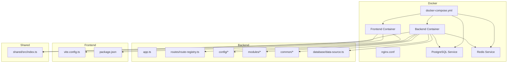
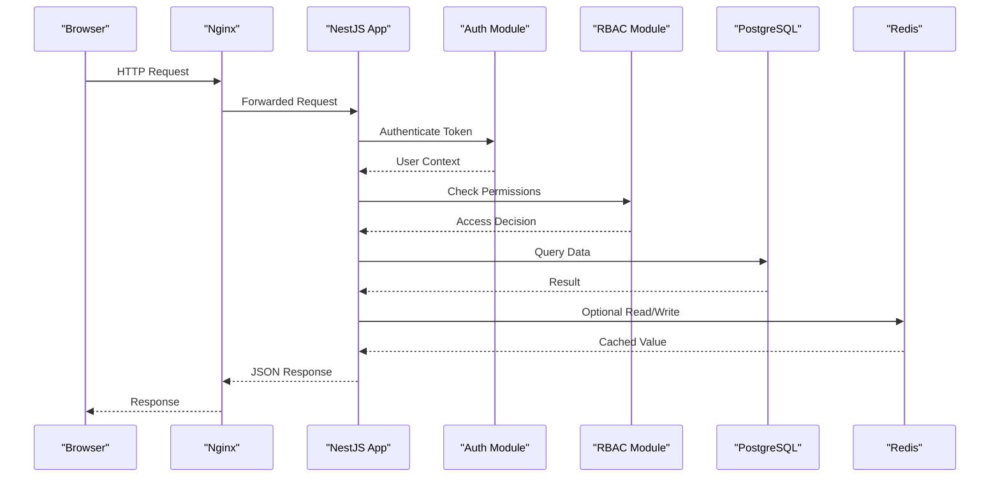
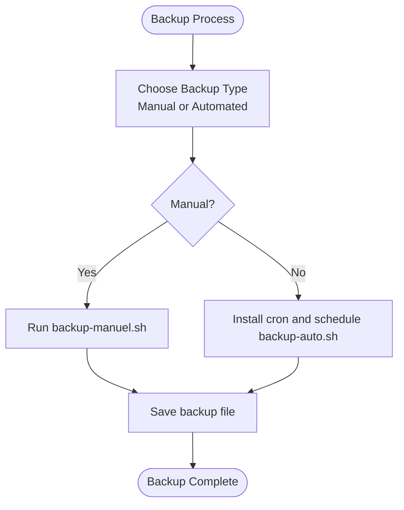
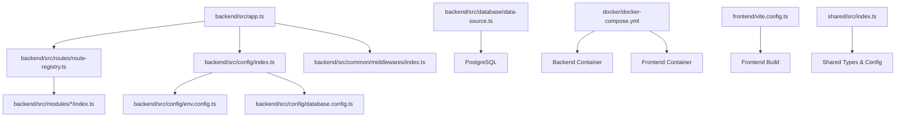

# Frequently Asked Questions

<cite>
**Referenced Files in This Document**
- [README.md](file://README.md)
- [QUICKSTART.md](file://QUICKSTART.md)
- [docker/README.md](file://docker/README.md)
- [docker/docker-compose.yml](file://docker/docker-compose.yml)
- [backend/src/config/env.config.ts](file://backend/src/config/env.config.ts)
- [backend/src/config/database.config.ts](file://backend/src/config/database.config.ts)
- [backend/src/config/index.ts](file://backend/src/config/index.ts)
- [backend/src/app.ts](file://backend/src/app.ts)
- [backend/src/index.ts](file://backend/src/index.ts)
- [backend/src/routes/route-registry.ts](file://backend/src/routes/route-registry.ts)
- [backend/src/modules/auth/index.ts](file://backend/src/modules/auth/index.ts)
- [backend/src/modules/utilisateurs/index.ts](file://backend/src/modules/utilisateurs/index.ts)
- [backend/src/modules/rbac/index.ts](file://backend/src/modules/rbac/index.ts)
- [backend/src/modules/configuration/index.ts](file://backend/src/modules/configuration/index.ts)
- [backend/src/modules/apparence/index.ts](file://backend/src/modules/apparence/index.ts)
- [backend/src/modules/finances/index.ts](file://backend/src/modules/finances/index.ts)
- [backend/src/modules/notifications/index.ts](file://backend/src/modules/notifications/index.ts)
- [backend/src/modules/messagerie/index.ts](file://backend/src/modules/messagerie/index.ts)
- [backend/src/modules/etablissement/index.ts](file://backend/src/modules/etablissement/index.ts)
- [backend/src/modules/groupes-etablissements/index.ts](file://backend/src/modules/groupes-etablissements/index.ts)
- [backend/src/modules/options/index.ts](file://backend/src/modules/options/index.ts)
- [backend/src/modules/dashboard/index.ts](file://backend/src/modules/dashboard/index.ts)
- [backend/src/modules/monitoring/index.ts](file://backend/src/modules/monitoring/index.ts)
- [backend/src/common/middlewares/index.ts](file://backend/src/common/middlewares/index.ts)
- [backend/src/common/filters/index.ts](file://backend/src/common/filters/index.ts)
- [backend/src/common/interceptors/index.ts](file://backend/src/common/interceptors/index.ts)
- [backend/src/common/services/index.ts](file://backend/src/common/services/index.ts)
- [backend/src/common/utils/index.ts](file://backend/src/common/utils/index.ts)
- [backend/src/common/types/index.ts](file://backend/src/common/types/index.ts)
- [backend/src/common/controllers/index.ts](file://backend/src/common/controllers/index.ts)
- [backend/src/common/dto/index.ts](file://backend/src/common/dto/index.ts)
- [backend/src/common/examples/index.ts](file://backend/src/common/examples/index.ts)
- [backend/src/database/data-source.ts](file://backend/src/database/data-source.ts)
- [backend/src/database/index.ts](file://backend/src/database/index.ts)
- [backend/scripts/run-migration.ts](file://backend/scripts/run-migration.ts)
- [backend/scripts/run-pending-migrations.ts](file://backend/scripts/run-pending-migrations.ts)
- [backend/deploy-all-migrations.sh](file://backend/deploy-all-migrations.sh)
- [backend/start-dev.sh](file://backend/start-dev.sh)
- [docker/scripts/backup-auto.sh](file://docker/scripts/backup-auto.sh)
- [docker/scripts/backup-manuel.sh](file://docker/scripts/backup-manuel.sh)
- [docker/scripts/restore.sh](file://docker/scripts/restore.sh)
- [docker/scripts/update.sh](file://docker/scripts/update.sh)
- [docker/scripts/install-cron.sh](file://docker/scripts/install-cron.sh)
- [docker/scripts/cron-backup.txt](file://docker/scripts/cron-backup.txt)
- [docker/deploy.sh](file://docker/deploy.sh)
- [docker/Dockerfile.backend](file://docker/Dockerfile.backend)
- [docker/Dockerfile.frontend](file://docker/Dockerfile.frontend)
- [docker/nginx.conf](file://docker/nginx.conf)
- [frontend/vite.config.ts](file://frontend/vite.config.ts)
- [frontend/package.json](file://frontend/package.json)
- [shared/src/index.ts](file://shared/src/index.ts)
- [shared/src/config/index.ts](file://shared/src/config/index.ts)
- [shared/src/constants/index.ts](file://shared/src/constants/index.ts)
- [shared/src/enums/index.ts](file://shared/src/enums/index.ts)
- [shared/src/types/index.ts](file://shared/src/types/index.ts)
- [shared/src/validators/index.ts](file://shared/src/validators/index.ts)
- [docs/guides/GUIDE-DEVELOPPEMENT.md](file://docs/guides/GUIDE-DEVELOPPEMENT.md)
- [docs/guides/GUIDE-CONNEXION-BASE-DE-DONNEES.md](file://docs/guides/GUIDE-CONNEXION-BASE-DE-DONNEES.md)
- [docs/guides/GUIDE-AUTHENTIFICATION.md](file://docs/guides/GUIDE-AUTHENTIFICATION.md)
- [docs/guides/GUIDE-TEST-MULTI-TENANT-V3.md](file://docs/guides/GUIDE-TEST-MULTI-TENANT-V3.md)
- [docs/guides/GUIDE-TEST-RAPIDE.md](file://docs/guides/GUIDE-TEST-RAPIDE.md)
- [docs/guides/GUIDE-MAINTENANCE-DOCUMENTATION.md](file://docs/guides/GUIDE-MAINTENANCE-DOCUMENTATION.md)
- [docs/guides/PERFORMANCE-INSTALLATION.md](file://docs/guides/PERFORMANCE-INSTALLATION.md)
- [docs/guides/HMR-CONFIG-GUIDE.md](file://docs/guides/HMR-CONFIG-GUIDE.md)
- [docs/guides/GUIDE-COMMANDES-DOCKER-ELISASCHOOL.md](file://docs/guides/GUIDE-COMMANDES-DOCKER-ELISASCHOOL.md)
- [docs/guides/GUIDE-DEPLOIEMENT-RAPIDE-V2.md](file://docs/guides/GUIDE-DEPLOIEMENT-RAPIDE-V2.md)
- [docs/guides/GUIDE-STRUCTURE-ACADEMIQUE.md](file://docs/guides/GUIDE-STRUCTURE-ACADEMIQUE.md)
- [docs/guides/GUIDE-TEST-MODULE-ELEVES.md](file://docs/guides/GUIDE-TEST-MODULE-ELEVES.md)
- [docs/guides/GUIDE-TEST-MESSAGERIE-V2.1.md](file://docs/guides/GUIDE-TEST-MESSAGERIE-V2.1.md)
- [docs/guides/GUIDE-TEST-SECURITE.md](file://docs/guides/GUIDE-TEST-SECURITE.md)
- [docs/guides/GUIDE-TEST-RESET-GLOBAL.md](file://docs/guides/GUIDE-TEST-RESET-GLOBAL.md)
- [docs/guides/GUIDE-TEST-CONNEXION-MATRICULE.md](file://docs/guides/GUIDE-TEST-CONNEXION-MATRICULE.md)
- [docs/guides/GUIDE-TEST-ACTIVATION-MODULES.md](file://docs/guides/GUIDE-TEST-ACTIVATION-MODULES.md)
- [docs/guides/GUIDE-ACCES-RESEAU-LOCAL.md](file://docs/guides/GUIDE-ACCES-RESEAU-LOCAL.md)
- [docs/guides/GUIDE-DEPANAGE-ACCES-RESEAU-LOCAL.md](file://docs/guides/GUIDE-DEPANAGE-ACCES-RESEAU-LOCAL.md)
- [docs/guides/GUIDE-EXECUTION-REFONTE-CONFIG.md](file://docs/guides/GUIDE-EXECUTION-REFONTE-CONFIG.md)
- [docs/guides/GUIDE-RETRAIT-UTILISATEUR-V5.0.md](file://docs/guides/GUIDE-RETRAIT-UTILISATEUR-V5.0.md)
- [docs/guides/GUIDE-TEST-MULTI-ROLES.md](file://docs/guides/GUIDE-TEST-MULTI-ROLES.md)
- [docs/guides/GUIDE-TEST-CONNEXION-MATRICULE.md](file://docs/guides/GUIDE-TEST-CONNEXION-MATRICULE.md)
- [docs/guides/GUIDE-TEST-MESSAGERIE-V2.1.md](file://docs/guides/GUIDE-TEST-MESSAGERIE-V2.1.md)
- [docs/guides/GUIDE-TEST-SECURITE.md](file://docs/guides/GUIDE-TEST-SECURITE.md)
- [docs/guides/GUIDE-TEST-RESET-GLOBAL.md](file://docs/guides/GUIDE-TEST-RESET-GLOBAL.md)
- [docs/guides/GUIDE-TEST-ACTIVATION-MODULES.md](file://docs/guides/GUIDE-TEST-ACTIVATION-MODULES.md)
- [docs/guides/GUIDE-ACCES-RESEAU-LOCAL.md](file://docs/guides/GUIDE-ACCES-RESEAU-LOCAL.md)
- [docs/guides/GUIDE-DEPANAGE-ACCES-RESEAU-LOCAL.md](file://docs/guides/GUIDE-DEPANAGE-ACCES-RESEAU-LOCAL.md)
- [docs/guides/GUIDE-EXECUTION-REFONTE-CONFIG.md](file://docs/guides/GUIDE-EXECUTION-REFONTE-CONFIG.md)
- [docs/guides/GUIDE-RETRAIT-UTILISATEUR-V5.0.md](file://docs/guides/GUIDE-RETRAIT-UTILISATEUR-V5.0.md)
- [docs/guides/GUIDE-TEST-MULTI-ROLES.md](file://docs/guides/GUIDE-TEST-MULTI-ROLES.md)
</cite>

## Table of Contents
1. [Introduction](#introduction)
2. [Project Structure](#project-structure)
3. [Core Components](#core-components)
4. [Architecture Overview](#architecture-overview)
5. [Detailed Component Analysis](#detailed-component-analysis)
6. [Dependency Analysis](#dependency-analysis)
7. [Performance Considerations](#performance-considerations)
8. [Troubleshooting Guide](#troubleshooting-guide)
9. [Conclusion](#conclusion)
10. [Appendices](#appendices)

## Introduction
This FAQ provides practical answers to common questions about eLISAschool, focusing on installation and setup, configuration options, environment-specific concerns, multi-tenant setup, user management, role-based access control (RBAC), customization (branding and theme), integrations with external systems and payment gateways, operational procedures (backups, updates, maintenance), and common user workflows. It also includes troubleshooting steps and best practices, with cross-references to detailed documentation sections for deeper reading.

## Project Structure
eLISAschool is a full-stack application with:
- Backend: NestJS-based API with modular architecture, database migrations, scripts, and shared utilities.
- Frontend: React/Vite-based UI with feature modules and hooks.
- Docker: Compose files, Nginx reverse proxy, backup and update scripts, and containerized services.
- Shared: TypeScript package with types, constants, enums, validators, and config helpers used by both frontend and backend.
- Docs: Extensive guides covering development, deployment, testing, RBAC, multi-tenant behavior, and more.

**Diagram sources**
- [docker/docker-compose.yml](file://docker/docker-compose.yml)
- [docker/nginx.conf](file://docker/nginx.conf)
- [backend/src/app.ts](file://backend/src/app.ts)
- [backend/src/routes/route-registry.ts](file://backend/src/routes/route-registry.ts)
- [backend/src/config/index.ts](file://backend/src/config/index.ts)
- [backend/src/database/data-source.ts](file://backend/src/database/data-source.ts)
- [frontend/vite.config.ts](file://frontend/vite.config.ts)
- [frontend/package.json](file://frontend/package.json)
- [shared/src/index.ts](file://shared/src/index.ts)

**Section sources**
- [README.md](file://README.md)
- [QUICKSTART.md](file://QUICKSTART.md)
- [docker/README.md](file://docker/README.md)
- [docker/docker-compose.yml](file://docker/docker-compose.yml)

## Core Components
- Configuration: Environment variables and centralized config loading for database, Redis, JWT, CORS, and module toggles.
- Database: TypeORM data source and migration execution utilities.
- Modules: Feature modules including authentication, users, RBAC, configuration, appearance, finances, notifications, messaging, establishment, groups, options, dashboard, monitoring.
- Common: Middlewares, filters, interceptors, services, utilities, types, controllers, DTOs, examples.
- Scripts: Migration runners, seeders, verification tools, and deployment helpers.
- Frontend: Vite configuration, feature routes, hooks, stores, and shared types.

Key responsibilities:
- app.ts wires global middleware, error handling, and Swagger.
- route-registry.ts centralizes route registration across modules.
- config/* loads environment-driven settings.
- database/* manages connections and migrations.
- modules/* encapsulate domain logic and APIs.
- common/* provides reusable infrastructure.

**Section sources**
- [backend/src/app.ts](file://backend/src/app.ts)
- [backend/src/routes/route-registry.ts](file://backend/src/routes/route-registry.ts)
- [backend/src/config/index.ts](file://backend/src/config/index.ts)
- [backend/src/config/env.config.ts](file://backend/src/config/env.config.ts)
- [backend/src/config/database.config.ts](file://backend/src/config/database.config.ts)
- [backend/src/database/data-source.ts](file://backend/src/database/data-source.ts)
- [backend/src/database/index.ts](file://backend/src/database/index.ts)
- [backend/src/modules/auth/index.ts](file://backend/src/modules/auth/index.ts)
- [backend/src/modules/utilisateurs/index.ts](file://backend/src/modules/utilisateurs/index.ts)
- [backend/src/modules/rbac/index.ts](file://backend/src/modules/rbac/index.ts)
- [backend/src/modules/configuration/index.ts](file://backend/src/modules/configuration/index.ts)
- [backend/src/modules/apparence/index.ts](file://backend/src/modules/apparence/index.ts)
- [backend/src/modules/finances/index.ts](file://backend/src/modules/finances/index.ts)
- [backend/src/modules/notifications/index.ts](file://backend/src/modules/notifications/index.ts)
- [backend/src/modules/messagerie/index.ts](file://backend/src/modules/messagerie/index.ts)
- [backend/src/modules/etablissement/index.ts](file://backend/src/modules/etablissement/index.ts)
- [backend/src/modules/groupes-etablissements/index.ts](file://backend/src/modules/groupes-etablissements/index.ts)
- [backend/src/modules/options/index.ts](file://backend/src/modules/options/index.ts)
- [backend/src/modules/dashboard/index.ts](file://backend/src/modules/dashboard/index.ts)
- [backend/src/modules/monitoring/index.ts](file://backend/src/modules/monitoring/index.ts)
- [backend/src/common/middlewares/index.ts](file://backend/src/common/middlewares/index.ts)
- [backend/src/common/filters/index.ts](file://backend/src/common/filters/index.ts)
- [backend/src/common/interceptors/index.ts](file://backend/src/common/interceptors/index.ts)
- [backend/src/common/services/index.ts](file://backend/src/common/services/index.ts)
- [backend/src/common/utils/index.ts](file://backend/src/common/utils/index.ts)
- [backend/src/common/types/index.ts](file://backend/src/common/types/index.ts)
- [backend/src/common/controllers/index.ts](file://backend/src/common/controllers/index.ts)
- [backend/src/common/dto/index.ts](file://backend/src/common/dto/index.ts)
- [backend/src/common/examples/index.ts](file://backend/src/common/examples/index.ts)

## Architecture Overview
The system follows a layered architecture:
- Reverse Proxy (Nginx) forwards requests to the backend and serves static frontend assets.
- Backend exposes REST APIs organized by modules, secured via JWT and RBAC.
- Database (PostgreSQL) persists entities; Redis supports caching/sessions if enabled.
- Frontend consumes APIs and renders dashboards and features.

**Diagram sources**
- [docker/nginx.conf](file://docker/nginx.conf)
- [backend/src/app.ts](file://backend/src/app.ts)
- [backend/src/modules/auth/index.ts](file://backend/src/modules/auth/index.ts)
- [backend/src/modules/rbac/index.ts](file://backend/src/modules/rbac/index.ts)
- [backend/src/database/data-source.ts](file://backend/src/database/data-source.ts)

## Detailed Component Analysis

### Installation and Setup
- How do I install and run eLISAschool locally?
  - Use Docker Compose to start services and containers. See docker compose file and README for service definitions and ports.
  - For quick start, follow the project’s quickstart guide.
  - Development mode can be started using provided scripts.
- What are the prerequisites?
  - Ensure Docker and Docker Compose are installed. Verify ports availability and network accessibility.
- How do I connect to the database?
  - Configure database connection parameters via environment variables or docker-compose overrides. Refer to database configuration and connection guide.

Cross-references:
- [docker/README.md](file://docker/README.md)
- [docker/docker-compose.yml](file://docker/docker-compose.yml)
- [QUICKSTART.md](file://QUICKSTART.md)
- [backend/start-dev.sh](file://backend/start-dev.sh)
- [docs/guides/GUIDE-CONNEXION-BASE-DE-DONNEES.md](file://docs/guides/GUIDE-CONNEXION-BASE-DE-DONNEES.md)
- [docs/guides/GUIDE-DEVELOPPEMENT.md](file://docs/guides/GUIDE-DEVELOPPEMENT.md)

**Section sources**
- [docker/README.md](file://docker/README.md)
- [docker/docker-compose.yml](file://docker/docker-compose.yml)
- [QUICKSTART.md](file://QUICKSTART.md)
- [backend/start-dev.sh](file://backend/start-dev.sh)
- [docs/guides/GUIDE-CONNEXION-BASE-DE-DONNEES.md](file://docs/guides/GUIDE-CONNEXION-BASE-DE-DONNEES.md)
- [docs/guides/GUIDE-DEVELOPPEMENT.md](file://docs/guides/GUIDE-DEVELOPPEMENT.md)

### Configuration Options
- Where are environment variables defined?
  - Centralized environment configuration is loaded from env.config.ts and index.ts.
- How do I configure the database?
  - Database configuration resides in database.config.ts and data-source.ts. Adjust credentials, host, port, and SSL options via environment variables.
- How do I enable/disable modules?
  - Module activation flags are typically managed through configuration and options modules. See configuration and options module indexes.
- How do I set up CORS and security headers?
  - Global middleware and app initialization handle CORS and security policies. Review app.ts and common middlewares.

Cross-references:
- [backend/src/config/env.config.ts](file://backend/src/config/env.config.ts)
- [backend/src/config/index.ts](file://backend/src/config/index.ts)
- [backend/src/config/database.config.ts](file://backend/src/config/database.config.ts)
- [backend/src/database/data-source.ts](file://backend/src/database/data-source.ts)
- [backend/src/app.ts](file://backend/src/app.ts)
- [backend/src/common/middlewares/index.ts](file://backend/src/common/middlewares/index.ts)
- [backend/src/modules/configuration/index.ts](file://backend/src/modules/configuration/index.ts)
- [backend/src/modules/options/index.ts](file://backend/src/modules/options/index.ts)

**Section sources**
- [backend/src/config/env.config.ts](file://backend/src/config/env.config.ts)
- [backend/src/config/index.ts](file://backend/src/config/index.ts)
- [backend/src/config/database.config.ts](file://backend/src/config/database.config.ts)
- [backend/src/database/data-source.ts](file://backend/src/database/data-source.ts)
- [backend/src/app.ts](file://backend/src/app.ts)
- [backend/src/common/middlewares/index.ts](file://backend/src/common/middlewares/index.ts)
- [backend/src/modules/configuration/index.ts](file://backend/src/modules/configuration/index.ts)
- [backend/src/modules/options/index.ts](file://backend/src/modules/options/index.ts)

### Environment-Specific Concerns
- How do I run in development vs production?
  - Use separate docker-compose profiles or override files. The repository includes local and cloud compose variants.
- How do I expose the app externally?
  - Nginx reverse proxy configuration maps domains and ports. Update nginx.conf accordingly.
- How do I manage secrets securely?
  - Store sensitive values in environment files or secret managers. Avoid committing secrets to version control.

Cross-references:
- [docker/docker-compose.yml](file://docker/docker-compose.yml)
- [docker/nginx.conf](file://docker/nginx.conf)
- [backend/src/config/env.config.ts](file://backend/src/config/env.config.ts)

**Section sources**
- [docker/docker-compose.yml](file://docker/docker-compose.yml)
- [docker/nginx.conf](file://docker/nginx.conf)
- [backend/src/config/env.config.ts](file://backend/src/config/env.config.ts)

### Multi-Tenant Setup
- How does multi-tenancy work?
  - Tenant isolation is enforced at the application layer and database scope. Establishments and groups define tenant boundaries.
- How do I create and switch tenants?
  - Use establishment and group endpoints to manage tenants and assign users. Refer to establishment and groups modules.
- How are permissions scoped per tenant?
  - RBAC checks include tenant context to ensure data isolation.

Cross-references:
- [backend/src/modules/etablissement/index.ts](file://backend/src/modules/etablissement/index.ts)
- [backend/src/modules/groupes-etablissements/index.ts](file://backend/src/modules/groupes-etablissements/index.ts)
- [backend/src/modules/rbac/index.ts](file://backend/src/modules/rbac/index.ts)
- [docs/guides/GUIDE-TEST-MULTI-TENANT-V3.md](file://docs/guides/GUIDE-TEST-MULTI-TENANT-V3.md)

**Section sources**
- [backend/src/modules/etablissement/index.ts](file://backend/src/modules/etablissement/index.ts)
- [backend/src/modules/groupes-etablissements/index.ts](file://backend/src/modules/groupes-etablissements/index.ts)
- [backend/src/modules/rbac/index.ts](file://backend/src/modules/rbac/index.ts)
- [docs/guides/GUIDE-TEST-MULTI-TENANT-V3.md](file://docs/guides/GUIDE-TEST-MULTI-TENANT-V3.md)

### User Management and Role-Based Access Control (RBAC)
- How do I create users and assign roles?
  - Use the users module to manage accounts and the RBAC module to assign roles and permissions.
- How do I enforce permissions on endpoints?
  - RBAC guards and decorators check permissions before executing controller actions.
- How do I audit user actions?
  - Audit trails capture significant operations for compliance and debugging.

Cross-references:
- [backend/src/modules/utilisateurs/index.ts](file://backend/src/modules/utilisateurs/index.ts)
- [backend/src/modules/rbac/index.ts](file://backend/src/modules/rbac/index.ts)
- [backend/src/modules/auth/index.ts](file://backend/src/modules/auth/index.ts)
- [docs/guides/GUIDE-AUTHENTIFICATION.md](file://docs/guides/GUIDE-AUTHENTIFICATION.md)
- [docs/guides/GUIDE-TEST-MULTI-ROLES.md](file://docs/guides/GUIDE-TEST-MULTI-ROLES.md)

**Section sources**
- [backend/src/modules/utilisateurs/index.ts](file://backend/src/modules/utilisateurs/index.ts)
- [backend/src/modules/rbac/index.ts](file://backend/src/modules/rbac/index.ts)
- [backend/src/modules/auth/index.ts](file://backend/src/modules/auth/index.ts)
- [docs/guides/GUIDE-AUTHENTIFICATION.md](file://docs/guides/GUIDE-AUTHENTIFICATION.md)
- [docs/guides/GUIDE-TEST-MULTI-ROLES.md](file://docs/guides/GUIDE-TEST-MULTI-ROLES.md)

### Customization: Branding and Theme Modification
- How do I customize branding and themes?
  - Appearance module manages visual settings such as logos, colors, and backgrounds.
- Can I activate specific features per tenant?
  - Options and configuration modules allow enabling/disabling features based on tenant needs.

Cross-references:
- [backend/src/modules/apparence/index.ts](file://backend/src/modules/apparence/index.ts)
- [backend/src/modules/options/index.ts](file://backend/src/modules/options/index.ts)
- [backend/src/modules/configuration/index.ts](file://backend/src/modules/configuration/index.ts)

**Section sources**
- [backend/src/modules/apparence/index.ts](file://backend/src/modules/apparence/index.ts)
- [backend/src/modules/options/index.ts](file://backend/src/modules/options/index.ts)
- [backend/src/modules/configuration/index.ts](file://backend/src/modules/configuration/index.ts)

### Integrations: External Systems, Payment Gateways, Third-Party Services
- How do I integrate with external systems?
  - Use dedicated modules (e.g., notifications, messaging) and configure providers via environment variables.
- Are payment gateway integrations available?
  - Finances module provides core financial operations. Payment provider integration points should be configured via environment variables and module settings.
- How do I extend integrations?
  - Implement new providers within the relevant module and register them in configuration.

Cross-references:
- [backend/src/modules/notifications/index.ts](file://backend/src/modules/notifications/index.ts)
- [backend/src/modules/messagerie/index.ts](file://backend/src/modules/messagerie/index.ts)
- [backend/src/modules/finances/index.ts](file://backend/src/modules/finances/index.ts)
- [backend/src/modules/configuration/index.ts](file://backend/src/modules/configuration/index.ts)

**Section sources**
- [backend/src/modules/notifications/index.ts](file://backend/src/modules/notifications/index.ts)
- [backend/src/modules/messagerie/index.ts](file://backend/src/modules/messagerie/index.ts)
- [backend/src/modules/finances/index.ts](file://backend/src/modules/finances/index.ts)
- [backend/src/modules/configuration/index.ts](file://backend/src/modules/configuration/index.ts)

### Operational Procedures: Backups, Updates, Maintenance
- How do I perform backups?
  - Automated and manual backup scripts are provided under docker/scripts. Cron jobs can schedule regular backups.
- How do I restore from a backup?
  - Use the restore script to apply a selected backup to the database.
- How do I update the application safely?
  - Use the update script to pull changes, rebuild containers, and run pending migrations.
- How do I run migrations?
  - Migration runners execute pending SQL/TypeScript migrations against the database.

**Diagram sources**
- [docker/scripts/backup-manuel.sh](file://docker/scripts/backup-manuel.sh)
- [docker/scripts/backup-auto.sh](file://docker/scripts/backup-auto.sh)
- [docker/scripts/install-cron.sh](file://docker/scripts/install-cron.sh)
- [docker/scripts/cron-backup.txt](file://docker/scripts/cron-backup.txt)

**Section sources**
- [docker/scripts/backup-auto.sh](file://docker/scripts/backup-auto.sh)
- [docker/scripts/backup-manuel.sh](file://docker/scripts/backup-manuel.sh)
- [docker/scripts/restore.sh](file://docker/scripts/restore.sh)
- [docker/scripts/update.sh](file://docker/scripts/update.sh)
- [docker/scripts/install-cron.sh](file://docker/scripts/install-cron.sh)
- [docker/scripts/cron-backup.txt](file://docker/scripts/cron-backup.txt)
- [backend/scripts/run-migration.ts](file://backend/scripts/run-migration.ts)
- [backend/scripts/run-pending-migrations.ts](file://backend/scripts/run-pending-migrations.ts)
- [backend/deploy-all-migrations.sh](file://backend/deploy-all-migrations.sh)

### Common User Workflows
- How do I log in and switch establishments?
  - Authentication module handles login and token issuance. Establishment switching is supported via user context and RBAC scoping.
- How do I navigate the dashboard?
  - Dashboard module aggregates key metrics and links to features.
- How do I test connectivity and features quickly?
  - Use the rapid test guide to validate endpoints and flows.

Cross-references:
- [backend/src/modules/auth/index.ts](file://backend/src/modules/auth/index.ts)
- [backend/src/modules/dashboard/index.ts](file://backend/src/modules/dashboard/index.ts)
- [docs/guides/GUIDE-TEST-RAPIDE.md](file://docs/guides/GUIDE-TEST-RAPIDE.md)
- [docs/guides/GUIDE-AUTHENTIFICATION.md](file://docs/guides/GUIDE-AUTHENTIFICATION.md)

**Section sources**
- [backend/src/modules/auth/index.ts](file://backend/src/modules/auth/index.ts)
- [backend/src/modules/dashboard/index.ts](file://backend/src/modules/dashboard/index.ts)
- [docs/guides/GUIDE-TEST-RAPIDE.md](file://docs/guides/GUIDE-TEST-RAPIDE.md)
- [docs/guides/GUIDE-AUTHENTIFICATION.md](file://docs/guides/GUIDE-AUTHENTIFICATION.md)

## Dependency Analysis
High-level dependencies:
- Backend depends on configuration, database, and module packages.
- Frontend depends on shared types and configurations.
- Docker orchestrates services and networking.

**Diagram sources**
- [backend/src/app.ts](file://backend/src/app.ts)
- [backend/src/routes/route-registry.ts](file://backend/src/routes/route-registry.ts)
- [backend/src/config/index.ts](file://backend/src/config/index.ts)
- [backend/src/config/env.config.ts](file://backend/src/config/env.config.ts)
- [backend/src/config/database.config.ts](file://backend/src/config/database.config.ts)
- [backend/src/database/data-source.ts](file://backend/src/database/data-source.ts)
- [docker/docker-compose.yml](file://docker/docker-compose.yml)
- [frontend/vite.config.ts](file://frontend/vite.config.ts)
- [shared/src/index.ts](file://shared/src/index.ts)

**Section sources**
- [backend/src/app.ts](file://backend/src/app.ts)
- [backend/src/routes/route-registry.ts](file://backend/src/routes/route-registry.ts)
- [backend/src/config/index.ts](file://backend/src/config/index.ts)
- [backend/src/config/env.config.ts](file://backend/src/config/env.config.ts)
- [backend/src/config/database.config.ts](file://backend/src/config/database.config.ts)
- [backend/src/database/data-source.ts](file://backend/src/database/data-source.ts)
- [docker/docker-compose.yml](file://docker/docker-compose.yml)
- [frontend/vite.config.ts](file://frontend/vite.config.ts)
- [shared/src/index.ts](file://shared/src/index.ts)

## Performance Considerations
- Enable caching where appropriate (e.g., Redis) to reduce database load.
- Tune database indexes and queries; use provided analysis scripts to identify bottlenecks.
- Monitor application performance via monitoring module and logs.
- Optimize frontend build and asset delivery through Vite configuration.

[No sources needed since this section provides general guidance]

## Troubleshooting Guide
- How do I diagnose authentication issues?
  - Validate JWT configuration, token expiration, and RBAC permissions. Refer to authentication guide and security tests.
- How do I resolve network connectivity problems?
  - Check ports, CORS settings, and Nginx routing. Use local access and network diagnostics guides.
- How do I reset the environment for testing?
  - Follow the global reset guide to clear state and re-seed data.
- How do I verify module activation and permissions?
  - Use the module activation test guide and RBAC-related documentation.

Cross-references:
- [docs/guides/GUIDE-AUTHENTIFICATION.md](file://docs/guides/GUIDE-AUTHENTIFICATION.md)
- [docs/guides/GUIDE-TEST-SECURITE.md](file://docs/guides/GUIDE-TEST-SECURITE.md)
- [docs/guides/GUIDE-ACCES-RESEAU-LOCAL.md](file://docs/guides/GUIDE-ACCES-RESEAU-LOCAL.md)
- [docs/guides/GUIDE-DEPANAGE-ACCES-RESEAU-LOCAL.md](file://docs/guides/GUIDE-DEPANAGE-ACCES-RESEAU-LOCAL.md)
- [docs/guides/GUIDE-TEST-RESET-GLOBAL.md](file://docs/guides/GUIDE-TEST-RESET-GLOBAL.md)
- [docs/guides/GUIDE-TEST-ACTIVATION-MODULES.md](file://docs/guides/GUIDE-TEST-ACTIVATION-MODULES.md)

**Section sources**
- [docs/guides/GUIDE-AUTHENTIFICATION.md](file://docs/guides/GUIDE-AUTHENTIFICATION.md)
- [docs/guides/GUIDE-TEST-SECURITE.md](file://docs/guides/GUIDE-TEST-SECURITE.md)
- [docs/guides/GUIDE-ACCES-RESEAU-LOCAL.md](file://docs/guides/GUIDE-ACCES-RESEAU-LOCAL.md)
- [docs/guides/GUIDE-DEPANAGE-ACCES-RESEAU-LOCAL.md](file://docs/guides/GUIDE-DEPANAGE-ACCES-RESEAU-LOCAL.md)
- [docs/guides/GUIDE-TEST-RESET-GLOBAL.md](file://docs/guides/GUIDE-TEST-RESET-GLOBAL.md)
- [docs/guides/GUIDE-TEST-ACTIVATION-MODULES.md](file://docs/guides/GUIDE-TEST-ACTIVATION-MODULES.md)

## Conclusion
This FAQ consolidates essential information for installing, configuring, customizing, integrating, operating, and troubleshooting eLISAschool. For deeper details, consult the linked guides and module indexes. Adopt best practices for security, performance, and maintainability to ensure a robust deployment.

[No sources needed since this section summarizes without analyzing specific files]

## Appendices
- Quick commands for daily operations:
  - Start development: see start-dev.sh and development guide.
  - Run migrations: use migration scripts.
  - Perform backups: use backup scripts and cron.
  - Update application: use update script.

Cross-references:
- [backend/start-dev.sh](file://backend/start-dev.sh)
- [backend/scripts/run-migration.ts](file://backend/scripts/run-migration.ts)
- [backend/scripts/run-pending-migrations.ts](file://backend/scripts/run-pending-migrations.ts)
- [backend/deploy-all-migrations.sh](file://backend/deploy-all-migrations.sh)
- [docker/scripts/backup-auto.sh](file://docker/scripts/backup-auto.sh)
- [docker/scripts/backup-manuel.sh](file://docker/scripts/backup-manuel.sh)
- [docker/scripts/restore.sh](file://docker/scripts/restore.sh)
- [docker/scripts/update.sh](file://docker/scripts/update.sh)

**Section sources**
- [backend/start-dev.sh](file://backend/start-dev.sh)
- [backend/scripts/run-migration.ts](file://backend/scripts/run-migration.ts)
- [backend/scripts/run-pending-migrations.ts](file://backend/scripts/run-pending-migrations.ts)
- [backend/deploy-all-migrations.sh](file://backend/deploy-all-migrations.sh)
- [docker/scripts/backup-auto.sh](file://docker/scripts/backup-auto.sh)
- [docker/scripts/backup-manuel.sh](file://docker/scripts/backup-manuel.sh)
- [docker/scripts/restore.sh](file://docker/scripts/restore.sh)
- [docker/scripts/update.sh](file://docker/scripts/update.sh)