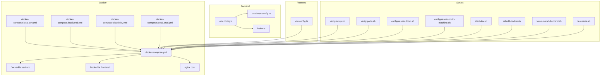
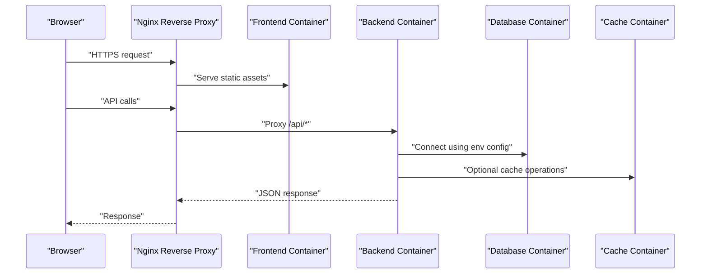
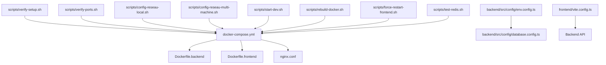

# Installation & Setup

<cite>
**Referenced Files in This Document**
- [docker-compose.yml](file://docker/docker-compose.yml)
- [docker-compose.local.dev.yml](file://docker/docker-compose.local.dev.yml)
- [docker-compose.local.prod.yml](file://docker/docker-compose.local.prod.yml)
- [docker-compose.cloud.dev.yml](file://docker/docker-compose.cloud.dev.yml)
- [docker-compose.cloud.prod.yml](file://docker/docker-compose.cloud.prod.yml)
- [Dockerfile.backend](file://docker/Dockerfile.backend)
- [Dockerfile.frontend](file://docker/Dockerfile.frontend)
- [nginx.conf](file://docker/nginx.conf)
- [deploy.sh](file://docker/deploy.sh)
- [QUICK-START.md](file://docker/QUICK-START.md)
- [README.md](file://docker/README.md)
- [PGADMIN-GUIDE.md](file://docker/PGADMIN-GUIDE.md)
- [backend/src/config/env.config.ts](file://backend/src/config/env.config.ts)
- [backend/src/config/database.config.ts](file://backend/src/config/database.config.ts)
- [backend/src/index.ts](file://backend/src/index.ts)
- [frontend/vite.config.ts](file://frontend/vite.config.ts)
- [scripts/verify-setup.sh](file://scripts/verify-setup.sh)
- [scripts/verify-ports.sh](file://scripts/verify-ports.sh)
- [scripts/config-reseau-local.sh](file://scripts/config-reseau-local.sh)
- [scripts/config-reseau-multi-machine.sh](file://scripts/config-reseau-multi-machine.sh)
- [scripts/start-dev.sh](file://scripts/start-dev.sh)
- [scripts/rebuild-docker.sh](file://scripts/rebuild-docker.sh)
- [scripts/force-restart-frontend.sh](file://scripts/force-restart-frontend.sh)
- [scripts/test-redis.sh](file://scripts/test-redis.sh)
- [backend/package.json](file://backend/package.json)
- [frontend/package.json](file://frontend/package.json)
</cite>

## Table of Contents
1. [Introduction](#introduction)
2. [Project Structure](#project-structure)
3. [Core Components](#core-components)
4. [Architecture Overview](#architecture-overview)
5. [Detailed Component Analysis](#detailed-component-analysis)
6. [Dependency Analysis](#dependency-analysis)
7. [Performance Considerations](#performance-considerations)
8. [Troubleshooting Guide](#troubleshooting-guide)
9. [Conclusion](#conclusion)
10. [Appendices](#appendices)

## Introduction
This FAQ focuses on installation and setup issues for the project, including Docker deployment, environment configuration, database connectivity, port conflicts, development and production setups, multi-machine networking, SSL certificates, firewall configurations, and system resource requirements. It provides actionable troubleshooting steps and references to relevant scripts and configuration files.

## Project Structure
The repository includes:
- Docker Compose definitions for local and cloud environments (dev/prod)
- Backend and frontend Dockerfiles
- Nginx reverse proxy configuration
- Environment and database configuration modules
- Utility scripts for verification, network configuration, and restarts

**Diagram sources**
- [docker-compose.yml](file://docker/docker-compose.yml)
- [docker-compose.local.dev.yml](file://docker/docker-compose.local.dev.yml)
- [docker-compose.local.prod.yml](file://docker/docker-compose.local.prod.yml)
- [docker-compose.cloud.dev.yml](file://docker/docker-compose.cloud.dev.yml)
- [docker-compose.cloud.prod.yml](file://docker/docker-compose.cloud.prod.yml)
- [Dockerfile.backend](file://docker/Dockerfile.backend)
- [Dockerfile.frontend](file://docker/Dockerfile.frontend)
- [nginx.conf](file://docker/nginx.conf)
- [backend/src/config/env.config.ts](file://backend/src/config/env.config.ts)
- [backend/src/config/database.config.ts](file://backend/src/config/database.config.ts)
- [backend/src/index.ts](file://backend/src/index.ts)
- [frontend/vite.config.ts](file://frontend/vite.config.ts)
- [scripts/verify-setup.sh](file://scripts/verify-setup.sh)
- [scripts/verify-ports.sh](file://scripts/verify-ports.sh)
- [scripts/config-reseau-local.sh](file://scripts/config-reseau-local.sh)
- [scripts/config-reseau-multi-machine.sh](file://scripts/config-reseau-multi-machine.sh)
- [scripts/start-dev.sh](file://scripts/start-dev.sh)
- [scripts/rebuild-docker.sh](file://scripts/rebuild-docker.sh)
- [scripts/force-restart-frontend.sh](file://scripts/force-restart-frontend.sh)
- [scripts/test-redis.sh](file://scripts/test-redis.sh)

**Section sources**
- [docker-compose.yml](file://docker/docker-compose.yml)
- [docker-compose.local.dev.yml](file://docker/docker-compose.local.dev.yml)
- [docker-compose.local.prod.yml](file://docker/docker-compose.local.prod.yml)
- [docker-compose.cloud.dev.yml](file://docker/docker-compose.cloud.dev.yml)
- [docker-compose.cloud.prod.yml](file://docker/docker-compose.cloud.prod.yml)
- [Dockerfile.backend](file://docker/Dockerfile.backend)
- [Dockerfile.frontend](file://docker/Dockerfile.frontend)
- [nginx.conf](file://docker/nginx.conf)
- [backend/src/config/env.config.ts](file://backend/src/config/env.config.ts)
- [backend/src/config/database.config.ts](file://backend/src/config/database.config.ts)
- [backend/src/index.ts](file://backend/src/index.ts)
- [frontend/vite.config.ts](file://frontend/vite.config.ts)
- [scripts/verify-setup.sh](file://scripts/verify-setup.sh)
- [scripts/verify-ports.sh](file://scripts/verify-ports.sh)
- [scripts/config-reseau-local.sh](file://scripts/config-reseau-local.sh)
- [scripts/config-reseau-multi-machine.sh](file://scripts/config-reseau-multi-machine.sh)
- [scripts/start-dev.sh](file://scripts/start-dev.sh)
- [scripts/rebuild-docker.sh](file://scripts/rebuild-docker.sh)
- [scripts/force-restart-frontend.sh](file://scripts/force-restart-frontend.sh)
- [scripts/test-redis.sh](file://scripts/test-redis.sh)

## Core Components
- Docker Compose profiles for local and cloud deployments (dev/prod)
- Backend environment and database configuration modules
- Frontend Vite configuration for dev server and API proxying
- Nginx reverse proxy for HTTPS termination and routing
- Verification and utility scripts for ports, Redis, and rebuilds

Key responsibilities:
- Orchestrate services (backend, frontend, database, cache, admin UI)
- Provide environment variables for runtime behavior
- Configure database connections and migrations
- Expose services via stable ports and optional HTTPS

**Section sources**
- [docker-compose.yml](file://docker/docker-compose.yml)
- [docker-compose.local.dev.yml](file://docker/docker-compose.local.dev.yml)
- [docker-compose.local.prod.yml](file://docker/docker-compose.local.prod.yml)
- [docker-compose.cloud.dev.yml](file://docker/docker-compose.cloud.dev.yml)
- [docker-compose.cloud.prod.yml](file://docker/docker-compose.cloud.prod.yml)
- [backend/src/config/env.config.ts](file://backend/src/config/env.config.ts)
- [backend/src/config/database.config.ts](file://backend/src/config/database.config.ts)
- [frontend/vite.config.ts](file://frontend/vite.config.ts)
- [nginx.conf](file://docker/nginx.conf)

## Architecture Overview
High-level flow for a typical request through the stack:

**Diagram sources**
- [nginx.conf](file://docker/nginx.conf)
- [docker-compose.yml](file://docker/docker-compose.yml)
- [backend/src/config/env.config.ts](file://backend/src/config/env.config.ts)
- [backend/src/config/database.config.ts](file://backend/src/config/database.config.ts)

## Detailed Component Analysis

### Docker Deployment Issues
Common symptoms:
- Services fail to start or crash immediately
- Containers cannot reach each other by service name
- Volume mounts are empty or permissions denied
- Images fail to build due to missing dependencies

Resolution steps:
- Use the provided compose profiles for your environment (local dev/prod or cloud dev/prod).
- Rebuild images if you changed dependencies or base images.
- Inspect container logs for errors and ensure required ports are not already in use.
- Verify that shared volumes exist and have correct ownership.

Relevant files:
- [docker-compose.yml](file://docker/docker-compose.yml)
- [docker-compose.local.dev.yml](file://docker/docker-compose.local.dev.yml)
- [docker-compose.local.prod.yml](file://docker/docker-compose.local.prod.yml)
- [docker-compose.cloud.dev.yml](file://docker/docker-compose.cloud.dev.yml)
- [docker-compose.cloud.prod.yml](file://docker/docker-compose.cloud.prod.yml)
- [Dockerfile.backend](file://docker/Dockerfile.backend)
- [Dockerfile.frontend](file://docker/Dockerfile.frontend)
- [scripts/rebuild-docker.sh](file://scripts/rebuild-docker.sh)

**Section sources**
- [docker-compose.yml](file://docker/docker-compose.yml)
- [docker-compose.local.dev.yml](file://docker/docker-compose.local.dev.yml)
- [docker-compose.local.prod.yml](file://docker/docker-compose.local.prod.yml)
- [docker-compose.cloud.dev.yml](file://docker/docker-compose.cloud.dev.yml)
- [docker-compose.cloud.prod.yml](file://docker/docker-compose.cloud.prod.yml)
- [Dockerfile.backend](file://docker/Dockerfile.backend)
- [Dockerfile.frontend](file://docker/Dockerfile.frontend)
- [scripts/rebuild-docker.sh](file://scripts/rebuild-docker.sh)

### Environment Configuration Problems
Symptoms:
- Backend fails to start due to missing or invalid environment variables
- Database connection parameters are incorrect
- Feature toggles or module flags are misconfigured

Resolution steps:
- Ensure all required environment variables are set for the target profile.
- Validate values for database host, port, user, password, and database name.
- Confirm any feature flags or module activation settings match your deployment intent.

Relevant files:
- [backend/src/config/env.config.ts](file://backend/src/config/env.config.ts)
- [docker-compose.yml](file://docker/docker-compose.yml)
- [docker-compose.local.dev.yml](file://docker/docker-compose.local.dev.yml)
- [docker-compose.local.prod.yml](file://docker/docker-compose.local.prod.yml)
- [docker-compose.cloud.dev.yml](file://docker/docker-compose.cloud.dev.yml)
- [docker-compose.cloud.prod.yml](file://docker/docker-compose.cloud.prod.yml)

**Section sources**
- [backend/src/config/env.config.ts](file://backend/src/config/env.config.ts)
- [docker-compose.yml](file://docker/docker-compose.yml)
- [docker-compose.local.dev.yml](file://docker/docker-compose.local.dev.yml)
- [docker-compose.local.prod.yml](file://docker/docker-compose.local.prod.yml)
- [docker-compose.cloud.dev.yml](file://docker/docker-compose.cloud.dev.yml)
- [docker-compose.cloud.prod.yml](file://docker/docker-compose.cloud.prod.yml)

### Database Connection Errors
Symptoms:
- “Connection refused” or authentication failures at startup
- Migrations fail due to wrong credentials or unreachable host
- Timeouts when connecting from backend to database

Resolution steps:
- Verify database service is running and reachable from the backend container.
- Check database host, port, username, password, and database name in environment configuration.
- Ensure the database accepts connections from the expected network and users.
- Run the setup verification script to validate connectivity.

Relevant files:
- [backend/src/config/database.config.ts](file://backend/src/config/database.config.ts)
- [backend/src/config/env.config.ts](file://backend/src/config/env.config.ts)
- [scripts/verify-setup.sh](file://scripts/verify-setup.sh)
- [docker-compose.yml](file://docker/docker-compose.yml)

**Section sources**
- [backend/src/config/database.config.ts](file://backend/src/config/database.config.ts)
- [backend/src/config/env.config.ts](file://backend/src/config/env.config.ts)
- [scripts/verify-setup.sh](file://scripts/verify-setup.sh)
- [docker-compose.yml](file://docker/docker-compose.yml)

### Port Conflicts
Symptoms:
- “Port already in use” errors during startup
- Frontend or backend cannot bind to expected ports
- Local access fails because another process occupies the port

Resolution steps:
- Use the port verification script to detect conflicts.
- Adjust exposed ports in the appropriate compose file for your environment.
- Stop conflicting processes or change their ports.
- Restart services after changes.

Relevant files:
- [scripts/verify-ports.sh](file://scripts/verify-ports.sh)
- [docker-compose.local.dev.yml](file://docker/docker-compose.local.dev.yml)
- [docker-compose.local.prod.yml](file://docker/docker-compose.local.prod.yml)
- [docker-compose.cloud.dev.yml](file://docker/docker-compose.cloud.dev.yml)
- [docker-compose.cloud.prod.yml](file://docker/docker-compose.cloud.prod.yml)

**Section sources**
- [scripts/verify-ports.sh](file://scripts/verify-ports.sh)
- [docker-compose.local.dev.yml](file://docker/docker-compose.local.dev.yml)
- [docker-compose.local.prod.yml](file://docker/docker-compose.local.prod.yml)
- [docker-compose.cloud.dev.yml](file://docker/docker-compose.cloud.dev.yml)
- [docker-compose.cloud.prod.yml](file://docker/docker-compose.cloud.prod.yml)

### Development Environment Setup
Symptoms:
- Dev server does not hot reload
- API proxying from frontend to backend fails
- Dependencies fail to install

Resolution steps:
- Use the development start script to launch services with appropriate settings.
- Ensure the frontend Vite configuration proxies API requests to the backend.
- Install dependencies for both backend and frontend before starting.

Relevant files:
- [scripts/start-dev.sh](file://scripts/start-dev.sh)
- [frontend/vite.config.ts](file://frontend/vite.config.ts)
- [backend/package.json](file://backend/package.json)
- [frontend/package.json](file://frontend/package.json)

**Section sources**
- [scripts/start-dev.sh](file://scripts/start-dev.sh)
- [frontend/vite.config.ts](file://frontend/vite.config.ts)
- [backend/package.json](file://backend/package.json)
- [frontend/package.json](file://frontend/package.json)

### Production Deployment Configurations
Symptoms:
- HTTPS not terminating correctly
- Static assets not served
- Reverse proxy misroutes API traffic

Resolution steps:
- Use the production compose profile for local or cloud.
- Ensure Nginx is configured to serve frontend assets and proxy API routes.
- Validate certificate paths and domain names in the reverse proxy configuration.

Relevant files:
- [docker-compose.local.prod.yml](file://docker/docker-compose.local.prod.yml)
- [docker-compose.cloud.prod.yml](file://docker/docker-compose.cloud.prod.yml)
- [nginx.conf](file://docker/nginx.conf)
- [deploy.sh](file://docker/deploy.sh)

**Section sources**
- [docker-compose.local.prod.yml](file://docker/docker-compose.local.prod.yml)
- [docker-compose.cloud.prod.yml](file://docker/docker-compose.cloud.prod.yml)
- [nginx.conf](file://docker/nginx.conf)
- [deploy.sh](file://docker/deploy.sh)

### Multi-Machine Networking Scenarios
Symptoms:
- Containers cannot resolve service names across hosts
- External clients cannot reach the application
- Firewall blocks inbound/outbound traffic

Resolution steps:
- Apply the local network configuration script for single-host scenarios.
- For multi-machine setups, apply the multi-machine network configuration script.
- Open required ports in firewalls and security groups.
- Verify DNS resolution and connectivity between machines.

Relevant files:
- [scripts/config-reseau-local.sh](file://scripts/config-reseau-local.sh)
- [scripts/config-reseau-multi-machine.sh](file://scripts/config-reseau-multi-machine.sh)
- [docker-compose.yml](file://docker/docker-compose.yml)

**Section sources**
- [scripts/config-reseau-local.sh](file://scripts/config-reseau-local.sh)
- [scripts/config-reseau-multi-machine.sh](file://scripts/config-reseau-multi-machine.sh)
- [docker-compose.yml](file://docker/docker-compose.yml)

### SSL Certificate Issues
Symptoms:
- Browser shows certificate warnings
- HTTPS handshake fails
- Reverse proxy cannot load certificate files

Resolution steps:
- Place valid certificate and key files in the expected location referenced by the reverse proxy configuration.
- Ensure file permissions allow the Nginx process to read them.
- Restart the reverse proxy after updating certificates.

Relevant files:
- [nginx.conf](file://docker/nginx.conf)

**Section sources**
- [nginx.conf](file://docker/nginx.conf)

### Firewall Configurations
Symptoms:
- External clients cannot connect to the application
- Internal services cannot communicate across hosts

Resolution steps:
- Allow inbound traffic on the ports used by Nginx, backend, and database as needed.
- Permit inter-container communication within the same Docker network.
- For multi-machine setups, open necessary ports on each host’s firewall.

Relevant files:
- [docker-compose.yml](file://docker/docker-compose.yml)
- [scripts/config-reseau-local.sh](file://scripts/config-reseau-local.sh)
- [scripts/config-reseau-multi-machine.sh](file://scripts/config-reseau-multi-machine.sh)

**Section sources**
- [docker-compose.yml](file://docker/docker-compose.yml)
- [scripts/config-reseau-local.sh](file://scripts/config-reseau-local.sh)
- [scripts/config-reseau-multi-machine.sh](file://scripts/config-reseau-multi-machine.sh)

### System Resource Requirements
Symptoms:
- Out-of-memory errors during build or runtime
- Slow performance under load
- Database or cache containers crash frequently

Resolution steps:
- Allocate sufficient CPU and memory to containers based on workload.
- Monitor resource usage and adjust limits accordingly.
- Optimize database and cache configurations for available resources.

Relevant files:
- [docker-compose.yml](file://docker/docker-compose.yml)
- [docker-compose.local.dev.yml](file://docker/docker-compose.local.dev.yml)
- [docker-compose.local.prod.yml](file://docker/docker-compose.local.prod.yml)
- [docker-compose.cloud.dev.yml](file://docker/docker-compose.cloud.dev.yml)
- [docker-compose.cloud.prod.yml](file://docker/docker-compose.cloud.prod.yml)

**Section sources**
- [docker-compose.yml](file://docker/docker-compose.yml)
- [docker-compose.local.dev.yml](file://docker/docker-compose.local.dev.yml)
- [docker-compose.local.prod.yml](file://docker/docker-compose.local.prod.yml)
- [docker-compose.cloud.dev.yml](file://docker/docker-compose.cloud.dev.yml)
- [docker-compose.cloud.prod.yml](file://docker/docker-compose.cloud.prod.yml)

## Dependency Analysis
Component relationships and integration points:

**Diagram sources**
- [docker-compose.yml](file://docker/docker-compose.yml)
- [Dockerfile.backend](file://docker/Dockerfile.backend)
- [Dockerfile.frontend](file://docker/Dockerfile.frontend)
- [nginx.conf](file://docker/nginx.conf)
- [backend/src/config/env.config.ts](file://backend/src/config/env.config.ts)
- [backend/src/config/database.config.ts](file://backend/src/config/database.config.ts)
- [frontend/vite.config.ts](file://frontend/vite.config.ts)
- [scripts/verify-setup.sh](file://scripts/verify-setup.sh)
- [scripts/verify-ports.sh](file://scripts/verify-ports.sh)
- [scripts/config-reseau-local.sh](file://scripts/config-reseau-local.sh)
- [scripts/config-reseau-multi-machine.sh](file://scripts/config-reseau-multi-machine.sh)
- [scripts/start-dev.sh](file://scripts/start-dev.sh)
- [scripts/rebuild-docker.sh](file://scripts/rebuild-docker.sh)
- [scripts/force-restart-frontend.sh](file://scripts/force-restart-frontend.sh)
- [scripts/test-redis.sh](file://scripts/test-redis.sh)

**Section sources**
- [docker-compose.yml](file://docker/docker-compose.yml)
- [Dockerfile.backend](file://docker/Dockerfile.backend)
- [Dockerfile.frontend](file://docker/Dockerfile.frontend)
- [nginx.conf](file://docker/nginx.conf)
- [backend/src/config/env.config.ts](file://backend/src/config/env.config.ts)
- [backend/src/config/database.config.ts](file://backend/src/config/database.config.ts)
- [frontend/vite.config.ts](file://frontend/vite.config.ts)
- [scripts/verify-setup.sh](file://scripts/verify-setup.sh)
- [scripts/verify-ports.sh](file://scripts/verify-ports.sh)
- [scripts/config-reseau-local.sh](file://scripts/config-reseau-local.sh)
- [scripts/config-reseau-multi-machine.sh](file://scripts/config-reseau-multi-machine.sh)
- [scripts/start-dev.sh](file://scripts/start-dev.sh)
- [scripts/rebuild-docker.sh](file://scripts/rebuild-docker.sh)
- [scripts/force-restart-frontend.sh](file://scripts/force-restart-frontend.sh)
- [scripts/test-redis.sh](file://scripts/test-redis.sh)

## Performance Considerations
- Tune container resource limits to avoid contention.
- Use production compose profiles for optimized defaults.
- Enable caching where applicable and monitor cache hit rates.
- Keep database indexes and queries optimized; leverage provided migration and analysis scripts when needed.

[No sources needed since this section provides general guidance]

## Troubleshooting Guide

### Quick Diagnostics
- Run the setup verification script to check core connectivity and prerequisites.
- Use the port verification script to identify conflicts.
- Test Redis connectivity with the dedicated script.
- Force restart the frontend if it appears stuck or unresponsive.

Relevant files:
- [scripts/verify-setup.sh](file://scripts/verify-setup.sh)
- [scripts/verify-ports.sh](file://scripts/verify-ports.sh)
- [scripts/test-redis.sh](file://scripts/test-redis.sh)
- [scripts/force-restart-frontend.sh](file://scripts/force-restart-frontend.sh)

**Section sources**
- [scripts/verify-setup.sh](file://scripts/verify-setup.sh)
- [scripts/verify-ports.sh](file://scripts/verify-ports.sh)
- [scripts/test-redis.sh](file://scripts/test-redis.sh)
- [scripts/force-restart-frontend.sh](file://scripts/force-restart-frontend.sh)

### Common Installation Failures
- Missing environment variables: ensure all required variables are present for the selected profile.
- Incorrect database credentials: verify host, port, user, password, and database name.
- Port conflicts: use the port verification script and adjust compose mappings.
- Network issues: apply local or multi-machine network configuration scripts as appropriate.

Relevant files:
- [backend/src/config/env.config.ts](file://backend/src/config/env.config.ts)
- [backend/src/config/database.config.ts](file://backend/src/config/database.config.ts)
- [scripts/verify-ports.sh](file://scripts/verify-ports.sh)
- [scripts/config-reseau-local.sh](file://scripts/config-reseau-local.sh)
- [scripts/config-reseau-multi-machine.sh](file://scripts/config-reseau-multi-machine.sh)

**Section sources**
- [backend/src/config/env.config.ts](file://backend/src/config/env.config.ts)
- [backend/src/config/database.config.ts](file://backend/src/config/database.config.ts)
- [scripts/verify-ports.sh](file://scripts/verify-ports.sh)
- [scripts/config-reseau-local.sh](file://scripts/config-reseau-local.sh)
- [scripts/config-reseau-multi-machine.sh](file://scripts/config-reseau-multi-machine.sh)

### Network Connectivity Problems
- Validate DNS resolution between containers and hosts.
- Ensure required ports are open in firewalls and security groups.
- Confirm reverse proxy routes are correct for API and static assets.

Relevant files:
- [docker-compose.yml](file://docker/docker-compose.yml)
- [nginx.conf](file://docker/nginx.conf)
- [scripts/config-reseau-local.sh](file://scripts/config-reseau-local.sh)
- [scripts/config-reseau-multi-machine.sh](file://scripts/config-reseau-multi-machine.sh)

**Section sources**
- [docker-compose.yml](file://docker/docker-compose.yml)
- [nginx.conf](file://docker/nginx.conf)
- [scripts/config-reseau-local.sh](file://scripts/config-reseau-local.sh)
- [scripts/config-reseau-multi-machine.sh](file://scripts/config-reseau-multi-machine.sh)

### Development vs Production Differences
- Development uses hot reload and debug-friendly settings.
- Production optimizes for performance and security, including HTTPS termination.
- Choose the correct compose profile for your environment.

Relevant files:
- [docker-compose.local.dev.yml](file://docker/docker-compose.local.dev.yml)
- [docker-compose.local.prod.yml](file://docker/docker-compose.local.prod.yml)
- [docker-compose.cloud.dev.yml](file://docker/docker-compose.cloud.dev.yml)
- [docker-compose.cloud.prod.yml](file://docker/docker-compose.cloud.prod.yml)

**Section sources**
- [docker-compose.local.dev.yml](file://docker/docker-compose.local.dev.yml)
- [docker-compose.local.prod.yml](file://docker/docker-compose.local.prod.yml)
- [docker-compose.cloud.dev.yml](file://docker/docker-compose.cloud.dev.yml)
- [docker-compose.cloud.prod.yml](file://docker/docker-compose.cloud.prod.yml)

### Additional Resources
- Quick start guide for initial setup
- General Docker README for overview and commands
- PostgreSQL Admin guide for database administration

Relevant files:
- [docker/QUICK-START.md](file://docker/QUICK-START.md)
- [docker/README.md](file://docker/README.md)
- [docker/PGADMIN-GUIDE.md](file://docker/PGADMIN-GUIDE.md)

**Section sources**
- [docker/QUICK-START.md](file://docker/QUICK-START.md)
- [docker/README.md](file://docker/README.md)
- [docker/PGADMIN-GUIDE.md](file://docker/PGADMIN-GUIDE.md)

## Conclusion
Use the provided compose profiles, environment configuration modules, and utility scripts to diagnose and resolve common installation and setup issues. Focus on environment variables, database connectivity, port availability, and network/firewall rules. For production, prefer hardened profiles and ensure proper SSL and reverse proxy configuration.

[No sources needed since this section summarizes without analyzing specific files]

## Appendices

### Quick Reference: Key Scripts and Files
- Setup verification: [scripts/verify-setup.sh](file://scripts/verify-setup.sh)
- Port verification: [scripts/verify-ports.sh](file://scripts/verify-ports.sh)
- Network configuration (local): [scripts/config-reseau-local.sh](file://scripts/config-reseau-local.sh)
- Network configuration (multi-machine): [scripts/config-reseau-multi-machine.sh](file://scripts/config-reseau-multi-machine.sh)
- Start development: [scripts/start-dev.sh](file://scripts/start-dev.sh)
- Rebuild Docker images: [scripts/rebuild-docker.sh](file://scripts/rebuild-docker.sh)
- Force restart frontend: [scripts/force-restart-frontend.sh](file://scripts/force-restart-frontend.sh)
- Test Redis: [scripts/test-redis.sh](file://scripts/test-redis.sh)
- Deploy helper: [docker/deploy.sh](file://docker/deploy.sh)

**Section sources**
- [scripts/verify-setup.sh](file://scripts/verify-setup.sh)
- [scripts/verify-ports.sh](file://scripts/verify-ports.sh)
- [scripts/config-reseau-local.sh](file://scripts/config-reseau-local.sh)
- [scripts/config-reseau-multi-machine.sh](file://scripts/config-reseau-multi-machine.sh)
- [scripts/start-dev.sh](file://scripts/start-dev.sh)
- [scripts/rebuild-docker.sh](file://scripts/rebuild-docker.sh)
- [scripts/force-restart-frontend.sh](file://scripts/force-restart-frontend.sh)
- [scripts/test-redis.sh](file://scripts/test-redis.sh)
- [docker/deploy.sh](file://docker/deploy.sh)