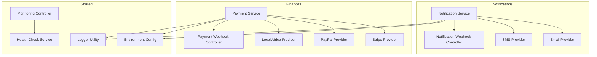
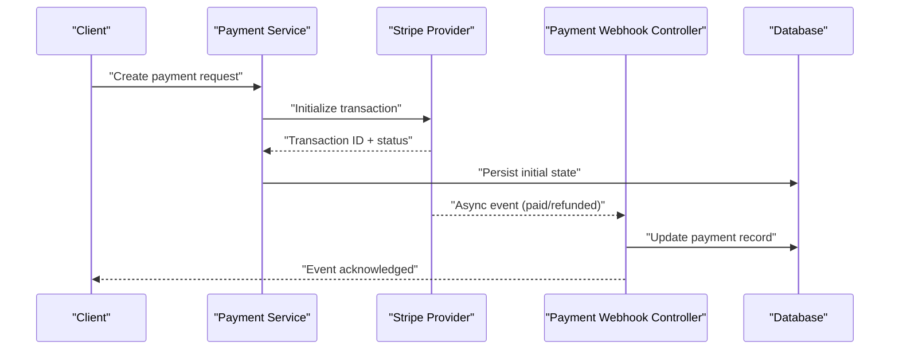
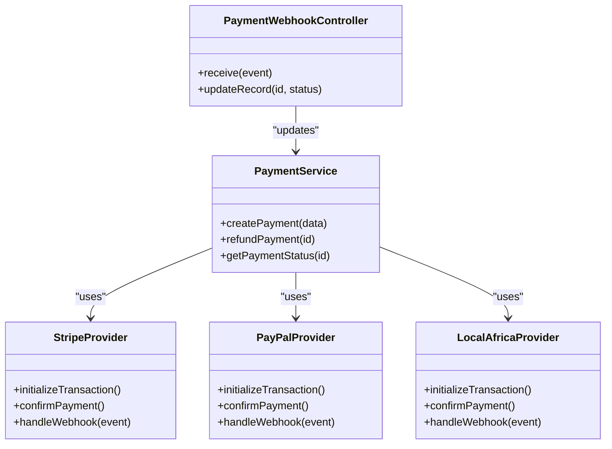
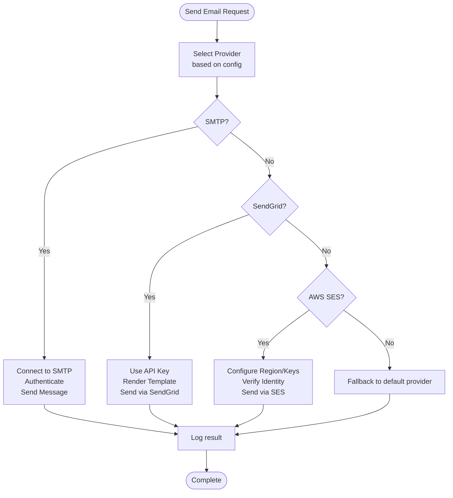
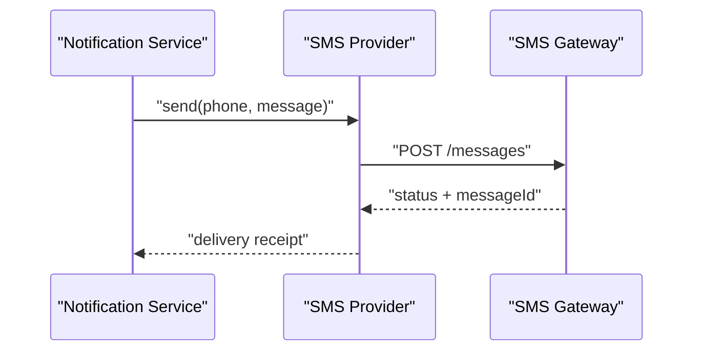
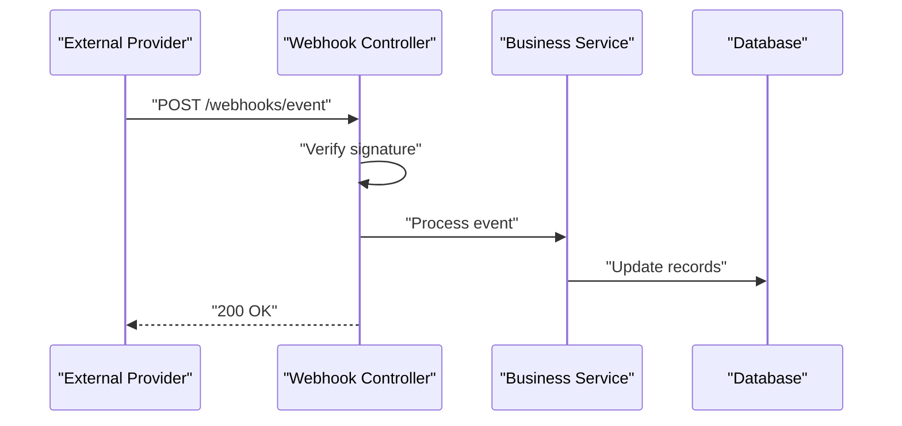
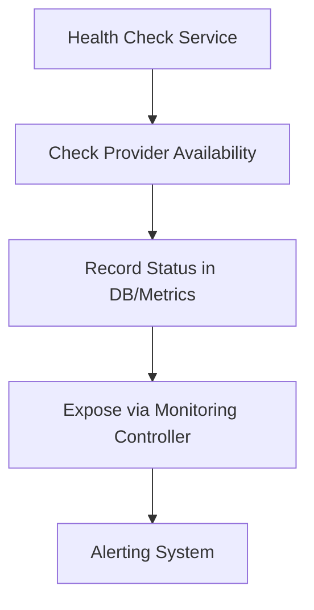
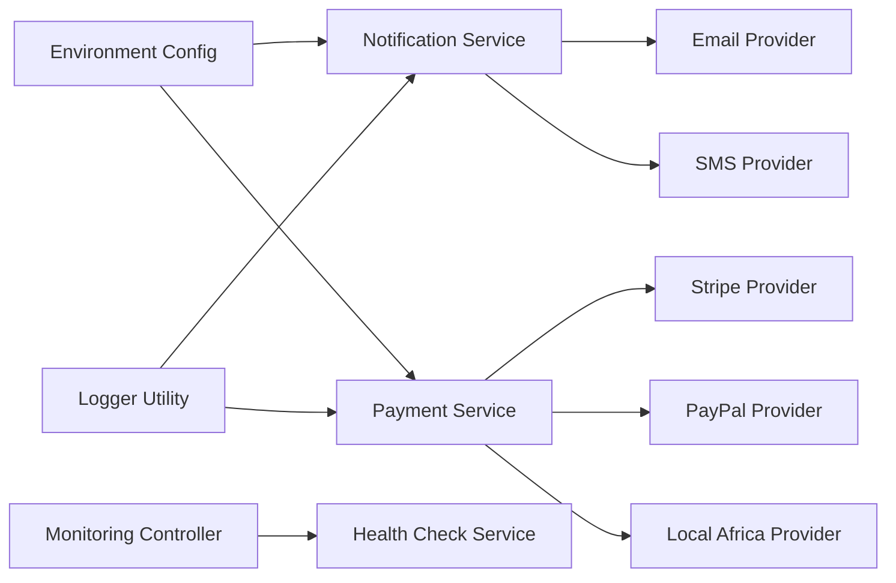

# Integration & Third-Party Services

<cite>
**Referenced Files in This Document**
- [backend/src/modules/notifications/services/notification.service.ts](file://backend/src/modules/notifications/services/notification.service.ts)
- [backend/src/modules/notifications/providers/email.provider.ts](file://backend/src/modules/notifications/providers/email.provider.ts)
- [backend/src/modules/notifications/providers/sms.provider.ts](file://backend/src/modules/notifications/providers/sms.provider.ts)
- [backend/src/modules/finances/services/payment.service.ts](file://backend/src/modules/finances/services/payment.service.ts)
- [backend/src/modules/finances/providers/stripe.provider.ts](file://backend/src/modules/finances/providers/stripe.provider.ts)
- [backend/src/modules/finances/providers/paypal.provider.ts](file://backend/src/modules/finances/providers/paypal.provider.ts)
- [backend/src/modules/finances/providers/local-africa-provider.ts](file://backend/src/modules/finances/providers/local-africa-provider.ts)
- [backend/src/config/env.config.ts](file://backend/src/config/env.config.ts)
- [backend/src/common/utils/logger.util.ts](file://backend/src/common/utils/logger.util.ts)
- [backend/src/modules/monitoring/controllers/monitoring.controller.ts](file://backend/src/modules/monitoring/controllers/monitoring.controller.ts)
- [backend/src/modules/monitoring/services/health-check.service.ts](file://backend/src/modules/monitoring/services/health-check.service.ts)
- [backend/src/modules/notifications/webhooks/notification.webhook.controller.ts](file://backend/src/modules/notifications/webhooks/notification.webhook.controller.ts)
- [backend/src/modules/finances/webhooks/payment.webhook.controller.ts](file://backend/src/modules/finances/webhooks/payment.webhook.controller.ts)
</cite>

## Table of Contents
1. [Introduction](#introduction)
2. [Project Structure](#project-structure)
3. [Core Components](#core-components)
4. [Architecture Overview](#architecture-overview)
5. [Detailed Component Analysis](#detailed-component-analysis)
6. [Dependency Analysis](#dependency-analysis)
7. [Performance Considerations](#performance-considerations)
8. [Troubleshooting Guide](#troubleshooting-guide)
9. [Conclusion](#conclusion)
10. [Appendices](#appendices)

## Introduction
This document provides an integration-focused FAQ for eLISAschool, covering external systems and third-party services: payment gateways (Stripe, PayPal, local African providers), email services (SMTP, SendGrid, AWS SES), SMS notification providers, cloud storage solutions, API integration patterns, webhook implementations, data synchronization strategies, custom provider development, error handling, and monitoring. It is designed to be accessible to both technical and non-technical readers while remaining grounded in the repository’s structure and implementation.

## Project Structure
The integration points are primarily organized under modules for notifications and finances, with shared configuration and monitoring utilities. The key areas include:
- Notifications module: email/SMS providers, webhooks, and orchestration service
- Finances module: payment providers (Stripe, PayPal, local Africa), payment webhooks
- Configuration: environment-based settings for external services
- Monitoring: health checks and controller endpoints for observability
- Utilities: logging and common helpers used across integrations

**Diagram sources**
- [backend/src/modules/notifications/services/notification.service.ts](file://backend/src/modules/notifications/services/notification.service.ts)
- [backend/src/modules/notifications/providers/email.provider.ts](file://backend/src/modules/notifications/providers/email.provider.ts)
- [backend/src/modules/notifications/providers/sms.provider.ts](file://backend/src/modules/notifications/providers/sms.provider.ts)
- [backend/src/modules/notifications/webhooks/notification.webhook.controller.ts](file://backend/src/modules/notifications/webhooks/notification.webhook.controller.ts)
- [backend/src/modules/finances/services/payment.service.ts](file://backend/src/modules/finances/services/payment.service.ts)
- [backend/src/modules/finances/providers/stripe.provider.ts](file://backend/src/modules/finances/providers/stripe.provider.ts)
- [backend/src/modules/finances/providers/paypal.provider.ts](file://backend/src/modules/finances/providers/paypal.provider.ts)
- [backend/src/modules/finances/providers/local-africa-provider.ts](file://backend/src/modules/finances/providers/local-africa-provider.ts)
- [backend/src/modules/finances/webhooks/payment.webhook.controller.ts](file://backend/src/modules/finances/webhooks/payment.webhook.controller.ts)
- [backend/src/config/env.config.ts](file://backend/src/config/env.config.ts)
- [backend/src/common/utils/logger.util.ts](file://backend/src/common/utils/logger.util.ts)
- [backend/src/modules/monitoring/controllers/monitoring.controller.ts](file://backend/src/modules/monitoring/controllers/monitoring.controller.ts)
- [backend/src/modules/monitoring/services/health-check.service.ts](file://backend/src/modules/monitoring/services/health-check.service.ts)

**Section sources**
- [backend/src/modules/notifications/services/notification.service.ts](file://backend/src/modules/notifications/services/notification.service.ts)
- [backend/src/modules/finances/services/payment.service.ts](file://backend/src/modules/finances/services/payment.service.ts)
- [backend/src/config/env.config.ts](file://backend/src/config/env.config.ts)
- [backend/src/common/utils/logger.util.ts](file://backend/src/common/utils/logger.util.ts)
- [backend/src/modules/monitoring/controllers/monitoring.controller.ts](file://backend/src/modules/monitoring/controllers/monitoring.controller.ts)
- [backend/src/modules/monitoring/services/health-check.service.ts](file://backend/src/modules/monitoring/services/health-check.service.ts)

## Core Components
- Notification Service: Orchestrates sending via multiple channels (email, SMS). Supports provider selection based on configuration and user preferences.
- Payment Service: Coordinates payment operations across providers (Stripe, PayPal, local Africa). Handles idempotency, retries, and status updates.
- Providers: Pluggable implementations for each channel or gateway. Each provider encapsulates its own API calls, authentication, and response mapping.
- Webhooks: Controllers that receive asynchronous events from external services and update internal state accordingly.
- Environment Configuration: Centralized loading of secrets and endpoints for all external services.
- Monitoring: Health check service and controller to expose readiness/liveness and dependency status.

**Section sources**
- [backend/src/modules/notifications/services/notification.service.ts](file://backend/src/modules/notifications/services/notification.service.ts)
- [backend/src/modules/finances/services/payment.service.ts](file://backend/src/modules/finances/services/payment.service.ts)
- [backend/src/config/env.config.ts](file://backend/src/config/env.config.ts)
- [backend/src/modules/monitoring/controllers/monitoring.controller.ts](file://backend/src/modules/monitoring/controllers/monitoring.controller.ts)
- [backend/src/modules/monitoring/services/health-check.service.ts](file://backend/src/modules/monitoring/services/health-check.service.ts)

## Architecture Overview
The system uses a modular architecture where business logic delegates to pluggable providers. External dependencies are abstracted behind interfaces, enabling easy switching or extension. Webhooks ensure eventual consistency by processing asynchronous events. Monitoring exposes health endpoints to verify dependency availability.

**Diagram sources**
- [backend/src/modules/finances/services/payment.service.ts](file://backend/src/modules/finances/services/payment.service.ts)
- [backend/src/modules/finances/providers/stripe.provider.ts](file://backend/src/modules/finances/providers/stripe.provider.ts)
- [backend/src/modules/finances/webhooks/payment.webhook.controller.ts](file://backend/src/modules/finances/webhooks/payment.webhook.controller.ts)

## Detailed Component Analysis

### Payment Gateway Integrations
FAQ topics covered:
- How to configure Stripe, PayPal, and local African providers
- How payments are initiated and tracked
- How webhooks reconcile payment states
- Error handling and retry strategies
- Custom provider development

**Diagram sources**
- [backend/src/modules/finances/services/payment.service.ts](file://backend/src/modules/finances/services/payment.service.ts)
- [backend/src/modules/finances/providers/stripe.provider.ts](file://backend/src/modules/finances/providers/stripe.provider.ts)
- [backend/src/modules/finances/providers/paypal.provider.ts](file://backend/src/modules/finances/providers/paypal.provider.ts)
- [backend/src/modules/finances/providers/local-africa-provider.ts](file://backend/src/modules/finances/providers/local-africa-provider.ts)
- [backend/src/modules/finances/webhooks/payment.webhook.controller.ts](file://backend/src/modules/finances/webhooks/payment.webhook.controller.ts)

Key implementation references:
- Payment orchestration and provider selection: [payment.service.ts](file://backend/src/modules/finances/services/payment.service.ts)
- Stripe-specific flows: [stripe.provider.ts](file://backend/src/modules/finances/providers/stripe.provider.ts)
- PayPal-specific flows: [paypal.provider.ts](file://backend/src/modules/finances/providers/paypal.provider.ts)
- Local Africa provider flows: [local-africa-provider.ts](file://backend/src/modules/finances/providers/local-africa-provider.ts)
- Webhook reconciliation: [payment.webhook.controller.ts](file://backend/src/modules/finances/webhooks/payment.webhook.controller.ts)

**Section sources**
- [backend/src/modules/finances/services/payment.service.ts](file://backend/src/modules/finances/services/payment.service.ts)
- [backend/src/modules/finances/providers/stripe.provider.ts](file://backend/src/modules/finances/providers/stripe.provider.ts)
- [backend/src/modules/finances/providers/paypal.provider.ts](file://backend/src/modules/finances/providers/paypal.provider.ts)
- [backend/src/modules/finances/providers/local-africa-provider.ts](file://backend/src/modules/finances/providers/local-africa-provider.ts)
- [backend/src/modules/finances/webhooks/payment.webhook.controller.ts](file://backend/src/modules/finances/webhooks/payment.webhook.controller.ts)

### Email Service Configurations
FAQ topics covered:
- SMTP setup (host, port, TLS/SSL, credentials)
- SendGrid configuration (API keys, templates)
- AWS SES configuration (region, access keys, identity verification)
- Provider selection and fallback behavior
- Template rendering and localization

**Diagram sources**
- [backend/src/modules/notifications/providers/email.provider.ts](file://backend/src/modules/notifications/providers/email.provider.ts)
- [backend/src/config/env.config.ts](file://backend/src/config/env.config.ts)

Key implementation references:
- Email provider orchestration and template handling: [email.provider.ts](file://backend/src/modules/notifications/providers/email.provider.ts)
- Environment variables for SMTP/SendGrid/SES: [env.config.ts](file://backend/src/config/env.config.ts)

**Section sources**
- [backend/src/modules/notifications/providers/email.provider.ts](file://backend/src/modules/notifications/providers/email.provider.ts)
- [backend/src/config/env.config.ts](file://backend/src/config/env.config.ts)

### SMS Notification Providers
FAQ topics covered:
- Supported SMS providers and selection criteria
- Phone number validation and internationalization
- Delivery receipts and failure handling
- Rate limiting and throttling

**Diagram sources**
- [backend/src/modules/notifications/services/notification.service.ts](file://backend/src/modules/notifications/services/notification.service.ts)
- [backend/src/modules/notifications/providers/sms.provider.ts](file://backend/src/modules/notifications/providers/sms.provider.ts)

Key implementation references:
- Notification orchestration: [notification.service.ts](file://backend/src/modules/notifications/services/notification.service.ts)
- SMS provider implementation: [sms.provider.ts](file://backend/src/modules/notifications/providers/sms.provider.ts)

**Section sources**
- [backend/src/modules/notifications/services/notification.service.ts](file://backend/src/modules/notifications/services/notification.service.ts)
- [backend/src/modules/notifications/providers/sms.provider.ts](file://backend/src/modules/notifications/providers/sms.provider.ts)

### Cloud Storage Solutions
FAQ topics covered:
- Supported storage backends (e.g., S3-compatible, local filesystem)
- Bucket/container configuration and access policies
- File upload/download flows and presigned URLs
- Security considerations (encryption at rest/in transit)

Implementation guidance:
- Configure storage provider via environment variables
- Use consistent object naming conventions and metadata
- Implement resumable uploads for large files
- Validate file types and sizes before processing

[No sources needed since this section provides general guidance]

### API Integration Patterns
FAQ topics covered:
- Authentication schemes (API keys, OAuth, JWT)
- Request signing and payload hashing
- Idempotency keys for safe retries
- Versioning and backward compatibility

Best practices:
- Always use idempotency keys for write operations
- Sign payloads when required by providers
- Cache provider client instances to reduce overhead
- Normalize responses into internal models

[No sources needed since this section provides general guidance]

### Webhook Implementations
FAQ topics covered:
- Verifying webhook signatures
- Handling out-of-order events
- Retrying failed processing safely
- Exposing admin endpoints for inspection

**Diagram sources**
- [backend/src/modules/notifications/webhooks/notification.webhook.controller.ts](file://backend/src/modules/notifications/webhooks/notification.webhook.controller.ts)
- [backend/src/modules/finances/webhooks/payment.webhook.controller.ts](file://backend/src/modules/finances/webhooks/payment.webhook.controller.ts)

Key implementation references:
- Notification webhooks: [notification.webhook.controller.ts](file://backend/src/modules/notifications/webhooks/notification.webhook.controller.ts)
- Payment webhooks: [payment.webhook.controller.ts](file://backend/src/modules/finances/webhooks/payment.webhook.controller.ts)

**Section sources**
- [backend/src/modules/notifications/webhooks/notification.webhook.controller.ts](file://backend/src/modules/notifications/webhooks/notification.webhook.controller.ts)
- [backend/src/modules/finances/webhooks/payment.webhook.controller.ts](file://backend/src/modules/finances/webhooks/payment.webhook.controller.ts)

### Data Synchronization Strategies
FAQ topics covered:
- Polling vs webhooks for state sync
- Conflict resolution and merge strategies
- Backfill and incremental syncs
- Audit trails and change logs

Recommendations:
- Prefer webhooks for real-time updates; fall back to polling if unavailable
- Use unique external IDs and idempotent upserts
- Track last-sync timestamps and delta queries
- Maintain audit entries for critical changes

[No sources needed since this section provides general guidance]

### Custom Provider Development
FAQ topics covered:
- Extending email/SMS/payment providers
- Implementing required interfaces
- Testing with stubs and mock servers
- Feature flags and gradual rollout

Steps:
- Create a new provider class implementing the expected interface
- Register the provider in the service layer
- Add environment variables for credentials/endpoints
- Write unit tests and integration tests against sandbox environments

[No sources needed since this section provides general guidance]

### Error Handling
FAQ topics covered:
- Categorizing errors (network, auth, validation, rate limit)
- Retry policies with exponential backoff
- Circuit breakers for failing dependencies
- User-facing messages vs internal diagnostics

Patterns:
- Wrap provider calls in try/catch with typed exceptions
- Log structured errors with correlation IDs
- Return standardized error responses
- Surface actionable hints to clients

[No sources needed since this section provides general guidance]

### Monitoring for External Dependencies
FAQ topics covered:
- Health checks for providers
- Metrics collection (latency, success rates)
- Alerting on failures and timeouts
- Dashboarding and tracing

**Diagram sources**
- [backend/src/modules/monitoring/services/health-check.service.ts](file://backend/src/modules/monitoring/services/health-check.service.ts)
- [backend/src/modules/monitoring/controllers/monitoring.controller.ts](file://backend/src/modules/monitoring/controllers/monitoring.controller.ts)

Key implementation references:
- Health check service: [health-check.service.ts](file://backend/src/modules/monitoring/services/health-check.service.ts)
- Monitoring controller: [monitoring.controller.ts](file://backend/src/modules/monitoring/controllers/monitoring.controller.ts)

**Section sources**
- [backend/src/modules/monitoring/services/health-check.service.ts](file://backend/src/modules/monitoring/services/health-check.service.ts)
- [backend/src/modules/monitoring/controllers/monitoring.controller.ts](file://backend/src/modules/monitoring/controllers/monitoring.controller.ts)

## Dependency Analysis
The integration layer depends on environment configuration and logging utilities. Providers encapsulate external APIs, while services coordinate workflows. Webhooks depend on controllers and services to persist state changes. Monitoring components provide visibility into dependency health.

**Diagram sources**
- [backend/src/config/env.config.ts](file://backend/src/config/env.config.ts)
- [backend/src/common/utils/logger.util.ts](file://backend/src/common/utils/logger.util.ts)
- [backend/src/modules/notifications/services/notification.service.ts](file://backend/src/modules/notifications/services/notification.service.ts)
- [backend/src/modules/notifications/providers/email.provider.ts](file://backend/src/modules/notifications/providers/email.provider.ts)
- [backend/src/modules/notifications/providers/sms.provider.ts](file://backend/src/modules/notifications/providers/sms.provider.ts)
- [backend/src/modules/finances/services/payment.service.ts](file://backend/src/modules/finances/services/payment.service.ts)
- [backend/src/modules/finances/providers/stripe.provider.ts](file://backend/src/modules/finances/providers/stripe.provider.ts)
- [backend/src/modules/finances/providers/paypal.provider.ts](file://backend/src/modules/finances/providers/paypal.provider.ts)
- [backend/src/modules/finances/providers/local-africa-provider.ts](file://backend/src/modules/finances/providers/local-africa-provider.ts)
- [backend/src/modules/monitoring/controllers/monitoring.controller.ts](file://backend/src/modules/monitoring/controllers/monitoring.controller.ts)
- [backend/src/modules/monitoring/services/health-check.service.ts](file://backend/src/modules/monitoring/services/health-check.service.ts)

**Section sources**
- [backend/src/config/env.config.ts](file://backend/src/config/env.config.ts)
- [backend/src/common/utils/logger.util.ts](file://backend/src/common/utils/logger.util.ts)
- [backend/src/modules/notifications/services/notification.service.ts](file://backend/src/modules/notifications/services/notification.service.ts)
- [backend/src/modules/finances/services/payment.service.ts](file://backend/src/modules/finances/services/payment.service.ts)
- [backend/src/modules/monitoring/controllers/monitoring.controller.ts](file://backend/src/modules/monitoring/controllers/monitoring.controller.ts)
- [backend/src/modules/monitoring/services/health-check.service.ts](file://backend/src/modules/monitoring/services/health-check.service.ts)

## Performance Considerations
- Reuse HTTP clients and connection pools for providers
- Batch operations where supported by external APIs
- Use caching for static provider configurations and templates
- Apply rate limiting and backpressure to avoid overwhelming providers
- Monitor latency and throughput metrics per provider

[No sources needed since this section provides general guidance]

## Troubleshooting Guide
Common issues and resolutions:
- Authentication failures: Verify API keys, tokens, and scopes; check environment variables
- Network timeouts: Inspect firewall rules, DNS resolution, and provider status pages
- Signature mismatches: Ensure secret management and timestamp handling are correct
- Duplicate events: Confirm idempotency keys and deduplication logic
- Provider outages: Enable circuit breakers and fallback providers

Operational checks:
- Use health endpoints to validate provider connectivity
- Review structured logs for correlation IDs and stack traces
- Inspect webhook queues and retry histories

**Section sources**
- [backend/src/common/utils/logger.util.ts](file://backend/src/common/utils/logger.util.ts)
- [backend/src/modules/monitoring/controllers/monitoring.controller.ts](file://backend/src/modules/monitoring/controllers/monitoring.controller.ts)
- [backend/src/modules/monitoring/services/health-check.service.ts](file://backend/src/modules/monitoring/services/health-check.service.ts)

## Conclusion
eLISAschool’s integration architecture emphasizes modularity, resilience, and observability. By abstracting external dependencies behind providers, leveraging webhooks for async updates, and exposing health checks, the system supports robust integrations with payment gateways, email/SMS services, and other third-party systems. Follow the provided patterns for custom providers, error handling, and monitoring to maintain reliability and scalability.

[No sources needed since this section summarizes without analyzing specific files]

## Appendices
- Quick reference for environment variables related to integrations: [env.config.ts](file://backend/src/config/env.config.ts)
- Example provider interfaces and usage patterns:
  - Email: [email.provider.ts](file://backend/src/modules/notifications/providers/email.provider.ts)
  - SMS: [sms.provider.ts](file://backend/src/modules/notifications/providers/sms.provider.ts)
  - Payments: [stripe.provider.ts](file://backend/src/modules/finances/providers/stripe.provider.ts), [paypal.provider.ts](file://backend/src/modules/finances/providers/paypal.provider.ts), [local-africa-provider.ts](file://backend/src/modules/finances/providers/local-africa-provider.ts)

[No sources needed since this section lists references only]