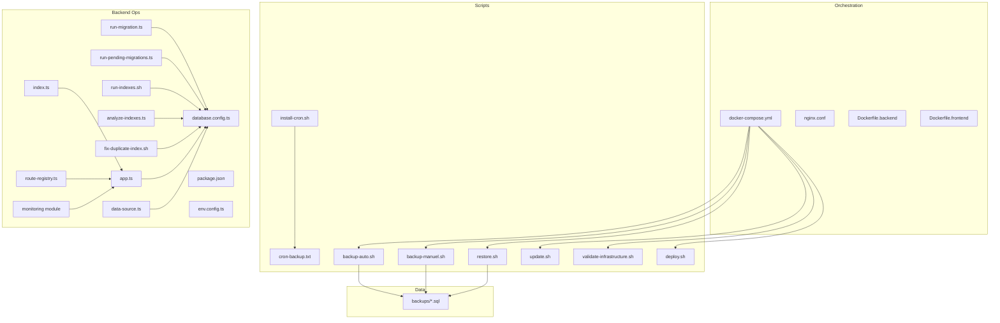
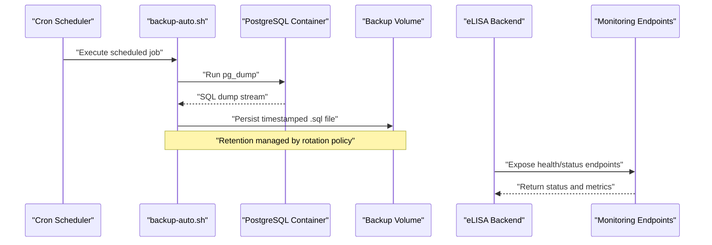
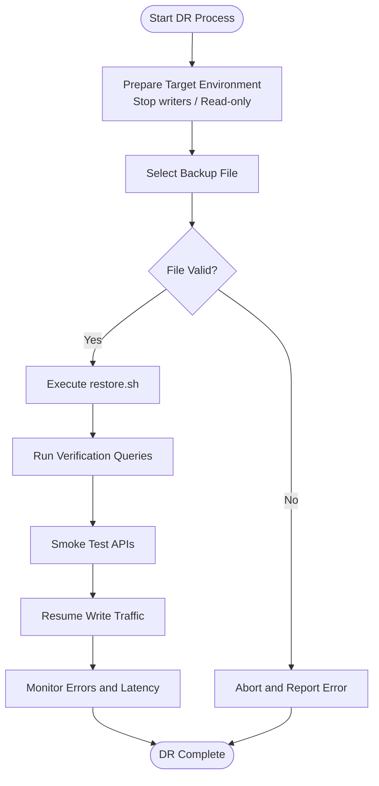
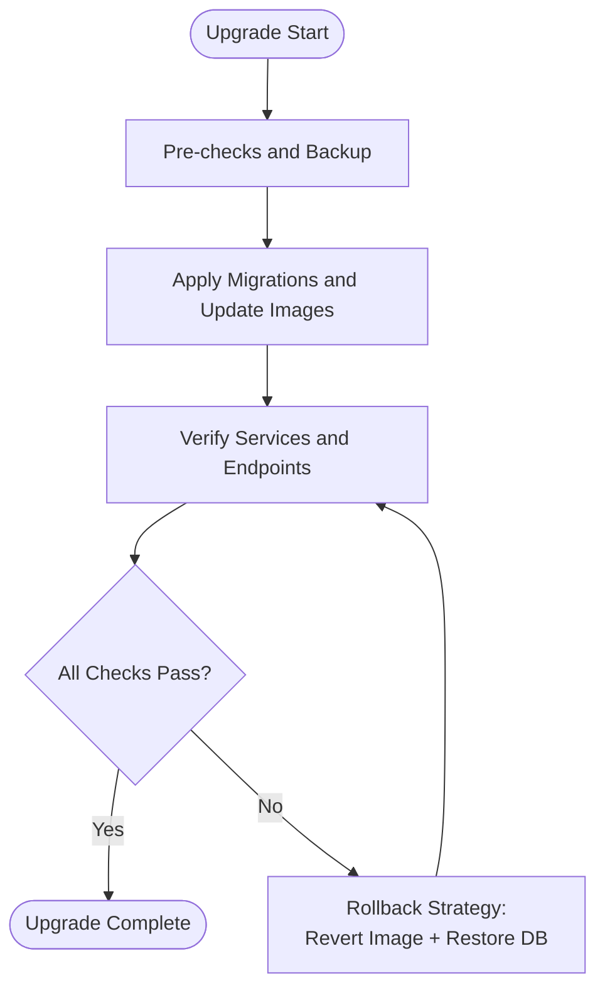
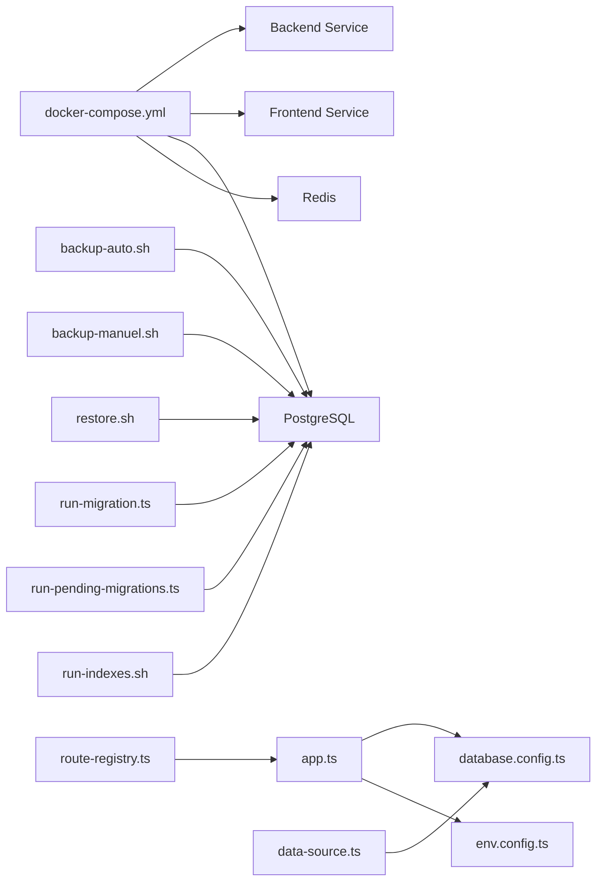

# Maintenance & Operations

<cite>
**Referenced Files in This Document**
- [docker-compose.yml](file://docker/docker-compose.yml)
- [backup-auto.sh](file://docker/scripts/backup-auto.sh)
- [backup-manuel.sh](file://docker/scripts/backup-manuel.sh)
- [restore.sh](file://docker/scripts/restore.sh)
- [install-cron.sh](file://docker/scripts/install-cron.sh)
- [cron-backup.txt](file://docker/scripts/cron-backup.txt)
- [update.sh](file://docker/scripts/update.sh)
- [validate-infrastructure.sh](file://docker/scripts/validate-infrastructure.sh)
- [deploy.sh](file://docker/deploy.sh)
- [Dockerfile.backend](file://docker/Dockerfile.backend)
- [Dockerfile.frontend](file://docker/Dockerfile.frontend)
- [nginx.conf](file://docker/nginx.conf)
- [README.md](file://docker/README.md)
- [QUICK-START.md](file://docker/QUICK-START.md)
- [PGADMIN-GUIDE.md](file://docker/PGADMIN-GUIDE.md)
- [099-add-monitoring-params.sql](file://backend/database/migrations/099-add-monitoring-params.sql)
- [run-migration.ts](file://backend/scripts/run-migration.ts)
- [run-pending-migrations.ts](file://backend/scripts/run-pending-migrations.ts)
- [run-indexes.sh](file://backend/scripts/run-indexes.sh)
- [analyze-indexes.ts](file://backend/scripts/analyze-indexes.ts)
- [fix-duplicate-index.sh](file://backend/scripts/fix-duplicate-index.sh)
- [package.json](file://backend/package.json)
- [app.ts](file://backend/src/app.ts)
- [index.ts](file://backend/src/index.ts)
- [database.config.ts](file://backend/src/config/database.config.ts)
- [env.config.ts](file://backend/src/config/env.config.ts)
- [data-source.ts](file://backend/src/database/data-source.ts)
- [route-registry.ts](file://backend/src/routes/route-registry.ts)
- [monitoring module](file://backend/src/modules/monitoring)
</cite>

## Table of Contents
1. [Introduction](#introduction)
2. [Project Structure](#project-structure)
3. [Core Components](#core-components)
4. [Architecture Overview](#architecture-overview)
5. [Detailed Component Analysis](#detailed-component-analysis)
6. [Dependency Analysis](#dependency-analysis)
7. [Performance Considerations](#performance-considerations)
8. [Troubleshooting Guide](#troubleshooting-guide)
9. [Conclusion](#conclusion)
10. [Appendices](#appendices)

## Introduction
This document provides operational and maintenance guidance for the eLISAschool platform, focusing on:
- Automated backup strategies and disaster recovery
- Data migration processes and version upgrade paths with rollback strategies
- System update procedures
- Performance monitoring, log analysis, and health checks
- Database optimization, cache management, and scaling considerations
- Routine maintenance tasks, cleanup procedures, and administration best practices

The content is derived from the repository’s Docker orchestration, scripts, backend configuration, migrations, and monitoring artifacts.

## Project Structure
Operational assets are primarily located under docker/ (orchestration, scripts, images), backend/scripts/ (migrations and utilities), and backend/src/config/ (runtime configuration). The root-level backups/ directory contains example SQL dumps used by restore workflows.

**Diagram sources**
- [docker-compose.yml](file://docker/docker-compose.yml)
- [backup-auto.sh](file://docker/scripts/backup-auto.sh)
- [backup-manuel.sh](file://docker/scripts/backup-manuel.sh)
- [restore.sh](file://docker/scripts/restore.sh)
- [install-cron.sh](file://docker/scripts/install-cron.sh)
- [cron-backup.txt](file://docker/scripts/cron-backup.txt)
- [update.sh](file://docker/scripts/update.sh)
- [validate-infrastructure.sh](file://docker/scripts/validate-infrastructure.sh)
- [deploy.sh](file://docker/deploy.sh)
- [Dockerfile.backend](file://docker/Dockerfile.backend)
- [Dockerfile.frontend](file://docker/Dockerfile.frontend)
- [nginx.conf](file://docker/nginx.conf)
- [run-migration.ts](file://backend/scripts/run-migration.ts)
- [run-pending-migrations.ts](file://backend/scripts/run-pending-migrations.ts)
- [run-indexes.sh](file://backend/scripts/run-indexes.sh)
- [analyze-indexes.ts](file://backend/scripts/analyze-indexes.ts)
- [fix-duplicate-index.sh](file://backend/scripts/fix-duplicate-index.sh)
- [package.json](file://backend/package.json)
- [app.ts](file://backend/src/app.ts)
- [index.ts](file://backend/src/index.ts)
- [database.config.ts](file://backend/src/config/database.config.ts)
- [env.config.ts](file://backend/src/config/env.config.ts)
- [data-source.ts](file://backend/src/database/data-source.ts)
- [route-registry.ts](file://backend/src/routes/route-registry.ts)
- [monitoring module](file://backend/src/modules/monitoring)

**Section sources**
- [docker-compose.yml](file://docker/docker-compose.yml)
- [README.md](file://docker/README.md)
- [QUICK-START.md](file://docker/QUICK-START.md)

## Core Components
- Backup automation: daily cron-driven PostgreSQL dump via containerized scripts.
- Manual backup and restore: one-off operations for ad-hoc snapshots and DR drills.
- Migration tooling: TypeScript-based runners to apply pending migrations and indexes.
- Health and monitoring: runtime parameters and endpoints exposed through the application layer.
- Update and deployment: scripted updates and validation helpers for infrastructure readiness.

Key responsibilities:
- Ensure data durability and recoverability (backups, restores).
- Maintain schema consistency across environments (migrations).
- Provide observability signals (health checks, metrics).
- Standardize safe upgrades and rollbacks.

**Section sources**
- [backup-auto.sh](file://docker/scripts/backup-auto.sh)
- [backup-manuel.sh](file://docker/scripts/backup-manuel.sh)
- [restore.sh](file://docker/scripts/restore.sh)
- [install-cron.sh](file://docker/scripts/install-cron.sh)
- [cron-backup.txt](file://docker/scripts/cron-backup.txt)
- [run-migration.ts](file://backend/scripts/run-migration.ts)
- [run-pending-migrations.ts](file://backend/scripts/run-pending-migrations.ts)
- [run-indexes.sh](file://backend/scripts/run-indexes.sh)
- [analyze-indexes.ts](file://backend/scripts/analyze-indexes.ts)
- [fix-duplicate-index.sh](file://backend/scripts/fix-duplicate-index.sh)
- [099-add-monitoring-params.sql](file://backend/database/migrations/099-add-monitoring-params.sql)
- [app.ts](file://backend/src/app.ts)
- [index.ts](file://backend/src/index.ts)
- [database.config.ts](file://backend/src/config/database.config.ts)
- [env.config.ts](file://backend/src/config/env.config.ts)
- [data-source.ts](file://backend/src/database/data-source.ts)
- [route-registry.ts](file://backend/src/routes/route-registry.ts)
- [monitoring module](file://backend/src/modules/monitoring)

## Architecture Overview
The operational architecture integrates container orchestration, scheduled jobs, database migrations, and application health endpoints.

**Diagram sources**
- [install-cron.sh](file://docker/scripts/install-cron.sh)
- [cron-backup.txt](file://docker/scripts/cron-backup.txt)
- [backup-auto.sh](file://docker/scripts/backup-auto.sh)
- [restore.sh](file://docker/scripts/restore.sh)
- [app.ts](file://backend/src/app.ts)
- [index.ts](file://backend/src/index.ts)
- [monitoring module](file://backend/src/modules/monitoring)

## Detailed Component Analysis

### Automated Backups
- Scheduling: install-cron.sh installs a cron entry defined in cron-backup.txt that triggers backup-auto.sh.
- Execution: backup-auto.sh performs a logical backup of the PostgreSQL instance using standard tools available in the environment and writes timestamped SQL files into the designated volume.
- Retention: implement rotation policies to retain daily, weekly, and monthly snapshots; remove older files beyond retention windows.

Operational notes:
- Ensure the backup user has sufficient privileges for consistent dumps.
- Validate backup integrity periodically by restoring to a staging environment.
- Secure backup storage with appropriate access controls and encryption at rest.

**Section sources**
- [install-cron.sh](file://docker/scripts/install-cron.sh)
- [cron-backup.txt](file://docker/scripts/cron-backup.txt)
- [backup-auto.sh](file://docker/scripts/backup-auto.sh)

### Disaster Recovery Procedures
- Restore workflow: use restore.sh to import a selected SQL dump into the target database.
- Pre-restore checklist:
  - Stop write traffic or switch to read-only mode if supported.
  - Verify target database connectivity and credentials.
  - Confirm the chosen backup file exists and is not corrupted.
- Post-restore verification:
  - Run critical queries to validate key entities and counts.
  - Execute smoke tests against API endpoints.
  - Re-enable write traffic and monitor error rates.

**Diagram sources**
- [restore.sh](file://docker/scripts/restore.sh)

**Section sources**
- [restore.sh](file://docker/scripts/restore.sh)

### Data Migration Processes
- Pending migrations: run-pending-migrations.ts applies only unapplied migrations based on tracked state.
- Full migration runner: run-migration.ts executes migrations sequentially with transactional safety where applicable.
- Index management: run-indexes.sh applies performance-related indexes; analyze-indexes.ts helps identify missing or redundant indexes; fix-duplicate-index.sh resolves index conflicts.

Best practices:
- Always back up before running migrations.
- Use feature flags or phased rollout for large schema changes.
- Keep migrations idempotent and reversible when possible.

**Section sources**
- [run-pending-migrations.ts](file://backend/scripts/run-pending-migrations.ts)
- [run-migration.ts](file://backend/scripts/run-migration.ts)
- [run-indexes.sh](file://backend/scripts/run-indexes.sh)
- [analyze-indexes.ts](file://backend/scripts/analyze-indexes.ts)
- [fix-duplicate-index.sh](file://backend/scripts/fix-duplicate-index.sh)

### System Update Procedures
- Update script: update.sh automates pulling new images, rebuilding containers, and applying necessary steps.
- Deployment helper: deploy.sh coordinates service restarts and post-deploy validations.
- Infrastructure validation: validate-infrastructure.sh checks prerequisites such as ports, dependencies, and environment variables.

Recommended flow:
- Pre-update: run validate-infrastructure.sh and take a manual backup.
- Apply update: execute update.sh or deploy.sh depending on environment.
- Post-update: verify services, run smoke tests, and check logs for errors.

**Section sources**
- [update.sh](file://docker/scripts/update.sh)
- [deploy.sh](file://docker/deploy.sh)
- [validate-infrastructure.sh](file://docker/scripts/validate-infrastructure.sh)

### Version Upgrade Paths and Rollback Strategies
- Upgrade path:
  - Stage: test migrations and updates in a non-production environment.
  - Production: schedule maintenance window, perform pre-upgrade backup, run update/deploy scripts, then verify.
- Rollback strategy:
  - Application: revert to previous image tag if needed.
  - Database: restore from pre-upgrade backup if schema changes are not backward-compatible.
  - Configuration: keep environment diffs minimal; store config changes alongside code.

[No diagram sources since this is a conceptual flow]

### Performance Monitoring, Logs, and Health Checks
- Monitoring parameters: migration 099 adds monitoring-related parameters to support observability.
- Health endpoints: application exposes health and status endpoints via the main app and route registry.
- Logging: ensure structured logging is enabled and centralized; rotate logs to prevent disk exhaustion.

Operational tips:
- Expose a lightweight health endpoint for orchestrator liveness/readiness probes.
- Collect metrics (latency, error rate, queue depth) and set alerts.
- Correlate logs with request IDs for faster triage.

**Section sources**
- [099-add-monitoring-params.sql](file://backend/database/migrations/099-add-monitoring-params.sql)
- [app.ts](file://backend/src/app.ts)
- [index.ts](file://backend/src/index.ts)
- [route-registry.ts](file://backend/src/routes/route-registry.ts)
- [monitoring module](file://backend/src/modules/monitoring)

### Database Optimization
- Index lifecycle:
  - Create targeted indexes for hot queries.
  - Analyze usage patterns with analyze-indexes.ts.
  - Fix duplicates and bloat with fix-duplicate-index.sh and vacuum/reindex routines.
- Query tuning:
  - Review slow query logs.
  - Normalize heavy joins and add covering indexes where appropriate.
- Storage:
  - Schedule regular VACUUM and ANALYZE.
  - Monitor table and index sizes; archive historical data as needed.

**Section sources**
- [run-indexes.sh](file://backend/scripts/run-indexes.sh)
- [analyze-indexes.ts](file://backend/scripts/analyze-indexes.ts)
- [fix-duplicate-index.sh](file://backend/scripts/fix-duplicate-index.sh)

### Cache Management
- Redis integration: configure connection parameters via environment settings and ensure availability.
- Cache policies:
  - Define TTLs per key type.
  - Implement cache invalidation on writes.
  - Handle cache misses gracefully without thundering herds.
- Observability:
  - Track hit/miss ratios and memory usage.
  - Alert on eviction spikes.

**Section sources**
- [env.config.ts](file://backend/src/config/env.config.ts)
- [database.config.ts](file://backend/src/config/database.config.ts)

### Scaling Considerations
- Horizontal scaling:
  - Stateless backend instances behind a load balancer.
  - Shared external cache and database.
- Vertical scaling:
  - Increase CPU/memory for DB and app nodes based on utilization.
- Connection pooling:
  - Tune pool sizes for DB and cache clients.
- Caching layers:
  - Add CDN/static asset caching for frontend.
  - Use response caching for read-heavy endpoints.

**Section sources**
- [docker-compose.yml](file://docker/docker-compose.yml)
- [nginx.conf](file://docker/nginx.conf)
- [Dockerfile.backend](file://docker/Dockerfile.backend)
- [Dockerfile.frontend](file://docker/Dockerfile.frontend)

### Routine Maintenance Tasks
- Weekly:
  - Verify latest backups restored successfully in staging.
  - Review index usage and growth trends.
  - Rotate logs and clean temporary files.
- Monthly:
  - Test full disaster recovery drill.
  - Review dependency updates and security advisories.
  - Audit permissions and access tokens.
- Quarterly:
  - Capacity planning review.
  - Schema evolution review and deprecations.

[No sources needed since this section provides general guidance]

### Cleanup Procedures
- Remove stale backups beyond retention.
- Clean unused Docker images and volumes.
- Purge old audit logs and analytics data according to policy.
- Archive closed academic years or periods as applicable.

[No sources needed since this section provides general guidance]

### Administration Best Practices
- Change control:
  - Require peer review for migrations and config changes.
  - Tag releases and maintain changelogs.
- Secrets management:
  - Store secrets in secure vaults; never commit them.
- Documentation:
  - Keep runbooks updated for common incidents.
- Observability:
  - Centralize logs and metrics; define SLOs and alerting rules.

[No sources needed since this section provides general guidance]

## Dependency Analysis
Operational components depend on orchestration, scripts, and runtime configuration.

**Diagram sources**
- [docker-compose.yml](file://docker/docker-compose.yml)
- [backup-auto.sh](file://docker/scripts/backup-auto.sh)
- [backup-manuel.sh](file://docker/scripts/backup-manuel.sh)
- [restore.sh](file://docker/scripts/restore.sh)
- [run-migration.ts](file://backend/scripts/run-migration.ts)
- [run-pending-migrations.ts](file://backend/scripts/run-pending-migrations.ts)
- [run-indexes.sh](file://backend/scripts/run-indexes.sh)
- [app.ts](file://backend/src/app.ts)
- [database.config.ts](file://backend/src/config/database.config.ts)
- [env.config.ts](file://backend/src/config/env.config.ts)
- [data-source.ts](file://backend/src/database/data-source.ts)
- [route-registry.ts](file://backend/src/routes/route-registry.ts)

**Section sources**
- [docker-compose.yml](file://docker/docker-compose.yml)
- [package.json](file://backend/package.json)

## Performance Considerations
- Database:
  - Right-size connections and buffers.
  - Use partial indexes for filtered queries.
  - Monitor lock contention and long-running transactions.
- Application:
  - Enable compression and HTTP/2.
  - Tune worker threads/processes based on CPU cores.
- Caching:
  - Prefer read-through caches for hot data.
  - Avoid cache stampedes with jittered TTLs.
- I/O:
  - Place logs and backups on separate disks or volumes.
  - Use SSD-backed storage for databases.

[No sources needed since this section provides general guidance]

## Troubleshooting Guide
Common issues and resolutions:
- Backup failures:
  - Check network connectivity to PostgreSQL.
  - Validate credentials and permissions.
  - Inspect disk space and volume mounts.
- Restore problems:
  - Ensure target DB is empty or compatible.
  - Verify dump format and encoding.
  - Re-run with verbose logging.
- Migration errors:
  - Identify failed step and inspect logs.
  - Roll back partially applied migrations if needed.
  - Re-run with dry-run or staged approach.
- Health check failures:
  - Inspect application logs and dependency status.
  - Validate environment variables and secrets.
  - Restart affected services after remediation.

**Section sources**
- [backup-auto.sh](file://docker/scripts/backup-auto.sh)
- [restore.sh](file://docker/scripts/restore.sh)
- [run-migration.ts](file://backend/scripts/run-migration.ts)
- [app.ts](file://backend/src/app.ts)
- [index.ts](file://backend/src/index.ts)

## Conclusion
This guide consolidates operational procedures for backups, disaster recovery, migrations, updates, monitoring, and maintenance. By following these practices and leveraging the provided scripts and configurations, teams can maintain high availability, data integrity, and performance for the eLISAschool platform.

[No sources needed since this section summarizes without analyzing specific files]

## Appendices

### Quick Reference Commands
- Install cron for automated backups: see install-cron.sh and cron-backup.txt.
- Trigger a manual backup: see backup-manuel.sh.
- Restore from a backup: see restore.sh.
- Apply pending migrations: see run-pending-migrations.ts.
- Apply all migrations: see run-migration.ts.
- Manage indexes: see run-indexes.sh, analyze-indexes.ts, fix-duplicate-index.sh.
- Update services: see update.sh and deploy.sh.
- Validate infrastructure: see validate-infrastructure.sh.

**Section sources**
- [install-cron.sh](file://docker/scripts/install-cron.sh)
- [cron-backup.txt](file://docker/scripts/cron-backup.txt)
- [backup-manuel.sh](file://docker/scripts/backup-manuel.sh)
- [restore.sh](file://docker/scripts/restore.sh)
- [run-pending-migrations.ts](file://backend/scripts/run-pending-migrations.ts)
- [run-migration.ts](file://backend/scripts/run-migration.ts)
- [run-indexes.sh](file://backend/scripts/run-indexes.sh)
- [analyze-indexes.ts](file://backend/scripts/analyze-indexes.ts)
- [fix-duplicate-index.sh](file://backend/scripts/fix-duplicate-index.sh)
- [update.sh](file://docker/scripts/update.sh)
- [deploy.sh](file://docker/deploy.sh)
- [validate-infrastructure.sh](file://docker/scripts/validate-infrastructure.sh)

### Additional Operational References
- Docker setup and quick start: README.md, QUICK-START.md.
- Admin console access: PGADMIN-GUIDE.md.
- Frontend and backend build definitions: Dockerfile.frontend, Dockerfile.backend.
- Reverse proxy configuration: nginx.conf.

**Section sources**
- [README.md](file://docker/README.md)
- [QUICK-START.md](file://docker/QUICK-START.md)
- [PGADMIN-GUIDE.md](file://docker/PGADMIN-GUIDE.md)
- [Dockerfile.frontend](file://docker/Dockerfile.frontend)
- [Dockerfile.backend](file://docker/Dockerfile.backend)
- [nginx.conf](file://docker/nginx.conf)