# Multi-Tenant Management

<cite>
**Referenced Files in This Document**
- [ANALYSE-ARCHITECTURE-MULTI-TENANT.md](file://docs/analyses/ANALYSE-ARCHITECTURE-MULTI-TENANT.md)
- [IMPLÉMENTATION-MULTI-TENANT-V3-FINAL.md](file://docs/implementations/IMPLÉMENTATION-MULTI-TENANT-V3-FINAL.md)
- [GUIDE-TEST-MULTI-TENANT-V3.md](file://docs/guides/GUIDE-TEST-MULTI-TENANT-V3.md)
- [CORRECTIONS-COHERENCE-MULTI-TENANT.md](file://docs/corrections/CORRECTIONS-COHERENCE-MULTI-TENANT.md)
- [050-multi-tenant-v3-max-etablissements.sql](file://backend/database/migrations/050-multi-tenant-v3-max-etablissements.sql)
- [080-preferences-utilisateur-multi-tenant.sql](file://backend/database/migrations/080-preferences-utilisateur-multi-tenant.sql)
- [081-module-apparence-fonds.sql](file://backend/database/migrations/081-module-apparence-fonds.sql)
- [079-add-roleId-utilisateur-etablissements.sql](file://backend/database/migrations/079-add-roleId-utilisateur-etablissements.sql)
- [076-permissions-groupes-etablissements.sql](file://backend/database/migrations/076-permissions-groupes-etablissements.sql)
- [075-module-groupes-etablissements.sql](file://backend/database/migrations/075-module-groupes-etablissements.sql)
- [046-dashboard-config.sql](file://backend/database/migrations/046-dashboard-config.sql)
- [046-types-contrat-personnalises.sql](file://backend/database/migrations/046-types-contrat-personnalises.sql)
- [046-organisation-performance-avancee.sql](file://backend/database/migrations/046-organisation-performance-avancee.sql)
- [042-annonces-performance-optimization.sql](file://backend/database/migrations/042-annonces-performance-optimization.sql)
- [009-performance-indexes.sql](file://backend/database/migrations/009-performance-indexes.sql)
- [backup-auto.sh](file://docker/scripts/backup-auto.sh)
- [restore.sh](file://docker/scripts/restore.sh)
- [cron-backup.txt](file://docker/scripts/cron-backup.txt)
- [deploy-all-migrations.sh](file://backend/deploy-all-migrations.sh)
- [run-migration.ts](file://backend/scripts/run-migration.ts)
- [migrate-rbac-v3.sql](file://backend/database/migrations/migrate-rbac-v3.sql)
- [PERMISSIONS-GROUPES-SEED-UPDATE.md](file://backend/database/migrations/PERMISSIONS-GROUPES-SEED-UPDATE.md)
- [README-075-GROUPES.md](file://backend/database/migrations/README-075-GROUPES.md)
- [MIGRATION-RBAC-v3-MULTI-TENANT-STRICT.md](file://docs/migrations/MIGRATION-RBAC-v3-MULTI-TENANT-STRICT.md)
- [IMPLEMENTATION-MULTI-ETABLISSEMENTS-TERMINEE.md](file://docs/implementations/IMPLEMENTATION-MULTI-ETABLISSEMENTS-TERMINEE.md)
- [AUTHENTICATION-MULTI-ETABLISSEMENT.md](file://docs/_multi-tenant/AUTHENTICATION-MULTI-ETABLISSEMENT.md)
- [BACKUP-SYSTEM-USER-GUIDE.md](file://docs/autres/_backup-system/BACKUP-SYSTEM-USER-GUIDE.md)
</cite>

## Table of Contents
1. [Introduction](#introduction)
2. [Project Structure](#project-structure)
3. [Core Components](#core-components)
4. [Architecture Overview](#architecture-overview)
5. [Detailed Component Analysis](#detailed-component-analysis)
6. [Dependency Analysis](#dependency-analysis)
7. [Performance Considerations](#performance-considerations)
8. [Troubleshooting Guide](#troubleshooting-guide)
9. [Conclusion](#conclusion)
10. [Appendices](#appendices)

## Introduction
This document provides a comprehensive FAQ for multi-tenant setup and management across institutions (établissements). It covers tenant isolation strategies, data separation mechanisms, cross-tenant operations, user provisioning with role inheritance and permission scoping, tenant-specific configurations and branding, resource allocation policies, performance considerations, backup strategies, and migration procedures between tenants. The content is grounded in the repository’s architecture, migrations, scripts, and documentation.

## Project Structure
The multi-tenant capability spans database schema changes, RBAC enhancements, configuration modules, and operational scripts:
- Database migrations define tenant boundaries, roles per institution, permissions scoped to groups and establishments, and tenant-aware preferences and appearance settings.
- Operational scripts provide backup, restore, and migration execution workflows.
- Documentation outlines implementation details, testing guidance, and coherence corrections.

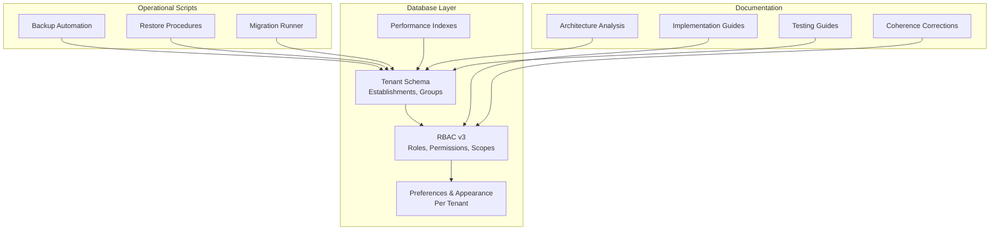

[No sources needed since this diagram shows conceptual workflow, not actual code structure]

## Core Components
- Tenant Identity and Boundaries: Establishments as tenants; users belong to an establishment via roles and memberships.
- Role Inheritance and Permission Scoping: Roles defined per group/establishment; permissions enforced at request time with tenant context.
- Tenant-Aware Configuration: Preferences and appearance stored per tenant or per user within a tenant.
- Cross-Tenant Operations: Controlled by super-admin capabilities and explicit scoping rules.
- Backup and Restore: Automated backups and restore scripts tailored for multi-tenant environments.
- Migration Execution: Centralized runner and SQL migrations for RBAC and tenant features.

**Section sources**
- [ANALYSE-ARCHITECTURE-MULTI-TENANT.md](file://docs/analyses/ANALYSE-ARCHITECTURE-MULTI-TENANT.md)
- [IMPLÉMENTATION-MULTI-TENANT-V3-FINAL.md](file://docs/implementations/IMPLÉMENTATION-MULTI-TENANT-V3-FINAL.md)
- [GUIDE-TEST-MULTI-TENANT-V3.md](file://docs/guides/GUIDE-TEST-MULTI-TENANT-V3.md)
- [CORRECTIONS-COHERENCE-MULTI-TENANT.md](file://docs/corrections/CORRECTIONS-COHERENCE-MULTI-TENANT.md)

## Architecture Overview
Multi-tenant architecture centers on establishment-scoped entities and RBAC v3 enforcement:
- Data Isolation: All business tables include establishment identifiers where applicable; queries are filtered by current tenant context.
- RBAC v3: Roles and permissions are associated with groups and establishments; authorization middleware enforces scope.
- Tenant Configurations: Preferences and appearance modules store tenant-specific values.
- Operational Flow: Backups capture tenant data; restores target specific tenants; migrations apply schema and seed updates.

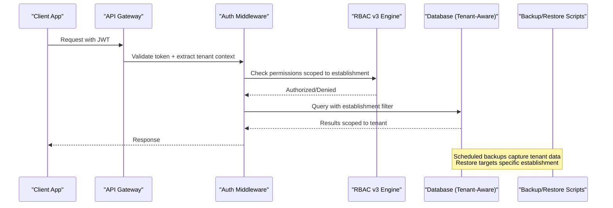

**Diagram sources**
- [075-module-groupes-etablissements.sql](file://backend/database/migrations/075-module-groupes-etablissements.sql)
- [076-permissions-groupes-etablissements.sql](file://backend/database/migrations/076-permissions-groupes-etablissements.sql)
- [079-add-roleId-utilisateur-etablissements.sql](file://backend/database/migrations/079-add-roleId-utilisateur-etablissements.sql)
- [080-preferences-utilisateur-multi-tenant.sql](file://backend/database/migrations/080-preferences-utilisateur-multi-tenant.sql)
- [081-module-apparence-fonds.sql](file://backend/database/migrations/081-module-apparence-fonds.sql)
- [backup-auto.sh](file://docker/scripts/backup-auto.sh)
- [restore.sh](file://docker/scripts/restore.sh)

## Detailed Component Analysis

### Tenant Isolation Strategies
- Establishment as Tenant: Each institution is represented by an establishment entity; all relevant records carry an establishment identifier.
- Group-Based Access: Users are assigned to groups that are scoped to an establishment; permissions are evaluated against these scopes.
- Context Propagation: Authentication extracts the active establishment from the session/token; authorization checks enforce it.

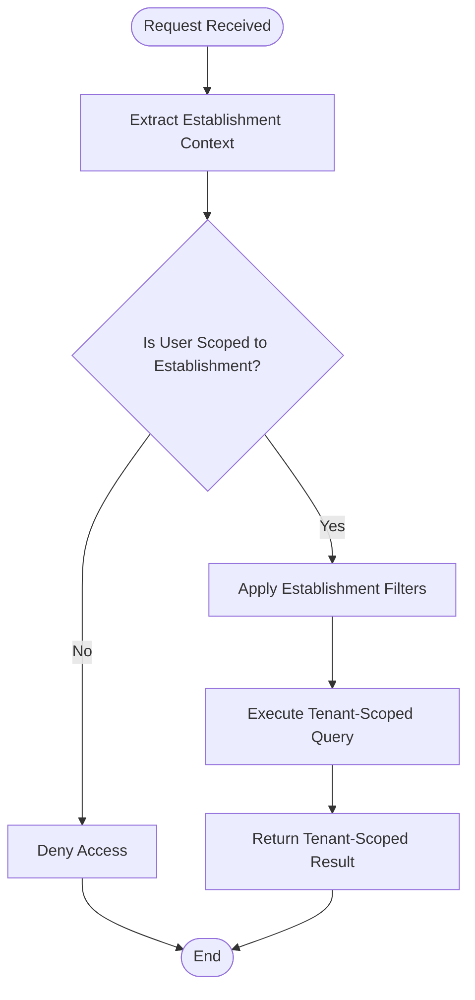

**Diagram sources**
- [075-module-groupes-etablissements.sql](file://backend/database/migrations/075-module-groupes-etablissements.sql)
- [076-permissions-groupes-etablissements.sql](file://backend/database/migrations/076-permissions-groupes-etablissements.sql)
- [079-add-roleId-utilisateur-etablissements.sql](file://backend/database/migrations/079-add-roleId-utilisateur-etablissements.sql)

**Section sources**
- [ANALYSE-ARCHITECTURE-MULTI-TENANT.md](file://docs/analyses/ANALYSE-ARCHITECTURE-MULTI-TENANT.md)
- [IMPLÉMENTATION-MULTI-TENANT-V3-FINAL.md](file://docs/implementations/IMPLÉMENTATION-MULTI-TENANT-V3-FINAL.md)
- [075-module-groupes-etablissements.sql](file://backend/database/migrations/075-module-groupes-etablissements.sql)
- [076-permissions-groupes-etablissements.sql](file://backend/database/migrations/076-permissions-groupes-etablissements.sql)
- [079-add-roleId-utilisateur-etablissements.sql](file://backend/database/migrations/079-add-roleId-utilisateur-etablissements.sql)

### Data Separation Mechanisms
- Schema Design: Business tables include establishment IDs; indexes optimize tenant-scoped queries.
- Preference Storage: Per-user and per-tenant preferences ensure isolation of UI and feature flags.
- Appearance Customization: Branding assets and themes are stored per tenant.

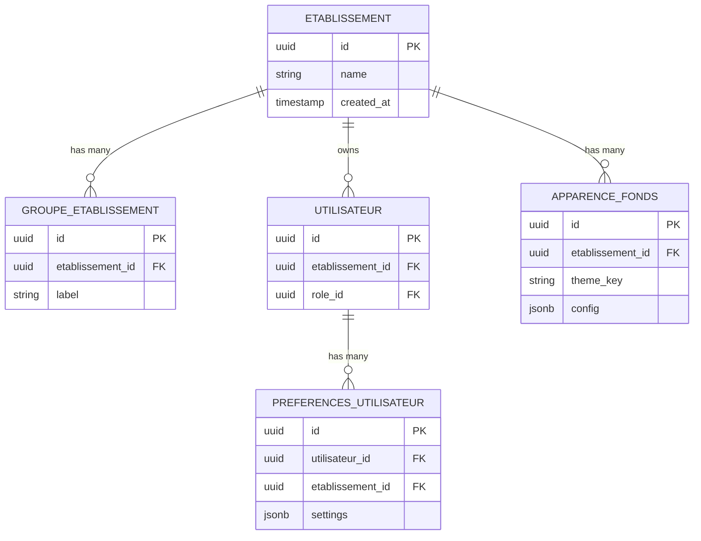

**Diagram sources**
- [080-preferences-utilisateur-multi-tenant.sql](file://backend/database/migrations/080-preferences-utilisateur-multi-tenant.sql)
- [081-module-apparence-fonds.sql](file://backend/database/migrations/081-module-apparence-fonds.sql)
- [075-module-groupes-etablissements.sql](file://backend/database/migrations/075-module-groupes-etablissements.sql)
- [079-add-roleId-utilisateur-etablissements.sql](file://backend/database/migrations/079-add-roleId-utilisateur-etablissements.sql)

**Section sources**
- [080-preferences-utilisateur-multi-tenant.sql](file://backend/database/migrations/080-preferences-utilisateur-multi-tenant.sql)
- [081-module-apparence-fonds.sql](file://backend/database/migrations/081-module-apparence-fonds.sql)
- [075-module-groupes-etablissements.sql](file://backend/database/migrations/075-module-groupes-etablissements.sql)
- [079-add-roleId-utilisateur-etablissements.sql](file://backend/database/migrations/079-add-roleId-utilisateur-etablissements.sql)

### Cross-Tenant Operations
- Super-Admin Capabilities: Certain operations allow cross-tenant access when explicitly authorized.
- Audit Trails: Cross-tenant actions should be audited to maintain traceability.
- Guardrails: Ensure cross-tenant operations cannot bypass tenant filters unintentionally.

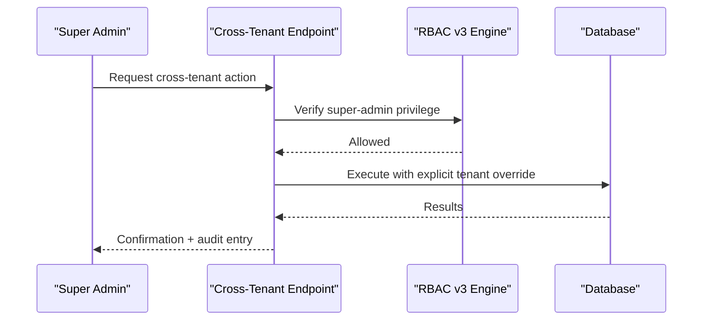

**Diagram sources**
- [076-permissions-groupes-etablissements.sql](file://backend/database/migrations/076-permissions-groupes-etablissements.sql)
- [migrate-rbac-v3.sql](file://backend/database/migrations/migrate-rbac-v3.sql)

**Section sources**
- [MIGRATION-RBAC-v3-MULTI-TENANT-STRICT.md](file://docs/migrations/MIGRATION-RBAC-v3-MULTI-TENANT-STRICT.md)
- [PERMISSIONS-GROUPES-SEED-UPDATE.md](file://backend/database/migrations/PERMISSIONS-GROUPES-SEED-UPDATE.md)

### User Provisioning Across Multiple Institutions
- Role Assignment: Users are linked to roles within an establishment; role inheritance patterns derive permissions from group-based roles.
- Onboarding Workflow: Create user, assign establishment, assign role/group, configure preferences.
- Validation: Ensure no orphaned references and consistent establishment scoping.

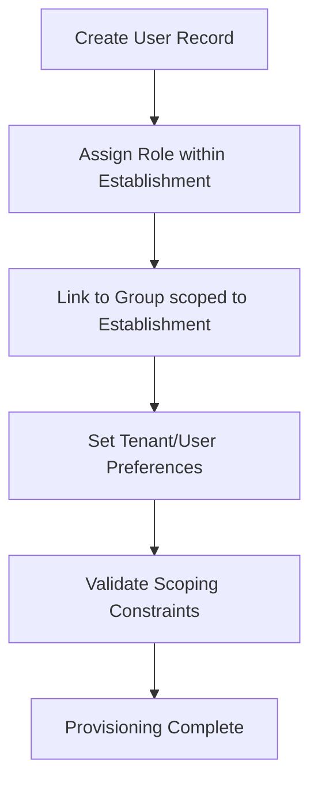

**Diagram sources**
- [079-add-roleId-utilisateur-etablissements.sql](file://backend/database/migrations/079-add-roleId-utilisateur-etablissements.sql)
- [075-module-groupes-etablissements.sql](file://backend/database/migrations/075-module-groupes-etablissements.sql)
- [080-preferences-utilisateur-multi-tenant.sql](file://backend/database/migrations/080-preferences-utilisateur-multi-tenant.sql)

**Section sources**
- [README-075-GROUPES.md](file://backend/database/migrations/README-075-GROUPES.md)
- [079-add-roleId-utilisateur-etablissements.sql](file://backend/database/migrations/079-add-roleId-utilisateur-etablissements.sql)
- [075-module-groupes-etablissements.sql](file://backend/database/migrations/075-module-groupes-etablissements.sql)
- [080-preferences-utilisateur-multi-tenant.sql](file://backend/database/migrations/080-preferences-utilisateur-multi-tenant.sql)

### Role Inheritance Patterns and Permission Scoping
- Role Hierarchy: Roles inherit permissions through groups; establishment scoping ensures isolation.
- Permission Checks: Authorization evaluates user roles, group membership, and establishment context.
- Seed Updates: Seeds keep permission definitions aligned with RBAC v3 requirements.

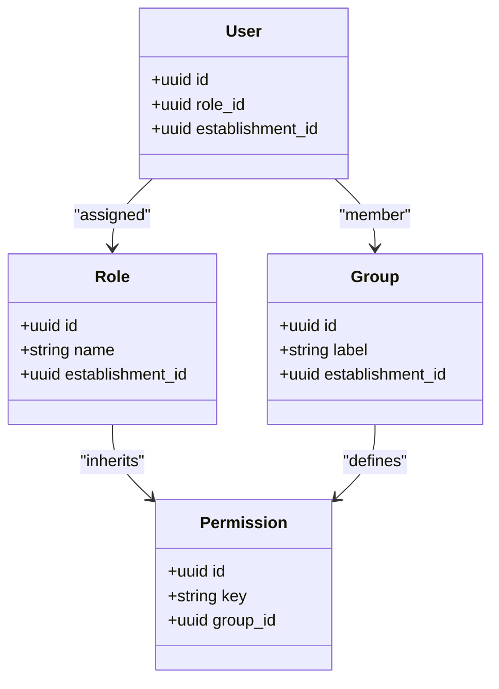

**Diagram sources**
- [076-permissions-groupes-etablissements.sql](file://backend/database/migrations/076-permissions-groupes-etablissements.sql)
- [079-add-roleId-utilisateur-etablissements.sql](file://backend/database/migrations/079-add-roleId-utilisateur-etablissements.sql)
- [migrate-rbac-v3.sql](file://backend/database/migrations/migrate-rbac-v3.sql)

**Section sources**
- [PERMISSIONS-GROUPES-SEED-UPDATE.md](file://backend/database/migrations/PERMISSIONS-GROUPES-SEED-UPDATE.md)
- [MIGRATION-RBAC-v3-MULTI-TENANT-STRICT.md](file://docs/migrations/MIGRATION-RBAC-v3-MULTI-TENANT-STRICT.md)

### Tenant-Specific Configurations and Branding Customization
- Dashboard Config: Tenant-level dashboard settings control module visibility and layout.
- Contract Types: Customizable contract types per establishment support institutional policies.
- Appearance: Themes and backgrounds are configured per establishment.

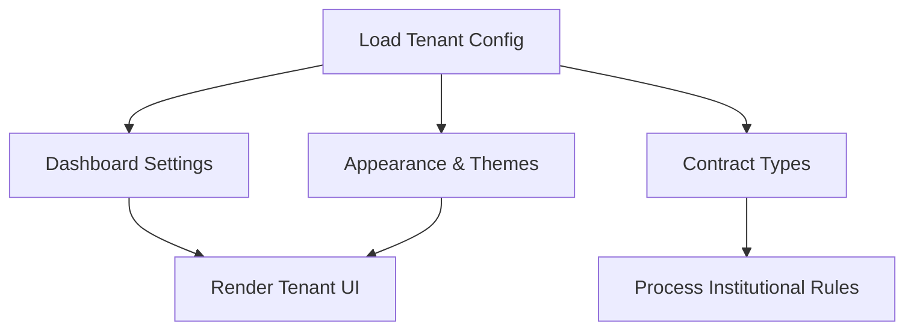

**Diagram sources**
- [046-dashboard-config.sql](file://backend/database/migrations/046-dashboard-config.sql)
- [046-types-contrat-personnalises.sql](file://backend/database/migrations/046-types-contrat-personnalises.sql)
- [081-module-apparence-fonds.sql](file://backend/database/migrations/081-module-apparence-fonds.sql)

**Section sources**
- [046-dashboard-config.sql](file://backend/database/migrations/046-dashboard-config.sql)
- [046-types-contrat-personnalises.sql](file://backend/database/migrations/046-types-contrat-personnalises.sql)
- [081-module-apparence-fonds.sql](file://backend/database/migrations/081-module-apparence-fonds.sql)

### Resource Allocation Policies
- Max Establishments: Limits on the number of establishments per deployment instance.
- Module Activation: Per-tenant activation controls resource usage and feature exposure.
- Performance Tuning: Indexes and optimizations reduce query overhead under multi-tenant load.

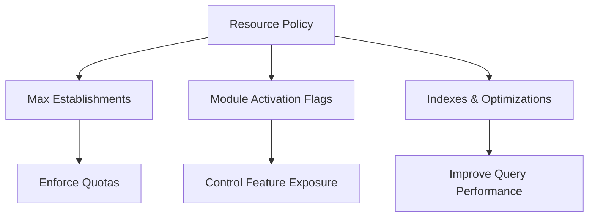

**Diagram sources**
- [050-multi-tenant-v3-max-etablissements.sql](file://backend/database/migrations/050-multi-tenant-v3-max-etablissements.sql)
- [046-organisation-performance-avancee.sql](file://backend/database/migrations/046-organisation-performance-avancee.sql)
- [009-performance-indexes.sql](file://backend/database/migrations/009-performance-indexes.sql)

**Section sources**
- [050-multi-tenant-v3-max-etablissements.sql](file://backend/database/migrations/050-multi-tenant-v3-max-etablissements.sql)
- [046-organisation-performance-avancee.sql](file://backend/database/migrations/046-organisation-performance-avancee.sql)
- [009-performance-indexes.sql](file://backend/database/migrations/009-performance-indexes.sql)

### Performance Considerations
- Indexing Strategy: Comprehensive indexes improve tenant-scoped query performance.
- Announcement Optimization: Dedicated optimizations reduce contention and latency.
- Organization Performance: Advanced organization-related optimizations enhance throughput.

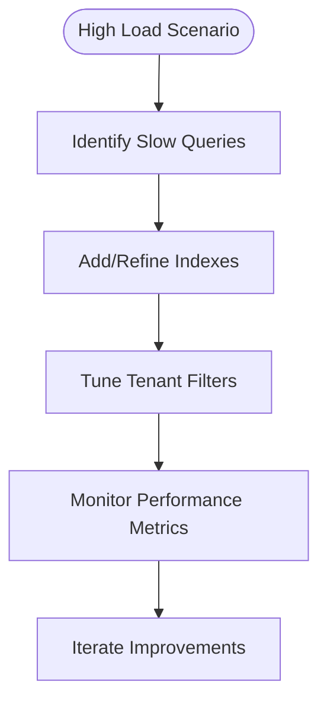

**Diagram sources**
- [009-performance-indexes.sql](file://backend/database/migrations/009-performance-indexes.sql)
- [042-annonces-performance-optimization.sql](file://backend/database/migrations/042-annonces-performance-optimization.sql)
- [046-organisation-performance-avancee.sql](file://backend/database/migrations/046-organisation-performance-avancee.sql)

**Section sources**
- [009-performance-indexes.sql](file://backend/database/migrations/009-performance-indexes.sql)
- [042-annonces-performance-optimization.sql](file://backend/database/migrations/042-annonces-performance-optimization.sql)
- [046-organisation-performance-avancee.sql](file://backend/database/migrations/046-organisation-performance-avancee.sql)

### Backup Strategies for Multi-Tenant Environments
- Automated Backups: Cron-driven backups capture full database snapshots.
- Manual Backups: On-demand backup scripts for pre/post-migration safety.
- Restore Procedures: Targeted restore processes for recovery and migration validation.

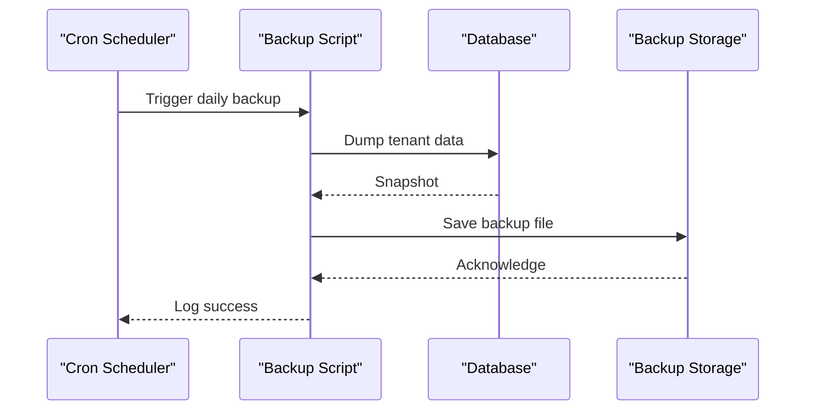

**Diagram sources**
- [backup-auto.sh](file://docker/scripts/backup-auto.sh)
- [cron-backup.txt](file://docker/scripts/cron-backup.txt)
- [restore.sh](file://docker/scripts/restore.sh)

**Section sources**
- [BACKUP-SYSTEM-USER-GUIDE.md](file://docs/autres/_backup-system/BACKUP-SYSTEM-USER-GUIDE.md)
- [backup-auto.sh](file://docker/scripts/backup-auto.sh)
- [restore.sh](file://docker/scripts/restore.sh)
- [cron-backup.txt](file://docker/scripts/cron-backup.txt)

### Migration Procedures Between Tenants
- Migration Runner: Centralized script executes pending migrations safely.
- RBAC v3 Migration: Strict multi-tenant RBAC migration ensures consistency.
- Deployment Scripts: Batch deployment for migrations and seeds.

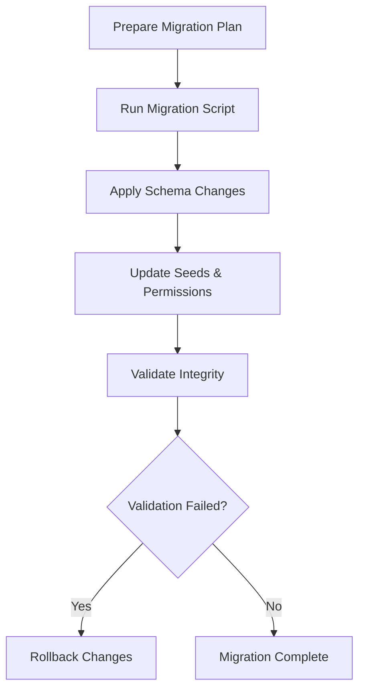

**Diagram sources**
- [run-migration.ts](file://backend/scripts/run-migration.ts)
- [deploy-all-migrations.sh](file://backend/deploy-all-migrations.sh)
- [migrate-rbac-v3.sql](file://backend/database/migrations/migrate-rbac-v3.sql)

**Section sources**
- [run-migration.ts](file://backend/scripts/run-migration.ts)
- [deploy-all-migrations.sh](file://backend/deploy-all-migrations.sh)
- [migrate-rbac-v3.sql](file://backend/database/migrations/migrate-rbac-v3.sql)
- [MIGRATION-RBAC-v3-MULTI-TENANT-STRICT.md](file://docs/migrations/MIGRATION-RBAC-v3-MULTI-TENANT-STRICT.md)

## Dependency Analysis
Key dependencies among multi-tenant components:
- RBAC v3 depends on establishment-scoped groups and roles.
- Preferences and appearance depend on establishment context.
- Performance indexes depend on tenant-scoped query patterns.
- Backup/restore depend on database connectivity and storage paths.

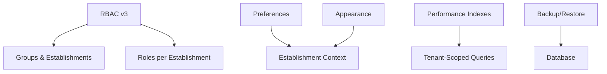

**Diagram sources**
- [075-module-groupes-etablissements.sql](file://backend/database/migrations/075-module-groupes-etablissements.sql)
- [076-permissions-groupes-etablissements.sql](file://backend/database/migrations/076-permissions-groupes-etablissements.sql)
- [079-add-roleId-utilisateur-etablissements.sql](file://backend/database/migrations/079-add-roleId-utilisateur-etablissements.sql)
- [080-preferences-utilisateur-multi-tenant.sql](file://backend/database/migrations/080-preferences-utilisateur-multi-tenant.sql)
- [081-module-apparence-fonds.sql](file://backend/database/migrations/081-module-apparence-fonds.sql)
- [009-performance-indexes.sql](file://backend/database/migrations/009-performance-indexes.sql)
- [backup-auto.sh](file://docker/scripts/backup-auto.sh)
- [restore.sh](file://docker/scripts/restore.sh)

**Section sources**
- [075-module-groupes-etablissements.sql](file://backend/database/migrations/075-module-groupes-etablissements.sql)
- [076-permissions-groupes-etablissements.sql](file://backend/database/migrations/076-permissions-groupes-etablissements.sql)
- [079-add-roleId-utilisateur-etablissements.sql](file://backend/database/migrations/079-add-roleId-utilisateur-etablissements.sql)
- [080-preferences-utilisateur-multi-tenant.sql](file://backend/database/migrations/080-preferences-utilisateur-multi-tenant.sql)
- [081-module-apparence-fonds.sql](file://backend/database/migrations/081-module-apparence-fonds.sql)
- [009-performance-indexes.sql](file://backend/database/migrations/009-performance-indexes.sql)
- [backup-auto.sh](file://docker/scripts/backup-auto.sh)
- [restore.sh](file://docker/scripts/restore.sh)

## Performance Considerations
- Use tenant-scoped indexes to minimize full table scans.
- Enable module activation selectively to reduce processing overhead.
- Monitor slow queries and refine filters based on establishment context.
- Schedule backups during off-peak hours to avoid contention.

[No sources needed since this section provides general guidance]

## Troubleshooting Guide
Common issues and resolutions:
- Unauthorized Cross-Tenant Access: Verify RBAC v3 permissions and establishment scoping.
- Missing Tenant Preferences: Ensure per-user and per-tenant preference records exist.
- Backup Failures: Check cron configuration and storage permissions.
- Migration Errors: Review migration logs and rollback if integrity checks fail.

**Section sources**
- [CORRECTIONS-COHERENCE-MULTI-TENANT.md](file://docs/corrections/CORRECTIONS-COHERENCE-MULTI-TENANT.md)
- [GUIDE-TEST-MULTI-TENANT-V3.md](file://docs/guides/GUIDE-TEST-MULTI-TENANT-V3.md)
- [cron-backup.txt](file://docker/scripts/cron-backup.txt)
- [run-migration.ts](file://backend/scripts/run-migration.ts)

## Conclusion
The multi-tenant system leverages establishment-scoped data, RBAC v3, and tenant-aware configurations to ensure strong isolation and customization. Operational scripts support robust backup and migration workflows. Adhering to the documented practices will help maintain security, performance, and reliability across institutions.

[No sources needed since this section summarizes without analyzing specific files]

## Appendices
- Testing Guidance: Follow the multi-tenant test guide to validate isolation and permissions.
- Implementation Summary: Refer to the final implementation document for end-to-end setup steps.
- Authentication Across Establishments: Consult the authentication guide for multi-establishment flows.

**Section sources**
- [GUIDE-TEST-MULTI-TENANT-V3.md](file://docs/guides/GUIDE-TEST-MULTI-TENANT-V3.md)
- [IMPLÉMENTATION-MULTI-TENANT-V3-FINAL.md](file://docs/implementations/IMPLÉMENTATION-MULTI-TENANT-V3-FINAL.md)
- [AUTHENTICATION-MULTI-ETABLISSEMENT.md](file://docs/_multi-tenant/AUTHENTICATION-MULTI-ETABLISSEMENT.md)