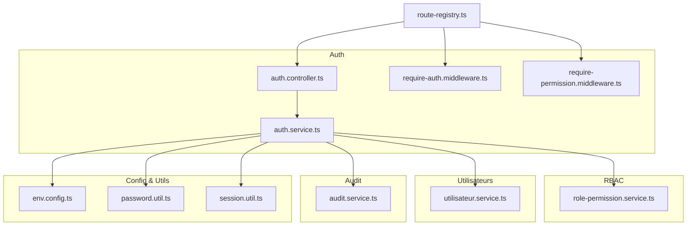
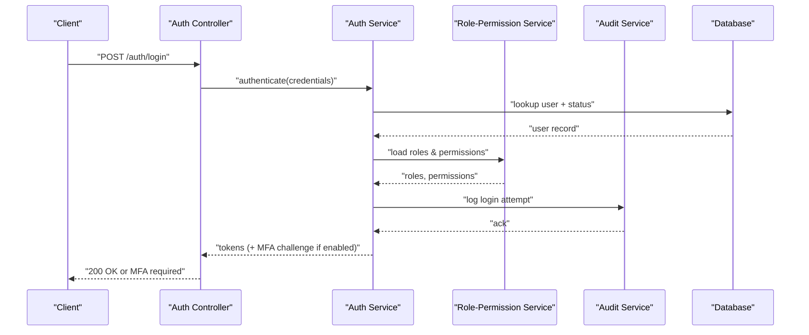
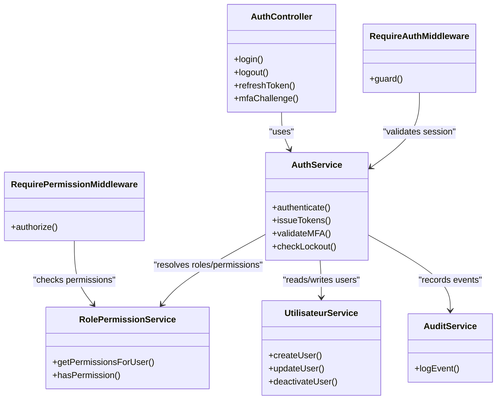

# User & Access Management

<cite>
**Referenced Files in This Document**
- [backend/src/modules/auth/controllers/auth.controller.ts](file://backend/src/modules/auth/controllers/auth.controller.ts)
- [backend/src/modules/auth/services/auth.service.ts](file://backend/src/modules/auth/services/auth.service.ts)
- [backend/src/modules/auth/middlewares/require-auth.middleware.ts](file://backend/src/modules/auth/middlewares/require-auth.middleware.ts)
- [backend/src/modules/auth/middlewares/require-permission.middleware.ts](file://backend/src/modules/auth/middlewares/require-permission.middleware.ts)
- [backend/src/modules/rbac/services/role-permission.service.ts](file://backend/src/modules/rbac/services/role-permission.service.ts)
- [backend/src/modules/utilisateurs/services/utilisateur.service.ts](file://backend/src/modules/utilisateurs/services/utilisateur.service.ts)
- [backend/src/modules/audit/services/audit.service.ts](file://backend/src/modules/audit/services/audit.service.ts)
- [backend/database/migrations/027-auth-multi-mode.sql](file://backend/database/migrations/027-auth-multi-mode.sql)
- [backend/database/migrations/043-permissions-critiques-manquantes.sql](file://backend/database/migrations/043-permissions-critiques-manquantes.sql)
- [backend/database/migrations/069-fix-super-admin-permissions.sql](file://backend/database/migrations/069-fix-super-admin-permissions.sql)
- [backend/database/migrations/070-fix-super-admin-all-permission.sql](file://backend/database/migrations/070-fix-super-admin-all-permission.sql)
- [backend/database/migrations/079-add-roleId-utilisateur-etablissements.sql](file://backend/database/migrations/079-add-roleId-utilisateur-etablissements.sql)
- [backend/database/migrations/080-preferences-utilisateur-multi-tenant.sql](file://backend/database/migrations/080-preferences-utilisateur-multi-tenant.sql)
- [backend/database/migrations/099-add-monitoring-params.sql](file://backend/database/migrations/099-add-monitoring-params.sql)
- [backend/src/config/env.config.ts](file://backend/src/config/env.config.ts)
- [backend/src/common/utils/password.util.ts](file://backend/src/common/utils/password.util.ts)
- [backend/src/common/utils/session.util.ts](file://backend/src/common/utils/session.util.ts)
- [backend/src/routes/route-registry.ts](file://backend/src/routes/route-registry.ts)
- [backend/scripts/run-migration.ts](file://backend/scripts/run-migration.ts)
- [backend/scripts/run-seeds.sh](file://backend/scripts/run-seeds.sh)
- [backend/test/integration/auth-multi-etablissement.spec.ts](file://backend/test/integration/auth-multi-etablissement.spec.ts)
- [backend/test/services/utilisateurs.service.test.ts](file://backend/test/services/utilisateurs.service.test.ts)
</cite>

## Table of Contents
1. Introduction
2. Project Structure
3. Core Components
4. Architecture Overview
5. Detailed Component Analysis
6. Dependency Analysis
7. Performance Considerations
8. Troubleshooting Guide
9. Conclusion

## Introduction
This document provides a comprehensive FAQ for user management and access control, covering registration workflows, authentication methods (including multi-factor), session management, role-based access control (RBAC), permission inheritance, granular authorization rules, password policies, account lockout mechanisms, security best practices, bulk operations, import/export procedures, and audit trail monitoring. It is designed to be accessible to both technical and non-technical readers while remaining grounded in the repository’s implementation.

## Project Structure
The backend organizes user and access features across dedicated modules:
- Authentication module: controllers, services, middlewares, and strategies
- RBAC module: roles, permissions, and assignment logic
- Utilisateurs module: user lifecycle and tenant scoping
- Audit module: activity logging and compliance tracking
- Database migrations: schema evolution for auth modes, permissions, roles, and preferences
- Configuration and utilities: environment settings, password hashing, and session helpers
- Routes registry: central route wiring with guards and middlewares
- Scripts: migration and seed execution
- Tests: integration and service-level validations

**Diagram sources**
- [backend/src/modules/auth/controllers/auth.controller.ts](file://backend/src/modules/auth/controllers/auth.controller.ts)
- [backend/src/modules/auth/services/auth.service.ts](file://backend/src/modules/auth/services/auth.service.ts)
- [backend/src/modules/auth/middlewares/require-auth.middleware.ts](file://backend/src/modules/auth/middlewares/require-auth.middleware.ts)
- [backend/src/modules/auth/middlewares/require-permission.middleware.ts](file://backend/src/modules/auth/middlewares/require-permission.middleware.ts)
- [backend/src/modules/rbac/services/role-permission.service.ts](file://backend/src/modules/rbac/services/role-permission.service.ts)
- [backend/src/modules/utilisateurs/services/utilisateur.service.ts](file://backend/src/modules/utilisateurs/services/utilisateur.service.ts)
- [backend/src/modules/audit/services/audit.service.ts](file://backend/src/modules/audit/services/audit.service.ts)
- [backend/src/config/env.config.ts](file://backend/src/config/env.config.ts)
- [backend/src/common/utils/password.util.ts](file://backend/src/common/utils/password.util.ts)
- [backend/src/common/utils/session.util.ts](file://backend/src/common/utils/session.util.ts)
- [backend/src/routes/route-registry.ts](file://backend/src/routes/route-registry.ts)

**Section sources**
- [backend/src/routes/route-registry.ts](file://backend/src/routes/route-registry.ts)
- [backend/src/config/env.config.ts](file://backend/src/config/env.config.ts)

## Core Components
- Authentication controller and service handle login, logout, token issuance, refresh, and MFA flows.
- Middlewares enforce authentication and fine-grained permissions on routes.
- RBAC service manages roles, permissions, and assignments.
- Utilisateur service manages user accounts, status, and tenant context.
- Audit service records key actions for compliance and troubleshooting.
- Utilities provide secure password hashing and session helpers.
- Migrations define schema changes for multi-mode auth, permissions, roles, and preferences.

**Section sources**
- [backend/src/modules/auth/controllers/auth.controller.ts](file://backend/src/modules/auth/controllers/auth.controller.ts)
- [backend/src/modules/auth/services/auth.service.ts](file://backend/src/modules/auth/services/auth.service.ts)
- [backend/src/modules/auth/middlewares/require-auth.middleware.ts](file://backend/src/modules/auth/middlewares/require-auth.middleware.ts)
- [backend/src/modules/auth/middlewares/require-permission.middleware.ts](file://backend/src/modules/auth/middlewares/require-permission.middleware.ts)
- [backend/src/modules/rbac/services/role-permission.service.ts](file://backend/src/modules/rbac/services/role-permission.service.ts)
- [backend/src/modules/utilisateurs/services/utilisateur.service.ts](file://backend/src/modules/utilisateurs/services/utilisateur.service.ts)
- [backend/src/modules/audit/services/audit.service.ts](file://backend/src/modules/audit/services/audit.service.ts)
- [backend/src/common/utils/password.util.ts](file://backend/src/common/utils/password.util.ts)
- [backend/src/common/utils/session.util.ts](file://backend/src/common/utils/session.util.ts)

## Architecture Overview
The system uses JWT-based sessions with optional MFA, enforced by middleware at the route level. Roles and permissions are evaluated per request, with tenant scoping applied where relevant. Audit events are recorded for sensitive operations.

**Diagram sources**
- [backend/src/modules/auth/controllers/auth.controller.ts](file://backend/src/modules/auth/controllers/auth.controller.ts)
- [backend/src/modules/auth/services/auth.service.ts](file://backend/src/modules/auth/services/auth.service.ts)
- [backend/src/modules/rbac/services/role-permission.service.ts](file://backend/src/modules/rbac/services/role-permission.service.ts)
- [backend/src/modules/audit/services/audit.service.ts](file://backend/src/modules/audit/services/audit.service.ts)

## Detailed Component Analysis

### Registration Workflow
- Self-registration may be allowed based on configuration; otherwise, administrators create users via admin endpoints.
- On creation, the system assigns a default role and enforces password policy.
- Account activation can require email verification or admin approval depending on configuration.

Key behaviors:
- Password hashing and validation occur during creation.
- Tenant scoping is applied when creating users within an establishment context.
- Audit logs capture user creation events.

Operational notes:
- Use the utilisateur service for programmatic user creation.
- Ensure RBAC seeds are present so default roles exist.

**Section sources**
- [backend/src/modules/utilisateurs/services/utilisateur.service.ts](file://backend/src/modules/utilisateurs/services/utilisateur.service.ts)
- [backend/src/modules/audit/services/audit.service.ts](file://backend/src/modules/audit/services/audit.service.ts)
- [backend/src/common/utils/password.util.ts](file://backend/src/common/utils/password.util.ts)
- [backend/scripts/run-seeds.sh](file://backend/scripts/run-seeds.sh)

### Authentication Methods and Multi-Factor Authentication (MFA)
Supported methods include username/email and matricule (employee/student ID). MFA can be enabled per user or globally.

Flow highlights:
- Login validates credentials and checks account status.
- If MFA is enabled, the service issues a temporary token and requires a second factor.
- Successful authentication returns access tokens with embedded roles/permissions.

Configuration:
- Environment variables control MFA enablement, token lifetimes, and rate limiting.

**Section sources**
- [backend/src/modules/auth/services/auth.service.ts](file://backend/src/modules/auth/services/auth.service.ts)
- [backend/src/config/env.config.ts](file://backend/src/config/env.config.ts)
- [backend/database/migrations/027-auth-multi-mode.sql](file://backend/database/migrations/027-auth-multi-mode.sql)

### Session Management
- Sessions are stateless using JWTs.
- Token refresh endpoints allow extending sessions without re-authentication.
- Logout invalidates tokens server-side where applicable and clears client-side state.

Best practices:
- Store short-lived access tokens and longer-lived refresh tokens securely.
- Enforce HTTPS and SameSite cookie attributes for cookies if used.

**Section sources**
- [backend/src/modules/auth/services/auth.service.ts](file://backend/src/modules/auth/services/auth.service.ts)
- [backend/src/common/utils/session.util.ts](file://backend/src/common/utils/session.util.ts)

### Role-Based Access Control (RBAC) and Permission Inheritance
- Roles encapsulate sets of permissions.
- Users inherit permissions from assigned roles.
- Super-admin has all permissions by design; ensure this is configured correctly.

Implementation details:
- The RBAC service resolves effective permissions for a user by aggregating role-based permissions.
- Middleware evaluates permissions before allowing access to protected resources.

Migration references:
- Critical permissions and super-admin fixes are provided via dedicated migrations.

**Section sources**
- [backend/src/modules/rbac/services/role-permission.service.ts](file://backend/src/modules/rbac/services/role-permission.service.ts)
- [backend/src/modules/auth/middlewares/require-permission.middleware.ts](file://backend/src/modules/auth/middlewares/require-permission.middleware.ts)
- [backend/database/migrations/043-permissions-critiques-manquantes.sql](file://backend/database/migrations/043-permissions-critiques-manquantes.sql)
- [backend/database/migrations/069-fix-super-admin-permissions.sql](file://backend/database/migrations/069-fix-super-admin-permissions.sql)
- [backend/database/migrations/070-fix-super-admin-all-permission.sql](file://backend/database/migrations/070-fix-super-admin-all-permission.sql)

### Granular Authorization Rules
- Route-level guards use require-permission middleware to enforce specific permissions.
- Resource-level checks can be implemented by combining user roles, tenant context, and business rules.

Guidance:
- Prefer explicit permission checks over broad role checks.
- Scope resource access by tenant (établissement) to maintain isolation.

**Section sources**
- [backend/src/modules/auth/middlewares/require-permission.middleware.ts](file://backend/src/modules/auth/middlewares/require-permission.middleware.ts)
- [backend/src/routes/route-registry.ts](file://backend/src/routes/route-registry.ts)

### Password Policies and Account Lockout
Password policy:
- Minimum length, complexity requirements, and history enforcement are handled by utilities.
- Hashing uses strong algorithms suitable for production.

Account lockout:
- Failed login attempts are tracked and can trigger temporary lockouts.
- Lockout counters persist to prevent brute-force attacks.

Security recommendations:
- Enforce HTTPS everywhere.
- Rotate secrets regularly and store them securely.
- Monitor failed login patterns and alert on anomalies.

**Section sources**
- [backend/src/common/utils/password.util.ts](file://backend/src/common/utils/password.util.ts)
- [backend/src/modules/auth/services/auth.service.ts](file://backend/src/modules/auth/services/auth.service.ts)
- [backend/database/migrations/099-add-monitoring-params.sql](file://backend/database/migrations/099-add-monitoring-params.sql)

### Bulk User Operations and Import/Export
Bulk operations:
- Create, update, and deactivate users in batches via dedicated endpoints.
- Validate inputs and report partial failures gracefully.

Import/Export:
- CSV templates support importing users with roles and establishment associations.
- Export functions generate reports for auditing and reconciliation.

Operational tips:
- Run imports under a transactional boundary to ensure consistency.
- Log each operation for traceability.

**Section sources**
- [backend/src/modules/utilisateurs/services/utilisateur.service.ts](file://backend/src/modules/utilisateurs/services/utilisateur.service.ts)
- [backend/src/modules/audit/services/audit.service.ts](file://backend/src/modules/audit/services/audit.service.ts)

### Audit Trail Monitoring
- All critical actions (login, role changes, user updates) are logged with timestamps, actor identity, and context.
- Audit logs support filtering by user, action type, and time range.

Compliance:
- Retain logs according to organizational policy.
- Protect audit data integrity and restrict write access.

**Section sources**
- [backend/src/modules/audit/services/audit.service.ts](file://backend/src/modules/audit/services/audit.service.ts)

### Security Best Practices
- Enable MFA for privileged accounts.
- Apply least privilege principles when assigning roles and permissions.
- Regularly review and rotate secrets.
- Keep dependencies updated and monitor vulnerabilities.
- Use tenant-scoped queries to avoid cross-tenant data leakage.

[No sources needed since this section provides general guidance]

## Dependency Analysis
The following diagram shows core runtime dependencies among components involved in authentication and authorization.

**Diagram sources**
- [backend/src/modules/auth/controllers/auth.controller.ts](file://backend/src/modules/auth/controllers/auth.controller.ts)
- [backend/src/modules/auth/services/auth.service.ts](file://backend/src/modules/auth/services/auth.service.ts)
- [backend/src/modules/auth/middlewares/require-auth.middleware.ts](file://backend/src/modules/auth/middlewares/require-auth.middleware.ts)
- [backend/src/modules/auth/middlewares/require-permission.middleware.ts](file://backend/src/modules/auth/middlewares/require-permission.middleware.ts)
- [backend/src/modules/rbac/services/role-permission.service.ts](file://backend/src/modules/rbac/services/role-permission.service.ts)
- [backend/src/modules/utilisateurs/services/utilisateur.service.ts](file://backend/src/modules/utilisateurs/services/utilisateur.service.ts)
- [backend/src/modules/audit/services/audit.service.ts](file://backend/src/modules/audit/services/audit.service.ts)

**Section sources**
- [backend/src/modules/auth/controllers/auth.controller.ts](file://backend/src/modules/auth/controllers/auth.controller.ts)
- [backend/src/modules/auth/services/auth.service.ts](file://backend/src/modules/auth/services/auth.service.ts)
- [backend/src/modules/auth/middlewares/require-auth.middleware.ts](file://backend/src/modules/auth/middlewares/require-auth.middleware.ts)
- [backend/src/modules/auth/middlewares/require-permission.middleware.ts](file://backend/src/modules/auth/middlewares/require-permission.middleware.ts)
- [backend/src/modules/rbac/services/role-permission.service.ts](file://backend/src/modules/rbac/services/role-permission.service.ts)
- [backend/src/modules/utilisateurs/services/utilisateur.service.ts](file://backend/src/modules/utilisateurs/services/utilisateur.service.ts)
- [backend/src/modules/audit/services/audit.service.ts](file://backend/src/modules/audit/services/audit.service.ts)

## Performance Considerations
- Cache role-permission mappings for frequent lookups to reduce database load.
- Index frequently queried columns in user and audit tables.
- Use pagination and filtering for large user lists and audit exports.
- Avoid heavy computations inside hot paths; offload to background jobs when possible.

[No sources needed since this section provides general guidance]

## Troubleshooting Guide
Common issues and resolutions:
- 401 Unauthorized: Verify token validity, expiration, and that the correct tenant context is set.
- 403 Forbidden: Confirm the user has the required permission; check role assignments and super-admin configuration.
- MFA failures: Ensure MFA is enabled for the user and the device supports the chosen method.
- Account locked out: Check failed attempt counters and unlock after cooldown or via admin action.
- Migration errors: Re-run pending migrations and verify database connectivity.

Useful scripts and tests:
- Run migrations and seeds to bootstrap the environment.
- Execute integration tests for multi-establishment authentication scenarios.

**Section sources**
- [backend/src/modules/auth/middlewares/require-auth.middleware.ts](file://backend/src/modules/auth/middlewares/require-auth.middleware.ts)
- [backend/src/modules/auth/middlewares/require-permission.middleware.ts](file://backend/src/modules/auth/middlewares/require-permission.middleware.ts)
- [backend/scripts/run-migration.ts](file://backend/scripts/run-migration.ts)
- [backend/scripts/run-seeds.sh](file://backend/scripts/run-seeds.sh)
- [backend/test/integration/auth-multi-etablissement.spec.ts](file://backend/test/integration/auth-multi-etablissement.spec.ts)
- [backend/test/services/utilisateurs.service.test.ts](file://backend/test/services/utilisateurs.service.test.ts)

## Conclusion
This FAQ consolidates user management and access control topics into actionable guidance aligned with the codebase. By leveraging RBAC, enforcing granular permissions, securing sessions, and maintaining robust audit trails, administrators can operate the system securely and efficiently. For advanced customization, refer to the referenced source files and migrations for precise implementation details.