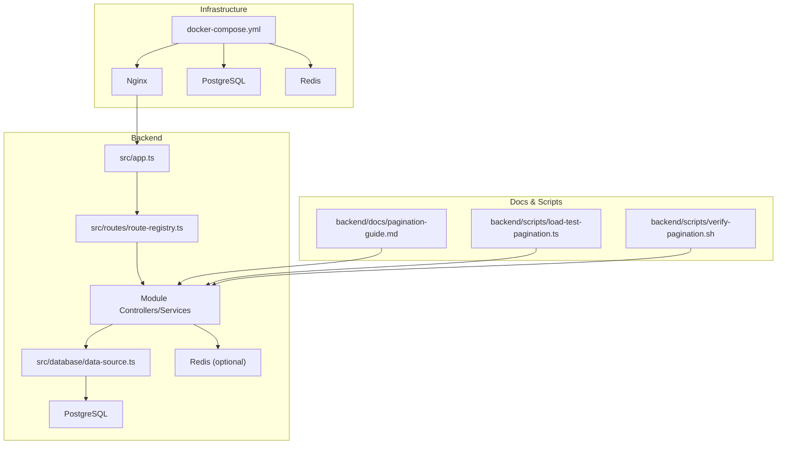
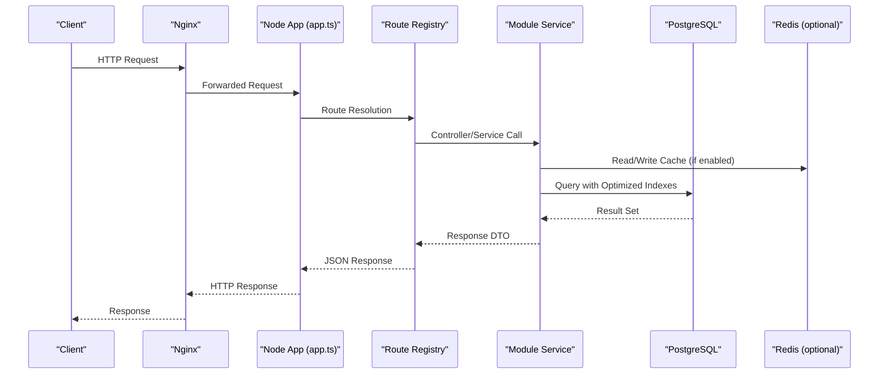
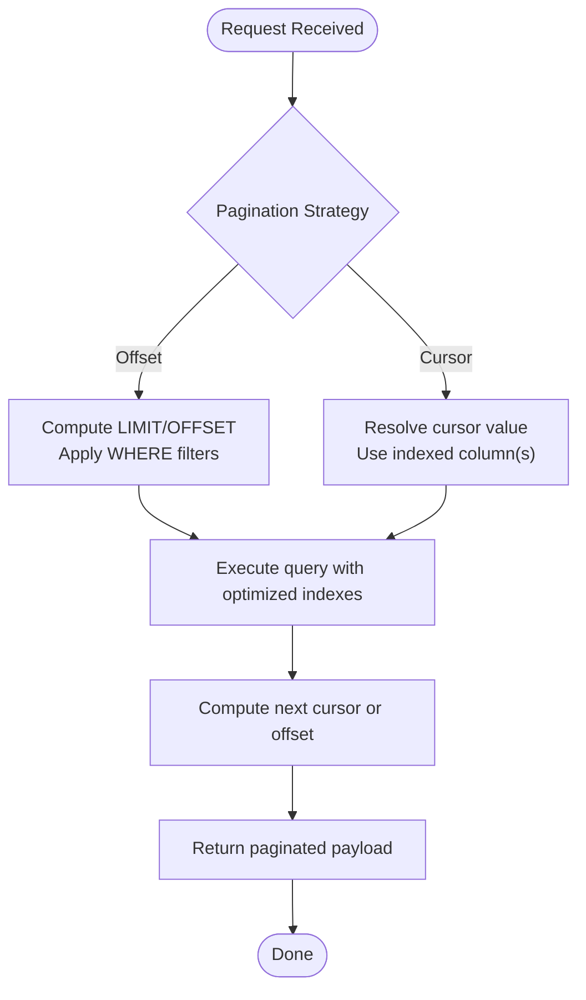
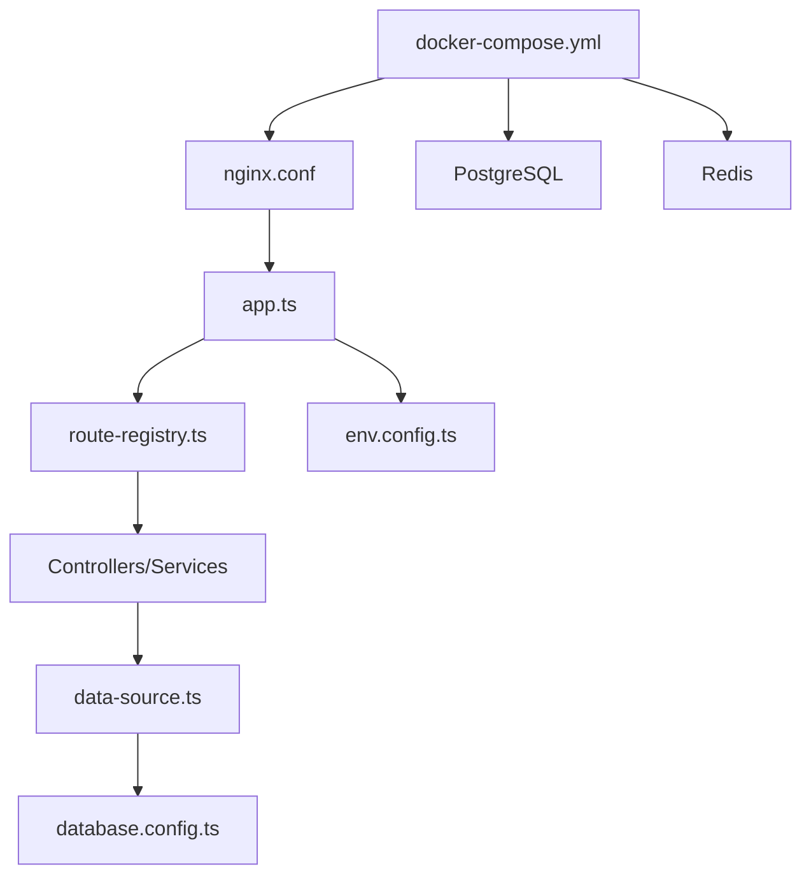

# API Performance Optimization

<cite>
**Referenced Files in This Document**
- [pagination-guide.md](file://backend/docs/pagination-guide.md)
- [pagination-migration-status.ts](file://backend/docs/pagination-migration-status.ts)
- [009-performance-indexes.sql](file://backend/database/migrations/009-performance-indexes.sql)
- [042-annonces-performance-optimization.sql](file://backend/database/migrations/042-annonces-performance-optimization.sql)
- [046-organisation-performance-avancee.sql](file://backend/database/migrations/046-organisation-performance-avancee.sql)
- [047-optimisations-performance-v3.1.sql](file://backend/database/migrations/047-optimisations-performance-v3.1.sql)
- [048-notifications-performance-optimizations.sql](file://backend/database/migrations/048-notifications-performance-optimizations.sql)
- [load-test-pagination.ts](file://backend/scripts/load-test-pagination.ts)
- [verify-pagination.sh](file://backend/scripts/verify-pagination.sh)
- [app.ts](file://backend/src/app.ts)
- [index.ts](file://backend/src/index.ts)
- [route-registry.ts](file://backend/src/routes/route-registry.ts)
- [database.config.ts](file://backend/src/config/database.config.ts)
- [env.config.ts](file://backend/src/config/env.config.ts)
- [data-source.ts](file://backend/src/database/data-source.ts)
- [fix-index.ts](file://backend/src/database/fix-index.ts)
- [diagnose-enum.ts](file://backend/src/database/diagnose-enum.ts)
- [redis.service.spec.ts](file://backend/test/unit/redis.service.spec.ts)
- [pagination.util.spec.ts](file://backend/test/unit/pagination.util.spec.ts)
- [OPTIMISATIONS-PERFORMANCE-V3.1.md](file://docs/OPTIMISATIONS-PERFORMANCE-V3.1.md)
- [RAPPORT-OPTIMISATION-PERFORMANCE-ANNONCES-V2.1.md](file://docs/rapports/RAPPORT-OPTIMISATION-PERFORMANCE-ANNONCES-V2.1.md)
- [REDIS-CONFIGURATION.md](file://docs/autres/REDIS-CONFIGURATION.md)
- [docker-compose.yml](file://docker/docker-compose.yml)
- [nginx.conf](file://docker/nginx.conf)
</cite>

## Table of Contents
1. [Introduction](#introduction)
2. [Project Structure](#project-structure)
3. [Core Components](#core-components)
4. [Architecture Overview](#architecture-overview)
5. [Detailed Component Analysis](#detailed-component-analysis)
6. [Dependency Analysis](#dependency-analysis)
7. [Performance Considerations](#performance-considerations)
8. [Troubleshooting Guide](#troubleshooting-guide)
9. [Conclusion](#conclusion)
10. [Appendices](#appendices)

## Introduction
This document provides a comprehensive guide to API performance optimization for eLISAschool, focusing on pagination strategies, request/response optimizations, bulk operations, rate limiting, WebSocket considerations, and API versioning. It synthesizes existing backend implementations, database indexes, configuration files, tests, and documentation artifacts to offer actionable guidance for both developers and operators.

## Project Structure
The backend is organized by modules with shared infrastructure under src/common, configuration under src/config, data access via TypeORM (TypeScript), and migrations under database/migrations. Performance-related assets include:
- Pagination documentation and migration status
- Database index and performance migrations
- Load testing scripts for pagination
- Unit tests for pagination utilities and Redis service
- Docker and Nginx configurations for load balancing and reverse proxy

**Diagram sources**
- [app.ts](file://backend/src/app.ts)
- [route-registry.ts](file://backend/src/routes/route-registry.ts)
- [data-source.ts](file://backend/src/database/data-source.ts)
- [docker-compose.yml](file://docker/docker-compose.yml)
- [nginx.conf](file://docker/nginx.conf)
- [pagination-guide.md](file://backend/docs/pagination-guide.md)
- [load-test-pagination.ts](file://backend/scripts/load-test-pagination.ts)
- [verify-pagination.sh](file://backend/scripts/verify-pagination.sh)

**Section sources**
- [app.ts](file://backend/src/app.ts)
- [index.ts](file://backend/src/index.ts)
- [route-registry.ts](file://backend/src/routes/route-registry.ts)
- [database.config.ts](file://backend/src/config/database.config.ts)
- [env.config.ts](file://backend/src/config/env.config.ts)
- [data-source.ts](file://backend/src/database/data-source.ts)
- [docker-compose.yml](file://docker/docker-compose.yml)
- [nginx.conf](file://docker/nginx.conf)

## Core Components
- Pagination strategy documentation and migration status are defined in the docs directory and referenced by scripts/tests.
- Database performance is enhanced through targeted index migrations and organization/performance-specific SQL changes.
- Load testing and verification scripts validate pagination behavior at scale.
- Configuration files centralize environment and database settings used across services.

Key implementation references:
- Pagination guide and migration status
- Index and performance migrations
- Load test and verification scripts
- Application entry points and route registry
- Data source and database configuration

**Section sources**
- [pagination-guide.md](file://backend/docs/pagination-guide.md)
- [pagination-migration-status.ts](file://backend/docs/pagination-migration-status.ts)
- [009-performance-indexes.sql](file://backend/database/migrations/009-performance-indexes.sql)
- [042-annonces-performance-optimization.sql](file://backend/database/migrations/042-annonces-performance-optimization.sql)
- [046-organisation-performance-avancee.sql](file://backend/database/migrations/046-organisation-performance-avancee.sql)
- [047-optimisations-performance-v3.1.sql](file://backend/database/migrations/047-optimisations-performance-v3.1.sql)
- [048-notifications-performance-optimizations.sql](file://backend/database/migrations/048-notifications-performance-optimizations.sql)
- [load-test-pagination.ts](file://backend/scripts/load-test-pagination.ts)
- [verify-pagination.sh](file://backend/scripts/verify-pagination.sh)
- [app.ts](file://backend/src/app.ts)
- [index.ts](file://backend/src/index.ts)
- [route-registry.ts](file://backend/src/routes/route-registry.ts)
- [database.config.ts](file://backend/src/config/database.config.ts)
- [env.config.ts](file://backend/src/config/env.config.ts)
- [data-source.ts](file://backend/src/database/data-source.ts)

## Architecture Overview
The API architecture leverages a modular controller/service layer backed by TypeORM and PostgreSQL, with optional caching via Redis. Reverse proxy and load balancing are configured via Nginx and Docker Compose.

**Diagram sources**
- [app.ts](file://backend/src/app.ts)
- [route-registry.ts](file://backend/src/routes/route-registry.ts)
- [data-source.ts](file://backend/src/database/data-source.ts)
- [docker-compose.yml](file://docker/docker-compose.yml)
- [nginx.conf](file://docker/nginx.conf)

## Detailed Component Analysis

### Pagination Implementation Strategies
Two primary strategies are supported:
- Offset-based pagination: Suitable for small-to-medium datasets; simple to implement but can degrade with large offsets due to full scans.
- Cursor-based pagination: Preferred for large datasets; uses stable cursors (e.g., IDs or timestamps) to avoid expensive offset calculations.

Implementation references:
- Pagination guide outlines patterns and best practices.
- Migration status tracks progress and coverage across modules.
- Load test script validates performance characteristics under realistic workloads.
- Verification script ensures correctness and stability.

**Diagram sources**
- [pagination-guide.md](file://backend/docs/pagination-guide.md)
- [pagination-migration-status.ts](file://backend/docs/pagination-migration-status.ts)
- [load-test-pagination.ts](file://backend/scripts/load-test-pagination.ts)
- [verify-pagination.sh](file://backend/scripts/verify-pagination.sh)

**Section sources**
- [pagination-guide.md](file://backend/docs/pagination-guide.md)
- [pagination-migration-status.ts](file://backend/docs/pagination-migration-status.ts)
- [load-test-pagination.ts](file://backend/scripts/load-test-pagination.ts)
- [verify-pagination.sh](file://backend/scripts/verify-pagination.sh)

### Request/Response Optimization Techniques
Recommended techniques aligned with the codebase:
- Field selection: Return only required fields to reduce payload size.
- Compression: Enable gzip/deflate at the reverse proxy level (Nginx).
- Caching: Use Redis for read-heavy endpoints where appropriate.
- Connection pooling: Configure TypeORM pool options and database connection limits.

Configuration references:
- Environment and database configuration files define connection parameters and runtime options.
- Nginx configuration supports compression and upstream load balancing.
- Docker Compose orchestrates services and exposes ports.

**Section sources**
- [env.config.ts](file://backend/src/config/env.config.ts)
- [database.config.ts](file://backend/src/config/database.config.ts)
- [data-source.ts](file://backend/src/database/data-source.ts)
- [nginx.conf](file://docker/nginx.conf)
- [docker-compose.yml](file://docker/docker-compose.yml)

### Bulk Operations and Batch Processing
Guidance:
- Prefer batch endpoints that accept arrays of identifiers or payloads.
- Use transactions to ensure atomicity and consistency.
- Implement idempotency keys for retry safety.
- Monitor throughput and backpressure using queueing if needed.

[No sources needed since this section provides general guidance]

### Async Task Management
Guidance:
- Offload long-running tasks to background workers.
- Persist job state and provide status endpoints.
- Integrate with message queues for scalability.

[No sources needed since this section provides general guidance]

### Rate Limiting and Request Throttling
Guidance:
- Apply per-client rate limits at the reverse proxy (Nginx) or application middleware.
- Use sliding windows or token buckets for fairness.
- Expose headers indicating remaining quota and reset times.

[No sources needed since this section provides general guidance]

### Load Balancing Configurations
References:
- Docker Compose defines multiple service instances and networking.
- Nginx configures upstreams and health checks.

**Section sources**
- [docker-compose.yml](file://docker/docker-compose.yml)
- [nginx.conf](file://docker/nginx.conf)

### WebSocket Optimization
Guidance:
- Use connection pooling and sticky sessions when scaling horizontally.
- Implement message queuing for fan-out and persistence.
- Optimize heartbeat intervals and payload sizes.

[No sources needed since this section provides general guidance]

### API Versioning and Backward Compatibility
Guidance:
- Use URL path versioning (/v1/, /v2/) or header-based versioning.
- Maintain deprecation policies and migration guides.
- Validate responses against schemas to prevent breaking changes.

[No sources needed since this section provides general guidance]

## Dependency Analysis
The following diagram maps key dependencies between application components, configuration, and infrastructure.

**Diagram sources**
- [app.ts](file://backend/src/app.ts)
- [route-registry.ts](file://backend/src/routes/route-registry.ts)
- [data-source.ts](file://backend/src/database/data-source.ts)
- [database.config.ts](file://backend/src/config/database.config.ts)
- [env.config.ts](file://backend/src/config/env.config.ts)
- [docker-compose.yml](file://docker/docker-compose.yml)
- [nginx.conf](file://docker/nginx.conf)

**Section sources**
- [app.ts](file://backend/src/app.ts)
- [route-registry.ts](file://backend/src/routes/route-registry.ts)
- [data-source.ts](file://backend/src/database/data-source.ts)
- [database.config.ts](file://backend/src/config/database.config.ts)
- [env.config.ts](file://backend/src/config/env.config.ts)
- [docker-compose.yml](file://docker/docker-compose.yml)
- [nginx.conf](file://docker/nginx.conf)

## Performance Considerations
Database indexing and query optimization:
- Targeted indexes improve scan performance for common queries.
- Organization and announcements modules include dedicated performance migrations.
- Notifications module includes performance-focused schema changes.

Operational tuning:
- Connection pooling and timeouts should be tuned based on workload.
- Enable compression at the reverse proxy to reduce bandwidth.
- Use caching strategically for hot paths.

Validation and testing:
- Load test pagination to identify bottlenecks.
- Verify pagination correctness and performance regression.

**Section sources**
- [009-performance-indexes.sql](file://backend/database/migrations/009-performance-indexes.sql)
- [042-annonces-performance-optimization.sql](file://backend/database/migrations/042-annonces-performance-optimization.sql)
- [046-organisation-performance-avancee.sql](file://backend/database/migrations/046-organisation-performance-avancee.sql)
- [047-optimisations-performance-v3.1.sql](file://backend/database/migrations/047-optimisations-performance-v3.1.sql)
- [048-notifications-performance-optimizations.sql](file://backend/database/migrations/048-notifications-performance-optimizations.sql)
- [load-test-pagination.ts](file://backend/scripts/load-test-pagination.ts)
- [verify-pagination.sh](file://backend/scripts/verify-pagination.sh)

## Troubleshooting Guide
Common issues and diagnostics:
- Index problems: Use diagnostic and fix scripts to detect and repair missing or duplicate indexes.
- Enum mismatches: Diagnose enum definitions and types to avoid runtime errors.
- Redis connectivity: Validate Redis configuration and service availability.
- Pagination correctness: Run verification scripts to ensure stable ordering and consistent cursors.

**Section sources**
- [fix-index.ts](file://backend/src/database/fix-index.ts)
- [diagnose-enum.ts](file://backend/src/database/diagnose-enum.ts)
- [redis.service.spec.ts](file://backend/test/unit/redis.service.spec.ts)
- [pagination.util.spec.ts](file://backend/test/unit/pagination.util.spec.ts)
- [verify-pagination.sh](file://backend/scripts/verify-pagination.sh)

## Conclusion
By combining robust pagination strategies, database indexing, efficient request/response handling, and proper infrastructure configuration, eLISAschool can achieve high-throughput, low-latency APIs. The provided scripts, tests, and documentation artifacts enable continuous validation and improvement.

## Appendices

### Key Documentation References
- Performance optimizations overview and summaries
- Announcements performance report
- Redis configuration guide

**Section sources**
- [OPTIMISATIONS-PERFORMANCE-V3.1.md](file://docs/OPTIMISATIONS-PERFORMANCE-V3.1.md)
- [RAPPORT-OPTIMISATION-PERFORMANCE-ANNONCES-V2.1.md](file://docs/rapports/RAPPORT-OPTIMISATION-PERFORMANCE-ANNONCES-V2.1.md)
- [REDIS-CONFIGURATION.md](file://docs/autres/REDIS-CONFIGURATION.md)