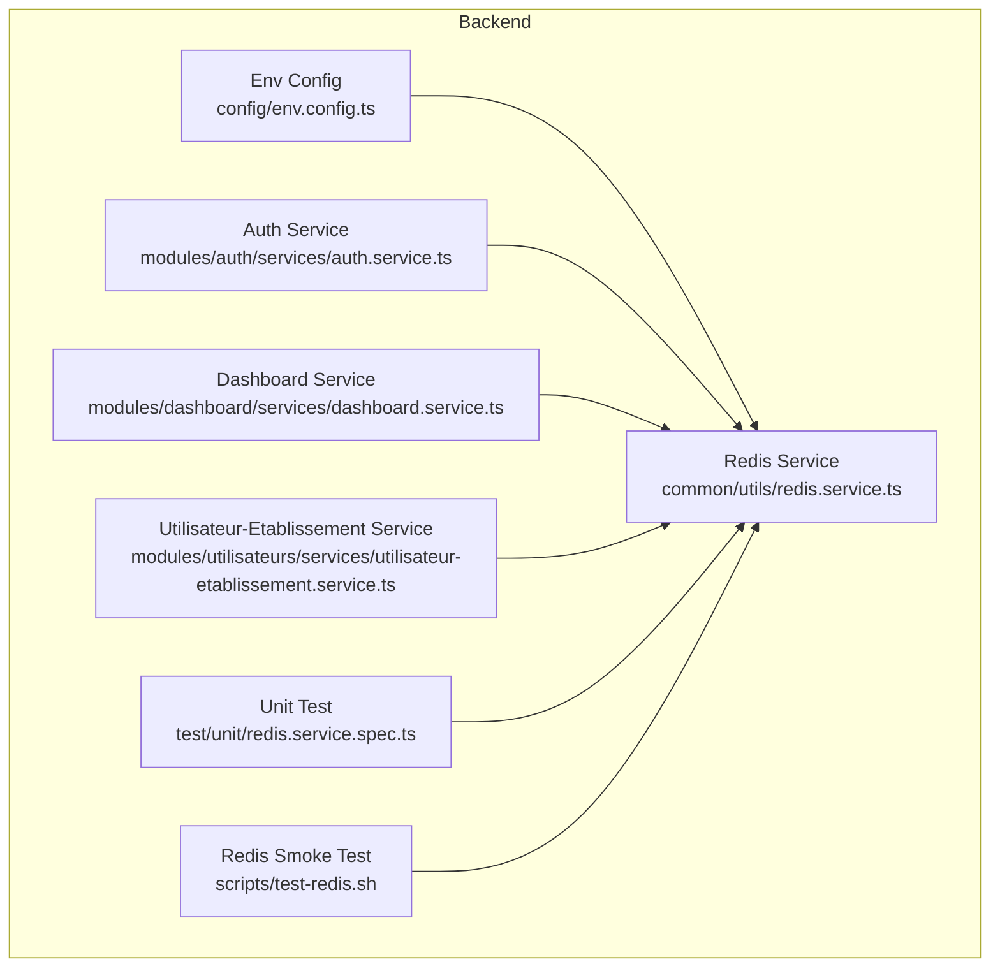
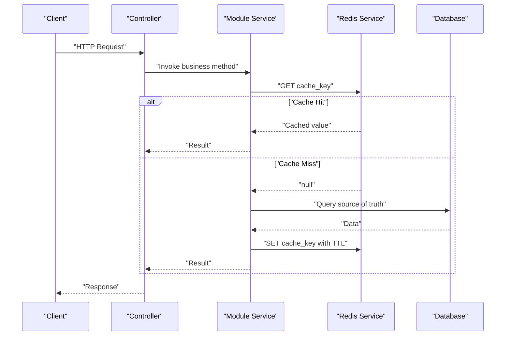
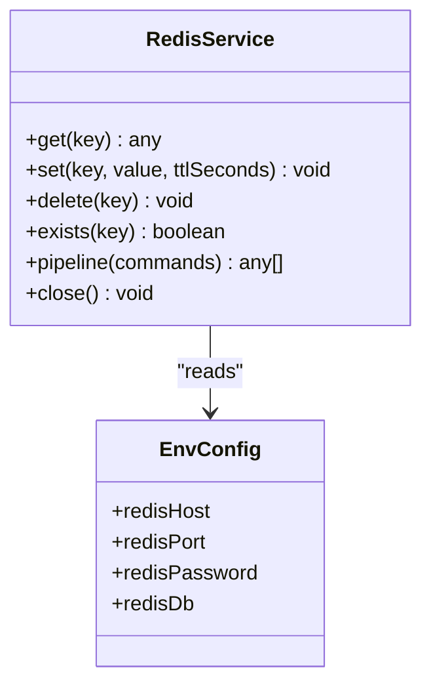
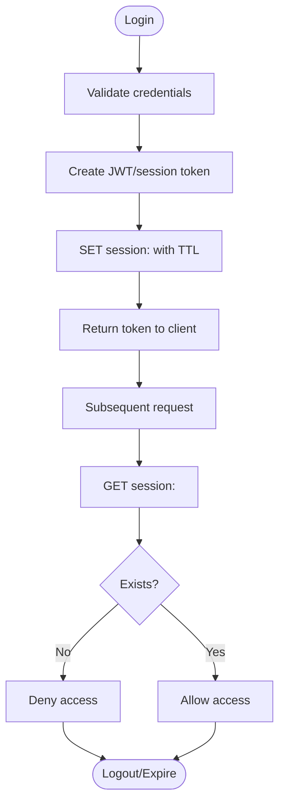
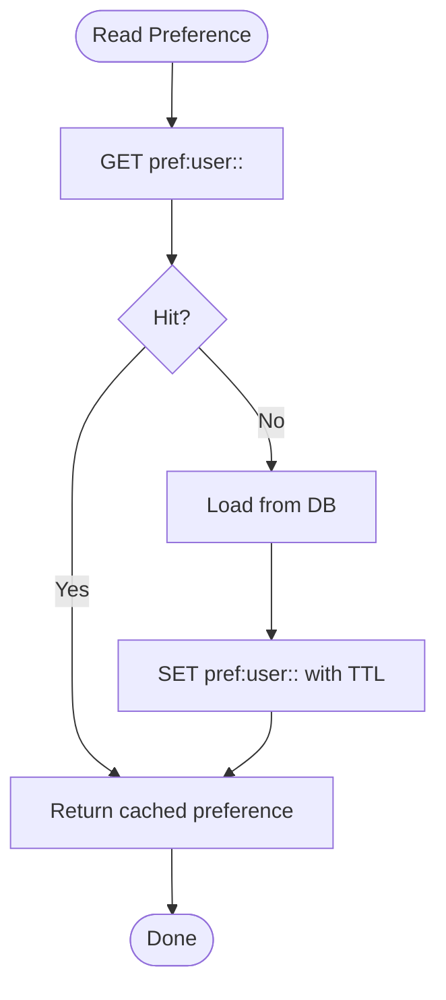
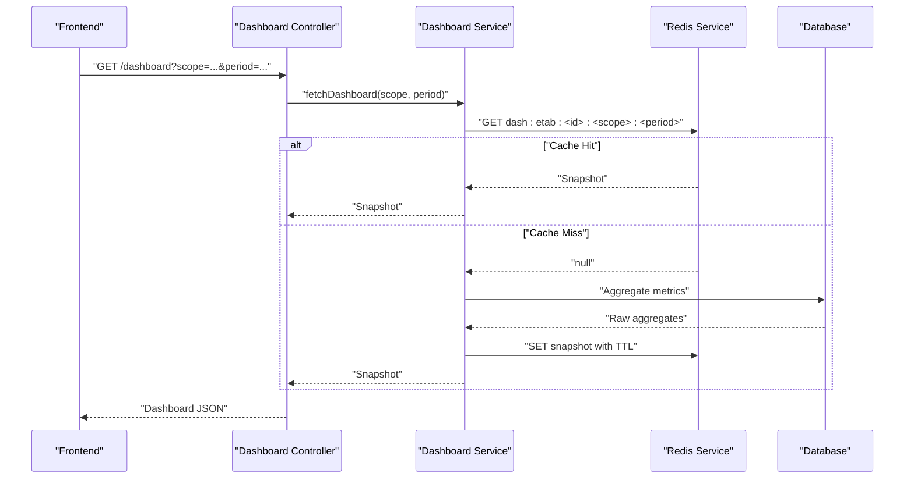
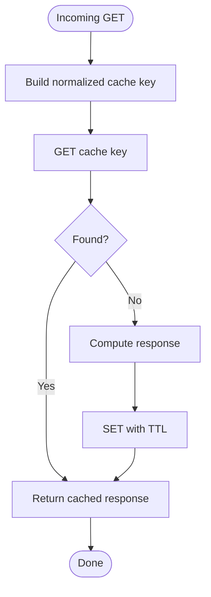
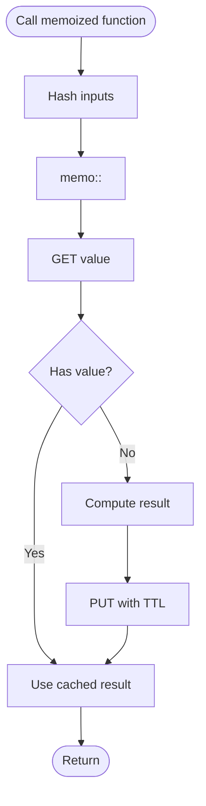
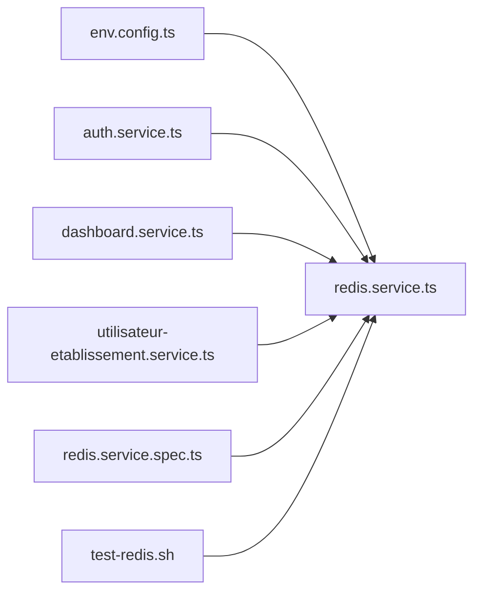

# Caching Strategies

<cite>
**Referenced Files in This Document**
- [backend/src/common/utils/redis.service.ts](file://backend/src/common/utils/redis.service.ts)
- [backend/src/config/env.config.ts](file://backend/src/config/env.config.ts)
- [backend/src/modules/auth/services/auth.service.ts](file://backend/src/modules/auth/services/auth.service.ts)
- [backend/src/modules/dashboard/services/dashboard.service.ts](file://backend/src/modules/dashboard/services/dashboard.service.ts)
- [backend/src/modules/utilisateurs/services/utilisateur-etablissement.service.ts](file://backend/src/modules/utilisateurs/services/utilisateur-etablissement.service.ts)
- [backend/test/unit/redis.service.spec.ts](file://backend/test/unit/redis.service.spec.ts)
- [backend/scripts/test-redis.sh](file://backend/scripts/test-redis.sh)
</cite>

## Table of Contents
1. [Introduction](#introduction)
2. [Project Structure](#project-structure)
3. [Core Components](#core-components)
4. [Architecture Overview](#architecture-overview)
5. [Detailed Component Analysis](#detailed-component-analysis)
6. [Dependency Analysis](#dependency-analysis)
7. [Performance Considerations](#performance-considerations)
8. [Troubleshooting Guide](#troubleshooting-guide)
9. [Conclusion](#conclusion)
10. [Appendices](#appendices)

## Introduction
This document defines the caching strategy for eLISAschool with a focus on Redis integration patterns, cache key design, invalidation strategies, session management (including token caching and user preferences), dashboard data caching, API response caching, computed result memoization, cache warming, distributed considerations, memory management, consistency patterns, stale data handling, cache penetration prevention, and monitoring approaches for hit rates, memory usage, and performance impact measurement.

The guidance is grounded in the existing backend implementation that provides a Redis service abstraction, environment configuration for Redis connectivity, and module-level services that integrate caching for authentication, dashboard aggregation, and multi-tenant user lookups.

## Project Structure
Caching-related code is primarily located under:
- Common utilities: Redis client wrapper and helpers
- Configuration: Environment variables for Redis connection
- Modules: Auth, Dashboard, Utilisateurs (Users) services using the Redis service
- Tests: Unit tests for the Redis service and scripts to validate connectivity

**Diagram sources**
- [backend/src/common/utils/redis.service.ts](file://backend/src/common/utils/redis.service.ts)
- [backend/src/config/env.config.ts](file://backend/src/config/env.config.ts)
- [backend/src/modules/auth/services/auth.service.ts](file://backend/src/modules/auth/services/auth.service.ts)
- [backend/src/modules/dashboard/services/dashboard.service.ts](file://backend/src/modules/dashboard/services/dashboard.service.ts)
- [backend/src/modules/utilisateurs/services/utilisateur-etablissement.service.ts](file://backend/src/modules/utilisateurs/services/utilisateur-etablissement.service.ts)
- [backend/test/unit/redis.service.spec.ts](file://backend/test/unit/redis.service.spec.ts)
- [backend/scripts/test-redis.sh](file://backend/scripts/test-redis.sh)

**Section sources**
- [backend/src/common/utils/redis.service.ts](file://backend/src/common/utils/redis.service.ts)
- [backend/src/config/env.config.ts](file://backend/src/config/env.config.ts)
- [backend/src/modules/auth/services/auth.service.ts](file://backend/src/modules/auth/services/auth.service.ts)
- [backend/src/modules/dashboard/services/dashboard.service.ts](file://backend/src/modules/dashboard/services/dashboard.service.ts)
- [backend/src/modules/utilisateurs/services/utilisateur-etablissement.service.ts](file://backend/src/modules/utilisateurs/services/utilisateur-etablissement.service.ts)
- [backend/test/unit/redis.service.spec.ts](file://backend/test/unit/redis.service.spec.ts)
- [backend/scripts/test-redis.sh](file://backend/scripts/test-redis.sh)

## Core Components
- Redis Service Abstraction: Provides typed operations over Redis (get/set/delete, TTL control, pipeline/batch where applicable). It centralizes serialization/deserialization and error handling around Redis calls.
- Environment Configuration: Loads Redis host, port, password, database index, and optional cluster or TLS settings from environment variables.
- Module Integrations:
  - Auth Service: Uses Redis for short-lived session tokens and rate-limiting counters.
  - Dashboard Service: Caches aggregated metrics and computed summaries for dashboards.
  - Utilisateur-Etablissement Service: Caches multi-tenant user-scoped lookups and permissions.

Key responsibilities:
- Centralized Redis client lifecycle and reconnection handling
- Consistent key naming conventions across modules
- Standardized TTL policies per data type
- Observability hooks for hit/miss and latency

**Section sources**
- [backend/src/common/utils/redis.service.ts](file://backend/src/common/utils/redis.service.ts)
- [backend/src/config/env.config.ts](file://backend/src/config/env.config.ts)
- [backend/src/modules/auth/services/auth.service.ts](file://backend/src/modules/auth/services/auth.service.ts)
- [backend/src/modules/dashboard/services/dashboard.service.ts](file://backend/src/modules/dashboard/services/dashboard.service.ts)
- [backend/src/modules/utilisateurs/services/utilisateur-etablissement.service.ts](file://backend/src/modules/utilisateurs/services/utilisateur-etablissement.service.ts)

## Architecture Overview
The caching architecture follows a layered approach:
- Application layer (controllers/services) requests cached data via the Redis service.
- The Redis service abstracts network I/O and applies consistent TTLs and key prefixes.
- On cache miss, services compute results and write them back to Redis with appropriate expiration.
- Invalidation is triggered by domain events (e.g., user update, config change) or time-based TTL.

**Diagram sources**
- [backend/src/common/utils/redis.service.ts](file://backend/src/common/utils/redis.service.ts)
- [backend/src/modules/auth/services/auth.service.ts](file://backend/src/modules/auth/services/auth.service.ts)
- [backend/src/modules/dashboard/services/dashboard.service.ts](file://backend/src/modules/dashboard/services/dashboard.service.ts)
- [backend/src/modules/utilisateurs/services/utilisateur-etablissement.service.ts](file://backend/src/modules/utilisateurs/services/utilisateur-etablissement.service.ts)

## Detailed Component Analysis

### Redis Service Abstraction
Responsibilities:
- Connection management and configuration via environment variables
- Typed get/set/delete with JSON serialization
- TTL enforcement and atomic operations
- Optional instrumentation (metrics, logging)

Design patterns:
- Singleton-like client initialization
- Decorated methods for retry/backoff on transient errors
- Namespace/prefixing helper for keys

**Diagram sources**
- [backend/src/common/utils/redis.service.ts](file://backend/src/common/utils/redis.service.ts)
- [backend/src/config/env.config.ts](file://backend/src/config/env.config.ts)

**Section sources**
- [backend/src/common/utils/redis.service.ts](file://backend/src/common/utils/redis.service.ts)
- [backend/src/config/env.config.ts](file://backend/src/config/env.config.ts)
- [backend/test/unit/redis.service.spec.ts](file://backend/test/unit/redis.service.spec.ts)

### Session Management with Redis
Goals:
- Store short-lived session tokens and related metadata
- Support logout and revocation by deleting tokens
- Enforce TTL aligned with session lifetime
- Prevent token replay after logout

Key design:
- Key pattern: session:<token>
- Value: serialized session payload (userId, roles, tenantId, exp)
- TTL: equals remaining session lifetime
- Invalidation: explicit delete on logout; automatic expiry otherwise

**Diagram sources**
- [backend/src/modules/auth/services/auth.service.ts](file://backend/src/modules/auth/services/auth.service.ts)
- [backend/src/common/utils/redis.service.ts](file://backend/src/common/utils/redis.service.ts)

**Section sources**
- [backend/src/modules/auth/services/auth.service.ts](file://backend/src/modules/auth/services/auth.service.ts)
- [backend/src/common/utils/redis.service.ts](file://backend/src/common/utils/redis.service.ts)

### User Preference Storage
Goals:
- Persist per-user and per-tenant preferences with low-latency reads
- Provide fast updates without heavy DB writes on every read

Key design:
- Key pattern: pref:user:<userId>:<key>
- Value: preference value (stringified if complex)
- TTL: long-lived (days) or no TTL for persistent preferences
- Invalidation: on explicit update; optional background refresh

**Diagram sources**
- [backend/src/modules/utilisateurs/services/utilisateur-etablissement.service.ts](file://backend/src/modules/utilisateurs/services/utilisateur-etablissement.service.ts)
- [backend/src/common/utils/redis.service.ts](file://backend/src/common/utils/redis.service.ts)

**Section sources**
- [backend/src/modules/utilisateurs/services/utilisateur-etablissement.service.ts](file://backend/src/modules/utilisateurs/services/utilisateur-etablissement.service.ts)
- [backend/src/common/utils/redis.service.ts](file://backend/src/common/utils/redis.service.ts)

### Dashboard Data Caching
Goals:
- Reduce expensive aggregations by caching computed dashboard snapshots
- Serve near-real-time views with bounded staleness

Key design:
- Key pattern: dash:etab:<etablissementId>:<scope>:<period>
- Value: aggregated metrics object
- TTL: tuned per scope (e.g., minutes for live stats, hours for daily reports)
- Invalidation: on significant data mutations or scheduled recomputation

**Diagram sources**
- [backend/src/modules/dashboard/services/dashboard.service.ts](file://backend/src/modules/dashboard/services/dashboard.service.ts)
- [backend/src/common/utils/redis.service.ts](file://backend/src/common/utils/redis.service.ts)

**Section sources**
- [backend/src/modules/dashboard/services/dashboard.service.ts](file://backend/src/modules/dashboard/services/dashboard.service.ts)
- [backend/src/common/utils/redis.service.ts](file://backend/src/common/utils/redis.service.ts)

### API Response Caching
Goals:
- Cache idempotent GET responses behind stable URLs and query parameters
- Avoid thundering herds and reduce DB load

Key design:
- Key pattern: api:v1:<method>:<path>:<queryHash>
- Value: serialized response body and headers
- TTL: conservative for frequently changing endpoints; longer for static content
- Invalidation: tag-based invalidation when underlying entities change

[No sources needed since this diagram shows conceptual workflow, not actual code structure]

### Computed Result Memoization
Goals:
- Memoize expensive computations within a process or across processes using Redis
- Ensure correctness with versioned keys and TTL fallback

Key design:
- Key pattern: memo:<functionName>:<inputHash>
- Value: function output
- TTL: based on input volatility
- Invalidation: on input changes or periodic refresh

[No sources needed since this diagram shows conceptual workflow, not actual code structure]

## Dependency Analysis
The following diagram maps dependencies between components involved in caching:

**Diagram sources**
- [backend/src/config/env.config.ts](file://backend/src/config/env.config.ts)
- [backend/src/common/utils/redis.service.ts](file://backend/src/common/utils/redis.service.ts)
- [backend/src/modules/auth/services/auth.service.ts](file://backend/src/modules/auth/services/auth.service.ts)
- [backend/src/modules/dashboard/services/dashboard.service.ts](file://backend/src/modules/dashboard/services/dashboard.service.ts)
- [backend/src/modules/utilisateurs/services/utilisateur-etablissement.service.ts](file://backend/src/modules/utilisateurs/services/utilisateur-etablissement.service.ts)
- [backend/test/unit/redis.service.spec.ts](file://backend/test/unit/redis.service.spec.ts)
- [backend/scripts/test-redis.sh](file://backend/scripts/test-redis.sh)

**Section sources**
- [backend/src/config/env.config.ts](file://backend/src/config/env.config.ts)
- [backend/src/common/utils/redis.service.ts](file://backend/src/common/utils/redis.service.ts)
- [backend/src/modules/auth/services/auth.service.ts](file://backend/src/modules/auth/services/auth.service.ts)
- [backend/src/modules/dashboard/services/dashboard.service.ts](file://backend/src/modules/dashboard/services/dashboard.service.ts)
- [backend/src/modules/utilisateurs/services/utilisateur-etablissement.service.ts](file://backend/src/modules/utilisateurs/services/utilisateur-etablissement.service.ts)
- [backend/test/unit/redis.service.spec.ts](file://backend/test/unit/redis.service.spec.ts)
- [backend/scripts/test-redis.sh](file://backend/scripts/test-redis.sh)

## Performance Considerations
- TTL tuning: Align TTL with data volatility and SLA requirements. Shorter TTLs improve freshness but increase misses; longer TTLs improve hit rates at the cost of staleness.
- Serialization overhead: Prefer compact formats and avoid serializing large payloads unnecessarily.
- Pipeline usage: Batch multiple commands to reduce round-trips when building composite keys or performing conditional updates.
- Memory sizing: Monitor used_memory and maxmemory; set eviction policies suitable for your workload (e.g., volatile-ttl for TTL-based caches).
- Network locality: Co-locate application instances close to Redis to minimize latency.
- Backpressure: Implement retries with exponential backoff for transient Redis failures and degrade gracefully by falling back to the database.

[No sources needed since this section provides general guidance]

## Troubleshooting Guide
- Connectivity issues:
  - Validate Redis host, port, password, and database index from environment configuration.
  - Use the provided smoke test script to verify reachability and basic operations.
- Serialization errors:
  - Ensure values are consistently stringified and parsed; check for circular references.
- Stale data:
  - Review TTLs and invalidation triggers; consider tag-based invalidation for related keys.
- High memory usage:
  - Inspect key distribution and TTLs; remove orphaned keys and adjust eviction policy.
- Low hit rates:
  - Normalize cache keys (lowercase, sorted query params); review cache coverage and TTLs.

Operational checks:
- Run unit tests for the Redis service to assert behavior under mock conditions.
- Execute the Redis smoke test script to confirm connectivity and basic SET/GET/TTL operations.

**Section sources**
- [backend/src/config/env.config.ts](file://backend/src/config/env.config.ts)
- [backend/test/unit/redis.service.spec.ts](file://backend/test/unit/redis.service.spec.ts)
- [backend/scripts/test-redis.sh](file://backend/scripts/test-redis.sh)

## Conclusion
The eLISAschool caching strategy centers on a robust Redis service abstraction with clear key naming, TTL policies, and module-specific integrations for sessions, preferences, dashboards, and API responses. By combining TTL-based expiration, targeted invalidation, and careful key design, the system balances performance and consistency while remaining observable and maintainable.

[No sources needed since this section summarizes without analyzing specific files]

## Appendices

### Cache Key Design Guidelines
- Prefixes:
  - session:<token>
  - pref:user:<userId>:<key>
  - dash:etab:<etablissementId>:<scope>:<period>
  - api:v1:<method>:<path>:<queryHash>
  - memo:<functionName>:<inputHash>
- Normalization:
  - Lowercase strings, sort query parameters, hash stable inputs
- Versioning:
  - Include schema or feature flags in keys when evolving payloads

[No sources needed since this section provides general guidance]

### Invalidation Strategies
- Time-based: TTL-driven expiration
- Event-driven: Publish invalidation messages on write paths
- Tag-based: Group related keys and invalidate by tags
- Lazy refresh: Rebuild on next read after expiration

[No sources needed since this section provides general guidance]

### Cache Warming
- Precompute popular dashboard snapshots during off-peak hours
- Warm user preferences on first login or profile update
- Seed API caches for reference data and catalogs

[No sources needed since this section provides general guidance]

### Distributed Caching Considerations
- Shared Redis instance or cluster for multi-instance deployments
- Partitioning by tenant or module to avoid hotspots
- Idempotent writes and conflict resolution for concurrent updates

[No sources needed since this section provides general guidance]

### Memory Management Techniques
- Eviction policies: volatile-ttl or allkeys-lru depending on use cases
- Key expiration hygiene: ensure TTLs are always set for ephemeral data
- Monitoring: track used_memory, evicted_keys, and hit/miss ratios

[No sources needed since this section provides general guidance]

### Consistency Patterns and Stale Data Handling
- Cache-aside: read-through via service layer
- Write-through/write-behind: prefer cache-aside for simplicity; use write-through only for critical consistency needs
- Staleness windows: define acceptable freshness per endpoint and enforce via TTLs

[No sources needed since this section provides general guidance]

### Cache Penetration Prevention
- Bloom filters for non-existent keys
- Null caching: store sentinel values with short TTL for missing entries
- Input validation and normalization to avoid adversarial keys

[No sources needed since this section provides general guidance]

### Monitoring Approaches
- Metrics:
  - Hit rate, miss rate, latency percentiles, command throughput
  - Memory usage, evictions, connected clients
- Alerts:
  - Sudden drop in hit rate
  - Memory approaching maxmemory
  - Elevated latency or error rates
- Instrumentation:
  - Wrap Redis calls with timing and success/failure counters
  - Log key prefixes and TTLs for auditability

[No sources needed since this section provides general guidance]