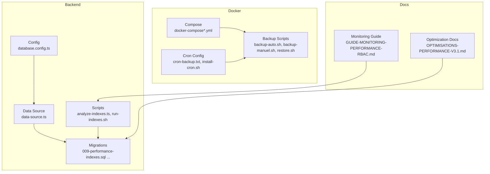
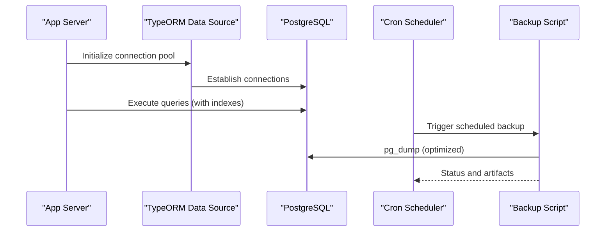
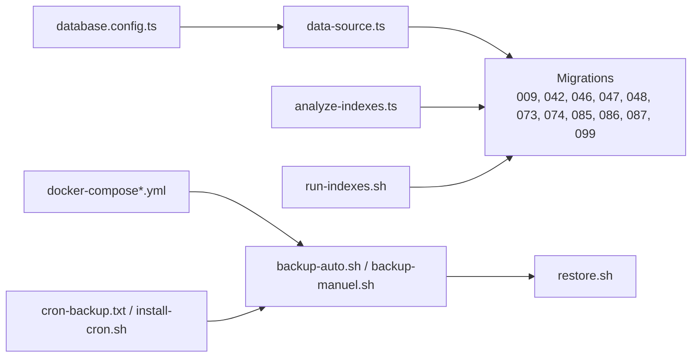

# Database Optimization

<cite>
**Referenced Files in This Document**
- [database.config.ts](file://backend/src/config/database.config.ts)
- [data-source.ts](file://backend/src/database/data-source.ts)
- [009-performance-indexes.sql](file://backend/database/migrations/009-performance-indexes.sql)
- [042-annonces-performance-optimization.sql](file://backend/database/migrations/042-annonces-performance-optimization.sql)
- [046-organisation-performance-avancee.sql](file://backend/database/migrations/046-organisation-performance-avancee.sql)
- [047-optimisations-performance-v3.1.sql](file://backend/database/migrations/047-optimisations-performance-v3.1.sql)
- [048-notifications-performance-optimizations.sql](file://backend/database/migrations/048-notifications-performance-optimizations.sql)
- [050-multi-tenant-v3-max-etablissements.sql](file://backend/database/migrations/050-multi-tenant-v3-max-etablissements.sql)
- [058-multi-tenant-structure-academique.sql](file://backend/database/migrations/058-multi-tenant-structure-academique.sql)
- [073-competence-unique-composite.sql](file://backend/database/migrations/073-competence-unique-composite.sql)
- [074-matiere-niveau-unique-composite.sql](file://backend/database/migrations/074-matiere-niveau-unique-composite.sql)
- [085-periode-etablissement-id.sql](file://backend/database/migrations/085-periode-etablissement-id.sql)
- [086-affectation-matiere-etablissement-id.sql](file://backend/database/migrations/086-affectation-matiere-etablissement-id.sql)
- [087-affectation-matiere-verifications.sql](file://backend/database/migrations/087-affectation-matiere-verifications.sql)
- [099-add-monitoring-params.sql](file://backend/database/migrations/099-add-monitoring-params.sql)
- [fix-index.ts](file://backend/src/database/fix-index.ts)
- [analyze-indexes.ts](file://backend/scripts/analyze-indexes.ts)
- [run-indexes.sh](file://backend/scripts/run-indexes.sh)
- [backup-auto.sh](file://docker/scripts/backup-auto.sh)
- [backup-manuel.sh](file://docker/scripts/backup-manuel.sh)
- [restore.sh](file://docker/scripts/restore.sh)
- [cron-backup.txt](file://docker/scripts/cron-backup.txt)
- [install-cron.sh](file://docker/scripts/install-cron.sh)
- [docker-compose.yml](file://docker/docker-compose.yml)
- [docker-compose.local.prod.yml](file://docker/docker-compose.local.prod.yml)
- [docker-compose.cloud.prod.yml](file://docker/docker-compose.cloud.prod.yml)
- [OPTIMISATIONS-PERFORMANCE-V3.1.md](file://docs/OPTIMISATIONS-PERFORMANCE-V3.1.md)
- [GUIDE-MONITORING-PERFORMANCE-RBAC.md](file://docs/guides/GUIDE-MONITORING-PERFORMANCE-RBAC.md)
</cite>

## Table of Contents
1. [Introduction](#introduction)
2. [Project Structure](#project-structure)
3. [Core Components](#core-components)
4. [Architecture Overview](#architecture-overview)
5. [Detailed Component Analysis](#detailed-component-analysis)
6. [Dependency Analysis](#dependency-analysis)
7. [Performance Considerations](#performance-considerations)
8. [Troubleshooting Guide](#troubleshooting-guide)
9. [Conclusion](#conclusion)
10. [Appendices](#appendices)

## Introduction
This document provides comprehensive database optimization guidance for eLISAschool, focusing on index strategies, query optimization, performance monitoring, connection pooling, execution plan analysis, slow query logging, schema optimization patterns, partitioning and archival, backup optimization, replication and failover, and multi-tenant query best practices. It synthesizes the existing migrations, scripts, and configuration files to present actionable recommendations aligned with the project’s current implementation.

## Project Structure
The database-related assets are organized across:
- Configuration and runtime setup (TypeORM data source and environment-based config)
- Migrations that implement indexes, constraints, and schema optimizations
- Scripts for index management, analysis, and backups
- Docker Compose definitions for local and cloud environments
- Documentation summarizing performance improvements and monitoring

**Diagram sources**
- [database.config.ts](file://backend/src/config/database.config.ts)
- [data-source.ts](file://backend/src/database/data-source.ts)
- [009-performance-indexes.sql](file://backend/database/migrations/009-performance-indexes.sql)
- [analyze-indexes.ts](file://backend/scripts/analyze-indexes.ts)
- [run-indexes.sh](file://backend/scripts/run-indexes.sh)
- [docker-compose.yml](file://docker/docker-compose.yml)
- [backup-auto.sh](file://docker/scripts/backup-auto.sh)
- [backup-manuel.sh](file://docker/scripts/backup-manuel.sh)
- [restore.sh](file://docker/scripts/restore.sh)
- [cron-backup.txt](file://docker/scripts/cron-backup.txt)
- [install-cron.sh](file://docker/scripts/install-cron.sh)
- [OPTIMISATIONS-PERFORMANCE-V3.1.md](file://docs/OPTIMISATIONS-PERFORMANCE-V3.1.md)
- [GUIDE-MONITORING-PERFORMANCE-RBAC.md](file://docs/guides/GUIDE-MONITORING-PERFORMANCE-RBAC.md)

**Section sources**
- [database.config.ts](file://backend/src/config/database.config.ts)
- [data-source.ts](file://backend/src/database/data-source.ts)
- [009-performance-indexes.sql](file://backend/database/migrations/009-performance-indexes.sql)
- [analyze-indexes.ts](file://backend/scripts/analyze-indexes.ts)
- [run-indexes.sh](file://backend/scripts/run-indexes.sh)
- [docker-compose.yml](file://docker/docker-compose.yml)
- [backup-auto.sh](file://docker/scripts/backup-auto.sh)
- [backup-manuel.sh](file://docker/scripts/backup-manuel.sh)
- [restore.sh](file://docker/scripts/restore.sh)
- [cron-backup.txt](file://docker/scripts/cron-backup.txt)
- [install-cron.sh](file://docker/scripts/install-cron.sh)
- [OPTIMISATIONS-PERFORMANCE-V3.1.md](file://docs/OPTIMISATIONS-PERFORMANCE-V3.1.md)
- [GUIDE-MONITORING-PERFORMANCE-RBAC.md](file://docs/guides/GUIDE-MONITORING-PERFORMANCE-RBAC.md)

## Core Components
- Connection pooling and TypeORM data source configuration
- Index creation and maintenance via migrations and scripts
- Monitoring parameters and performance documentation
- Backup automation and restore procedures

Key responsibilities:
- Centralize DB connection settings and pool sizing
- Ensure critical queries use appropriate indexes
- Provide tools to analyze and fix index usage
- Automate backups and enable restore workflows
- Expose monitoring parameters for observability

**Section sources**
- [database.config.ts](file://backend/src/config/database.config.ts)
- [data-source.ts](file://backend/src/database/data-source.ts)
- [009-performance-indexes.sql](file://backend/database/migrations/009-performance-indexes.sql)
- [analyze-indexes.ts](file://backend/scripts/analyze-indexes.ts)
- [run-indexes.sh](file://backend/scripts/run-indexes.sh)
- [099-add-monitoring-params.sql](file://backend/database/migrations/099-add-monitoring-params.sql)
- [backup-auto.sh](file://docker/scripts/backup-auto.sh)
- [backup-manuel.sh](file://docker/scripts/backup-manuel.sh)
- [restore.sh](file://docker/scripts/restore.sh)
- [cron-backup.txt](file://docker/scripts/cron-backup.txt)
- [install-cron.sh](file://docker/scripts/install-cron.sh)

## Architecture Overview
The application uses a PostgreSQL-backed relational model managed by TypeORM. Performance is enhanced through targeted indexes, composite unique constraints, and periodic index analysis. Backups are automated via cron-driven scripts orchestrated from Docker.

**Diagram sources**
- [data-source.ts](file://backend/src/database/data-source.ts)
- [docker-compose.yml](file://docker/docker-compose.yml)
- [backup-auto.sh](file://docker/scripts/backup-auto.sh)
- [cron-backup.txt](file://docker/scripts/cron-backup.txt)

## Detailed Component Analysis

### Index Creation Strategies
- Primary performance migration introduces foundational indexes for high-frequency queries.
- Subsequent migrations add specialized indexes for announcements, organization, notifications, and academic structure.
- Composite unique constraints ensure data integrity while supporting efficient lookups.

Recommendations:
- Prefer composite indexes when queries filter on multiple columns together.
- Use partial indexes for hot subsets (e.g., active records).
- Validate index usage with analyze scripts and adjust based on actual workload.

**Section sources**
- [009-performance-indexes.sql](file://backend/database/migrations/009-performance-indexes.sql)
- [042-annonces-performance-optimization.sql](file://backend/database/migrations/042-annonces-performance-optimization.sql)
- [046-organisation-performance-avancee.sql](file://backend/database/migrations/046-organisation-performance-avancee.sql)
- [047-optimisations-performance-v3.1.sql](file://backend/database/migrations/047-optimisations-performance-v3.1.sql)
- [048-notifications-performance-optimizations.sql](file://backend/database/migrations/048-notifications-performance-optimizations.sql)
- [073-competence-unique-composite.sql](file://backend/database/migrations/073-competence-unique-composite.sql)
- [074-matiere-niveau-unique-composite.sql](file://backend/database/migrations/074-matiere-niveau-unique-composite.sql)

### Composite Indexes and Unique Constraints
Composite indexes improve multi-column filters and ordering. The codebase includes composite unique constraints for academic entities to enforce business rules and accelerate lookups.

Guidelines:
- Order columns by selectivity and equality predicates first.
- Align composite index column order with common WHERE clause patterns.
- Avoid redundant indexes; consolidate where possible.

**Section sources**
- [073-competence-unique-composite.sql](file://backend/database/migrations/073-competence-unique-composite.sql)
- [074-matiere-niveau-unique-composite.sql](file://backend/database/migrations/074-matiere-niveau-unique-composite.sql)

### Partial Indexes
Partial indexes can dramatically reduce index size and improve scan performance for frequently accessed subsets (e.g., active or recent rows).

Implementation pattern:
- Create an index with a WHERE clause targeting the hot subset.
- Periodically review predicate coverage and adjust thresholds.

[No sources needed since this section provides general guidance]

### Materialized Views for Complex Queries
Materialized views precompute expensive aggregations and joins. They are ideal for dashboard metrics and reporting queries.

Best practices:
- Refresh on schedule or after significant writes.
- Keep refresh windows short during peak hours.
- Monitor storage growth and refresh latency.

[No sources needed since this section provides general guidance]

### Connection Pooling Configuration
Connection pooling is configured at the data source level. Proper sizing prevents contention under load and avoids excessive memory usage.

Configuration considerations:
- Set minimum and maximum pool sizes according to CPU cores and expected concurrency.
- Tune idle timeouts and connection lifetime to match workload patterns.
- Monitor pool utilization and adjust dynamically.

**Section sources**
- [data-source.ts](file://backend/src/database/data-source.ts)
- [database.config.ts](file://backend/src/config/database.config.ts)

### Query Execution Plan Analysis
Use EXPLAIN and EXPLAIN ANALYZE to validate index usage and identify bottlenecks. Focus on sequential scans, nested loops over large sets, and high-cost operations.

Operational steps:
- Capture plans for top N slow queries.
- Compare plans before and after index changes.
- Iterate until plans show index scans and reduced cost.

**Section sources**
- [analyze-indexes.ts](file://backend/scripts/analyze-indexes.ts)
- [run-indexes.sh](file://backend/scripts/run-indexes.sh)

### Slow Query Logging
Enable server-side slow query logging to capture long-running statements. Combine with application-level instrumentation for correlation.

Steps:
- Configure log_min_duration_statement and related parameters.
- Aggregate logs and alert on recurring offenders.
- Correlate with application traces and metrics.

**Section sources**
- [099-add-monitoring-params.sql](file://backend/database/migrations/099-add-monitoring-params.sql)
- [GUIDE-MONITORING-PERFORMANCE-RBAC.md](file://docs/guides/GUIDE-MONITORING-PERFORMANCE-RBAC.md)

### Schema Optimization Patterns
- Normalize frequently joined tables to reduce duplication.
- Add foreign keys to support referential integrity and optimizer statistics.
- Introduce multi-tenant scoping columns consistently (e.g., etablissementId) to enable partitioning and row-level security later.

Evidence in migrations:
- Multi-tenant additions and academic structure refinements.
- Column additions for periods and assignments scoped by institution.

**Section sources**
- [050-multi-tenant-v3-max-etablissements.sql](file://backend/database/migrations/050-multi-tenant-v3-max-etablissements.sql)
- [058-multi-tenant-structure-academique.sql](file://backend/database/migrations/058-multi-tenant-structure-academique.sql)
- [085-periode-etablissement-id.sql](file://backend/database/migrations/085-periode-etablissement-id.sql)
- [086-affectation-matiere-etablissement-id.sql](file://backend/database/migrations/086-affectation-matiere-etablissement-id.sql)
- [087-affectation-matiere-verifications.sql](file://backend/database/migrations/087-affectation-matiere-verifications.sql)

### Table Partitioning Strategies
Partition large tables by time or tenant boundaries to improve maintenance and query performance.

Patterns:
- Range partitioning by date for audit, logs, and event streams.
- List partitioning by tenant ID for strict isolation and targeted pruning.
- Combine with partial indexes per partition for hot paths.

[No sources needed since this section provides general guidance]

### Data Archival Procedures
Archival reduces table bloat and improves cache locality.

Procedure:
- Move old rows to archive tables or partitions.
- Drop or detach partitions after validation.
- Rebuild indexes and update statistics post-archive.

[No sources needed since this section provides general guidance]

### Backup Optimization
Automated backups are implemented with cron-triggered scripts. Optimize by using parallel dumps, compression, and incremental strategies where supported.

Operational elements:
- Automated daily backups
- Manual backup triggers
- Restore script for recovery drills

**Section sources**
- [backup-auto.sh](file://docker/scripts/backup-auto.sh)
- [backup-manuel.sh](file://docker/scripts/backup-manuel.sh)
- [restore.sh](file://docker/scripts/restore.sh)
- [cron-backup.txt](file://docker/scripts/cron-backup.txt)
- [install-cron.sh](file://docker/scripts/install-cron.sh)

### Replication Setup and Failover
Replication enhances availability and read scalability.

Recommendations:
- Configure streaming replication with synchronous or asynchronous modes depending on RPO/RTO.
- Use logical replication for selective data sharing.
- Implement automatic failover with Patroni or similar tooling.
- Test failover regularly and monitor lag.

[No sources needed since this section provides general guidance]

### Efficient Query Writing Guidelines
- Always include tenant scoping in WHERE clauses to leverage indexes and avoid cross-tenant scans.
- Prefer explicit JOINs with indexed foreign keys; avoid functions on indexed columns in predicates.
- Use pagination to limit result sets and reduce memory pressure.
- Batch updates and deletes to minimize lock contention.
- Avoid N+1 problems by eager loading or batching queries.

Multi-tenant specifics:
- Ensure every query includes the tenant identifier early in the WHERE clause.
- Align composite indexes with tenant + filter columns.

**Section sources**
- [OPTIMISATIONS-PERFORMANCE-V3.1.md](file://docs/OPTIMISATIONS-PERFORMANCE-V3.1.md)
- [050-multi-tenant-v3-max-etablissements.sql](file://backend/database/migrations/050-multi-tenant-v3-max-etablissements.sql)
- [058-multi-tenant-structure-academique.sql](file://backend/database/migrations/058-multi-tenant-structure-academique.sql)

## Dependency Analysis
The following diagram shows how configuration, data source, migrations, scripts, and Docker orchestration interact to deliver optimized database operations.

**Diagram sources**
- [database.config.ts](file://backend/src/config/database.config.ts)
- [data-source.ts](file://backend/src/database/data-source.ts)
- [009-performance-indexes.sql](file://backend/database/migrations/009-performance-indexes.sql)
- [042-annonces-performance-optimization.sql](file://backend/database/migrations/042-annonces-performance-optimization.sql)
- [046-organisation-performance-avancee.sql](file://backend/database/migrations/046-organisation-performance-avancee.sql)
- [047-optimisations-performance-v3.1.sql](file://backend/database/migrations/047-optimisations-performance-v3.1.sql)
- [048-notifications-performance-optimizations.sql](file://backend/database/migrations/048-notifications-performance-optimizations.sql)
- [073-competence-unique-composite.sql](file://backend/database/migrations/073-competence-unique-composite.sql)
- [074-matiere-niveau-unique-composite.sql](file://backend/database/migrations/074-matiere-niveau-unique-composite.sql)
- [085-periode-etablissement-id.sql](file://backend/database/migrations/085-periode-etablissement-id.sql)
- [086-affectation-matiere-etablissement-id.sql](file://backend/database/migrations/086-affectation-matiere-etablissement-id.sql)
- [087-affectation-matiere-verifications.sql](file://backend/database/migrations/087-affectation-matiere-verifications.sql)
- [099-add-monitoring-params.sql](file://backend/database/migrations/099-add-monitoring-params.sql)
- [analyze-indexes.ts](file://backend/scripts/analyze-indexes.ts)
- [run-indexes.sh](file://backend/scripts/run-indexes.sh)
- [docker-compose.yml](file://docker/docker-compose.yml)
- [docker-compose.local.prod.yml](file://docker/docker-compose.local.prod.yml)
- [docker-compose.cloud.prod.yml](file://docker/docker-compose.cloud.prod.yml)
- [backup-auto.sh](file://docker/scripts/backup-auto.sh)
- [backup-manuel.sh](file://docker/scripts/backup-manuel.sh)
- [restore.sh](file://docker/scripts/restore.sh)
- [cron-backup.txt](file://docker/scripts/cron-backup.txt)
- [install-cron.sh](file://docker/scripts/install-cron.sh)

**Section sources**
- [database.config.ts](file://backend/src/config/database.config.ts)
- [data-source.ts](file://backend/src/database/data-source.ts)
- [009-performance-indexes.sql](file://backend/database/migrations/009-performance-indexes.sql)
- [042-annonces-performance-optimization.sql](file://backend/database/migrations/042-annonces-performance-optimization.sql)
- [046-organisation-performance-avancee.sql](file://backend/database/migrations/046-organisation-performance-avancee.sql)
- [047-optimisations-performance-v3.1.sql](file://backend/database/migrations/047-optimisations-performance-v3.1.sql)
- [048-notifications-performance-optimizations.sql](file://backend/database/migrations/048-notifications-performance-optimizations.sql)
- [073-competence-unique-composite.sql](file://backend/database/migrations/073-competence-unique-composite.sql)
- [074-matiere-niveau-unique-composite.sql](file://backend/database/migrations/074-matiere-niveau-unique-composite.sql)
- [085-periode-etablissement-id.sql](file://backend/database/migrations/085-periode-etablissement-id.sql)
- [086-affectation-matiere-etablissement-id.sql](file://backend/database/migrations/086-affectation-matiere-etablissement-id.sql)
- [087-affectation-matiere-verifications.sql](file://backend/database/migrations/087-affectation-matiere-verifications.sql)
- [099-add-monitoring-params.sql](file://backend/database/migrations/099-add-monitoring-params.sql)
- [analyze-indexes.ts](file://backend/scripts/analyze-indexes.ts)
- [run-indexes.sh](file://backend/scripts/run-indexes.sh)
- [docker-compose.yml](file://docker/docker-compose.yml)
- [docker-compose.local.prod.yml](file://docker/docker-compose.local.prod.yml)
- [docker-compose.cloud.prod.yml](file://docker/docker-compose.cloud.prod.yml)
- [backup-auto.sh](file://docker/scripts/backup-auto.sh)
- [backup-manuel.sh](file://docker/scripts/backup-manuel.sh)
- [restore.sh](file://docker/scripts/restore.sh)
- [cron-backup.txt](file://docker/scripts/cron-backup.txt)
- [install-cron.sh](file://docker/scripts/install-cron.sh)

## Performance Considerations
- Index hygiene: Remove unused or duplicate indexes; consolidate overlapping ones.
- Statistics: Regularly update statistics after bulk loads or major changes.
- Workload-aware tuning: Adjust shared_buffers, work_mem, and effective_cache_size based on instance resources.
- Monitoring: Track query latency, lock waits, and buffer cache hit ratios.
- Backups: Schedule off-peak backups; compress output; verify restores periodically.

[No sources needed since this section provides general guidance]

## Troubleshooting Guide
Common issues and resolutions:
- Missing indexes causing full table scans: Run analyze scripts and compare EXPLAIN outputs.
- Lock contention: Identify blocking queries, shorten transactions, and batch operations.
- Stale statistics: Analyze tables after large inserts/updates.
- Backup failures: Validate permissions, disk space, and network connectivity; test restore path.

Operational utilities:
- Index diagnostics and fixes
- Backup automation and restore

**Section sources**
- [fix-index.ts](file://backend/src/database/fix-index.ts)
- [analyze-indexes.ts](file://backend/scripts/analyze-indexes.ts)
- [run-indexes.sh](file://backend/scripts/run-indexes.sh)
- [backup-auto.sh](file://docker/scripts/backup-auto.sh)
- [backup-manuel.sh](file://docker/scripts/backup-manuel.sh)
- [restore.sh](file://docker/scripts/restore.sh)

## Conclusion
eLISAschool’s database layer leverages targeted indexing, composite constraints, and structured migrations to optimize performance. With connection pooling, monitoring parameters, and automated backups, the system supports scalable multi-tenant operations. Continued focus on query planning, index hygiene, and operational reliability will sustain performance as the platform grows.

## Appendices

### Appendix A: Key Migration References
- Foundational performance indexes
- Announcement and notification optimizations
- Organization and academic structure enhancements
- Multi-tenant scoping and verification constraints
- Monitoring parameter additions

**Section sources**
- [009-performance-indexes.sql](file://backend/database/migrations/009-performance-indexes.sql)
- [042-annonces-performance-optimization.sql](file://backend/database/migrations/042-annonces-performance-optimization.sql)
- [046-organisation-performance-avancee.sql](file://backend/database/migrations/046-organisation-performance-avancee.sql)
- [047-optimisations-performance-v3.1.sql](file://backend/database/migrations/047-optimisations-performance-v3.1.sql)
- [048-notifications-performance-optimizations.sql](file://backend/database/migrations/048-notifications-performance-optimizations.sql)
- [050-multi-tenant-v3-max-etablissements.sql](file://backend/database/migrations/050-multi-tenant-v3-max-etablissements.sql)
- [058-multi-tenant-structure-academique.sql](file://backend/database/migrations/058-multi-tenant-structure-academique.sql)
- [073-competence-unique-composite.sql](file://backend/database/migrations/073-competence-unique-composite.sql)
- [074-matiere-niveau-unique-composite.sql](file://backend/database/migrations/074-matiere-niveau-unique-composite.sql)
- [085-periode-etablissement-id.sql](file://backend/database/migrations/085-periode-etablissement-id.sql)
- [086-affectation-matiere-etablissement-id.sql](file://backend/database/migrations/086-affectation-matiere-etablissement-id.sql)
- [087-affectation-matiere-verifications.sql](file://backend/database/migrations/087-affectation-matiere-verifications.sql)
- [099-add-monitoring-params.sql](file://backend/database/migrations/099-add-monitoring-params.sql)

### Appendix B: Operational Scripts and Orchestration
- Index analysis and execution
- Backup automation and restore
- Cron scheduling and installation

**Section sources**
- [analyze-indexes.ts](file://backend/scripts/analyze-indexes.ts)
- [run-indexes.sh](file://backend/scripts/run-indexes.sh)
- [backup-auto.sh](file://docker/scripts/backup-auto.sh)
- [backup-manuel.sh](file://docker/scripts/backup-manuel.sh)
- [restore.sh](file://docker/scripts/restore.sh)
- [cron-backup.txt](file://docker/scripts/cron-backup.txt)
- [install-cron.sh](file://docker/scripts/install-cron.sh)

### Appendix C: Environment and Deployment
- Local and cloud compose configurations for consistent deployments

**Section sources**
- [docker-compose.yml](file://docker/docker-compose.yml)
- [docker-compose.local.prod.yml](file://docker/docker-compose.local.prod.yml)
- [docker-compose.cloud.prod.yml](file://docker/docker-compose.cloud.prod.yml)